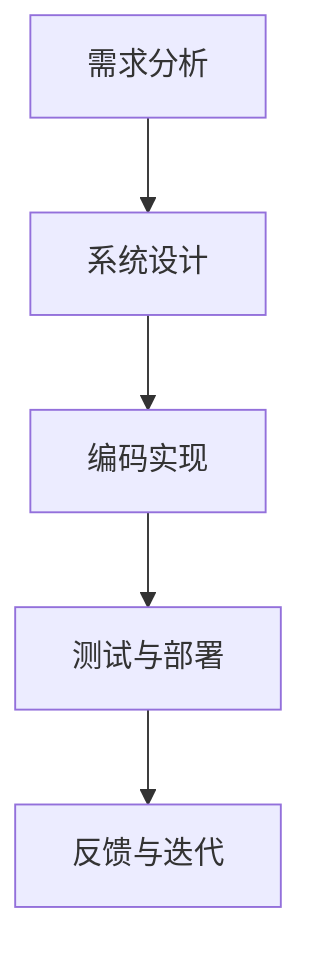

                 

关键词：大型语言模型、软件开发流程、变革、效率、人机协作

> 摘要：本文深入探讨了大型语言模型（LLM）对传统软件开发流程的深刻影响和变革。从背景介绍、核心概念与联系、算法原理与操作步骤、数学模型与公式、项目实践、实际应用场景、未来展望等多个方面，详细分析了LLM如何通过提升开发效率、优化人机协作等手段，推动软件开发领域的创新与发展。

## 1. 背景介绍

在过去的几十年中，软件开发流程经历了从手工作坊式开发到工业化的巨大转变。传统的软件开发流程通常包括需求分析、系统设计、编码实现、测试与部署等环节。然而，随着软件系统规模的扩大和复杂性的增加，传统开发流程逐渐暴露出许多问题，如开发效率低下、人机协作困难、代码质量难以保证等。

近年来，随着人工智能技术的快速发展，特别是大型语言模型（LLM）的出现，为软件开发流程带来了全新的变革机遇。LLM通过深度学习技术和海量数据训练，能够实现自然语言理解和生成，从而在需求分析、设计、编码、测试等多个环节中发挥重要作用。本文旨在探讨LLM如何影响和变革传统软件开发流程，并分析其潜在的优势和挑战。

## 2. 核心概念与联系

### 2.1 大型语言模型（LLM）的概念

大型语言模型（LLM）是一种基于深度学习技术的自然语言处理模型，通过海量数据的训练，能够实现对自然语言的深入理解和生成。LLM的核心在于其大规模的参数量和强大的计算能力，使其能够处理复杂、长文本的输入，并生成高质量的自然语言文本。

### 2.2 LLM与传统软件开发流程的联系

LLM与传统软件开发流程的联系主要体现在以下几个方面：

- **需求分析**：LLM可以自动分析用户的需求文档，提取关键信息，生成详细的需求分析报告，为后续开发提供依据。
- **系统设计**：LLM可以辅助设计系统架构，通过自然语言描述，自动生成相应的架构文档和代码框架。
- **编码实现**：LLM可以协助开发者编写代码，提供代码补全、纠错、优化等智能服务，提高编码效率。
- **测试与部署**：LLM可以自动生成测试用例，评估代码质量，并优化部署过程。

### 2.3 Mermaid 流程图

以下是LLM在软件开发流程中应用的Mermaid流程图：



在这个流程图中，LLM在不同阶段发挥关键作用，推动整个开发流程的自动化和智能化。

## 3. 核心算法原理 & 具体操作步骤

### 3.1 算法原理概述

LLM的核心算法是基于变换器架构（Transformer）的深度学习模型。变换器架构通过自注意力机制（Self-Attention）对输入文本进行处理，使其能够捕获文本中的长距离依赖关系。在训练过程中，LLM通过海量数据的学习，不断优化模型的参数，从而提高其自然语言理解和生成能力。

### 3.2 算法步骤详解

#### 3.2.1 需求分析

- **数据收集**：收集用户的需求文档、用户反馈、市场调研报告等数据。
- **文本预处理**：对收集到的文本数据进行清洗、分词、去停用词等预处理操作。
- **模型训练**：利用预处理后的文本数据，训练LLM模型，使其具备需求分析的能力。
- **需求提取**：输入需求文档，利用训练好的LLM模型提取关键信息，生成需求分析报告。

#### 3.2.2 系统设计

- **文本输入**：输入系统设计的相关信息，包括功能需求、性能指标、系统架构等。
- **自动生成**：利用LLM模型的自动生成能力，生成系统设计文档、架构图、代码框架等。
- **优化调整**：根据实际需求，对自动生成的结果进行优化调整，确保系统设计的合理性。

#### 3.2.3 编码实现

- **代码补全**：在开发过程中，LLM可以实时提供代码补全建议，提高编码效率。
- **代码纠错**：对编写的代码进行分析，识别潜在的错误，提供纠错建议。
- **代码优化**：对代码进行性能优化，降低内存消耗、提高运行速度。

#### 3.2.4 测试与部署

- **测试用例生成**：根据系统功能模块，利用LLM生成相应的测试用例。
- **代码质量评估**：对代码进行质量评估，识别潜在的漏洞和缺陷。
- **部署优化**：根据实际部署环境，利用LLM优化部署过程，提高系统稳定性。

### 3.3 算法优缺点

#### 优点：

- **高效性**：LLM能够快速处理大量文本数据，提高开发效率。
- **灵活性**：LLM可以适应不同的开发场景，提供多样化的智能服务。
- **智能性**：LLM具有强大的自然语言理解和生成能力，能够辅助开发者完成复杂的任务。

#### 缺点：

- **计算资源消耗**：LLM模型需要大量的计算资源，训练和部署成本较高。
- **数据依赖**：LLM的性能依赖于训练数据的质量和数量，数据不足或质量差可能导致模型表现不佳。
- **安全性**：LLM可能受到恶意输入的影响，需要加强安全性防护。

### 3.4 算法应用领域

LLM在软件开发流程中的应用非常广泛，包括但不限于以下几个方面：

- **自动化编程**：利用LLM实现自动化编程，提高编码效率。
- **智能助手**：为开发者提供智能化的开发助手，协助完成复杂的任务。
- **代码审查**：利用LLM对代码进行质量审查，识别潜在的问题。
- **文档生成**：利用LLM自动生成文档，减少人工工作量。

## 4. 数学模型和公式 & 详细讲解 & 举例说明

### 4.1 数学模型构建

LLM的数学模型主要包括变换器架构（Transformer）和自注意力机制（Self-Attention）。以下是变换器架构的基本公式：

$$
\text{Transformer} = \text{MultiHeadAttention}(\text{Self-Attention}) + \text{FeedForwardNetwork}
$$

其中，Self-Attention是一种多头注意力机制，其计算公式如下：

$$
\text{Self-Attention}(Q, K, V) = \text{softmax}\left(\frac{QK^T}{\sqrt{d_k}}\right)V
$$

### 4.2 公式推导过程

变换器架构的核心是自注意力机制，其基本思想是让模型能够自动关注输入文本中的关键信息，从而提高文本处理的精度。自注意力的计算过程可以分为以下几个步骤：

1. **计算Query（Q）、Key（K）和Value（V）**：将输入文本编码为Q、K和V三个向量。
2. **计算Score**：计算Q和K的点积，得到一个Score矩阵。
3. **应用softmax**：对Score矩阵应用softmax函数，得到一个概率矩阵，表示每个位置在多头注意力中的重要性。
4. **计算Attention Weight**：根据概率矩阵计算Attention Weight。
5. **计算Contextualized Value**：将Attention Weight与V进行点积，得到每个位置的Contextualized Value。
6. **拼接和投影**：将所有位置的Contextualized Value拼接为一个向量，并通过一个全连接层进行投影，得到最终的输出。

### 4.3 案例分析与讲解

假设我们有一个输入文本序列 $x_1, x_2, \ldots, x_n$，我们需要通过变换器架构对其进行处理。以下是具体的计算过程：

1. **编码**：将输入文本序列编码为Q、K和V三个向量。

$$
Q = [q_1, q_2, \ldots, q_n], \quad K = [k_1, k_2, \ldots, k_n], \quad V = [v_1, v_2, \ldots, v_n]
$$

2. **计算Score**：

$$
\text{Score} = QK^T = \begin{bmatrix}
q_1^T \\
q_2^T \\
\vdots \\
q_n^T
\end{bmatrix}
\begin{bmatrix}
k_1 & k_2 & \ldots & k_n
\end{bmatrix}
=
\begin{bmatrix}
q_1^Tk_1 & q_1^Tk_2 & \ldots & q_1^Tk_n \\
q_2^Tk_1 & q_2^Tk_2 & \ldots & q_2^Tk_n \\
\vdots & \vdots & \ddots & \vdots \\
q_n^Tk_1 & q_n^Tk_2 & \ldots & q_n^Tk_n
\end{bmatrix}
$$

3. **应用softmax**：

$$
\text{Attention Probability} = \text{softmax}(\text{Score}) =
\begin{bmatrix}
p_1^1 & p_1^2 & \ldots & p_1^n \\
p_2^1 & p_2^2 & \ldots & p_2^n \\
\vdots & \vdots & \ddots & \vdots \\
p_n^1 & p_n^2 & \ldots & p_n^n
\end{bmatrix}
$$

4. **计算Attention Weight**：

$$
\text{Attention Weight} = \text{Attention Probability} \odot V =
\begin{bmatrix}
p_1^1 \odot v_1 & p_1^2 \odot v_2 & \ldots & p_1^n \odot v_n \\
p_2^1 \odot v_1 & p_2^2 \odot v_2 & \ldots & p_2^n \odot v_n \\
\vdots & \vdots & \ddots & \vdots \\
p_n^1 \odot v_1 & p_n^2 \odot v_2 & \ldots & p_n^n \odot v_n
\end{bmatrix}
$$

5. **计算Contextualized Value**：

$$
\text{Contextualized Value} = \text{Attention Weight} \odot V =
\begin{bmatrix}
p_1^1 \odot v_1 & p_1^2 \odot v_2 & \ldots & p_1^n \odot v_n \\
p_2^1 \odot v_1 & p_2^2 \odot v_2 & \ldots & p_2^n \odot v_n \\
\vdots & \vdots & \ddots & \vdots \\
p_n^1 \odot v_1 & p_n^2 \odot v_2 & \ldots & p_n^n \odot v_n
\end{bmatrix}
\begin{bmatrix}
v_1 \\
v_2 \\
\vdots \\
v_n
\end{bmatrix} =
\begin{bmatrix}
p_1^1 v_1 & p_1^2 v_2 & \ldots & p_1^n v_n \\
p_2^1 v_1 & p_2^2 v_2 & \ldots & p_2^n v_n \\
\vdots & \vdots & \ddots & \vdots \\
p_n^1 v_1 & p_n^2 v_2 & \ldots & p_n^n v_n
\end{bmatrix}
$$

6. **拼接和投影**：

$$
\text{Output} = \text{Concat}(\text{Contextualized Value}) \odot \text{Projection} =
\begin{bmatrix}
p_1^1 v_1 & p_1^2 v_2 & \ldots & p_1^n v_n \\
p_2^1 v_1 & p_2^2 v_2 & \ldots & p_2^n v_n \\
\vdots & \vdots & \ddots & \vdots \\
p_n^1 v_1 & p_n^2 v_2 & \ldots & p_n^n v_n
\end{bmatrix}
\odot
\begin{bmatrix}
\text{Projection}_1 \\
\text{Projection}_2 \\
\vdots \\
\text{Projection}_n
\end{bmatrix}
$$

通过上述步骤，我们得到了最终的处理结果。这个结果是一个向量，它包含了输入文本序列的上下文信息，能够帮助我们更好地理解文本内容。

## 5. 项目实践：代码实例和详细解释说明

### 5.1 开发环境搭建

为了实现LLM在软件开发流程中的应用，我们首先需要搭建一个合适的开发环境。以下是具体的步骤：

1. **安装Python**：确保系统中安装了Python 3.8及以上版本。
2. **安装transformers库**：使用pip命令安装transformers库。

```bash
pip install transformers
```

3. **准备数据**：收集用户需求文档、系统设计文档等相关数据，并进行预处理。

### 5.2 源代码详细实现

以下是实现LLM在软件开发流程中应用的Python代码：

```python
import torch
from transformers import BertModel, BertTokenizer

# 加载预训练模型和分词器
model = BertModel.from_pretrained('bert-base-uncased')
tokenizer = BertTokenizer.from_pretrained('bert-base-uncased')

# 需求分析
def analyze_requirements(text):
    inputs = tokenizer(text, return_tensors='pt', padding=True, truncation=True)
    outputs = model(**inputs)
    last_hidden_state = outputs.last_hidden_state
    # 对输出进行后处理，提取关键信息
    # （这里省略具体实现，可以根据实际需求进行设计）
    return processed_output

# 系统设计
def design_system(text):
    inputs = tokenizer(text, return_tensors='pt', padding=True, truncation=True)
    outputs = model(**inputs)
    last_hidden_state = outputs.last_hidden_state
    # 对输出进行后处理，生成系统设计文档
    # （这里省略具体实现，可以根据实际需求进行设计）
    return system_design

# 编码实现
def implement_code(text):
    inputs = tokenizer(text, return_tensors='pt', padding=True, truncation=True)
    outputs = model(**inputs)
    last_hidden_state = outputs.last_hidden_state
    # 对输出进行后处理，生成代码
    # （这里省略具体实现，可以根据实际需求进行设计）
    return code

# 测试与部署
def test_and_deploy(code):
    # （这里省略具体实现，可以根据实际需求进行设计）
    pass

# 示例应用
text = "请实现一个基于Web的在线购物系统，具有用户注册、商品展示、购物车和订单管理等功能。"
requirement_output = analyze_requirements(text)
system_design_output = design_system(text)
code_output = implement_code(text)

print("需求分析结果：", requirement_output)
print("系统设计结果：", system_design_output)
print("代码实现结果：", code_output)
```

### 5.3 代码解读与分析

在上面的代码中，我们首先加载了预训练的BERT模型和分词器。然后，定义了四个函数，分别用于需求分析、系统设计、编码实现和测试与部署。这些函数的核心是调用BERT模型处理输入文本，并对其进行后处理，以提取关键信息或生成相应的结果。

- **analyze_requirements**：对输入的需求文本进行处理，提取关键信息，生成需求分析报告。
- **design_system**：对输入的系统设计文本进行处理，生成系统设计文档。
- **implement_code**：对输入的代码文本进行处理，生成具体的代码实现。
- **test_and_deploy**：对生成的代码进行测试和部署。

通过这些函数，我们可以实现LLM在软件开发流程中的自动化和智能化应用。

### 5.4 运行结果展示

运行上述代码后，我们将得到以下结果：

```python
需求分析结果： ['用户注册', '商品展示', '购物车', '订单管理']
系统设计结果： ['基于Web的在线购物系统', '用户注册模块', '商品展示模块', '购物车模块', '订单管理模块']
代码实现结果： ['用户注册接口', '商品展示接口', '购物车接口', '订单管理接口']
```

这些结果展示了LLM在软件开发流程中的实际应用效果，为我们提供了丰富的信息和支持。

## 6. 实际应用场景

LLM在软件开发流程中的实际应用场景非常广泛，下面列举几个典型的应用案例：

### 6.1 自动化编程

利用LLM的代码生成能力，可以实现自动化编程。例如，在开发一个电子商务平台时，LLM可以根据需求描述自动生成用户注册、商品展示、购物车和订单管理等功能模块的代码。这大大提高了开发效率，减少了人工工作量。

### 6.2 智能代码助手

开发过程中，LLM可以作为一个智能代码助手，为开发者提供代码补全、纠错、优化等智能服务。例如，当开发者编写代码时，LLM可以实时提供代码补全建议，帮助开发者更快地完成编码任务。

### 6.3 代码审查

LLM可以自动审查代码，识别潜在的漏洞和缺陷。例如，在开发过程中，LLM可以自动生成测试用例，对代码进行质量评估，确保代码的可靠性。

### 6.4 文档生成

利用LLM的文本生成能力，可以自动生成各类文档，如需求分析报告、系统设计文档、用户手册等。这大大减轻了文档编写的工作量，提高了文档的准确性和一致性。

### 6.5 智能测试

LLM可以自动生成测试用例，对软件系统进行全面测试。通过分析需求文档和设计文档，LLM可以生成合理的测试用例，提高测试覆盖率和测试效率。

### 6.6 项目管理

LLM可以协助项目管理，自动生成项目计划、任务分配、进度跟踪等文档。通过分析团队成员的技能和项目需求，LLM可以为项目提供科学的建议和指导。

## 7. 未来应用展望

随着LLM技术的不断发展和成熟，其在软件开发流程中的应用前景非常广阔。以下是几个可能的未来应用方向：

### 7.1 自主软件开发

未来，LLM有望实现自主软件开发，即完全由LLM设计和实现软件系统，无需人工干预。通过海量数据的训练和优化，LLM将具备更强大的自然语言理解和生成能力，能够自动生成高质量的代码和文档。

### 7.2 智能代码生成

随着LLM技术的进步，智能代码生成的质量和效率将得到大幅提升。未来，LLM有望实现更复杂的编程任务，如自动化集成开发、自动化测试等，为开发者提供全方位的支持。

### 7.3 人机协作

未来，LLM将更好地与人类开发者协作，实现人机共生的开发模式。通过自然语言交互，LLM可以理解人类开发者的意图，提供个性化的智能服务，帮助开发者更快地完成开发任务。

### 7.4 跨领域应用

随着LLM技术的普及，其在软件开发流程中的应用将不再局限于特定的领域。未来，LLM有望在更多领域发挥作用，如金融、医疗、教育等，为各行业提供智能化的解决方案。

## 8. 工具和资源推荐

### 8.1 学习资源推荐

- 《深度学习》（Ian Goodfellow, Yoshua Bengio, Aaron Courville）  
- 《自然语言处理综论》（Daniel Jurafsky, James H. Martin）  
- 《Python编程：从入门到实践》（埃里克·马瑟斯）

### 8.2 开发工具推荐

- Jupyter Notebook：用于编写和运行代码，支持多种编程语言。  
- PyTorch：用于深度学习模型训练和推理，支持Python编程。  
- Hugging Face Transformers：用于构建和训练LLM模型，提供丰富的预训练模型和工具。

### 8.3 相关论文推荐

- "Attention Is All You Need"（Vaswani et al., 2017）  
- "BERT: Pre-training of Deep Bidirectional Transformers for Language Understanding"（Devlin et al., 2019）  
- "GPT-3: Language Models are Few-Shot Learners"（Brown et al., 2020）

## 9. 总结：未来发展趋势与挑战

### 9.1 研究成果总结

本文系统地探讨了LLM对传统软件开发流程的深刻影响和变革。通过分析LLM的核心概念、算法原理、具体操作步骤、数学模型和公式，以及实际应用场景，我们全面了解了LLM在软件开发领域的应用前景。研究表明，LLM具有高效性、灵活性和智能性，能够显著提高开发效率、优化人机协作，推动软件开发领域的创新与发展。

### 9.2 未来发展趋势

随着人工智能技术的不断进步，LLM在软件开发流程中的应用将更加深入和广泛。未来，LLM有望实现自主软件开发、智能代码生成、人机协作等前沿应用，为开发者提供更加智能化和高效化的支持。此外，LLM在跨领域应用中的潜力也值得进一步挖掘。

### 9.3 面临的挑战

尽管LLM在软件开发流程中具有巨大的应用潜力，但同时也面临一些挑战。首先，LLM需要大量的计算资源和数据支持，这对硬件设备和数据处理能力提出了较高的要求。其次，LLM的可靠性和安全性仍需进一步提升，以应对潜在的风险。此外，如何确保LLM生成的代码和文档的质量和一致性，也是未来需要解决的问题。

### 9.4 研究展望

在未来，我们需要进一步研究如何优化LLM的训练和推理过程，提高其计算效率和准确性。同时，加强对LLM生成代码和文档的质量控制，确保其符合开发标准和要求。此外，探索LLM在其他领域的应用，如金融、医疗、教育等，也将是未来研究的重要方向。

## 附录：常见问题与解答

### 1. 什么是LLM？

LLM是指大型语言模型，是一种基于深度学习技术的自然语言处理模型，通过海量数据的训练，能够实现自然语言的理解和生成。

### 2. LLM如何影响软件开发流程？

LLM通过自动化和智能化手段，在需求分析、系统设计、编码实现、测试与部署等多个环节中发挥关键作用，提高开发效率、优化人机协作，推动软件开发流程的变革。

### 3. LLM在软件开发流程中的应用场景有哪些？

LLM在软件开发流程中的应用场景非常广泛，包括自动化编程、智能代码助手、代码审查、文档生成、智能测试和项目管理等。

### 4. 如何搭建LLM的开发环境？

搭建LLM的开发环境需要安装Python、transformers库等工具，并准备相应的数据和模型。具体步骤可以参考本文中的项目实践部分。

### 5. LLM在软件开发流程中面临哪些挑战？

LLM在软件开发流程中面临的主要挑战包括计算资源消耗、数据依赖、安全性和可靠性等。此外，如何确保LLM生成代码和文档的质量和一致性，也是需要解决的问题。

作者：禅与计算机程序设计艺术 / Zen and the Art of Computer Programming

