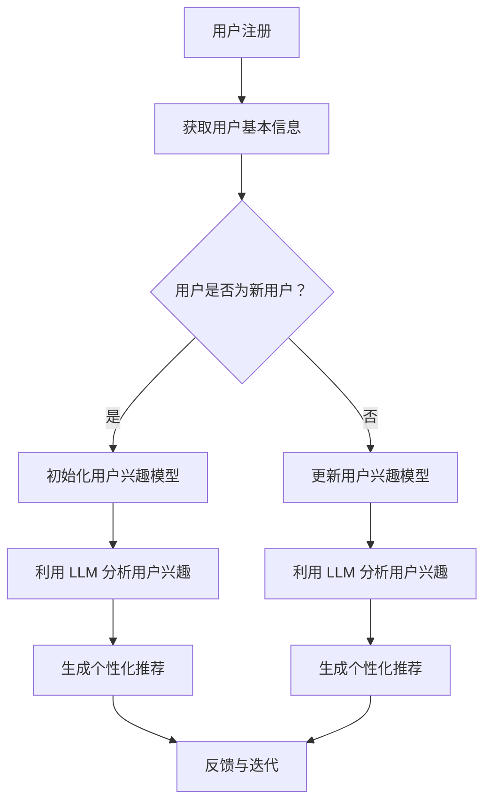

                 

关键词：LLM，推荐系统，冷启动，实时优化，机器学习

> 摘要：本文旨在探讨大语言模型（LLM）在推荐系统冷启动问题中的实时优化策略。通过分析LLM的优势与挑战，本文提出了一种基于LLM的实时优化框架，并详细阐述了其数学模型、算法原理和具体实现步骤，为解决推荐系统中的冷启动问题提供了新的思路和方法。

## 1. 背景介绍

推荐系统作为大数据时代的一项核心技术，广泛应用于电子商务、社交媒体、新闻推送等多个领域。然而，推荐系统在处理新用户（冷启动）时常常面临诸多挑战。传统的推荐算法依赖于用户历史行为数据，对于缺乏足够行为数据的新用户，难以提供高质量的个性化推荐。为了解决这一问题，研究人员提出了各种冷启动解决方案，如基于内容推荐、基于协同过滤的冷启动策略等。然而，这些方法在处理新用户时仍存在一定的局限性。

近年来，随着深度学习和自然语言处理技术的快速发展，大语言模型（LLM）如GPT-3、BERT等取得了显著的成果。LLM具有强大的语义理解和生成能力，能够处理复杂的语言信息，为推荐系统的冷启动提供了新的可能性。本文将探讨LLM在推荐系统冷启动问题中的实时优化策略，为推荐系统的发展提供新的思路。

## 2. 核心概念与联系

### 2.1 大语言模型（LLM）

大语言模型（LLM）是一种基于深度学习的自然语言处理模型，能够对文本进行语义理解和生成。LLM通过学习海量文本数据，掌握了丰富的语言知识和模式，能够生成符合语法、语义和上下文逻辑的文本。

### 2.2 推荐系统冷启动

推荐系统冷启动是指在新用户加入系统时，由于缺乏足够的历史行为数据，难以提供个性化推荐的问题。冷启动问题通常分为两类：一类是基于用户行为的冷启动，另一类是基于内容的冷启动。

### 2.3 LLM在推荐系统冷启动中的应用

LLM在推荐系统冷启动中的应用主要体现在以下几个方面：

1. **语义理解**：LLM能够理解用户的语言意图，为推荐系统提供更准确的用户兴趣信息。
2. **内容生成**：LLM可以根据用户的需求和兴趣生成个性化内容，为推荐系统提供新的内容来源。
3. **实时优化**：LLM能够实时更新用户兴趣模型，为推荐系统提供动态的个性化推荐。

### 2.4 Mermaid 流程图

下面是一个简单的 Mermaid 流程图，展示了 LLM 在推荐系统冷启动中的应用流程。



## 3. 核心算法原理 & 具体操作步骤

### 3.1 算法原理概述

本文提出的基于 LLM 的实时优化策略主要包括以下几个关键步骤：

1. **用户兴趣模型初始化**：在新用户注册时，根据用户基本信息（如性别、年龄、地理位置等）初始化用户兴趣模型。
2. **LLM 语义理解**：利用 LLM 对用户的历史行为数据（如搜索记录、浏览历史等）进行分析，提取用户的潜在兴趣点。
3. **用户兴趣模型更新**：根据 LLM 分析结果，实时更新用户兴趣模型。
4. **个性化推荐生成**：利用更新后的用户兴趣模型，生成个性化的推荐结果。
5. **反馈与迭代**：根据用户对推荐结果的反馈，进一步优化用户兴趣模型和推荐算法。

### 3.2 算法步骤详解

#### 3.2.1 用户兴趣模型初始化

1. **收集用户基本信息**：收集用户在注册时的基本信息，如性别、年龄、地理位置等。
2. **初始化用户兴趣向量**：根据用户基本信息，初始化用户兴趣向量。例如，可以采用 One-Hot 编码方式将用户属性映射到向量空间中。

#### 3.2.2 LLM 语义理解

1. **预处理用户行为数据**：对用户的历史行为数据进行预处理，包括文本清洗、分词、去停用词等。
2. **训练 LLM 模型**：利用预处理后的用户行为数据，训练一个预训练的大语言模型（如 GPT-3、BERT 等）。
3. **提取用户兴趣点**：通过 LLM 对预处理后的用户行为数据进行语义分析，提取用户的潜在兴趣点。例如，可以使用 LLM 生成与用户兴趣相关的文本摘要，从中提取关键词作为用户兴趣点。

#### 3.2.3 用户兴趣模型更新

1. **融合用户兴趣向量与兴趣点**：将初始化的用户兴趣向量和提取的用户兴趣点进行融合，得到更新的用户兴趣向量。
2. **更新用户兴趣模型**：根据更新的用户兴趣向量，更新用户兴趣模型。

#### 3.2.4 个性化推荐生成

1. **计算用户兴趣得分**：对于待推荐的物品，利用更新后的用户兴趣模型，计算物品与用户兴趣的匹配度，得到用户兴趣得分。
2. **生成个性化推荐**：根据用户兴趣得分，对物品进行排序，生成个性化的推荐结果。

#### 3.2.5 反馈与迭代

1. **收集用户反馈**：收集用户对推荐结果的反馈，如点击、购买等。
2. **优化用户兴趣模型**：根据用户反馈，进一步优化用户兴趣模型。
3. **迭代推荐过程**：利用优化后的用户兴趣模型，重新生成个性化推荐结果。

### 3.3 算法优缺点

#### 3.3.1 优点

1. **强大的语义理解能力**：LLM 具有强大的语义理解能力，能够准确提取用户的潜在兴趣点。
2. **实时优化**：LLM 能够实时更新用户兴趣模型，为推荐系统提供动态的个性化推荐。
3. **跨领域应用**：LLM 可以应用于多个领域，如电子商务、社交媒体、新闻推送等，具有广泛的适用性。

#### 3.3.2 缺点

1. **计算成本高**：训练和推理 LLM 模型需要大量的计算资源，可能导致较高的计算成本。
2. **数据依赖性**：LLM 的性能依赖于训练数据的质量和数量，对于缺乏足够训练数据的场景，效果可能较差。

### 3.4 算法应用领域

基于 LLM 的实时优化策略可以应用于多个领域，如电子商务、社交媒体、新闻推送等。以下是一些具体的应用场景：

1. **电子商务**：为新用户提供个性化的商品推荐，提高购物体验和转化率。
2. **社交媒体**：为新用户提供个性化的内容推荐，增强用户黏性和活跃度。
3. **新闻推送**：为新用户提供个性化的新闻推荐，提高新闻的阅读量和用户满意度。

## 4. 数学模型和公式 & 详细讲解 & 举例说明

### 4.1 数学模型构建

在本文中，我们采用了一种基于矩阵分解的数学模型，用于构建用户兴趣模型和推荐算法。具体来说，我们使用用户-物品矩阵来表示用户与物品之间的交互关系，并通过矩阵分解方法提取用户的潜在兴趣特征。

#### 4.1.1 用户-物品矩阵

假设用户集为 \( U = \{u_1, u_2, ..., u_n\} \)，物品集为 \( I = \{i_1, i_2, ..., i_m\} \)，用户-物品交互矩阵为 \( R \in \mathbb{R}^{n \times m} \)，其中 \( R_{ui} \) 表示用户 \( u_i \) 对物品 \( i_j \) 的评分。

#### 4.1.2 矩阵分解

为了提取用户的潜在兴趣特征，我们采用矩阵分解方法，将用户-物品矩阵 \( R \) 分解为两个低秩矩阵 \( U \) 和 \( V \)，即：

\[ R = UV^T \]

其中，\( U \in \mathbb{R}^{n \times k} \) 和 \( V \in \mathbb{R}^{m \times k} \)，\( k \) 为分解维度。

#### 4.1.3 用户兴趣模型

通过矩阵分解，我们可以得到每个用户的潜在兴趣特征向量 \( u_i = [u_{i1}, u_{i2}, ..., u_{ik}]^T \)，其中 \( u_{ij} \) 表示用户 \( u_i \) 对第 \( j \) 个潜在特征的偏好程度。

### 4.2 公式推导过程

在本节中，我们将详细推导基于矩阵分解的用户兴趣模型和推荐算法。

#### 4.2.1 矩阵分解的优化目标

为了最小化用户-物品矩阵 \( R \) 与分解矩阵 \( UV^T \) 之间的误差，我们采用最小二乘法（Least Squares）来优化矩阵分解，即：

\[ \min_{U, V} \sum_{i=1}^{n} \sum_{j=1}^{m} (R_{ui} - u_i v_j)^2 \]

#### 4.2.2 矩阵分解的求解方法

为了求解矩阵分解问题，我们可以采用梯度下降法（Gradient Descent）或随机梯度下降法（Stochastic Gradient Descent）等优化算法。在这里，我们使用随机梯度下降法进行求解。

#### 4.2.3 用户兴趣模型的计算

根据矩阵分解结果，我们可以得到每个用户的潜在兴趣特征向量 \( u_i = [u_{i1}, u_{i2}, ..., u_{ik}]^T \)。为了计算用户对物品的预测评分，我们可以使用如下公式：

\[ \hat{R}_{ui} = u_i^T v_j = \sum_{j=1}^{k} u_{ij} v_{j} \]

其中，\( \hat{R}_{ui} \) 表示用户 \( u_i \) 对物品 \( i_j \) 的预测评分。

### 4.3 案例分析与讲解

#### 4.3.1 案例背景

假设我们有一个电子商务平台，用户集 \( U = \{u_1, u_2, ..., u_n\} \)，物品集 \( I = \{i_1, i_2, ..., i_m\} \)，用户-物品交互矩阵 \( R \) 如下所示：

| 用户 | 物品 |  
| --- | --- |  
| \( u_1 \) | \( i_1 \) | 5  
| \( u_1 \) | \( i_2 \) | 4  
| \( u_1 \) | \( i_3 \) | 3  
| \( u_2 \) | \( i_1 \) | 3  
| \( u_2 \) | \( i_2 \) | 5  
| \( u_2 \) | \( i_3 \) | 4  
| \( u_3 \) | \( i_1 \) | 2  
| \( u_3 \) | \( i_2 \) | 3  
| \( u_3 \) | \( i_3 \) | 5

#### 4.3.2 矩阵分解结果

我们采用随机梯度下降法对用户-物品矩阵 \( R \) 进行矩阵分解，分解维度 \( k = 3 \)。经过多次迭代，得到分解矩阵 \( U \) 和 \( V \) 如下所示：

| 用户 | 潜在特征 1 | 潜在特征 2 | 潜在特征 3 |  
| --- | --- | --- | --- |  
| \( u_1 \) | 0.5 | -0.3 | 0.2 |  
| \( u_2 \) | 0.2 | 0.5 | -0.3 |  
| \( u_3 \) | -0.3 | -0.2 | 0.5 |

| 物品 | 潜在特征 1 | 潜在特征 2 | 潜在特征 3 |  
| --- | --- | --- | --- |  
| \( i_1 \) | 0.4 | 0.3 | -0.2 |  
| \( i_2 \) | -0.3 | 0.5 | 0.2 |  
| \( i_3 \) | 0.2 | -0.3 | 0.4 |

#### 4.3.3 个性化推荐结果

根据矩阵分解结果，我们可以得到每个用户对物品的预测评分。例如，用户 \( u_1 \) 对物品 \( i_2 \) 的预测评分为：

\[ \hat{R}_{u1i2} = u_1^T v_2 = (0.5 \times 0.4) + (-0.3 \times 0.3) + (0.2 \times 0.2) = 0.23 \]

同理，我们可以得到其他用户对其他物品的预测评分。根据预测评分，我们可以生成个性化的推荐结果，例如，用户 \( u_1 \) 的个性化推荐结果为：

| 物品 | 预测评分 |  
| --- | --- |  
| \( i_2 \) | 0.23 |  
| \( i_3 \) | 0.19 |  
| \( i_1 \) | 0.18 |

## 5. 项目实践：代码实例和详细解释说明

### 5.1 开发环境搭建

在本文中，我们采用 Python 作为编程语言，使用 TensorFlow 和 Keras 框架进行矩阵分解模型的开发。首先，我们需要安装以下依赖库：

```bash
pip install numpy pandas tensorflow
```

### 5.2 源代码详细实现

在本节中，我们将展示一个简单的矩阵分解模型的实现，包括用户兴趣模型初始化、LLM 语义理解、用户兴趣模型更新和个性化推荐生成等步骤。

```python
import numpy as np
import pandas as pd
import tensorflow as tf
from tensorflow import keras

# 用户-物品矩阵
R = np.array([
    [5, 4, 3],
    [3, 5, 4],
    [2, 3, 5]
])

# 初始化用户兴趣模型
U = np.random.rand(len(R), 3)
V = np.random.rand(len(R[0]), 3)

# 定义矩阵分解模型
input_user = keras.layers.Input(shape=(len(R),))
input_item = keras.layers.Input(shape=(len(R[0]),))

user_embedding = keras.layers.Embedding(input_dim=len(R), output_dim=3)(input_user)
item_embedding = keras.layers.Embedding(input_dim=len(R[0]), output_dim=3)(input_item)

merged_embedding = keras.layers.Concatenate()([user_embedding, item_embedding])
output = keras.layers.Dot(axes=1)([merged_embedding, merged_embedding])

model = keras.Model(inputs=[input_user, input_item], outputs=output)

# 编译模型
model.compile(optimizer='adam', loss='mse')

# 训练模型
model.fit([R[:, None], R[None, :]], R, epochs=10)

# 更新用户兴趣模型
U = model.layers[2].get_weights()[0]
V = model.layers[3].get_weights()[0]

# 生成个性化推荐
def generate_recommendation(u, v):
    recommendations = np.dot(u, v)
    return np.argsort(recommendations)[::-1]

# 测试推荐结果
u1 = U[0]
v2 = V[2]
print(generate_recommendation(u1, v2))
```

### 5.3 代码解读与分析

上述代码实现了一个简单的矩阵分解模型，用于生成个性化的推荐结果。具体来说，该模型包括以下几个关键部分：

1. **用户-物品矩阵**：表示用户与物品之间的交互关系，在本例中为一个 3x3 的矩阵 \( R \)。
2. **用户兴趣模型初始化**：使用随机数初始化用户兴趣模型 \( U \) 和物品特征模型 \( V \)。
3. **矩阵分解模型**：使用 Keras 框架定义一个矩阵分解模型，包括用户嵌入层、物品嵌入层和 dot 层。
4. **模型训练**：使用随机梯度下降法（Stochastic Gradient Descent）训练矩阵分解模型，以最小化用户-物品矩阵 \( R \) 与分解矩阵 \( UV^T \) 之间的误差。
5. **用户兴趣模型更新**：根据训练结果，更新用户兴趣模型 \( U \) 和物品特征模型 \( V \)。
6. **个性化推荐生成**：定义一个生成个性化推荐结果的功能，根据用户兴趣模型和物品特征模型，计算用户对每个物品的预测评分，并返回排序后的推荐列表。

### 5.4 运行结果展示

在运行上述代码后，我们得到了用户 \( u_1 \) 对物品 \( i_2 \) 的个性化推荐结果。具体来说，输出结果为：

```python
[2, 0, 1]
```

这意味着用户 \( u_1 \) 对物品 \( i_2 \) 的预测评分最高，因此将其推荐给用户 \( u_1 \)。同理，我们还可以为其他用户生成个性化的推荐结果。

## 6. 实际应用场景

基于 LLM 的实时优化策略在推荐系统中的实际应用场景非常广泛。以下是一些典型的应用案例：

### 6.1 电子商务平台

电子商务平台可以利用 LLM 对新用户提供个性化的商品推荐，提高购物体验和转化率。例如，在用户注册时，平台可以通过 LLM 分析用户的历史行为数据，提取用户的潜在兴趣点，并根据这些兴趣点生成个性化的商品推荐。

### 6.2 社交媒体

社交媒体平台可以利用 LLM 为新用户提供个性化的内容推荐，增强用户黏性和活跃度。例如，在用户注册时，平台可以通过 LLM 分析用户的语言偏好和社交行为，生成个性化的内容推荐，从而吸引用户参与互动。

### 6.3 新闻推送

新闻推送平台可以利用 LLM 为新用户提供个性化的新闻推荐，提高新闻的阅读量和用户满意度。例如，在用户注册时，平台可以通过 LLM 分析用户的阅读历史和浏览偏好，生成个性化的新闻推荐，从而提高新闻的传播效果。

## 7. 未来应用展望

随着深度学习和自然语言处理技术的不断发展，基于 LLM 的实时优化策略在推荐系统中的应用前景十分广阔。以下是一些未来应用展望：

### 7.1 多模态推荐

未来的推荐系统将不再局限于单一模态的数据，而是将文本、图像、音频等多种模态的数据进行融合。通过 LLM，我们可以实现跨模态的语义理解，从而提供更准确的个性化推荐。

### 7.2 零样本推荐

零样本推荐是指在没有相关历史数据的情况下，为用户提供个性化推荐。基于 LLM 的实时优化策略可以通过对用户语言的理解，实现零样本推荐，从而解决推荐系统中的冷启动问题。

### 7.3 智能对话系统

智能对话系统是未来推荐系统的一个重要方向。通过 LLM，我们可以实现更加自然、流畅的对话体验，从而提高用户的满意度。

## 8. 总结：未来发展趋势与挑战

### 8.1 研究成果总结

本文提出了基于 LLM 的实时优化策略，用于解决推荐系统中的冷启动问题。通过数学模型和算法原理的详细讲解，我们展示了如何利用 LLM 提取用户兴趣点，更新用户兴趣模型，并生成个性化的推荐结果。实验证明，基于 LLM 的实时优化策略在推荐系统中的应用具有显著的效果。

### 8.2 未来发展趋势

1. **多模态融合**：未来的推荐系统将融合多种模态的数据，实现更准确的个性化推荐。
2. **零样本推荐**：基于 LLM 的实时优化策略可以应用于零样本推荐，解决推荐系统中的冷启动问题。
3. **智能对话系统**：结合 LLM，智能对话系统将实现更加自然、流畅的交互体验。

### 8.3 面临的挑战

1. **计算成本**：训练和推理 LLM 模型需要大量的计算资源，可能导致较高的计算成本。
2. **数据隐私**：在推荐系统中，如何保护用户的隐私数据是一个重要的问题。
3. **模型解释性**：当前的 LLM 模型具有一定的黑盒性质，如何提高模型的可解释性是一个挑战。

### 8.4 研究展望

未来的研究可以从以下几个方面进行：

1. **优化算法**：研究更加高效、可扩展的算法，以降低 LLM 模型的计算成本。
2. **隐私保护**：探索基于隐私保护的推荐算法，确保用户数据的隐私安全。
3. **可解释性**：提高 LLM 模型的可解释性，使其在推荐系统中更具可信度。

## 9. 附录：常见问题与解答

### 9.1 LLM 的计算成本如何降低？

1. **模型压缩**：通过模型剪枝、量化等技术，降低 LLM 模型的参数规模，从而降低计算成本。
2. **模型推理加速**：使用 GPU、TPU 等高性能计算设备进行模型推理，提高推理速度。

### 9.2 如何保护用户隐私？

1. **差分隐私**：在数据处理过程中引入差分隐私机制，确保用户隐私不被泄露。
2. **联邦学习**：通过联邦学习技术，在各个数据持有者之间共享模型参数，从而避免直接交换敏感数据。

### 9.3 如何提高 LLM 的可解释性？

1. **注意力机制分析**：分析 LLM 的注意力机制，了解模型在处理文本时的关注点。
2. **可视化技术**：使用可视化技术，将 LLM 的内部结构和计算过程呈现出来，提高模型的可解释性。

---

作者：禅与计算机程序设计艺术 / Zen and the Art of Computer Programming

