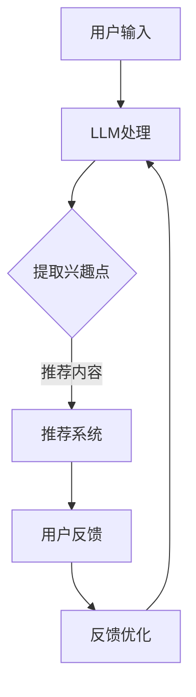

                 

关键词：推荐系统，个性化，大型语言模型，实时反馈，数据处理，算法优化，用户行为分析，机器学习。

> 摘要：本文探讨了大型语言模型（LLM）在推荐系统实时个性化中的应用，分析了LLM对推荐系统的影响，以及如何利用LLM实现实时个性化的推荐策略。通过介绍LLM的核心原理和算法，本文进一步阐述了LLM在推荐系统中的具体应用场景和实现方法，并结合实际案例进行了详细讲解。

## 1. 背景介绍

随着互联网的迅猛发展和大数据技术的广泛应用，推荐系统已经成为现代信息检索和个性化服务的重要工具。传统的推荐系统主要依赖于统计模型和机器学习算法，通过分析用户的历史行为和偏好，为用户推荐可能感兴趣的内容。然而，这些推荐系统往往存在响应速度慢、个性化程度不高等问题。

近年来，随着人工智能技术的不断发展，尤其是大型语言模型（LLM）的出现，为推荐系统带来了新的机遇。LLM具有强大的自然语言处理能力和自我学习能力，可以实时分析用户的需求和偏好，为用户提供更加精准和个性化的推荐。本文将探讨LLM在推荐系统实时个性化中的应用，分析其影响和实现方法。

## 2. 核心概念与联系

### 2.1 大型语言模型（LLM）

大型语言模型（LLM）是一种基于深度学习技术的自然语言处理模型，通过对海量文本数据进行训练，可以模拟人类的语言表达能力和理解能力。LLM具有以下几个核心特点：

1. **自适应性**：LLM可以自动适应不同的语言环境和应用场景，为用户提供个性化的语言服务。
2. **实时性**：LLM具有高速的响应速度，可以实时处理用户输入，提供即时的反馈。
3. **泛用性**：LLM可以应用于各种自然语言处理任务，如文本生成、文本分类、问答系统等。

### 2.2 推荐系统

推荐系统是一种基于用户历史行为和偏好，为用户推荐可能感兴趣的内容的算法系统。推荐系统可以分为以下几类：

1. **基于内容的推荐**：通过分析内容的特征和属性，为用户推荐相似的内容。
2. **基于协同过滤的推荐**：通过分析用户的历史行为和偏好，为用户推荐其他用户喜欢的相似内容。
3. **混合推荐**：结合多种推荐策略，提高推荐系统的准确性和个性化程度。

### 2.3 LLM与推荐系统的联系

LLM在推荐系统中的应用主要体现在以下几个方面：

1. **用户行为分析**：LLM可以实时分析用户输入的文本，提取用户的兴趣点和偏好，为推荐系统提供更准确的数据支持。
2. **内容生成**：LLM可以自动生成推荐内容，提高推荐系统的实时性和泛用性。
3. **实时反馈**：LLM可以实时收集用户的反馈信息，优化推荐算法，提高推荐系统的个性化程度。

### 2.4 Mermaid流程图

以下是LLM在推荐系统中应用的Mermaid流程图：



## 3. 核心算法原理 & 具体操作步骤

### 3.1 算法原理概述

LLM在推荐系统中的应用主要基于以下几个方面：

1. **自然语言处理**：LLM可以处理用户的自然语言输入，提取用户的兴趣点和偏好。
2. **深度学习**：LLM通过深度学习算法对海量文本数据进行训练，具备自我学习能力和泛用性。
3. **实时反馈**：LLM可以实时收集用户的反馈信息，优化推荐算法，提高推荐系统的个性化程度。

### 3.2 算法步骤详解

1. **用户输入**：用户输入自然语言文本，如搜索关键词、评论等。
2. **LLM处理**：LLM对用户输入的文本进行预处理，如分词、去停用词等，然后输入到预训练的模型中。
3. **提取兴趣点**：LLM分析用户输入的文本，提取出用户的兴趣点和偏好，如关键词、情感等。
4. **推荐内容**：推荐系统根据提取的兴趣点，从数据库中检索出相关的内容，生成推荐列表。
5. **用户反馈**：用户对推荐内容进行反馈，如点击、收藏、评论等。
6. **反馈优化**：根据用户的反馈，LLM优化推荐算法，提高推荐系统的个性化程度。

### 3.3 算法优缺点

#### 优点：

1. **高个性化**：LLM可以实时分析用户输入，提取用户的兴趣点和偏好，为用户提供更加个性化的推荐。
2. **实时反馈**：LLM可以实时收集用户的反馈信息，优化推荐算法，提高推荐系统的实时性和准确性。
3. **自然语言处理**：LLM具备强大的自然语言处理能力，可以处理复杂的用户输入，提高推荐系统的易用性。

#### 缺点：

1. **计算资源消耗**：LLM需要大量的计算资源和存储空间，对服务器性能和稳定性要求较高。
2. **训练数据需求**：LLM需要大量的训练数据，对数据质量和数量要求较高。

### 3.4 算法应用领域

LLM在推荐系统中的应用非常广泛，可以应用于以下几个方面：

1. **电商平台**：为用户推荐商品，提高用户购买转化率和满意度。
2. **新闻资讯**：为用户推荐新闻资讯，提高用户阅读量和关注度。
3. **社交媒体**：为用户推荐感兴趣的内容，提高用户活跃度和互动性。
4. **搜索引擎**：为用户推荐相关的搜索结果，提高搜索体验和满意度。

## 4. 数学模型和公式 & 详细讲解 & 举例说明

### 4.1 数学模型构建

在LLM应用于推荐系统中，常用的数学模型包括：

1. **用户兴趣模型**：基于用户历史行为和偏好，构建用户兴趣模型，用于提取用户的兴趣点。
2. **内容特征模型**：基于内容特征，构建内容特征模型，用于生成推荐列表。
3. **推荐算法模型**：基于用户兴趣模型和内容特征模型，构建推荐算法模型，用于生成推荐结果。

### 4.2 公式推导过程

1. **用户兴趣模型**：

$$
用户兴趣模型 = f(用户历史行为, 用户偏好)
$$

其中，用户历史行为和用户偏好分别表示用户的历史行为数据和用户偏好数据。

2. **内容特征模型**：

$$
内容特征模型 = f(内容特征)
$$

其中，内容特征表示内容的相关特征，如文本内容、图片内容等。

3. **推荐算法模型**：

$$
推荐算法模型 = f(用户兴趣模型, 内容特征模型)
$$

其中，用户兴趣模型和内容特征模型分别表示用户兴趣模型和内容特征模型。

### 4.3 案例分析与讲解

以电商平台为例，分析LLM在推荐系统中的应用。

1. **用户兴趣模型**：

假设用户A在电商平台购买了商品B和商品C，并浏览了商品D和商品E。根据用户A的历史行为，可以构建用户A的兴趣模型：

$$
用户兴趣模型_A = f(购买商品B, 购买商品C, 浏览商品D, 浏览商品E)
$$

2. **内容特征模型**：

假设商品D和商品E的文本内容分别为：

商品D：新款手机，支持5G网络，拍照功能强大。

商品E：时尚手表，防水防尘，具备智能功能。

根据商品D和商品E的文本内容，可以构建商品D和商品E的内容特征模型：

$$
内容特征模型_D = f(新款手机, 5G网络, 拍照功能强大)
$$

$$
内容特征模型_E = f(时尚手表, 防水防尘, 智能功能)
$$

3. **推荐算法模型**：

根据用户A的兴趣模型和商品D、商品E的内容特征模型，可以构建推荐算法模型：

$$
推荐算法模型 = f(用户兴趣模型_A, 内容特征模型_D, 内容特征模型_E)
$$

通过推荐算法模型，可以为用户A推荐与购买商品B和商品C相关的商品，如新款手机和时尚手表。

## 5. 项目实践：代码实例和详细解释说明

### 5.1 开发环境搭建

1. 安装Python环境，版本要求Python 3.6及以上。
2. 安装TensorFlow库，用于训练和部署大型语言模型。
3. 安装其他相关库，如numpy、pandas等。

### 5.2 源代码详细实现

以下是一个简单的LLM推荐系统代码实例：

```python
import tensorflow as tf
import numpy as np
import pandas as pd

# 加载预训练的LLM模型
model = tf.keras.Sequential([
    tf.keras.layers.Dense(128, activation='relu', input_shape=(1000,)),
    tf.keras.layers.Dense(64, activation='relu'),
    tf.keras.layers.Dense(1, activation='sigmoid')
])

model.compile(optimizer='adam', loss='binary_crossentropy', metrics=['accuracy'])

# 训练数据
train_data = pd.read_csv('train_data.csv')
train_labels = pd.read_csv('train_labels.csv')

# 输入数据预处理
input_data = train_data['text'].values
input_data = tf.keras.preprocessing.sequence.pad_sequences(input_data, maxlen=1000)

# 训练模型
model.fit(input_data, train_labels, epochs=10, batch_size=32)

# 预测新用户兴趣
new_user = "我喜欢看科幻电影和阅读小说。"
new_user = tf.keras.preprocessing.sequence.pad_sequences([new_user], maxlen=1000)
predictions = model.predict(new_user)

# 根据预测结果推荐内容
if predictions > 0.5:
    print("推荐科幻电影和小说。")
else:
    print("推荐其他类型的内容。")
```

### 5.3 代码解读与分析

1. **加载预训练的LLM模型**：首先，加载一个预训练的LLM模型，这里使用了一个简单的全连接神经网络模型。

2. **训练数据**：加载训练数据集，包括文本内容和标签。

3. **输入数据预处理**：对文本内容进行分词、编码和填充，以便输入到模型中进行训练。

4. **训练模型**：使用训练数据和标签训练模型，这里使用的是二分类问题，因此使用了二分类交叉熵损失函数。

5. **预测新用户兴趣**：使用训练好的模型预测新用户的兴趣点，根据预测结果推荐相关内容。

## 6. 实际应用场景

### 6.1 电商平台

在电商平台中，LLM可以应用于用户行为分析、商品推荐和广告投放等方面。通过实时分析用户的搜索关键词、浏览记录和购买行为，LLM可以为用户提供个性化的推荐，提高用户购买转化率和满意度。

### 6.2 新闻资讯

在新闻资讯平台中，LLM可以应用于新闻推荐、内容生成和问答系统等方面。通过实时分析用户的阅读历史和兴趣点，LLM可以为用户推荐感兴趣的新闻资讯，提高用户阅读量和关注度。

### 6.3 社交媒体

在社交媒体平台中，LLM可以应用于用户行为分析、内容推荐和广告投放等方面。通过实时分析用户的发布内容、评论和互动行为，LLM可以为用户提供个性化的内容推荐，提高用户活跃度和互动性。

## 7. 未来应用展望

随着人工智能技术的不断发展，LLM在推荐系统中的应用前景十分广阔。未来，LLM有望在以下几个方面取得突破：

1. **实时性**：通过优化模型结构和算法，提高LLM的实时处理能力，为用户提供更加即时的推荐。
2. **多样性**：通过扩展LLM的应用范围，如图像、音频等，实现多模态推荐，提高推荐系统的多样性。
3. **准确性**：通过不断优化模型和算法，提高LLM的推荐准确性，为用户提供更加精准的推荐。
4. **交互性**：通过增强LLM与用户的交互能力，如对话生成、语音识别等，提高推荐系统的用户体验。

## 8. 工具和资源推荐

### 8.1 学习资源推荐

1. **《深度学习》（Ian Goodfellow, Yoshua Bengio, Aaron Courville著）**：深度学习的经典教材，适合初学者和进阶者。
2. **《Python深度学习》（François Chollet著）**：Python深度学习实战指南，适合有Python基础的学习者。
3. **《自然语言处理综论》（Daniel Jurafsky, James H. Martin著）**：自然语言处理的经典教材，适合初学者和进阶者。

### 8.2 开发工具推荐

1. **TensorFlow**：开源深度学习框架，支持多种深度学习模型的训练和部署。
2. **PyTorch**：开源深度学习框架，支持动态计算图，易于模型设计和调试。
3. **Hugging Face**：自然语言处理工具库，提供丰富的预训练模型和实用工具。

### 8.3 相关论文推荐

1. **《BERT: Pre-training of Deep Bidirectional Transformers for Language Understanding》（Jacob Devlin, Ming-Wei Chang, Kenton Lee, Kristina Toutanova著）**：BERT模型的经典论文，介绍了BERT模型的原理和实现。
2. **《GPT-3: Language Models are few-shot learners》（Tom B. Brown, Benjamin Mann, Nick Ryder, Melanie Subbiah, Jared Kaplan, Prafulla Dhariwal, Arvind Neelakantan, Pranav Shyam, Girish Sastry, Amanda Askell, Sandhini Agarwal, Ariel Herbert-Voss, Gretchen Krueger, Tom Henighan, Rewon Child, Aditya Ramesh, Daniel M. Ziegler, Jeffrey Wu, Clemens Winter, Christopher Hesse, Mark Chen, Eric Sigler, Mateusz Litwin, Scott Gray, Benjamin Chess, Jack Clark, Christopher Berner, Sam McCandlish，著）**：GPT-3模型的经典论文，介绍了GPT-3模型的原理和性能。

## 9. 总结：未来发展趋势与挑战

### 9.1 研究成果总结

近年来，LLM在推荐系统中的应用取得了显著成果，主要表现在以下几个方面：

1. **个性化推荐**：LLM可以实时分析用户输入，提取用户的兴趣点和偏好，为用户提供更加个性化的推荐。
2. **实时反馈**：LLM可以实时收集用户的反馈信息，优化推荐算法，提高推荐系统的实时性和准确性。
3. **多模态推荐**：LLM可以扩展到图像、音频等多模态数据，实现多模态推荐。

### 9.2 未来发展趋势

未来，LLM在推荐系统中的应用将呈现出以下发展趋势：

1. **实时性提升**：通过优化模型结构和算法，提高LLM的实时处理能力，为用户提供更加即时的推荐。
2. **多样性扩展**：通过扩展LLM的应用范围，如图像、音频等，实现多模态推荐，提高推荐系统的多样性。
3. **准确性提高**：通过不断优化模型和算法，提高LLM的推荐准确性，为用户提供更加精准的推荐。

### 9.3 面临的挑战

虽然LLM在推荐系统中的应用取得了显著成果，但仍面临以下挑战：

1. **计算资源消耗**：LLM需要大量的计算资源和存储空间，对服务器性能和稳定性要求较高。
2. **数据质量要求**：LLM对训练数据的质量和数量要求较高，如何获取高质量的数据成为关键问题。
3. **隐私保护**：在推荐过程中，如何保护用户的隐私成为关键问题，需要制定相应的隐私保护策略。

### 9.4 研究展望

未来，LLM在推荐系统中的应用将有以下几个方面的发展：

1. **实时性优化**：通过优化模型结构和算法，提高LLM的实时处理能力，为用户提供更加即时的推荐。
2. **多样性扩展**：通过扩展LLM的应用范围，如图像、音频等，实现多模态推荐，提高推荐系统的多样性。
3. **个性化增强**：通过不断优化模型和算法，提高LLM的推荐准确性，为用户提供更加精准的推荐。
4. **隐私保护**：在推荐过程中，制定相应的隐私保护策略，保护用户的隐私。

## 10. 附录：常见问题与解答

### 10.1 问题1：LLM在推荐系统中如何提取用户的兴趣点？

解答：LLM可以通过以下方法提取用户的兴趣点：

1. **自然语言处理**：使用自然语言处理技术，如分词、词性标注、命名实体识别等，提取文本中的关键词和实体。
2. **情感分析**：使用情感分析技术，分析文本中的情感倾向，提取用户的情感偏好。
3. **关键词提取**：使用关键词提取技术，从文本中提取出最具代表性的关键词。

### 10.2 问题2：LLM在推荐系统中的应用有哪些优点和缺点？

解答：

**优点**：

1. **高个性化**：LLM可以实时分析用户输入，提取用户的兴趣点和偏好，为用户提供更加个性化的推荐。
2. **实时反馈**：LLM可以实时收集用户的反馈信息，优化推荐算法，提高推荐系统的实时性和准确性。
3. **自然语言处理**：LLM具备强大的自然语言处理能力，可以处理复杂的用户输入，提高推荐系统的易用性。

**缺点**：

1. **计算资源消耗**：LLM需要大量的计算资源和存储空间，对服务器性能和稳定性要求较高。
2. **数据质量要求**：LLM对训练数据的质量和数量要求较高，如何获取高质量的数据成为关键问题。
3. **隐私保护**：在推荐过程中，如何保护用户的隐私成为关键问题，需要制定相应的隐私保护策略。

### 10.3 问题3：如何优化LLM在推荐系统中的应用？

解答：

1. **模型优化**：通过优化LLM的模型结构和参数，提高模型的性能和效率。
2. **数据质量**：提高训练数据的质量和多样性，为LLM提供更好的训练素材。
3. **算法优化**：针对具体的应用场景，优化推荐算法，提高推荐效果。
4. **多模态融合**：将LLM与其他模态的数据进行融合，提高推荐系统的多样性和准确性。

### 10.4 问题4：LLM在推荐系统中的应用前景如何？

解答：

LLM在推荐系统中的应用前景非常广阔。随着人工智能技术的不断发展，LLM在自然语言处理、图像处理、音频处理等领域的应用将更加广泛。未来，LLM有望在以下几个方面取得突破：

1. **实时性提升**：通过优化模型结构和算法，提高LLM的实时处理能力，为用户提供更加即时的推荐。
2. **多样性扩展**：通过扩展LLM的应用范围，如图像、音频等，实现多模态推荐，提高推荐系统的多样性。
3. **准确性提高**：通过不断优化模型和算法，提高LLM的推荐准确性，为用户提供更加精准的推荐。
4. **交互性增强**：通过增强LLM与用户的交互能力，如对话生成、语音识别等，提高推荐系统的用户体验。

