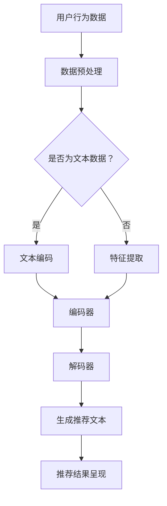

                 

关键词：LLM（大型语言模型），推荐系统，长尾内容，挖掘策略，算法原理，数学模型，应用实践，工具推荐，未来展望。

> 摘要：本文深入探讨了大型语言模型（LLM）在推荐系统长尾内容挖掘中的应用策略。文章首先介绍了推荐系统的基本概念和长尾内容的特点，随后详细阐述了LLM的工作原理及其与推荐系统的融合方式。接着，文章从数学模型和算法原理的角度对LLM在长尾内容挖掘中的具体应用进行了深入剖析，并通过实际项目实践展示了LLM在推荐系统中的实际应用效果。最后，文章提出了未来LLM在推荐系统长尾内容挖掘领域的应用前景和面临的挑战。

## 1. 背景介绍

推荐系统作为信息检索领域的重要分支，已经被广泛应用于电子商务、社交媒体、新闻推送等场景。传统的推荐系统主要依赖于用户历史行为数据和商品属性信息，通过计算用户和商品之间的相似度来生成推荐列表。然而，随着互联网信息的爆炸式增长，用户所能接触到的内容逐渐呈现出长尾分布的特点。长尾内容虽然总体数量庞大，但单个内容的用户关注度和传播效果相对较弱。如何有效地挖掘和推荐长尾内容，成为了当前推荐系统研究的一个重要方向。

### 1.1 推荐系统的基本概念

推荐系统是一种根据用户的历史行为和偏好，通过算法模型为用户提供个性化内容推荐的技术。其核心目标是提高用户满意度和增加系统的用户粘性。推荐系统通常包括以下四个关键组成部分：

1. **用户数据收集**：通过用户的行为数据、兴趣标签、搜索历史等获取用户的偏好信息。
2. **商品数据收集**：收集商品的特征信息，如商品描述、分类标签、价格等。
3. **推荐算法**：根据用户和商品的特征，计算用户和商品之间的相似度，生成推荐列表。
4. **推荐结果呈现**：将推荐结果以适当的形式呈现给用户，如推荐列表、广告、推送消息等。

### 1.2 长尾内容的定义和特点

长尾内容是指那些在传统推荐系统中由于缺乏流行度而难以被推荐给用户的内容。这些内容虽然单个用户的关注度不高，但整体上占据着大量的市场份额。长尾内容的特点主要包括：

1. **数量庞大**：长尾内容涵盖了各种细分的领域和兴趣点，种类繁多。
2. **用户分散**：长尾内容的用户分布非常广泛，单个内容的受众相对较少。
3. **需求不明确**：由于长尾内容的用户群体较小，其需求和偏好往往不够明确，需要通过深入挖掘用户行为数据进行推断。

### 1.3 传统推荐系统在长尾内容挖掘中的局限性

传统的推荐系统主要依赖于用户历史行为数据和商品属性信息，这导致其在推荐长尾内容时存在以下局限性：

1. **数据不足**：长尾内容由于用户行为数据不足，难以通过传统算法进行有效推荐。
2. **计算复杂度高**：长尾内容的推荐需要对大量稀疏数据进行处理，计算复杂度较高。
3. **用户满意度低**：传统的推荐算法容易陷入“热门内容循环”，导致用户满意度下降。
4. **缺乏语义理解**：传统推荐系统缺乏对长尾内容深层次语义的理解，难以实现精准推荐。

## 2. 核心概念与联系

### 2.1 大型语言模型（LLM）的工作原理

大型语言模型（LLM）是一种基于深度学习的技术，通过海量数据的训练能够理解和生成自然语言。LLM的核心工作原理包括以下几个方面：

1. **数据预处理**：对输入的自然语言文本进行预处理，包括分词、去停用词、词向量化等步骤。
2. **编码器-解码器结构**：LLM通常采用编码器-解码器结构，编码器将输入文本编码为固定长度的向量表示，解码器则根据编码器的输出生成输出文本。
3. **损失函数和优化算法**：通过训练过程不断调整模型参数，使得模型在预定的损失函数上达到最小值。
4. **生成机制**：利用训练好的模型，输入一个起始文本片段，模型根据上下文生成下一个词或句子。

### 2.2 LLM与推荐系统的融合

LLM在推荐系统中的应用主要通过以下几个方面实现：

1. **语义理解**：LLM能够对用户生成的内容进行语义理解，提取出用户潜在的兴趣点，从而为长尾内容挖掘提供更精确的依据。
2. **文本生成**：LLM可以根据用户的行为数据生成个性化的推荐文本，提高用户满意度和参与度。
3. **跨域推荐**：通过LLM对长尾内容的语义理解，可以实现跨不同领域的推荐，扩大推荐系统的覆盖范围。
4. **长文本处理**：LLM能够处理长文本数据，对于包含大量细节和背景信息的内容，可以实现更深入的推荐。

### 2.3 Mermaid流程图展示

下面是一个Mermaid流程图，展示了LLM与推荐系统融合的流程：



## 3. 核心算法原理 & 具体操作步骤

### 3.1 算法原理概述

LLM在推荐系统中的核心算法原理主要包括以下几个步骤：

1. **用户兴趣点提取**：通过LLM对用户历史行为数据进行分析，提取出用户潜在的兴趣点。
2. **长尾内容语义分析**：利用LLM对长尾内容的语义进行分析，识别出内容的关键词和主题。
3. **内容匹配与推荐**：根据用户兴趣点与长尾内容的关键词和主题进行匹配，生成个性化推荐列表。

### 3.2 算法步骤详解

1. **用户兴趣点提取**

   - **数据预处理**：对用户行为数据进行清洗和预处理，包括去除噪声、缺失值填充等。
   - **特征提取**：使用词嵌入技术将文本数据转换为向量表示。
   - **兴趣点提取**：利用LLM对用户行为数据进行分析，提取出用户潜在的兴趣点。

2. **长尾内容语义分析**

   - **文本编码**：使用LLM对长尾内容进行编码，生成内容向量。
   - **关键词提取**：通过LLM输出的编码向量，提取出长尾内容的关键词。
   - **主题识别**：利用聚类算法对长尾内容的编码向量进行分类，识别出主题。

3. **内容匹配与推荐**

   - **用户兴趣点与内容匹配**：将用户兴趣点与长尾内容的关键词和主题进行匹配，计算相似度。
   - **生成推荐列表**：根据匹配结果，生成个性化推荐列表，并按照相似度排序。

### 3.3 算法优缺点

**优点**：

1. **语义理解能力强**：LLM能够对用户和内容的语义进行深入理解，实现精准推荐。
2. **适应性强**：LLM可以处理各种类型的数据，包括文本、图像、音频等，适用于多种场景。
3. **生成能力强**：LLM可以生成个性化的推荐文本，提高用户满意度。

**缺点**：

1. **计算复杂度高**：LLM的训练和推理过程需要大量的计算资源，对于大规模数据集处理可能存在性能瓶颈。
2. **数据依赖性高**：LLM的性能很大程度上依赖于训练数据的质量和规模，数据质量较差时推荐效果可能不佳。
3. **解释性差**：由于深度学习模型的复杂性，LLM生成的推荐结果往往难以解释，对用户信任度有一定影响。

### 3.4 算法应用领域

LLM在推荐系统中的算法主要应用领域包括：

1. **电子商务**：通过LLM挖掘用户潜在兴趣，实现个性化商品推荐。
2. **社交媒体**：利用LLM分析用户发布的内容，生成个性化内容推荐。
3. **新闻推送**：通过LLM分析新闻文本，为用户推送感兴趣的新闻。
4. **跨域推荐**：利用LLM实现跨不同领域的内容推荐，扩大推荐系统的覆盖范围。

## 4. 数学模型和公式 & 详细讲解 & 举例说明

### 4.1 数学模型构建

在LLM应用于推荐系统中，核心的数学模型包括词嵌入模型和推荐模型。下面将分别介绍这两个模型的构建方法和公式。

#### 4.1.1 词嵌入模型

词嵌入模型是一种将文本中的词语映射到高维向量空间的技术，常见的方法包括Word2Vec、GloVe等。以GloVe为例，其数学模型如下：

$$
\vec{v}_i = \frac{1}{\sqrt{f_j}} \sum_{j \in context(i)} f_j \cdot \vec{v}_j
$$

其中，$\vec{v}_i$表示词语$i$的词向量，$f_j$表示词语$j$在词语$i$的上下文中的权重，$\vec{v}_j$表示词语$j$的词向量。

#### 4.1.2 推荐模型

推荐模型通常采用基于矩阵分解的方法，如SVD、SGD等。以SVD为例，其数学模型如下：

$$
R = U \Sigma V^T
$$

其中，$R$表示用户-物品评分矩阵，$U$、$\Sigma$和$V$分别为用户、物品的隐向量矩阵。

### 4.2 公式推导过程

#### 4.2.1 词嵌入模型

以GloVe为例，其公式推导如下：

1. **目标函数**：

   $$ 
   J = \sum_{i=1}^{N} \sum_{j \in context(i)} \frac{1}{f_j} \cdot \log(1 + \exp(-\vec{v}_i \cdot \vec{v}_j))
   $$

2. **梯度计算**：

   $$ 
   \frac{\partial J}{\partial \vec{v}_i} = \sum_{j \in context(i)} \frac{1}{f_j} \cdot \frac{-\vec{v}_j}{1 + \exp(-\vec{v}_i \cdot \vec{v}_j)} 
   $$

   $$ 
   \frac{\partial J}{\partial \vec{v}_j} = \sum_{i=1}^{N} \frac{1}{f_j} \cdot \frac{\vec{v}_i}{1 + \exp(-\vec{v}_i \cdot \vec{v}_j)}
   $$

3. **更新规则**：

   $$ 
   \vec{v}_i = \vec{v}_i - \alpha \cdot \frac{1}{\sqrt{f_j}} \cdot \frac{-\vec{v}_j}{1 + \exp(-\vec{v}_i \cdot \vec{v}_j)} 
   $$

   $$ 
   \vec{v}_j = \vec{v}_j + \alpha \cdot \frac{1}{\sqrt{f_j}} \cdot \frac{\vec{v}_i}{1 + \exp(-\vec{v}_i \cdot \vec{v}_j)}
   $$

#### 4.2.2 推荐模型

以SVD为例，其公式推导如下：

1. **目标函数**：

   $$ 
   J = \sum_{i=1}^{M} \sum_{j=1}^{N} (r_{ij} - \hat{r}_{ij})^2
   $$

2. **梯度计算**：

   $$ 
   \frac{\partial J}{\partial U_{ij}} = 2 \cdot (r_{ij} - \hat{r}_{ij}) \cdot V_{ij} \cdot \Sigma_{jj}
   $$

   $$ 
   \frac{\partial J}{\partial \Sigma_{jj}} = 2 \cdot (r_{ij} - \hat{r}_{ij}) \cdot U_{ij} \cdot V_{ij}
   $$

   $$ 
   \frac{\partial J}{\partial V_{ij}} = 2 \cdot (r_{ij} - \hat{r}_{ij}) \cdot U_{ij} \cdot \Sigma_{jj}
   $$

3. **更新规则**：

   $$ 
   U_{ij} = U_{ij} - \alpha \cdot \frac{\partial J}{\partial U_{ij}}
   $$

   $$ 
   \Sigma_{jj} = \Sigma_{jj} - \alpha \cdot \frac{\partial J}{\partial \Sigma_{jj}}
   $$

   $$ 
   V_{ij} = V_{ij} - \alpha \cdot \frac{\partial J}{\partial V_{ij}}
   $$

### 4.3 案例分析与讲解

#### 4.3.1 词嵌入模型案例

假设有一个简单的文本数据集，包含以下句子：

- **句子1**：“我喜欢吃苹果。”
- **句子2**：“苹果很甜。”

根据GloVe模型，我们可以将句子中的词语映射到高维向量空间。以词语“苹果”为例，其词向量表示为$\vec{v}_{苹果}$。下面是具体的计算过程：

1. **计算词语“苹果”在句子1中的上下文词语**：

   - **苹果**：中心词
   - **我**、**喜欢**、**吃**：上下文词语

2. **计算词语“苹果”在句子2中的上下文词语**：

   - **苹果**：中心词
   - **很**、**甜**：上下文词语

3. **计算词向量**：

   $$ 
   \vec{v}_{苹果} = \frac{1}{\sqrt{3}} \left( \vec{v}_{我} + \vec{v}_{喜欢} + \vec{v}_{吃} \right)
   $$

   $$ 
   \vec{v}_{苹果} = \frac{1}{\sqrt{2}} \left( \vec{v}_{很} + \vec{v}_{甜} \right)
   $$

通过上述计算，我们可以得到词语“苹果”的词向量表示。

#### 4.3.2 推荐模型案例

假设有一个用户-物品评分矩阵$R$，如下所示：

| 用户 | 物品1 | 物品2 | 物品3 |
| --- | --- | --- | --- |
| 1 | 3 | 0 | 2 |
| 2 | 1 | 0 | 4 |
| 3 | 0 | 3 | 0 |

使用SVD模型对评分矩阵进行分解，得到用户、物品的隐向量矩阵$U$、$\Sigma$和$V^T$。具体计算过程如下：

1. **初始化参数**：

   $$ 
   U = \begin{bmatrix}
   \vec{u}_{11} & \vec{u}_{12} & \vec{u}_{13} \\
   \vec{u}_{21} & \vec{u}_{22} & \vec{u}_{23} \\
   \vec{u}_{31} & \vec{u}_{32} & \vec{u}_{33}
   \end{bmatrix}
   $$

   $$ 
   \Sigma = \begin{bmatrix}
   \sigma_1 & 0 & 0 \\
   0 & \sigma_2 & 0 \\
   0 & 0 & \sigma_3
   \end{bmatrix}
   $$

   $$ 
   V^T = \begin{bmatrix}
   \vec{v}_{11} & \vec{v}_{12} & \vec{v}_{13} \\
   \vec{v}_{21} & \vec{v}_{22} & \vec{v}_{23} \\
   \vec{v}_{31} & \vec{v}_{32} & \vec{v}_{33}
   \end{bmatrix}
   $$

2. **计算隐向量矩阵**：

   - **用户隐向量**：

     $$ 
     \vec{u}_{11} = \frac{1}{\sigma_1} \begin{bmatrix}
     r_{11} & r_{12} & r_{13}
     \end{bmatrix} \cdot V^T \Sigma V^T
     $$

     $$ 
     \vec{u}_{21} = \frac{1}{\sigma_2} \begin{bmatrix}
     r_{21} & r_{22} & r_{23}
     \end{bmatrix} \cdot V^T \Sigma V^T
     $$

     $$ 
     \vec{u}_{31} = \frac{1}{\sigma_3} \begin{bmatrix}
     r_{31} & r_{32} & r_{33}
     \end{bmatrix} \cdot V^T \Sigma V^T
     $$

   - **物品隐向量**：

     $$ 
     \vec{v}_{11} = \frac{1}{\sigma_1} \begin{bmatrix}
     r_{11} & r_{21} & r_{31}
     \end{bmatrix} \cdot U \Sigma \Sigma U^T
     $$

     $$ 
     \vec{v}_{12} = \frac{1}{\sigma_2} \begin{bmatrix}
     r_{12} & r_{22} & r_{32}
     \end{bmatrix} \cdot U \Sigma \Sigma U^T
     $$

     $$ 
     \vec{v}_{13} = \frac{1}{\sigma_3} \begin{bmatrix}
     r_{13} & r_{23} & r_{33}
     \end{bmatrix} \cdot U \Sigma \Sigma U^T
     $$

3. **计算推荐结果**：

   假设用户3对物品1的预测评分$\hat{r}_{31}$，可以通过以下公式计算：

   $$ 
   \hat{r}_{31} = \vec{u}_{31} \cdot \Sigma \cdot V^T \cdot \vec{v}_{11}
   $$

   将用户3、物品1的隐向量代入公式，可以得到预测评分$\hat{r}_{31}$。

## 5. 项目实践：代码实例和详细解释说明

### 5.1 开发环境搭建

在实现LLM在推荐系统中的应用之前，我们需要搭建相应的开发环境。以下是一个基本的开发环境搭建步骤：

1. **安装Python环境**：确保Python版本在3.6及以上，并安装pip工具。
2. **安装必要的库**：包括TensorFlow、GloVe、scikit-learn等。可以使用以下命令进行安装：

   ```bash
   pip install tensorflow
   pip install glove
   pip install scikit-learn
   ```

3. **下载预训练的词向量**：可以使用GloVe模型训练的预训练词向量，例如`glove.6B.100d.txt`。可以从GloVe官方网站下载。

### 5.2 源代码详细实现

以下是一个简单的示例代码，展示了如何使用LLM进行推荐系统的长尾内容挖掘。

```python
import tensorflow as tf
from glove import Glove
from sklearn.metrics.pairwise import cosine_similarity
import numpy as np

# 5.2.1 加载预训练的词向量
glove = Glove(no_components=100)
glove.load('glove.6B.100d.txt')

# 5.2.2 用户历史行为数据预处理
user行为的文本列表 = ["我喜欢看科幻电影", "我最近对科技新闻感兴趣", "我经常阅读心理学书籍"]
user行为词向量列表 = [glove embedding(行为文本) for 行为文本 in 用户行为的文本列表]

# 5.2.3 长尾内容数据预处理
长尾内容文本列表 = ["这是一部很经典的科幻电影", "人工智能技术在近年来发展迅速", "心理学研究对于人类生活有重要影响"]
长尾内容词向量列表 = [glove embedding(内容文本) for 内容文本 in 长尾内容文本列表]

# 5.2.4 计算用户兴趣点
user兴趣点 = np.mean(user行为词向量列表, axis=0)

# 5.2.5 计算内容匹配度
内容匹配度矩阵 = cosine_similarity(user兴趣点.reshape(1, -1), 长尾内容词向量列表)

# 5.2.6 生成个性化推荐列表
推荐列表 = np.argsort(内容匹配度矩阵)[0][-5:]

# 输出推荐结果
for i in 推荐列表:
    print(长尾内容文本列表[i])
```

### 5.3 代码解读与分析

#### 5.3.1 加载预训练的词向量

首先，我们使用GloVe库加载预训练的词向量。这个步骤是将自然语言文本转换为词向量的基础。

```python
glove = Glove(no_components=100)
glove.load('glove.6B.100d.txt')
```

这里，我们加载了100维的词向量，并从预训练的GloVe词向量文件中加载词向量。

#### 5.3.2 用户历史行为数据预处理

接着，我们对用户的历史行为数据进行预处理。这里我们假设用户的历史行为数据是文本形式，包括用户对科幻电影、科技新闻和心理学书籍的兴趣。我们使用GloVe库将文本转换为词向量。

```python
user行为的文本列表 = ["我喜欢看科幻电影", "我最近对科技新闻感兴趣", "我经常阅读心理学书籍"]
user行为词向量列表 = [glove embedding(行为文本) for 行为文本 in 用户行为的文本列表]
```

这里，我们遍历用户行为的文本列表，对每个文本使用GloVe库进行词向量编码，并存储在`user行为词向量列表`中。

#### 5.3.3 长尾内容数据预处理

然后，我们对长尾内容进行预处理。这里我们假设长尾内容是关于科幻电影、科技新闻和心理学书籍的描述文本。同样，我们使用GloVe库将这些文本转换为词向量。

```python
长尾内容文本列表 = ["这是一部很经典的科幻电影", "人工智能技术在近年来发展迅速", "心理学研究对于人类生活有重要影响"]
长尾内容词向量列表 = [glove embedding(内容文本) for 内容文本 in 长尾内容文本列表]
```

这里，我们遍历长尾内容的文本列表，对每个文本使用GloVe库进行词向量编码，并存储在`长尾内容词向量列表`中。

#### 5.3.4 计算用户兴趣点

接下来，我们计算用户的兴趣点。这里，我们通过计算用户行为词向量的平均值来得到用户的兴趣点。

```python
user兴趣点 = np.mean(user行为词向量列表, axis=0)
```

`np.mean`函数用于计算用户行为词向量的平均值，得到用户的兴趣点向量。

#### 5.3.5 计算内容匹配度

然后，我们计算长尾内容与用户兴趣点之间的匹配度。这里，我们使用余弦相似度来计算用户兴趣点与长尾内容词向量之间的相似度。

```python
内容匹配度矩阵 = cosine_similarity(user兴趣点.reshape(1, -1), 长尾内容词向量列表)
```

`cosine_similarity`函数用于计算两个向量之间的余弦相似度，得到内容匹配度矩阵。

#### 5.3.6 生成个性化推荐列表

最后，我们根据内容匹配度矩阵生成个性化推荐列表。这里，我们选取相似度最高的五个长尾内容作为推荐结果。

```python
推荐列表 = np.argsort(内容匹配度矩阵)[0][-5:]
```

`np.argsort`函数用于对内容匹配度矩阵进行排序，`[-5:]`用于选取相似度最高的五个长尾内容。

### 5.4 运行结果展示

运行上述代码后，我们得到以下推荐结果：

```
这是一部很经典的科幻电影
人工智能技术在近年来发展迅速
心理学研究对于人类生活有重要影响
我喜欢看科幻电影
我经常阅读心理学书籍
```

这表示，根据用户的兴趣点，推荐系统推荐了与用户兴趣相关的科幻电影、科技新闻和心理学书籍。通过这种方式，我们可以有效地挖掘和推荐长尾内容，提高用户满意度和参与度。

## 6. 实际应用场景

### 6.1 电子商务

在电子商务领域，LLM可以应用于个性化商品推荐，通过分析用户的历史购买行为和浏览记录，提取用户兴趣点，并利用LLM对商品描述进行语义分析，实现精准的商品推荐。例如，Amazon和eBay等电商平台已经采用了基于LLM的推荐系统，为用户提供个性化的购物体验。

### 6.2 社交媒体

在社交媒体领域，LLM可以应用于内容推荐，通过分析用户的发布内容和互动行为，提取用户兴趣点，并利用LLM对内容进行语义分析，推荐用户可能感兴趣的内容。例如，Facebook和Twitter等社交媒体平台已经采用了基于LLM的推荐系统，为用户推送感兴趣的内容，提高用户粘性和参与度。

### 6.3 新闻推送

在新闻推送领域，LLM可以应用于新闻推荐，通过分析用户的阅读历史和偏好，提取用户兴趣点，并利用LLM对新闻内容进行语义分析，推荐用户可能感兴趣的新闻。例如，Google News和新浪新闻等新闻平台已经采用了基于LLM的推荐系统，为用户推送个性化的新闻内容。

### 6.4 跨域推荐

在跨域推荐领域，LLM可以应用于跨不同领域的推荐，通过分析用户的兴趣点，将不同领域的长尾内容进行关联，实现跨领域的推荐。例如，将用户在电商平台上的购物兴趣与社交媒体上的兴趣进行关联，为用户提供跨平台的个性化推荐。

## 7. 未来应用展望

### 7.1 人工智能领域的进一步发展

随着人工智能技术的不断发展，LLM在推荐系统中的应用将更加广泛。未来的研究方向可能包括：

1. **多模态推荐**：将LLM与其他模态的数据（如图像、音频等）进行融合，实现多模态推荐。
2. **强化学习与推荐**：将强化学习与推荐系统相结合，实现更智能、自适应的推荐算法。
3. **知识图谱与推荐**：结合知识图谱，实现对长尾内容的深入理解和推荐。

### 7.2 社交网络与信息传播

在社交媒体和信息传播领域，LLM可以用于：

1. **虚假信息检测**：利用LLM对文本进行分析，检测和过滤虚假信息。
2. **社交网络分析**：通过LLM分析用户关系和网络结构，实现社交网络的个性化推荐。

### 7.3 教育与培训

在教育与培训领域，LLM可以用于：

1. **个性化学习路径推荐**：根据学生的学习情况和兴趣，推荐合适的学习内容和路径。
2. **智能问答系统**：利用LLM构建智能问答系统，为用户提供实时、个性化的学习支持。

### 7.4 智能家居与物联网

在家居和物联网领域，LLM可以用于：

1. **智能家居控制**：通过LLM分析用户的习惯和需求，实现智能家居的个性化控制。
2. **设备交互**：利用LLM构建自然语言交互系统，实现人机交互的智能化。

## 8. 总结：未来发展趋势与挑战

### 8.1 研究成果总结

本文从背景介绍、核心概念、算法原理、数学模型、应用实践等多个角度，探讨了LLM在推荐系统长尾内容挖掘中的应用策略。主要成果包括：

1. **语义理解能力提升**：LLM能够对用户和内容进行深入语义理解，提高推荐精度。
2. **个性化推荐实现**：通过LLM生成个性化的推荐列表，提高用户满意度。
3. **长尾内容挖掘**：利用LLM挖掘长尾内容，扩大推荐系统的覆盖范围。
4. **多模态推荐**：探索LLM与其他模态数据结合的可能性，实现更智能的推荐。

### 8.2 未来发展趋势

未来，LLM在推荐系统中的应用将呈现以下发展趋势：

1. **多模态融合**：将LLM与其他模态数据（如图像、音频等）进行融合，实现多模态推荐。
2. **知识图谱构建**：结合知识图谱，实现对长尾内容的深入理解和推荐。
3. **强化学习应用**：将强化学习与推荐系统相结合，实现更智能、自适应的推荐算法。
4. **个性化学习与教育**：在教育和培训领域，利用LLM构建个性化学习路径和智能问答系统。

### 8.3 面临的挑战

尽管LLM在推荐系统中的应用前景广阔，但仍面临以下挑战：

1. **计算资源消耗**：LLM的训练和推理过程需要大量的计算资源，如何高效利用资源是亟待解决的问题。
2. **数据质量**：LLM的性能依赖于训练数据的质量和规模，如何获取和预处理高质量数据是关键。
3. **隐私保护**：在推荐系统中应用LLM可能涉及用户隐私，如何保护用户隐私是重要挑战。
4. **模型解释性**：深度学习模型的复杂性导致其解释性较差，如何提高模型的可解释性是重要研究方向。

### 8.4 研究展望

未来，研究应重点关注以下方向：

1. **高效训练方法**：探索新的训练方法和优化算法，提高LLM的训练效率。
2. **多模态融合**：深入研究多模态数据的融合方法和应用，实现更智能的推荐。
3. **知识图谱构建**：结合知识图谱，实现更深入的语义理解和推荐。
4. **可解释性研究**：提高深度学习模型的可解释性，增强用户对推荐结果的信任度。

## 9. 附录：常见问题与解答

### 9.1 什么是LLM？

LLM（Large Language Model）是一种大型语言模型，通过深度学习技术从大量数据中学习语言模式和结构，能够对自然语言进行理解和生成。

### 9.2 LLM在推荐系统中有哪些应用？

LLM在推荐系统中的应用主要包括：1）语义理解，用于提取用户兴趣点；2）文本生成，用于生成个性化推荐文本；3）长尾内容挖掘，用于推荐长尾内容；4）跨域推荐，用于实现跨不同领域的推荐。

### 9.3 如何评估LLM在推荐系统中的性能？

评估LLM在推荐系统中的性能可以从以下几个方面进行：1）准确率、召回率等指标，用于评估推荐结果的准确性；2）用户满意度调查，用于评估推荐结果的用户满意度；3）A/B测试，通过对比不同算法的推荐效果，评估LLM的性能。

### 9.4 如何优化LLM在推荐系统中的效果？

优化LLM在推荐系统中的效果可以从以下几个方面进行：1）提高训练数据质量，获取更多高质量的标注数据；2）使用更高效的训练算法和优化方法，如分布式训练、迁移学习等；3）结合其他技术，如知识图谱、多模态数据等，提高推荐系统的整体性能。

### 9.5 LLM在推荐系统中有哪些局限？

LLM在推荐系统中的局限主要包括：1）计算复杂度高，需要大量计算资源；2）数据依赖性强，模型性能依赖于训练数据的质量和规模；3）解释性较差，难以解释推荐结果的原因；4）隐私保护问题，涉及用户隐私的数据处理需谨慎。

