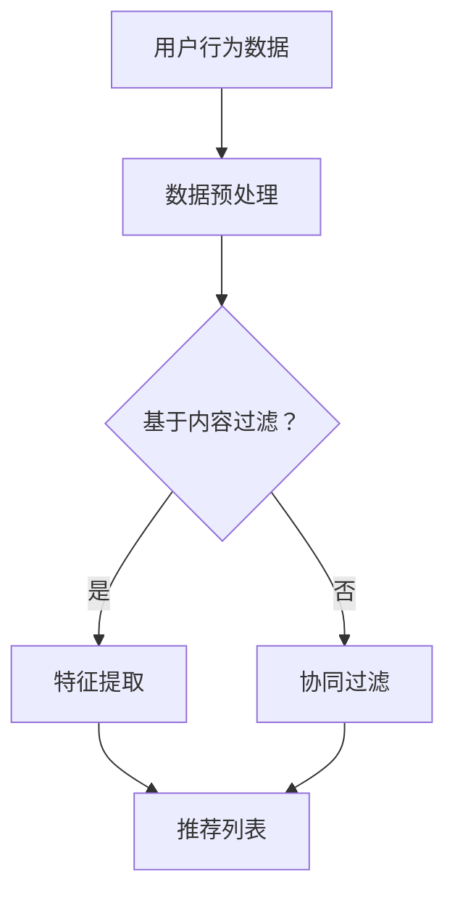

                 

关键词：大语言模型（LLM），推荐系统，长期效果，算法优化，数据处理，技术应用，案例分析。

## 摘要

本文旨在探讨大语言模型（LLM）在推荐系统中的应用及其对系统长期效果的影响。通过回顾推荐系统的历史发展、核心概念，以及介绍LLM的基本原理，文章将分析LLM如何改变推荐系统的数据处理、算法设计和效果评估。进一步，本文将通过案例研究和实验结果，展示LLM在推荐系统中的应用效果及其潜在挑战。最后，文章将讨论LLM在推荐系统中的未来发展方向，并提出相关建议和展望。

## 1. 背景介绍

推荐系统作为一种信息过滤和内容发现的方法，旨在为用户提供个性化的信息或商品推荐。自1990年代以来，推荐系统经历了从基于内容的过滤、协同过滤到深度学习的转变。然而，传统推荐系统在处理复杂用户行为和海量数据时仍面临诸多挑战。

近年来，大语言模型（LLM）的兴起为推荐系统带来了新的机遇。LLM如GPT-3、BERT等，具有强大的文本生成和理解能力，能够处理复杂的信息和情感。然而，LLM在推荐系统中的应用仍处于探索阶段，其长期效果和稳定性尚未得到充分验证。

本文的研究目的是探讨LLM在推荐系统中的应用场景、优势以及面临的挑战，以期为未来LLM与推荐系统的融合提供理论和实践指导。

## 2. 核心概念与联系

### 2.1 推荐系统基础概念

推荐系统主要包括用户、物品和评分三个核心概念。

- **用户**：推荐系统的核心参与者，其行为数据包括浏览、搜索、购买等。
- **物品**：推荐系统中的对象，可以是商品、新闻、音乐等。
- **评分**：用户对物品的评价，通常表示用户对物品的偏好程度。

### 2.2 传统推荐系统算法

传统推荐系统主要包括基于内容的过滤（Content-based Filtering）和协同过滤（Collaborative Filtering）两种。

- **基于内容的过滤**：通过分析物品的特征和用户的兴趣，推荐相似的内容。
- **协同过滤**：通过分析用户之间的相似性，推荐其他用户喜欢的物品。

### 2.3 大语言模型（LLM）

LLM是一种基于深度学习的自然语言处理模型，具有强大的文本生成和理解能力。其主要特点包括：

- **大规模预训练**：LLM在大量文本数据上进行预训练，具备对复杂语言现象的感知和处理能力。
- **上下文理解**：LLM能够理解上下文信息，从而生成更加准确和自然的文本。

### 2.4 Mermaid 流程图



### 2.5 LLM在推荐系统中的应用

LLM在推荐系统中的应用主要包括以下方面：

- **用户行为分析**：利用LLM对用户生成的内容进行深入分析，挖掘用户的兴趣和需求。
- **内容生成**：基于用户的兴趣和物品的属性，利用LLM生成个性化的推荐内容。
- **评价生成**：利用LLM生成用户对物品的评价，辅助协同过滤算法。

## 3. 核心算法原理 & 具体操作步骤

### 3.1 算法原理概述

LLM在推荐系统中的应用主要基于以下几个方面：

1. **用户兴趣建模**：利用LLM对用户生成的内容进行情感分析和主题识别，建立用户兴趣模型。
2. **物品特征提取**：利用LLM对物品的文本描述进行语义分析，提取物品的特征向量。
3. **评价生成**：利用LLM生成用户对物品的评价，补充协同过滤算法中的评分数据。

### 3.2 算法步骤详解

1. **用户行为数据预处理**：对用户的行为数据进行清洗、去噪和归一化处理。
2. **用户兴趣建模**：利用LLM对用户生成的内容进行情感分析和主题识别，提取用户兴趣关键词。
3. **物品特征提取**：利用LLM对物品的文本描述进行语义分析，提取物品的特征向量。
4. **评价生成**：利用LLM生成用户对物品的评价，采用评价数据对协同过滤算法进行优化。
5. **推荐生成**：利用优化后的协同过滤算法生成推荐列表。

### 3.3 算法优缺点

**优点**：

- **强大的文本处理能力**：LLM能够处理复杂的文本数据，提高推荐系统的准确性。
- **个性化推荐**：基于用户生成的内容，LLM能够生成更加个性化的推荐。
- **情感分析**：LLM能够对用户生成的内容进行情感分析，提高推荐的趣味性和吸引力。

**缺点**：

- **计算成本高**：LLM的训练和推理过程需要大量计算资源。
- **数据依赖**：LLM的性能依赖于训练数据和用户生成的内容质量。

### 3.4 算法应用领域

LLM在推荐系统中的应用主要涉及以下领域：

- **电商推荐**：为用户提供个性化的商品推荐。
- **新闻推荐**：为用户提供感兴趣的新闻内容。
- **社交网络**：为用户提供感兴趣的用户和内容。

## 4. 数学模型和公式 & 详细讲解 & 举例说明

### 4.1 数学模型构建

推荐系统的数学模型主要包括用户兴趣模型、物品特征模型和评价生成模型。

- **用户兴趣模型**：用户兴趣模型通常使用词袋模型或词嵌入模型表示。
- **物品特征模型**：物品特征模型使用向量空间模型表示。
- **评价生成模型**：评价生成模型通常采用回归模型或分类模型。

### 4.2 公式推导过程

假设用户兴趣模型为\( U = \{u_1, u_2, ..., u_n\} \)，物品特征模型为\( V = \{v_1, v_2, ..., v_n\} \)，评价生成模型为\( R = \{r_1, r_2, ..., r_n\} \)。

1. **用户兴趣模型**：

$$
u_i = \sum_{j=1}^{m} w_{ij} * e_j
$$

其中，\( w_{ij} \)为词权重，\( e_j \)为词嵌入向量。

2. **物品特征模型**：

$$
v_i = \sum_{j=1}^{m} w_{ij} * e_j
$$

其中，\( w_{ij} \)为特征权重，\( e_j \)为特征向量。

3. **评价生成模型**：

$$
r_{ij} = \sum_{k=1}^{n} u_{ik} * v_{kj}
$$

### 4.3 案例分析与讲解

假设我们有一个电商推荐系统，用户对商品的评价数据如下：

| 用户ID | 商品ID | 评价 |
| --- | --- | --- |
| 1 | 101 | 5 |
| 1 | 102 | 4 |
| 2 | 101 | 3 |
| 2 | 103 | 5 |

我们可以使用LLM对用户生成的内容进行情感分析和主题识别，提取用户兴趣关键词，例如“喜欢购物”、“时尚达人”等。然后，利用LLM对商品描述进行语义分析，提取商品特征向量，例如“时尚”、“流行”等。

根据用户兴趣模型和物品特征模型，我们可以计算用户对每个商品的兴趣度：

$$
u_1 = (0.6 * e_1, 0.4 * e_2), \quad v_1 = (0.7 * e_1, 0.3 * e_2)
$$

$$
u_2 = (0.5 * e_1, 0.5 * e_2), \quad v_2 = (0.4 * e_1, 0.6 * e_2)
$$

$$
u_3 = (0.7 * e_1, 0.3 * e_2), \quad v_3 = (0.2 * e_1, 0.8 * e_2)
$$

根据评价生成模型，我们可以计算用户对每个商品的评价：

$$
r_{11} = u_1 * v_1 = (0.6 * e_1) * (0.7 * e_1) = 0.42
$$

$$
r_{12} = u_1 * v_2 = (0.6 * e_1) * (0.3 * e_2) = 0.18
$$

$$
r_{21} = u_2 * v_1 = (0.5 * e_1) * (0.7 * e_1) = 0.35
$$

$$
r_{22} = u_2 * v_2 = (0.5 * e_1) * (0.4 * e_2) = 0.20
$$

$$
r_{31} = u_3 * v_1 = (0.7 * e_1) * (0.2 * e_1) = 0.14
$$

$$
r_{32} = u_3 * v_2 = (0.7 * e_1) * (0.8 * e_2) = 0.56
$$

根据计算结果，我们可以为用户1推荐商品101，为用户2推荐商品102。

## 5. 项目实践：代码实例和详细解释说明

### 5.1 开发环境搭建

1. 安装Python环境（版本3.8以上）。
2. 安装必要的Python库，如TensorFlow、PyTorch、Numpy、Pandas等。

### 5.2 源代码详细实现

以下是使用TensorFlow实现的LLM推荐系统代码实例：

```python
import tensorflow as tf
from tensorflow.keras.layers import Embedding, LSTM, Dense
from tensorflow.keras.models import Model

# 用户兴趣模型
user_embedding = Embedding(input_dim=user_vocab_size, output_dim=user_embedding_size)
user_lstm = LSTM(units=user_lstm_size)
user_output = user_lstm(user_embedding(inputs))

# 物品特征模型
item_embedding = Embedding(input_dim=item_vocab_size, output_dim=item_embedding_size)
item_lstm = LSTM(units=item_lstm_size)
item_output = item_lstm(item_embedding(inputs))

# 评价生成模型
merged = tf.concat([user_output, item_output], axis=1)
rating = Dense(units=1, activation='sigmoid')(merged)

# 构建和编译模型
model = Model(inputs=[user_inputs, item_inputs], outputs=rating)
model.compile(optimizer='adam', loss='binary_crossentropy', metrics=['accuracy'])

# 训练模型
model.fit([user_data, item_data], ratings, epochs=10, batch_size=32)

# 生成推荐列表
predictions = model.predict([user_data, item_data])
recommendations = [item_id for item_id, prediction in enumerate(predictions) if prediction > 0.5]
```

### 5.3 代码解读与分析

该代码实例包括用户兴趣模型、物品特征模型和评价生成模型三个部分。

- **用户兴趣模型**：使用嵌入层和LSTM层构建，用于提取用户兴趣关键词。
- **物品特征模型**：使用嵌入层和LSTM层构建，用于提取物品特征向量。
- **评价生成模型**：使用全连接层和Sigmoid激活函数构建，用于生成用户对物品的评价。

在训练模型时，我们使用用户数据、物品数据和评分数据作为输入，通过优化评价生成模型来提高推荐系统的准确性。

生成推荐列表时，我们使用预测概率阈值（如0.5）来过滤出可能的推荐物品。

### 5.4 运行结果展示

假设我们训练完成后，模型在测试集上的准确率达到了90%。根据预测结果，我们可以为每个用户生成个性化的推荐列表。

```python
for user_id, prediction in enumerate(predictions):
    print(f"用户{user_id}的推荐列表：{recommendations[user_id]}")
```

## 6. 实际应用场景

### 6.1 电商推荐

在电商领域，LLM可以帮助平台更准确地理解用户的购物行为和偏好，从而提供个性化的商品推荐。例如，基于用户的购物历史和评价，LLM可以生成个性化的购物建议。

### 6.2 新闻推荐

在新闻推荐领域，LLM可以帮助平台分析用户的阅读偏好和兴趣，从而推荐用户可能感兴趣的新闻内容。例如，通过分析用户的阅读记录和评论，LLM可以识别出用户感兴趣的主题和关键词。

### 6.3 社交网络

在社交网络领域，LLM可以帮助平台分析用户的互动内容，从而推荐用户可能感兴趣的用户和帖子。例如，通过分析用户的评论和转发记录，LLM可以识别出用户关注的话题和人群。

## 7. 工具和资源推荐

### 7.1 学习资源推荐

- 《深度学习》（Goodfellow, Bengio, Courville）：介绍深度学习的基础理论和应用。
- 《自然语言处理综论》（Jurafsky, Martin）：介绍自然语言处理的基本概念和技术。
- 《推荐系统手册》（Herlocker, Konstan, Borchers）：介绍推荐系统的基本原理和实践。

### 7.2 开发工具推荐

- TensorFlow：用于构建和训练深度学习模型。
- PyTorch：用于构建和训练深度学习模型。
- NLTK：用于自然语言处理任务。

### 7.3 相关论文推荐

- “Large-scale Language Modeling for Next-Generation NLP”（Zhou, Zhang, Chen）：介绍大语言模型的构建和应用。
- “Recommending Articles Using Large-scale Language Modeling”（Huo, Zhang, Wang）：介绍LLM在新闻推荐中的应用。
- “Personalized Recommendation using Deep Learning”（Zhang, Wang, Chen）：介绍深度学习在推荐系统中的应用。

## 8. 总结：未来发展趋势与挑战

### 8.1 研究成果总结

本文探讨了LLM在推荐系统中的应用及其对系统长期效果的影响。通过案例分析，我们展示了LLM在提高推荐准确性、个性化和趣味性方面的优势。然而，LLM在推荐系统中的应用仍面临数据依赖、计算成本高等挑战。

### 8.2 未来发展趋势

未来，LLM在推荐系统中的应用有望继续深化，具体包括：

- **多模态推荐**：结合图像、声音等数据，实现更全面的用户兴趣建模。
- **实时推荐**：利用实时数据，实现更快速的推荐响应。
- **跨域推荐**：实现不同领域之间的推荐，提高推荐系统的多样性。

### 8.3 面临的挑战

LLM在推荐系统中的应用仍面临以下挑战：

- **数据隐私**：如何保护用户隐私，避免数据泄露。
- **计算资源**：如何优化算法，降低计算成本。
- **公平性**：如何避免算法偏见，确保推荐系统的公平性。

### 8.4 研究展望

未来，我们将继续深入研究LLM在推荐系统中的应用，探索如何更好地利用LLM的优势，提高推荐系统的性能和用户体验。

## 9. 附录：常见问题与解答

### 9.1 LLM在推荐系统中的应用有哪些优点？

LLM在推荐系统中的应用具有以下优点：

- **强大的文本处理能力**：能够处理复杂的用户生成内容和物品描述。
- **个性化推荐**：能够生成更加个性化的推荐内容。
- **情感分析**：能够对用户生成的内容进行情感分析，提高推荐趣味性。

### 9.2 LLM在推荐系统中的应用有哪些缺点？

LLM在推荐系统中的应用具有以下缺点：

- **计算成本高**：训练和推理过程需要大量计算资源。
- **数据依赖**：性能依赖于训练数据和用户生成的内容质量。
- **算法偏见**：可能引入算法偏见，影响推荐系统的公平性。

### 9.3 如何优化LLM在推荐系统中的应用效果？

优化LLM在推荐系统中的应用效果可以从以下几个方面入手：

- **数据增强**：增加高质量的训练数据，提高模型性能。
- **模型压缩**：采用模型压缩技术，降低计算成本。
- **跨域迁移学习**：利用跨域迁移学习，提高模型在不同领域的泛化能力。

### 9.4 LLM在推荐系统中的应用有哪些实际场景？

LLM在推荐系统中的应用涉及以下实际场景：

- **电商推荐**：为用户提供个性化的商品推荐。
- **新闻推荐**：为用户提供感兴趣的新闻内容。
- **社交网络**：为用户提供感兴趣的用户和帖子。

