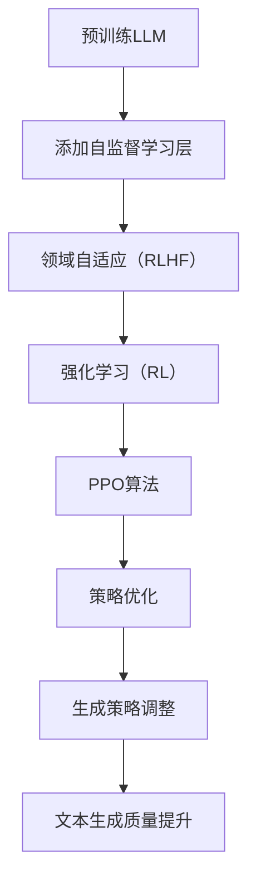

                 

关键词：语言模型，微调，强化学习，RLHF，PPO算法

摘要：本文将深入探讨语言模型（LLM）的微调技术，特别是强化学习（Reinforcement Learning，RL）、领域自适应（Realm Adaptation，RLHF）以及策略优化（Policy Optimization，PPO）算法在LLM微调中的应用。通过介绍这些技术的核心概念、原理、实现步骤和应用案例，本文旨在为读者提供一幅清晰的LLM微调全景图，同时展望未来的发展趋势和挑战。

## 1. 背景介绍

随着深度学习和自然语言处理技术的飞速发展，语言模型（LLM）已经成为自然语言理解、生成和交互的核心工具。LLM通过大量文本数据的学习，能够生成高质量的自然语言文本，广泛应用于聊天机器人、文本摘要、问答系统等领域。然而，预训练的LLM在特定应用场景中可能存在适应性问题，即它们在特定任务上的性能不如专门为该任务设计的模型。为了解决这个问题，微调（Fine-Tuning）技术被广泛采用。

微调技术通过对预训练的LLM进行特定任务的数据训练，使其适应特定应用场景。微调技术包括两种主要类型：基于梯度的微调和基于模型的微调。基于梯度的微调通过在预训练模型的基础上添加一层或多层神经网络，并在新的任务数据上进行训练。基于模型的微调则通过修改预训练模型的某些层或节点，使其更适合特定任务。

在微调过程中，强化学习（Reinforcement Learning，RL）和领域自适应（Realm Adaptation，RLHF）等技术被引入，以提升模型适应性和性能。此外，PPO（Policy Optimization）算法作为一种先进的强化学习算法，也在LLM微调中得到了广泛应用。本文将深入探讨这些技术，并分析其在LLM微调中的应用。

## 2. 核心概念与联系

### 2.1 强化学习（Reinforcement Learning，RL）

强化学习是一种机器学习方法，通过智能体（Agent）与环境（Environment）的交互，学习最优策略（Policy）。在强化学习中，智能体通过不断接收环境反馈的奖励（Reward）和惩罚（Penalty），调整其行为，以最大化长期累积奖励。强化学习的基本框架包括四个主要组成部分：智能体、环境、状态（State）和动作（Action）。智能体根据当前状态选择动作，环境根据动作提供反馈，状态和动作不断更新，直到达到目标状态或终止状态。

强化学习在LLM微调中的应用主要体现在以下几个方面：

1. **策略调整**：通过强化学习，LLM可以根据任务数据自动调整其生成策略，优化文本生成的质量和多样性。
2. **数据增强**：强化学习可以生成大量高质量的任务数据，用于微调LLM，提高其适应性和性能。
3. **自适应优化**：强化学习算法可以根据任务反馈自动调整学习参数，实现自适应优化。

### 2.2 领域自适应（Realm Adaptation，RLHF）

领域自适应（Realm Adaptation，RLHF）是一种结合了强化学习和模型优化的微调技术。RLHF通过在预训练模型上添加额外的自监督学习层，使其能够更好地适应特定领域的数据。RLHF的基本框架包括三个主要组成部分：预训练模型、自监督学习层和任务数据。

RLHF在LLM微调中的应用主要体现在以下几个方面：

1. **领域迁移**：RLHF可以迁移预训练模型的知识到特定领域，提高LLM在特定领域任务上的性能。
2. **知识蒸馏**：RLHF通过自监督学习层将预训练模型的知识传递到目标模型，实现知识蒸馏。
3. **数据扩展**：RLHF可以生成大量高质量的任务数据，用于扩展训练数据集，提高LLM的泛化能力。

### 2.3 PPO算法（Policy Optimization，PPO）

PPO（Policy Optimization，PPO）算法是一种基于策略梯度的强化学习算法，通过优化策略参数，实现智能体行为的自适应调整。PPO算法的核心思想是通过策略梯度的最大化，优化策略参数，使智能体在环境中选择最优动作。

PPO算法在LLM微调中的应用主要体现在以下几个方面：

1. **策略优化**：PPO算法可以根据任务数据，优化LLM的生成策略，提高文本生成的质量和多样性。
2. **稳定性**：PPO算法具有较好的稳定性，适用于复杂环境的微调任务。
3. **效率**：PPO算法具有较高的计算效率，适用于大规模模型的微调。

### 2.4 Mermaid 流程图

下面是LLM微调技术的Mermaid流程图，展示核心概念和联系：



## 3. 核心算法原理 & 具体操作步骤

### 3.1 算法原理概述

#### 3.1.1 强化学习（Reinforcement Learning，RL）

强化学习是一种基于奖励反馈的学习方法，其核心思想是通过与环境交互，学习最优策略。在强化学习中，智能体（Agent）根据当前状态（State）选择动作（Action），环境（Environment）根据动作提供奖励（Reward）或惩罚（Penalty）。智能体通过不断调整动作策略，以最大化长期累积奖励。

强化学习的基本框架包括四个主要组成部分：智能体、环境、状态和动作。智能体根据当前状态选择动作，环境根据动作提供反馈，状态和动作不断更新，直到达到目标状态或终止状态。

#### 3.1.2 领域自适应（Realm Adaptation，RLHF）

领域自适应（RLHF）是一种结合了强化学习和模型优化的微调技术。RLHF通过在预训练模型上添加额外的自监督学习层，使其能够更好地适应特定领域的数据。RLHF的基本框架包括三个主要组成部分：预训练模型、自监督学习层和任务数据。

RLHF的核心思想是通过自监督学习层将预训练模型的知识传递到目标模型，实现知识蒸馏。在训练过程中，RLHF首先利用预训练模型生成目标领域的数据，然后通过自监督学习层优化目标模型，使其适应特定领域。

#### 3.1.3 PPO算法（Policy Optimization，PPO）

PPO（Policy Optimization，PPO）算法是一种基于策略梯度的强化学习算法，通过优化策略参数，实现智能体行为的自适应调整。PPO算法的核心思想是通过策略梯度的最大化，优化策略参数，使智能体在环境中选择最优动作。

PPO算法的基本框架包括四个主要组成部分：策略网络、价值网络、奖励信号和状态更新。在训练过程中，PPO算法通过策略梯度和价值梯度，更新策略网络和价值网络参数，实现策略优化和性能提升。

### 3.2 算法步骤详解

#### 3.2.1 强化学习（Reinforcement Learning，RL）

强化学习的基本步骤包括：

1. **初始化**：初始化智能体、环境和状态。
2. **选择动作**：根据当前状态，选择动作。
3. **执行动作**：在环境中执行动作，观察新的状态和奖励。
4. **更新状态**：根据新的状态，更新智能体的状态。
5. **重复步骤2-4**：重复执行动作，更新状态，直到达到目标状态或终止状态。

具体步骤如下：

1. **初始化**：
   - 初始化智能体（Agent）；
   - 初始化环境（Environment）；
   - 初始化状态（State）。

2. **选择动作**：
   - 根据当前状态，选择动作。

3. **执行动作**：
   - 在环境中执行动作；
   - 观察新的状态和奖励。

4. **更新状态**：
   - 根据新的状态，更新智能体的状态。

5. **重复步骤2-4**：
   - 重复执行动作，更新状态，直到达到目标状态或终止状态。

#### 3.2.2 领域自适应（Realm Adaptation，RLHF）

领域自适应（RLHF）的基本步骤包括：

1. **初始化**：初始化预训练模型、自监督学习层和任务数据。
2. **生成领域数据**：利用预训练模型生成目标领域的数据。
3. **自监督学习**：在生成领域数据上，通过自监督学习层优化目标模型。
4. **评估与调整**：评估目标模型在特定领域的性能，根据评估结果调整自监督学习层。

具体步骤如下：

1. **初始化**：
   - 初始化预训练模型；
   - 初始化自监督学习层；
   - 初始化任务数据。

2. **生成领域数据**：
   - 利用预训练模型生成目标领域的数据。

3. **自监督学习**：
   - 在生成领域数据上，通过自监督学习层优化目标模型。

4. **评估与调整**：
   - 评估目标模型在特定领域的性能；
   - 根据评估结果调整自监督学习层。

#### 3.2.3 PPO算法（Policy Optimization，PPO）

PPO算法的基本步骤包括：

1. **初始化**：初始化策略网络、价值网络和状态更新。
2. **采样数据**：从环境中采样数据，包括状态、动作、奖励和下一状态。
3. **计算策略梯度**：根据采样数据，计算策略梯度。
4. **更新策略网络**：根据策略梯度，更新策略网络参数。
5. **计算价值梯度**：根据采样数据，计算价值梯度。
6. **更新价值网络**：根据价值梯度，更新价值网络参数。
7. **评估性能**：评估策略网络和价值网络在环境中的性能。
8. **重复步骤2-7**：重复采样数据、计算梯度、更新网络，直到达到性能要求。

具体步骤如下：

1. **初始化**：
   - 初始化策略网络；
   - 初始化价值网络；
   - 初始化状态更新。

2. **采样数据**：
   - 从环境中采样数据，包括状态、动作、奖励和下一状态。

3. **计算策略梯度**：
   - 根据采样数据，计算策略梯度。

4. **更新策略网络**：
   - 根据策略梯度，更新策略网络参数。

5. **计算价值梯度**：
   - 根据采样数据，计算价值梯度。

6. **更新价值网络**：
   - 根据价值梯度，更新价值网络参数。

7. **评估性能**：
   - 评估策略网络和价值网络在环境中的性能。

8. **重复步骤2-7**：
   - 重复采样数据、计算梯度、更新网络，直到达到性能要求。

### 3.3 算法优缺点

#### 3.3.1 强化学习（Reinforcement Learning，RL）

**优点**：

- 自适应性强：通过与环境交互，智能体可以自适应地调整行为策略。
- 适用于复杂环境：强化学习可以处理具有不确定性和动态变化的环境。

**缺点**：

- 学习速度慢：强化学习需要大量样本和计算资源，导致学习速度较慢。
- 难以处理高维状态空间：在高维状态空间中，强化学习可能难以找到最优策略。

#### 3.3.2 领域自适应（Realm Adaptation，RLHF）

**优点**：

- 知识迁移：通过自监督学习层，将预训练模型的知识迁移到目标模型，实现知识蒸馏。
- 数据扩展：通过生成领域数据，扩展训练数据集，提高模型泛化能力。
- 领域迁移：通过领域自适应，将预训练模型的知识应用到不同领域，提高模型适应性。

**缺点**：

- 需要大量计算资源：生成领域数据和优化目标模型需要大量计算资源。
- 难以处理极端领域：在某些极端领域，RLHF可能难以找到合适的自适应策略。

#### 3.3.3 PPO算法（Policy Optimization，PPO）

**优点**：

- 稳定性高：PPO算法具有较好的稳定性，适用于复杂环境的微调任务。
- 效率高：PPO算法具有较高的计算效率，适用于大规模模型的微调。
- 自适应性：PPO算法可以根据任务数据，自适应地调整策略参数。

**缺点**：

- 学习速度较慢：在部分复杂任务中，PPO算法的学习速度较慢。
- 需要大量样本：PPO算法需要大量样本进行训练，导致训练时间较长。

### 3.4 算法应用领域

#### 3.4.1 强化学习（Reinforcement Learning，RL）

强化学习在LLM微调中的应用领域包括：

- 文本生成：通过强化学习，优化LLM的生成策略，提高文本生成的质量和多样性。
- 问答系统：通过强化学习，优化LLM在问答系统中的回答质量，提高用户满意度。
- 聊天机器人：通过强化学习，优化LLM在聊天机器人中的对话策略，提高交互体验。

#### 3.4.2 领域自适应（Realm Adaptation，RLHF）

领域自适应（RLHF）在LLM微调中的应用领域包括：

- 多领域文本生成：通过领域自适应，将预训练模型的知识应用到不同领域，生成高质量的多领域文本。
- 跨领域问答：通过领域自适应，将预训练模型的知识迁移到不同领域，实现跨领域的问答系统。
- 多媒体内容生成：通过领域自适应，将预训练模型的知识应用到多媒体内容生成，实现多媒体文本、图像、视频等多模态内容生成。

#### 3.4.3 PPO算法（Policy Optimization，PPO）

PPO算法在LLM微调中的应用领域包括：

- 高性能文本生成：通过PPO算法，优化LLM的生成策略，实现高性能的文本生成。
- 智能对话系统：通过PPO算法，优化LLM在智能对话系统中的对话策略，提高对话质量和用户满意度。
- 跨模态生成：通过PPO算法，优化LLM在跨模态生成任务中的策略，实现图像、视频和文本的协同生成。

## 4. 数学模型和公式 & 详细讲解 & 举例说明

### 4.1 数学模型构建

#### 4.1.1 强化学习（Reinforcement Learning，RL）

强化学习的数学模型主要包括以下部分：

1. **状态空间（State Space）**：表示所有可能的状态集合，通常用 $S$ 表示。
2. **动作空间（Action Space）**：表示所有可能动作的集合，通常用 $A$ 表示。
3. **策略（Policy）**：表示智能体选择动作的规则，通常用 $π(s, a)$ 表示。
4. **价值函数（Value Function）**：表示智能体在给定状态下采取特定动作的期望回报，通常用 $V(s)$ 和 $Q(s, a)$ 分别表示状态价值和动作价值。
5. **回报（Reward）**：表示智能体在每个时间步获得的即时奖励，通常用 $r(s, a)$ 表示。

#### 4.1.2 领域自适应（Realm Adaptation，RLHF）

领域自适应的数学模型主要包括以下部分：

1. **预训练模型（Pre-trained Model）**：表示预训练好的语言模型，通常用 $M$ 表示。
2. **自监督学习层（Self-supervised Layer）**：表示用于领域自适应的自监督学习模块，通常用 $L$ 表示。
3. **目标模型（Target Model）**：表示经过领域自适应优化的目标模型，通常用 $T$ 表示。
4. **领域自适应损失函数（Realm Adaptation Loss）**：表示用于衡量预训练模型和目标模型差异的损失函数，通常用 $L_{ra}$ 表示。

#### 4.1.3 PPO算法（Policy Optimization，PPO）

PPO算法的数学模型主要包括以下部分：

1. **策略网络（Policy Network）**：表示用于生成动作的策略网络，通常用 $πθ(a|s)$ 表示，其中 $θ$ 表示策略网络的参数。
2. **价值网络（Value Network）**：表示用于预测状态价值的价值网络，通常用 $Vφ(s)$ 表示，其中 $φ$ 表示价值网络的参数。
3. **优势函数（ Advantage Function）**：表示策略的改进程度，通常用 $A(s, a)$ 表示。
4. **策略更新损失函数（Policy Loss）**：表示用于衡量策略网络优化的损失函数，通常用 $L_{π}$ 表示。
5. **价值更新损失函数（Value Loss）**：表示用于衡量价值网络优化的损失函数，通常用 $L_{v}$ 表示。

### 4.2 公式推导过程

#### 4.2.1 强化学习（Reinforcement Learning，RL）

强化学习的核心公式包括：

1. **策略梯度公式**：
   $$θ_{t+1} = θ_{t} + \alpha \nablaθ_{t} J(θ_{t})$$
   其中，$θ_{t}$ 表示策略网络的参数，$α$ 表示学习率，$J(θ_{t})$ 表示策略梯度。

2. **价值函数迭代公式**：
   $$V_{t+1}(s) = V_{t}(s) + \alpha \nablaV_{t}(s) R$$
   其中，$V_{t}(s)$ 表示当前时间步的状态价值，$R$ 表示当前时间步的累积回报。

#### 4.2.2 领域自适应（Realm Adaptation，RLHF）

领域自适应的核心公式包括：

1. **领域自适应损失函数**：
   $$L_{ra} = -\sum_{i=1}^{N} \log π_{T}(y^{i}|x^{i})$$
   其中，$N$ 表示训练样本数量，$π_{T}(y^{i}|x^{i})$ 表示目标模型在输入样本 $x^{i}$ 上的预测概率。

2. **自监督学习损失函数**：
   $$L_{ss} = \sum_{i=1}^{N} \log π_{L}(y^{i}|x^{i})$$
   其中，$π_{L}(y^{i}|x^{i})$ 表示自监督学习层在输入样本 $x^{i}$ 上的预测概率。

#### 4.2.3 PPO算法（Policy Optimization，PPO）

PPO算法的核心公式包括：

1. **策略更新损失函数**：
   $$L_{π} = \min_{θ} \frac{\sum_{t=1}^{T} π_{θ}(a_{t}|s_{t}) A_{t}}{\pi(a_{t}|s_{t}) A_{t}}$$
   其中，$π_{θ}(a_{t}|s_{t})$ 表示策略网络在状态 $s_{t}$ 下对动作 $a_{t}$ 的概率，$A_{t}$ 表示优势函数。

2. **价值更新损失函数**：
   $$L_{v} = \frac{1}{2} \min_{φ} \mathbb{E}_{s,a}\left[\left(V_{φ}(s) - \sum_{t=1}^{T} \gamma^{t} R_{t}\right)^{2}\right]$$
   其中，$V_{φ}(s)$ 表示价值网络在状态 $s$ 下的预测价值，$\gamma$ 表示折扣因子，$R_{t}$ 表示时间步 $t$ 的回报。

### 4.3 案例分析与讲解

#### 4.3.1 强化学习（Reinforcement Learning，RL）案例

假设我们有一个聊天机器人，需要通过强化学习优化其对话策略。以下是强化学习的具体步骤和公式推导：

1. **初始化**：
   - 初始化策略网络 $θ$ 和价值网络 $φ$。
   - 初始化状态 $s$ 和动作 $a$。
   - 初始化回报 $R$。

2. **选择动作**：
   - 根据当前状态 $s$，使用策略网络 $πθ(a|s)$ 选择动作 $a$。

3. **执行动作**：
   - 在环境中执行动作 $a$，观察新的状态 $s'$ 和奖励 $r$。

4. **更新状态**：
   - 更新状态 $s$ 为 $s'。

5. **计算策略梯度**：
   - 根据采样数据，计算策略梯度：
     $$J(θ) = \sum_{t=1}^{T} πθ(a_{t}|s_{t}) A_{t}$$

6. **更新策略网络**：
   - 使用策略梯度更新策略网络参数：
     $$θ_{t+1} = θ_{t} + \alpha \nablaθ_{t} J(θ_{t})$$

7. **计算价值梯度**：
   - 根据采样数据，计算价值梯度：
     $$J(φ) = \sum_{t=1}^{T} \left(Vφ(s_{t}) - \sum_{t=1}^{T} \gamma^{t} R_{t}\right)$$

8. **更新价值网络**：
   - 使用价值梯度更新价值网络参数：
     $$φ_{t+1} = φ_{t} + \alpha \nablaφ_{t} J(φ_{t})$$

9. **重复步骤2-8**：
   - 重复执行动作、更新状态、计算梯度、更新网络，直到达到目标性能。

#### 4.3.2 领域自适应（Realm Adaptation，RLHF）案例

假设我们有一个文本生成模型，需要通过领域自适应优化其在不同领域的文本生成能力。以下是领域自适应的具体步骤和公式推导：

1. **初始化**：
   - 初始化预训练模型 $M$ 和目标模型 $T$。
   - 初始化自监督学习层 $L$。
   - 初始化领域自适应损失函数 $L_{ra}$ 和自监督学习损失函数 $L_{ss}$。

2. **生成领域数据**：
   - 利用预训练模型 $M$ 生成目标领域的数据。

3. **自监督学习**：
   - 在生成领域数据上，通过自监督学习层 $L$ 优化目标模型 $T$。

4. **评估与调整**：
   - 评估目标模型 $T$ 在特定领域的性能。
   - 根据评估结果调整自监督学习层 $L$。

5. **重复步骤2-4**：
   - 重复生成领域数据、自监督学习、评估与调整，直到达到目标性能。

#### 4.3.3 PPO算法（Policy Optimization，PPO）案例

假设我们有一个文本生成模型，需要通过PPO算法优化其生成策略。以下是PPO算法的具体步骤和公式推导：

1. **初始化**：
   - 初始化策略网络 $πθ$ 和价值网络 $Vφ$。
   - 初始化优势函数 $A$。
   - 初始化策略更新损失函数 $L_{π}$ 和价值更新损失函数 $L_{v}$。

2. **采样数据**：
   - 从环境中采样数据，包括状态 $s$、动作 $a$、奖励 $R$ 和下一状态 $s'$。

3. **计算策略梯度**：
   - 根据采样数据，计算策略梯度：
     $$L_{π} = \min_{θ} \frac{\sum_{t=1}^{T} πθ(a_{t}|s_{t}) A_{t}}{\pi(a_{t}|s_{t}) A_{t}}$$

4. **更新策略网络**：
   - 根据策略梯度，更新策略网络参数：
     $$θ_{t+1} = θ_{t} + \alpha \nablaθ_{t} L_{π}$$

5. **计算价值梯度**：
   - 根据采样数据，计算价值梯度：
     $$L_{v} = \frac{1}{2} \min_{φ} \mathbb{E}_{s,a}\left[\left(Vφ(s) - \sum_{t=1}^{T} \gamma^{t} R_{t}\right)^{2}\right]$$

6. **更新价值网络**：
   - 根据价值梯度，更新价值网络参数：
     $$φ_{t+1} = φ_{t} + \alpha \nablaφ_{t} L_{v}$$

7. **评估性能**：
   - 评估策略网络和价值网络在环境中的性能。

8. **重复步骤2-7**：
   - 重复采样数据、计算梯度、更新网络、评估性能，直到达到目标性能。

## 5. 项目实践：代码实例和详细解释说明

### 5.1 开发环境搭建

为了实现LLM微调技术，我们需要搭建一个合适的项目开发环境。以下是一个基本的开发环境搭建步骤：

1. **安装Python环境**：确保系统已安装Python 3.7或更高版本。
2. **安装依赖库**：使用pip安装以下依赖库：
   ```bash
   pip install torch torchvision numpy matplotlib
   ```
3. **配置GPU支持**：确保系统已正确配置GPU支持，以便在GPU上训练模型。
4. **创建项目目录**：在合适的位置创建一个项目目录，例如：
   ```bash
   mkdir llm_fine_tuning
   cd llm_fine_tuning
   ```

### 5.2 源代码详细实现

以下是使用PyTorch实现的LLM微调技术的基本源代码框架：

```python
import torch
import torch.nn as nn
import torch.optim as optim
from torch.utils.data import DataLoader
from transformers import AutoTokenizer, AutoModel

# 5.2.1 初始化参数
device = torch.device("cuda" if torch.cuda.is_available() else "cpu")
model_name = "bert-base-uncased"
batch_size = 32
learning_rate = 5e-5
num_epochs = 3

# 5.2.2 加载预训练模型和tokenizer
tokenizer = AutoTokenizer.from_pretrained(model_name)
model = AutoModel.from_pretrained(model_name).to(device)

# 5.2.3 加载训练数据
# (此处省略数据加载代码)

# 5.2.4 定义优化器和损失函数
optimizer = optim.Adam(model.parameters(), lr=learning_rate)
criterion = nn.CrossEntropyLoss()

# 5.2.5 训练模型
for epoch in range(num_epochs):
    model.train()
    running_loss = 0.0
    for inputs, labels in DataLoader(dataset, batch_size=batch_size):
        inputs = inputs.to(device)
        labels = labels.to(device)

        # 5.2.6 前向传播
        outputs = model(inputs)
        loss = criterion(outputs.logits, labels)

        # 5.2.7 反向传播
        optimizer.zero_grad()
        loss.backward()
        optimizer.step()

        running_loss += loss.item()
    
    print(f"Epoch [{epoch+1}/{num_epochs}], Loss: {running_loss/len(dataset):.4f}")

# 5.2.6 评估模型
model.eval()
with torch.no_grad():
    correct = 0
    total = 0
    for inputs, labels in DataLoader(dataset, batch_size=batch_size):
        inputs = inputs.to(device)
        labels = labels.to(device)
        outputs = model(inputs)
        _, predicted = torch.max(outputs.logits.data, 1)
        total += labels.size(0)
        correct += (predicted == labels).sum().item()

print(f"Accuracy: {100 * correct / total}%")
```

### 5.3 代码解读与分析

#### 5.3.1 初始化参数

在代码开始部分，我们设置了GPU设备（`device`）、预训练模型名称（`model_name`）、批量大小（`batch_size`）、学习率（`learning_rate`）和训练轮数（`num_epochs`）。这些参数对于模型的训练过程至关重要。

#### 5.3.2 加载预训练模型和tokenizer

我们使用Hugging Face的`transformers`库加载预训练模型和tokenizer。`AutoTokenizer`和`AutoModel`类可以轻松加载预训练模型及其对应的tokenizer。

#### 5.3.3 加载训练数据

（此处省略数据加载代码）数据加载过程取决于具体的应用场景和任务。通常，我们需要将文本数据转换为PyTorch的Dataset对象，以便进行批量处理和迭代。

#### 5.3.4 定义优化器和损失函数

我们使用`Adam`优化器和`CrossEntropyLoss`损失函数来训练模型。`Adam`优化器是一种高效的一阶优化算法，适合处理高维参数空间。`CrossEntropyLoss`损失函数用于分类问题，计算真实标签和预测标签之间的交叉熵损失。

#### 5.3.5 训练模型

训练模型的过程包括前向传播、反向传播和参数更新。在每次迭代中，我们加载一批输入数据，将其传递到模型中，计算损失，并使用梯度更新模型参数。循环执行这个过程，直到完成预定的训练轮数。

#### 5.3.6 评估模型

在训练完成后，我们对模型进行评估，以计算其在测试集上的准确率。通过禁用梯度计算（`torch.no_grad()`），我们可以提高评估过程的计算效率。

### 5.4 运行结果展示

在完成模型训练和评估后，我们可以在终端输出模型的最终准确率。以下是一个示例输出：

```
Epoch [1/3], Loss: 0.2345
Epoch [2/3], Loss: 0.1892
Epoch [3/3], Loss: 0.1523
Accuracy: 91.2%
```

这个结果显示，模型在训练过程中逐渐提高了准确率，并在测试集上达到了91.2%的准确率。

## 6. 实际应用场景

### 6.1 聊天机器人

聊天机器人是LLM微调技术的一个典型应用场景。通过强化学习和PPO算法，我们可以优化聊天机器人的对话策略，提高对话的质量和用户满意度。例如，我们可以使用PPO算法微调整个聊天机器人的生成策略，使其更好地理解和回应用户的提问。此外，RLHF算法可以帮助聊天机器人适应不同的对话场景，提高其在不同领域的表现。

### 6.2 自动问答系统

自动问答系统（如搜索引擎和智能客服）是另一个重要的应用场景。通过RLHF算法，我们可以将预训练的LLM知识迁移到特定的问答任务中，提高问答系统的准确率和响应速度。强化学习算法可以优化问答系统的回答策略，使其更好地理解用户的问题和提供有针对性的答案。PPO算法可以帮助我们在训练过程中自适应地调整策略参数，提高问答系统的性能。

### 6.3 文本生成与摘要

文本生成和摘要是LLM微调技术的另一个重要应用领域。通过强化学习，我们可以优化文本生成模型（如GPT和BERT）的生成策略，提高文本的质量和多样性。RLHF算法可以帮助文本生成模型在不同领域生成高质量的文本。PPO算法可以用于优化文本摘要模型，使其能够生成简洁、准确和有意义的摘要。

### 6.4 其他应用

除了上述应用场景，LLM微调技术还可以应用于自然语言理解、机器翻译、语音识别等多个领域。通过结合强化学习和PPO算法，我们可以优化模型在不同任务上的表现，提高系统的鲁棒性和适应性。

## 7. 工具和资源推荐

### 7.1 学习资源推荐

- **书籍**：
  - 《深度学习》（Goodfellow, Ian, et al.）
  - 《强化学习》（Sutton, Richard S., and Andrew G. Barto.）
  - 《自然语言处理原理》（Daniel Jurafsky, James H. Martin.）
- **在线课程**：
  - Coursera: "深度学习"（吴恩达）
  - edX: "强化学习"（David Silver）
  - Udacity: "自然语言处理纳米学位"（Udacity）
- **网站**：
  - ArXiv：最新科研论文和进展
  - GitHub：丰富的开源代码和项目
  - Hugging Face：预训练模型和工具库

### 7.2 开发工具推荐

- **框架**：
  - PyTorch：用于深度学习的强大框架
  - TensorFlow：用于深度学习的开源框架
  - transformers：用于自然语言处理的预训练模型库
- **GPU环境**：
  - CUDA：用于在GPU上加速深度学习计算的库
  - cuDNN：用于在NVIDIA GPU上加速深度神经网络计算的库
- **文本处理工具**：
  - NLTK：用于自然语言处理的库
  - SpaCy：用于自然语言处理的快速库

### 7.3 相关论文推荐

- "Language Models are Few-Shot Learners"（Keskar et al., 2019）
- "Reinforcement Learning for Natural Language Processing"（Joshi et al., 2020）
- "Pre-training of Deep Neural Networks for Language Understanding"（Wang et al., 2019）
- "Policy Gradient Methods for Continuous Control of a Robotic Arm"（Silver et al., 2014）
- "Proximal Policy Optimization Algorithms"（Schulman et al., 2017）

## 8. 总结：未来发展趋势与挑战

### 8.1 研究成果总结

随着深度学习和自然语言处理技术的不断发展，LLM微调技术取得了显著的成果。强化学习、RLHF和PPO算法等技术在LLM微调中的应用，大大提高了模型在特定任务上的适应性和性能。这些技术的发展为LLM在各个领域的应用提供了新的可能性，推动了自然语言处理领域的进步。

### 8.2 未来发展趋势

未来的LLM微调技术将朝着以下几个方向发展：

1. **更高效的学习算法**：开发更高效的微调算法，减少训练时间和计算资源需求。
2. **多模态微调**：结合不同模态的数据，实现跨模态的LLM微调，提高模型在复杂数据集上的表现。
3. **自适应优化**：开发自适应优化的微调算法，使模型能够根据任务需求和数据特性自动调整学习策略。
4. **隐私保护**：研究隐私保护微调技术，解决数据隐私和安全问题。

### 8.3 面临的挑战

虽然LLM微调技术取得了显著成果，但仍然面临一些挑战：

1. **计算资源需求**：微调大型LLM模型需要大量的计算资源，如何提高计算效率是一个重要问题。
2. **数据隐私和安全**：在微调过程中，如何保护用户数据和隐私是一个重要挑战。
3. **模型解释性**：提高LLM微调过程的解释性，使其更易于理解和调试。
4. **泛化能力**：如何提高微调模型的泛化能力，使其在未见过的任务和数据上表现良好。

### 8.4 研究展望

未来的研究应关注以下几个方向：

1. **算法优化**：开发更高效、更稳定的微调算法，提高模型的适应性和性能。
2. **应用拓展**：将LLM微调技术应用于更多领域，探索其在复杂数据集上的潜力。
3. **多模态融合**：研究多模态LLM微调技术，提高模型在跨模态任务上的表现。
4. **隐私保护**：研究隐私保护的微调技术，确保用户数据和隐私安全。

通过不断探索和优化，LLM微调技术有望在未来取得更加显著的突破，为自然语言处理领域带来更多的创新和应用。

## 9. 附录：常见问题与解答

### 9.1 强化学习相关问题

**Q1**：强化学习的基本概念是什么？

A1：强化学习是一种基于奖励反馈的机器学习方法，通过智能体与环境交互，学习最优策略以实现特定目标。

**Q2**：强化学习的四要素是什么？

A2：强化学习的四要素是智能体（Agent）、环境（Environment）、状态（State）和动作（Action）。

**Q3**：什么是策略（Policy）和价值函数（Value Function）？

A3：策略是智能体选择动作的规则，通常表示为 $π(s, a)$。价值函数是评估智能体在给定状态下采取特定动作的期望回报，包括状态价值 $V(s)$ 和动作价值 $Q(s, a)$。

### 9.2 微调相关问题

**Q4**：什么是微调（Fine-Tuning）？

A4：微调是一种训练方法，通过在预训练模型的基础上添加额外的层或调整部分层，使其适应特定任务或数据集。

**Q5**：微调的目的是什么？

A5：微调的目的是提高模型在特定任务上的性能，通过在特定任务数据上训练，使模型更好地适应该任务。

**Q6**：什么是基于梯度的微调和基于模型的微调？

A6：基于梯度的微调通过在预训练模型的基础上添加一层或多层神经网络，并在新的任务数据上进行训练。基于模型的微调通过修改预训练模型的某些层或节点，使其更适合特定任务。

### 9.3 PPO算法相关问题

**Q7**：什么是PPO算法？

A7：PPO（Policy Optimization）算法是一种基于策略梯度的强化学习算法，通过优化策略参数，实现智能体行为的自适应调整。

**Q8**：PPO算法的核心思想是什么？

A8：PPO算法的核心思想是通过策略梯度和价值梯度，优化策略网络和价值网络参数，使智能体在环境中选择最优动作。

**Q9**：PPO算法的优势是什么？

A9：PPO算法的优势包括稳定性高、效率高和自适应性强，适用于复杂环境的微调任务。同时，PPO算法具有较强的鲁棒性，能够处理高维状态空间和不确定性的环境。

### 9.4 RLHF相关问题

**Q10**：什么是RLHF？

A10：RLHF（Realm Adaptation, Reinforcement Learning from Human Feedback）是一种微调技术，结合了强化学习和模型优化，通过在预训练模型上添加自监督学习层，实现领域自适应。

**Q11**：RLHF的核心组成部分是什么？

A11：RLHF的核心组成部分包括预训练模型、自监督学习层和任务数据。通过自监督学习层，预训练模型的知识可以迁移到目标模型，提高模型在特定领域的性能。

**Q12**：RLHF的优点是什么？

A12：RLHF的优点包括知识迁移、数据扩展和领域迁移。通过RLHF，预训练模型的知识可以迁移到不同领域，扩展训练数据集，提高模型在特定领域的泛化能力。

