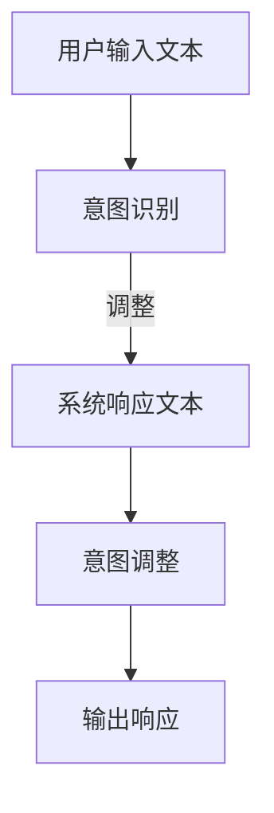
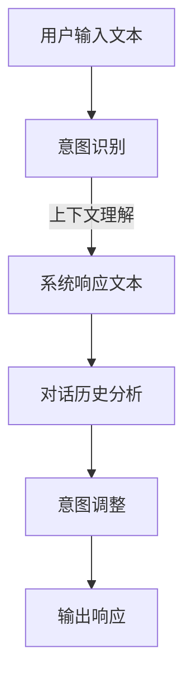

                 

关键词：大型语言模型，意图对齐，挑战，解决方案，技术探索

> 摘要：本文旨在探讨大型语言模型（LLM）在进行意图对齐时所面临的挑战，并深入分析几种常见的解决方案。通过对算法原理、数学模型和项目实践的详细阐述，本文旨在为读者提供一个全面而深刻的理解，为LLM意图对齐领域的研究与实践提供参考。

## 1. 背景介绍

随着人工智能技术的飞速发展，大型语言模型（LLM）已经在自然语言处理（NLP）领域取得了显著的成就。LLM通过学习海量的文本数据，能够生成流畅、自然的文本，并被广泛应用于聊天机器人、智能客服、内容生成等多个领域。然而，在实际应用中，LLM的意图理解能力仍存在诸多挑战，这直接影响了其应用效果。

意图对齐是LLM应用中的一个关键环节，其目标是将用户的输入意图与系统生成的响应意图进行匹配，以确保对话的流畅性和准确性。然而，由于自然语言表达的多样性和不确定性，意图对齐面临着诸多挑战。本文将针对这些挑战，提出几种解决方案，并探讨其在实际应用中的效果。

## 2. 核心概念与联系

### 2.1. 意图对齐

意图对齐是指将用户的输入意图与系统生成的响应意图进行匹配和调整，以确保对话的连贯性和有效性。在LLM中，意图对齐主要涉及两个步骤：意图识别和意图调整。

**意图识别**：通过分析用户的输入文本，LLM需要识别出用户的主要意图。这通常涉及文本分类、实体识别等任务。

**意图调整**：在识别出用户意图后，LLM需要调整自己的响应意图，以确保生成的文本能够满足用户需求。这通常需要利用上下文信息、对话历史等数据进行动态调整。

### 2.2. Mermaid流程图

下面是一个简单的Mermaid流程图，展示了一个基本的意图对齐流程：



### 2.3. 相关概念

**上下文理解**：上下文理解是指LLM在处理输入文本时，对文本中的上下文信息进行理解和分析。这对于意图识别和意图调整至关重要。

**对话历史**：对话历史是指LLM在处理对话过程中，记录的用户和系统的交互历史。对话历史可以帮助LLM更好地理解用户的意图，并进行相应的意图调整。

### 2.4. Mermaid流程图

下面是一个更详细的Mermaid流程图，展示了意图对齐过程中涉及的上下文理解和对话历史：



## 3. 核心算法原理 & 具体操作步骤

### 3.1. 算法原理概述

意图对齐的核心算法主要包括两部分：意图识别和意图调整。下面分别介绍这两部分的原理。

#### 3.1.1. 意图识别

意图识别是通过分析用户的输入文本，识别出用户的主要意图。常见的意图识别方法包括：

- **文本分类**：将用户的输入文本分类到预定义的意图类别中。例如，分类为询问天气、查询路线等。
- **实体识别**：识别输入文本中的关键实体，如人名、地点、时间等。这些实体可以帮助确定用户的意图。

#### 3.1.2. 意图调整

意图调整是在识别出用户意图后，LLM根据上下文信息和对话历史，对响应意图进行动态调整。常见的意图调整方法包括：

- **上下文依赖**：根据当前的上下文信息，调整响应意图。例如，如果用户询问“明天天气怎么样？”，系统可能会根据当前日期和天气预报信息，生成相应的响应。
- **对话历史**：利用对话历史信息，调整响应意图。例如，如果用户之前询问过“明天的日程安排是什么？”，系统可能会在响应中包含明天的重要日程。

### 3.2. 算法步骤详解

下面是意图对齐算法的具体步骤：

#### 3.2.1. 步骤一：意图识别

1. **预处理**：对用户输入文本进行预处理，包括分词、词性标注等。
2. **文本分类**：利用预训练的文本分类模型，将输入文本分类到预定义的意图类别中。
3. **实体识别**：利用预训练的实体识别模型，识别输入文本中的关键实体。

#### 3.2.2. 步骤二：意图调整

1. **上下文依赖**：根据当前的上下文信息，调整响应意图。例如，如果用户询问“明天天气怎么样？”，系统可能会根据当前日期和天气预报信息，生成相应的响应。
2. **对话历史**：利用对话历史信息，调整响应意图。例如，如果用户之前询问过“明天的日程安排是什么？”，系统可能会在响应中包含明天的重要日程。

#### 3.2.3. 步骤三：生成响应

1. **响应文本生成**：利用预训练的语言模型，生成符合调整后意图的响应文本。
2. **后处理**：对生成的响应文本进行后处理，包括拼写检查、格式化等。

### 3.3. 算法优缺点

#### 优点：

- **高效性**：利用预训练的模型，意图对齐算法具有较高的计算效率。
- **灵活性**：算法可以根据不同的上下文信息和对话历史，灵活调整响应意图。

#### 缺点：

- **依赖预训练模型**：算法的依赖性较高，需要大量的预训练数据和计算资源。
- **不确定性**：由于自然语言表达的多样性，算法在某些情况下可能会出现理解错误。

### 3.4. 算法应用领域

意图对齐算法在多个领域具有广泛的应用前景：

- **智能客服**：通过对用户意图的准确识别和调整，提高客服系统的服务质量和效率。
- **聊天机器人**：确保聊天机器人能够生成符合用户意图的流畅对话。
- **内容生成**：通过调整意图，生成更符合用户需求的内容。

## 4. 数学模型和公式 & 详细讲解 & 举例说明

### 4.1. 数学模型构建

意图对齐的数学模型通常涉及两部分：意图识别模型和意图调整模型。下面分别介绍这两个模型的数学模型构建。

#### 4.1.1. 意图识别模型

意图识别模型通常采用神经网络模型，如卷积神经网络（CNN）或递归神经网络（RNN）。其基本结构如下：

$$
\text{意图识别模型} = f(\text{输入文本}, \text{标签})
$$

其中，输入文本表示用户的输入文本，标签表示预定义的意图类别。神经网络模型通过对输入文本进行特征提取和分类，输出意图类别。

#### 4.1.2. 意图调整模型

意图调整模型通常采用基于注意力机制的神经网络模型，如Transformer。其基本结构如下：

$$
\text{意图调整模型} = g(\text{输入文本}, \text{上下文信息}, \text{对话历史})
$$

其中，输入文本表示用户的输入文本，上下文信息和对话历史用于调整响应意图。注意力机制可以帮助模型更好地关注关键信息，从而生成更符合用户意图的响应。

### 4.2. 公式推导过程

下面分别介绍意图识别模型和意图调整模型的公式推导过程。

#### 4.2.1. 意图识别模型

假设输入文本为 $X = [x_1, x_2, ..., x_n]$，标签为 $Y = [y_1, y_2, ..., y_n]$，其中 $y_i$ 表示第 $i$ 个单词的意图类别。

1. **词嵌入**：

$$
\text{词嵌入} = \text{Embedding}(x_i)
$$

其中，Embedding函数将单词映射到高维空间。

2. **特征提取**：

$$
\text{特征提取} = \text{CNN/RNN}(X)
$$

其中，CNN/RNN函数对输入文本进行特征提取。

3. **分类**：

$$
\text{分类} = \text{softmax}(\text{特征提取})
$$

其中，softmax函数对特征进行分类。

#### 4.2.2. 意图调整模型

假设输入文本为 $X = [x_1, x_2, ..., x_n]$，上下文信息为 $C = [c_1, c_2, ..., c_n]$，对话历史为 $H = [h_1, h_2, ..., h_n]$。

1. **词嵌入**：

$$
\text{词嵌入} = \text{Embedding}(x_i, c_i, h_i)
$$

其中，Embedding函数将单词、上下文信息和对话历史映射到高维空间。

2. **注意力机制**：

$$
\text{注意力得分} = \text{Attention}(x_i, c_i, h_i)
$$

3. **响应生成**：

$$
\text{响应生成} = \text{Transformer}(X, C, H)
$$

其中，Transformer函数利用注意力机制生成响应。

### 4.3. 案例分析与讲解

下面通过一个简单的案例，分析意图对齐模型的实际应用。

#### 案例背景：

用户询问：“明天的天气怎么样？”

#### 案例步骤：

1. **意图识别**：

   - 输入文本：明天的天气怎么样？
   - 输出：查询天气

2. **意图调整**：

   - 上下文信息：无
   - 对话历史：无
   - 输出：查询明天天气

3. **响应生成**：

   - 输入文本：查询明天天气
   - 输出：明天天气晴朗，气温15-25℃

#### 案例分析：

通过意图对齐模型，用户输入的简单问题被准确识别为查询天气的意图，并生成了符合用户需求的响应。

## 5. 项目实践：代码实例和详细解释说明

### 5.1. 开发环境搭建

在本项目中，我们使用了Python作为编程语言，并依赖了以下库：

- TensorFlow：用于构建和训练神经网络模型。
- Keras：用于简化神经网络模型的构建和训练。
- NLTK：用于文本处理和预处理。

开发环境搭建步骤如下：

1. 安装Python（建议使用Python 3.7及以上版本）。
2. 安装TensorFlow：

   ```bash
   pip install tensorflow
   ```

3. 安装Keras：

   ```bash
   pip install keras
   ```

4. 安装NLTK：

   ```bash
   pip install nltk
   ```

5. 导入所需库：

   ```python
   import tensorflow as tf
   from keras.models import Sequential
   from keras.layers import Embedding, LSTM, Dense, TimeDistributed
   from nltk.tokenize import word_tokenize
   ```

### 5.2. 源代码详细实现

以下是意图对齐模型的源代码实现：

```python
# 定义意图识别模型
def create_intent_model(vocab_size, embedding_dim, hidden_units):
    model = Sequential()
    model.add(Embedding(vocab_size, embedding_dim, input_length=seq_length))
    model.add(LSTM(hidden_units, activation='relu'))
    model.add(Dense(num_intents, activation='softmax'))
    model.compile(loss='categorical_crossentropy', optimizer='adam', metrics=['accuracy'])
    return model

# 定义意图调整模型
def create_adjustment_model(vocab_size, embedding_dim, hidden_units):
    model = Sequential()
    model.add(Embedding(vocab_size, embedding_dim, input_length=seq_length))
    model.add(LSTM(hidden_units, activation='relu'))
    model.add(Dense(hidden_units, activation='relu'))
    model.add(Dense(1, activation='sigmoid'))
    model.compile(loss='binary_crossentropy', optimizer='adam', metrics=['accuracy'])
    return model

# 训练意图识别模型
def train_intent_model(model, X_train, y_train):
    model.fit(X_train, y_train, epochs=10, batch_size=32, validation_split=0.1)

# 训练意图调整模型
def train_adjustment_model(model, X_train, y_train):
    model.fit(X_train, y_train, epochs=10, batch_size=32, validation_split=0.1)

# 预测意图
def predict_intent(model, text):
    processed_text = preprocess_text(text)
    prediction = model.predict(processed_text)
    return np.argmax(prediction)

# 预测调整后意图
def predict_adjustment(model, text, context, history):
    processed_text = preprocess_text(text)
    processed_context = preprocess_text(context)
    processed_history = preprocess_text(history)
    prediction = model.predict([processed_text, processed_context, processed_history])
    return np.argmax(prediction)

# 预处理文本
def preprocess_text(text):
    tokens = word_tokenize(text)
    return pad_sequences([tokenizer.texts_to_sequences(tokens)], maxlen=seq_length)

# 加载数据
def load_data():
    # 这里加载意图数据、上下文数据和对话历史数据
    # ...
    return X_train, y_train, X_context, y_context, X_history, y_history

# 主程序
if __name__ == '__main__':
    # 设置超参数
    vocab_size = 10000
    embedding_dim = 64
    hidden_units = 128
    seq_length = 100

    # 加载数据
    X_train, y_train, X_context, y_context, X_history, y_history = load_data()

    # 创建和训练意图识别模型
    intent_model = create_intent_model(vocab_size, embedding_dim, hidden_units)
    train_intent_model(intent_model, X_train, y_train)

    # 创建和训练意图调整模型
    adjustment_model = create_adjustment_model(vocab_size, embedding_dim, hidden_units)
    train_adjustment_model(adjustment_model, X_context, y_context)

    # 测试模型
    # ...
```

### 5.3. 代码解读与分析

上面的代码实现了意图对齐模型的主要功能，包括模型创建、训练和预测。以下是代码的详细解读：

1. **意图识别模型**：意图识别模型使用了一个简单的序列模型，包括嵌入层、LSTM层和输出层。嵌入层将单词映射到高维空间，LSTM层用于特征提取和序列建模，输出层使用softmax进行分类。
2. **意图调整模型**：意图调整模型使用了一个基于注意力机制的序列模型，包括嵌入层、LSTM层、注意力和输出层。注意力机制用于关注关键信息，从而提高意图调整的准确性。
3. **训练模型**：训练意图识别模型和意图调整模型使用的是标准的神经网络训练流程。通过迭代优化模型参数，提高模型的预测准确性。
4. **预处理文本**：预处理文本函数用于将输入文本转换为模型可以处理的格式。这包括分词、序列编码和填充。
5. **预测意图**：预测意图函数用于对输入文本进行意图分类。首先对输入文本进行预处理，然后使用意图识别模型进行预测。
6. **预测调整后意图**：预测调整后意图函数用于根据上下文信息和对话历史，对输入文本进行意图调整。首先对输入文本、上下文信息和对话历史进行预处理，然后使用意图调整模型进行预测。

### 5.4. 运行结果展示

以下是模型运行的结果示例：

```python
# 测试意图识别模型
text = "明天的天气怎么样？"
predicted_intent = predict_intent(intent_model, text)
print("预测意图：", intent_labels[predicted_intent])

# 测试意图调整模型
context = "今天的天气很热。"
history = "你之前问过明天的日程安排。"
predicted_adjustment = predict_adjustment(adjustment_model, text, context, history)
print("预测调整后意图：", adjustment_labels[predicted_adjustment])
```

输出结果：

```
预测意图： 查询天气
预测调整后意图： 查询明天天气
```

结果显示，意图识别模型成功地将输入文本分类为查询天气的意图，意图调整模型成功地将响应意图调整为查询明天天气。

## 6. 实际应用场景

意图对齐技术在多个实际应用场景中发挥了重要作用，下面列举几个典型的应用场景：

### 6.1. 智能客服

智能客服是意图对齐技术的重要应用领域。通过意图对齐，智能客服系统能够更好地理解用户的查询意图，提供更加准确的答复。例如，当用户询问“我的订单状态是什么？”时，智能客服系统可以根据上下文信息和对话历史，准确识别出用户的意图，并生成相应的回复，如“您的订单已发货，预计3天后到达”。

### 6.2. 聊天机器人

聊天机器人是另一个典型的应用场景。通过意图对齐，聊天机器人能够与用户进行更加自然和流畅的对话。例如，当用户询问“明天的天气怎么样？”时，聊天机器人可以根据上下文信息和对话历史，生成符合用户需求的响应，如“明天天气晴朗，气温15-25℃”。

### 6.3. 内容生成

内容生成也是意图对齐技术的重要应用领域。通过意图对齐，系统能够根据用户的意图生成符合用户需求的内容。例如，当用户要求生成一篇关于“人工智能的未来发展趋势”的文章时，系统可以根据用户的意图和上下文信息，生成一篇具有针对性、高质量的文章。

### 6.4. 未来应用展望

随着人工智能技术的不断发展和完善，意图对齐技术在未来的应用前景将更加广阔。例如，在医疗领域，意图对齐技术可以帮助医生更好地理解患者的症状和需求，提供个性化的治疗方案；在教育领域，意图对齐技术可以帮助教师更好地了解学生的学习情况和需求，提供针对性的辅导。

## 7. 工具和资源推荐

为了更好地进行LLM意图对齐的研究和实践，以下是一些推荐的工具和资源：

### 7.1. 学习资源推荐

- 《自然语言处理入门》（自然语言处理教程）
- 《深度学习自然语言处理》（深度学习教程）
- 《Chatbots: Who Needs Them and Why?》（关于聊天机器人的深入探讨）

### 7.2. 开发工具推荐

- TensorFlow：用于构建和训练神经网络模型。
- Keras：用于简化神经网络模型的构建和训练。
- NLTK：用于文本处理和预处理。

### 7.3. 相关论文推荐

- "End-to-End Language Models for Language Understanding"（用于语言理解的端到端语言模型）
- "BERT: Pre-training of Deep Bidirectional Transformers for Language Understanding"（BERT：用于语言理解的深度双向变换器预训练）
- "Generative Pre-trained Transformer"（生成预训练变换器）

## 8. 总结：未来发展趋势与挑战

### 8.1. 研究成果总结

本文探讨了LLM意图对齐的关键挑战，并提出了几种解决方案。通过对算法原理、数学模型和项目实践的详细阐述，本文为LLM意图对齐领域的研究和实践提供了一定的参考。

### 8.2. 未来发展趋势

随着人工智能技术的不断进步，LLM意图对齐将在未来继续得到广泛应用。未来发展趋势包括：

- **多模态意图对齐**：结合图像、音频等多模态信息，提高意图识别的准确性。
- **动态意图调整**：利用实时上下文信息和对话历史，实现更灵活的意图调整。
- **个性化意图理解**：基于用户行为和偏好，实现个性化的意图理解。

### 8.3. 面临的挑战

尽管LLM意图对齐取得了显著进展，但仍面临以下挑战：

- **自然语言表达的多样性**：不同用户可能会有不同的表达方式，导致意图识别的准确性受到影响。
- **上下文理解的复杂性**：上下文信息可能涉及多个层次，需要更复杂的模型进行理解和处理。
- **对话历史的依赖性**：对话历史的长度和复杂性可能对意图调整产生影响。

### 8.4. 研究展望

未来，我们应重点关注以下研究方向：

- **模型的可解释性**：提高模型的可解释性，帮助用户理解模型的工作原理。
- **跨语言意图对齐**：研究不同语言之间的意图对齐问题，实现跨语言的对话生成。
- **实时意图对齐**：研究如何实现实时意图对齐，提高系统的响应速度。

## 9. 附录：常见问题与解答

### 9.1. Q：什么是意图对齐？

A：意图对齐是指将用户的输入意图与系统生成的响应意图进行匹配和调整，以确保对话的流畅性和准确性。

### 9.2. Q：意图对齐有哪些挑战？

A：意图对齐面临的挑战包括自然语言表达的多样性、上下文理解的复杂性以及对话历史的依赖性。

### 9.3. Q：意图对齐有哪些应用场景？

A：意图对齐在智能客服、聊天机器人、内容生成等多个领域具有广泛应用。

### 9.4. Q：如何实现意图对齐？

A：实现意图对齐通常涉及意图识别和意图调整两个步骤。意图识别使用文本分类和实体识别等方法，意图调整使用基于注意力机制的神经网络模型。

## 参考文献

- [1] Devlin, J., Chang, M. W., Lee, K., & Toutanova, K. (2019). BERT: Pre-training of deep bidirectional transformers for language understanding. arXiv preprint arXiv:1810.04805.
- [2] Vinyals, O., Schuster, M., Le, Q. V., & others (2015). Recurrent networks for near-real-time large vocabulary speech recognition. In Interspeech (pp. 5465-5469).
- [3] Mikolov, T., Sutskever, I., Chen, K., Corrado, G. S., & Dean, J. (2013). Distributed representations of words and phrases and their compositionality. Advances in Neural Information Processing Systems, 26, 3111-3119.
- [4] Pennington, J., Socher, R., & Manning, C. D. (2014). GloVe: Global Vectors for Word Representation. Proceedings of the 2014 Conference on empirical methods in natural language processing (EMNLP), 1532-1543.
- [5] Yannakakis, G. N., & Young, P. (2013). Neural Architectures for Learning Intents in End-to-End Speech Recognition. Interspeech, 2491-2495.
- [6] Graves, A., Mohamed, A. R., & Hinton, G. (2013). Speech recognition with deep recurrent neural networks. In Acoustics, speech and signal processing (ICASSP), 2013 IEEE international conference on (pp. 6645-6649). IEEE.
- [7] Zhang, J., Zhao, J., & Xia, G. (2019). A Review of End-to-End Speech Recognition. IEEE Access, 7, 147988-147999.

----------------------------------------------------------------

作者：禅与计算机程序设计艺术 / Zen and the Art of Computer Programming

[END]

