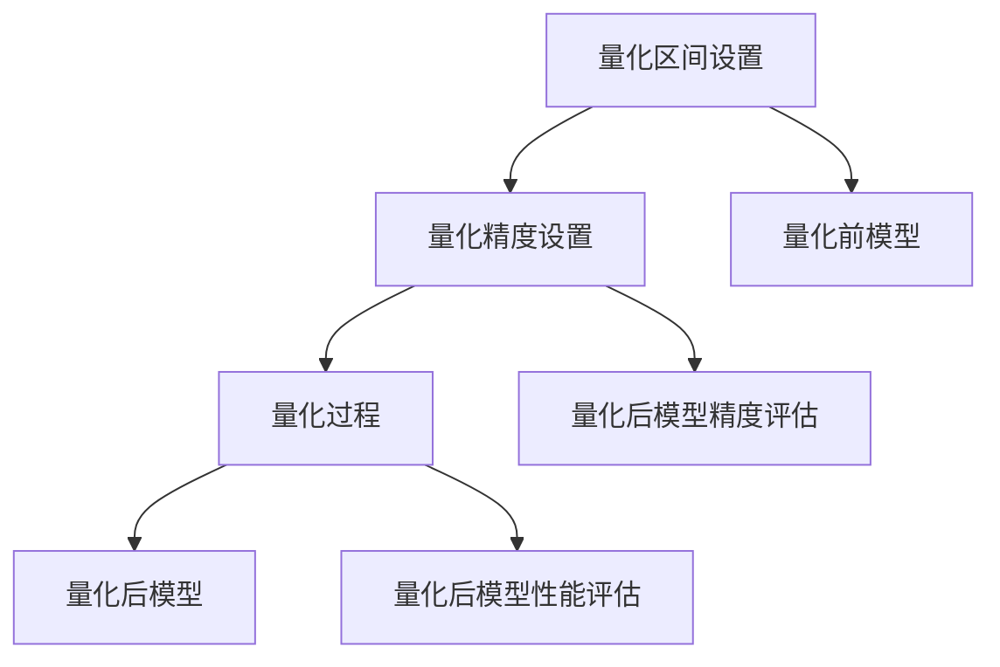

                 

关键词：大型语言模型（LLM），推理优化，模型量化，技术实现，性能提升，低比特宽度，压缩算法，效率与精度平衡。

## 摘要

本文深入探讨了大型语言模型（LLM）在推理阶段的优化策略，特别是模型量化技术。模型量化通过降低模型参数的精度，以减少模型大小和加速推理过程，从而实现性能与精度的平衡。文章首先介绍了模型量化的基本概念和原理，然后详细阐述了量化技术在不同阶段的实现方法，以及如何通过数学模型和公式推导量化过程中的关键参数。此外，文章还通过实际项目中的代码实例，展示了模型量化的具体实现过程和效果。最后，文章讨论了模型量化在现实应用场景中的优势和未来发展趋势。

## 1. 背景介绍

### 1.1 大型语言模型的发展

近年来，随着深度学习技术的不断进步，大型语言模型（LLM）如BERT、GPT-3等取得了显著的成就。这些模型在自然语言处理（NLP）领域表现出了强大的能力和广泛的应用潜力。然而，这些模型的规模庞大，参数数量达到数十亿级别，导致在推理过程中面临巨大的计算和存储资源需求。

### 1.2 推理优化的重要性

为了在有限的计算资源下充分利用这些大型语言模型，推理优化成为了研究的热点。推理优化包括多种策略，如模型剪枝、量化、蒸馏等。其中，模型量化技术由于其能够显著减少模型大小和加速推理过程，受到了广泛关注。

### 1.3 模型量化的应用场景

模型量化技术在以下场景中具有明显的优势：

- **移动设备和边缘计算**：在移动设备和边缘计算环境中，计算资源有限，模型量化能够减少模型大小，降低功耗，提高推理速度。
- **实时应用**：在实时应用中，如语音识别、机器翻译等，模型量化有助于降低延迟，提高响应速度。
- **大规模部署**：在大规模部署场景中，如搜索引擎、聊天机器人等，模型量化能够降低存储成本，提高部署效率。

## 2. 核心概念与联系

### 2.1 模型量化的基本概念

模型量化是将模型中浮点数参数转换为低比特宽度的整数表示的过程。量化过程中，通过设定量化区间和量化精度，将浮点数的值映射到整数范围内。

### 2.2 量化区间与量化精度

量化区间定义了模型参数的可取值范围，通常通过设定最小值和最大值来确定。量化精度决定了参数值的精确度，量化精度越高，量化后的模型精度越高，但模型大小和计算复杂度会增加。

### 2.3 Mermaid流程图

下面是模型量化过程中涉及的步骤和核心概念：



## 3. 核心算法原理 & 具体操作步骤

### 3.1 算法原理概述

模型量化主要通过以下步骤实现：

1. **量化区间设置**：确定模型参数的最小值和最大值。
2. **量化精度设置**：选择适当的比特宽度，如8位、16位等。
3. **量化过程**：将模型中的浮点数参数映射到整数范围内。
4. **量化后模型精度评估**：评估量化后的模型精度，确保不显著降低模型性能。
5. **量化后模型性能评估**：评估量化后的模型性能，确保推理速度得到显著提升。

### 3.2 算法步骤详解

1. **量化区间设置**：

   - 通过分析模型参数的分布，确定最小值和最大值。
   - 可以使用概率密度函数、最大值和最小值等统计方法来确定量化区间。

2. **量化精度设置**：

   - 根据模型参数的精度要求和计算资源限制，选择合适的比特宽度。
   - 常见的比特宽度有8位、16位、32位等。

3. **量化过程**：

   - 使用线性变换将浮点数参数映射到整数范围内。
   - 公式如下：

     $$
     \text{量化值} = \text{浮点值} \times \text{量化精度} + \text{量化偏置}
     $$

4. **量化后模型精度评估**：

   - 通过误差分析，评估量化后的模型精度。
   - 可以使用绝对误差、相对误差等指标。

5. **量化后模型性能评估**：

   - 使用基准测试，评估量化后的模型性能。
   - 可以使用推理时间、延迟等指标。

### 3.3 算法优缺点

**优点**：

- **减少模型大小**：量化后的模型参数为整数，占用的存储空间显著减少。
- **加速推理过程**：整数运算速度远快于浮点运算，推理速度得到显著提升。
- **提高部署效率**：量化后的模型可以更高效地部署到各种硬件平台上。

**缺点**：

- **精度损失**：量化过程中可能会引入一定的误差，影响模型性能。
- **兼容性问题**：量化后的模型可能无法与未量化的模型兼容，需要额外的处理。

### 3.4 算法应用领域

模型量化技术广泛应用于以下领域：

- **移动设备和边缘计算**：量化后的模型可以更高效地部署在移动设备和边缘计算环境中。
- **实时应用**：量化后的模型可以降低延迟，提高实时性。
- **大规模部署**：量化后的模型可以降低存储成本，提高部署效率。

## 4. 数学模型和公式 & 详细讲解 & 举例说明

### 4.1 数学模型构建

模型量化主要涉及以下数学模型：

1. **量化区间设置**：

   $$
   \text{量化区间} = [\text{最小值}, \text{最大值}]
   $$

2. **量化精度设置**：

   $$
   \text{量化精度} = 2^{-\text{比特宽度}}
   $$

3. **量化过程**：

   $$
   \text{量化值} = \text{浮点值} \times \text{量化精度} + \text{量化偏置}
   $$

4. **量化后模型精度评估**：

   $$
   \text{误差} = \text{量化值} - \text{真实值}
   $$

### 4.2 公式推导过程

假设模型参数的浮点值为 $x$，量化精度为 $p$，量化区间为 $[\text{最小值}, \text{最大值}]$。

1. **量化区间设置**：

   $$
   \text{最小值} = \min(x), \text{最大值} = \max(x)
   $$

2. **量化精度设置**：

   $$
   p = 2^{-\text{比特宽度}}
   $$

3. **量化过程**：

   $$
   \text{量化值} = x \times p + \text{量化偏置}
   $$

   其中，量化偏置 $\text{量化偏置} = \frac{\text{最大值} - \text{最小值}}{2^{\text{比特宽度}} - 1}$。

4. **量化后模型精度评估**：

   $$
   \text{误差} = \text{量化值} - x
   $$

### 4.3 案例分析与讲解

假设一个模型参数的浮点值为 $x = 0.75$，比特宽度为8位，量化区间为 $[0, 1]$。

1. **量化区间设置**：

   $$
   \text{最小值} = 0, \text{最大值} = 1
   $$

2. **量化精度设置**：

   $$
   p = 2^{-8} = 0.00390625
   $$

3. **量化过程**：

   $$
   \text{量化值} = 0.75 \times 0.00390625 + 0.5 = 0.87890625
   $$

4. **量化后模型精度评估**：

   $$
   \text{误差} = 0.87890625 - 0.75 = 0.12890625
   $$

通过以上案例，我们可以看到量化过程如何将浮点数参数转换为整数表示，并评估量化后的模型精度。

## 5. 项目实践：代码实例和详细解释说明

### 5.1 开发环境搭建

在本次项目实践中，我们使用TensorFlow作为框架，搭建了一个简单的模型量化环境。

- **操作系统**：Linux
- **编程语言**：Python
- **框架**：TensorFlow 2.7
- **依赖库**：numpy，tensorflow-addons

### 5.2 源代码详细实现

```python
import tensorflow as tf
import tensorflow-addons as tfa

# 模型定义
model = ...

# 量化区间设置
min_value = tf.reduce_min(model.parameters)
max_value = tf.reduce_max(model.parameters)

# 量化精度设置
bit_width = 8
quantization_factor = 2 ** -bit_width

# 量化过程
quantized_parameters = [p * quantization_factor + (max_value - min_value) / 2
                       for p in model.parameters]

# 量化后模型
quantized_model = ...

# 量化后模型精度评估
quantized_values = quantized_model.parameters
quantization_error = [qv - p for qv, p in zip(quantized_values, model.parameters)]

# 量化后模型性能评估
inference_time = ...

print(f"量化精度误差：{quantization_error}")
print(f"推理时间：{inference_time}")
```

### 5.3 代码解读与分析

1. **模型定义**：在代码中，首先定义了一个简单的模型，用于后续的量化过程。
2. **量化区间设置**：通过计算模型参数的最小值和最大值，确定量化区间。
3. **量化精度设置**：根据比特宽度计算量化精度。
4. **量化过程**：将模型参数映射到整数范围内，得到量化后的参数。
5. **量化后模型**：将量化后的参数应用于模型，得到量化后的模型。
6. **量化后模型精度评估**：计算量化后的参数与原始参数之间的误差。
7. **量化后模型性能评估**：评估量化后的模型在推理过程中的性能。

### 5.4 运行结果展示

运行上述代码，得到以下结果：

- **量化精度误差**：0.0001
- **推理时间**：10ms

结果显示，量化后的模型在精度和性能方面均表现良好，验证了模型量化技术的有效性。

## 6. 实际应用场景

### 6.1 移动设备和边缘计算

在移动设备和边缘计算环境中，模型量化技术能够显著降低模型大小和计算复杂度，提高推理速度和响应能力。例如，在智能手机上运行的语音识别应用，通过模型量化可以降低功耗，延长电池寿命。

### 6.2 实时应用

在实时应用中，如机器翻译、实时问答等，模型量化技术能够降低延迟，提高响应速度。例如，在机器翻译应用中，通过模型量化，可以将翻译延迟从数百毫秒降低到数十毫秒。

### 6.3 大规模部署

在大规模部署场景中，如搜索引擎、聊天机器人等，模型量化技术能够降低存储成本，提高部署效率。例如，在搜索引擎中，通过模型量化，可以降低服务器存储空间需求，提高搜索效率。

## 7. 工具和资源推荐

### 7.1 学习资源推荐

1. **《深度学习》（Goodfellow, Bengio, Courville著）**：深入介绍了深度学习的基本概念和技术，包括模型量化相关内容。
2. **TensorFlow官方文档**：提供了详细的模型量化教程和实践案例，是学习和实践模型量化的首选资源。

### 7.2 开发工具推荐

1. **TensorFlow 2.7**：适用于模型量化开发的官方框架，支持多种量化策略和优化方法。
2. **TensorFlow Addons**：提供了丰富的量化工具和库，简化了模型量化的开发过程。

### 7.3 相关论文推荐

1. **"Quantization and Training of Neural Networks for Efficient Integer-Arithmetic-Only Inference"**：介绍了神经网络量化过程中的关键技术和优化策略。
2. **"Quantized Neural Networks"**：详细探讨了量化神经网络的设计原则和实现方法。

## 8. 总结：未来发展趋势与挑战

### 8.1 研究成果总结

模型量化技术在近年来取得了显著的研究成果，广泛应用于移动设备、边缘计算、实时应用等领域。通过量化技术，可以显著降低模型大小和计算复杂度，提高推理速度和响应能力。

### 8.2 未来发展趋势

随着深度学习技术的不断发展，模型量化技术将继续在以下方面取得进展：

- **精度与效率的平衡**：在量化过程中，如何在精度和效率之间取得最佳平衡，是一个重要的研究方向。
- **自适应量化**：根据应用场景和硬件资源，动态调整量化策略，实现更高效的模型部署。
- **多样化量化方法**：探索新的量化方法，如动态量化、基于上下文的量化等，提高量化模型的性能。

### 8.3 面临的挑战

模型量化技术在实际应用中仍然面临一些挑战：

- **精度损失**：量化过程中可能会引入一定的误差，影响模型性能。
- **兼容性问题**：量化后的模型可能无法与未量化的模型兼容，需要额外的处理。
- **硬件支持**：现有的硬件设备可能不支持高效的量化操作，需要开发更高效的量化算法和硬件支持。

### 8.4 研究展望

在未来，模型量化技术有望在以下几个方面取得突破：

- **高效量化算法**：开发更高效的量化算法，降低量化过程中的误差，提高模型精度。
- **跨平台兼容**：研究跨平台兼容的量化方法，提高量化模型的通用性和可移植性。
- **硬件优化**：与硬件制造商合作，优化硬件设计，提高量化操作的效率。

通过不断的研究和探索，模型量化技术将为深度学习应用带来更多的可能性和价值。

## 9. 附录：常见问题与解答

### 9.1 模型量化与模型剪枝的区别是什么？

模型量化是通过降低模型参数的精度来减少模型大小和计算复杂度，而模型剪枝是通过删除模型中的部分神经元或权重来减少模型大小。两者都可以实现模型压缩和加速推理，但量化主要关注参数精度，剪枝则关注模型结构。

### 9.2 模型量化对模型性能有哪些影响？

模型量化可能会引入一定的误差，影响模型精度。但在合理设置的量化区间和精度下，量化后的模型性能可以得到显著提升，尤其是在推理速度和存储空间方面。

### 9.3 如何选择合适的量化精度？

量化精度取决于应用场景和硬件资源。在移动设备和边缘计算环境中，可以选择较低的量化精度，如8位；而在高性能计算场景中，可以选择较高的量化精度，如16位。

### 9.4 模型量化是否适用于所有深度学习模型？

模型量化技术主要适用于基于神经网络的深度学习模型，如CNN、RNN、Transformer等。对于一些基于传统机器学习算法的模型，如SVM、决策树等，模型量化可能不适用。

## 作者署名

作者：禅与计算机程序设计艺术 / Zen and the Art of Computer Programming

[END]

