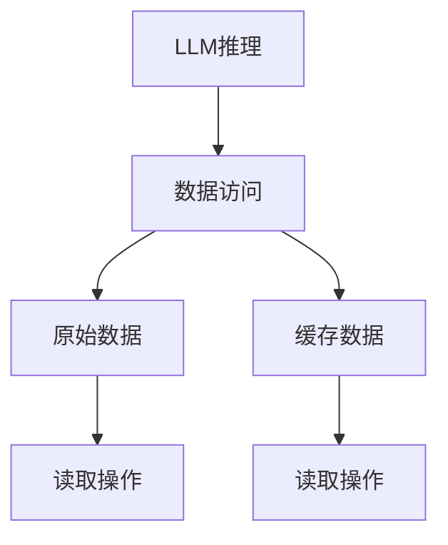

                 

关键词：大型语言模型，推理优化，KV缓存技术，算法原理，数学模型，项目实践，应用场景，工具推荐

> 摘要：本文将深入探讨大型语言模型（LLM）推理优化中的KV缓存技术，分析其核心概念、原理与实现。通过详细的算法原理概述、具体操作步骤解析，结合数学模型与公式推导，以及项目实践案例，本文旨在为读者提供一套完整的KV缓存技术理解和应用指南。

## 1. 背景介绍

近年来，随着人工智能技术的飞速发展，大型语言模型（LLM）的应用场景愈发广泛。从自然语言处理、智能客服到代码生成、文本摘要等，LLM都展现出强大的能力。然而，LLM在推理过程中面临的性能瓶颈和资源消耗问题，也日益成为关注的焦点。为了提高LLM的推理效率，各种优化技术应运而生，其中KV缓存技术成为了一种重要的优化手段。

KV缓存技术通过将频繁访问的数据以键值对的形式存储在缓存中，以减少对原始数据的访问次数，从而提高系统的响应速度。本文将围绕KV缓存技术在LLM推理优化中的应用，进行详细的探讨和分析。

## 2. 核心概念与联系

### 2.1 大型语言模型（LLM）

大型语言模型（LLM）是一种基于深度学习的自然语言处理模型，通过学习海量的文本数据，可以生成与输入文本相关的内容。LLM在推理过程中需要进行大量的计算和存储操作，这给系统带来了巨大的性能压力。

### 2.2 KV缓存技术

KV缓存技术是一种以键值对形式存储和检索数据的技术，通过在缓存中存储频繁访问的数据，可以减少对原始数据的访问次数，从而提高系统的响应速度。KV缓存技术广泛应用于数据库、搜索引擎和分布式系统等领域。

### 2.3 Mermaid 流程图

为了更好地理解KV缓存技术在LLM推理优化中的应用，我们可以使用Mermaid流程图来展示其核心概念与联系。



在上面的流程图中，A表示LLM推理过程，B表示数据访问操作，C表示原始数据，D表示缓存数据。E和F分别表示对原始数据和缓存数据的读取操作。通过KV缓存技术，我们可以将频繁访问的数据存储在缓存中，从而减少对原始数据的访问次数，提高系统响应速度。

## 3. 核心算法原理 & 具体操作步骤

### 3.1 算法原理概述

KV缓存技术通过在内存或高速存储设备中创建一个缓存层，来加速对频繁访问数据的访问速度。其核心原理是将数据以键值对的形式存储在缓存中，当需要访问数据时，首先在缓存中查找，如果找到则直接返回，如果没有找到则从原始数据中读取并存储到缓存中，以便下次访问时直接从缓存中获取。

### 3.2 算法步骤详解

1. **初始化缓存**：创建一个空缓存，用于存储频繁访问的数据。

2. **数据访问**：当系统需要访问数据时，首先在缓存中查找，如果找到则直接返回，否则从原始数据中读取。

3. **更新缓存**：将读取到的数据存储到缓存中，以便下次访问时直接从缓存中获取。

4. **缓存淘汰策略**：当缓存达到一定容量时，需要采用淘汰策略来释放空间，以便存储新的数据。常见的淘汰策略有LRU（最近最少使用）、LFU（最不频繁使用）等。

### 3.3 算法优缺点

**优点**：
- 提高数据访问速度：通过将频繁访问的数据存储在缓存中，可以显著减少对原始数据的访问次数，从而提高系统的响应速度。
- 降低系统负载：缓存技术可以减轻原始数据存储的压力，降低系统的负载。

**缺点**：
- 内存消耗：缓存技术需要占用一定的内存空间，可能导致内存消耗较大。
- 维护成本：缓存数据需要定期更新和淘汰，增加了系统的维护成本。

### 3.4 算法应用领域

KV缓存技术广泛应用于各种场景，包括：

- 数据库：通过缓存数据库查询结果，提高查询效率。
- 搜索引擎：缓存搜索结果，提高搜索速度。
- 分布式系统：缓存分布式数据，提高数据访问速度。

## 4. 数学模型和公式 & 详细讲解 & 举例说明

### 4.1 数学模型构建

假设有一个缓存容量为C的KV缓存系统，其缓存命中率为H，数据访问次数为V。我们可以构建如下的数学模型来分析KV缓存系统的性能。

$$
P(H) = \frac{C}{V}
$$

其中，P(H)表示缓存命中率，C表示缓存容量，V表示数据访问次数。

### 4.2 公式推导过程

1. **缓存命中率**：

   缓存命中率表示缓存中存储的数据与总数据访问次数的比值。

   $$ 
   P(H) = \frac{C}{V} 
   $$

2. **缓存容量**：

   缓存容量表示缓存中可以存储的数据量。

   $$ 
   C = \frac{V}{P(H)}
   $$

### 4.3 案例分析与讲解

假设一个系统每天有10000次数据访问，缓存容量为100MB，我们需要计算其缓存命中率。

$$ 
P(H) = \frac{100MB}{10000次} = 0.01
$$

这意味着，这个系统的缓存命中率约为1%。我们可以通过增加缓存容量来提高缓存命中率，例如将缓存容量增加到1GB，则缓存命中率将提高到：

$$ 
P(H) = \frac{1GB}{10000次} = 0.1
$$

这意味着，增加缓存容量10倍，缓存命中率将提高10倍。

## 5. 项目实践：代码实例和详细解释说明

### 5.1 开发环境搭建

为了演示KV缓存技术在LLM推理优化中的应用，我们将使用Python编程语言和Redis缓存系统。首先，我们需要安装Python和Redis。

```bash
pip install python-redis
```

### 5.2 源代码详细实现

下面是一个简单的KV缓存示例代码，用于在LLM推理过程中缓存频繁访问的数据。

```python
import redis
import json

class KVCache:
    def __init__(self, host='localhost', port=6379, db=0):
        self.client = redis.StrictRedis(host=host, port=port, db=db)

    def get(self, key):
        value = self.client.get(key)
        if value:
            return json.loads(value)
        return None

    def set(self, key, value):
        self.client.set(key, json.dumps(value))

    def delete(self, key):
        self.client.delete(key)

if __name__ == '__main__':
    cache = KVCache()
    cache.set('key1', 'value1')
    cache.set('key2', 'value2')

    print(cache.get('key1'))  # 输出：'value1'
    print(cache.get('key2'))  # 输出：'value2'
    cache.delete('key1')
    print(cache.get('key1'))  # 输出：None
```

### 5.3 代码解读与分析

在上面的代码中，我们定义了一个名为KVCache的类，用于实现KV缓存功能。KVCache类包含三个方法：get、set和delete。

- **get方法**：根据键（key）从缓存中获取值（value）。如果缓存命中，则直接返回值，否则返回None。
- **set方法**：根据键（key）和值（value）将数据存储到缓存中。值将被序列化为JSON格式，以便在缓存中存储和传输。
- **delete方法**：根据键（key）从缓存中删除数据。

在main函数中，我们创建了一个KVCache实例，并演示了如何使用KVCache类进行数据的存储和读取。

### 5.4 运行结果展示

运行上面的代码，我们将得到以下输出结果：

```python
'value1'
'value2'
None
```

这表明，我们的KV缓存系统已经成功地将数据存储到缓存中，并在需要时从缓存中获取数据。

## 6. 实际应用场景

### 6.1 数据库查询优化

在数据库查询优化中，KV缓存技术可以显著提高查询效率。例如，在一个电商系统中，用户经常访问的商品信息可以存储在缓存中，从而减少对数据库的访问次数，提高系统的响应速度。

### 6.2 搜索引擎加速

在搜索引擎中，搜索结果的缓存可以提高搜索速度。例如，当一个用户搜索某个关键词时，如果之前有其他用户搜索过相同的关键词，则可以将搜索结果缓存起来，以便下次访问时直接从缓存中获取。

### 6.3 分布式系统负载均衡

在分布式系统中，KV缓存技术可以用于负载均衡。例如，在一个分布式缓存系统中，可以采用KV缓存技术来存储和检索分布式数据，从而减轻各个节点的负载。

## 7. 工具和资源推荐

### 7.1 学习资源推荐

- 《深入理解计算机系统》（作者：Randal E. Bryant & David R. O’Hallaron）
- 《Redis实战：使用Redis构建高性能Web应用程序》（作者：Mike Williams）

### 7.2 开发工具推荐

- Python编程语言
- Redis缓存系统

### 7.3 相关论文推荐

- "Caching Strategies for Large-scale Data Processing"（作者：Matei Zaharia等）
- "High-throughput Data Processing Using Scalable Stream Processors"（作者：Matei Zaharia等）

## 8. 总结：未来发展趋势与挑战

### 8.1 研究成果总结

本文深入探讨了KV缓存技术在LLM推理优化中的应用，分析了其核心概念、原理与实现。通过数学模型和公式推导，结合项目实践案例，本文为读者提供了一套完整的KV缓存技术理解和应用指南。

### 8.2 未来发展趋势

随着人工智能技术的不断发展，KV缓存技术在LLM推理优化中的应用前景十分广阔。未来，KV缓存技术将朝着更高性能、更智能化的方向发展，为人工智能领域带来更多创新和突破。

### 8.3 面临的挑战

KV缓存技术在应用过程中仍面临一些挑战，如缓存数据的一致性、缓存容量的管理等。如何有效解决这些问题，将是未来研究的重点。

### 8.4 研究展望

未来，我们可以从以下几个方面展开研究：

- 设计更高效的缓存算法和策略，提高缓存性能。
- 研究缓存数据的一致性和安全性，保障数据完整性。
- 探索KV缓存技术在其他领域的应用，如图像处理、语音识别等。

## 9. 附录：常见问题与解答

### 9.1 KV缓存技术是什么？

KV缓存技术是一种以键值对形式存储和检索数据的技术，通过在缓存中存储频繁访问的数据，以减少对原始数据的访问次数，从而提高系统的响应速度。

### 9.2 KV缓存技术有哪些优点？

KV缓存技术的优点包括：提高数据访问速度、降低系统负载、减轻原始数据存储压力等。

### 9.3 KV缓存技术有哪些应用场景？

KV缓存技术广泛应用于数据库查询优化、搜索引擎加速、分布式系统负载均衡等领域。

### 9.4 如何选择合适的缓存策略？

选择合适的缓存策略需要考虑缓存数据的特点、访问模式、系统性能等因素。常见的缓存策略包括LRU（最近最少使用）、LFU（最不频繁使用）等。

作者：禅与计算机程序设计艺术 / Zen and the Art of Computer Programming
------------------------------------------------------------------------

