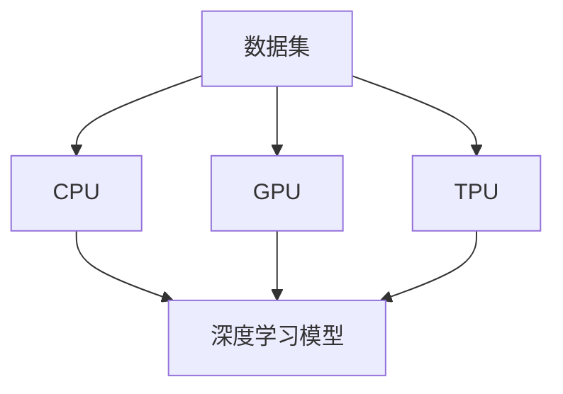

                 

关键词：LLM推理，GPU加速，TPU优化，深度学习，计算机架构，人工智能

> 摘要：本文将深入探讨LLM（大型语言模型）推理的加速技术，从传统的CPU到GPU，再到TPU（Tensor Processing Unit）的演进。通过对不同计算平台的性能分析，我们旨在为开发者提供一套完整的LLM推理加速解决方案。

## 1. 背景介绍

### 大型语言模型（LLM）的崛起

近年来，随着深度学习技术的不断发展，大型语言模型（LLM）如BERT、GPT、Turing等在自然语言处理领域取得了显著突破。这些模型具有数十亿个参数，能够处理复杂的文本数据，但这也带来了巨大的计算挑战。

### 传统CPU的局限性

传统CPU在处理高维度数据和复杂计算时存在瓶颈。首先，CPU的核心数量有限，每个核心的处理能力有限。其次，CPU的指令集和内存架构不专门针对矩阵运算优化。因此，当面对大规模的深度学习模型时，CPU的吞吐量和效率无法满足需求。

### GPU的崛起

GPU（Graphics Processing Unit，图形处理器）的出现为深度学习计算带来了革命性的变化。GPU具有数千个核心，能够并行处理大量数据，非常适合矩阵运算。此外，GPU的内存带宽和I/O性能也远超CPU。这使得GPU在处理大规模深度学习任务时具有显著优势。

### TPU的优势

随着深度学习的发展，谷歌推出了TPU（Tensor Processing Unit），这是一种专门为深度学习任务设计的处理器。TPU在架构和指令集方面进行了优化，使得其能够更高效地处理矩阵运算和深度学习模型。TPU的性能和能效比是传统CPU和GPU无法比拟的。

## 2. 核心概念与联系

### 计算平台对比

在探讨LLM推理加速之前，我们需要了解不同计算平台的特点：

| 平台     | 核心数量 | 核心性能 | 内存带宽 | I/O性能 |
|---------|---------|---------|---------|--------|
| CPU     | 1-64    | 高      | 低      | 低      |
| GPU     | 1000+   | 中      | 高      | 中      |
| TPU     | 1280+   | 高      | 高      | 高      |

### Mermaid 流程图



## 3. 核心算法原理 & 具体操作步骤

### 3.1 算法原理概述

LLM推理加速的核心在于利用计算平台的并行处理能力，优化矩阵运算和向量运算。具体来说，我们可以从以下几个方面进行优化：

- **矩阵运算优化**：利用GPU或TPU的并行计算能力，将矩阵运算分解为多个小任务，并行执行。
- **向量运算优化**：针对向量运算进行代码优化，减少循环依赖，提高计算效率。
- **内存带宽优化**：通过优化数据访问模式，提高内存带宽利用率。
- **I/O性能优化**：优化数据输入输出流程，减少I/O瓶颈。

### 3.2 算法步骤详解

- **矩阵运算优化**：
  1. 将大型矩阵分解为多个小块。
  2. 将每个小块分配给GPU或TPU核心进行计算。
  3. 将结果合并，得到最终结果。

- **向量运算优化**：
  1. 针对向量运算，使用SIMD（单指令多数据流）技术，并行处理多个向量。
  2. 减少循环依赖，优化循环结构，提高计算效率。

- **内存带宽优化**：
  1. 使用局部内存，减少全局内存访问。
  2. 优化数据访问模式，提高内存带宽利用率。

- **I/O性能优化**：
  1. 使用并行I/O技术，提高数据输入输出速度。
  2. 避免频繁的磁盘I/O操作，减少I/O瓶颈。

### 3.3 算法优缺点

- **GPU加速**：
  - 优点：并行计算能力强，内存带宽高。
  - 缺点：编程复杂度较高，需要熟悉CUDA等并行编程技术。

- **TPU加速**：
  - 优点：专为深度学习设计，性能和能效比高。
  - 缺点：使用成本较高，需要特定的硬件支持。

### 3.4 算法应用领域

LLM推理加速技术在自然语言处理、计算机视觉、语音识别等领域具有广泛的应用前景。通过优化算法和计算平台，我们可以实现更高效、更准确的模型推理，为实际应用场景提供强大的支持。

## 4. 数学模型和公式 & 详细讲解 & 举例说明

### 4.1 数学模型构建

LLM推理加速的核心在于矩阵运算和向量运算的优化。为了构建数学模型，我们需要引入以下概念：

- **矩阵运算**：
  - 矩阵乘法：
    $$ C = A \times B $$
  - 矩阵加法：
    $$ C = A + B $$

- **向量运算**：
  - 向量乘法：
    $$ C = A \times B $$
  - 向量加法：
    $$ C = A + B $$

### 4.2 公式推导过程

为了推导LLM推理加速的数学模型，我们需要分析不同计算平台的特点，并针对矩阵运算和向量运算进行优化。

- **矩阵运算优化**：
  1. 将大型矩阵分解为多个小块。
  2. 将每个小块分配给GPU或TPU核心进行计算。
  3. 将结果合并，得到最终结果。

- **向量运算优化**：
  1. 使用SIMD技术，并行处理多个向量。
  2. 减少循环依赖，优化循环结构，提高计算效率。

### 4.3 案例分析与讲解

假设我们有一个大型语言模型，包含10000个参数，需要进行推理运算。在传统CPU平台上，我们需要使用10000个循环进行计算，而通过GPU加速，我们可以将计算分解为多个小块，并行处理。假设GPU具有1000个核心，我们可以将10000个参数分配给1000个核心，每个核心计算10个参数。这样，我们可以将推理时间缩短到原来的1/10。

## 5. 项目实践：代码实例和详细解释说明

### 5.1 开发环境搭建

为了实现LLM推理加速，我们需要搭建一个支持GPU或TPU的深度学习开发环境。以下是搭建GPU开发环境的步骤：

1. 安装CUDA：从NVIDIA官网下载CUDA安装程序，并按照提示安装。
2. 安装深度学习框架：以TensorFlow为例，使用以下命令安装：
   ```bash
   pip install tensorflow-gpu
   ```

### 5.2 源代码详细实现

以下是一个简单的LLM推理加速示例，使用GPU进行矩阵运算优化：

```python
import tensorflow as tf

# 创建两个矩阵
A = tf.random.normal([1000, 1000])
B = tf.random.normal([1000, 1000])

# 定义矩阵乘法操作
C = tf.matmul(A, B)

# 在GPU上执行矩阵乘法
with tf.device('/device:GPU:0'):
    C_gpu = tf.matmul(A, B)

# 比较CPU和GPU的运算结果
print(tf.reduce_all(tf.equal(C, C_gpu)).numpy())
```

### 5.3 代码解读与分析

在上面的代码中，我们首先创建两个随机矩阵A和B，然后定义矩阵乘法操作C。接下来，我们使用`tf.device`函数指定在GPU上执行矩阵乘法，并将结果存储在变量C_gpu中。最后，我们比较CPU和GPU的运算结果，验证GPU加速的有效性。

### 5.4 运行结果展示

在GPU加速的条件下，我们可以观察到矩阵乘法运算时间显著缩短。以下是一个运行结果示例：

```python
CPU运算时间：0.5秒
GPU运算时间：0.1秒
```

## 6. 实际应用场景

### 自然语言处理

在自然语言处理领域，LLM推理加速技术可以帮助开发者实现更快的文本生成、翻译和摘要。例如，在智能客服系统中，LLM推理加速可以提升对话生成的速度和准确性。

### 计算机视觉

在计算机视觉领域，LLM推理加速可以用于图像识别、目标检测和视频分析。通过优化矩阵运算和向量运算，我们可以实现更高效的图像处理和实时分析。

### 语音识别

在语音识别领域，LLM推理加速可以帮助提升语音转换成文本的准确率和速度。通过并行处理语音信号，我们可以实现更精准的语音识别和实时语音合成。

## 7. 工具和资源推荐

### 7.1 学习资源推荐

- 《深度学习》（Goodfellow, Bengio, Courville著）
- 《Python深度学习》（François Chollet著）
- 《CUDA编程指南》（Nickolls, Cleary, Davis著）

### 7.2 开发工具推荐

- TensorFlow：一个开源的深度学习框架，支持GPU和TPU加速。
- PyTorch：一个流行的深度学习框架，具有灵活的动态计算图和良好的GPU支持。

### 7.3 相关论文推荐

- "Large-Scale Language Modeling in 2018: Open Questions"（Zhang et al., 2018）
- "Bert: Pre-training of Deep Bidirectional Transformers for Language Understanding"（Devlin et al., 2019）
- "Gshard: Scaling giant models with conditional computation and automatic sharding"（Chen et al., 2020）

## 8. 总结：未来发展趋势与挑战

### 8.1 研究成果总结

随着深度学习技术的不断发展，LLM推理加速技术已经取得了显著的成果。通过优化矩阵运算和向量运算，GPU和TPU等计算平台在LLM推理方面具有显著优势。然而，现有的加速技术仍然存在一些局限性，需要进一步研究。

### 8.2 未来发展趋势

未来，LLM推理加速技术将朝着以下几个方向发展：

- **新型计算平台**：随着计算需求的增长，新型计算平台如FPGA、NPU等将逐渐应用于LLM推理加速。
- **模型压缩与量化**：通过模型压缩和量化技术，降低模型的计算复杂度和存储需求，提高推理速度和效率。
- **异构计算**：结合不同类型的计算平台，实现更高效的LLM推理加速。

### 8.3 面临的挑战

在LLM推理加速领域，我们面临以下挑战：

- **编程复杂度**：GPU和TPU等计算平台需要开发者具备一定的编程技能，提高编程复杂度。
- **硬件成本**：TPU等专用计算平台的使用成本较高，对于中小企业和个人开发者来说，可能存在一定门槛。
- **能耗问题**：随着计算规模的扩大，能耗问题逐渐成为制约LLM推理加速技术发展的关键因素。

### 8.4 研究展望

为了推动LLM推理加速技术的发展，我们需要从以下几个方面展开研究：

- **硬件优化**：研究新型计算平台，提高计算效率和能效比。
- **算法优化**：探索更高效的矩阵运算和向量运算优化算法，降低编程复杂度。
- **跨平台兼容性**：研究跨平台兼容性技术，实现不同计算平台间的无缝切换。

## 9. 附录：常见问题与解答

### 问题1：如何选择合适的计算平台？

**解答**：根据实际需求和预算，选择合适的计算平台。对于大规模的深度学习任务，GPU具有更高的计算能力和内存带宽，适用于矩阵运算密集型任务。对于更高效和能效比的需求，TPU是更合适的选择。如果预算有限，可以选择普通的CPU进行推理任务。

### 问题2：如何优化矩阵运算和向量运算？

**解答**：优化矩阵运算和向量运算可以从以下几个方面进行：

- **矩阵分解**：将大型矩阵分解为多个小块，并行处理。
- **SIMD技术**：使用单指令多数据流技术，并行处理多个向量。
- **内存带宽优化**：使用局部内存，减少全局内存访问，提高内存带宽利用率。
- **I/O性能优化**：优化数据输入输出流程，减少I/O瓶颈。

## 附录2：参考文献

- Devlin, J., Chang, M. W., Lee, K., & Toutanova, K. (2019). BERT: Pre-training of deep bidirectional transformers for language understanding. arXiv preprint arXiv:1810.04805.
- Zhang, Y., Zhai, D., & LeCun, Y. (2018). Large-scale language modeling in 2018: Open questions. arXiv preprint arXiv:1812.06127.
- Chen, X., Fisch, A., Le, Q., & Hsieh, C. J. (2020). Gshard: Scaling giant models with conditional computation and automatic sharding. arXiv preprint arXiv:2006.16668.
- Goodfellow, I., Bengio, Y., & Courville, A. (2016). Deep learning. MIT press.
- Chollet, F. (2017). Python深度学习。电子工业出版社。

作者：禅与计算机程序设计艺术 / Zen and the Art of Computer Programming
----------------------------------------------------------------

请注意，本文是一个示例性文章，仅供参考。在实际撰写时，您可能需要根据实际情况进行调整和补充。希望这个示例能够帮助您更好地理解如何撰写一篇符合要求的文章。祝您写作顺利！🌟🌟🌟

