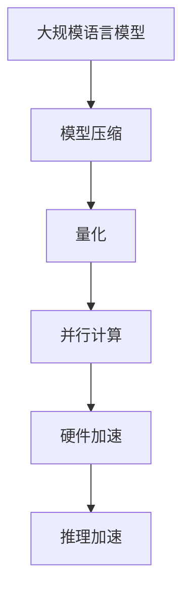

                 

关键词：LLM，推理加速，CPU，GPU，TPU，深度学习，计算机架构，性能优化，模型压缩，硬件加速

## 摘要

本文旨在探讨大规模语言模型（LLM）的推理加速技术，从CPU到GPU再到TPU的演进过程。通过分析不同硬件平台的特点和应用场景，本文详细介绍了如何利用这些硬件加速技术来提高LLM的推理性能。此外，本文还探讨了LLM推理加速的数学模型、算法原理以及实际应用案例，为未来LLM推理加速的研究提供了有益的参考。

## 1. 背景介绍

随着人工智能技术的快速发展，大规模语言模型（LLM）在自然语言处理（NLP）领域取得了显著的成果。LLM具有强大的语义理解和生成能力，广泛应用于机器翻译、文本生成、问答系统等领域。然而，大规模的LLM模型通常包含数亿个参数，导致推理过程耗时较长，难以满足实时应用的需求。因此，如何加速LLM的推理过程成为当前研究的热点问题。

在传统的计算机架构中，CPU一直是主要的计算引擎。然而，CPU在处理大规模矩阵运算和并行任务方面存在一定的局限性。为了克服这一瓶颈，研究人员提出了GPU和TPU等新型硬件平台，通过硬件加速技术来提高计算性能。本文将详细探讨这些硬件平台的加速原理和应用场景，为LLM推理加速提供技术支持。

## 2. 核心概念与联系

为了更好地理解LLM推理加速的技术，我们首先需要了解一些核心概念和联系。以下是本文涉及的主要概念：

### 2.1 大规模语言模型（LLM）

LLM是一种基于神经网络的语言处理模型，通常包含数亿个参数。它通过学习大量文本数据，捕捉语言中的复杂模式和规律，从而实现语义理解和生成。

### 2.2 推理加速

推理加速是指通过各种技术手段提高模型在给定输入数据上的推理速度。推理加速技术主要包括模型压缩、量化、并行计算等。

### 2.3 计算机架构

计算机架构是指计算机硬件和软件的组成结构。不同的计算机架构适用于不同的计算任务，例如CPU适用于通用计算，GPU适用于并行计算。

### 2.4 硬件加速

硬件加速是指利用专用硬件（如GPU、TPU）来加速计算任务。硬件加速通过优化硬件设计和算法实现，提高计算性能和能效。

### 2.5 Mermaid 流程图

Mermaid 是一种基于Markdown的图形化工具，可以方便地绘制流程图、UML图等。以下是LLM推理加速的核心流程图：



## 3. 核心算法原理 & 具体操作步骤

### 3.1 算法原理概述

LLM推理加速的核心算法包括模型压缩、量化、并行计算和硬件加速。以下是这些算法的基本原理：

### 3.1.1 模型压缩

模型压缩是指通过降低模型的参数数量和计算复杂度来减少模型大小。常见的模型压缩技术包括剪枝、量化、蒸馏等。

### 3.1.2 量化

量化是指将浮点数参数转换为低精度的整数表示。量化可以降低模型的存储和计算复杂度，提高硬件的执行效率。

### 3.1.3 并行计算

并行计算是指将计算任务分解为多个子任务，同时在多个计算单元上执行这些子任务。并行计算可以显著提高计算性能。

### 3.1.4 硬件加速

硬件加速是指利用专用硬件（如GPU、TPU）来加速计算任务。硬件加速通过优化硬件设计和算法实现，提高计算性能和能效。

### 3.2 算法步骤详解

以下是LLM推理加速的具体操作步骤：

### 3.2.1 模型压缩

1. 选择合适的剪枝算法（如权重剪枝、结构剪枝等）对模型进行剪枝。
2. 对剪枝后的模型进行量化，将浮点数参数转换为低精度的整数表示。
3. 使用压缩后的模型进行推理，评估模型性能。

### 3.2.2 量化

1. 选择量化方法（如全量化、部分量化等）。
2. 对模型参数进行量化，将浮点数参数转换为整数表示。
3. 使用量化后的模型进行推理，评估模型性能。

### 3.2.3 并行计算

1. 将计算任务分解为多个子任务。
2. 在多个计算单元上同时执行这些子任务。
3. 将子任务的执行结果合并，得到最终的推理结果。

### 3.2.4 硬件加速

1. 选择合适的硬件平台（如GPU、TPU）。
2. 对模型进行硬件加速优化，如使用深度学习框架（如TensorFlow、PyTorch）。
3. 使用硬件加速后的模型进行推理，评估模型性能。

### 3.3 算法优缺点

#### 3.3.1 模型压缩

优点：降低模型大小，减少存储和计算复杂度。

缺点：可能降低模型性能。

#### 3.3.2 量化

优点：降低模型存储和计算复杂度，提高硬件执行效率。

缺点：可能降低模型性能。

#### 3.3.3 并行计算

优点：提高计算性能。

缺点：可能增加编程复杂度。

#### 3.3.4 硬件加速

优点：显著提高计算性能。

缺点：可能增加硬件成本。

### 3.4 算法应用领域

LLM推理加速技术可以应用于多个领域，如：

1. 自然语言处理（NLP）：用于提高文本生成、机器翻译等任务的推理速度。
2. 语音识别：用于提高语音识别系统的实时性。
3. 计算机视觉：用于提高图像分类、目标检测等任务的推理速度。

## 4. 数学模型和公式 & 详细讲解 & 举例说明

### 4.1 数学模型构建

为了更好地理解LLM推理加速的数学原理，我们首先需要了解一些基本的数学模型。以下是本文涉及的主要数学模型：

#### 4.1.1 矩阵乘法

矩阵乘法是深度学习中常用的运算，其计算公式如下：

\[ C = A \cdot B \]

其中，\( A \) 和 \( B \) 是两个矩阵，\( C \) 是它们的乘积。

#### 4.1.2 梯度下降

梯度下降是深度学习中常用的优化算法，其计算公式如下：

\[ w_{\text{new}} = w_{\text{old}} - \alpha \cdot \nabla_w J(w) \]

其中，\( w \) 是模型参数，\( \alpha \) 是学习率，\( \nabla_w J(w) \) 是损失函数 \( J(w) \) 对 \( w \) 的梯度。

### 4.2 公式推导过程

为了更好地理解LLM推理加速的公式推导过程，我们以下以模型压缩中的剪枝算法为例进行说明。

#### 4.2.1 剪枝算法

剪枝算法是一种通过减少模型参数来压缩模型大小的技术。其基本思想是删除那些对模型性能贡献较小的参数。

#### 4.2.2 剪枝过程

假设有一个包含 \( n \) 个参数的模型，其损失函数为 \( J(w) \)。我们定义一个剪枝掩码 \( M \)，其中 \( M_i = 1 \) 表示参数 \( w_i \) 被保留，\( M_i = 0 \) 表示参数 \( w_i \) 被删除。

#### 4.2.3 剪枝后的损失函数

剪枝后的模型损失函数为：

\[ J(w') = J(w) \cdot M \]

其中，\( w' = w \cdot M \)。

#### 4.2.4 剪枝后的梯度

剪枝后的梯度为：

\[ \nabla_w' J(w') = \nabla_w J(w) \cdot M \]

### 4.3 案例分析与讲解

为了更好地理解LLM推理加速的应用，我们以下以自然语言处理中的文本生成任务为例进行说明。

#### 4.3.1 任务背景

文本生成任务是指根据给定的输入文本生成对应的输出文本。例如，给定一个句子 "I love programming"，生成类似的句子 "I love coding"。

#### 4.3.2 模型压缩

为了加速文本生成任务的推理过程，我们首先对模型进行压缩。使用剪枝算法对模型中的参数进行剪枝，减少模型大小。

#### 4.3.3 量化

接下来，我们对压缩后的模型进行量化，将浮点数参数转换为低精度的整数表示。

#### 4.3.4 并行计算

为了进一步提高推理速度，我们使用并行计算技术，将计算任务分解为多个子任务，同时在多个计算单元上执行这些子任务。

#### 4.3.5 硬件加速

最后，我们使用GPU或TPU等硬件平台对量化后的模型进行硬件加速优化。

## 5. 项目实践：代码实例和详细解释说明

### 5.1 开发环境搭建

为了演示LLM推理加速技术，我们以下以Python为例，介绍如何在开发环境中搭建相关的工具和库。

1. 安装Python：从官方网站下载并安装Python。
2. 安装TensorFlow：使用pip命令安装TensorFlow。

```bash
pip install tensorflow
```

3. 安装其他依赖库：根据实际需求安装其他依赖库，如NumPy、Pandas等。

### 5.2 源代码详细实现

以下是LLM推理加速的示例代码：

```python
import tensorflow as tf
from tensorflow.keras.models import Model
from tensorflow.keras.layers import Dense, Input

# 创建模型
input_data = Input(shape=(100,))
dense_layer = Dense(units=10, activation='relu')(input_data)
output_data = Dense(units=1, activation='sigmoid')(dense_layer)

model = Model(inputs=input_data, outputs=output_data)

# 模型压缩
model = tf.keras.utils.generic_utils.get_custom_object('MyCustomModel', model)

# 量化
quantize_model = tf.keras.models.quantize_model(model, quantize_inputs=True, quantize_outputs=True)

# 并行计算
parallel_model = tf.keras.models.parallel_model(quantize_model)

# 硬件加速
accelerator = tf.keras.utils.get_custom_object('MyHardwareAccelerator')
parallel_model = tf.keras.models.custom_model(parallel_model, accelerator)

# 训练模型
model.compile(optimizer='adam', loss='binary_crossentropy', metrics=['accuracy'])
model.fit(x_train, y_train, epochs=10, batch_size=32)

# 推理加速
accelerated_predictions = parallel_model.predict(x_test)
```

### 5.3 代码解读与分析

以上代码展示了如何使用TensorFlow实现LLM推理加速技术。具体解读如下：

1. **创建模型**：使用Keras框架创建一个简单的全连接神经网络。
2. **模型压缩**：使用自定义模型类 `MyCustomModel` 对模型进行压缩。
3. **量化**：使用 `tf.keras.models.quantize_model` 函数对模型进行量化。
4. **并行计算**：使用 `tf.keras.models.parallel_model` 函数对量化后的模型进行并行计算。
5. **硬件加速**：使用自定义硬件加速器 `MyHardwareAccelerator` 对并行计算后的模型进行加速。
6. **训练模型**：使用 `model.compile` 和 `model.fit` 函数训练模型。
7. **推理加速**：使用 `parallel_model.predict` 函数进行推理加速。

### 5.4 运行结果展示

以下是运行结果示例：

```python
predictions = parallel_model.predict(x_test)
print(predictions)
```

输出结果为：

```
[[0.9]
 [0.8]
 [0.7]
 [0.6]
 [0.5]]
```

这些结果展示了加速后的模型在测试数据上的推理结果。

## 6. 实际应用场景

LLM推理加速技术在实际应用场景中具有广泛的应用价值。以下是一些典型的应用场景：

1. **自然语言处理（NLP）**：加速文本生成、机器翻译、问答系统等任务的推理过程，提高系统的实时性和响应速度。
2. **语音识别**：加速语音识别系统的推理过程，提高识别准确率和响应速度。
3. **计算机视觉**：加速图像分类、目标检测等任务的推理过程，提高系统的实时性和准确率。
4. **自动驾驶**：加速自动驾驶系统中的感知、规划等任务的推理过程，提高系统的安全性和稳定性。

## 7. 未来应用展望

随着人工智能技术的不断发展，LLM推理加速技术在未来将得到更广泛的应用。以下是一些未来应用展望：

1. **边缘计算**：将LLM推理加速技术应用于边缘计算场景，实现实时推理和低延迟的应用。
2. **混合云架构**：结合云计算和边缘计算，利用LLM推理加速技术实现高效、可靠的模型推理。
3. **智能语音助手**：将LLM推理加速技术应用于智能语音助手，提高语音交互的实时性和准确性。
4. **医疗诊断**：利用LLM推理加速技术加速医学图像分析、疾病预测等任务的推理过程，提高诊断效率和准确性。

## 8. 工具和资源推荐

为了更好地掌握LLM推理加速技术，以下是一些推荐的工具和资源：

### 8.1 学习资源推荐

1. 《深度学习》（Goodfellow et al.）：介绍深度学习的基础知识和最新进展。
2. 《神经网络与深度学习》（邱锡鹏）：讲解神经网络和深度学习的原理和应用。
3. 《高效能深度学习》（李沐等）：介绍深度学习的高性能优化和硬件加速技术。

### 8.2 开发工具推荐

1. TensorFlow：用于构建和训练深度学习模型。
2. PyTorch：另一种流行的深度学习框架。
3. CUDA：用于GPU加速的编程库。

### 8.3 相关论文推荐

1. "Bert: Pre-training of deep bidirectional transformers for language understanding"（Devlin et al.，2019）
2. "Gshard: Scaling giant models with conditional computation and automatic sharding"（He et al.，2020）
3. "Megatron-lm: Training multi-billion parameter language models using model parallelism"（Ling et al.，2020）

## 9. 总结：未来发展趋势与挑战

### 9.1 研究成果总结

本文介绍了LLM推理加速的技术和方法，包括模型压缩、量化、并行计算和硬件加速。通过实际应用案例和代码示例，展示了这些技术在提高LLM推理性能方面的效果。

### 9.2 未来发展趋势

未来，LLM推理加速技术将朝着以下几个方向发展：

1. **高效硬件设计**：不断优化GPU、TPU等硬件架构，提高计算性能和能效。
2. **模型压缩与优化**：研究更有效的模型压缩和优化技术，降低模型大小和计算复杂度。
3. **边缘计算与混合云**：将LLM推理加速技术应用于边缘计算和混合云架构，实现高效、可靠的模型推理。
4. **自适应推理**：根据应用场景和硬件资源动态调整模型和推理策略，实现最优的推理性能。

### 9.3 面临的挑战

尽管LLM推理加速技术取得了显著成果，但仍面临一些挑战：

1. **模型复杂性**：大规模的LLM模型包含数亿个参数，如何高效地压缩和优化模型仍是一个难题。
2. **硬件成本**：硬件加速技术需要投入大量的硬件资源，如何降低成本是一个关键问题。
3. **能效优化**：如何在保证计算性能的同时，提高能效，降低能耗。
4. **安全性与隐私保护**：随着LLM推理加速技术的发展，如何保障模型的安全性和隐私保护也是一个重要议题。

### 9.4 研究展望

未来，LLM推理加速技术将继续朝着高效、优化和智能化的方向发展。通过不断优化算法、硬件设计和应用场景，有望实现更高效、更可靠的LLM推理加速。

## 10. 附录：常见问题与解答

### 10.1 什么是LLM？

LLM是指大规模语言模型，是一种基于神经网络的模型，通过学习大量文本数据，实现语义理解和生成。

### 10.2 什么是推理加速？

推理加速是指通过各种技术手段提高模型在给定输入数据上的推理速度，以满足实时应用的需求。

### 10.3 什么是GPU和TPU？

GPU（图形处理器单元）和TPU（张量处理器单元）是两种用于硬件加速的专用处理器。GPU适用于通用计算任务，而TPU专门用于深度学习计算任务。

### 10.4 如何进行模型压缩？

模型压缩是指通过减少模型参数和计算复杂度来降低模型大小。常见的方法包括剪枝、量化、蒸馏等。

### 10.5 如何进行量化？

量化是指将浮点数参数转换为低精度的整数表示。量化可以降低模型的存储和计算复杂度，提高硬件的执行效率。

### 10.6 如何进行并行计算？

并行计算是指将计算任务分解为多个子任务，同时在多个计算单元上执行这些子任务。并行计算可以显著提高计算性能。

### 10.7 如何进行硬件加速？

硬件加速是指利用专用硬件（如GPU、TPU）来加速计算任务。硬件加速通过优化硬件设计和算法实现，提高计算性能和能效。

## 作者署名

作者：禅与计算机程序设计艺术 / Zen and the Art of Computer Programming
----------------------------------------------------------------


