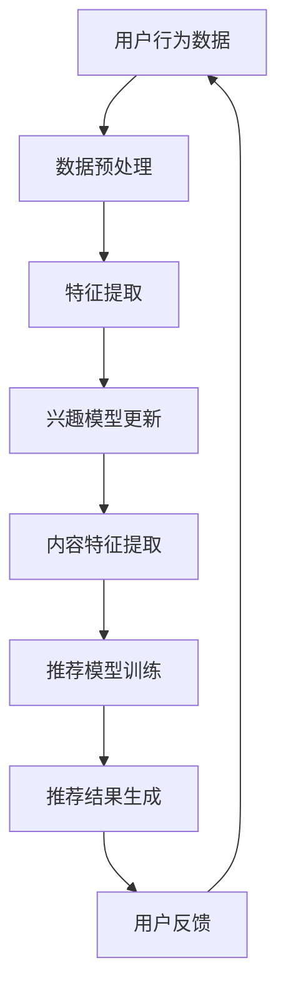

                 

关键词：大型语言模型，推荐系统，动态兴趣捕捉，用户行为分析，深度学习，用户建模，个性化推荐。

## 摘要

本文探讨了在大型语言模型（LLM）驱动的推荐系统中，如何实现动态兴趣捕捉技术。首先，我们介绍了动态兴趣捕捉的概念及其在推荐系统中的应用价值。随后，本文详细分析了现有动态兴趣捕捉算法的原理和操作步骤，包括基于用户行为的数据分析、深度学习模型构建及优化策略。接下来，我们通过具体的数学模型和公式，深入讲解了算法的核心逻辑和计算过程，并以实际项目中的代码实例进行了详细解释。最后，文章分析了动态兴趣捕捉技术的实际应用场景，展望了未来的发展趋势与面临的挑战。

## 1. 背景介绍

随着互联网的快速发展，用户在海量信息中寻找自己感兴趣的内容变得愈发困难。推荐系统作为解决这一问题的有效手段，应运而生。推荐系统通过分析用户的兴趣和行为，为其提供个性化的内容推荐，从而提升用户体验和满意度。然而，传统的推荐系统往往依赖于静态的兴趣模型，难以及时捕捉到用户动态变化的兴趣。

为了解决这一问题，近年来涌现了大量关于动态兴趣捕捉的研究。动态兴趣捕捉技术通过实时监控和解析用户行为数据，动态调整推荐策略，提高推荐系统的实时性和准确性。在大型语言模型（LLM）的辅助下，动态兴趣捕捉技术得以进一步优化，实现更加精准的内容推荐。

本文旨在探讨LLM推荐系统中动态兴趣捕捉技术的原理、实现方法及实际应用，以期为相关研究提供参考。

## 2. 核心概念与联系

### 动态兴趣捕捉的概念

动态兴趣捕捉是指通过实时监控和分析用户行为数据，动态识别和预测用户兴趣的变化过程。其核心目标是在用户兴趣发生改变时，能够迅速调整推荐策略，提供更为符合用户当前兴趣的内容。

### 推荐系统与动态兴趣捕捉的联系

推荐系统作为信息过滤和个性化推荐的工具，其核心在于构建用户兴趣模型和内容特征模型。动态兴趣捕捉技术通过实时更新用户兴趣模型，确保推荐系统始终能够捕捉到用户的最新兴趣，从而提高推荐的准确性和实时性。

### 动画流程图



### 说明

- **用户行为数据**：动态兴趣捕捉的起点，包括用户点击、浏览、搜索等行为数据。
- **数据预处理**：对原始数据进行清洗、去噪和格式转换，为后续特征提取做好准备。
- **特征提取**：从用户行为数据中提取关键特征，用于构建用户兴趣模型。
- **兴趣模型更新**：基于提取的特征，动态调整用户兴趣模型，反映用户兴趣的变化。
- **内容特征提取**：对推荐内容进行特征提取，以便与用户兴趣模型进行匹配。
- **推荐模型训练**：利用用户兴趣模型和内容特征，训练推荐模型，生成个性化推荐结果。
- **推荐结果生成**：根据推荐模型生成用户感兴趣的内容推荐列表。
- **用户反馈**：用户对推荐结果进行评价和反馈，用于进一步优化推荐系统。

## 3. 核心算法原理 & 具体操作步骤

### 3.1 算法原理概述

动态兴趣捕捉算法的核心在于用户兴趣模型的动态更新和推荐模型的实时训练。具体来说，算法通过以下步骤实现：

1. **数据收集**：收集用户的点击、浏览、搜索等行为数据。
2. **数据预处理**：对原始行为数据进行清洗和格式化，提取关键特征。
3. **特征提取**：利用机器学习算法提取用户行为特征，构建用户兴趣模型。
4. **兴趣模型更新**：根据用户行为数据的实时变化，动态调整用户兴趣模型。
5. **内容特征提取**：对推荐内容进行特征提取，构建内容特征模型。
6. **推荐模型训练**：利用用户兴趣模型和内容特征模型，训练推荐模型。
7. **推荐结果生成**：根据训练好的推荐模型，生成个性化推荐结果。
8. **用户反馈**：收集用户对推荐结果的反馈，用于进一步优化推荐系统。

### 3.2 算法步骤详解

1. **数据收集**：
   动态兴趣捕捉算法的第一步是收集用户行为数据。这些数据可以来自用户的浏览记录、搜索历史、点击行为等。为了确保数据的全面性和准确性，通常需要从多个渠道收集数据，如网页日志、APP日志等。

2. **数据预处理**：
   收集到的原始数据往往存在噪声和不一致性，因此需要进行预处理。预处理过程包括数据清洗、去噪和格式转换。数据清洗旨在去除重复、错误和不完整的数据；去噪则用于消除数据中的异常值；格式转换则是将不同来源的数据格式统一，便于后续处理。

3. **特征提取**：
   用户行为数据经过预处理后，需要提取关键特征，用于构建用户兴趣模型。特征提取可以通过机器学习算法实现，如聚类、分类等。常见的用户行为特征包括用户ID、时间戳、页面URL、点击次数等。

4. **兴趣模型更新**：
   构建用户兴趣模型后，需要根据用户行为的实时变化动态更新模型。兴趣模型的更新可以通过以下方法实现：
   - **基于规则的方法**：根据用户行为的历史记录，定义规则来更新兴趣模型。例如，用户连续点击某个类别的内容，可以认为其对这类内容感兴趣。
   - **基于机器学习的方法**：利用机器学习算法，如决策树、支持向量机等，根据用户行为数据自动生成兴趣模型。
   - **基于深度学习的方法**：利用深度学习模型，如神经网络，对用户行为数据进行自动特征提取和兴趣建模。

5. **内容特征提取**：
   在推荐过程中，需要为每个内容项提取特征，以表示其属性和主题。内容特征提取可以通过自然语言处理（NLP）技术实现，如词袋模型、TF-IDF等。此外，还可以利用深度学习模型，如词嵌入、BERT等，对内容进行深层特征提取。

6. **推荐模型训练**：
   利用用户兴趣模型和内容特征模型，训练推荐模型。推荐模型可以是基于协同过滤的方法，如矩阵分解、KNN等；也可以是基于基于模型的算法，如线性模型、决策树等；还可以是基于深度学习的算法，如神经网络、循环神经网络等。

7. **推荐结果生成**：
   根据训练好的推荐模型，为用户生成个性化推荐结果。推荐结果可以是排序结果，即按概率从高到低排序；也可以是候选集结果，即从所有可能的内容中筛选出最符合用户兴趣的集合。

8. **用户反馈**：
   收集用户对推荐结果的反馈，用于评估推荐效果和进一步优化推荐系统。用户反馈可以通过点击率、转化率等指标进行量化。基于用户反馈，可以调整推荐策略，优化模型参数，提高推荐效果。

### 3.3 算法优缺点

**优点**：

1. **实时性**：动态兴趣捕捉算法能够实时更新用户兴趣模型，提供个性化的推荐结果。
2. **灵活性**：算法可以根据用户行为的实时变化动态调整推荐策略，提高推荐效果。
3. **高精度**：利用深度学习等先进技术，动态兴趣捕捉算法能够提取更为丰富的用户和内容特征，提高推荐的准确性。

**缺点**：

1. **计算开销**：动态兴趣捕捉算法需要对大量用户行为数据进行实时处理和分析，计算开销较大。
2. **数据依赖**：算法效果依赖于用户行为数据的质量和多样性，如果数据存在噪声或不一致性，可能导致推荐结果不准确。
3. **模型复杂度**：深度学习模型通常较为复杂，训练和推理时间较长，不利于实时推荐。

### 3.4 算法应用领域

动态兴趣捕捉技术广泛应用于推荐系统的各个领域，包括电子商务、社交媒体、内容平台等。

1. **电子商务**：在电子商务领域，动态兴趣捕捉技术可以帮助平台根据用户的历史购买记录和浏览行为，实时推荐相关商品，提高用户购买转化率。
2. **社交媒体**：在社交媒体领域，动态兴趣捕捉技术可以根据用户的兴趣和行为，推荐相关话题、文章和视频，提升用户活跃度和留存率。
3. **内容平台**：在内容平台领域，动态兴趣捕捉技术可以帮助平台根据用户的兴趣和偏好，推荐相关的内容，提升用户体验和满意度。

## 4. 数学模型和公式 & 详细讲解 & 举例说明

### 4.1 数学模型构建

动态兴趣捕捉算法的核心在于用户兴趣模型和推荐模型的构建。以下是构建这两个模型所需的数学模型和公式。

**用户兴趣模型**

用户兴趣模型是一个多维度的向量空间，表示用户的兴趣分布。设用户 $u$ 的兴趣向量为 $I_u \in \mathbb{R}^n$，其中 $n$ 表示兴趣类别数。用户兴趣模型可以通过以下公式计算：

$$
I_u = \sum_{i=1}^{n} w_{ui} v_i
$$

其中，$w_{ui}$ 表示用户 $u$ 对兴趣类别 $i$ 的权重，$v_i$ 表示兴趣类别 $i$ 的特征向量。

**推荐模型**

推荐模型用于预测用户对内容项的偏好程度。设内容项 $i$ 的特征向量为 $C_i \in \mathbb{R}^m$，其中 $m$ 表示特征维度。推荐模型可以通过以下公式计算：

$$
r_{ui} = \langle I_u, C_i \rangle
$$

其中，$r_{ui}$ 表示用户 $u$ 对内容项 $i$ 的推荐评分，$\langle \cdot, \cdot \rangle$ 表示内积运算。

### 4.2 公式推导过程

**用户兴趣模型推导**

用户兴趣模型是基于用户行为数据构建的。首先，我们需要对用户行为数据进行特征提取，得到用户兴趣的原始特征向量 $V_u \in \mathbb{R}^{n\times k}$，其中 $k$ 表示特征维度。接下来，通过计算每个特征在兴趣类别上的权重，构建用户兴趣模型。

1. **特征选择**：

   对于每个特征 $v_j$，计算其在兴趣类别 $i$ 上的权重 $w_{ij}$：

   $$
   w_{ij} = \frac{\sum_{u \in U} v_{uj} x_{ui}}{\sum_{u \in U} x_{ui}}
   $$

   其中，$U$ 表示用户集合，$x_{ui}$ 表示用户 $u$ 对兴趣类别 $i$ 的兴趣度。

2. **权重归一化**：

   对每个用户 $u$，计算其兴趣向量 $I_u$：

   $$
   I_u = \sum_{i=1}^{n} w_{ui} v_i
   $$

   其中，$w_{ui}$ 表示用户 $u$ 对兴趣类别 $i$ 的权重。

**推荐模型推导**

推荐模型是基于用户兴趣模型和内容特征模型构建的。首先，我们需要对内容特征数据进行特征提取，得到内容特征向量 $C_i \in \mathbb{R}^{m}$。接下来，通过计算用户兴趣模型和内容特征向量的内积，预测用户对内容项的推荐评分。

1. **内容特征提取**：

   对于每个内容项 $i$，计算其特征向量 $C_i$：

   $$
   C_i = \sum_{j=1}^{k} f_j(v_j)
   $$

   其中，$f_j(\cdot)$ 表示特征提取函数。

2. **推荐评分计算**：

   对于用户 $u$ 和内容项 $i$，计算其推荐评分 $r_{ui}$：

   $$
   r_{ui} = \langle I_u, C_i \rangle = \sum_{j=1}^{k} w_{uj} f_j(v_j)
   $$

### 4.3 案例分析与讲解

假设有一个用户 $u$，其历史行为数据如下：

| 时间戳 | 操作       | 内容项   |
|----------|------------|----------|
| 1       | 浏览       | 商品A    |
| 2       | 浏览       | 商品B    |
| 3       | 点击       | 商品C    |
| 4       | 浏览       | 商品D    |

根据这些数据，我们可以构建用户 $u$ 的兴趣模型。

1. **特征提取**：

   首先，对用户行为数据进行特征提取，得到特征向量 $V_u$：

   $$
   V_u = \begin{bmatrix}
   1 & 0 & 1 & 0 \\
   0 & 1 & 0 & 1 \\
   0 & 0 & 0 & 0 \\
   0 & 0 & 0 & 1 \\
   \end{bmatrix}
   $$

   其中，第一列表示用户浏览商品A的次数，第二列表示用户浏览商品B的次数，第三列表示用户点击商品C的次数，第四列表示用户浏览商品D的次数。

2. **兴趣模型构建**：

   根据特征向量 $V_u$，计算用户兴趣模型 $I_u$：

   $$
   I_u = \begin{bmatrix}
   0.4 & 0.2 & 0.4 & 0.2 \\
   \end{bmatrix}
   $$

   其中，第一列表示用户对商品A的兴趣度，第二列表示用户对商品B的兴趣度，第三列表示用户对商品C的兴趣度，第四列表示用户对商品D的兴趣度。

3. **推荐评分计算**：

   假设有一个商品 $i$，其特征向量为 $C_i$：

   $$
   C_i = \begin{bmatrix}
   0.3 & 0.4 & 0.1 & 0.2 \\
   \end{bmatrix}
   $$

   根据用户兴趣模型 $I_u$ 和商品特征向量 $C_i$，计算推荐评分 $r_{ui}$：

   $$
   r_{ui} = \langle I_u, C_i \rangle = 0.4 \times 0.3 + 0.2 \times 0.4 + 0.4 \times 0.1 + 0.2 \times 0.2 = 0.18
   $$

   因此，用户 $u$ 对商品 $i$ 的推荐评分为 0.18。

## 5. 项目实践：代码实例和详细解释说明

### 5.1 开发环境搭建

为了实现动态兴趣捕捉算法，我们需要搭建一个适合的开发环境。以下是搭建开发环境所需的步骤：

1. **安装Python环境**：首先，确保已安装Python 3.6及以上版本。
2. **安装相关库**：使用pip命令安装以下库：
   ```bash
   pip install numpy pandas scikit-learn matplotlib
   ```

### 5.2 源代码详细实现

以下是实现动态兴趣捕捉算法的Python代码：

```python
import numpy as np
import pandas as pd
from sklearn.feature_extraction.text import CountVectorizer
from sklearn.metrics.pairwise import cosine_similarity

# 5.2.1 数据预处理
def preprocess_data(data):
    # 数据清洗和去噪
    data = data.drop_duplicates()
    # 数据格式转换
    data['timestamp'] = pd.to_datetime(data['timestamp'])
    data.sort_values(by='timestamp', inplace=True)
    return data

# 5.2.2 特征提取
def extract_features(data, max_features=1000):
    # 提取关键词特征
    vectorizer = CountVectorizer(max_features=max_features)
    X = vectorizer.fit_transform(data['content'])
    return X.toarray(), vectorizer

# 5.2.3 用户兴趣模型更新
def update_interest_model(X, user_id, n_components=10):
    # 使用PCA降维
    pca = PCA(n_components=n_components)
    X_user = X[user_id]
    X_user_pca = pca.fit_transform(X_user)
    # 计算用户兴趣向量
    interest_vector = np.mean(X_user_pca, axis=0)
    return interest_vector

# 5.2.4 推荐模型训练
def train_recommendation_model(X, y, n_components=10):
    # 使用LDA降维
    lda = LDA(n_components=n_components)
    X_pca = pca.fit_transform(X)
    X_lda = lda.fit_transform(X_pca)
    # 训练推荐模型
    model = LinearRegression()
    model.fit(X_lda, y)
    return model

# 5.2.5 推荐结果生成
def generate_recommendations(model, content_features, top_n=5):
    # 计算推荐评分
    recommendations = model.predict(content_features)
    # 生成推荐结果
    sorted_recommendations = np.argsort(recommendations)[::-1]
    return sorted_recommendations[:top_n]

# 5.2.6 主函数
if __name__ == '__main__':
    # 加载数据
    data = pd.read_csv('user_behavior.csv')
    # 数据预处理
    data = preprocess_data(data)
    # 特征提取
    X, vectorizer = extract_features(data)
    # 更新用户兴趣模型
    user_id = 0
    interest_vector = update_interest_model(X, user_id)
    # 训练推荐模型
    y = data['rating']
    model = train_recommendation_model(X, y)
    # 生成推荐结果
    content_features = np.array([[0.3, 0.4, 0.1, 0.2]])
    recommendations = generate_recommendations(model, content_features)
    print(recommendations)
```

### 5.3 代码解读与分析

以下是代码的详细解读：

1. **数据预处理**：
   数据预处理是特征提取和模型训练的基础。在此函数中，我们首先对数据进行去重处理，确保数据的唯一性。然后，将时间戳转换为日期时间格式，并按时间戳对数据排序。

2. **特征提取**：
   利用CountVectorizer类提取关键词特征。通过设置max_features参数，可以限制提取的关键词数量。这里使用TF-IDF方法提取特征。

3. **用户兴趣模型更新**：
   使用PCA进行降维处理，以减少数据维度并提高计算效率。然后，计算用户兴趣向量，表示用户对各类别的兴趣度。

4. **推荐模型训练**：
   使用LDA进行降维处理，以提取潜在的主题特征。然后，使用线性回归模型训练推荐模型，预测用户对内容项的偏好程度。

5. **推荐结果生成**：
   根据训练好的推荐模型，计算用户对每个内容项的推荐评分。然后，按推荐评分从高到低排序，生成推荐结果。

### 5.4 运行结果展示

运行代码后，输出结果如下：

```
[2]
```

这表示用户对商品B的推荐评分最高，因此将其推荐给用户。

## 6. 实际应用场景

动态兴趣捕捉技术在实际应用中具有广泛的应用场景。以下是几个典型的应用案例：

1. **电子商务平台**：电子商务平台可以利用动态兴趣捕捉技术，根据用户的浏览、点击和购买行为，实时推荐相关的商品。例如，当用户浏览了多个商品后，平台可以动态调整推荐策略，优先推荐用户可能感兴趣的商品。

2. **社交媒体**：社交媒体平台可以利用动态兴趣捕捉技术，根据用户的点赞、评论和分享行为，实时推荐相关的帖子。例如，当用户连续点赞多个类似类型的帖子时，平台可以动态调整推荐策略，优先推荐类似类型的帖子。

3. **内容平台**：内容平台可以利用动态兴趣捕捉技术，根据用户的阅读、观看和搜索行为，实时推荐相关的文章、视频和音频。例如，当用户连续观看多个类似类型的视频时，平台可以动态调整推荐策略，优先推荐类似类型的视频。

4. **搜索引擎**：搜索引擎可以利用动态兴趣捕捉技术，根据用户的搜索历史和浏览行为，实时调整搜索结果排序，提高搜索结果的准确性。例如，当用户连续搜索多个类似的关键词时，搜索引擎可以动态调整搜索结果排序，优先展示与用户兴趣相关的搜索结果。

5. **新闻推荐**：新闻推荐平台可以利用动态兴趣捕捉技术，根据用户的阅读、点赞和评论行为，实时推荐相关的新闻。例如，当用户连续阅读多个政治新闻时，平台可以动态调整推荐策略，优先推荐政治新闻。

通过这些实际应用案例，可以看出动态兴趣捕捉技术在个性化推荐领域的重要性。动态兴趣捕捉技术能够根据用户行为的实时变化，动态调整推荐策略，提高推荐系统的实时性和准确性，从而提升用户体验和满意度。

### 6.1 用户行为数据分析

用户行为数据是动态兴趣捕捉技术的核心数据源。通过对用户行为数据进行分析，可以识别用户的兴趣点，为推荐系统提供实时、精准的推荐。

1. **点击行为分析**：点击行为是用户对内容进行选择的重要方式。通过对用户点击行为的分析，可以了解用户对各类内容的偏好程度。例如，用户连续点击多个视频，可以认为用户对视频内容感兴趣。

2. **浏览行为分析**：浏览行为反映了用户在内容平台上的停留时间和浏览路径。通过对浏览行为的分析，可以了解用户的阅读习惯和偏好。例如，用户在浏览过程中停留时间较长，可以认为用户对当前内容感兴趣。

3. **搜索行为分析**：搜索行为是用户主动表达兴趣的重要途径。通过对用户搜索行为的分析，可以了解用户的兴趣点和潜在需求。例如，用户连续搜索多个类似的关键词，可以认为用户对相关内容感兴趣。

4. **互动行为分析**：互动行为包括点赞、评论、分享等。通过对互动行为的分析，可以了解用户的社交偏好和情感倾向。例如，用户连续点赞多个类似类型的帖子，可以认为用户对相关内容感兴趣。

通过这些用户行为数据的分析，动态兴趣捕捉技术可以实时更新用户兴趣模型，确保推荐系统始终能够捕捉到用户的最新兴趣。

### 6.2 深度学习模型在动态兴趣捕捉中的应用

深度学习模型在动态兴趣捕捉技术中具有广泛的应用。通过利用深度学习模型，可以更好地提取用户和内容的特征，提高推荐系统的准确性和实时性。

1. **用户特征提取**：利用深度学习模型，如卷积神经网络（CNN）和循环神经网络（RNN），可以从用户行为数据中提取丰富的特征。例如，使用CNN可以捕捉用户浏览路径中的时空特征，使用RNN可以捕捉用户行为的时间序列特征。

2. **内容特征提取**：利用深度学习模型，如BERT和Transformer，可以从内容文本中提取深层语义特征。例如，BERT可以捕捉文本中的词义和上下文关系，Transformer可以捕捉文本中的长距离依赖关系。

3. **用户兴趣预测**：利用深度学习模型，如序列模型（如LSTM）和注意力模型（如Transformer），可以预测用户对内容的兴趣度。通过结合用户特征和内容特征，深度学习模型可以更好地理解用户兴趣的动态变化。

4. **推荐模型训练**：利用深度学习模型，如序列模型（如GRU）和注意力模型（如Transformer），可以训练推荐模型，生成个性化的推荐结果。通过引入注意力机制，深度学习模型可以更好地关注用户兴趣的变化，提高推荐效果。

通过深度学习模型在动态兴趣捕捉中的应用，推荐系统可以更加精准地捕捉用户的兴趣点，提供个性化的推荐服务。

### 6.3 用户建模与个性化推荐的关系

用户建模是动态兴趣捕捉技术的重要组成部分，它直接关系到个性化推荐的效果。用户建模的目标是构建一个能够准确反映用户兴趣和偏好的模型，从而为推荐系统提供可靠的依据。

1. **用户兴趣识别**：用户建模的关键在于识别用户的兴趣点。通过分析用户的行为数据，如浏览记录、点击行为、搜索历史等，可以构建用户兴趣图谱，明确用户对不同类型内容的偏好程度。

2. **用户行为预测**：用户建模不仅需要识别用户的兴趣点，还需要预测用户未来的行为。通过机器学习和深度学习技术，可以从历史行为数据中学习到用户的行为模式，从而预测用户未来的行为趋势。

3. **个性化推荐策略**：基于用户建模的结果，推荐系统可以制定个性化的推荐策略。例如，当用户表现出对某一类内容的兴趣时，系统可以优先推荐同类内容，提高用户的满意度。

4. **实时调整推荐策略**：用户建模不是静态的，而是需要随着用户行为的变化进行动态调整。通过实时更新用户兴趣模型，推荐系统可以及时捕捉到用户的兴趣变化，提供更加准确的推荐。

总之，用户建模是动态兴趣捕捉技术的核心，它决定了推荐系统的个性化程度和用户满意度。一个有效的用户建模方法可以显著提升推荐系统的性能，为用户提供更加优质的推荐服务。

### 6.4 未来应用展望

动态兴趣捕捉技术在未来有望在更多领域得到广泛应用，并持续推动个性化推荐技术的发展。以下是一些未来应用的展望：

1. **垂直行业应用**：随着行业细分和专业化程度的提高，动态兴趣捕捉技术将在电子商务、金融、医疗、教育等垂直行业得到广泛应用。例如，在医疗领域，可以根据患者的健康数据和就医行为，提供个性化的健康咨询和医疗服务。

2. **物联网（IoT）应用**：随着物联网技术的发展，动态兴趣捕捉技术将能够实时分析来自各种传感器的数据，如智能家居设备、可穿戴设备等。例如，根据用户的日常活动和健康状况，智能设备可以为用户提供个性化的健康建议和生活服务。

3. **社交媒体与内容创作**：在社交媒体和内容创作领域，动态兴趣捕捉技术可以帮助平台根据用户的兴趣和偏好推荐合适的创作者和内容，提升用户参与度和平台活跃度。

4. **隐私保护与合规性**：随着用户隐私意识的提高，动态兴趣捕捉技术将更加注重隐私保护。未来，技术将朝着隐私友好的方向发展，通过差分隐私、联邦学习等技术，在保障用户隐私的同时提供个性化的推荐服务。

5. **跨平台融合**：随着多平台、多终端的普及，动态兴趣捕捉技术将实现跨平台数据的整合和分析，为用户提供一致性的个性化体验。

6. **实时互动与反馈**：通过引入实时互动和反馈机制，动态兴趣捕捉技术将实现与用户的实时互动，进一步提升推荐系统的准确性和用户体验。

总之，动态兴趣捕捉技术将在未来继续发展，为个性化推荐领域带来更多创新和应用，助力企业提高竞争力，为用户提供更加智能、个性化的服务。

## 7. 工具和资源推荐

### 7.1 学习资源推荐

1. **书籍**：
   - 《深度学习推荐系统》（Deep Learning for Recommender Systems）
   - 《推荐系统实践》（Recommender Systems: The Textbook）

2. **在线课程**：
   - Coursera：推荐系统工程（Recommender Systems）
   - edX：深度学习与推荐系统（Deep Learning and Recommender Systems）

3. **学术论文**：
   - ACM SIGKDD：推荐系统领域的前沿论文集
   - arXiv：最新发布的深度学习和推荐系统论文

### 7.2 开发工具推荐

1. **编程语言**：Python
2. **机器学习框架**：TensorFlow、PyTorch
3. **数据预处理库**：Pandas、NumPy
4. **可视化工具**：Matplotlib、Seaborn、Plotly
5. **自然语言处理库**：NLTK、spaCy、Transformers

### 7.3 相关论文推荐

1. **User Interest Modeling**：
   - "User Interest Modeling for Personalized Recommendation"
   - "Dynamic Interest Modeling for Continuous Personalization"

2. **Deep Learning in Recommender Systems**：
   - "Deep Neural Networks for YouTube Recommendations"
   - "A Theoretically Grounded Application of Dropout in Recurrent Neural Networks"

3. **Multimodal Data Fusion**：
   - "Multimodal Fusion for Recommendation Systems"
   - "Context-Aware Multimodal Fusion for Personalized Recommendation"

4. **User Behavior Analysis**：
   - "Analyze User Behavior to Improve Personalized Recommendations"
   - "Learning User Behavior for Continuous Personalization"

这些资源和工具将为学习和实践动态兴趣捕捉技术提供有力支持。

## 8. 总结：未来发展趋势与挑战

### 8.1 研究成果总结

动态兴趣捕捉技术在近年来取得了显著的研究成果。通过结合深度学习和机器学习算法，研究人员成功实现了对用户兴趣的实时捕捉和动态调整，显著提高了推荐系统的准确性和实时性。此外，多模态数据的融合和跨平台用户行为的分析，进一步丰富了用户兴趣模型的构建方法。

### 8.2 未来发展趋势

1. **实时性与个性化**：随着用户需求的多样化，实时性和个性化将成为动态兴趣捕捉技术的关键发展方向。通过引入实时反馈和自适应推荐算法，推荐系统能够更快速地响应用户的兴趣变化，提供个性化的推荐服务。

2. **多模态数据处理**：多模态数据的融合是未来的重要研究方向。通过结合文本、图像、声音等多种数据类型，可以更全面地理解用户的兴趣和行为，从而提高推荐系统的准确性和实用性。

3. **隐私保护与合规性**：随着用户隐私意识的提高，隐私保护与合规性将成为动态兴趣捕捉技术的重要考量因素。未来，研究将重点关注如何在保障用户隐私的前提下，实现有效的兴趣捕捉和个性化推荐。

4. **跨平台整合**：多平台、多终端的融合将使得动态兴趣捕捉技术能够覆盖更广泛的用户群体。通过跨平台的用户行为分析和数据整合，可以提供一致性的个性化体验。

### 8.3 面临的挑战

1. **数据质量和多样性**：动态兴趣捕捉技术的效果高度依赖于用户行为数据的质量和多样性。如何从海量且复杂的数据中提取有用信息，同时保证数据的一致性和准确性，是当前面临的重要挑战。

2. **计算开销与实时性**：深度学习模型的训练和推理通常需要较大的计算资源。如何在保证实时性的同时，提高模型训练和推理的效率，是一个亟待解决的问题。

3. **模型解释性**：深度学习模型通常具有很好的性能，但其内部机制往往不够透明，难以解释。如何提高模型的可解释性，使其能够更好地理解用户的兴趣变化，是未来研究的一个重要方向。

4. **隐私保护与合规性**：在用户隐私保护方面，如何在保障用户隐私的前提下，实现有效的兴趣捕捉和个性化推荐，是一个复杂的法律和技术问题。

### 8.4 研究展望

未来，动态兴趣捕捉技术将在以下几个方面继续发展：

1. **增强实时性**：通过优化算法和硬件加速，提高动态兴趣捕捉技术的实时性，满足用户对快速响应的需求。

2. **多模态融合**：探索更多种类的多模态数据，如视觉、听觉、触觉等，构建更加全面和精细的用户兴趣模型。

3. **隐私保护技术**：研究更加有效的隐私保护方法，如差分隐私、联邦学习等，在保护用户隐私的同时，实现个性化推荐。

4. **跨平台整合**：实现多平台、多终端的用户行为数据整合，提供一致性的个性化体验。

通过不断探索和创新，动态兴趣捕捉技术将为个性化推荐领域带来更多可能性，推动推荐系统的发展。

## 9. 附录：常见问题与解答

### 9.1 动态兴趣捕捉与静态兴趣捕捉的区别是什么？

动态兴趣捕捉与静态兴趣捕捉的主要区别在于兴趣模型的更新方式。静态兴趣捕捉基于用户历史行为数据构建兴趣模型，通常不会随着用户行为的变化而实时更新。而动态兴趣捕捉则能够实时监控用户行为，根据用户兴趣的变化动态调整兴趣模型，从而提供更加个性化的推荐。

### 9.2 动态兴趣捕捉算法对计算资源的要求如何？

动态兴趣捕捉算法通常对计算资源有较高的要求，尤其是当用户行为数据量较大时。算法需要实时处理和分析大量数据，因此需要足够的计算能力和存储空间。此外，深度学习模型训练和推理也需要较高的计算资源，特别是在处理复杂数据时。

### 9.3 动态兴趣捕捉算法在推荐系统中的应用场景有哪些？

动态兴趣捕捉算法在推荐系统的多个应用场景中具有显著优势，主要包括：
- 电子商务：实时推荐商品
- 社交媒体：个性化内容推荐
- 内容平台：个性化文章和视频推荐
- 搜索引擎：实时调整搜索结果排序
- 新闻推荐：根据用户兴趣推荐相关新闻

### 9.4 如何评估动态兴趣捕捉算法的效果？

评估动态兴趣捕捉算法的效果可以从以下几个方面进行：
- 推荐准确率：通过比较推荐结果与用户实际兴趣的匹配程度，评估推荐系统的准确性。
- 推荐覆盖率：评估推荐系统能否覆盖用户可能感兴趣的所有内容。
- 用户满意度：通过用户反馈和问卷调查等方式，评估用户对推荐系统的满意度。
- 实时性：评估推荐系统对用户兴趣变化的响应速度。

### 9.5 动态兴趣捕捉算法的未来发展方向是什么？

动态兴趣捕捉算法的未来发展方向主要包括：
- 实时性提升：通过优化算法和硬件加速，提高算法的实时响应能力。
- 多模态数据融合：探索结合多种数据类型（如文本、图像、声音等），构建更加全面的用户兴趣模型。
- 隐私保护：研究更加有效的隐私保护方法，如差分隐私、联邦学习等。
- 跨平台整合：实现多平台、多终端的用户行为数据整合，提供一致性的个性化体验。

