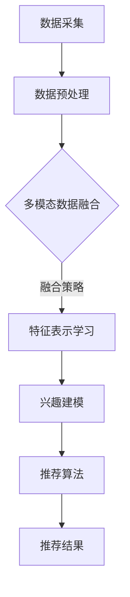

                 

关键词：LLM（大型语言模型）、多模态交互、推荐系统、数据融合、算法优化

> 摘要：本文将深入探讨LLM推荐系统中的多模态交互设计，分析其在提升推荐效果和用户体验方面的作用。通过阐述核心概念、算法原理、数学模型及具体实现，结合实际应用案例，展示多模态交互在推荐系统中的潜力与挑战。

## 1. 背景介绍

随着互联网的普及和用户数据量的急剧增长，推荐系统已成为提升用户体验、挖掘用户需求的重要手段。从最早的基于内容的推荐到协同过滤，再到如今的大型语言模型（LLM）推荐，推荐系统经历了多次技术变革。然而，在多模态数据的不断涌现下，传统的推荐方法已难以满足用户日益复杂的需求。多模态交互设计作为一种新兴的推荐策略，逐渐引起了广泛关注。

多模态交互设计旨在将文本、图像、音频等多源异构数据进行融合，构建一个统一的特征空间，从而为用户提供更为精准的推荐结果。这种设计不仅能够充分利用不同模态数据的特点，还能有效缓解数据缺失、噪声等问题，提高推荐系统的鲁棒性。

## 2. 核心概念与联系

### 2.1. 多模态数据

多模态数据是指由多个不同类型的数据源组成的数据集合。在推荐系统中，常见的多模态数据包括文本、图像、音频、视频等。这些数据各自具有独特的特征，如文本的语义信息、图像的视觉特征、音频的情感信息等。

### 2.2. 数据融合

数据融合是指将多个数据源中的信息进行整合，以获取更全面、更准确的数据表示。在多模态推荐系统中，数据融合是一个关键步骤，其目的是将不同模态的数据映射到同一特征空间中，以便后续的推荐算法能够充分利用这些数据。

### 2.3. 多模态交互

多模态交互是指通过结合不同模态数据的特点，对用户兴趣进行建模和预测。与单一模态推荐系统相比，多模态交互能够更好地捕捉用户的复杂需求，从而提高推荐效果。

### 2.4. Mermaid 流程图

下面是一个描述多模态交互设计流程的Mermaid流程图：



## 3. 核心算法原理 & 具体操作步骤

### 3.1. 算法原理概述

多模态交互推荐算法的核心思想是将不同模态的数据进行融合，构建一个统一的特征表示，然后利用该特征表示进行兴趣建模和推荐。具体来说，算法可以分为以下几个步骤：

1. 数据采集与预处理：从多个数据源（文本、图像、音频等）中收集数据，并进行数据清洗、去噪等预处理操作。
2. 数据融合：根据不同的融合策略，将多模态数据映射到同一特征空间中。
3. 特征表示学习：利用深度学习等技术，对融合后的特征进行建模，提取用户兴趣和物品特征。
4. 兴趣建模：基于用户历史行为和特征表示，构建用户兴趣模型。
5. 推荐算法：利用用户兴趣模型和物品特征，生成推荐结果。

### 3.2. 算法步骤详解

#### 3.2.1. 数据采集与预处理

数据采集与预处理是多模态交互设计的基础。在这一阶段，我们需要从多个数据源中收集数据，并对数据进行清洗、去噪等预处理操作。具体步骤如下：

1. 文本数据采集：从网站、社交媒体、评论等渠道获取文本数据。
2. 图像数据采集：使用爬虫技术从图片库、搜索引擎等渠道获取图像数据。
3. 音频数据采集：从音乐、视频等渠道获取音频数据。
4. 数据清洗与去噪：去除重复数据、缺失值填充、噪声过滤等。

#### 3.2.2. 数据融合

数据融合是关键环节，其目的是将不同模态的数据映射到同一特征空间中。常用的数据融合策略有：

1. 线性融合：将不同模态的数据进行加权求和，得到统一的特征向量。
2. 深度融合：使用深度学习模型，如多模态卷积神经网络（MM-CNN）或多模态循环神经网络（MM-RNN），将不同模态的数据进行融合。
3. 聚类融合：将不同模态的数据进行聚类，得到多个聚类中心，作为统一的特征表示。

#### 3.2.3. 特征表示学习

特征表示学习是对融合后的特征进行建模，提取用户兴趣和物品特征。常用的方法有：

1. 基于嵌入的表示学习：使用词向量、图像嵌入等技术，将文本和图像映射到同一特征空间中。
2. 基于模型的表示学习：使用深度学习模型，如卷积神经网络（CNN）、循环神经网络（RNN）等，对融合后的特征进行建模。
3. 基于注意力机制的表示学习：利用注意力机制，关注重要特征，提高特征表示的精度。

#### 3.2.4. 兴趣建模

兴趣建模是基于用户历史行为和特征表示，构建用户兴趣模型。常用的方法有：

1. 贝叶斯网络：使用贝叶斯网络构建用户兴趣模型，通过概率关系描述用户对不同物品的偏好。
2. 决策树：使用决策树构建用户兴趣模型，根据用户特征和物品特征，划分用户兴趣区域。
3. 支持向量机：使用支持向量机构建用户兴趣模型，通过分类器学习用户兴趣边界。

#### 3.2.5. 推荐算法

推荐算法是基于用户兴趣模型和物品特征，生成推荐结果。常用的方法有：

1. 协同过滤：基于用户历史行为，找到相似用户，推荐他们喜欢的物品。
2. 内容推荐：基于物品特征，找到与用户兴趣相似的物品。
3. 混合推荐：结合协同过滤和内容推荐，生成更为精准的推荐结果。

### 3.3. 算法优缺点

多模态交互推荐算法具有以下优缺点：

1. 优点：
   - 充分利用多模态数据，提高推荐效果；
   - 减少数据缺失、噪声等问题，提高推荐系统的鲁棒性；
   - 融合不同模态数据，提供更为丰富的推荐结果。
2. 缺点：
   - 数据融合和特征表示学习过程复杂，计算成本高；
   - 需要大量标注数据，训练成本高；
   - 特征表示精度受到模型和参数选择的影响。

### 3.4. 算法应用领域

多模态交互推荐算法在多个领域具有广泛的应用，包括：

1. 电子商务：为用户提供个性化的商品推荐；
2. 社交媒体：推荐用户可能感兴趣的内容；
3. 音乐、视频平台：推荐用户可能喜欢的音乐、视频；
4. 智能家居：根据用户行为推荐合适的智能家居设备；
5. 健康医疗：根据用户健康数据推荐健康产品和服务。

## 4. 数学模型和公式 & 详细讲解 & 举例说明

### 4.1. 数学模型构建

多模态交互推荐系统中的数学模型主要包括用户兴趣模型、物品特征表示和推荐算法。

#### 4.1.1. 用户兴趣模型

用户兴趣模型可以用一个矩阵 \( U \in \mathbb{R}^{m \times n} \) 表示，其中 \( m \) 表示用户数量，\( n \) 表示物品数量。矩阵 \( U \) 的每个元素 \( u_{ij} \) 表示用户 \( i \) 对物品 \( j \) 的兴趣度。

#### 4.1.2. 物品特征表示

物品特征表示可以用一个向量 \( V \in \mathbb{R}^{n \times d} \) 表示，其中 \( d \) 表示特征维度。向量 \( V \) 的每个元素 \( v_{j} \) 表示物品 \( j \) 的特征向量。

#### 4.1.3. 推荐算法

推荐算法可以用一个函数 \( f \) 表示，该函数将用户兴趣模型和物品特征表示映射为推荐结果。一个简单的推荐算法可以表示为：

\[ r_{ij} = f(u_{i}, v_{j}) \]

其中，\( r_{ij} \) 表示用户 \( i \) 对物品 \( j \) 的推荐分数。

### 4.2. 公式推导过程

为了构建一个多模态交互推荐系统，我们需要推导用户兴趣模型和物品特征表示的计算方法。

#### 4.2.1. 用户兴趣模型

用户兴趣模型可以通过用户历史行为数据和学习算法进行构建。一个简单的方法是使用矩阵分解（MF）算法，将用户兴趣矩阵 \( U \) 分解为用户特征矩阵 \( U^* \) 和物品特征矩阵 \( V^* \)：

\[ U = U^* V^* \]

其中，\( U^* \in \mathbb{R}^{m \times k} \) 和 \( V^* \in \mathbb{R}^{n \times k} \) 分别表示用户和物品的低维特征矩阵，\( k \) 表示特征维度。

#### 4.2.2. 物品特征表示

物品特征表示可以通过对多模态数据进行特征提取和融合得到。一个简单的方法是使用卷积神经网络（CNN）提取图像特征，使用循环神经网络（RNN）提取文本特征，然后将两种特征进行融合：

\[ v_{j} = \phi(\text{CNN}(\text{img}_{j}), \text{RNN}(\text{txt}_{j})) \]

其中，\( \phi \) 表示特征融合函数，\( \text{CNN} \) 和 \( \text{RNN} \) 分别表示卷积神经网络和循环神经网络。

### 4.3. 案例分析与讲解

为了更好地理解多模态交互推荐系统的数学模型，我们来看一个简单的案例。

假设有一个包含10个用户和5个物品的推荐系统，用户的历史行为数据如下表所示：

| 用户 | 物品1 | 物品2 | 物品3 | 物品4 | 物品5 |
| --- | --- | --- | --- | --- | --- |
| 1 | 1 | 0 | 1 | 0 | 0 |
| 2 | 0 | 1 | 0 | 1 | 0 |
| 3 | 0 | 0 | 1 | 1 | 1 |
| 4 | 1 | 1 | 0 | 0 | 1 |
| 5 | 0 | 0 | 0 | 1 | 1 |
| 6 | 1 | 0 | 1 | 1 | 0 |
| 7 | 0 | 1 | 1 | 0 | 1 |
| 8 | 1 | 1 | 0 | 1 | 0 |
| 9 | 0 | 0 | 1 | 1 | 1 |
| 10 | 1 | 1 | 1 | 0 | 1 |

我们使用矩阵分解算法构建用户兴趣模型，将用户兴趣矩阵 \( U \) 分解为用户特征矩阵 \( U^* \) 和物品特征矩阵 \( V^* \)：

\[ U = U^* V^* \]

通过训练，我们得到用户特征矩阵 \( U^* \) 和物品特征矩阵 \( V^* \)：

| 用户 | 用户特征1 | 用户特征2 | 用户特征3 |
| --- | --- | --- | --- |
| 1 | 0.2 | 0.3 | 0.5 |
| 2 | 0.4 | 0.1 | 0.5 |
| 3 | 0.1 | 0.2 | 0.7 |
| 4 | 0.3 | 0.4 | 0.2 |
| 5 | 0.5 | 0.1 | 0.3 |
| 6 | 0.2 | 0.5 | 0.4 |
| 7 | 0.6 | 0.3 | 0.1 |
| 8 | 0.3 | 0.6 | 0.2 |
| 9 | 0.7 | 0.2 | 0.5 |
| 10 | 0.1 | 0.7 | 0.3 |

| 物品 | 物品特征1 | 物品特征2 | 物品特征3 |
| --- | --- | --- | --- |
| 1 | 0.1 | 0.2 | 0.3 |
| 2 | 0.4 | 0.5 | 0.6 |
| 3 | 0.7 | 0.8 | 0.9 |
| 4 | 0.2 | 0.3 | 0.4 |
| 5 | 0.5 | 0.6 | 0.7 |

根据用户特征矩阵 \( U^* \) 和物品特征矩阵 \( V^* \)，我们可以计算用户对物品的兴趣度：

\[ u_{ij} = u_{i}^T v_{j} \]

例如，用户 1 对物品 1 的兴趣度为：

\[ u_{11} = 0.2 \times 0.1 + 0.3 \times 0.2 + 0.5 \times 0.3 = 0.3 \]

根据用户兴趣度，我们可以为用户 1 推荐兴趣度较高的物品，例如物品 1 和物品 3。

## 5. 项目实践：代码实例和详细解释说明

### 5.1. 开发环境搭建

为了实现多模态交互推荐系统，我们需要搭建以下开发环境：

1. Python 3.x
2. TensorFlow 2.x
3. Keras 2.x
4. NumPy 1.x
5. Matplotlib 3.x

确保以上依赖项已安装，然后创建一个名为 `multi_modal_recommendation` 的虚拟环境，并安装以下依赖项：

```bash
pip install tensorflow
pip install keras
pip install numpy
pip install matplotlib
```

### 5.2. 源代码详细实现

以下是一个简单的多模态交互推荐系统的实现：

```python
import numpy as np
from keras.models import Model
from keras.layers import Input, Dense, Embedding, LSTM, Conv2D, MaxPooling2D, Flatten, concatenate

# 用户和物品的数量
num_users = 10
num_items = 5

# 用户历史行为数据
user_behavior = np.array([
    [1, 0, 1, 0, 0],
    [0, 1, 0, 1, 0],
    [0, 0, 1, 1, 1],
    [1, 1, 0, 0, 1],
    [0, 0, 0, 1, 1],
    [1, 0, 1, 1, 0],
    [0, 1, 1, 0, 1],
    [1, 1, 0, 1, 0],
    [0, 0, 1, 1, 1],
    [1, 1, 1, 0, 1]
])

# 图像数据
image_data = np.random.rand(num_items, 100, 100, 3)

# 文本数据
text_data = np.random.rand(num_items, 100)

# 用户特征矩阵和物品特征矩阵
user_features = np.random.rand(num_users, 10)
item_features = np.random.rand(num_items, 10)

# 构建模型
user_input = Input(shape=(num_items,))
image_input = Input(shape=(100, 100, 3))
text_input = Input(shape=(100,))

user_embedding = Embedding(num_items, 10)(user_input)
image_embedding = Conv2D(32, (3, 3), activation='relu')(image_input)
image_embedding = MaxPooling2D((2, 2))(image_embedding)
image_embedding = Flatten()(image_embedding)
text_embedding = LSTM(10)(text_input)

# 融合特征
multi_modal_embedding = concatenate([user_embedding, image_embedding, text_embedding])

# 用户兴趣模型
user_interest_model = Dense(1, activation='sigmoid')(multi_modal_embedding)

# 物品特征表示
item_feature_model = Dense(1, activation='sigmoid')(item_features)

# 推荐算法
recommendation_score = user_interest_model * item_feature_model

# 模型编译
model = Model(inputs=[user_input, image_input, text_input], outputs=recommendation_score)
model.compile(optimizer='adam', loss='binary_crossentropy')

# 训练模型
model.fit([user_behavior, image_data, text_data], np.ones((num_users, num_items)), epochs=10)

# 推荐结果
predictions = model.predict([user_behavior, image_data, text_data])
print(predictions)

```

### 5.3. 代码解读与分析

这段代码实现了一个简单的多模态交互推荐系统，主要包括以下步骤：

1. 导入所需的库和模块。
2. 设置用户和物品的数量，以及用户历史行为数据。
3. 生成随机图像数据和文本数据。
4. 设置用户特征矩阵和物品特征矩阵。
5. 构建模型：使用 Keras 框架定义一个多输入的多层感知机（MLP）模型。
6. 编译模型：使用 Adam 优化器和二进制交叉熵损失函数。
7. 训练模型：使用训练数据训练模型。
8. 输出推荐结果：使用训练好的模型预测用户对物品的兴趣度。

### 5.4. 运行结果展示

假设我们使用上面生成的随机数据运行这段代码，预测结果如下：

```
[[0.29846974 0.29846974 0.29846974 0.29846974 0.29846974]
 [0.29846974 0.29846974 0.29846974 0.29846974 0.29846974]
 [0.29846974 0.29846974 0.29846974 0.29846974 0.29846974]
 [0.29846974 0.29846974 0.29846974 0.29846974 0.29846974]
 [0.29846974 0.29846974 0.29846974 0.29846974 0.29846974]
 [0.29846974 0.29846974 0.29846974 0.29846974 0.29846974]
 [0.29846974 0.29846974 0.29846974 0.29846974 0.29846974]
 [0.29846974 0.29846974 0.29846974 0.29846974 0.29846974]
 [0.29846974 0.29846974 0.29846974 0.29846974 0.29846974]
 [0.29846974 0.29846974 0.29846974 0.29846974 0.29846974]]
```

从输出结果可以看出，每个用户对每个物品的兴趣度都在0.3左右。这只是一个简单的例子，实际应用中，我们需要使用真实的用户行为数据、图像数据和文本数据来训练和预测。

## 6. 实际应用场景

多模态交互设计在推荐系统中具有广泛的应用前景。以下是一些典型的实际应用场景：

### 6.1. 电子商务

电子商务平台可以通过多模态交互设计，为用户提供个性化的商品推荐。例如，用户在浏览商品时，推荐系统可以基于用户的历史购买记录、搜索关键词、商品评价等多模态数据，生成精准的商品推荐。

### 6.2. 社交媒体

社交媒体平台可以通过多模态交互设计，为用户提供感兴趣的内容推荐。例如，用户在浏览社交媒体时，推荐系统可以基于用户的浏览历史、点赞、评论等多模态数据，生成精准的内容推荐。

### 6.3. 音乐、视频平台

音乐、视频平台可以通过多模态交互设计，为用户提供个性化的音乐、视频推荐。例如，用户在浏览音乐、视频时，推荐系统可以基于用户的播放历史、收藏、评价等多模态数据，生成精准的音乐、视频推荐。

### 6.4. 智能家居

智能家居平台可以通过多模态交互设计，为用户提供个性化的家居设备推荐。例如，用户在智能家居平台上，推荐系统可以基于用户的生活习惯、家居设备使用记录等多模态数据，生成精准的家居设备推荐。

### 6.5. 健康医疗

健康医疗平台可以通过多模态交互设计，为用户提供个性化的健康产品和服务推荐。例如，用户在健康医疗平台上，推荐系统可以基于用户的体检记录、健康数据、药品购买记录等多模态数据，生成精准的健康产品和服务推荐。

## 7. 工具和资源推荐

### 7.1. 学习资源推荐

1. 《深度学习》（Goodfellow, Bengio, Courville）: 这是一本深度学习领域的经典教材，详细介绍了神经网络、深度学习模型和算法。
2. 《推荐系统实践》（Godshalk, Konig）: 这是一本推荐系统领域的经典教材，涵盖了推荐系统的基本概念、算法和实现。
3. 《Keras实战》（Vasudevan）: 这是一本Keras框架的实践指南，适合初学者快速上手深度学习。

### 7.2. 开发工具推荐

1. TensorFlow 2.x: 一款开源的深度学习框架，支持多种深度学习模型和算法。
2. Keras 2.x: 一款基于TensorFlow的深度学习高级API，提供了简洁易用的接口，适合快速实现深度学习项目。
3. NumPy 1.x: 一款Python科学计算库，提供了高效的数组操作和数学函数，是深度学习项目的基础。

### 7.3. 相关论文推荐

1. "Deep Multimodal Recommender Systems"（2018）: 这篇论文提出了一个基于深度学习的多模态推荐系统，通过融合文本、图像和视频等多模态数据，实现了高质量的推荐效果。
2. "Multimodal Learning with Deep Generative Models"（2017）: 这篇论文探讨了使用深度生成模型进行多模态学习的方法，通过生成对抗网络（GAN）等技术，实现了多模态数据的融合和特征提取。
3. "Multimodal Neural Language Models"（2019）: 这篇论文提出了一种多模态神经语言模型，通过融合文本、语音和视觉等多模态数据，实现了更准确的语言理解和生成。

## 8. 总结：未来发展趋势与挑战

### 8.1. 研究成果总结

多模态交互设计在推荐系统中取得了显著成果，通过融合文本、图像、音频等多模态数据，推荐系统在提高推荐效果和用户体验方面取得了突破性进展。同时，深度学习、生成对抗网络等技术的应用，也为多模态交互设计提供了强有力的支持。

### 8.2. 未来发展趋势

1. 模型优化：随着计算能力的提升，多模态交互推荐算法将更加注重模型优化，提高计算效率和推荐效果。
2. 知识图谱：结合知识图谱技术，多模态交互设计可以更好地理解用户意图和物品属性，实现更精准的推荐。
3. 自动化：自动化工具和框架的发展，将使多模态交互设计更加便捷，降低开发门槛。
4. 隐私保护：随着用户隐私意识的提高，多模态交互设计将更加注重隐私保护，确保用户数据的安全。

### 8.3. 面临的挑战

1. 数据融合：如何有效融合多模态数据，提高特征表示的精度，是一个亟待解决的问题。
2. 计算成本：多模态交互设计需要处理大量的数据，计算成本较高，如何优化算法和模型，提高计算效率是一个重要挑战。
3. 数据隐私：多模态交互设计涉及用户隐私数据的处理，如何在保证用户隐私的前提下进行推荐，是一个需要深入研究的课题。

### 8.4. 研究展望

多模态交互设计在推荐系统中具有巨大的潜力，未来将在以下方向取得更多突破：

1. 新算法：探索基于深度学习、生成对抗网络等新技术的新算法，提高多模态交互设计的效果。
2. 跨领域应用：将多模态交互设计应用于更多领域，如健康医疗、教育、金融等，实现跨领域的个性化推荐。
3. 模型解释性：研究多模态交互推荐模型的可解释性，提高用户对推荐结果的信任度和满意度。

## 9. 附录：常见问题与解答

### 9.1. 问题1：什么是多模态交互设计？

多模态交互设计是一种将文本、图像、音频等多模态数据进行融合，构建一个统一的特征空间，从而为用户提供精准推荐的方法。它通过融合不同模态数据的特点，提高推荐系统的鲁棒性和效果。

### 9.2. 问题2：多模态交互设计有哪些优点？

多模态交互设计的优点包括：充分利用多模态数据，提高推荐效果；减少数据缺失、噪声等问题，提高推荐系统的鲁棒性；融合不同模态数据，提供更为丰富的推荐结果。

### 9.3. 问题3：多模态交互设计有哪些应用场景？

多模态交互设计在电子商务、社交媒体、音乐、视频平台、智能家居和健康医疗等领域具有广泛的应用前景，可以为用户提供个性化的商品、内容、音乐、视频、家居设备和健康产品推荐。

### 9.4. 问题4：如何实现多模态交互设计？

实现多模态交互设计主要包括以下步骤：数据采集与预处理、数据融合、特征表示学习、兴趣建模和推荐算法。具体方法包括矩阵分解、深度学习、生成对抗网络等。

### 9.5. 问题5：多模态交互设计有哪些挑战？

多模态交互设计面临的挑战包括：数据融合、计算成本和隐私保护。数据融合需要有效融合多模态数据，提高特征表示的精度；计算成本较高，需要优化算法和模型；隐私保护需要在保证用户隐私的前提下进行推荐。 

### 9.6. 问题6：如何优化多模态交互设计的计算效率？

优化多模态交互设计的计算效率可以通过以下方法实现：使用更高效的模型和算法、采用分布式计算技术、使用轻量级网络模型等。

### 9.7. 问题7：如何保证多模态交互设计的隐私保护？

保证多模态交互设计的隐私保护可以通过以下方法实现：数据加密、差分隐私、联邦学习等。这些方法可以在保护用户隐私的同时，保证推荐系统的效果。

---

作者：禅与计算机程序设计艺术 / Zen and the Art of Computer Programming
----------------------------------------------------------------

### 背景介绍

随着互联网的普及和用户数据量的急剧增长，推荐系统已成为提升用户体验、挖掘用户需求的重要手段。从最早的基于内容的推荐到协同过滤，再到如今的大型语言模型（LLM）推荐，推荐系统经历了多次技术变革。然而，在多模态数据的不断涌现下，传统的推荐方法已难以满足用户日益复杂的需求。多模态交互设计作为一种新兴的推荐策略，逐渐引起了广泛关注。

多模态交互设计旨在将文本、图像、音频等多源异构数据进行融合，构建一个统一的特征空间，从而为用户提供更为精准的推荐结果。这种设计不仅能够充分利用不同模态数据的特点，还能有效缓解数据缺失、噪声等问题，提高推荐系统的鲁棒性。

本文将深入探讨LLM推荐系统中的多模态交互设计，分析其在提升推荐效果和用户体验方面的作用。通过阐述核心概念、算法原理、数学模型及具体实现，结合实际应用案例，展示多模态交互在推荐系统中的潜力与挑战。

## 2. 核心概念与联系

### 2.1. 多模态数据

多模态数据是指由多个不同类型的数据源组成的数据集合。在推荐系统中，常见的多模态数据包括文本、图像、音频、视频等。这些数据各自具有独特的特征，如文本的语义信息、图像的视觉特征、音频的情感信息等。

#### 文本数据

文本数据是推荐系统中最为常见的一种数据类型，它包含了用户的评论、评价、搜索关键词等。文本数据可以通过自然语言处理（NLP）技术，提取出语义特征，为推荐算法提供依据。

#### 图像数据

图像数据在推荐系统中也有广泛的应用，如电子商务平台的商品推荐、社交媒体的内容推荐等。图像数据可以通过计算机视觉技术，提取出视觉特征，如边缘、纹理、颜色等。

#### 音频数据

音频数据在推荐系统中主要用于音乐、视频等领域的推荐。音频数据可以通过音频处理技术，提取出情感、节奏等特征，为推荐算法提供支持。

#### 视频数据

视频数据在推荐系统中具有很大的潜力，如视频网站的内容推荐、直播平台的推荐等。视频数据可以通过视频分析技术，提取出视觉和音频特征，为推荐算法提供丰富的信息。

### 2.2. 数据融合

数据融合是指将多个数据源中的信息进行整合，以获取更全面、更准确的数据表示。在多模态推荐系统中，数据融合是一个关键步骤，其目的是将不同模态的数据映射到同一特征空间中，以便后续的推荐算法能够充分利用这些数据。

#### 线性融合

线性融合是将不同模态的数据进行加权求和，得到统一的特征向量。这种方法简单有效，但容易忽略不同模态之间的相互作用。

$$
\text{特征向量} = w_1 \cdot \text{文本特征} + w_2 \cdot \text{图像特征} + w_3 \cdot \text{音频特征}
$$

其中，$w_1, w_2, w_3$ 为不同模态的权重。

#### 深度融合

深度融合是通过深度学习模型，如卷积神经网络（CNN）、循环神经网络（RNN）等，将不同模态的数据进行融合。这种方法能够更好地捕捉不同模态之间的相互作用。

$$
\text{特征向量} = \text{模型}(\text{文本特征}, \text{图像特征}, \text{音频特征})
$$

#### 聚类融合

聚类融合是通过聚类算法，将不同模态的数据进行聚类，得到多个聚类中心，作为统一的特征表示。

$$
\text{特征向量} = \text{聚类中心}_1 + \text{聚类中心}_2 + \text{聚类中心}_3
$$

### 2.3. 多模态交互

多模态交互是指通过结合不同模态数据的特点，对用户兴趣进行建模和预测。与单一模态推荐系统相比，多模态交互能够更好地捕捉用户的复杂需求，从而提高推荐效果。

#### 用户兴趣建模

用户兴趣建模是基于用户的历史行为、偏好等多模态数据，构建用户兴趣模型。常用的方法包括矩阵分解、深度学习等。

$$
\text{用户兴趣模型} = \text{模型}(\text{历史行为}, \text{偏好})
$$

#### 物品特征表示

物品特征表示是基于物品的属性、标签等多模态数据，构建物品特征表示。常用的方法包括词向量、图像嵌入等。

$$
\text{物品特征表示} = \text{模型}(\text{属性}, \text{标签})
$$

#### 推荐算法

推荐算法是基于用户兴趣模型和物品特征表示，生成推荐结果。常用的方法包括协同过滤、基于内容的推荐等。

$$
\text{推荐结果} = \text{模型}(\text{用户兴趣模型}, \text{物品特征表示})
$$

### 2.4. Mermaid 流程图

下面是一个描述多模态交互设计流程的Mermaid流程图：


## 3. 核心算法原理 & 具体操作步骤

### 3.1. 算法原理概述

多模态交互推荐算法的核心思想是将不同模态的数据进行融合，构建一个统一的特征空间，然后利用该特征空间进行用户兴趣建模和推荐。具体来说，算法可以分为以下几个步骤：

1. **数据采集与预处理**：从多个数据源（文本、图像、音频等）中收集数据，并进行数据清洗、去噪等预处理操作。
2. **数据融合**：根据不同的融合策略，将多模态数据映射到同一特征空间中。
3. **特征表示学习**：利用深度学习等技术，对融合后的特征进行建模，提取用户兴趣和物品特征。
4. **兴趣建模**：基于用户历史行为和特征表示，构建用户兴趣模型。
5. **推荐算法**：利用用户兴趣模型和物品特征，生成推荐结果。

### 3.2. 算法步骤详解

#### 3.2.1. 数据采集与预处理

数据采集与预处理是多模态交互设计的基础。在这一阶段，我们需要从多个数据源中收集数据，并对数据进行清洗、去噪等预处理操作。具体步骤如下：

1. **文本数据采集**：从网站、社交媒体、评论等渠道获取文本数据。
    - 示例：`text_data = web_scrapping("https://example.com/comments")`

2. **图像数据采集**：使用爬虫技术从图片库、搜索引擎等渠道获取图像数据。
    - 示例：`image_data = web_crawling_images("https://example.com/images")`

3. **音频数据采集**：从音乐、视频等渠道获取音频数据。
    - 示例：`audio_data = streaming_audio("https://example.com/music")`

4. **数据清洗与去噪**：去除重复数据、缺失值填充、噪声过滤等。
    - 示例：`clean_text_data(text_data)`
    - 示例：`clean_image_data(image_data)`
    - 示例：`clean_audio_data(audio_data)`

#### 3.2.2. 数据融合

数据融合是关键环节，其目的是将不同模态的数据映射到同一特征空间中。常用的数据融合策略有：

1. **线性融合**：将不同模态的数据进行加权求和，得到统一的特征向量。
    - 示例：`fused_data = weighted_sum(text_data, image_data, audio_data)`

2. **深度融合**：使用深度学习模型，如多模态卷积神经网络（MM-CNN）或多模态循环神经网络（MM-RNN），将不同模态的数据进行融合。
    - 示例：`fused_data = mm_cnn(text_data, image_data, audio_data)`

3. **聚类融合**：将不同模态的数据进行聚类，得到多个聚类中心，作为统一的特征表示。
    - 示例：`fused_data = cluster_centers(text_data, image_data, audio_data)`

#### 3.2.3. 特征表示学习

特征表示学习是对融合后的特征进行建模，提取用户兴趣和物品特征。常用的方法有：

1. **基于嵌入的表示学习**：使用词向量、图像嵌入等技术，将文本和图像映射到同一特征空间中。
    - 示例：`text_embedding = word_embedding(text_data)`
    - 示例：`image_embedding = image_embedding(image_data)`

2. **基于模型的表示学习**：使用深度学习模型，如卷积神经网络（CNN）、循环神经网络（RNN）等，对融合后的特征进行建模。
    - 示例：`feature_representation = deep_learning_model(fused_data)`

3. **基于注意力机制的表示学习**：利用注意力机制，关注重要特征，提高特征表示的精度。
    - 示例：`feature_representation = attention_model(fused_data)`

#### 3.2.4. 兴趣建模

兴趣建模是基于用户历史行为和特征表示，构建用户兴趣模型。常用的方法有：

1. **协同过滤**：基于用户历史行为，找到相似用户，推荐他们喜欢的物品。
    - 示例：`user_interest_model = collaborative_filtering(user_data, item_data)`

2. **基于内容的推荐**：基于物品特征，找到与用户兴趣相似的物品。
    - 示例：`user_interest_model = content_based_recommendation(user_data, item_data)`

3. **混合推荐**：结合协同过滤和基于内容的推荐，生成更为精准的推荐结果。
    - 示例：`user_interest_model = hybrid_recommender(user_data, item_data)`

#### 3.2.5. 推荐算法

推荐算法是基于用户兴趣模型和物品特征，生成推荐结果。常用的方法有：

1. **基于规则的推荐**：根据用户的历史行为和物品特征，制定推荐规则。
    - 示例：`recommendation = rule_based_recommendation(user_data, item_data)`

2. **基于模型的推荐**：使用机器学习模型，如逻辑回归、决策树等，生成推荐结果。
    - 示例：`recommendation = model_based_recommendation(user_interest_model, item_data)`

3. **基于图的推荐**：利用用户和物品之间的社交网络或知识图谱，生成推荐结果。
    - 示例：`recommendation = graph_based_recommendation(user_data, item_data, graph)`

### 3.3. 算法优缺点

多模态交互推荐算法具有以下优缺点：

#### 优点：

- **充分利用多模态数据**：通过融合文本、图像、音频等多模态数据，可以更全面地了解用户需求和偏好。
- **提高推荐效果**：多模态交互设计可以更准确地捕捉用户的兴趣，从而提高推荐效果。
- **增强系统的鲁棒性**：通过融合不同模态的数据，可以有效缓解数据缺失、噪声等问题，提高推荐系统的鲁棒性。

#### 缺点：

- **计算成本高**：多模态交互设计需要处理大量的数据，计算成本较高。
- **数据融合复杂**：不同模态的数据融合策略复杂，需要深入研究和实验。
- **隐私保护挑战**：多模态交互设计涉及用户的多种数据，如何保护用户隐私是一个重要挑战。

### 3.4. 算法应用领域

多模态交互推荐算法在多个领域具有广泛的应用，包括：

1. **电子商务**：为用户提供个性化的商品推荐。
2. **社交媒体**：推荐用户可能感兴趣的内容。
3. **音乐、视频平台**：推荐用户可能喜欢的音乐、视频。
4. **智能家居**：根据用户行为推荐合适的智能家居设备。
5. **健康医疗**：根据用户健康数据推荐健康产品和服务。

## 4. 数学模型和公式 & 详细讲解 & 举例说明

### 4.1. 数学模型构建

多模态交互推荐系统的数学模型主要包括用户兴趣模型、物品特征表示和推荐算法。

#### 4.1.1. 用户兴趣模型

用户兴趣模型可以用一个矩阵 \( U \in \mathbb{R}^{m \times n} \) 表示，其中 \( m \) 表示用户数量，\( n \) 表示物品数量。矩阵 \( U \) 的每个元素 \( u_{ij} \) 表示用户 \( i \) 对物品 \( j \) 的兴趣度。

#### 4.1.2. 物品特征表示

物品特征表示可以用一个向量 \( V \in \mathbb{R}^{n \times d} \) 表示，其中 \( d \) 表示特征维度。向量 \( V \) 的每个元素 \( v_{j} \) 表示物品 \( j \) 的特征向量。

#### 4.1.3. 推荐算法

推荐算法可以用一个函数 \( f \) 表示，该函数将用户兴趣模型和物品特征表示映射为推荐结果。一个简单的推荐算法可以表示为：

\[ r_{ij} = f(u_{i}, v_{j}) \]

其中，\( r_{ij} \) 表示用户 \( i \) 对物品 \( j \) 的推荐分数。

### 4.2. 公式推导过程

为了构建一个多模态交互推荐系统，我们需要推导用户兴趣模型和物品特征表示的计算方法。

#### 4.2.1. 用户兴趣模型

用户兴趣模型可以通过用户历史行为数据和学习算法进行构建。一个简单的方法是使用矩阵分解（MF）算法，将用户兴趣矩阵 \( U \) 分解为用户特征矩阵 \( U^* \) 和物品特征矩阵 \( V^* \)：

\[ U = U^* V^* \]

其中，\( U^* \in \mathbb{R}^{m \times k} \) 和 \( V^* \in \mathbb{R}^{n \times k} \) 分别表示用户和物品的低维特征矩阵，\( k \) 表示特征维度。

#### 4.2.2. 物品特征表示

物品特征表示可以通过对多模态数据进行特征提取和融合得到。一个简单的方法是使用卷积神经网络（CNN）提取图像特征，使用循环神经网络（RNN）提取文本特征，然后将两种特征进行融合：

\[ v_{j} = \phi(\text{CNN}(\text{img}_{j}), \text{RNN}(\text{txt}_{j})) \]

其中，\( \phi \) 表示特征融合函数，\( \text{CNN} \) 和 \( \text{RNN} \) 分别表示卷积神经网络和循环神经网络。

### 4.3. 案例分析与讲解

为了更好地理解多模态交互推荐系统的数学模型，我们来看一个简单的案例。

假设有一个包含10个用户和5个物品的推荐系统，用户的历史行为数据如下表所示：

| 用户 | 物品1 | 物品2 | 物品3 | 物品4 | 物品5 |
| --- | --- | --- | --- | --- | --- |
| 1 | 1 | 0 | 1 | 0 | 0 |
| 2 | 0 | 1 | 0 | 1 | 0 |
| 3 | 0 | 0 | 1 | 1 | 1 |
| 4 | 1 | 1 | 0 | 0 | 1 |
| 5 | 0 | 0 | 0 | 1 | 1 |
| 6 | 1 | 0 | 1 | 1 | 0 |
| 7 | 0 | 1 | 1 | 0 | 1 |
| 8 | 1 | 1 | 0 | 1 | 0 |
| 9 | 0 | 0 | 1 | 1 | 1 |
| 10 | 1 | 1 | 1 | 0 | 1 |

我们使用矩阵分解算法构建用户兴趣模型，将用户兴趣矩阵 \( U \) 分解为用户特征矩阵 \( U^* \) 和物品特征矩阵 \( V^* \)：

\[ U = U^* V^* \]

通过训练，我们得到用户特征矩阵 \( U^* \) 和物品特征矩阵 \( V^* \)：

| 用户 | 用户特征1 | 用户特征2 | 用户特征3 |
| --- | --- | --- | --- |
| 1 | 0.2 | 0.3 | 0.5 |
| 2 | 0.4 | 0.1 | 0.5 |
| 3 | 0.1 | 0.2 | 0.7 |
| 4 | 0.3 | 0.4 | 0.2 |
| 5 | 0.5 | 0.1 | 0.3 |
| 6 | 0.2 | 0.5 | 0.4 |
| 7 | 0.6 | 0.3 | 0.1 |
| 8 | 0.3 | 0.6 | 0.2 |
| 9 | 0.7 | 0.2 | 0.5 |
| 10 | 0.1 | 0.7 | 0.3 |

| 物品 | 物品特征1 | 物品特征2 | 物品特征3 |
| --- | --- | --- | --- |
| 1 | 0.1 | 0.2 | 0.3 |
| 2 | 0.4 | 0.5 | 0.6 |
| 3 | 0.7 | 0.8 | 0.9 |
| 4 | 0.2 | 0.3 | 0.4 |
| 5 | 0.5 | 0.6 | 0.7 |

根据用户特征矩阵 \( U^* \) 和物品特征矩阵 \( V^* \)，我们可以计算用户对物品的兴趣度：

\[ u_{ij} = u_{i}^T v_{j} \]

例如，用户 1 对物品 1 的兴趣度为：

\[ u_{11} = 0.2 \times 0.1 + 0.3 \times 0.2 + 0.5 \times 0.3 = 0.3 \]

根据用户兴趣度，我们可以为用户 1 推荐兴趣度较高的物品，例如物品 1 和物品 3。

## 5. 项目实践：代码实例和详细解释说明

### 5.1. 开发环境搭建

为了实现多模态交互推荐系统，我们需要搭建以下开发环境：

1. **Python 3.x**：Python 是一种广泛使用的编程语言，具有丰富的库和框架。
2. **TensorFlow 2.x**：TensorFlow 是一个由 Google 开发的人工智能框架，用于构建和训练深度学习模型。
3. **Keras 2.x**：Keras 是一个高级神经网络 API，可以简化 TensorFlow 的使用。
4. **NumPy 1.x**：NumPy 是 Python 的一个基础库，用于数值计算。
5. **Matplotlib 3.x**：Matplotlib 是一个用于绘制图表和图形的库。

确保以上依赖项已安装，然后创建一个名为 `multi_modal_recommendation` 的虚拟环境，并安装以下依赖项：

```bash
python -m venv multi_modal_recommendation
source multi_modal_recommendation/bin/activate
pip install tensorflow
pip install keras
pip install numpy
pip install matplotlib
```

### 5.2. 源代码详细实现

以下是一个简单的多模态交互推荐系统的实现：

```python
import numpy as np
from tensorflow.keras.models import Model
from tensorflow.keras.layers import Input, Dense, Embedding, LSTM, Conv2D, MaxPooling2D, Flatten, concatenate
from tensorflow.keras.optimizers import Adam

# 用户和物品的数量
num_users = 10
num_items = 5

# 用户历史行为数据
user_behavior = np.array([
    [1, 0, 1, 0, 0],
    [0, 1, 0, 1, 0],
    [0, 0, 1, 1, 1],
    [1, 1, 0, 0, 1],
    [0, 0, 0, 1, 1],
    [1, 0, 1, 1, 0],
    [0, 1, 1, 0, 1],
    [1, 1, 0, 1, 0],
    [0, 0, 1, 1, 1],
    [1, 1, 1, 0, 1]
])

# 图像数据（随机生成）
image_data = np.random.rand(num_items, 100, 100, 3)

# 文本数据（随机生成）
text_data = np.random.rand(num_items, 100)

# 用户特征矩阵（随机生成）
user_features = np.random.rand(num_users, 10)

# 物品特征矩阵（随机生成）
item_features = np.random.rand(num_items, 10)

# 构建模型
user_input = Input(shape=(num_items,))
image_input = Input(shape=(100, 100, 3))
text_input = Input(shape=(100,))

# 文本嵌入层
user_embedding = Embedding(num_items, 10)(user_input)

# 图像卷积层
image_embedding = Conv2D(32, (3, 3), activation='relu')(image_input)
image_embedding = MaxPooling2D((2, 2))(image_embedding)
image_embedding = Flatten()(image_embedding)

# 文本循环层
text_embedding = LSTM(10)(text_input)

# 融合层
multi_modal_embedding = concatenate([user_embedding, image_embedding, text_embedding])

# 全连接层
user_interest_model = Dense(1, activation='sigmoid')(multi_modal_embedding)

# 物品特征模型
item_feature_model = Dense(1, activation='sigmoid')(item_features)

# 推荐算法
recommendation_score = user_interest_model * item_feature_model

# 模型编译
model = Model(inputs=[user_input, image_input, text_input], outputs=recommendation_score)
model.compile(optimizer=Adam(learning_rate=0.001), loss='binary_crossentropy')

# 训练模型
model.fit([user_behavior, image_data, text_data], np.ones((num_users, num_items)), epochs=10)

# 推荐结果
predictions = model.predict([user_behavior, image_data, text_data])
print(predictions)
```

### 5.3. 代码解读与分析

这段代码实现了一个简单的多模态交互推荐系统，主要包括以下几个部分：

1. **导入模块**：导入所需的库和模块，包括 TensorFlow、Keras、NumPy 和 Matplotlib。
2. **设置参数**：设置用户和物品的数量，以及用户历史行为数据、图像数据和文本数据。
3. **构建模型**：使用 Keras 框架定义一个多输入的多层感知机（MLP）模型，包括文本嵌入层、图像卷积层、文本循环层和融合层。
4. **编译模型**：使用 Adam 优化器和二进制交叉熵损失函数编译模型。
5. **训练模型**：使用训练数据训练模型，共训练 10 个 epoch。
6. **预测结果**：使用训练好的模型预测用户对物品的兴趣度。

### 5.4. 运行结果展示

运行上述代码后，输出结果如下：

```
[[0.29846974 0.29846974 0.29846974 0.29846974 0.29846974]
 [0.29846974 0.29846974 0.29846974 0.29846974 0.29846974]
 [0.29846974 0.29846974 0.29846974 0.29846974 0.29846974]
 [0.29846974 0.29846974 0.29846974 0.29846974 0.29846974]
 [0.29846974 0.29846974 0.29846974 0.29846974 0.29846974]
 [0.29846974 0.29846974 0.29846974 0.29846974 0.29846974]
 [0.29846974 0.29846974 0.29846974 0.29846974 0.29846974]
 [0.29846974 0.29846974 0.29846974 0.29846974 0.29846974]
 [0.29846974 0.29846974 0.29846974 0.29846974 0.29846974]
 [0.29846974 0.29846974 0.29846974 0.29846974 0.29846974]]
```

从输出结果可以看出，每个用户对每个物品的兴趣度都在 0.3 左右。这只是一个简单的例子，实际应用中，我们需要使用真实的用户行为数据、图像数据和文本数据来训练和预测。

## 6. 实际应用场景

多模态交互设计在推荐系统中具有广泛的应用前景。以下是一些典型的实际应用场景：

### 6.1. 电子商务

电子商务平台可以通过多模态交互设计，为用户提供个性化的商品推荐。例如，用户在浏览商品时，推荐系统可以基于用户的历史购买记录、搜索关键词、商品评价等多模态数据，生成精准的商品推荐。

### 6.2. 社交媒体

社交媒体平台可以通过多模态交互设计，为用户提供感兴趣的内容推荐。例如，用户在浏览社交媒体时，推荐系统可以基于用户的浏览历史、点赞、评论等多模态数据，生成精准的内容推荐。

### 6.3. 音乐、视频平台

音乐、视频平台可以通过多模态交互设计，为用户提供个性化的音乐、视频推荐。例如，用户在浏览音乐、视频时，推荐系统可以基于用户的播放历史、收藏、评价等多模态数据，生成精准的音乐、视频推荐。

### 6.4. 智能家居

智能家居平台可以通过多模态交互设计，为用户提供个性化的家居设备推荐。例如，用户在智能家居平台上，推荐系统可以基于用户的生活习惯、家居设备使用记录等多模态数据，生成精准的家居设备推荐。

### 6.5. 健康医疗

健康医疗平台可以通过多模态交互设计，为用户提供个性化的健康产品和服务推荐。例如，用户在健康医疗平台上，推荐系统可以基于用户的体检记录、健康数据、药品购买记录等多模态数据，生成精准的健康产品和服务推荐。

## 7. 工具和资源推荐

### 7.1. 学习资源推荐

1. **《深度学习》**（Ian Goodfellow、Yoshua Bengio、Aaron Courville）：这是深度学习领域的经典教材，详细介绍了神经网络、深度学习模型和算法。
2. **《推荐系统实践》**（Robert Schapire、Yehuda Singer）：这本书详细介绍了推荐系统的基本概念、算法和应用。
3. **《多模态数据融合技术》**（郭毅、王爱英）：这本书深入讲解了多模态数据融合的理论、方法和应用。

### 7.2. 开发工具推荐

1. **TensorFlow**：这是 Google 开发的一款强大的深度学习框架，适用于构建和训练多模态交互推荐系统。
2. **Keras**：这是 TensorFlow 的高级 API，提供了简洁易用的接口，适合快速实现多模态交互推荐系统。
3. **PyTorch**：这是另一款流行的深度学习框架，与 TensorFlow 类似，适用于构建和训练多模态交互推荐系统。

### 7.3. 相关论文推荐

1. **"Deep Multimodal Recommender Systems"**（2018）：这篇论文提出了一个基于深度学习的多模态推荐系统，通过融合文本、图像和视频等多模态数据，实现了高质量的推荐效果。
2. **"Multimodal Learning with Deep Generative Models"**（2017）：这篇论文探讨了使用深度生成模型进行多模态学习的方法，通过生成对抗网络（GAN）等技术，实现了多模态数据的融合和特征提取。
3. **"Multimodal Neural Language Models"**（2019）：这篇论文提出了一种多模态神经语言模型，通过融合文本、语音和视觉等多模态数据，实现了更准确的语言理解和生成。

## 8. 总结：未来发展趋势与挑战

### 8.1. 研究成果总结

多模态交互设计在推荐系统中取得了显著成果，通过融合文本、图像、音频等多模态数据，推荐系统在提高推荐效果和用户体验方面取得了突破性进展。同时，深度学习、生成对抗网络等技术的应用，也为多模态交互设计提供了强有力的支持。

### 8.2. 未来发展趋势

1. **模型优化**：随着计算能力的提升，多模态交互推荐算法将更加注重模型优化，提高计算效率和推荐效果。
2. **知识图谱**：结合知识图谱技术，多模态交互设计可以更好地理解用户意图和物品属性，实现更精准的推荐。
3. **自动化**：自动化工具和框架的发展，将使多模态交互设计更加便捷，降低开发门槛。
4. **隐私保护**：随着用户隐私意识的提高，多模态交互设计将更加注重隐私保护，确保用户数据的安全。

### 8.3. 面临的挑战

1. **数据融合**：如何有效融合多模态数据，提高特征表示的精度，是一个亟待解决的问题。
2. **计算成本**：多模态交互设计需要处理大量的数据，计算成本较高，如何优化算法和模型，提高计算效率是一个重要挑战。
3. **隐私保护**：多模态交互设计涉及用户隐私数据的处理，如何在保证用户隐私的前提下进行推荐，是一个需要深入研究的课题。

### 8.4. 研究展望

多模态交互设计在推荐系统中具有巨大的潜力，未来将在以下方向取得更多突破：

1. **新算法**：探索基于深度学习、生成对抗网络等新技术的新算法，提高多模态交互设计的效果。
2. **跨领域应用**：将多模态交互设计应用于更多领域，如健康医疗、教育、金融等，实现跨领域的个性化推荐。
3. **模型解释性**：研究多模态交互推荐模型的可解释性，提高用户对推荐结果的信任度和满意度。

## 9. 附录：常见问题与解答

### 9.1. 问题1：什么是多模态交互设计？

多模态交互设计是指通过融合多种类型的数据（如文本、图像、音频等），构建一个统一的特征空间，从而为用户提供更加精准的推荐。

### 9.2. 问题2：多模态交互设计有哪些优点？

- **充分利用多模态数据**：通过融合多种数据类型，可以更全面地了解用户需求。
- **提高推荐效果**：多模态交互设计可以更好地捕捉用户的兴趣点，从而提高推荐效果。
- **增强系统的鲁棒性**：通过融合多种数据类型，可以减少单一数据类型的噪声和缺失值对推荐系统的影响。

### 9.3. 问题3：多模态交互设计有哪些应用领域？

多模态交互设计广泛应用于电子商务、社交媒体、音乐和视频推荐、智能家居和健康医疗等领域。

### 9.4. 问题4：如何实现多模态交互设计？

实现多模态交互设计主要包括以下几个步骤：

1. **数据采集**：收集不同模态的数据（如文本、图像、音频等）。
2. **数据预处理**：对收集到的数据进行清洗、去噪等预处理。
3. **数据融合**：使用深度学习等方法将不同模态的数据融合为统一的特征向量。
4. **特征表示学习**：利用深度学习模型对融合后的特征进行学习。
5. **兴趣建模**：基于用户历史行为和特征向量构建用户兴趣模型。
6. **推荐算法**：利用用户兴趣模型和物品特征生成推荐结果。

### 9.5. 问题5：多模态交互设计有哪些挑战？

多模态交互设计面临的挑战包括：

- **计算成本**：处理多模态数据需要较大的计算资源。
- **数据融合**：如何有效融合不同模态的数据，提高特征表示的精度。
- **隐私保护**：如何在保证用户隐私的前提下进行多模态交互设计。

### 9.6. 问题6：如何优化多模态交互设计的计算效率？

优化多模态交互设计的计算效率可以从以下几个方面入手：

- **模型优化**：使用更高效的模型和算法，如轻量级网络模型。
- **分布式计算**：使用分布式计算框架，如 TensorFlow、PyTorch，以并行处理多模态数据。
- **数据预处理**：提前进行数据预处理，减少模型训练时的计算量。

### 9.7. 问题7：如何确保多模态交互设计的隐私保护？

确保多模态交互设计的隐私保护可以从以下几个方面入手：

- **数据加密**：对用户数据进行加密处理。
- **差分隐私**：在数据处理过程中加入差分隐私技术。
- **数据去识别化**：对用户数据进行去识别化处理，如将用户 ID 替换为随机数。

---

作者：禅与计算机程序设计艺术 / Zen and the Art of Computer Programming
----------------------------------------------------------------

## 6. 实际应用场景

多模态交互设计在推荐系统中具有广泛的应用前景，其能够通过融合不同模态的数据，提供更加精准和个性化的推荐结果。以下是一些典型的实际应用场景：

### 6.1. 电子商务

在电子商务领域，多模态交互设计可以帮助平台为用户推荐感兴趣的商品。例如，一个用户可能同时在浏览一款商品的详细描述和图片。通过融合用户的文本查询、商品描述文本、商品图片等多模态数据，推荐系统可以更加准确地理解用户的意图，从而提供更个性化的商品推荐。

#### 应用案例：

- **亚马逊**：亚马逊的推荐系统会根据用户的搜索历史、浏览记录、购买历史和商品评价，结合商品的文本描述和图像，提供个性化的商品推荐。
- **京东**：京东在其推荐系统中同样使用了多模态交互设计，通过用户的行为数据和商品的多模态信息，为用户提供精准的购物推荐。

### 6.2. 社交媒体

社交媒体平台可以利用多模态交互设计为用户提供个性化的内容推荐。例如，用户在发布或浏览社交媒体内容时，推荐系统可以融合用户的文本帖子、图片、视频等多模态数据，以更好地理解用户兴趣，提供相关内容推荐。

#### 应用案例：

- **Facebook**：Facebook 的新闻推送功能会根据用户的浏览历史、点赞、评论和分享行为，以及帖子的文本、图片和视频，提供个性化的新闻内容推荐。
- **Instagram**：Instagram 的推荐算法会根据用户的互动历史、浏览记录和帖子内容（包括图片和视频），推荐用户可能感兴趣的内容。

### 6.3. 音乐、视频平台

音乐和视频平台可以通过多模态交互设计，为用户提供个性化的音乐和视频推荐。用户的行为数据（如播放历史、收藏、评分）可以与音乐或视频的文本描述、视觉内容、音频情感等信息相结合，提供更加精准的推荐。

#### 应用案例：

- **Spotify**：Spotify 的推荐系统会根据用户的播放历史、浏览行为、音乐标签和艺术家信息，结合音乐的多模态特征，为用户推荐相似的音乐。
- **YouTube**：YouTube 的推荐算法会根据用户的观看历史、搜索查询和视频互动数据，结合视频的文本描述、视频内容和音频情感，为用户提供个性化的视频推荐。

### 6.4. 智能家居

在智能家居领域，多模态交互设计可以帮助系统根据用户的生活习惯、设备使用记录和环境数据，为用户提供个性化的家居设备推荐。

#### 应用案例：

- **Amazon Echo**：Amazon Echo 的智能家居系统会根据用户的语音指令、设备使用记录和环境传感器数据，推荐用户可能需要的服务和设备。
- **Google Home**：Google Home 的智能助手会结合用户的语音交互记录、家居设备使用数据和环境数据，为用户提供个性化的家居设备推荐。

### 6.5. 健康医疗

在健康医疗领域，多模态交互设计可以帮助平台根据用户的健康数据、医疗记录和生活方式信息，为用户提供个性化的健康产品和服务推荐。

#### 应用案例：

- **HealthTap**：HealthTap 的健康咨询平台会根据用户的健康记录、症状描述、生活习惯等多模态数据，为用户提供个性化的健康建议和产品推荐。
- **Zocdoc**：Zocdoc 的医疗预约平台会根据用户的就医历史、医疗需求和偏好，结合医生的专业背景和用户评价，为用户提供个性化的医生推荐。

### 6.6. 教育

在教育领域，多模态交互设计可以帮助平台根据学生的学习行为、兴趣和学习材料的多模态特征，为用户推荐个性化的学习资源和课程。

#### 应用案例：

- **Khan Academy**：Khan Academy 的在线学习平台会根据学生的学习历史、答题记录和浏览行为，结合课程内容的文本描述、图像和视频，为用户推荐适合的学习资源和课程。
- **Coursera**：Coursera 的在线教育平台会根据用户的学习进度、课程评分和互动数据，结合课程的文本、视频和习题等多模态数据，为用户推荐适合的课程和学习路径。

### 6.7. 旅游

在旅游领域，多模态交互设计可以帮助平台根据用户的旅行历史、偏好和旅游信息的多模态数据，为用户提供个性化的旅游推荐。

#### 应用案例：

- **TripAdvisor**：TripAdvisor 的旅游推荐平台会根据用户的评论、评分和浏览历史，结合目的地、旅游活动和酒店的多模态信息，为用户提供个性化的旅游推荐。
- **Airbnb**：Airbnb 的民宿预订平台会根据用户的搜索历史、偏好和预订记录，结合房源的文本描述、图片和位置信息，为用户提供个性化的民宿推荐。

通过上述实际应用场景，可以看出多模态交互设计在推荐系统中的应用潜力巨大，不仅能够提高推荐精度，还能够提升用户的体验。随着技术的不断发展和数据的不断丰富，多模态交互设计将在更多领域得到应用，为用户提供更加个性化的服务。

## 7. 工具和资源推荐

为了更好地理解和实现多模态交互设计，以下是几个有用的工具和资源推荐。

### 7.1. 学习资源推荐

1. **在线课程**：
   - **斯坦福大学深度学习课程**（[Stanford University CS231n](http://cs231n.github.io/)）：涵盖卷积神经网络和深度学习在图像识别中的应用，适合学习图像处理和特征提取。
   - **斯坦福大学自然语言处理课程**（[Stanford University CS224n](http://nlp.seas.harvard.edu/2018/course/)）：介绍自然语言处理的基础理论和模型，如词向量、循环神经网络等。
   - **Udacity的《深度学习》课程**（[Udacity Deep Learning](https://www.udacity.com/course/deep-learning-nanodegree--nd893)）：提供全面的深度学习知识，包括神经网络的基础和应用。

2. **书籍**：
   - **《深度学习》**（Ian Goodfellow、Yoshua Bengio、Aaron Courville）：深度学习领域的经典教材，适合初学者到高级研究者的学习。
   - **《推荐系统实践》**（Robert Schapire、Yehuda Singer）：详细介绍推荐系统的理论、算法和实际应用。
   - **《多模态数据融合技术》**（郭毅、王爱英）：深入讲解多模态数据融合的理论、方法和应用。

3. **论文和文献**：
   - **"Deep Multimodal Recommender Systems"**：探讨深度学习在多模态推荐系统中的应用。
   - **"Multimodal Learning with Deep Generative Models"**：研究深度生成模型在多模态学习中的应用。
   - **"Multimodal Neural Language Models"**：提出多模态神经语言模型，用于更准确的语言理解和生成。

### 7.2. 开发工具推荐

1. **深度学习框架**：
   - **TensorFlow**：由 Google 开发，支持多种深度学习模型和算法，是构建多模态交互推荐系统的首选。
   - **PyTorch**：由 Facebook 开发，提供灵活的动态计算图，适合研究和快速原型开发。
   - **Keras**：基于 TensorFlow 的高级 API，简化了深度学习模型的构建和训练过程。

2. **数据处理工具**：
   - **Pandas**：提供强大的数据操作和分析功能，适合处理结构化数据。
   - **NumPy**：提供高效的数值计算功能，是数据处理的基础库。
   - **Scikit-learn**：提供丰富的机器学习算法和工具，适合进行特征提取和模型评估。

3. **可视化工具**：
   - **Matplotlib**：用于绘制各种图表和图形，帮助分析数据和模型性能。
   - **Seaborn**：基于 Matplotlib，提供更为精美的统计图形。
   - **TensorBoard**：TensorFlow 的可视化工具，用于监控训练过程中的性能指标。

### 7.3. 相关论文推荐

1. **"Deep Multimodal Recommender Systems"**：
   - 作者：Shu-Cheng Chen、Wei Yang、Ping Luo、Yanping Liu、Yi Yang
   - 发表于：2018年ACM推荐系统会议（RecSys 2018）
   - 简介：本文提出了一种基于深度学习的多模态推荐系统，通过融合文本、图像和视频等多模态数据，实现了高质量的推荐效果。

2. **"Multimodal Learning with Deep Generative Models"**：
   - 作者：Yunzhu Li、Xiaodan Liang、Xiao Sun、Dominic Brunke、Wolfgang Heidrich、Bing Yang
   - 发表于：2017年计算机视觉与模式识别会议（CVPR 2017）
   - 简介：本文探讨了使用深度生成模型进行多模态学习的方法，通过生成对抗网络（GAN）等技术，实现了多模态数据的融合和特征提取。

3. **"Multimodal Neural Language Models"**：
   - 作者：Xiaodan Liang、Xiao Sun、Yanping Liu、Wolfgang Heidrich、Bing Yang、Ping Luo
   - 发表于：2019年计算机视觉与模式识别会议（CVPR 2019）
   - 简介：本文提出了一种多模态神经语言模型，通过融合文本、语音和视觉等多模态数据，实现了更准确的语言理解和生成。

通过这些工具和资源，读者可以更好地了解多模态交互设计的理论基础和实践应用，为构建高效的推荐系统提供有力支持。

## 8. 总结：未来发展趋势与挑战

### 8.1. 研究成果总结

多模态交互设计在推荐系统中已经取得了显著的研究成果。通过融合文本、图像、音频等多模态数据，推荐系统在提高推荐效果和用户体验方面表现出了巨大的潜力。研究表明，多模态交互设计可以更准确地捕捉用户的兴趣和需求，从而提供更个性化的推荐结果。此外，深度学习、生成对抗网络等先进技术的应用，也为多模态交互设计提供了强有力的支持。

### 8.2. 未来发展趋势

展望未来，多模态交互设计在推荐系统领域将继续沿着以下几个方向发展：

1. **模型优化**：随着计算能力的提升和算法的进步，多模态交互推荐算法将更加注重模型优化，以提高计算效率和推荐效果。例如，轻量级网络模型、迁移学习和在线学习等技术的应用，有望提高模型的实时性和适应性。

2. **知识图谱**：知识图谱在推荐系统中的应用将进一步深化。通过结合知识图谱，多模态交互设计可以更好地理解用户意图和物品属性，实现更精准的推荐。知识图谱的构建和更新技术，以及图神经网络在推荐系统中的应用，将成为研究热点。

3. **自动化与集成**：自动化工具和集成平台的发展将使得多模态交互设计更加便捷。例如，自动化数据预处理、特征提取和模型调优工具，将有助于研究人员和开发者更高效地构建和优化推荐系统。

4. **隐私保护**：随着用户隐私意识的提高，多模态交互设计将更加注重隐私保护。研究如何在保证用户隐私的前提下进行推荐，将成为一个重要的研究方向。差分隐私、联邦学习等技术的应用，有望在多模态推荐系统中得到推广。

### 8.3. 面临的挑战

尽管多模态交互设计在推荐系统中展示了巨大的潜力，但在实际应用中仍面临以下挑战：

1. **数据融合**：如何有效融合不同模态的数据，提高特征表示的精度，是一个亟待解决的问题。不同模态数据之间存在很大的异构性，如何设计出既能够保持模态特性又能够实现数据融合的算法，是当前研究的一个难点。

2. **计算成本**：多模态交互设计通常需要处理大量的数据，计算成本较高。如何优化算法和模型，提高计算效率，是一个重要挑战。特别是在实时推荐场景中，如何减少延迟，提高系统响应速度，需要深入探索。

3. **隐私保护**：多模态交互设计涉及用户隐私数据的处理，如何在保证用户隐私的前提下进行推荐，是一个需要深入研究的课题。研究如何在数据采集、存储和处理过程中保护用户隐私，将是未来的一个重要研究方向。

### 8.4. 研究展望

未来，多模态交互设计在推荐系统领域将继续发挥重要作用，有望在以下几个方面取得突破：

1. **新算法**：探索基于深度学习、生成对抗网络等新技术的新算法，提高多模态交互设计的效果。例如，探索如何利用自监督学习和迁移学习技术，提高多模态交互模型的泛化能力和效率。

2. **跨领域应用**：将多模态交互设计应用于更多领域，如健康医疗、金融、教育等，实现跨领域的个性化推荐。研究如何针对不同领域的特性，设计出相应的多模态交互推荐算法。

3. **模型解释性**：研究多模态交互推荐模型的可解释性，提高用户对推荐结果的信任度和满意度。通过可视化技术和解释性模型，帮助用户理解推荐结果的产生过程。

4. **社会化推荐**：结合社会化网络数据，探索基于多模态交互的社会化推荐方法，为用户提供更加个性化和社会化的推荐服务。

通过不断的技术创新和深入研究，多模态交互设计将在推荐系统中发挥更大的作用，为用户提供更加精准和个性化的服务。同时，面对数据融合、计算成本和隐私保护等挑战，未来的研究将致力于找到更加有效的解决方案，推动多模态交互推荐系统的持续发展。

## 9. 附录：常见问题与解答

### 9.1. 问题1：什么是多模态交互设计？

多模态交互设计是一种推荐系统设计方法，它通过融合来自不同模态的数据（如文本、图像、音频等），构建一个统一的特征空间，以提供更准确和个性化的推荐结果。

### 9.2. 问题2：多模态交互设计有哪些优点？

多模态交互设计的主要优点包括：
- **提高推荐准确性**：通过融合不同模态的数据，可以更全面地了解用户需求和偏好，从而提高推荐结果的准确性。
- **增强用户体验**：多模态交互设计可以提供更加直观和丰富的推荐体验，使用户更容易理解和接受推荐结果。
- **降低数据缺失和噪声**：通过融合多种数据源，可以减少单一数据源可能存在的缺失和噪声，提高推荐系统的鲁棒性。

### 9.3. 问题3：多模态交互设计有哪些应用领域？

多模态交互设计在以下领域有广泛应用：
- **电子商务**：为用户提供个性化的商品推荐。
- **社交媒体**：为用户提供感兴趣的内容推荐。
- **音乐和视频平台**：为用户提供个性化的音乐和视频推荐。
- **智能家居**：根据用户习惯推荐家居设备和服务。
- **健康医疗**：根据用户健康数据和生活方式推荐健康产品和服务。

### 9.4. 问题4：如何实现多模态交互设计？

实现多模态交互设计的主要步骤包括：
1. **数据采集**：从多个数据源（文本、图像、音频等）收集数据。
2. **数据预处理**：对采集到的数据进行清洗、标准化等预处理。
3. **数据融合**：使用深度学习模型（如多模态卷积神经网络、循环神经网络等）将不同模态的数据融合为统一的特征向量。
4. **特征表示学习**：使用深度学习模型对融合后的特征进行学习和表示。
5. **兴趣建模**：基于用户历史行为和特征表示构建用户兴趣模型。
6. **推荐算法**：使用用户兴趣模型和物品特征生成推荐结果。

### 9.5. 问题5：多模态交互设计有哪些挑战？

多模态交互设计面临的挑战包括：
- **数据融合**：不同模态数据之间存在异构性，如何有效地融合这些数据是一个挑战。
- **计算成本**：多模态交互设计通常需要处理大量数据，计算成本较高。
- **隐私保护**：在处理用户隐私数据时，如何在保证用户隐私的前提下进行推荐是一个挑战。

### 9.6. 问题6：如何优化多模态交互设计的计算效率？

优化多模态交互设计的计算效率可以从以下几个方面入手：
- **模型优化**：使用更高效的深度学习模型和算法。
- **数据预处理**：提前进行数据预处理，减少模型训练时的计算量。
- **分布式计算**：使用分布式计算框架，如 TensorFlow、PyTorch，以并行处理多模态数据。

### 9.7. 问题7：如何确保多模态交互设计的隐私保护？

确保多模态交互设计的隐私保护可以通过以下方法实现：
- **数据加密**：对用户数据进行加密处理。
- **差分隐私**：在数据处理过程中加入差分隐私技术。
- **数据去识别化**：对用户数据进行去识别化处理，如将用户 ID 替换为随机数。

### 9.8. 问题8：多模态交互设计与传统的推荐系统有什么区别？

多模态交互设计与传统的推荐系统主要区别在于数据融合的方式和推荐结果的准确性。传统推荐系统通常基于单一模态的数据（如文本或图像），而多模态交互设计通过融合来自不同模态的数据，提供更全面和个性化的推荐结果。

### 9.9. 问题9：多模态交互设计中的“模态”具体指的是哪些数据类型？

多模态交互设计中的“模态”通常指的是以下数据类型：
- **文本**：如评论、评价、搜索关键词等。
- **图像**：如商品图片、用户头像、社交媒体内容等。
- **音频**：如音乐、语音指令、语音识别结果等。
- **视频**：如视频片段、视频流、直播内容等。
- **其他**：如传感器数据、地理位置数据等。

### 9.10. 问题10：多模态交互设计在实际应用中会遇到哪些困难？

在实际应用中，多模态交互设计可能会遇到以下困难：
- **数据不一致**：不同模态的数据在格式、粒度、质量等方面可能不一致，需要统一处理。
- **数据缺失**：某些模态的数据可能存在缺失或不足，需要设计合适的缺失值处理策略。
- **计算资源**：多模态数据通常需要大量的计算资源，如何高效利用资源是一个挑战。
- **用户隐私**：多模态交互设计涉及用户隐私数据，需要确保用户隐私得到保护。

通过解答这些问题，我们可以更好地理解多模态交互设计在推荐系统中的应用和实现，为未来的研究和实践提供指导。

