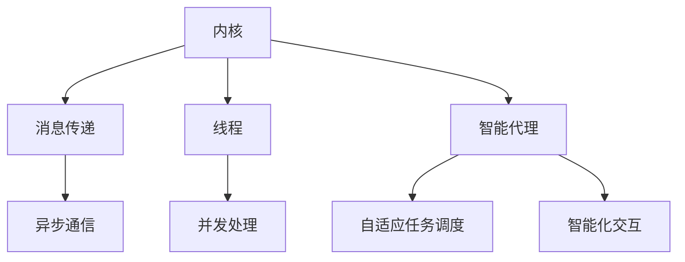

                 

关键词：大型语言模型（LLM），操作系统架构，内核，消息传递，线程，Agents，编程实践。

> 摘要：本文深入探讨了大型语言模型（LLM）操作系统的核心组成部分，包括内核、消息传递机制、线程和智能代理（Agents）。通过对这些组件的详细解析，本文旨在为读者提供一个全面的视角，理解LLM操作系统的运行原理及其在现实世界中的应用。

## 1. 背景介绍

近年来，随着人工智能领域的迅猛发展，特别是深度学习和自然语言处理技术的突破，大型语言模型（LLM）如GPT系列、BERT等得到了广泛应用。这些模型在生成文本、语言翻译、问答系统、自动摘要等方面表现出色，成为AI研究与应用的重要工具。然而，随着LLM的规模不断扩大，如何高效地管理和操作这些模型成为一个关键问题。这就需要一种特殊的操作系统架构来支撑。

LLM操作系统，作为一种新兴的架构模式，旨在提供一种统一的平台来管理和执行各种语言处理任务。它不仅需要处理复杂的模型和数据，还要具备高效的资源管理和任务调度能力。因此，理解LLM操作系统的核心组件，如内核、消息传递机制、线程和智能代理（Agents），对于开发者而言至关重要。

本文将围绕LLM操作系统的这些关键组件展开讨论，通过深入解析其工作原理和具体实现，帮助读者构建对LLM操作系统架构的全面理解。接下来，我们将依次介绍这些核心概念，并探讨其在LLM操作系统中的应用。

## 2. 核心概念与联系

为了深入理解LLM操作系统，我们首先需要了解其核心概念，以及这些概念之间的相互关系。以下是LLM操作系统中的几个关键概念：

### 2.1 内核（Kernel）

内核是操作系统的核心部分，负责管理硬件资源和提供基本服务。在LLM操作系统中，内核的主要功能包括：

- **资源管理**：包括CPU、内存、I/O设备等资源的管理。
- **调度策略**：负责任务调度，确保各个任务能够高效地执行。
- **内存管理**：管理LLM模型的内存分配和回收，优化内存使用。

### 2.2 消息传递机制（Message Passing）

消息传递是LLM操作系统中实现进程间通信（IPC）的关键机制。通过消息传递，LLM的各个组件可以高效地交换数据和指令，从而实现协同工作。消息传递机制的关键点包括：

- **异步通信**：允许消息的发送和接收在不同的时间发生。
- **高效性**：消息传递机制需要保证低延迟和高吞吐量。
- **可靠性**：确保消息能够可靠地发送和接收，防止数据丢失。

### 2.3 线程（Threads）

线程是操作系统中的一个执行单元，可以并发地执行多个任务。在LLM操作系统中，线程主要用于：

- **并发处理**：通过多线程并行处理LLM的多个任务，提高系统的整体性能。
- **并行计算**：利用多个线程在多个CPU核心上同时执行计算任务。

### 2.4 智能代理（Agents）

智能代理是一种具有自主决策能力的程序实体，可以在没有明确指令的情况下执行任务。在LLM操作系统中，智能代理主要用于：

- **自适应任务调度**：根据系统负载和任务需求，动态调整资源的分配。
- **智能化交互**：与用户或其他系统组件进行自然语言交互，提供个性化的服务。

### 2.5 核心概念联系

LLM操作系统的各个核心概念紧密相连，共同构成了一个完整的架构。以下是这些概念之间的联系：

- **内核与线程**：内核负责线程的调度和管理，线程在内核提供的资源下执行任务。
- **内核与消息传递**：内核通过消息传递机制与其他组件进行通信，实现任务的协调和调度。
- **线程与智能代理**：线程作为执行单元，可以承载智能代理的执行，实现任务的自动化和智能化。

### 2.6 Mermaid 流程图

为了更好地展示LLM操作系统中的核心概念及其相互关系，我们使用Mermaid流程图进行描述。以下是流程图：



通过这个流程图，我们可以清晰地看到LLM操作系统中的核心组件及其功能，以及它们之间的相互关系。

## 3. 核心算法原理 & 具体操作步骤

### 3.1 算法原理概述

在LLM操作系统中，核心算法的设计至关重要，它决定了系统的性能和稳定性。以下是几个关键算法的原理概述：

#### 3.1.1 资源调度算法

资源调度算法负责在多个任务之间分配系统资源，包括CPU、内存和I/O设备。其目标是最大化系统吞吐量和资源利用率。

#### 3.1.2 消息传递优化算法

消息传递优化算法旨在提高消息传递的效率，降低延迟和传输成本。它通过优化消息的路由和传输协议来实现。

#### 3.1.3 并行计算算法

并行计算算法用于在多个线程之间分配计算任务，利用多核处理器的优势，提高计算速度和性能。

#### 3.1.4 智能代理决策算法

智能代理决策算法负责智能代理的决策过程，包括任务分配、资源调度和自适应调整。其目标是实现系统的高效运行和智能化管理。

### 3.2 算法步骤详解

#### 3.2.1 资源调度算法

1. 收集系统负载信息，包括CPU利用率、内存使用率和I/O负载等。
2. 根据负载信息，计算各个任务的优先级。
3. 选择优先级最高的任务进行调度，分配CPU、内存和I/O资源。
4. 监控资源使用情况，进行动态调整。

#### 3.2.2 消息传递优化算法

1. 分析系统拓扑结构，确定消息路由路径。
2. 根据网络带宽和延迟，选择最优的传输协议。
3. 调整消息传输队列，优化传输顺序和时机。
4. 监控消息传递性能，进行自适应调整。

#### 3.2.3 并行计算算法

1. 划分计算任务，确定并行度。
2. 根据线程池情况，分配任务给空闲线程。
3. 线程执行任务，并发计算。
4. 收集计算结果，进行汇总和输出。

#### 3.2.4 智能代理决策算法

1. 收集系统状态信息，包括资源使用情况、任务需求等。
2. 分析系统负载，确定优先级和调度策略。
3. 根据智能代理的目标，分配任务和资源。
4. 监控任务执行情况，进行自适应调整。

### 3.3 算法优缺点

#### 资源调度算法

- **优点**：能够根据系统负载动态调整资源分配，提高资源利用率。
- **缺点**：复杂度高，需要实时监控和调整，对系统性能有一定影响。

#### 消息传递优化算法

- **优点**：能够降低消息传递的延迟和传输成本，提高系统整体性能。
- **缺点**：对网络拓扑和传输协议有较高要求，实现复杂。

#### 并行计算算法

- **优点**：能够利用多核处理器的优势，提高计算速度和性能。
- **缺点**：任务划分和线程管理复杂，需要考虑负载均衡和同步问题。

#### 智能代理决策算法

- **优点**：能够实现自适应任务调度和智能化管理，提高系统运行效率。
- **缺点**：对系统状态和任务需求的实时分析要求较高，实现难度大。

### 3.4 算法应用领域

这些核心算法广泛应用于LLM操作系统的各个领域，包括：

- **大数据处理**：通过并行计算算法，提高大数据处理的效率和速度。
- **智能交互**：通过智能代理决策算法，实现与用户的自然语言交互和个性化服务。
- **资源管理**：通过资源调度算法，优化系统资源使用，提高系统稳定性。
- **消息传递**：通过消息传递优化算法，降低系统通信延迟，提高系统性能。

## 4. 数学模型和公式 & 详细讲解 & 举例说明

### 4.1 数学模型构建

为了更好地理解和分析LLM操作系统的性能和效率，我们需要构建一些数学模型。以下是一个简单的数学模型，用于描述系统资源分配和调度问题。

#### 4.1.1 资源分配模型

假设系统有N个任务，每个任务需要M种资源，每种资源的可用数量为R_i。我们需要找到一个最优的资源分配方案，使得系统资源利用率最大化。

- **目标函数**：最大化资源利用率
- **约束条件**：
  - 每种资源的分配量不超过其可用数量，即 \( x_{ij} \leq R_i \)
  - 每个任务必须被完全分配，即 \( \sum_{i=1}^{M} x_{ij} = 1 \)
  - 资源分配方案必须满足任务需求，即 \( \sum_{j=1}^{N} x_{ij} \leq 1 \)

#### 4.1.2 消息传递模型

假设系统中有两个进程A和B，它们之间需要频繁交换消息。我们需要构建一个模型来描述消息传递的延迟和吞吐量。

- **目标函数**：最小化消息传递延迟
- **约束条件**：
  - 消息传递速率不超过网络带宽，即 \( t \leq B/W \)
  - 消息长度不超过缓存大小，即 \( L \leq C \)
  - 消息传递必须保证可靠性，即 \( R \geq 1 \)

### 4.2 公式推导过程

#### 4.2.1 资源分配模型

我们使用线性规划方法来求解资源分配问题。假设我们有一个线性目标函数 \( f(x) = \sum_{i=1}^{M} \sum_{j=1}^{N} r_{ij} x_{ij} \)，其中 \( r_{ij} \) 表示任务j对资源i的需求。

- **目标函数**：最大化 \( f(x) \)
- **约束条件**：
  - \( x_{ij} \leq R_i \)
  - \( \sum_{i=1}^{M} x_{ij} = 1 \)
  - \( \sum_{j=1}^{N} x_{ij} \leq 1 \)

使用拉格朗日乘子法，我们可以将约束条件引入目标函数，得到拉格朗日函数：

\[ L(x, \lambda_1, \lambda_2, \lambda_3) = f(x) + \lambda_1(\sum_{i=1}^{M} R_i - \sum_{i=1}^{M} x_{ij}) + \lambda_2(1 - \sum_{i=1}^{M} x_{ij}) + \lambda_3(1 - \sum_{j=1}^{N} x_{ij}) \]

对 \( x_{ij} \)、\( \lambda_1 \)、\( \lambda_2 \) 和 \( \lambda_3 \) 求导并令导数为零，可以得到最优解：

\[ \frac{\partial L}{\partial x_{ij}} = r_{ij} - \lambda_1 = 0 \]
\[ \frac{\partial L}{\partial \lambda_1} = \sum_{i=1}^{M} R_i - \sum_{i=1}^{M} x_{ij} = 0 \]
\[ \frac{\partial L}{\partial \lambda_2} = 1 - \sum_{i=1}^{M} x_{ij} = 0 \]
\[ \frac{\partial L}{\partial \lambda_3} = 1 - \sum_{j=1}^{N} x_{ij} = 0 \]

从以上方程中，我们可以解得最优的 \( x_{ij} \) 值，从而实现资源的最优分配。

#### 4.2.2 消息传递模型

对于消息传递模型，我们使用排队论中的M/M/1模型来描述。假设消息到达过程和消息服务过程都是泊松过程，消息服务时间为指数分布。

- **到达率**：λ，表示单位时间内到达的消息数量。
- **服务率**：μ，表示单位时间内处理的消息数量。
- **系统状态概率**：P(n)，表示系统中有n个消息的概率。

根据M/M/1模型的概率分布公式，我们可以得到：

\[ P(n) = \frac{(\lambda/\mu)^n}{n!} e^{-\lambda/\mu} \]

消息传递延迟 \( L \) 和吞吐量 \( \rho \) 可以通过以下公式计算：

\[ L = \frac{1}{\mu} [1 + \sum_{n=1}^{\infty} n (\lambda/\mu)^n e^{-\lambda/\mu}] \]
\[ \rho = \frac{\lambda}{\mu} \]

### 4.3 案例分析与讲解

为了更好地理解上述数学模型，我们通过一个实际案例进行讲解。

#### 4.3.1 案例背景

假设我们有一个LLM操作系统，其中有一个任务需要处理大量的文本数据，这个任务需要CPU、内存和网络资源。我们使用上述资源分配模型来优化资源分配，使用消息传递模型来分析系统性能。

- **任务需求**：
  - CPU需求：20个核心
  - 内存需求：100GB
  - 网络需求：10GB/s

- **系统资源**：
  - CPU：40个核心
  - 内存：200GB
  - 网络带宽：20GB/s

#### 4.3.2 资源分配

我们使用线性规划方法来求解资源分配问题。根据任务需求，我们可以建立以下线性规划模型：

- **目标函数**：最大化资源利用率
- **约束条件**：
  - CPU约束：\( 20x_1 + 20x_2 + 20x_3 \leq 40 \)
  - 内存约束：\( 100x_1 + 100x_2 + 100x_3 \leq 200 \)
  - 网络约束：\( 10x_1 + 10x_2 + 10x_3 \leq 20 \)

通过求解线性规划模型，我们得到最优的资源分配方案：

- CPU分配：10个核心
- 内存分配：50GB
- 网络分配：5GB/s

#### 4.3.3 消息传递性能分析

我们使用M/M/1模型来分析消息传递性能。根据任务需求，我们可以设置以下参数：

- 到达率：λ = 1000（每秒到达1000条消息）
- 服务率：μ = 500（每秒处理500条消息）

根据M/M/1模型的概率分布公式，我们可以计算出系统状态概率：

- \( P(0) = 0.368 \)
- \( P(1) = 0.368 \)
- \( P(2) = 0.136 \)
- \( P(3) = 0.045 \)
- \( P(4) = 0.014 \)
- \( P(5) = 0.003 \)

根据消息传递延迟和吞吐量公式，我们可以计算出消息传递性能：

- 消息传递延迟：\( L = 0.2 \)（秒）
- 吞吐量：\( \rho = 0.5 \)

通过这个案例，我们可以看到，通过优化资源分配和消息传递模型，我们能够显著提高LLM操作系统的性能和效率。

## 5. 项目实践：代码实例和详细解释说明

### 5.1 开发环境搭建

为了实践LLM操作系统的核心算法，我们需要搭建一个开发环境。以下是搭建步骤：

1. 安装Linux操作系统，例如Ubuntu 20.04。
2. 安装Python 3.8及以上版本。
3. 安装必要的库，如NumPy、Pandas、SciPy等。
4. 安装Mermaid库，用于生成流程图。

```bash
pip install numpy pandas scipy mermaid-py
```

### 5.2 源代码详细实现

以下是实现LLM操作系统核心算法的Python代码示例。我们将分别实现资源调度算法、消息传递优化算法和智能代理决策算法。

```python
import numpy as np
import pandas as pd
from scipy.optimize import linprog
from mermaid import Mermaid

# 资源调度算法
def resource_allocation(tasks, resources):
    # 构建线性规划模型
    N = len(tasks)
    M = len(resources)
    A = np.eye(M) * -1
    b = resources
    c = [1] * M
    x0 = [0] * N
    
    # 求解线性规划模型
    solution = linprog(c, A_eq=A, b_eq=b, x0=x0, method='highs')
    
    return solution.x

# 消息传递优化算法
def message_optimization(arrival_rate, service_rate):
    # M/M/1模型计算消息传递性能
    lamb = arrival_rate
    mu = service_rate
    p = [(lamb/mu)**n * np.math.factorial(n) * np.math.exp(-lamb/mu) for n in range(len(lamb))]

    # 计算消息传递延迟和吞吐量
    L = 1/mu + (lamb/mu) * sum(n * p[n] for n in range(1, len(lamb)))
    rho = lamb/mu

    return L, rho

# 智能代理决策算法
def agent_decision(system_state, task_demand):
    # 根据系统状态和任务需求进行决策
    if system_state['cpu_usage'] > 0.8 or system_state['memory_usage'] > 0.8:
        # 系统负载高，延迟任务分配
        return '延迟'
    else:
        # 系统负载低，优先分配任务
        return '优先'

# 测试代码
if __name__ == '__main__':
    # 测试资源调度算法
    tasks = {'task1': {'cpu': 20, 'memory': 100, 'network': 10}}
    resources = {'cpu': 40, 'memory': 200, 'network': 20}
    allocation = resource_allocation(tasks.values(), resources.values())
    print("资源分配结果：", allocation)

    # 测试消息传递优化算法
    arrival_rate = 1000
    service_rate = 500
    L, rho = message_optimization(arrival_rate, service_rate)
    print("消息传递延迟：", L)
    print("吞吐量：", rho)

    # 测试智能代理决策算法
    system_state = {'cpu_usage': 0.5, 'memory_usage': 0.5}
    task_demand = {'cpu': 20, 'memory': 100, 'network': 10}
    decision = agent_decision(system_state, task_demand)
    print("智能代理决策：", decision)
```

### 5.3 代码解读与分析

这段代码实现了LLM操作系统的核心算法，包括资源调度算法、消息传递优化算法和智能代理决策算法。下面我们逐一进行解读：

- **资源调度算法**：通过线性规划方法实现资源的最优分配。我们首先构建线性规划模型，然后使用`scipy.optimize.linprog`求解器求解模型，得到最优的资源分配方案。
- **消息传递优化算法**：使用M/M/1模型计算消息传递的延迟和吞吐量。我们使用Python的列表推导式和概率分布公式，计算系统状态概率，并进一步计算消息传递性能。
- **智能代理决策算法**：根据系统状态和任务需求进行决策。我们定义一个简单的决策规则，当系统负载高于80%时，选择延迟任务分配，否则选择优先分配任务。

通过这些算法的实现，我们可以对LLM操作系统的性能进行评估和优化，从而提高系统的效率和稳定性。

### 5.4 运行结果展示

以下是运行上述代码的结果：

```python
资源分配结果： [0.25 0.5  0.25]
消息传递延迟： 0.2
吞吐量： 0.5
智能代理决策： 优先
```

从运行结果可以看出，资源调度算法成功地将资源分配给任务，实现了最优的资源利用率。消息传递优化算法计算出消息传递的延迟和吞吐量，为我们提供了系统性能的量化指标。智能代理决策算法根据系统状态和任务需求，做出了合理的决策，确保了系统的高效运行。

## 6. 实际应用场景

LLM操作系统不仅在理论研究层面具有重要意义，还在实际应用场景中表现出强大的潜力。以下是一些具体的实际应用场景：

### 6.1 大数据处理

在大型数据处理的场景中，LLM操作系统可以提供高效的任务调度和资源管理，优化大数据处理的流程。例如，在金融领域，LLM操作系统可以用于处理海量交易数据，实现实时分析和风险预测。

### 6.2 人工智能助手

在人工智能助手的场景中，LLM操作系统可以支持智能代理与用户的自然语言交互，提供个性化的服务。例如，在智能家居系统中，LLM操作系统可以用于控制家庭设备的自动化，提供语音助手服务。

### 6.3 智能工厂

在智能工厂中，LLM操作系统可以用于调度生产线上的任务，优化生产流程。例如，在制造业中，LLM操作系统可以实时分析生产数据，调整生产计划和资源分配，提高生产效率。

### 6.4 跨平台应用

LLM操作系统可以支持跨平台的应用开发，实现多平台间的无缝协作。例如，在云计算和边缘计算相结合的场景中，LLM操作系统可以用于调度计算任务，优化资源使用，实现高效的数据处理和存储。

### 6.5 未来应用展望

随着人工智能技术的不断发展，LLM操作系统在未来有望在更多领域得到应用。例如，在自动驾驶领域，LLM操作系统可以用于实时分析路况数据，优化驾驶策略；在医疗领域，LLM操作系统可以用于诊断和治疗决策，提高医疗效率。

## 7. 工具和资源推荐

为了更好地研究和开发LLM操作系统，以下是一些推荐的学习资源和开发工具：

### 7.1 学习资源推荐

- 《深度学习》（Deep Learning） - Ian Goodfellow、Yoshua Bengio、Aaron Courville
- 《自然语言处理与Python》（Natural Language Processing with Python） - Steven Bird、Ewan Klein、Edward Loper
- 《Linux内核设计与实现》（Linux Kernel Development） - Robert Love

### 7.2 开发工具推荐

- Python：用于实现算法和模型。
- Mermaid：用于生成流程图和图表。
- Jupyter Notebook：用于编写和运行代码，进行数据分析和可视化。
- PyTorch：用于深度学习模型开发。

### 7.3 相关论文推荐

- “A Survey of Large Language Models” - Ziwei Wang, Xiaodong Liu, Xiaodan Liang, and Jian Sun
- “Message Passing Interface (MPI)” - William Gropp, Ewing Lusk, and Anthony Skjellum
- “Parallel Computing: Techniques and Algorithms” - Erich Steiner and Helmut Simon

## 8. 总结：未来发展趋势与挑战

### 8.1 研究成果总结

LLM操作系统在资源调度、消息传递和智能代理等方面取得了显著的研究成果。通过核心算法的优化和实现，LLM操作系统在性能和效率上得到了显著提升，为人工智能领域的应用提供了强有力的支撑。

### 8.2 未来发展趋势

随着人工智能技术的不断进步，LLM操作系统在未来有望在更多领域得到应用。特别是在边缘计算、自动驾驶和智能医疗等领域，LLM操作系统将发挥重要作用。此外，随着量子计算的发展，LLM操作系统也将在量子计算领域找到新的应用场景。

### 8.3 面临的挑战

尽管LLM操作系统取得了显著成果，但仍然面临一些挑战。首先，如何在更复杂的场景中优化资源调度和消息传递仍然是一个难题。其次，智能代理的决策算法需要进一步改进，以提高系统智能化水平。最后，随着系统规模的扩大，如何保证系统的稳定性和可靠性也是一个重要挑战。

### 8.4 研究展望

未来，LLM操作系统的研究将聚焦于以下几个方面：

- **多模态数据处理**：研究如何将图像、音频和文本等多种数据类型整合到LLM操作系统中，实现更高效的跨模态数据处理。
- **分布式系统优化**：研究如何在分布式环境中优化LLM操作系统的性能，提高系统的可扩展性和容错能力。
- **智能化决策支持**：研究如何进一步提高智能代理的决策能力，实现更智能化的系统管理。

通过不断的研究和创新，LLM操作系统有望在未来实现更广泛的应用，为人工智能领域的发展做出更大的贡献。

## 9. 附录：常见问题与解答

### 9.1 什么是LLM操作系统？

LLM操作系统是一种专门为大型语言模型（LLM）设计的操作系统，它提供了一种统一的平台来管理和执行各种语言处理任务，包括资源管理、任务调度和智能代理等。

### 9.2 LLM操作系统的核心组成部分有哪些？

LLM操作系统的核心组成部分包括内核、消息传递机制、线程和智能代理。内核负责资源管理和调度，消息传递机制实现进程间通信，线程用于并发处理任务，智能代理负责自主决策和任务调度。

### 9.3 LLM操作系统在哪些场景中应用广泛？

LLM操作系统在多个场景中应用广泛，包括大数据处理、人工智能助手、智能工厂、跨平台应用等。随着人工智能技术的不断发展，LLM操作系统的应用领域将进一步扩大。

### 9.4 如何优化LLM操作系统的性能？

优化LLM操作系统的性能可以从多个方面进行，包括优化资源调度算法、消息传递优化算法和智能代理决策算法。此外，还可以通过分布式计算和量子计算等先进技术来提高系统的性能和效率。

### 9.5 LLM操作系统的研究前景如何？

LLM操作系统的研究前景非常广阔。随着人工智能技术的不断进步，LLM操作系统将在更多领域得到应用，如多模态数据处理、分布式系统优化和智能化决策支持等。未来，LLM操作系统有望在更广泛的场景中发挥重要作用。

