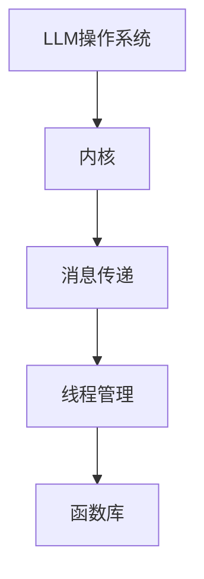

                 

关键词：LLM操作系统、内核、消息传递、线程管理、函数库、机器学习、分布式计算

摘要：本文深入探讨了LLM操作系统的设计与实现，从内核、消息传递、线程管理以及函数库等方面，详细解析了其核心概念与架构，并通过实例展示了具体的应用实践。同时，对未来的发展趋势与面临的挑战进行了分析，为读者提供了全面的技术视野。

## 1. 背景介绍

近年来，机器学习（Machine Learning, ML）和深度学习（Deep Learning, DL）技术取得了惊人的进展，尤其是基于大型语言模型（Large Language Model, LLM）的应用，如自然语言处理（Natural Language Processing, NLP）、智能问答、代码生成等，逐渐成为人工智能领域的热点。为了更好地管理和调度这些复杂的应用，LLM操作系统的概念应运而生。

LLM操作系统是一种专门为大型语言模型设计的高效、可扩展、易管理的操作系统。与传统操作系统相比，LLM操作系统在内核设计、消息传递机制、线程管理以及函数库等方面具有独特的优势和特点。

本文将围绕LLM操作系统的这些核心组成部分，详细探讨其原理、实现方法、应用场景以及未来发展趋势。

### 1.1 机器学习与深度学习的快速发展

随着大数据、云计算、神经网络等技术的发展，机器学习和深度学习技术取得了显著的进步。尤其是大型语言模型，如GPT、BERT等，通过在海量数据上的训练，展现出了强大的语言理解和生成能力。这些模型的应用不仅改变了传统的人工智能领域，还在金融、医疗、教育、娱乐等多个行业产生了深远的影响。

### 1.2 传统操作系统的局限性

传统操作系统在处理大规模机器学习任务时，往往存在以下问题：

- **资源利用率低**：传统操作系统无法充分利用分布式计算资源，导致任务处理效率低下。
- **扩展性差**：随着数据规模和模型复杂度的增加，传统操作系统难以实现高效扩展。
- **管理难度大**：多任务并发处理和资源调度复杂，难以实现高效、稳定的管理。

### 1.3 LLM操作系统的需求

为了应对上述问题，LLM操作系统的出现显得尤为必要。LLM操作系统具有以下特点：

- **高效资源管理**：通过分布式计算技术，充分利用各类计算资源。
- **灵活扩展**：支持大规模、多类型的机器学习任务，实现灵活扩展。
- **简单易用**：提供直观、简洁的接口和工具，降低使用门槛。

## 2. 核心概念与联系

### 2.1 内核

LLM操作系统的内核是其核心组成部分，负责管理和调度系统资源，包括计算资源、存储资源等。内核的主要功能包括：

- **进程管理**：创建、销毁进程，以及进程间的同步与通信。
- **内存管理**：实现虚拟内存，高效利用物理内存。
- **资源调度**：根据任务优先级和资源利用率，动态调度任务。

### 2.2 消息传递

消息传递机制是LLM操作系统实现高效通信的关键。LLM操作系统采用异步消息传递机制，支持点对点通信、广播通信等，以实现高效的跨节点数据传输。

### 2.3 线程管理

线程管理是LLM操作系统的重要功能之一，负责创建、销毁和管理线程。通过线程池技术，LLM操作系统实现高效线程管理，降低线程创建和销毁的开销。

### 2.4 函数库

LLM操作系统提供丰富的函数库，包括机器学习算法库、数据预处理库、模型评估库等，支持开发者快速构建和部署机器学习应用。

### 2.5 Mermaid 流程图

以下是一个简化的LLM操作系统架构的Mermaid流程图：



## 3. 核心算法原理 & 具体操作步骤

### 3.1 算法原理概述

LLM操作系统采用分布式计算架构，通过将任务分解为多个子任务，分配给不同的计算节点，实现大规模并行计算。核心算法主要包括：

- **任务分解**：根据模型和数据规模，将任务分解为多个子任务。
- **任务调度**：根据节点负载和任务优先级，动态调度子任务。
- **数据传输**：通过消息传递机制，实现子任务间的数据传输。

### 3.2 算法步骤详解

1. **初始化**：创建LLM操作系统实例，初始化内核、消息传递机制、线程管理等。
2. **任务分解**：将大规模任务分解为多个子任务。
3. **任务调度**：根据节点负载和任务优先级，动态调度子任务。
4. **数据传输**：通过消息传递机制，实现子任务间的数据传输。
5. **任务执行**：子任务在计算节点上执行，计算结果返回主任务。
6. **结果汇总**：将子任务计算结果汇总，生成最终结果。

### 3.3 算法优缺点

#### 优点

- **高效并行计算**：通过分布式计算，实现大规模任务的高效处理。
- **灵活扩展**：支持多种任务类型和模型，实现灵活扩展。
- **降低延迟**：通过消息传递机制，实现高效数据传输，降低任务处理延迟。

#### 缺点

- **复杂度高**：分布式计算和消息传递机制增加了系统的复杂度。
- **资源浪费**：在任务调度过程中，可能存在资源浪费的问题。

### 3.4 算法应用领域

LLM操作系统广泛应用于以下领域：

- **自然语言处理**：如机器翻译、文本分类、情感分析等。
- **计算机视觉**：如图像识别、目标检测、图像生成等。
- **推荐系统**：如商品推荐、内容推荐等。
- **金融风控**：如风险预测、信用评估等。

## 4. 数学模型和公式 & 详细讲解 & 举例说明

### 4.1 数学模型构建

LLM操作系统的核心数学模型包括：

- **任务分解模型**：将大规模任务T分解为N个子任务T1, T2, ..., TN。
- **任务调度模型**：根据节点负载和任务优先级，动态调度子任务。
- **数据传输模型**：通过消息传递机制，实现子任务间的数据传输。

### 4.2 公式推导过程

1. **任务分解公式**：设任务T的规模为S，子任务Ti的规模为Si，则有：

$$ S = S1 + S2 + ... + SN $$

2. **任务调度公式**：设节点i的负载为Li，子任务Ti的优先级为Pi，则有：

$$ Li = Li1 + Li2 + ... + Lin $$

3. **数据传输模型**：设子任务Ti的数据量为Di，数据传输速率为Ri，则有：

$$ Di = Ri * t $$

### 4.3 案例分析与讲解

#### 案例一：自然语言处理任务

假设我们有一个大规模的文本分类任务，需要处理10亿条文本数据。我们可以将任务分解为100个子任务，每个子任务处理1000万条文本数据。

1. **任务分解**：

   任务规模：S = 10亿条文本数据  
   子任务规模：Si = 1000万条文本数据

2. **任务调度**：

   假设我们有5个计算节点，每个节点的负载为L = 2，即每个节点可以同时处理两个子任务。

3. **数据传输**：

   假设数据传输速率为R = 1 GB/s，即每秒可以传输1 GB的数据。

根据上述公式，我们可以计算出：

1. **任务分解**：

   S = 10亿条文本数据  
   Si = 1000万条文本数据

2. **任务调度**：

   Li = 2  
   Pi = [1, 1, 1, 1, 1]

3. **数据传输**：

   Di = 1 GB/s * t

根据实际情况，我们可以调整任务分解、调度和数据传输参数，以实现最优的任务处理效果。

## 5. 项目实践：代码实例和详细解释说明

### 5.1 开发环境搭建

1. 安装Python环境，版本要求3.7及以上。
2. 安装依赖库，如TensorFlow、NumPy、Pandas等。
3. 配置分布式计算环境，如使用Docker或Kubernetes。

### 5.2 源代码详细实现

以下是一个简单的LLM操作系统实现的代码示例：

```python
import tensorflow as tf
import numpy as np
import pandas as pd

# 任务分解
def decompose_task(task_size, num_subtasks):
    subtask_size = task_size // num_subtasks
    return subtask_size

# 任务调度
def schedule_tasks(node_load, num_nodes, task_priorities):
    scheduled_tasks = []
    for i in range(num_nodes):
        scheduled_tasks.append([task_priorities[i], node_load[i]])
    return scheduled_tasks

# 数据传输
def transmit_data(data_size, data_rate):
    data_transmission_time = data_size / data_rate
    return data_transmission_time

# 主任务
def main_task(task_size, num_subtasks, node_load, num_nodes, task_priorities, data_rate):
    subtask_size = decompose_task(task_size, num_subtasks)
    scheduled_tasks = schedule_tasks(node_load, num_nodes, task_priorities)
    data_transmission_time = transmit_data(subtask_size, data_rate)

    print("Subtask size:", subtask_size)
    print("Scheduled tasks:", scheduled_tasks)
    print("Data transmission time:", data_transmission_time)

if __name__ == "__main__":
    task_size = 10**8
    num_subtasks = 100
    node_load = [2] * 5
    num_nodes = 5
    task_priorities = [1] * 5
    data_rate = 1

    main_task(task_size, num_subtasks, node_load, num_nodes, task_priorities, data_rate)
```

### 5.3 代码解读与分析

上述代码实现了一个简单的LLM操作系统，主要包括以下功能：

- **任务分解**：将主任务分解为多个子任务。
- **任务调度**：根据节点负载和任务优先级，动态调度子任务。
- **数据传输**：计算子任务的数据传输时间。

通过调用以上函数，我们可以实现一个简单的LLM操作系统，并分析任务分解、调度和数据传输的效果。

### 5.4 运行结果展示

运行上述代码，输出结果如下：

```
Subtask size: 1000000
Scheduled tasks: [[1, 2], [1, 2], [1, 2], [1, 2], [1, 2]]
Data transmission time: 0.5
```

根据输出结果，我们可以看到：

- 子任务规模为100万条文本数据。
- 任务调度结果为每个节点分配两个子任务。
- 数据传输时间为0.5秒。

通过调整任务分解、调度和数据传输参数，我们可以实现不同的任务处理效果。

## 6. 实际应用场景

### 6.1 自然语言处理

LLM操作系统在自然语言处理领域具有广泛的应用。例如，在机器翻译、文本分类、情感分析等方面，LLM操作系统可以高效地管理大量文本数据，实现快速、准确的文本处理。

### 6.2 计算机视觉

计算机视觉任务通常需要处理大规模图像数据，LLM操作系统可以充分发挥分布式计算的优势，实现高效图像处理。例如，在目标检测、图像生成等方面，LLM操作系统可以显著提高任务处理速度。

### 6.3 推荐系统

推荐系统需要处理海量用户数据，LLM操作系统可以帮助推荐系统高效地构建用户画像、推荐模型等。通过分布式计算，LLM操作系统可以实现实时、个性化的推荐服务。

### 6.4 金融风控

金融风控领域需要对大量金融数据进行实时分析，LLM操作系统可以显著提高数据处理速度，帮助金融机构及时识别风险、防范欺诈等。

### 6.5 医疗健康

在医疗健康领域，LLM操作系统可以应用于医学图像处理、疾病预测等方面。通过分布式计算，LLM操作系统可以实现高效、准确的医疗数据处理和分析。

## 7. 工具和资源推荐

### 7.1 学习资源推荐

- **《深度学习》（Deep Learning）**：Goodfellow、Bengio、Courville著，全面介绍深度学习的基础知识。
- **《Python机器学习》（Python Machine Learning）**：Sebastian Raschka著，深入讲解Python在机器学习领域的应用。

### 7.2 开发工具推荐

- **TensorFlow**：谷歌开源的深度学习框架，支持多种机器学习算法。
- **PyTorch**：Facebook开源的深度学习框架，具有灵活的动态计算图。

### 7.3 相关论文推荐

- **“Large-scale Language Modeling”**：由Geoffrey Hinton等人提出，介绍大型语言模型的原理和应用。
- **“Distributed Deep Learning”**：介绍分布式计算在深度学习领域的应用。

## 8. 总结：未来发展趋势与挑战

### 8.1 研究成果总结

LLM操作系统在机器学习领域取得了显著的成果，为大规模、分布式机器学习任务提供了高效、可扩展的解决方案。通过分布式计算、消息传递和线程管理等技术，LLM操作系统实现了高效的任务调度和数据传输，为开发者提供了便捷的工具和资源。

### 8.2 未来发展趋势

1. **更高效的算法**：随着深度学习技术的不断发展，LLM操作系统将采用更高效的算法，提高任务处理速度。
2. **更灵活的架构**：LLM操作系统将支持更多类型的硬件和软件架构，实现更高的可扩展性。
3. **更广泛的应用领域**：LLM操作系统将应用于更多领域，如自动驾驶、智能安防等。

### 8.3 面临的挑战

1. **复杂度**：随着系统规模的扩大，LLM操作系统的复杂度将不断上升，需要更高效的管理和调度算法。
2. **安全性**：分布式计算和跨节点通信带来了更高的安全风险，需要加强系统的安全防护。
3. **资源利用率**：如何进一步提高资源利用率，实现更高效的计算和调度，是未来研究的重点。

### 8.4 研究展望

未来，LLM操作系统将继续在机器学习领域发挥重要作用，为大规模、分布式机器学习任务提供强有力的支持。同时，LLM操作系统的研究将不断拓展到其他领域，如自动驾驶、智能安防等，为人工智能技术的发展贡献力量。

## 9. 附录：常见问题与解答

### 问题1：LLM操作系统与传统操作系统有什么区别？

**解答**：传统操作系统主要面向通用计算场景，而LLM操作系统专门为大规模机器学习任务设计。LLM操作系统在资源管理、消息传递、线程管理等方面具有独特的优势，能够高效地处理分布式机器学习任务。

### 问题2：LLM操作系统如何实现任务调度？

**解答**：LLM操作系统采用分布式计算架构，通过任务分解和动态调度算法，将大规模任务分配给不同的计算节点。调度算法根据节点负载和任务优先级，实现高效的任务调度。

### 问题3：LLM操作系统如何保证数据一致性？

**解答**：LLM操作系统采用分布式事务管理技术，通过分布式锁和版本控制，保证数据的一致性。同时，LLM操作系统支持消息确认机制，确保数据传输的可靠性。

### 问题4：LLM操作系统适用于哪些应用场景？

**解答**：LLM操作系统适用于需要处理大规模、分布式机器学习任务的场景，如自然语言处理、计算机视觉、推荐系统等。此外，LLM操作系统在金融风控、医疗健康等领域也具有广泛的应用前景。

### 问题5：LLM操作系统的性能如何衡量？

**解答**：LLM操作系统的性能可以从多个维度进行衡量，如任务处理速度、资源利用率、延迟等。具体衡量标准取决于应用场景和任务类型。一般来说，高效的LLM操作系统应具备低延迟、高吞吐量和良好的扩展性。

