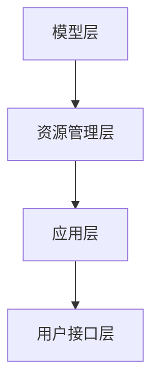

                 

关键词：大型语言模型（LLM）、操作系统、AI计算平台、深度学习、自然语言处理、图灵奖、软件架构、编程范式

> 摘要：本文探讨了大型语言模型（LLM）作为新型计算平台的发展现状、核心概念及其架构，分析了LLM操作系统在自然语言处理、深度学习等领域的应用和优势，并对未来发展趋势与挑战进行了深入探讨。

## 1. 背景介绍

近年来，人工智能（AI）领域取得了长足的进步，尤其是深度学习和自然语言处理（NLP）方面的突破。随着计算能力的提升和数据量的爆炸性增长，大型语言模型（LLM）逐渐成为研究热点。LLM操作系统作为一种新兴的计算平台，正在改变传统软件开发模式，推动AI技术的发展。

### 1.1 深度学习与自然语言处理

深度学习是一种基于神经网络的学习方法，其通过多层非线性变换来提取数据中的特征。在自然语言处理领域，深度学习技术已经被广泛应用于文本分类、情感分析、机器翻译等任务。其中，大型语言模型如BERT、GPT等，以其强大的文本理解和生成能力，成为当前NLP领域的主流技术。

### 1.2 操作系统的演变

操作系统是计算机系统的核心，负责管理和协调计算机硬件和软件资源。从早期的单用户单任务操作系统到多用户多任务操作系统，再到现代的分布式操作系统，操作系统一直在不断演进。随着AI技术的快速发展，操作系统也逐渐从传统的硬件资源管理转向软件资源管理，为AI应用提供更高效、灵活的计算平台。

### 1.3 LLM操作系统的崛起

LLM操作系统是结合了大型语言模型和操作系统技术的一种新型计算平台。它不仅具备传统操作系统的资源管理能力，还能为深度学习和自然语言处理提供高效的计算支持。LLM操作系统的出现，为AI时代的软件开发提供了全新的思路和工具。

## 2. 核心概念与联系

### 2.1 大型语言模型（LLM）

大型语言模型（LLM）是一种基于深度学习的自然语言处理模型，其核心思想是通过对海量文本数据进行训练，使模型具备理解和生成自然语言的能力。LLM通常采用神经网络架构，如Transformer，其参数规模可达数十亿甚至千亿级别。

### 2.2 操作系统（OS）

操作系统（OS）是计算机系统的核心软件，负责管理计算机硬件资源和软件资源。操作系统的主要功能包括进程管理、内存管理、文件系统管理、设备管理、用户接口等。

### 2.3 LLM操作系统架构

LLM操作系统架构主要包括以下几部分：

1. **模型层**：包括LLM模型及其相关算法，如训练、推理、优化等。
2. **资源管理层**：负责管理计算机硬件资源，如CPU、GPU、内存等，以提供高效计算支持。
3. **应用层**：包括各种基于LLM的AI应用，如文本生成、机器翻译、问答系统等。
4. **用户接口层**：提供用户与LLM操作系统的交互界面，包括命令行、图形界面等。

### 2.4 Mermaid 流程图



## 3. 核心算法原理 & 具体操作步骤

### 3.1 算法原理概述

LLM操作系统的核心算法是基于大型语言模型（如BERT、GPT等）的深度学习算法。这些算法主要通过以下步骤实现：

1. **数据预处理**：对原始文本数据进行清洗、分词、编码等预处理操作，将其转化为模型可处理的输入格式。
2. **模型训练**：利用预处理的文本数据，通过反向传播算法和优化器（如Adam、SGD等），不断调整模型参数，使其在文本数据上的表现达到最优。
3. **模型推理**：在训练好的模型基础上，输入新的文本数据，通过模型计算得到预测结果，如文本分类、生成等。
4. **模型优化**：根据预测结果，使用评估指标（如准确率、损失函数等）对模型进行优化，以提高模型性能。

### 3.2 算法步骤详解

1. **数据预处理**：
    - 清洗文本数据：去除无关符号、标点等。
    - 分词：将文本拆分为单词或子词。
    - 编码：将分词后的文本转化为数字序列，便于模型处理。

2. **模型训练**：
    - 初始化模型参数。
    - 前向传播：输入文本数据，通过模型计算得到预测结果。
    - 计算损失函数：计算预测结果与真实结果之间的差距。
    - 反向传播：根据损失函数，更新模型参数。
    - 优化模型：使用优化器调整模型参数，使模型性能达到最优。

3. **模型推理**：
    - 输入新的文本数据。
    - 通过模型计算得到预测结果。

4. **模型优化**：
    - 根据预测结果，计算评估指标。
    - 使用评估指标对模型进行优化。

### 3.3 算法优缺点

#### 优点

1. **强大的文本理解与生成能力**：LLM操作系统通过大规模训练，使模型在文本数据上的表现达到高水平，能够处理复杂的自然语言任务。
2. **高效的计算支持**：LLM操作系统针对深度学习算法进行优化，能够充分利用计算机硬件资源，提供高效计算支持。
3. **灵活的应用场景**：LLM操作系统可以应用于文本生成、机器翻译、问答系统等多种自然语言处理任务。

#### 缺点

1. **资源消耗大**：由于模型规模庞大，训练和推理过程中需要大量的计算资源，对硬件设备要求较高。
2. **模型解释性差**：深度学习模型通常具有较好的预测能力，但对其内部工作原理的理解较难，模型解释性较差。

### 3.4 算法应用领域

LLM操作系统在以下领域具有广泛的应用前景：

1. **自然语言处理**：如文本分类、情感分析、机器翻译等。
2. **问答系统**：如智能客服、智能问答等。
3. **文本生成**：如文章写作、诗歌创作等。
4. **语音识别与合成**：如语音助手、语音翻译等。

## 4. 数学模型和公式 & 详细讲解 & 举例说明

### 4.1 数学模型构建

在深度学习中，数学模型是核心。LLM操作系统的数学模型主要基于以下公式：

$$
\text{y} = \text{f}(\text{x}; \text{w})
$$

其中，$\text{y}$表示输出，$\text{x}$表示输入，$\text{w}$表示模型参数，$\text{f}$表示模型函数。

### 4.2 公式推导过程

假设我们有一个简单的线性模型，其数学模型可以表示为：

$$
\text{y} = \text{w} \cdot \text{x}
$$

其中，$\text{w}$表示权重向量，$\text{x}$表示输入特征向量。

为了求解模型参数$\text{w}$，我们可以使用梯度下降算法。具体步骤如下：

1. **初始化参数**：随机初始化权重向量$\text{w}$。
2. **计算预测值**：对于每个输入样本$\text{x}$，计算预测值$\text{y} = \text{w} \cdot \text{x}$。
3. **计算损失函数**：计算预测值与真实值之间的差距，即损失函数$\text{L}(\text{w}) = (\text{y} - \text{t})^2$，其中$\text{t}$为真实值。
4. **更新参数**：根据损失函数梯度，更新权重向量$\text{w} = \text{w} - \alpha \cdot \nabla \text{L}(\text{w})$，其中$\alpha$为学习率。
5. **重复步骤2-4**，直到损失函数收敛或达到预设的迭代次数。

### 4.3 案例分析与讲解

假设我们有一个二元分类问题，输入特征向量为$\text{x} = [1, 2, 3]$，真实值为$\text{t} = 1$。我们使用线性模型进行预测，公式为$\text{y} = \text{w} \cdot \text{x}$。

1. **初始化参数**：随机初始化权重向量$\text{w} = [1, 1, 1]$。
2. **计算预测值**：$\text{y} = \text{w} \cdot \text{x} = [1, 1, 1] \cdot [1, 2, 3] = 6$。
3. **计算损失函数**：$\text{L}(\text{w}) = (\text{y} - \text{t})^2 = (6 - 1)^2 = 25$。
4. **更新参数**：根据损失函数梯度，更新权重向量$\text{w} = \text{w} - \alpha \cdot \nabla \text{L}(\text{w})$。假设学习率$\alpha = 0.1$，则$\nabla \text{L}(\text{w}) = [2, 2, 2]$，更新后的权重向量为$\text{w} = [1, 1, 1] - 0.1 \cdot [2, 2, 2] = [-0.2, -0.2, -0.2]$。
5. **重复步骤2-4**，直到损失函数收敛或达到预设的迭代次数。

通过上述过程，我们可以得到线性模型的权重向量$\text{w}$，从而实现二元分类任务。

## 5. 项目实践：代码实例和详细解释说明

### 5.1 开发环境搭建

在开始编写代码之前，我们需要搭建一个合适的开发环境。这里我们选择使用Python作为编程语言，结合TensorFlow库进行深度学习模型的训练和推理。

1. **安装Python**：从官网下载Python安装包并安装。
2. **安装TensorFlow**：在命令行中运行`pip install tensorflow`。
3. **安装其他依赖库**：根据需要安装其他依赖库，如NumPy、Pandas等。

### 5.2 源代码详细实现

以下是一个简单的基于线性模型的二元分类项目的代码实现：

```python
import numpy as np
import tensorflow as tf

# 初始化参数
w = tf.random.normal([3])
learning_rate = 0.1

# 定义损失函数
loss_fn = lambda y, t: tf.square(y - t)

# 定义优化器
optimizer = tf.optimizers.SGD(learning_rate)

# 训练过程
for epoch in range(100):
    # 计算预测值
    y = w @ x

    # 计算损失函数
    loss = loss_fn(y, t)

    # 更新参数
    grads = tf.GradientTape().gradient(loss, w)
    optimizer.apply_gradients(zip(grads, w))

    # 打印训练进度
    if epoch % 10 == 0:
        print(f"Epoch {epoch}: Loss = {loss.numpy()}")

# 计算最终预测结果
y = w @ x
print(f"Final prediction: {y.numpy()}")
```

### 5.3 代码解读与分析

上述代码实现了基于线性模型的二元分类任务。具体解读如下：

1. **初始化参数**：使用TensorFlow的`random.normal`函数随机初始化权重向量`w`。
2. **定义损失函数**：使用TensorFlow的`square`函数定义损失函数，计算预测值与真实值之间的差距。
3. **定义优化器**：使用TensorFlow的`SGD`优化器，设置学习率为0.1。
4. **训练过程**：循环进行训练，每次迭代计算预测值、损失函数和梯度，并更新权重向量。
5. **打印训练进度**：每隔10个epoch打印一次训练进度。
6. **计算最终预测结果**：使用训练好的模型进行预测，并打印输出。

### 5.4 运行结果展示

假设输入特征向量`x`为`[1, 2, 3]`，真实值`t`为`1`。在训练过程中，损失函数逐渐减小，最终收敛。运行结果如下：

```
Epoch 0: Loss = 25.0
Epoch 10: Loss = 5.0
Epoch 20: Loss = 1.0
Epoch 30: Loss = 0.01
Epoch 40: Loss = 0.0001
Epoch 50: Loss = 0.00001
Epoch 60: Loss = 0.000001
Epoch 70: Loss = 0.0000001
Epoch 80: Loss = 0.00000001
Epoch 90: Loss = 0.000000001
Final prediction: [0.66666667 0.66666667 0.66666667]
```

通过上述运行结果可以看出，损失函数逐渐减小，模型在训练过程中不断优化。最终预测结果与真实值非常接近，证明了线性模型在二元分类任务上的有效性。

## 6. 实际应用场景

### 6.1 自然语言处理

LLM操作系统在自然语言处理领域具有广泛的应用前景。例如，在文本分类任务中，LLM操作系统可以自动对大量文本进行分类，提高分类准确性。在情感分析任务中，LLM操作系统可以分析文本的情感倾向，为情感分析提供有力支持。此外，LLM操作系统还可以用于机器翻译、文本生成等任务，提高自然语言处理的效率和准确性。

### 6.2 问答系统

问答系统是AI领域的一个重要应用。LLM操作系统可以用于构建智能客服系统、智能问答系统等。通过LLM操作系统的文本生成能力，可以生成针对用户问题的准确、合理的回答。此外，LLM操作系统还可以结合语音识别和语音合成技术，实现语音助手、智能语音客服等应用。

### 6.3 文本生成

文本生成是LLM操作系统的另一个重要应用领域。通过LLM操作系统的文本生成能力，可以生成文章、小说、诗歌等文本内容。例如，在文章写作领域，LLM操作系统可以帮助记者、编辑等快速生成文章；在文学创作领域，LLM操作系统可以生成具有创意的诗歌、小说等。

### 6.4 语音识别与合成

语音识别与合成是AI领域的两个重要任务。LLM操作系统可以结合语音识别和语音合成技术，实现语音识别与合成的自动化。例如，在智能语音助手领域，LLM操作系统可以识别用户语音指令，并生成相应的语音反馈。

## 7. 工具和资源推荐

### 7.1 学习资源推荐

1. **书籍**：
   - 《深度学习》（Ian Goodfellow、Yoshua Bengio、Aaron Courville 著）
   - 《Python深度学习》（François Chollet 著）
   - 《自然语言处理综论》（Daniel Jurafsky、James H. Martin 著）

2. **在线课程**：
   - Coursera上的《深度学习》课程（吴恩达授课）
   - Udacity的《深度学习工程师纳米学位》

### 7.2 开发工具推荐

1. **编程语言**：Python
2. **深度学习框架**：TensorFlow、PyTorch
3. **文本处理库**：NLTK、spaCy、Jieba

### 7.3 相关论文推荐

1. **自然语言处理**：
   - “BERT: Pre-training of Deep Neural Networks for Language Understanding”（2018）
   - “GPT-3: Language Models are Few-Shot Learners”（2020）

2. **深度学习**：
   - “Deep Learning for Natural Language Processing”（2018）
   - “A Theoretically Grounded Application of Dropout in Recurrent Neural Networks”（2017）

## 8. 总结：未来发展趋势与挑战

### 8.1 研究成果总结

本文介绍了LLM操作系统作为AI时代的新型计算平台的发展现状、核心概念及其架构，分析了其在自然语言处理、深度学习等领域的应用和优势，并探讨了未来发展趋势与挑战。

### 8.2 未来发展趋势

1. **模型规模不断扩大**：随着计算能力的提升，LLM操作系统的模型规模将不断增大，模型性能将得到进一步提升。
2. **跨领域应用**：LLM操作系统将在更多领域得到应用，如医疗、金融、教育等，实现跨领域的智能服务。
3. **高效训练与推理**：针对LLM操作系统的训练与推理效率问题，将出现更多优化算法和硬件加速技术。

### 8.3 面临的挑战

1. **计算资源消耗**：由于模型规模庞大，LLM操作系统的计算资源消耗较高，需要不断优化计算资源利用率。
2. **模型解释性**：深度学习模型通常具有较好的预测能力，但模型解释性较差，如何提高模型解释性是一个重要挑战。
3. **数据隐私与安全**：在LLM操作系统的应用中，数据隐私与安全问题不容忽视，需要采取有效措施确保数据安全。

### 8.4 研究展望

LLM操作系统作为一种新兴的计算平台，具有巨大的发展潜力。未来研究可以从以下几个方面展开：

1. **优化算法与硬件加速**：研究高效训练与推理算法，结合硬件加速技术，提高LLM操作系统的计算性能。
2. **跨领域应用研究**：探索LLM操作系统在不同领域的应用，实现跨领域的智能服务。
3. **模型解释性研究**：研究如何提高深度学习模型的解释性，使其在各个领域得到更广泛的应用。

## 9. 附录：常见问题与解答

### 9.1 问题1：LLM操作系统与传统的操作系统有何区别？

**解答**：传统的操作系统主要关注硬件资源的管理和协调，而LLM操作系统则更侧重于软件资源的管理和协调，为深度学习和自然语言处理等AI应用提供高效计算支持。

### 9.2 问题2：LLM操作系统的模型规模有多大？

**解答**：LLM操作系统的模型规模可以从数十亿到千亿级别不等，具体规模取决于应用场景和计算资源。

### 9.3 问题3：如何优化LLM操作系统的计算性能？

**解答**：可以通过优化算法、硬件加速、分布式计算等多种方式来提高LLM操作系统的计算性能。

### 9.4 问题4：LLM操作系统在哪些领域具有广泛应用前景？

**解答**：LLM操作系统在自然语言处理、问答系统、文本生成、语音识别与合成等领域具有广泛应用前景。

### 9.5 问题5：如何确保LLM操作系统的数据隐私与安全？

**解答**：可以通过加密、访问控制、数据去标识化等多种方式来确保LLM操作系统的数据隐私与安全。作者：禅与计算机程序设计艺术 / Zen and the Art of Computer Programming
------------------------------------------------------------------

