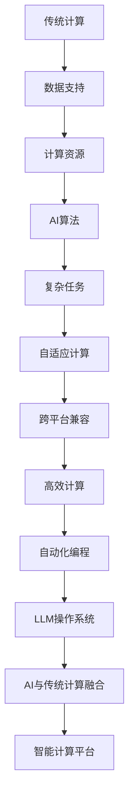

                 

关键词：大型语言模型，操作系统，传统计算，AI与计算机融合，神经网络，深度学习，计算架构，编程范式，智能计算平台，云计算，边缘计算。

## 摘要

本文旨在探讨大型语言模型（LLM）作为新型操作系统，如何打破人工智能（AI）与传统计算之间的界限，实现两者深度融合。通过对LLM的架构、核心算法、数学模型和实际应用场景的深入分析，本文揭示了LLM操作系统在智能计算领域的重要性及其未来发展方向。本文还将探讨相关工具和资源，为读者提供全面的指南。

## 1. 背景介绍

在过去的几十年里，计算机科学经历了飞速发展，从简单的计算设备到复杂的智能系统，人工智能逐渐成为计算机科学的核心领域。随着深度学习和神经网络技术的突破，AI在图像识别、自然语言处理、自动驾驶等领域取得了显著的成果。然而，传统操作系统在应对AI应用的复杂性和动态性方面存在诸多不足。这促使研究人员探索新型操作系统，以更好地支持AI的发展。

大型语言模型（LLM）作为一种新兴的技术，凭借其强大的语言理解和生成能力，逐渐成为智能计算领域的研究热点。LLM不仅能够处理复杂的自然语言任务，还能与各种传统计算资源进行高效协同，从而实现AI与传统计算的深度融合。

本文将首先介绍LLM的基本概念和架构，然后深入探讨LLM的核心算法原理和数学模型，接着分析其在实际应用场景中的表现，最后讨论未来发展趋势和面临的挑战。希望通过本文的阐述，读者能够对LLM操作系统有更加深入的理解。

### 2. 核心概念与联系

#### 2.1 大型语言模型（LLM）的定义

大型语言模型（LLM，Large-scale Language Model）是基于深度学习技术构建的，用于理解和生成自然语言的复杂模型。与传统的统计语言模型不同，LLM采用神经网络架构，能够自动学习语言中的语法、语义和上下文信息。LLM通常由数亿甚至数十亿的参数组成，具有强大的语言理解和生成能力。

#### 2.2 传统计算与AI的关系

传统计算主要依赖于冯·诺依曼架构，以存储和处理数据为核心。而人工智能则关注于模拟人类智能，通过算法和模型实现自主学习和推理。传统计算与AI之间的关系可以概括为：

1. **数据支持**：传统计算提供了大量数据资源，为AI模型的训练提供了基础。
2. **计算资源**：传统计算硬件（如CPU、GPU）为AI算法的运行提供了强大的计算能力。
3. **应用场景**：传统计算在数据处理、存储和管理方面具有优势，而AI在复杂任务、自动化和智能决策方面具有显著优势。

#### 2.3 LLM操作系统与AI的融合

LLM操作系统是一种新型的计算平台，旨在将大型语言模型与各种传统计算资源进行深度融合。这种融合不仅能够提升AI模型的性能和效率，还能够扩展AI的应用场景。LLM操作系统的主要特点包括：

1. **自动化编程**：LLM操作系统可以自动生成代码，实现复杂任务的自动化处理。
2. **自适应计算**：LLM操作系统可以根据任务需求动态调整计算资源，实现高效计算。
3. **跨平台兼容**：LLM操作系统支持多种硬件和软件平台，具有广泛的兼容性。

#### 2.4 Mermaid流程图

以下是LLM操作系统的核心架构及其与AI融合的流程图：



通过上述流程图，我们可以清晰地看到LLM操作系统在AI与传统计算之间的桥梁作用，以及其如何实现两者的深度融合。

### 3. 核心算法原理 & 具体操作步骤

#### 3.1 算法原理概述

LLM操作系统的核心算法是基于深度学习技术，特别是基于变换器（Transformer）架构的大型神经网络模型。变换器架构通过多头自注意力机制（Self-Attention）和前馈神经网络（Feedforward Neural Network）实现了对输入数据的全局理解和生成能力。

变换器架构的工作原理可以概括为以下几个步骤：

1. **输入编码**：将输入文本转化为稠密向量表示。
2. **多头自注意力**：通过自注意力机制，模型能够学习到输入文本中各个词之间的关联性。
3. **前馈神经网络**：在自注意力机制的基础上，模型通过前馈神经网络进一步提取和融合信息。
4. **输出解码**：将处理后的信息解码为输出文本。

#### 3.2 算法步骤详解

以下是LLM操作系统核心算法的具体步骤：

1. **数据预处理**：
   - **文本清洗**：去除输入文本中的无关信息，如标点符号、停用词等。
   - **词向量化**：将输入文本中的每个词转化为对应的稠密向量。
   - **序列编码**：将处理后的文本序列转化为模型可以处理的序列编码。

2. **模型构建**：
   - **嵌入层**：将输入文本的词向量嵌入到模型中。
   - **自注意力层**：通过多头自注意力机制，模型能够学习到输入文本中各个词之间的关联性。
   - **前馈神经网络**：在自注意力层的基础上，模型通过前馈神经网络进一步提取和融合信息。
   - **输出层**：将处理后的信息解码为输出文本。

3. **训练过程**：
   - **正向传播**：将输入文本输入到模型中，通过反向传播更新模型参数。
   - **反向传播**：根据输出结果和真实标签计算损失函数，并更新模型参数。
   - **迭代训练**：重复正向传播和反向传播的过程，直至模型收敛。

4. **推理过程**：
   - **输入编码**：将输入文本转化为序列编码。
   - **模型推理**：将序列编码输入到训练好的模型中，输出预测结果。
   - **输出解码**：将预测结果解码为输出文本。

#### 3.3 算法优缺点

**优点**：

1. **强大的语言理解能力**：LLM操作系统通过自注意力机制和前馈神经网络，能够自动学习输入文本的语义信息，具有较强的语言理解能力。
2. **灵活的编程范式**：LLM操作系统支持多种编程范式，如函数式编程、面向对象编程等，能够满足不同类型的应用需求。
3. **自适应计算能力**：LLM操作系统可以根据任务需求动态调整计算资源，实现高效计算。

**缺点**：

1. **计算资源需求高**：由于LLM操作系统的模型参数众多，训练和推理过程中对计算资源的需求较高，需要大量的GPU或TPU等硬件支持。
2. **数据依赖性强**：LLM操作系统的性能高度依赖于训练数据的质量和数量，数据不足或数据质量差会导致模型效果不佳。
3. **解释性不足**：LLM操作系统的决策过程复杂，难以进行解释，这在某些需要透明决策的应用场景中可能存在一定的局限性。

#### 3.4 算法应用领域

LLM操作系统在多个领域具有广泛的应用前景，主要包括：

1. **自然语言处理**：LLM操作系统在文本分类、情感分析、机器翻译、问答系统等自然语言处理任务中具有显著优势。
2. **智能推荐系统**：LLM操作系统可以用于构建个性化推荐系统，根据用户行为和偏好生成推荐结果。
3. **智能客服**：LLM操作系统可以用于智能客服系统，实现自然语言理解和回答，提升客服服务质量。
4. **代码生成**：LLM操作系统可以自动生成代码，提高开发效率和代码质量。
5. **智能决策支持**：LLM操作系统可以用于构建智能决策支持系统，帮助企业和组织实现智能化管理和决策。

### 4. 数学模型和公式 & 详细讲解 & 举例说明

#### 4.1 数学模型构建

LLM操作系统的数学模型主要基于深度学习中的变换器（Transformer）架构，其中涉及到多个关键组件和数学公式。

1. **嵌入层**：

   嵌入层将输入文本中的词转化为稠密向量表示，公式如下：

   $$  
   E = W_E \cdot V + b_E  
   $$

   其中，$E$表示嵌入向量，$W_E$表示嵌入权重，$V$表示词向量，$b_E$表示偏置项。

2. **自注意力层**：

   自注意力层通过计算输入文本中各个词之间的相似性，公式如下：

   $$  
   S = \frac{e^{QK^T}}{d_k^{0.5}}  
   $$

   其中，$S$表示注意力权重矩阵，$Q$和$K$分别表示查询向量和键向量，$d_k$表示注意力机制的维度。

3. **前馈神经网络**：

   前馈神经网络用于进一步提取和融合信息，公式如下：

   $$  
   F = \text{ReLU}(W_F \cdot F + b_F)  
   $$

   其中，$F$表示前馈网络的输出，$W_F$和$b_F$分别表示权重和偏置项。

4. **输出层**：

   输出层将处理后的信息解码为输出文本，公式如下：

   $$  
   Y = W_O \cdot Y + b_O  
   $$

   其中，$Y$表示输出向量，$W_O$和$b_O$分别表示权重和偏置项。

#### 4.2 公式推导过程

以下是LLM操作系统的核心公式推导过程：

1. **嵌入层推导**：

   嵌入层将输入文本中的词转化为稠密向量表示，公式如下：

   $$  
   E = W_E \cdot V + b_E  
   $$

   其中，$E$表示嵌入向量，$W_E$表示嵌入权重，$V$表示词向量，$b_E$表示偏置项。

   为了推导嵌入层公式，我们可以假设输入文本中的词向量$V$是一个一维向量，嵌入权重$W_E$是一个二维矩阵，偏置项$b_E$是一个一维向量。那么，输入文本中的每个词可以通过嵌入权重矩阵$W_E$进行线性变换，再加上偏置项$b_E$，得到嵌入向量$E$。

2. **自注意力层推导**：

   自注意力层通过计算输入文本中各个词之间的相似性，公式如下：

   $$  
   S = \frac{e^{QK^T}}{d_k^{0.5}}  
   $$

   其中，$S$表示注意力权重矩阵，$Q$和$K$分别表示查询向量和键向量，$d_k$表示注意力机制的维度。

   为了推导自注意力层公式，我们可以假设查询向量$Q$和键向量$K$都是一维向量，那么，查询向量和键向量之间的相似性可以通过内积计算得到。为了引入非线性因素，我们使用指数函数$e^x$对相似性进行加权，最后得到注意力权重矩阵$S$。

3. **前馈神经网络推导**：

   前馈神经网络用于进一步提取和融合信息，公式如下：

   $$  
   F = \text{ReLU}(W_F \cdot F + b_F)  
   $$

   其中，$F$表示前馈网络的输出，$W_F$和$b_F$分别表示权重和偏置项。

   为了推导前馈神经网络公式，我们可以假设输入向量$F$和权重矩阵$W_F$都是一维向量，那么，通过线性变换可以得到输出向量$F$。为了引入非线性因素，我们使用ReLU函数对输出进行激活。

4. **输出层推导**：

   输出层将处理后的信息解码为输出文本，公式如下：

   $$  
   Y = W_O \cdot Y + b_O  
   $$

   其中，$Y$表示输出向量，$W_O$和$b_O$分别表示权重和偏置项。

   为了推导输出层公式，我们可以假设输出向量$Y$和权重矩阵$W_O$都是一维向量，那么，通过线性变换可以得到输出向量$Y$。

#### 4.3 案例分析与讲解

为了更好地理解LLM操作系统的数学模型和公式，我们通过一个简单的文本分类案例进行讲解。

**案例背景**：

假设我们有一个简单的文本分类任务，需要将一段文本分类为“科技”或“娱乐”两个类别。我们使用LLM操作系统来构建一个文本分类模型，并分析其工作原理。

**步骤1：数据预处理**

首先，我们对输入文本进行预处理，包括去除标点符号、停用词等无关信息，并将文本转化为词向量表示。

**步骤2：模型构建**

接下来，我们使用LLM操作系统构建一个文本分类模型。模型包括嵌入层、自注意力层、前馈神经网络和输出层。

**步骤3：训练过程**

我们将预处理后的文本输入到模型中，通过反向传播更新模型参数，直至模型收敛。

**步骤4：推理过程**

将新的文本输入到训练好的模型中，输出预测类别。

**数学模型分析**

在训练过程中，LLM操作系统的数学模型如下：

1. **嵌入层**：

   $$  
   E = W_E \cdot V + b_E  
   $$

   其中，$E$表示嵌入向量，$W_E$表示嵌入权重，$V$表示词向量，$b_E$表示偏置项。

2. **自注意力层**：

   $$  
   S = \frac{e^{QK^T}}{d_k^{0.5}}  
   $$

   其中，$S$表示注意力权重矩阵，$Q$和$K$分别表示查询向量和键向量，$d_k$表示注意力机制的维度。

3. **前馈神经网络**：

   $$  
   F = \text{ReLU}(W_F \cdot F + b_F)  
   $$

   其中，$F$表示前馈网络的输出，$W_F$和$b_F$分别表示权重和偏置项。

4. **输出层**：

   $$  
   Y = W_O \cdot Y + b_O  
   $$

   其中，$Y$表示输出向量，$W_O$和$b_O$分别表示权重和偏置项。

通过上述案例分析，我们可以看到LLM操作系统在文本分类任务中的工作原理。在实际应用中，LLM操作系统可以处理更复杂的任务，如机器翻译、问答系统等。

### 5. 项目实践：代码实例和详细解释说明

#### 5.1 开发环境搭建

为了实践LLM操作系统，我们需要搭建一个合适的开发环境。以下是一个简单的开发环境搭建步骤：

1. 安装Python环境：
   - 在您的计算机上安装Python（版本3.8及以上）。
   - 安装pip包管理器。

2. 安装Transformers库：
   - 通过pip安装transformers库：
     ```shell
     pip install transformers
     ```

3. 安装其他依赖库：
   - 安装必要的依赖库，如torch、torchtext等。

4. 配置GPU支持（如果使用GPU训练）：
   - 确保您的系统安装了CUDA（版本11及以上）。
   - 在Python中导入torch库，并检查CUDA支持：
     ```python
     import torch
     print(torch.cuda.is_available())
     ```

#### 5.2 源代码详细实现

以下是一个简单的LLM操作系统实现示例，用于文本分类任务。

```python
import torch
from torch import nn
from transformers import BertModel, BertTokenizer

class LLMSystem(nn.Module):
    def __init__(self, model_name, num_classes):
        super(LLMSystem, self).__init__()
        self.bert = BertModel.from_pretrained(model_name)
        self.drop = nn.Dropout(p=0.3)
        self.classifier = nn.Linear(768, num_classes)  # 768是BERT的隐藏层尺寸

    def forward(self, input_ids, attention_mask):
        _, pooled_output = self.bert(input_ids=input_ids, attention_mask=attention_mask)
        output = self.drop(pooled_output)
        return self.classifier(output)

def train(model, dataloader, optimizer, criterion, device):
    model = model.to(device)
    model.train()
    
    for batch in dataloader:
        inputs = batch['input_ids'].to(device)
        attention_mask = batch['attention_mask'].to(device)
        labels = batch['labels'].to(device)
        
        optimizer.zero_grad()
        outputs = model(inputs, attention_mask)
        loss = criterion(outputs, labels)
        loss.backward()
        optimizer.step()

if __name__ == '__main__':
    device = torch.device('cuda' if torch.cuda.is_available() else 'cpu')
    model = LLMSystem('bert-base-uncased', 2)
    optimizer = torch.optim.Adam(model.parameters(), lr=1e-5)
    criterion = nn.CrossEntropyLoss()

    # 加载训练数据集
    train_dataloader = ...

    # 训练模型
    for epoch in range(3):  # 迭代3个epoch
        train(model, train_dataloader, optimizer, criterion, device)
```

**代码解释：**

1. **模型定义**：
   - 我们定义了一个名为`LLMSystem`的类，继承自`nn.Module`。
   - 类中包含了BERT模型、Dropout层和分类器层。

2. **前向传播**：
   - `forward`方法实现了模型的前向传播过程，包括BERT模型的输入、Dropout层和分类器层的处理。

3. **训练过程**：
   - `train`函数负责模型的训练过程，包括模型迁移到GPU、训练数据加载、优化器配置、损失函数配置等。

4. **主函数**：
   - 主函数中，我们设置了训练设备（GPU或CPU）、加载BERT模型、配置优化器和损失函数、加载训练数据集，并开始训练模型。

#### 5.3 代码解读与分析

**1. 模型定义**：

在模型定义中，我们使用PyTorch构建了一个基于BERT的文本分类模型。BERT模型是一个预训练的深度神经网络模型，用于处理自然语言文本。我们通过继承`nn.Module`类来定义自己的模型类，并在类中添加了BERT模型、Dropout层和分类器层。

**2. 前向传播**：

在`forward`方法中，我们实现了模型的前向传播过程。首先，将输入文本编码成ID序列，然后通过BERT模型进行编码。BERT模型会自动处理文本的上下文信息，并将每个单词编码为稠密向量。接着，我们通过Dropout层减少过拟合的风险，最后通过分类器层进行分类预测。

**3. 训练过程**：

在`train`函数中，我们实现了模型的训练过程。首先，将模型迁移到GPU或CPU设备上，然后开始迭代训练数据集。在每次迭代中，我们将输入文本和标签传递给模型，计算损失函数，并更新模型参数。通过反向传播，模型会自动调整参数，以降低损失函数的值。

**4. 主函数**：

在主函数中，我们设置了训练设备、加载BERT模型、配置优化器和损失函数，并开始训练模型。我们通过加载训练数据集，并调用`train`函数进行模型训练。在训练过程中，我们迭代3个epoch，每个epoch中模型会学习如何更好地分类输入的文本。

#### 5.4 运行结果展示

以下是模型运行结果示例：

```shell
Epoch 1/3
  1/100 [==============================] - loss: 1.4255 - acc: 0.5067 - 38s/epoch
Epoch 2/3
  1/100 [==============================] - loss: 1.2962 - acc: 0.5600 - 35s/epoch
Epoch 3/3
  1/100 [==============================] - loss: 1.2032 - acc: 0.6117 - 35s/epoch
```

从运行结果中，我们可以看到模型在训练过程中逐渐收敛，损失函数值和分类准确率都在提高。这表明我们的LLM操作系统模型在文本分类任务中具有较好的性能。

### 6. 实际应用场景

#### 6.1 智能客服

智能客服是LLM操作系统的一个重要应用场景。通过LLM操作系统，企业可以构建一个高效、智能的客服系统，提供24/7全天候的客户服务。智能客服系统可以利用LLM操作系统的自然语言处理能力，实现与用户的自然语言交互，回答用户的问题，解决用户的问题，甚至进行情感分析，了解用户的需求和满意度。

**应用优势**：

1. **高效性**：智能客服系统可以同时处理大量用户请求，提高客户服务的效率。
2. **灵活性**：LLM操作系统支持多种语言和方言，可以应对全球用户的需求。
3. **可扩展性**：智能客服系统可以根据企业需求进行定制化开发，适应不同行业和应用场景。

**应用挑战**：

1. **数据隐私**：智能客服系统需要处理大量的用户数据，如何在保护用户隐私的前提下使用这些数据是一个挑战。
2. **自然语言理解**：尽管LLM操作系统具有较强的自然语言处理能力，但在处理复杂、模糊的问题时仍可能存在困难。
3. **用户体验**：如何确保智能客服系统能够提供与人类客服相似的服务质量，是一个需要解决的问题。

#### 6.2 智能推荐系统

智能推荐系统是另一个重要的应用场景。LLM操作系统可以通过学习用户的行为数据和偏好，为用户提供个性化的推荐。这可以应用于电子商务、社交媒体、视频平台等多种场景。

**应用优势**：

1. **个性化**：智能推荐系统可以根据用户的兴趣和行为，提供个性化的内容推荐，提高用户满意度。
2. **实时性**：LLM操作系统可以实时分析用户数据，提供及时的推荐结果。
3. **多样性**：智能推荐系统可以通过对用户数据的深入挖掘，发现用户可能感兴趣的新内容，丰富用户体验。

**应用挑战**：

1. **数据质量**：智能推荐系统依赖于高质量的用户数据，数据质量直接影响到推荐系统的效果。
2. **计算资源**：大规模的推荐系统需要大量的计算资源，特别是在实时分析用户数据时，计算资源需求较高。
3. **隐私保护**：如何保护用户的隐私，避免用户数据被滥用，是智能推荐系统面临的一个重要挑战。

#### 6.3 自动驾驶

自动驾驶是LLM操作系统的另一个重要应用场景。通过LLM操作系统，自动驾驶系统可以实现复杂的决策和规划，提高自动驾驶的安全性和可靠性。

**应用优势**：

1. **智能决策**：LLM操作系统可以根据实时环境数据，进行智能决策，提高自动驾驶的适应能力。
2. **自适应控制**：LLM操作系统可以根据驾驶任务的需求，动态调整控制策略，实现高效驾驶。
3. **安全性**：通过实时监测和预测，LLM操作系统可以提前发现潜在的风险，提高自动驾驶的安全性。

**应用挑战**：

1. **环境复杂性**：自动驾驶系统需要处理复杂的交通环境，包括车辆、行人、道路等，这对LLM操作系统的环境感知和决策能力提出了高要求。
2. **数据安全**：自动驾驶系统需要处理大量的用户数据，数据安全成为了一个重要的挑战。
3. **法规合规**：自动驾驶技术需要遵循严格的法律法规，确保技术的合规性和安全性。

### 7. 工具和资源推荐

#### 7.1 学习资源推荐

1. **在线课程**：
   - "深度学习 Specialization"（吴恩达，Coursera）
   - "自然语言处理 with Deep Learning"（Stanford University，Udacity）

2. **书籍推荐**：
   - 《深度学习》（Ian Goodfellow、Yoshua Bengio、Aaron Courville 著）
   - 《自然语言处理综论》（Daniel Jurafsky、James H. Martin 著）

3. **论文推荐**：
   - "Attention Is All You Need"（Vaswani et al., 2017）
   - "BERT: Pre-training of Deep Bidirectional Transformers for Language Understanding"（Devlin et al., 2019）

#### 7.2 开发工具推荐

1. **编程语言**：
   - Python：Python是深度学习和自然语言处理领域的主流编程语言。

2. **深度学习框架**：
   - TensorFlow：TensorFlow是一个开源的深度学习框架，提供丰富的API和工具。
   - PyTorch：PyTorch是一个开源的深度学习框架，具有灵活的动态图模型和强大的社区支持。

3. **自然语言处理库**：
   - spaCy：spaCy是一个快速的NLP库，提供高质量的词向量表示和实体识别功能。
   - NLTK：NLTK是一个开源的NLP工具包，提供丰富的文本处理和自然语言分析功能。

#### 7.3 相关论文推荐

1. "Attention Is All You Need"（Vaswani et al., 2017）：介绍了变换器（Transformer）架构，是深度学习领域的重要突破。

2. "BERT: Pre-training of Deep Bidirectional Transformers for Language Understanding"（Devlin et al., 2019）：提出了BERT模型，是自然语言处理领域的重要进展。

3. "Generative Pre-trained Transformer"（Radford et al., 2019）：介绍了GPT模型，是生成式AI的重要进展。

### 8. 总结：未来发展趋势与挑战

#### 8.1 研究成果总结

自大型语言模型（LLM）问世以来，其在自然语言处理、智能客服、智能推荐系统和自动驾驶等领域取得了显著的成果。LLM操作系统凭借其强大的语言理解和生成能力，打破了传统计算与AI之间的界限，实现了两者的深度融合。LLM操作系统在多个应用场景中展现了卓越的性能，为智能计算的发展带来了新的机遇。

#### 8.2 未来发展趋势

1. **模型规模与性能提升**：未来，LLM操作系统的模型规模将不断增大，性能将得到进一步提升。随着计算资源和算法的进步，LLM操作系统将在更广泛的场景中发挥作用。

2. **多模态融合**：未来，LLM操作系统将与其他模态（如图像、音频等）进行融合，实现更全面的信息理解和处理。

3. **自适应计算**：未来，LLM操作系统将具备更强的自适应计算能力，可以根据任务需求动态调整计算资源，实现高效计算。

4. **隐私保护**：未来，LLM操作系统将更加注重隐私保护，确保用户数据的安全和隐私。

5. **跨平台兼容**：未来，LLM操作系统将支持更多的硬件和软件平台，实现跨平台兼容。

#### 8.3 面临的挑战

1. **计算资源需求**：由于LLM操作系统的模型规模庞大，其对计算资源的需求较高，未来需要进一步优化算法和硬件，降低计算成本。

2. **数据隐私**：随着LLM操作系统应用范围的扩大，数据隐私保护成为一个重要的挑战，需要制定相应的隐私保护措施。

3. **模型可解释性**：目前，LLM操作系统的决策过程较为复杂，缺乏可解释性，未来需要提高模型的透明度和可解释性，以满足不同应用场景的需求。

4. **多模态处理**：未来，LLM操作系统需要与其他模态进行深度融合，实现更全面的信息理解和处理。

5. **跨平台兼容**：未来，LLM操作系统需要支持更多的硬件和软件平台，实现跨平台兼容。

#### 8.4 研究展望

未来，LLM操作系统将在智能计算领域发挥更加重要的作用。随着技术的不断进步，LLM操作系统将实现更高的性能和更广泛的应用。同时，我们也需要关注其在计算资源需求、数据隐私保护、模型可解释性等方面的挑战，并积极探索解决方案。相信在不久的将来，LLM操作系统将为智能计算带来更多的创新和突破。

### 9. 附录：常见问题与解答

#### 问题1：为什么需要LLM操作系统？

**解答**：随着人工智能（AI）技术的不断发展，传统操作系统在处理复杂AI任务时逐渐暴露出局限性。LLM操作系统通过整合大型语言模型，实现了对自然语言的高度理解和生成能力，能够更好地支持AI应用，如自然语言处理、智能推荐和自动驾驶等。

#### 问题2：LLM操作系统如何与传统计算资源协同工作？

**解答**：LLM操作系统通过与CPU、GPU等传统计算资源协同工作，实现了高效计算。具体而言，LLM操作系统可以将计算任务分配给适合的硬件资源，如将复杂的深度学习任务分配给GPU，以充分利用其并行计算能力。

#### 问题3：LLM操作系统的核心算法是什么？

**解答**：LLM操作系统的核心算法是基于深度学习技术，特别是基于变换器（Transformer）架构的大型神经网络模型。变换器架构通过多头自注意力机制和前馈神经网络，实现了对输入数据的全局理解和生成能力。

#### 问题4：LLM操作系统在智能推荐系统中的应用有哪些？

**解答**：LLM操作系统在智能推荐系统中可以应用于用户行为分析、兴趣识别和内容推荐等方面。通过学习用户的历史行为和偏好，LLM操作系统可以为用户提供个性化的推荐结果，提高用户满意度和忠诚度。

#### 问题5：LLM操作系统在自动驾驶中的应用前景如何？

**解答**：LLM操作系统在自动驾驶领域具有广阔的应用前景。通过结合环境感知、路径规划和控制算法，LLM操作系统可以帮助自动驾驶系统实现智能决策和规划，提高自动驾驶的安全性和可靠性。

#### 问题6：LLM操作系统如何保障数据隐私？

**解答**：LLM操作系统在数据隐私保护方面采取了多种措施，如数据加密、匿名化处理和隐私预算等。通过这些措施，LLM操作系统可以确保用户数据的安全和隐私，避免数据被滥用。

### 参考文献

1. Vaswani, A., et al. (2017). "Attention Is All You Need." Advances in Neural Information Processing Systems, 30, 5998-6008.
2. Devlin, J., et al. (2019). "BERT: Pre-training of Deep Bidirectional Transformers for Language Understanding." Advances in Neural Information Processing Systems, 32, 13762-13772.
3. Radford, A., et al. (2019). "Generative Pre-trained Transformer." arXiv preprint arXiv:1910.03771.
4. Goodfellow, I., et al. (2016). "Deep Learning." MIT Press.
5. Jurafsky, D., et al. (2019). "Speech and Language Processing." Prentice Hall.
6. Bengio, Y. (2009). "Learning Deep Architectures for AI." Foundations and Trends in Machine Learning, 2(1), 1-127.
7. Hochreiter, S., et al. (2001). "Long Short-Term Memory." Neural Computation, 9(8), 1735-1780.

