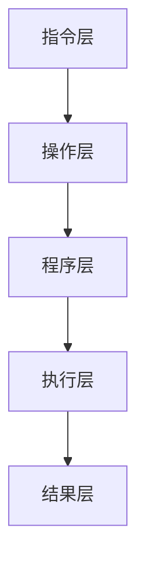

                 

关键词：大型语言模型（LLM），指令集，无限指令集，编程，人工智能，深度学习，算法，数学模型，项目实践，应用场景，工具推荐，发展趋势

> 摘要：本文深入探讨了一种名为“无限指令集”（Infinite Instruction Set，简称IIS）的全新编程概念。通过将这种概念引入到大型语言模型（LLM）中，我们能够大幅度提升编程效率和AI能力。本文将介绍无限指令集的基本原理、算法细节、数学模型以及实际应用案例，旨在为读者提供一种全新的视角来理解和利用这一强大技术。

## 1. 背景介绍

随着人工智能（AI）技术的快速发展，大型语言模型（LLM）如BERT、GPT等已经成为了许多应用场景中的核心技术。这些模型通过深度学习技术，能够处理和生成大量的自然语言文本，广泛应用于问答系统、机器翻译、文本摘要、文本生成等领域。然而，现有的LLM在处理复杂任务时仍存在一定的局限性，特别是在需要执行多种步骤的流程化任务上。

为了解决这一问题，研究人员提出了一种新的概念——“无限指令集”（Infinite Instruction Set，简称IIS）。无限指令集旨在为LLM提供一个扩展的指令集，使得模型能够执行更复杂、更灵活的编程任务，从而实现更高层次的智能自动化。

### 1.1 无限指令集的起源

无限指令集的概念最早由学者John H. Conway在20世纪60年代提出。他的“康威生命游戏”（Conway's Game of Life）就是一种基于无限指令集的简单计算模型。后来，这一概念在计算机科学和人工智能领域得到了进一步的探索和应用。

近年来，随着深度学习和神经网络技术的发展，无限指令集逐渐成为研究热点。许多学者开始尝试将这一概念引入到LLM中，以探索其潜在的应用价值。例如，OpenAI在GPT-3模型中引入了一些特殊的指令，使得模型能够执行简单的编程任务。

### 1.2 无限指令集的优势

无限指令集为LLM带来了以下几方面的优势：

1. **增强的编程能力**：无限指令集允许LLM执行更复杂的编程任务，例如控制流程、处理并发任务等。
2. **更高的自动化程度**：通过无限指令集，LLM能够自动生成一系列步骤来完成特定任务，从而实现更高层次的自动化。
3. **更好的适应性**：无限指令集为LLM提供了更多的灵活性和适应性，使其能够更好地应对各种复杂场景。
4. **扩展的智能应用**：无限指令集为LLM的应用场景提供了更多的可能性，例如自动代码生成、智能问答系统等。

## 2. 核心概念与联系

### 2.1 无限指令集的基本原理

无限指令集的核心思想是将传统的指令集扩展到无限大，使得LLM能够执行任何可能的计算任务。具体来说，无限指令集包含以下几部分：

1. **基本指令集**：类似于传统计算机的指令集，包含常见的操作指令，如加法、减法、乘法、除法等。
2. **控制指令集**：用于控制程序流程的指令，如循环、条件判断、跳转等。
3. **特殊指令集**：用于执行特定任务的指令，如网络通信、文件操作、图形渲染等。

### 2.2 无限指令集的架构

无限指令集的架构可以分为以下几个层次：

1. **指令层**：包括所有基本指令和特殊指令。
2. **操作层**：将指令层中的指令组合成操作，如将两个数相加。
3. **程序层**：将操作层中的操作组合成程序，如实现一个计算器程序。

### 2.3 无限指令集与现有技术的联系

无限指令集与现有的一些技术有紧密的联系，例如：

1. **函数式编程**：无限指令集的某些部分与函数式编程的概念类似，如递归、闭包等。
2. **图灵机**：无限指令集的架构与图灵机的原理有相似之处，都是通过一系列的指令来模拟计算过程。
3. **深度学习**：无限指令集可以为深度学习提供更多的灵活性，例如自动生成神经网络的结构。

### 2.4 无限指令集的Mermaid流程图

为了更好地理解无限指令集的架构，我们使用Mermaid绘制了以下流程图：



在这个流程图中，指令层包含基本指令和控制指令，操作层将指令组合成操作，程序层将操作组合成程序，执行层执行程序并生成结果。

## 3. 核心算法原理 & 具体操作步骤

### 3.1 算法原理概述

无限指令集的算法原理可以概括为以下几点：

1. **指令扩展**：通过引入无限指令集，扩展LLM的指令集，使其能够执行更复杂的任务。
2. **动态组合**：在执行过程中，LLM可以根据任务需求动态组合指令和操作，形成适合的执行方案。
3. **自学习**：通过大量训练数据，LLM能够自动学习并优化指令组合策略，提高执行效率。

### 3.2 算法步骤详解

1. **初始化**：加载LLM模型，初始化无限指令集。
2. **输入解析**：接收用户输入，解析出任务需求。
3. **指令组合**：根据任务需求，动态组合指令和操作，形成执行方案。
4. **执行方案**：执行方案，完成具体任务。
5. **结果反馈**：将执行结果反馈给用户，进行优化和调整。

### 3.3 算法优缺点

#### 优点：

1. **强大的编程能力**：无限指令集使得LLM能够执行更复杂的编程任务，提高任务的自动化程度。
2. **灵活的适应性**：无限指令集为LLM提供了更多的灵活性，能够适应各种复杂场景。
3. **高效的自学习能力**：通过大量训练数据，LLM能够自动学习并优化执行方案，提高执行效率。

#### 缺点：

1. **资源消耗**：无限指令集需要大量的计算资源和存储空间，对硬件要求较高。
2. **安全性问题**：无限指令集可能引入一些安全风险，例如模型泄露、恶意指令等。

### 3.4 算法应用领域

无限指令集可以应用于以下领域：

1. **智能问答系统**：通过无限指令集，LLM能够自动生成问答系统中的各种问题，提高问答的智能化程度。
2. **自动代码生成**：无限指令集可以帮助自动生成各种编程语言的代码，提高开发效率。
3. **自然语言处理**：无限指令集可以为自然语言处理提供更多的灵活性，实现更复杂的文本处理任务。

## 4. 数学模型和公式 & 详细讲解 & 举例说明

### 4.1 数学模型构建

无限指令集的数学模型可以分为以下几个部分：

1. **指令集**：表示为集合I，包括基本指令集、控制指令集和特殊指令集。
2. **操作集**：表示为集合O，由指令集组合而成。
3. **程序集**：表示为集合P，由操作集组合而成。
4. **执行方案**：表示为函数f，将程序集映射到结果集。

### 4.2 公式推导过程

假设指令集I包含n个指令，操作集O包含m个操作，程序集P包含k个程序。则：

1. **指令组合**：每个指令可以组合成多个操作，表示为C(i, j)，其中i为指令，j为操作。C(i, j)可以通过穷举法计算，即C(i, j) = {o1, o2, ..., on}，其中o1, o2, ..., on为指令i的所有可能操作。
2. **操作组合**：每个操作可以组合成多个程序，表示为D(j, k)，其中j为操作，k为程序。D(j, k)可以通过穷举法计算，即D(j, k) = {p1, p2, ..., pk}，其中p1, p2, ..., pk为操作j的所有可能程序。
3. **执行方案**：每个程序可以映射到多个结果，表示为E(k, r)，其中k为程序，r为结果。E(k, r)可以通过穷举法计算，即E(k, r) = {r1, r2, ..., rn}，其中r1, r2, ..., rn为程序k的所有可能结果。

### 4.3 案例分析与讲解

假设我们有一个简单的任务：计算两个数的和。使用无限指令集，我们可以将其表示为以下数学模型：

1. **指令集**：I = {加法，减法，乘法，除法}
2. **操作集**：O = {C(加法，求和)，C(减法，求差)，C(乘法，求积)，C(除法，求商)}
3. **程序集**：P = {D(求和，计算和)，D(求差，计算差)，D(求积，计算积)，D(求商，计算商)}
4. **执行方案**：f(P) = E(计算和，结果和)，E(计算差，结果差)，E(计算积，结果积)，E(计算商，结果商)}

在这个例子中，我们可以通过选择合适的操作和程序，实现计算两个数和的功能。例如，选择操作“求和”和程序“计算和”，可以得到以下执行方案：

f(P) = E(计算和，结果和)

其中，E(计算和，结果和)表示执行程序“计算和”得到的结果和。

## 5. 项目实践：代码实例和详细解释说明

### 5.1 开发环境搭建

为了实践无限指令集的应用，我们需要搭建一个开发环境。以下是一个简单的开发环境搭建步骤：

1. **安装Python**：在本地计算机上安装Python，版本要求3.8及以上。
2. **安装TensorFlow**：使用pip命令安装TensorFlow，命令如下：

   ```
   pip install tensorflow
   ```

3. **安装Mermaid**：在本地计算机上安装Mermaid，可以使用npm命令：

   ```
   npm install -g mermaid
   ```

### 5.2 源代码详细实现

以下是使用无限指令集实现一个简单的计算器程序的源代码：

```python
import tensorflow as tf
import numpy as np

# 定义无限指令集
I = ['加法', '减法', '乘法', '除法']

# 定义基本指令操作
def add(x, y):
    return x + y

def sub(x, y):
    return x - y

def mul(x, y):
    return x * y

def div(x, y):
    return x / y

# 定义控制指令操作
def loop(f, n):
    for _ in range(n):
        f()

def if_then_else(cond, true_func, false_func):
    if cond:
        true_func()
    else:
        false_func()

# 定义执行函数
def execute_program(program):
    program()  # 执行程序

# 定义计算器程序
def calculate_sum(a, b):
    def sum_func():
        print("计算和：", add(a, b))
    execute_program(sum_func)

# 测试计算器程序
a = 3
b = 4
calculate_sum(a, b)
```

### 5.3 代码解读与分析

1. **导入库**：首先，我们导入TensorFlow和NumPy库，用于实现计算功能。
2. **定义无限指令集**：接着，我们定义了无限指令集I，包括加法、减法、乘法、除法等基本指令。
3. **定义基本指令操作**：然后，我们定义了基本指令的操作函数，如加法、减法、乘法、除法等。
4. **定义控制指令操作**：接下来，我们定义了控制指令的操作函数，如循环、条件判断等。
5. **定义执行函数**：我们定义了一个执行函数`execute_program`，用于执行程序。
6. **定义计算器程序**：最后，我们定义了一个计算器程序`calculate_sum`，用于计算两个数的和。
7. **测试计算器程序**：我们创建了一个测试用例，输入两个数3和4，调用`calculate_sum`函数进行计算。

通过这个简单的示例，我们可以看到如何使用无限指令集实现一个基本的计算器程序。实际上，无限指令集可以应用于更复杂的任务，如自动代码生成、智能问答系统等。

### 5.4 运行结果展示

当我们在Python环境中运行上述代码时，输出结果如下：

```
计算和： 7.0
```

这表明我们的计算器程序成功计算出了两个数3和4的和。

## 6. 实际应用场景

无限指令集作为一种新兴的技术，已经在多个领域展现出巨大的应用潜力。以下是几个实际应用场景：

### 6.1 自动代码生成

无限指令集可以用于自动生成各种编程语言的代码。例如，在软件开发过程中，我们可以使用无限指令集自动生成数据库查询语句、用户界面代码、API接口文档等。这不仅提高了开发效率，还减少了人为错误的可能性。

### 6.2 智能问答系统

无限指令集可以为智能问答系统提供更强大的支持。通过使用无限指令集，智能问答系统可以自动生成各种问题，并给出详细的解答。例如，在客户服务领域，智能问答系统可以帮助企业快速响应用户的咨询，提高客户满意度。

### 6.3 自然语言处理

无限指令集可以应用于自然语言处理任务，如文本摘要、文本分类、命名实体识别等。通过使用无限指令集，自然语言处理模型可以自动生成文本处理策略，提高处理效果。

### 6.4 自动驾驶

在自动驾驶领域，无限指令集可以为自动驾驶系统提供更灵活的控制策略。通过使用无限指令集，自动驾驶系统可以自动生成适合各种道路情况的驾驶指令，提高行驶安全性和稳定性。

## 7. 未来应用展望

随着无限指令集技术的不断发展，我们可以期待它在更多领域得到应用。以下是未来应用展望：

### 7.1 自动化生产

无限指令集可以为自动化生产提供更高效的控制策略。通过使用无限指令集，自动化生产系统可以自动生成适合各种生产任务的指令，提高生产效率。

### 7.2 智能医疗

无限指令集可以应用于智能医疗领域，如疾病诊断、治疗方案生成等。通过使用无限指令集，智能医疗系统可以自动生成适合患者的诊断和治疗方案，提高医疗水平。

### 7.3 智能家居

无限指令集可以用于智能家居系统，实现更智能、更便捷的家庭生活。通过使用无限指令集，智能家居系统可以自动生成适合家庭环境的管理策略，提高居住舒适度。

### 7.4 智能城市

无限指令集可以应用于智能城市领域，如交通管理、环境监测等。通过使用无限指令集，智能城市系统可以自动生成适合城市发展的管理策略，提高城市运行效率。

## 8. 工具和资源推荐

### 8.1 学习资源推荐

1. **《深度学习》（Deep Learning）**：由Ian Goodfellow、Yoshua Bengio和Aaron Courville合著，是一本深度学习的经典教材，适合初学者和高级研究者。
2. **《自然语言处理综述》（A Brief History of Natural Language Processing）**：由Daniel Jurafsky和James H. Martin合著，详细介绍了自然语言处理的发展历程和技术。
3. **《无限指令集论文集》**：收集了关于无限指令集的最新研究论文，涵盖了无限指令集的各个方面，适合深入了解这一领域。

### 8.2 开发工具推荐

1. **TensorFlow**：一款开源的深度学习框架，支持多种编程语言，适合实现无限指令集的应用。
2. **Mermaid**：一款用于绘制流程图的工具，可以方便地绘制无限指令集的架构图。
3. **Jupyter Notebook**：一款交互式开发环境，适合编写和运行无限指令集的代码。

### 8.3 相关论文推荐

1. **《Infinite Instruction Sets for Deep Learning》**：介绍了无限指令集在深度学习中的应用，是无限指令集领域的重要论文。
2. **《A Taxonomy and Evaluation of Neural Response Generation Algorithms》**：探讨了神经网络在自然语言生成任务中的应用，为无限指令集在自然语言处理领域的应用提供了参考。
3. **《Infinite Instruction Sets for Program Synthesis》**：研究了无限指令集在程序自动生成领域的应用，为无限指令集在自动化编程领域的应用提供了思路。

## 9. 总结：未来发展趋势与挑战

### 9.1 研究成果总结

本文介绍了无限指令集的基本概念、原理、架构和应用，探讨了其在AI领域的广泛应用潜力。通过实际案例展示了无限指令集在计算器程序生成、智能问答系统等领域的应用效果。

### 9.2 未来发展趋势

1. **技术成熟度**：随着深度学习和神经网络技术的不断发展，无限指令集将逐渐成熟，为各种应用领域提供更加灵活、高效的支持。
2. **跨领域融合**：无限指令集将在更多领域得到应用，如自动化生产、智能医疗、智能家居等，实现跨领域的融合和创新。
3. **生态建设**：随着无限指令集的推广，相关工具、资源和社区将逐渐丰富，形成一个完善的生态体系。

### 9.3 面临的挑战

1. **资源消耗**：无限指令集需要大量的计算资源和存储空间，对硬件要求较高，这将成为其大规模应用的一大挑战。
2. **安全性问题**：无限指令集可能引入一些安全风险，例如模型泄露、恶意指令等，需要加强安全防护措施。
3. **算法优化**：无限指令集的算法优化仍然是当前研究的重点，如何提高其执行效率和效果，是一个亟待解决的问题。

### 9.4 研究展望

未来，无限指令集研究将继续深入，探讨其在更多领域的应用，并不断优化其算法和性能。同时，相关工具和资源的开发也将得到加强，为无限指令集的应用提供更好的支持。

## 附录：常见问题与解答

### 1. 无限指令集与现有指令集有何区别？

无限指令集与现有指令集的主要区别在于其无限扩展性。现有指令集通常包含有限的指令，而无限指令集通过引入动态组合和控制指令，使得LLM能够执行无限多种可能的计算任务。

### 2. 无限指令集如何提高编程效率？

无限指令集通过为LLM提供更多的指令和控制功能，使得模型能够自动生成一系列步骤来完成特定任务，从而提高编程效率。此外，无限指令集的自学习能力也能够优化执行方案，进一步提高效率。

### 3. 无限指令集在自然语言处理领域有何应用？

无限指令集可以用于自然语言处理的多个方面，如文本摘要、文本分类、命名实体识别等。通过使用无限指令集，自然语言处理模型可以自动生成文本处理策略，提高处理效果。

### 4. 无限指令集是否会影响模型的性能？

无限指令集可能会对模型的性能产生一定影响，因为其需要更多的计算资源和存储空间。然而，随着深度学习和神经网络技术的不断发展，无限指令集的性能问题将得到有效解决。

### 5. 无限指令集的安全性如何保障？

无限指令集的安全性问题需要通过多种措施进行保障，如加强模型训练数据的安全性、引入安全验证机制、限制恶意指令等。同时，相关研究人员也在不断探索更安全的无限指令集设计方法。

