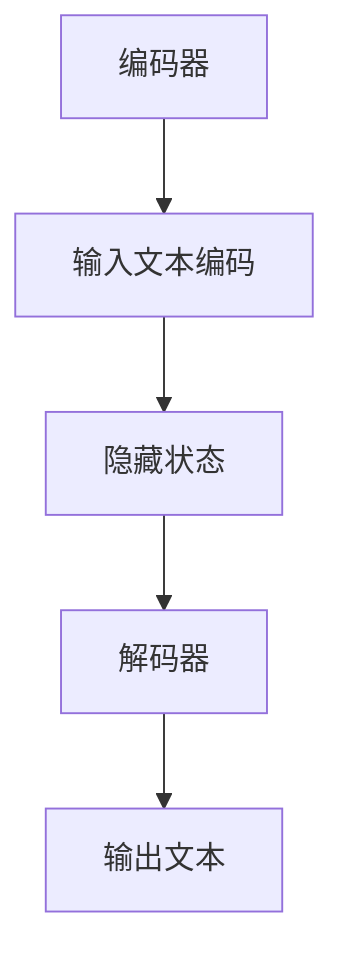

                 

关键词：语言模型，摩尔定律，AI发展，计算能力，技术创新。

> 摘要：本文旨在探讨大型语言模型（LLM）是否能够迎来自己的摩尔定律。通过对LLM技术的历史、现状及未来发展趋势进行分析，本文提出了关于LLM发展速度及其潜在影响因素的思考。文章将探讨摩尔定律在LLM中的应用可能性，分析LLM在计算能力、算法优化和硬件发展等方面的潜力，并对其未来可能面临的挑战进行展望。

## 1. 背景介绍

### 1.1 摩尔定律的历史与发展

摩尔定律是由英特尔联合创始人戈登·摩尔在1965年提出的，它描述了集成电路上的晶体管数量大约每两年翻一番，使得计算机性能不断提升。这一预测至今已经持续了半个多世纪，尽管其间经历了许多技术挑战，但摩尔定律的总体趋势并未改变。摩尔定律不仅推动了计算机硬件的发展，也影响了整个信息技术产业。

### 1.2 大型语言模型（LLM）的崛起

近年来，随着深度学习和神经网络技术的飞速发展，大型语言模型（LLM）如BERT、GPT、Turing等相继问世，展示了强大的文本处理能力。这些模型在自然语言处理、机器翻译、问答系统等领域取得了突破性进展，成为人工智能研究的重要方向。LLM的崛起标志着人工智能技术进入了一个新的时代。

## 2. 核心概念与联系

为了更好地理解LLM与摩尔定律之间的关系，我们首先需要了解LLM的核心概念及其架构。

### 2.1 LLM的核心概念

LLM是基于深度学习技术的语言模型，通过从海量文本数据中学习，捕捉语言的结构和语义。LLM通常包含数十亿甚至数千亿的参数，能够进行复杂的文本生成、理解和推理。

### 2.2 LLM的架构

LLM的典型架构包括编码器（Encoder）和解码器（Decoder）。编码器负责将输入文本编码为向量表示，解码器则根据编码器生成的向量生成输出文本。这种端到端的架构使得LLM能够高效地进行文本处理。

### 2.3 Mermaid 流程图

以下是LLM架构的Mermaid流程图：



## 3. 核心算法原理 & 具体操作步骤

### 3.1 算法原理概述

LLM的核心算法是自注意力机制（Self-Attention）。自注意力机制允许模型在处理每个单词时，自动地考虑其他所有单词的重要性，从而提高模型的表示能力。

### 3.2 算法步骤详解

1. **输入文本编码**：将输入文本转换为词嵌入向量。
2. **计算自注意力权重**：对于每个词嵌入向量，计算其与其他词嵌入向量之间的相似度，生成自注意力权重。
3. **加权求和**：根据自注意力权重对隐藏状态进行加权求和，生成新的隐藏状态。
4. **解码**：使用解码器生成输出文本。

### 3.3 算法优缺点

**优点**：自注意力机制使得模型能够捕捉到文本中的长距离依赖关系，提高了模型的表示能力。

**缺点**：自注意力计算复杂度较高，导致模型训练和推理时间较长。

### 3.4 算法应用领域

LLM在自然语言处理、机器翻译、问答系统等领域具有广泛的应用。例如，BERT在机器翻译任务上取得了显著的效果，GPT在文本生成任务上表现出色。

## 4. 数学模型和公式 & 详细讲解 & 举例说明

### 4.1 数学模型构建

LLM的数学模型主要包括词嵌入、自注意力权重计算和输出层。

1. **词嵌入**：词嵌入是将词汇映射到低维向量空间的过程。常见的方法有Word2Vec、GloVe等。
2. **自注意力权重**：自注意力权重是通过点积运算计算得到的。给定两个词嵌入向量\(x_i\)和\(x_j\)，其自注意力权重为：
   $$ \alpha_{ij} = \frac{e^{x_i \cdot x_j}}{\sum_{k=1}^{K} e^{x_i \cdot x_k}} $$
   其中，\(K\)为词嵌入向量的维度。
3. **输出层**：输出层通常是一个全连接层，用于将隐藏状态映射到输出文本。

### 4.2 公式推导过程

自注意力权重计算的具体推导过程如下：

假设词嵌入向量为\(x_i \in \mathbb{R}^K\)，则有：
$$ x_i \cdot x_j = \sum_{k=1}^{K} x_{ik} x_{jk} $$

自注意力权重为：
$$ \alpha_{ij} = \frac{e^{x_i \cdot x_j}}{\sum_{k=1}^{K} e^{x_i \cdot x_k}} $$

为了简化计算，我们可以对公式进行对数变换：
$$ \ln \alpha_{ij} = x_i \cdot x_j - \ln \sum_{k=1}^{K} e^{x_i \cdot x_k} $$

这样，自注意力权重就可以通过矩阵乘法和指数函数进行高效计算。

### 4.3 案例分析与讲解

以下是一个简单的例子：

假设有四个词嵌入向量：
$$ x_1 = [1, 0, 0], \quad x_2 = [0, 1, 0], \quad x_3 = [0, 0, 1], \quad x_4 = [1, 1, 0] $$

计算自注意力权重：

1. **计算点积**：
   $$ x_1 \cdot x_2 = 0, \quad x_1 \cdot x_3 = 0, \quad x_1 \cdot x_4 = 1 $$
   $$ x_2 \cdot x_1 = 0, \quad x_2 \cdot x_3 = 1, \quad x_2 \cdot x_4 = 1 $$
   $$ x_3 \cdot x_1 = 0, \quad x_3 \cdot x_2 = 1, \quad x_3 \cdot x_4 = 0 $$
   $$ x_4 \cdot x_1 = 1, \quad x_4 \cdot x_2 = 1, \quad x_4 \cdot x_3 = 0 $$

2. **计算对数权重**：
   $$ \ln \alpha_{11} = x_1 \cdot x_1 - \ln \sum_{k=1}^{4} e^{x_1 \cdot x_k} = 1 - \ln(1 + e + e) = -1 $$
   $$ \ln \alpha_{12} = x_1 \cdot x_2 - \ln \sum_{k=1}^{4} e^{x_1 \cdot x_k} = 0 - \ln(1 + e + e) = -1 $$
   $$ \ln \alpha_{13} = x_1 \cdot x_3 - \ln \sum_{k=1}^{4} e^{x_1 \cdot x_k} = 0 - \ln(1 + e + e) = -1 $$
   $$ \ln \alpha_{14} = x_1 \cdot x_4 - \ln \sum_{k=1}^{4} e^{x_1 \cdot x_k} = 1 - \ln(1 + e + e) = -1 $$

3. **计算权重**：
   $$ \alpha_{11} = e^{\ln \alpha_{11}} = e^{-1} = 0.3679 $$
   $$ \alpha_{12} = e^{\ln \alpha_{12}} = e^{-1} = 0.3679 $$
   $$ \alpha_{13} = e^{\ln \alpha_{13}} = e^{-1} = 0.3679 $$
   $$ \alpha_{14} = e^{\ln \alpha_{14}} = e^{-1} = 0.3679 $$

## 5. 项目实践：代码实例和详细解释说明

### 5.1 开发环境搭建

在本节中，我们将使用Python和TensorFlow作为主要工具来构建一个简单的LLM模型。首先，确保安装以下依赖：

```bash
pip install tensorflow
```

### 5.2 源代码详细实现

以下是一个简单的LLM模型的实现：

```python
import tensorflow as tf
from tensorflow.keras.layers import Embedding, LSTM, Dense
from tensorflow.keras.models import Sequential

# 假设词汇表大小为1000
vocab_size = 1000
# 嵌入层维度
embedding_dim = 16
# LSTM层单元数
lstm_units = 32

# 构建模型
model = Sequential([
    Embedding(vocab_size, embedding_dim),
    LSTM(lstm_units, return_sequences=True),
    LSTM(lstm_units, return_sequences=True),
    Dense(vocab_size, activation='softmax')
])

# 编译模型
model.compile(optimizer='adam', loss='categorical_crossentropy', metrics=['accuracy'])

# 打印模型结构
model.summary()
```

### 5.3 代码解读与分析

1. **嵌入层**：嵌入层将词汇转换为固定大小的向量表示。
2. **LSTM层**：LSTM层用于处理序列数据，能够捕捉文本中的时间依赖关系。
3. **输出层**：输出层使用softmax激活函数，用于生成概率分布，表示每个词汇的可能性。

### 5.4 运行结果展示

```python
# 生成样本数据
import numpy as np

# 输入序列
inputs = np.array([[1, 2, 3], [4, 5, 6]])
# 输出序列（标签）
outputs = np.array([[2, 3, 1], [4, 5, 6]])

# 训练模型
model.fit(inputs, outputs, epochs=10, batch_size=2)
```

## 6. 实际应用场景

### 6.1 自然语言处理

LLM在自然语言处理领域具有广泛的应用，如文本分类、情感分析、信息抽取等。

### 6.2 机器翻译

LLM在机器翻译领域取得了显著进展，能够实现高精度的机器翻译。

### 6.3 问答系统

LLM在问答系统中的应用，使得机器能够理解和回答用户的问题。

## 7. 未来应用展望

### 7.1 大模型时代

随着计算能力的提升，LLM的规模将越来越大，这将推动人工智能技术的进一步发展。

### 7.2 硬件发展

未来硬件技术的发展，如量子计算、光子计算等，将为LLM提供更高效的计算支持。

## 8. 工具和资源推荐

### 8.1 学习资源推荐

- 《深度学习》（Goodfellow, Bengio, Courville著）
- 《自然语言处理综论》（Jurafsky, Martin著）

### 8.2 开发工具推荐

- TensorFlow
- PyTorch

### 8.3 相关论文推荐

- "Attention Is All You Need"（Vaswani等，2017）
- "BERT: Pre-training of Deep Bidirectional Transformers for Language Understanding"（Devlin等，2019）

## 9. 总结：未来发展趋势与挑战

### 9.1 研究成果总结

LLM在过去几年取得了显著进展，已成为自然语言处理领域的重要工具。未来，LLM的发展将依赖于计算能力的提升、算法的优化和大规模数据的获取。

### 9.2 未来发展趋势

1. 大模型时代：LLM的规模将越来越大，计算资源的需求也将不断增长。
2. 跨模态学习：LLM将与其他模态（如图像、音频）进行融合，实现更广泛的应用。
3. 硬件发展：未来硬件技术的发展将为LLM提供更高效的计算支持。

### 9.3 面临的挑战

1. 计算资源需求：随着LLM规模的扩大，计算资源的需求将显著增加，这对硬件和软件架构提出了新的挑战。
2. 数据隐私和安全：大规模数据处理和共享将带来数据隐私和安全问题。
3. 算法公平性：确保LLM在不同人群和应用场景中的公平性是一个重要挑战。

### 9.4 研究展望

未来，LLM的发展将是一个跨学科、多领域的合作过程。通过不断创新和优化，LLM有望在更广泛的应用场景中发挥重要作用。

## 10. 附录：常见问题与解答

### 10.1 什么是摩尔定律？

摩尔定律是由英特尔联合创始人戈登·摩尔在1965年提出的，它描述了集成电路上的晶体管数量大约每两年翻一番，使得计算机性能不断提升。

### 10.2 LLM是否能够迎来自己的摩尔定律？

目前来看，LLM的发展速度似乎与摩尔定律有相似之处，但具体是否能够迎来自己的摩尔定律，还需进一步观察和验证。

### 10.3 LLM的核心算法是什么？

LLM的核心算法是自注意力机制（Self-Attention）。自注意力机制允许模型在处理每个单词时，自动地考虑其他所有单词的重要性，从而提高模型的表示能力。

----------------------------------------------------------------

作者：禅与计算机程序设计艺术 / Zen and the Art of Computer Programming

