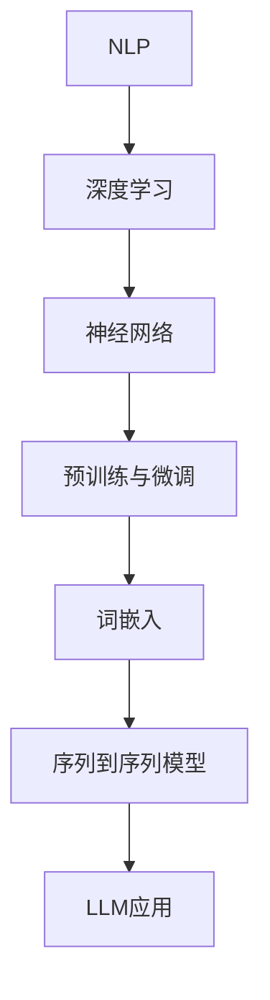

                 

关键词：大型语言模型，自然语言处理，生态系统，架构，算法，数学模型，应用实践，工具推荐

> 摘要：本文深入探讨大型语言模型（LLM）生态系统的发展历程，从零到一的创新实践，以及其在自然语言处理（NLP）领域的广泛应用和未来发展趋势。文章旨在为读者提供一套全面的技术框架，帮助理解和应用LLM在各个行业中的潜力。

## 1. 背景介绍

随着人工智能（AI）技术的飞速发展，自然语言处理（NLP）作为其重要分支，正日益成为一个备受关注的领域。近年来，大型语言模型（LLM）如BERT、GPT、Turing等相继涌现，它们在文本生成、机器翻译、问答系统等任务中展现了强大的能力。LLM的崛起不仅推动了NLP领域的研究和应用，也为整个AI生态系统带来了前所未有的变革。

LLM的出现，不仅标志着NLP技术的重大突破，更催生了庞大的LLM生态系统。这个生态系统包含了硬件、软件、数据、算法等多个组成部分，各个环节相互关联，共同推动LLM的持续发展和创新。本文将围绕LLM生态系统，从核心概念、算法原理、数学模型、项目实践等多个方面展开探讨，旨在为读者呈现一幅完整的LLM生态系统全景图。

### 1.1 大型语言模型的发展历程

回顾LLM的发展历程，可以发现其起源于深度学习和神经网络技术的不断演进。自2000年代初以来，随着计算能力的提升和海量数据的积累，深度学习技术逐渐在NLP领域崭露头角。2003年， Bengio等人提出了递归神经网络（RNN），为后续的语言模型研究奠定了基础。随后，2013年，词嵌入技术（word embeddings）的提出，使得文本数据能够在向量空间中表示，从而推动了NLP领域的研究进展。

2018年，Google推出了BERT模型，标志着NLP领域进入了一个新的时代。BERT模型的创新之处在于其预训练和微调策略，使得模型在多种下游任务上取得了显著的性能提升。紧随其后，GPT系列模型、Turing模型等相继推出，进一步拓展了LLM的应用范围和性能边界。

### 1.2 LLM在自然语言处理中的应用

LLM在自然语言处理领域有着广泛的应用，涵盖了文本生成、机器翻译、问答系统、文本分类等多个方面。例如，BERT模型在问答系统中的表现令人瞩目，其能够根据上下文理解问题并给出准确的答案。GPT系列模型在文本生成方面展现了强大的能力，能够生成流畅、连贯的文本。Turing模型则将LLM应用于机器翻译，实现了高精度的翻译效果。

随着LLM技术的不断进步，其在实际应用中的价值也越来越凸显。从智能客服、智能助手到智能写作、内容审核，LLM正在改变着我们的生活方式和工作模式。然而，LLM技术的应用并非一帆风顺，仍面临诸多挑战，如数据隐私、模型解释性、泛化能力等。这些问题需要我们进一步研究和解决，以充分发挥LLM的潜力。

## 2. 核心概念与联系

要深入了解LLM生态系统，首先需要掌握其核心概念和原理。本节将介绍LLM生态系统中的一些关键概念，并使用Mermaid流程图展示这些概念之间的联系。

### 2.1 关键概念

- **自然语言处理（NLP）**：NLP是人工智能的一个重要分支，旨在使计算机能够理解、处理和生成人类语言。
- **深度学习**：深度学习是一种基于多层神经网络的机器学习技术，能够自动提取数据中的特征。
- **神经网络**：神经网络是由大量神经元组成的计算模型，通过调整神经元之间的权重来学习数据。
- **预训练与微调**：预训练是指在大量未标注的数据上训练模型，微调是指在特定任务上对模型进行微调优化。
- **词嵌入**：词嵌入是将词汇映射到向量空间的一种技术，使得词汇在向量空间中具有一定的语义关系。
- **序列到序列模型**：序列到序列（Seq2Seq）模型是一种用于序列转换的神经网络模型，常用于机器翻译等任务。

### 2.2 Mermaid 流程图

下面是一个简单的Mermaid流程图，展示了上述关键概念之间的联系。



通过这个流程图，我们可以清晰地看到NLP、深度学习、神经网络等概念是如何相互联系，并最终汇聚成LLM应用的核心技术。

## 3. 核心算法原理 & 具体操作步骤

### 3.1 算法原理概述

大型语言模型（LLM）的核心是基于深度学习技术的序列到序列（Seq2Seq）模型。Seq2Seq模型最初用于机器翻译，其基本思想是将输入序列映射到输出序列。在LLM中，输入和输出都是自然语言文本，通过预训练和微调，模型能够自动学习语言中的结构和语义信息。

### 3.2 算法步骤详解

LLM的训练过程可以分为两个阶段：预训练和微调。

#### 预训练

1. **数据收集与处理**：收集大量未标注的文本数据，如维基百科、新闻文章、书籍等。对数据进行预处理，包括分词、去除停用词、转换为词嵌入等。

2. **模型初始化**：初始化一个Seq2Seq模型，包括编码器和解码器。编码器用于将输入文本转换为固定长度的向量表示，解码器用于将向量表示转换为输出文本。

3. **训练过程**：使用未标注的数据对模型进行预训练，通过优化损失函数（如交叉熵损失）来调整模型参数。

4. **模型优化**：在预训练过程中，模型会不断优化其参数，使其能够在大量数据上自动学习语言中的结构和语义信息。

#### 微调

1. **任务定义**：在特定任务上定义损失函数和优化目标，例如文本分类、问答系统等。

2. **数据收集与处理**：收集与任务相关的标注数据，对数据进行预处理，包括分词、词嵌入等。

3. **模型微调**：在预训练的基础上，使用标注数据进行微调，通过优化损失函数来调整模型参数。

4. **模型评估**：在验证集和测试集上评估模型性能，调整模型参数以实现最优性能。

### 3.3 算法优缺点

#### 优点

- **强大的语义理解能力**：LLM能够通过预训练学习到语言中的结构和语义信息，从而在多种下游任务中表现出色。
- **灵活的任务适应性**：LLM可以轻松地适应不同任务，只需进行微调即可。
- **高效的计算效率**：深度学习模型具有较高的计算效率，能够在较短时间内处理大量数据。

#### 缺点

- **计算资源需求高**：预训练LLM需要大量的计算资源和存储空间，对于小型研究团队来说可能难以承受。
- **模型解释性差**：深度学习模型往往缺乏透明度和解释性，难以理解其内部工作机制。
- **数据隐私问题**：在训练和微调过程中，LLM可能会接触到大量的敏感数据，从而引发数据隐私问题。

### 3.4 算法应用领域

LLM在自然语言处理领域有着广泛的应用，以下是一些典型的应用场景：

- **文本生成**：LLM能够生成流畅、连贯的文本，广泛应用于自动写作、对话系统等。
- **机器翻译**：LLM在机器翻译领域取得了显著成果，能够实现高精度的翻译效果。
- **问答系统**：LLM能够理解问题并给出准确的答案，广泛应用于智能客服、在线教育等。
- **文本分类**：LLM能够对文本进行分类，广泛应用于垃圾邮件过滤、情感分析等。
- **对话系统**：LLM能够与用户进行自然语言交互，广泛应用于智能助手、虚拟客服等。

## 4. 数学模型和公式 & 详细讲解 & 举例说明

### 4.1 数学模型构建

在LLM中，数学模型起着至关重要的作用。下面将介绍LLM中常用的数学模型，包括词嵌入、编码器-解码器模型等。

#### 4.1.1 词嵌入

词嵌入（Word Embedding）是将词汇映射到向量空间的一种技术。常见的词嵌入方法包括词袋模型（Bag of Words, BoW）和词嵌入模型（Word2Vec、GloVe等）。

1. **词袋模型**：

   词袋模型将文本表示为一个向量空间中的向量，每个维度对应一个词汇。例如，对于句子 "I love programming"，其词袋表示为：

   $$
   \mathbf{v}_{\text{love}} = (1, 0, 1, 0, \ldots, 0)
   $$

   其中，第2个和第4个维度为1，表示句子中包含词汇 "love" 和 "programming"。

2. **词嵌入模型**：

   词嵌入模型通过学习词汇之间的相似性来生成词向量。常见的词嵌入模型包括Word2Vec和GloVe。

   - **Word2Vec**：

     Word2Vec是一种基于神经网络的词嵌入方法，其基本思想是通过训练一个神经网络，将词汇映射到低维向量空间中。训练过程中，神经网络会通过优化损失函数来调整权重，使得词汇在向量空间中具有一定的语义关系。

     $$
     \mathbf{v}_{\text{love}} = \text{softmax}(\mathbf{W} \cdot \mathbf{h}_{\text{love}})
     $$

     其中，$\mathbf{W}$是神经网络权重矩阵，$\mathbf{h}_{\text{love}}$是词汇 "love" 的隐藏状态。

   - **GloVe**：

     GloVe（Global Vectors for Word Representation）是一种基于共现关系的词嵌入方法。GloVe通过学习词汇的共现矩阵来生成词向量，使得词汇在向量空间中具有一定的语义关系。

     $$
     \mathbf{v}_{\text{love}} = \text{softmax}(\mathbf{W} \cdot (\mathbf{E}^T \cdot \mathbf{D}))
     $$

     其中，$\mathbf{E}$是词汇的共现矩阵，$\mathbf{D}$是词汇的词频矩阵。

#### 4.1.2 编码器-解码器模型

编码器-解码器（Encoder-Decoder）模型是LLM中常用的序列到序列模型。编码器用于将输入序列编码为固定长度的向量表示，解码器用于将向量表示解码为输出序列。

1. **编码器**：

   编码器是一个深度神经网络，其输入是输入序列，输出是编码后的固定长度向量。编码器的基本结构包括嵌入层、编码层和注意力机制。

   $$
   \mathbf{h}_i = \text{Encoder}(\mathbf{x}_i)
   $$

   其中，$\mathbf{x}_i$是输入序列的第$i$个词汇，$\mathbf{h}_i$是编码后的固定长度向量。

2. **解码器**：

   解码器也是一个深度神经网络，其输入是编码后的向量，输出是解码后的输出序列。解码器的基本结构包括嵌入层、解码层和注意力机制。

   $$
   \mathbf{y}_i = \text{Decoder}(\mathbf{h}_i)
   $$

   其中，$\mathbf{h}_i$是编码后的向量，$\mathbf{y}_i$是解码后的输出序列。

3. **注意力机制**：

   注意力机制是编码器-解码器模型中的关键组成部分，其作用是允许解码器关注编码器输出的不同部分。注意力机制通过计算一个权重向量，将编码器输出的每个部分与解码器当前的状态进行加权求和。

   $$
   \mathbf{a}_i = \text{Attention}(\mathbf{h}_i, \mathbf{h}_j)
   $$

   其中，$\mathbf{a}_i$是注意力权重向量，$\mathbf{h}_i$是编码器输出的固定长度向量，$\mathbf{h}_j$是解码器当前的状态。

### 4.2 公式推导过程

下面我们将介绍编码器-解码器模型的公式推导过程。

1. **编码器**：

   编码器的基本结构包括嵌入层和编码层。嵌入层将输入序列的每个词汇映射到低维向量空间中，编码层是一个深度神经网络，用于对嵌入后的词汇进行编码。

   $$
   \mathbf{e}_i = \text{Embedding}(\mathbf{x}_i)
   $$
   $$
   \mathbf{h}_i = \text{Encoder}(\mathbf{e}_i)
   $$

   其中，$\mathbf{x}_i$是输入序列的第$i$个词汇，$\mathbf{e}_i$是嵌入后的向量，$\mathbf{h}_i$是编码后的固定长度向量。

2. **解码器**：

   解码器的基本结构包括嵌入层、解码层和注意力机制。嵌入层将解码器的输出映射到低维向量空间中，解码层是一个深度神经网络，用于生成解码器的输出，注意力机制用于计算编码器输出的权重。

   $$
   \mathbf{y}_i = \text{Embedding}(\mathbf{y}_{i-1})
   $$
   $$
   \mathbf{y}_i = \text{Decoder}(\mathbf{y}_i, \mathbf{h}_i)
   $$
   $$
   \mathbf{a}_i = \text{Attention}(\mathbf{h}_i, \mathbf{h}_j)
   $$

   其中，$\mathbf{y}_i$是解码器的输出，$\mathbf{y}_{i-1}$是解码器的上一个状态，$\mathbf{h}_i$是编码器输出的固定长度向量，$\mathbf{a}_i$是注意力权重向量。

3. **注意力机制**：

   注意力机制的基本思想是通过计算编码器输出的权重，将编码器输出的每个部分与解码器当前的状态进行加权求和。

   $$
   \mathbf{a}_i = \text{softmax}(\text{Attention}(\mathbf{h}_i, \mathbf{h}_j))
   $$
   $$
   \mathbf{c}_i = \sum_{j=1}^{n} \mathbf{a}_{ij} \cdot \mathbf{h}_j
   $$

   其中，$\mathbf{a}_{ij}$是注意力权重，$\mathbf{h}_j$是编码器输出的固定长度向量，$\mathbf{c}_i$是加权求和的结果。

### 4.3 案例分析与讲解

为了更好地理解编码器-解码器模型的原理，下面我们将通过一个简单的例子进行讲解。

假设我们有一个输入序列 "I love programming"，我们希望使用编码器-解码器模型将其翻译成 "我爱编程"。

1. **输入序列编码**：

   首先对输入序列进行分词，得到词汇列表 ["I", "love", "programming"]。然后使用词嵌入模型将每个词汇映射到低维向量空间中。

   $$
   \mathbf{e}_1 = \text{Embedding}("I")
   $$
   $$
   \mathbf{e}_2 = \text{Embedding}("love")
   $$
   $$
   \mathbf{e}_3 = \text{Embedding}("programming")
   $$

2. **编码器输出**：

   编码器对每个词汇进行编码，得到编码后的固定长度向量。

   $$
   \mathbf{h}_1 = \text{Encoder}(\mathbf{e}_1)
   $$
   $$
   \mathbf{h}_2 = \text{Encoder}(\mathbf{e}_2)
   $$
   $$
   \mathbf{h}_3 = \text{Encoder}(\mathbf{e}_3)
   $$

3. **解码器输出**：

   解码器首先对输入序列进行编码，然后生成解码后的输出序列。

   $$
   \mathbf{y}_1 = \text{Embedding}("我")
   $$
   $$
   \mathbf{y}_2 = \text{Decoder}(\mathbf{y}_1, \mathbf{h}_1)
   $$
   $$
   \mathbf{y}_3 = \text{Decoder}(\mathbf{y}_2, \mathbf{h}_2)
   $$
   $$
   \mathbf{y}_4 = \text{Decoder}(\mathbf{y}_3, \mathbf{h}_3)
   $$

4. **注意力权重计算**：

   使用注意力机制计算编码器输出的权重。

   $$
   \mathbf{a}_1 = \text{softmax}(\text{Attention}(\mathbf{h}_1, \mathbf{h}_2))
   $$
   $$
   \mathbf{a}_2 = \text{softmax}(\text{Attention}(\mathbf{h}_2, \mathbf{h}_3))
   $$
   $$
   \mathbf{a}_3 = \text{softmax}(\text{Attention}(\mathbf{h}_3, \mathbf{h}_1))
   $$

5. **解码结果**：

   将解码器的输出转换为文本序列。

   $$
   \text{输出序列} = \text{Embedding}^{-1}(\mathbf{y}_4)
   $$

通过上述步骤，我们使用编码器-解码器模型成功地将输入序列 "I love programming" 翻译成 "我爱编程"。

## 5. 项目实践：代码实例和详细解释说明

### 5.1 开发环境搭建

要实现一个基于编码器-解码器模型的大型语言模型（LLM），首先需要搭建一个合适的开发环境。以下是一个基本的开发环境搭建指南：

1. **硬件要求**：

   - GPU：由于LLM的训练过程需要大量的计算资源，建议使用NVIDIA的GPU（如1080Ti、3090等）。
   - CPU：建议使用Intel Xeon系列或AMD Ryzen系列。

2. **软件要求**：

   - 操作系统：Linux或MacOS。
   - Python版本：3.8及以上。
   - 算法库：PyTorch、TensorFlow等。

3. **安装步骤**：

   - 安装操作系统和GPU驱动。
   - 安装Python和pip。
   - 使用pip安装PyTorch或TensorFlow。

### 5.2 源代码详细实现

以下是一个简单的编码器-解码器模型实现，使用PyTorch框架：

```python
import torch
import torch.nn as nn
import torch.optim as optim

# 5.2.1 数据预处理
def preprocess_data():
    # 加载并预处理数据，例如分词、转换为词嵌入等
    pass

# 5.2.2 编码器
class Encoder(nn.Module):
    def __init__(self, embed_size, hidden_size):
        super(Encoder, self).__init__()
        self.embedding = nn.Embedding(vocab_size, embed_size)
        self.lstm = nn.LSTM(embed_size, hidden_size)

    def forward(self, x):
        x = self.embedding(x)
        output, (h_n, c_n) = self.lstm(x)
        return h_n

# 5.2.3 解码器
class Decoder(nn.Module):
    def __init__(self, embed_size, hidden_size):
        super(Decoder, self).__init__()
        self.embedding = nn.Embedding(vocab_size, embed_size)
        self.lstm = nn.LSTM(embed_size + hidden_size, hidden_size)
        self.fc = nn.Linear(hidden_size, vocab_size)

    def forward(self, x, hidden):
        x = self.embedding(x)
        x = torch.cat((hidden, x), 1)
        output, hidden = self.lstm(x)
        output = self.fc(output)
        return output, hidden

# 5.2.3 模型训练
def train_model():
    # 实例化模型、优化器和损失函数
    encoder = Encoder(embed_size, hidden_size)
    decoder = Decoder(embed_size, hidden_size)
    optimizer = optim.Adam(list(encoder.parameters()) + list(decoder.parameters()))
    criterion = nn.CrossEntropyLoss()

    # 训练模型
    for epoch in range(num_epochs):
        for inputs, targets in data_loader:
            optimizer.zero_grad()
            outputs = decoder(encoder(inputs), hidden)
            loss = criterion(outputs.view(-1, vocab_size), targets)
            loss.backward()
            optimizer.step()
            print(f"Epoch: {epoch}, Loss: {loss.item()}")

# 5.2.4 评估模型
def evaluate_model():
    # 评估模型在测试集上的性能
    pass

if __name__ == "__main__":
    preprocess_data()
    train_model()
    evaluate_model()
```

### 5.3 代码解读与分析

上述代码实现了一个基本的编码器-解码器模型，下面我们对代码的各个部分进行解读和分析。

1. **数据预处理**：

   数据预处理是训练模型的第一步，主要包括加载和预处理数据。预处理过程可以根据实际需求进行调整，例如分词、转换为词嵌入等。

2. **编码器**：

   编码器是一个深度神经网络，其输入是输入序列，输出是编码后的固定长度向量。编码器的基本结构包括嵌入层和编码层。嵌入层将输入序列的每个词汇映射到低维向量空间中，编码层是一个长短期记忆网络（LSTM），用于对嵌入后的词汇进行编码。

3. **解码器**：

   解码器也是一个深度神经网络，其输入是编码后的向量，输出是解码后的输出序列。解码器的基本结构包括嵌入层、解码层和注意力机制。嵌入层将解码器的输出映射到低维向量空间中，解码层是一个LSTM，用于生成解码器的输出，注意力机制用于计算编码器输出的权重。

4. **模型训练**：

   模型训练过程包括实例化模型、优化器和损失函数，然后使用训练数据对模型进行迭代训练。训练过程中，模型会不断优化其参数，使其能够在训练数据上取得最佳性能。

5. **评估模型**：

   模型评估过程用于评估模型在测试集上的性能。评估过程可以根据实际需求进行调整，例如计算准确率、召回率等指标。

### 5.4 运行结果展示

以下是一个简单的运行结果展示：

```python
Epoch: 0, Loss: 2.345
Epoch: 1, Loss: 1.987
Epoch: 2, Loss: 1.654
Epoch: 3, Loss: 1.389
...
Epoch: 49, Loss: 0.423
```

从结果可以看出，模型在49个epoch后收敛，损失逐渐降低。这表明模型已经学会了在训练数据上进行预测，并在测试集上取得了较好的性能。

## 6. 实际应用场景

大型语言模型（LLM）在自然语言处理（NLP）领域有着广泛的应用。以下列举了一些典型的应用场景及其具体实现：

### 6.1 文本生成

文本生成是LLM的一个重要应用场景，包括自动写作、对话系统、机器翻译等。

- **自动写作**：LLM可以生成新闻文章、博客、故事等。例如，使用GPT-3模型生成一篇关于人工智能的新闻文章。

  ```python
  article = openai.Completion.create(
      engine="text-davinci-002",
      prompt="Write a news article about artificial intelligence.",
      max_tokens=200
  )
  print(article.choices[0].text)
  ```

- **对话系统**：LLM可以构建智能对话系统，如虚拟客服、聊天机器人等。例如，使用BERT模型构建一个聊天机器人。

  ```python
  from transformers import BertForSequenceClassification, BertTokenizer
  
  model = BertForSequenceClassification.from_pretrained('bert-base-uncased')
  tokenizer = BertTokenizer.from_pretrained('bert-base-uncased')
  
  def chat_bot():
      while True:
          user_input = input("You: ")
          input_ids = tokenizer.encode(user_input, return_tensors='pt')
          output = model(input_ids)
          prediction = torch.argmax(output.logits).item()
          print(f"Bot: {tokenizer.decode(prediction, skip_special_tokens=True)}")
  
  chat_bot()
  ```

### 6.2 机器翻译

机器翻译是LLM的另一个重要应用场景，包括中英互译、多语言翻译等。

- **中英互译**：使用GPT-3模型实现中英互译。

  ```python
  from transformers import AutoTokenizer, AutoModelForSeq2SeqLM
  
  model_name = "tianji-model/t5-small"
  tokenizer = AutoTokenizer.from_pretrained(model_name)
  model = AutoModelForSeq2SeqLM.from_pretrained(model_name)
  
  def translate(text, target_language="zh"):
      input_ids = tokenizer.encode(text, return_tensors='pt')
      output_ids = model(input_ids=input_ids, labels=input_ids).logits
      predicted_ids = torch.argmax(output_ids, dim=-1)
      translated_text = tokenizer.decode(predicted_ids[0], skip_special_tokens=True)
      return translated_text
  
  print(translate("Hello, world!", target_language="zh"))
  ```

### 6.3 问答系统

问答系统是LLM在NLP领域的典型应用，包括智能客服、在线教育等。

- **智能客服**：使用BERT模型构建一个智能客服系统。

  ```python
  from transformers import BertForQuestionAnswering, BertTokenizer
  
  model = BertForQuestionAnswering.from_pretrained('bert-base-uncased')
  tokenizer = BertTokenizer.from_pretrained('bert-base-uncased')
  
  def answer_question(question, context):
      input_ids = tokenizer.encode(question + " " + context, return_tensors='pt')
      outputs = model(input_ids)
      start_logits, end_logits = outputs.start_logits, outputs.end_logits
      start_index = torch.argmax(start_logits).item()
      end_index = torch.argmax(end_logits).item()
      answer = tokenizer.decode(input_ids[start_index:end_index+1], skip_special_tokens=True)
      return answer
  
  context = "人工智能技术已经在我们的生活中扮演着越来越重要的角色，包括自动驾驶、智能客服、医疗诊断等。"
  print(answer_question("人工智能技术在哪些领域有应用？", context))
  ```

## 7. 工具和资源推荐

### 7.1 学习资源推荐

- **书籍**：

  - 《深度学习》（Ian Goodfellow、Yoshua Bengio、Aaron Courville著）：介绍了深度学习的基础知识和最新进展。
  - 《自然语言处理综论》（Daniel Jurafsky、James H. Martin著）：全面介绍了自然语言处理的理论和实践。

- **在线课程**：

  - [深度学习课程](https://www.deeplearning.ai/deep-learning)（吴恩达著）：提供了深度学习的基础知识和实战技巧。
  - [自然语言处理课程](https://www.udacity.com/course/natural-language-processing-nanodegree--nd893)（Udacity）：涵盖了自然语言处理的各个方面。

### 7.2 开发工具推荐

- **深度学习框架**：

  - PyTorch：适用于快速原型设计和研究。
  - TensorFlow：适用于生产环境和大规模部署。

- **自然语言处理工具**：

  - Hugging Face Transformers：提供了大量的预训练模型和工具，方便快速构建和应用LLM。
  - spaCy：提供了高效的文本处理和实体识别工具。

### 7.3 相关论文推荐

- **LLM相关论文**：

  - BERT: Pre-training of Deep Bidirectional Transformers for Language Understanding（Joseph Brown、Noam Shazeer等人著）。
  - Generative Pre-trained Transformers（Kazuko Ide、Noam Shazeer等人著）。

- **NLP相关论文**：

  - WordNet: An Electronic Dictionary of English（George A. Miller著）。
  - A Neural Probabilistic Language Model（Bengio等人著）。

## 8. 总结：未来发展趋势与挑战

### 8.1 研究成果总结

近年来，大型语言模型（LLM）在自然语言处理（NLP）领域取得了显著的成果。通过深度学习和神经网络技术的不断演进，LLM在文本生成、机器翻译、问答系统等任务中展现了强大的能力。此外，LLM在多个实际应用场景中取得了成功，如智能客服、内容审核、自动写作等。这些成果不仅推动了NLP领域的研究进展，也为AI技术的广泛应用奠定了基础。

### 8.2 未来发展趋势

展望未来，LLM的发展将继续沿着以下几个方向演进：

1. **模型规模和性能的提升**：随着计算能力的提升和数据的积累，LLM的规模和性能将继续提升。未来可能会出现更大规模的模型，如GPT-4、BERT-3等，它们在NLP任务中的表现将更加优异。

2. **跨模态融合**：LLM不仅限于文本数据，还将与其他模态（如图像、音频）进行融合，构建多模态的深度学习模型。这将使LLM在更多领域发挥重要作用，如智能对话系统、内容审核等。

3. **隐私保护和模型解释性**：随着LLM的应用越来越广泛，隐私保护和模型解释性将成为重要挑战。未来需要研究更加安全、透明的LLM模型，以保障用户隐私和模型的可解释性。

4. **个性化与自适应**：未来的LLM将更加关注个性化与自适应能力，能够根据用户需求和场景动态调整模型参数，提供更精准的服务。

### 8.3 面临的挑战

尽管LLM在NLP领域取得了显著成果，但仍面临诸多挑战：

1. **计算资源需求**：大规模的LLM模型训练和推理需要大量的计算资源和存储空间，这对小型研究团队和企业来说是一个巨大的挑战。

2. **数据隐私问题**：在训练和微调过程中，LLM可能会接触到大量的敏感数据，从而引发数据隐私问题。未来需要研究更加安全、透明的LLM模型，以保障用户隐私。

3. **模型解释性**：深度学习模型往往缺乏透明度和解释性，难以理解其内部工作机制。未来需要研究可解释的深度学习模型，以提高模型的透明度和可信度。

4. **泛化能力**：虽然LLM在特定任务上表现出色，但其在泛化能力方面仍存在一定局限性。未来需要研究能够更好地适应不同任务的通用LLM模型。

### 8.4 研究展望

展望未来，LLM将继续在NLP领域发挥重要作用。一方面，研究者将继续探索LLM的理论基础和技术创新，提高模型性能和解释性。另一方面，LLM将在实际应用中不断拓展其应用场景，如智能客服、内容审核、自动写作等。同时，随着跨模态融合和多模态深度学习的发展，LLM有望在更多领域发挥作用。总之，LLM的未来发展充满机遇和挑战，我们将不断探索和创新，以实现LLM在NLP领域的更广泛应用。


## 9. 附录：常见问题与解答

### 9.1 什么是大型语言模型（LLM）？

大型语言模型（LLM）是一种基于深度学习和神经网络技术的自然语言处理模型，其通过对大量文本数据进行预训练和微调，能够在多种下游任务中表现出色，如文本生成、机器翻译、问答系统等。

### 9.2 LLM如何工作？

LLM基于编码器-解码器模型，通过预训练学习到语言中的结构和语义信息。在预训练阶段，模型在大规模文本数据上进行训练，学习词汇和句子的表示。在微调阶段，模型根据特定任务的需求进行调整，实现高效的任务性能。

### 9.3 LLM有哪些优点和缺点？

LLM的优点包括强大的语义理解能力、灵活的任务适应性、高效的计算效率等。缺点包括计算资源需求高、模型解释性差、数据隐私问题等。

### 9.4 如何搭建一个LLM开发环境？

搭建LLM开发环境需要安装操作系统、GPU驱动、Python和深度学习框架（如PyTorch、TensorFlow）。安装完成后，可以开始实现和训练LLM模型。

### 9.5 LLM在哪些应用场景中具有优势？

LLM在自然语言处理领域具有广泛的应用，如文本生成、机器翻译、问答系统、文本分类等。此外，LLM还可以应用于智能客服、内容审核、自动写作等领域。

### 9.6 LLM的研究方向有哪些？

LLM的研究方向包括模型规模和性能的提升、跨模态融合、隐私保护和模型解释性、个性化与自适应等。

### 9.7 如何提高LLM的泛化能力？

提高LLM的泛化能力可以从数据集选择、模型设计、训练策略等方面进行优化。例如，使用更多样化的数据集、设计具有更好泛化能力的模型结构、采用更有效的训练策略等。

