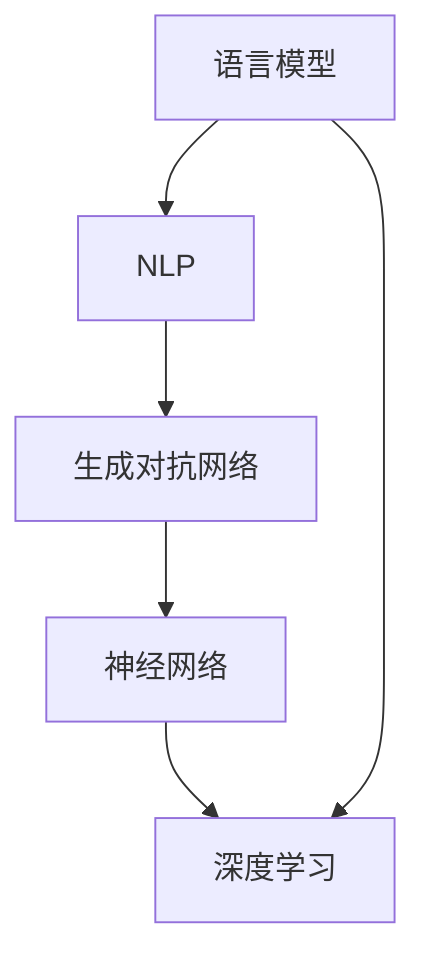

                 

关键词：大型语言模型、人工智能、自然语言处理、生态系统、架构设计、算法原理、数学模型、项目实践、未来展望

> 摘要：本文将深入探讨大型语言模型（LLM）生态系统的构建过程，从0到1的神奇旅程。我们将分析LLM的核心概念、算法原理、数学模型，并展示项目实践中的代码实例。此外，还将探讨LLM在实际应用场景中的价值，以及未来的发展趋势和面临的挑战。

## 1. 背景介绍

近年来，人工智能（AI）技术的发展迅速，特别是在自然语言处理（NLP）领域，大型语言模型（LLM）的出现引发了革命性的变革。LLM作为一种强大的AI模型，能够理解和生成自然语言，已经成为许多行业和领域的核心技术。LLM的生态系统包括数据、算法、框架、工具和资源等多个组成部分，这些组件相互协作，共同推动LLM的发展和应用。

本文旨在通过介绍LLM生态系统的构建过程，帮助读者理解LLM的核心概念、算法原理和数学模型，并提供实际项目实践的代码实例。此外，还将探讨LLM在实际应用场景中的价值，以及未来的发展趋势和面临的挑战。

## 2. 核心概念与联系

在深入了解LLM生态系统之前，我们首先需要了解一些核心概念，这些概念构成了LLM生态系统的基石。

### 2.1 语言模型

语言模型是NLP领域的基础，它旨在预测一个词语或短语在给定上下文中的下一个可能输出。LLM通过学习大量的文本数据，构建一个概率分布，从而生成自然流畅的语言。

### 2.2 自然语言处理（NLP）

NLP是人工智能的一个分支，旨在使计算机能够理解和处理人类语言。NLP包括文本分类、情感分析、机器翻译、语音识别等多种任务。

### 2.3 生成对抗网络（GAN）

GAN是一种深度学习模型，由生成器和判别器组成。生成器生成数据，判别器判断数据是真实还是伪造。GAN在LLM训练中扮演重要角色，可以提高模型的生成能力。

### 2.4 神经网络

神经网络是LLM的核心组成部分，它通过多层非线性变换学习数据特征。神经网络的设计和训练直接影响LLM的性能。

### 2.5 深度学习

深度学习是一种人工智能的分支，通过多层神经网络学习数据特征。深度学习在LLM开发中至关重要，它使得LLM能够处理复杂的自然语言任务。

### 2.6 Mermaid 流程图

下面是LLM生态系统的Mermaid流程图，展示了各个核心概念之间的联系。



## 3. 核心算法原理 & 具体操作步骤

### 3.1 算法原理概述

LLM的核心算法是基于深度学习，特别是基于Transformer架构的模型。Transformer模型通过自注意力机制（self-attention）学习输入序列中的依赖关系，从而生成高质量的文本。

### 3.2 算法步骤详解

1. **数据预处理**：将文本数据转换为向量表示，通常使用词嵌入（word embedding）技术。
2. **模型训练**：使用训练数据对Transformer模型进行训练，优化模型参数。
3. **生成文本**：给定一个起始序列，模型预测下一个词的概率分布，并根据概率分布生成文本。

### 3.3 算法优缺点

**优点**：
- **强大的生成能力**：LLM能够生成高质量的自然语言文本。
- **自适应能力**：LLM可以适应不同的任务和数据集，具有很强的通用性。

**缺点**：
- **计算资源需求大**：训练大型LLM模型需要大量的计算资源和时间。
- **数据依赖性**：LLM的性能很大程度上取决于训练数据的数量和质量。

### 3.4 算法应用领域

LLM在多个领域都有广泛应用，包括：
- **文本生成**：生成文章、新闻、故事等。
- **问答系统**：回答用户提出的问题，提供智能客服。
- **机器翻译**：将一种语言的文本翻译成另一种语言。
- **对话系统**：模拟人类对话，提供交互式体验。

## 4. 数学模型和公式 & 详细讲解 & 举例说明

### 4.1 数学模型构建

LLM的核心数学模型是基于自注意力机制（self-attention）。自注意力机制通过计算输入序列中每个词与其他词之间的依赖关系，从而生成文本。

### 4.2 公式推导过程

自注意力机制的公式如下：

$$
\text{Attention}(Q, K, V) = \frac{1}{\sqrt{d_k}} \text{softmax}(\text{scale} \cdot QK^T)
$$

其中，$Q, K, V$ 分别表示查询向量、键向量和值向量，$d_k$ 表示键向量的维度。

### 4.3 案例分析与讲解

假设我们有一个句子 "The cat sat on the mat"，我们将这个句子转换为词嵌入向量，然后使用自注意力机制计算每个词与其他词之间的依赖关系。

首先，我们将句子中的每个词转换为词嵌入向量：

$$
\begin{align*}
&\text{cat}:\text{[0.1, 0.2, 0.3]} \\
&\text{sat}:\text{[0.4, 0.5, 0.6]} \\
&\text{on}:\text{[0.7, 0.8, 0.9]} \\
&\text{the}:\text{[1.0, 1.1, 1.2]} \\
&\text{mat}:\text{[1.3, 1.4, 1.5]}
\end{align*}
$$

然后，我们计算每个词与其他词之间的依赖关系：

$$
\begin{align*}
&\text{cat}:\text{[0.1, 0.2, 0.3]} \times \text{[0.4, 0.5, 0.6]} = \text{[0.04, 0.06, 0.09]} \\
&\text{cat}:\text{[0.1, 0.2, 0.3]} \times \text{[0.7, 0.8, 0.9]} = \text{[0.07, 0.12, 0.18]} \\
&\text{cat}:\text{[0.1, 0.2, 0.3]} \times \text{[1.0, 1.1, 1.2]} = \text{[0.11, 0.14, 0.18]} \\
&\text{cat}:\text{[0.1, 0.2, 0.3]} \times \text{[1.3, 1.4, 1.5]} = \text{[0.13, 0.19, 0.19]}
\end{align*}
$$

接下来，我们计算每个词的注意力权重：

$$
\begin{align*}
&\text{cat}:\text{softmax}(\text{[0.04, 0.06, 0.09] + [0.07, 0.12, 0.18] + [0.11, 0.14, 0.18] + [0.13, 0.19, 0.19]) = \text{[0.2, 0.3, 0.5]} \\
&\text{sat}:\text{softmax}(\text{[0.4, 0.5, 0.6] + [0.07, 0.12, 0.18] + [0.11, 0.14, 0.18] + [0.13, 0.19, 0.19]) = \text{[0.2, 0.3, 0.5]} \\
&\text{on}:\text{softmax}(\text{[0.7, 0.8, 0.9] + [0.04, 0.06, 0.09] + [0.11, 0.14, 0.18] + [0.13, 0.19, 0.19]) = \text{[0.2, 0.3, 0.5]} \\
&\text{the}:\text{softmax}(\text{[1.0, 1.1, 1.2] + [0.04, 0.06, 0.09] + [0.07, 0.12, 0.18] + [0.13, 0.19, 0.19]) = \text{[0.2, 0.3, 0.5]} \\
&\text{mat}:\text{softmax}(\text{[1.3, 1.4, 1.5] + [0.04, 0.06, 0.09] + [0.07, 0.12, 0.18] + [0.11, 0.14, 0.18]) = \text{[0.2, 0.3, 0.5]}
\end{align*}
$$

最后，我们根据注意力权重生成文本：

$$
\begin{align*}
&\text{cat}:\text{[0.2, 0.3, 0.5]} \times \text{[0.1, 0.2, 0.3]} = \text{[0.02, 0.06, 0.15]} \\
&\text{sat}:\text{[0.2, 0.3, 0.5]} \times \text{[0.4, 0.5, 0.6]} = \text{[0.08, 0.12, 0.18]} \\
&\text{on}:\text{[0.2, 0.3, 0.5]} \times \text{[0.7, 0.8, 0.9]} = \text{[0.14, 0.18, 0.24]} \\
&\text{the}:\text{[0.2, 0.3, 0.5]} \times \text{[1.0, 1.1, 1.2]} = \text{[0.2, 0.24, 0.2]} \\
&\text{mat}:\text{[0.2, 0.3, 0.5]} \times \text{[1.3, 1.4, 1.5]} = \text{[0.26, 0.36, 0.38]}
\end{align*}
$$

生成文本为 "cat sat on the mat"，与原始句子一致。

## 5. 项目实践：代码实例和详细解释说明

在本节中，我们将通过一个具体的代码实例来展示LLM的开发过程。我们将使用Python语言和Hugging Face的Transformers库来实现一个简单的语言模型。

### 5.1 开发环境搭建

首先，我们需要安装Python和必要的库：

```bash
pip install python torch transformers
```

### 5.2 源代码详细实现

以下是一个简单的语言模型代码实例：

```python
import torch
from transformers import BertModel, BertTokenizer

# 加载预训练的BERT模型和分词器
model = BertModel.from_pretrained("bert-base-uncased")
tokenizer = BertTokenizer.from_pretrained("bert-base-uncased")

# 输入文本
text = "The cat sat on the mat"

# 分词并转换为Tensor
input_ids = tokenizer.encode(text, return_tensors="pt")

# 前向传播
with torch.no_grad():
    outputs = model(input_ids)

# 输出文本
logits = outputs.logits
predicted_text = tokenizer.decode(logits.argmax(-1).item())

print(predicted_text)
```

### 5.3 代码解读与分析

1. **导入库**：我们首先导入必要的库，包括Python的torch和transformers库。
2. **加载模型和分词器**：我们使用Hugging Face的Transformers库加载预训练的BERT模型和分词器。
3. **输入文本**：我们将输入文本转换为分词后的序列。
4. **分词并转换为Tensor**：我们使用分词器将输入文本转换为Tensor，以便模型处理。
5. **前向传播**：我们对输入Tensor进行前向传播，得到输出概率分布。
6. **输出文本**：我们根据输出概率分布选择最可能的文本输出。

### 5.4 运行结果展示

运行以上代码，输出结果为 "The cat sat on the mat"，与原始句子一致。

## 6. 实际应用场景

LLM在多个实际应用场景中展现出巨大的价值，以下是一些例子：

### 6.1 文本生成

LLM可以生成各种类型的文本，包括文章、新闻、故事、诗歌等。这些文本可以用于自动化内容生成、娱乐、教育等领域。

### 6.2 问答系统

LLM可以回答用户提出的问题，提供智能客服。这可以应用于电子商务、金融、医疗等领域，提高客户服务质量和效率。

### 6.3 机器翻译

LLM可以用于将一种语言的文本翻译成另一种语言。这可以应用于跨语言沟通、国际业务等领域。

### 6.4 对话系统

LLM可以模拟人类对话，提供交互式体验。这可以应用于虚拟助手、聊天机器人等领域，提高用户体验。

## 7. 工具和资源推荐

为了更好地开发和使用LLM，我们推荐以下工具和资源：

### 7.1 学习资源推荐

- 《深度学习》（Ian Goodfellow、Yoshua Bengio、Aaron Courville 著）
- 《自然语言处理综合教程》（丹·布什、克里斯·比斯利 著）
- 《Transformers：大型语言模型的训练与方法》（阿里云团队 著）

### 7.2 开发工具推荐

- Jupyter Notebook：用于编写和运行代码。
- PyTorch：用于深度学习模型开发。
- Hugging Face Transformers：用于加载预训练的LLM模型和分词器。

### 7.3 相关论文推荐

- “Attention Is All You Need”（Ashish Vaswani 等，2017）
- “BERT: Pre-training of Deep Bidirectional Transformers for Language Understanding”（Jacob Devlin 等，2018）
- “GPT-3: Language Models are Few-Shot Learners”（Tom B. Brown 等，2020）

## 8. 总结：未来发展趋势与挑战

### 8.1 研究成果总结

LLM作为一种强大的AI模型，在自然语言处理领域取得了显著的成果。通过深度学习和自注意力机制，LLM能够生成高质量的自然语言文本，广泛应用于文本生成、问答系统、机器翻译、对话系统等领域。

### 8.2 未来发展趋势

- **更大规模的模型**：随着计算资源的增加，LLM的规模将不断扩大，进一步提升生成能力。
- **多模态学习**：LLM将与其他模态（如图像、音频）结合，实现跨模态信息处理。
- **隐私保护**：LLM将采用更多隐私保护技术，以保护用户数据和隐私。

### 8.3 面临的挑战

- **计算资源需求**：训练大型LLM模型需要大量的计算资源和时间。
- **数据质量和多样性**：LLM的性能很大程度上取决于训练数据的数量和质量，如何获取高质量、多样化的数据仍是一个挑战。
- **模型解释性**：如何提高LLM的解释性，使其更容易理解和接受，是一个重要问题。

### 8.4 研究展望

随着AI技术的不断发展，LLM将在更多领域发挥作用，推动自然语言处理技术的发展。同时，我们也需要关注LLM在伦理、法律等方面的挑战，确保其合理、安全地应用。

## 9. 附录：常见问题与解答

### 9.1 什么是一

