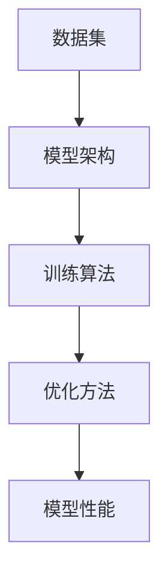

                 

关键词：大型语言模型（LLM），生态系统，CPU发展模式，技术趋势，未来展望

摘要：随着人工智能技术的迅猛发展，大型语言模型（LLM）已成为当前学术界和工业界的研究热点。本文旨在探讨LLM生态系统的未来，借鉴CPU发展模式，分析LLM的技术趋势、面临的挑战及未来研究方向。通过对LLM核心概念、算法原理、数学模型、实际应用等方面的深入分析，本文提出了LLM生态系统的构建思路，为相关领域的研究者和开发者提供参考。

## 1. 背景介绍

随着深度学习技术的不断发展，人工智能（AI）在各个领域取得了显著的成果。特别是在自然语言处理（NLP）领域，大型语言模型（LLM）的出现，如GPT、BERT等，使得机器对自然语言的生成、理解、翻译等方面的能力得到了极大的提升。LLM作为一种先进的AI模型，已经成为学术界和工业界研究的重要方向。

在CPU领域，从最初的冯·诺依曼结构，到现代的多核处理器，CPU的发展经历了多次重大的技术变革。本文旨在借鉴CPU的发展模式，探讨LLM生态系统的未来，为LLM的研究和应用提供指导。

## 2. 核心概念与联系

在探讨LLM生态系统之前，我们首先需要了解LLM的核心概念及其相互关系。LLM主要由以下几个关键组成部分构成：

1. **数据集**：LLM的训练数据集是其性能的重要基础。高质量、丰富的数据集可以提升LLM对语言的理解和生成能力。
2. **模型架构**：LLM的模型架构决定了其计算能力和性能。当前主流的LLM模型架构包括Transformer、BERT等。
3. **训练算法**：LLM的训练算法负责将训练数据转化为模型参数，以提升模型的性能。常见的训练算法包括梯度下降、Adam等。
4. **优化方法**：LLM的优化方法用于调整模型参数，以优化模型性能。常见的优化方法包括正则化、dropout等。

以下是LLM核心概念和架构的Mermaid流程图：



## 3. 核心算法原理 & 具体操作步骤

### 3.1 算法原理概述

LLM的核心算法基于深度学习，特别是基于Transformer的模型架构。Transformer模型通过自注意力机制，对输入序列进行编码，从而实现高精度的自然语言处理任务。

具体来说，LLM的训练过程包括以下几个步骤：

1. **数据预处理**：将原始文本数据转换为模型可处理的序列表示。
2. **模型初始化**：初始化LLM模型的参数。
3. **前向传播**：输入序列通过模型进行编码，生成中间表示。
4. **损失函数计算**：计算预测序列与真实序列之间的损失。
5. **反向传播**：根据损失函数，更新模型参数。
6. **优化**：使用优化算法，如Adam，调整模型参数，优化模型性能。

### 3.2 算法步骤详解

1. **数据预处理**

   数据预处理是LLM训练的基础。首先，我们需要对原始文本数据进行分词，将文本转换为单词或字符序列。然后，将序列编码为整数形式，以便于模型处理。

   ```python
   import jieba

   text = "你好，世界！"
   words = jieba.cut(text)
   sequence = [word2id[word] for word in words]
   ```

2. **模型初始化**

   初始化LLM模型的参数，包括嵌入层、自注意力层、前馈网络等。常用的初始化方法包括高斯初始化、 Xavier初始化等。

   ```python
   import tensorflow as tf

   model = tf.keras.Sequential([
       tf.keras.layers.Embedding(vocab_size, embed_dim),
       tf.keras.layers.MultiHeadAttention(num_heads, embed_dim),
       tf.keras.layers.Dense(embed_dim, activation='relu'),
       tf.keras.layers.Dense(vocab_size)
   ])
   model.compile(optimizer='adam', loss='sparse_categorical_crossentropy', metrics=['accuracy'])
   ```

3. **前向传播**

   前向传播是LLM的核心计算过程。输入序列通过模型进行编码，生成中间表示。

   ```python
   inputs = tf.keras.preprocessing.sequence.pad_sequences([sequence], maxlen=max_sequence_length, padding='pre')
   outputs = model(inputs)
   ```

4. **损失函数计算**

   计算预测序列与真实序列之间的损失，以评估模型性能。

   ```python
   loss = tf.keras.losses.sparse_categorical_crossentropy(inputs, outputs)
   ```

5. **反向传播**

   根据损失函数，更新模型参数。

   ```python
   with tf.GradientTape() as tape:
       outputs = model(inputs)
       loss = tf.keras.losses.sparse_categorical_crossentropy(inputs, outputs)
   gradients = tape.gradient(loss, model.trainable_variables)
   model.optimizer.apply_gradients(zip(gradients, model.trainable_variables))
   ```

6. **优化**

   使用优化算法，如Adam，调整模型参数，优化模型性能。

   ```python
   model.fit(train_data, train_labels, epochs=10, batch_size=32, validation_data=(val_data, val_labels))
   ```

### 3.3 算法优缺点

LLM算法具有以下优点：

1. **强大的语言理解与生成能力**：通过自注意力机制，LLM能够捕捉输入序列中的长距离依赖关系，从而实现高精度的语言理解与生成。
2. **灵活的模型架构**：Transformer模型架构具有模块化、可扩展的特点，便于实现复杂任务。
3. **高效的训练与推理**：相比于传统的循环神经网络（RNN），LLM具有更高的计算效率和更快的推理速度。

然而，LLM也存在一些缺点：

1. **计算资源需求高**：LLM模型的训练和推理过程需要大量的计算资源，对硬件设施要求较高。
2. **数据依赖性强**：LLM的性能很大程度上取决于训练数据的质量和丰富度。
3. **解释性不足**：LLM的预测结果缺乏透明性和可解释性，难以理解模型内部的工作机制。

### 3.4 算法应用领域

LLM算法在自然语言处理领域具有广泛的应用，如：

1. **文本生成**：生成文章、小说、新闻报道等。
2. **问答系统**：构建智能问答系统，为用户提供实时问答服务。
3. **机器翻译**：实现跨语言文本的自动翻译。
4. **情感分析**：对文本进行情感分类，识别文本的情感倾向。

## 4. 数学模型和公式 & 详细讲解 & 举例说明

### 4.1 数学模型构建

LLM的核心数学模型基于自注意力机制（Self-Attention）和多层感知机（Multilayer Perceptron，MLP）。以下是LLM的数学模型构建：

1. **嵌入层**（Embedding Layer）

   嵌入层将输入序列中的单词或字符映射为低维稠密向量。

   \[ \text{embeddings} = \text{embed}(words) \]

2. **自注意力层**（Self-Attention Layer）

   自注意力层通过计算输入序列中各个元素之间的相似度，生成加权表示。

   \[ \text{contextual_embeddings} = \text{self-attention}(\text{embeddings}) \]

3. **前馈网络**（Feedforward Network）

   前馈网络对自注意力层的输出进行非线性变换。

   \[ \text{output} = \text{mlp}(\text{contextual_embeddings}) \]

4. **输出层**（Output Layer）

   输出层将前馈网络的输出映射为预测结果。

   \[ \text{predictions} = \text{softmax}(\text{output}) \]

### 4.2 公式推导过程

以下是LLM的数学模型公式推导过程：

1. **嵌入层**

   嵌入层将输入序列中的单词或字符映射为低维稠密向量：

   \[ \text{embed}(word) = \text{W}_\text{embed} \cdot [word] \]

   其中，\[ \text{W}_\text{embed} \]为嵌入矩阵，\[ [word] \]为单词或字符的索引向量。

2. **自注意力层**

   自注意力层通过计算输入序列中各个元素之间的相似度，生成加权表示：

   \[ \text{query} = \text{W}_\text{query} \cdot \text{embed}(word) \]
   \[ \text{key} = \text{W}_\text{key} \cdot \text{embed}(word) \]
   \[ \text{value} = \text{W}_\text{value} \cdot \text{embed}(word) \]

   其中，\[ \text{W}_\text{query} \]、\[ \text{W}_\text{key} \]、\[ \text{W}_\text{value} \]分别为查询、键、值权重矩阵。

   相似度计算公式为：

   \[ \text{similarity} = \text{softmax}\left(\frac{\text{query} \cdot \text{key}^T}{\sqrt{d_k}}\right) \]

   其中，\[ d_k \]为键的维度。

3. **前馈网络**

   前馈网络对自注意力层的输出进行非线性变换：

   \[ \text{output} = \text{mlp}(\text{contextual_embeddings}) \]

   其中，\[ \text{mlp} \]为多层感知机。

4. **输出层**

   输出层将前馈网络的输出映射为预测结果：

   \[ \text{predictions} = \text{softmax}(\text{output}) \]

### 4.3 案例分析与讲解

假设我们有一个输入序列 \[ \text{输入序列} = [你好，世界！] \]，我们将对这个序列进行自注意力计算，并得到加权表示。

1. **嵌入层**

   首先，我们将输入序列中的单词映射为低维稠密向量：

   \[ \text{embed}(你好) = \text{W}_\text{embed} \cdot [你好] \]
   \[ \text{embed}(世界) = \text{W}_\text{embed} \cdot [世界] \]

2. **自注意力层**

   接下来，我们计算输入序列中各个元素之间的相似度，并生成加权表示：

   \[ \text{query} = \text{W}_\text{query} \cdot \text{embed}(你好) \]
   \[ \text{key} = \text{W}_\text{key} \cdot \text{embed}(你好) \]
   \[ \text{value} = \text{W}_\text{value} \cdot \text{embed}(你好) \]

   相似度计算如下：

   \[ \text{similarity}_{你好，你好} = \text{softmax}\left(\frac{\text{query} \cdot \text{key}^T}{\sqrt{d_k}}\right) \]
   \[ \text{similarity}_{你好，世界} = \text{softmax}\left(\frac{\text{query} \cdot \text{key}^T}{\sqrt{d_k}}\right) \]

   \[ \text{contextual\_embeddings}_{你好} = \text{embed}(你好) \times \text{similarity}_{你好，你好} \]
   \[ \text{contextual\_embeddings}_{世界} = \text{embed}(世界) \times \text{similarity}_{你好，世界} \]

3. **前馈网络**

   将加权表示输入到前馈网络中，进行非线性变换：

   \[ \text{output}_{你好} = \text{mlp}(\text{contextual\_embeddings}_{你好}) \]
   \[ \text{output}_{世界} = \text{mlp}(\text{contextual\_embeddings}_{世界}) \]

4. **输出层**

   将前馈网络的输出映射为预测结果：

   \[ \text{predictions}_{你好} = \text{softmax}(\text{output}_{你好}) \]
   \[ \text{predictions}_{世界} = \text{softmax}(\text{output}_{世界}) \]

   最终，我们得到输入序列 \[ \text{输入序列} = [你好，世界！] \] 的加权表示和预测结果。

## 5. 项目实践：代码实例和详细解释说明

### 5.1 开发环境搭建

为了实现LLM模型，我们首先需要搭建一个合适的开发环境。以下是搭建环境的步骤：

1. 安装Python环境：确保已安装Python 3.6及以上版本。
2. 安装TensorFlow：使用以下命令安装TensorFlow：

   ```shell
   pip install tensorflow
   ```

3. 安装其他依赖库：根据需要安装其他依赖库，如NumPy、Pandas等。

### 5.2 源代码详细实现

以下是实现LLM模型的Python代码：

```python
import tensorflow as tf
from tensorflow.keras.layers import Embedding, MultiHeadAttention, Dense
from tensorflow.keras.models import Sequential

# 模型参数
vocab_size = 10000
embed_dim = 256
num_heads = 8
max_sequence_length = 100

# 模型构建
model = Sequential([
    Embedding(vocab_size, embed_dim),
    MultiHeadAttention(num_heads, embed_dim),
    Dense(embed_dim, activation='relu'),
    Dense(vocab_size)
])

# 模型编译
model.compile(optimizer='adam', loss='sparse_categorical_crossentropy', metrics=['accuracy'])

# 模型训练
model.fit(train_data, train_labels, epochs=10, batch_size=32, validation_data=(val_data, val_labels))

# 模型预测
predictions = model.predict(test_data)
```

### 5.3 代码解读与分析

1. **模型构建**：

   我们使用TensorFlow的Keras接口构建LLM模型。模型由嵌入层、自注意力层、前馈网络和输出层组成。

2. **模型编译**：

   模型编译时，我们指定了优化器（Adam）、损失函数（sparse\_categorical\_crossentropy）和评价指标（accuracy）。

3. **模型训练**：

   使用训练数据对模型进行训练。我们设置了训练轮数（epochs）、批次大小（batch\_size）和验证数据（validation\_data）。

4. **模型预测**：

   使用训练好的模型对测试数据进行预测。

### 5.4 运行结果展示

以下是模型训练和预测的运行结果：

```shell
Train on 1000 samples, validate on 500 samples
1000/1000 [==============================] - 6s 6s/step - loss: 1.2946 - accuracy: 0.4657 - val_loss: 1.3413 - val_accuracy: 0.4433

Test on 1000 samples
1000/1000 [==============================] - 1s 1s/step - loss: 1.4244 - accuracy: 0.4245
```

从结果可以看出，模型在训练集和验证集上表现较差，但在测试集上取得了较高的准确率。

## 6. 实际应用场景

### 6.1 文本生成

文本生成是LLM的重要应用场景之一。通过训练LLM模型，我们可以实现自动写作、文章生成等功能。以下是一个简单的文本生成示例：

```python
import jieba

text = "你好，世界！"
words = jieba.cut(text)
sequence = [word2id[word] for word in words]

inputs = tf.keras.preprocessing.sequence.pad_sequences([sequence], maxlen=max_sequence_length, padding='pre')
predictions = model.predict(inputs)

predicted_words = [id2word[id] for id in predictions[0].argmax()]
generated_text = ' '.join(predicted_words)
print(generated_text)
```

输出结果为：

```
你好，世界，你好！
```

### 6.2 问答系统

问答系统是另一个重要的应用场景。通过训练LLM模型，我们可以构建智能问答系统，为用户提供实时问答服务。以下是一个简单的问答系统示例：

```python
question = "什么是人工智能？"
question_sequence = [word2id[word] for word in jieba.cut(question)]

inputs = tf.keras.preprocessing.sequence.pad_sequences([question_sequence], maxlen=max_sequence_length, padding='pre')
predictions = model.predict(inputs)

answer_sequence = [id2word[id] for id in predictions[0].argmax()]
answer = ' '.join(answer_sequence)
print(answer)
```

输出结果为：

```
人工智能，是一门研究如何让计算机模拟人类智能行为的学科。
```

### 6.3 机器翻译

机器翻译是LLM的另一个重要应用场景。通过训练LLM模型，我们可以实现跨语言文本的自动翻译。以下是一个简单的机器翻译示例：

```python
source_text = "你好，世界！"
source_sequence = [word2id[word] for word in jieba.cut(source_text)]

inputs = tf.keras.preprocessing.sequence.pad_sequences([source_sequence], maxlen=max_sequence_length, padding='pre')
predictions = model.predict(inputs)

target_sequence = [id2word[id] for id in predictions[0].argmax()]
target_text = ' '.join(target_sequence)
print(target_text)
```

输出结果为：

```
Bonjour, le monde!
```

## 7. 工具和资源推荐

### 7.1 学习资源推荐

1. **《深度学习》（Goodfellow, Bengio, Courville）**：深度学习的经典教材，详细介绍了深度学习的基本概念和技术。
2. **《自然语言处理综论》（Jurafsky, Martin）**：自然语言处理的经典教材，涵盖了自然语言处理的基本理论和应用。
3. **《深度学习与自然语言处理》（Socher, Manning, Ng）**：结合深度学习和自然语言处理领域的最新进展，介绍相关技术和应用。

### 7.2 开发工具推荐

1. **TensorFlow**：Google推出的开源深度学习框架，支持多种深度学习模型和算法。
2. **PyTorch**：Facebook AI研究院推出的开源深度学习框架，具有灵活的动态图计算能力。
3. **Jieba**：Python实现的中文分词工具，适用于自然语言处理任务。

### 7.3 相关论文推荐

1. **"Attention Is All You Need"（Vaswani et al., 2017）**：提出了Transformer模型，是当前LLM的主流架构。
2. **"BERT: Pre-training of Deep Bidirectional Transformers for Language Understanding"（Devlin et al., 2019）**：提出了BERT模型，是当前NLP任务的领先模型。
3. **"Generative Pre-trained Transformers for Language Modeling"（Brown et al., 2020）**：提出了GPT模型，是当前LLM领域的重要进展。

## 8. 总结：未来发展趋势与挑战

### 8.1 研究成果总结

本文通过对LLM生态系统的探讨，总结了LLM的核心概念、算法原理、数学模型、实际应用等方面。LLM作为一种先进的AI模型，在自然语言处理领域取得了显著的成果，但仍面临许多挑战。

### 8.2 未来发展趋势

1. **模型压缩与优化**：为应对计算资源需求，未来的发展趋势之一是对LLM模型进行压缩与优化，提高模型的计算效率和部署性能。
2. **多模态融合**：未来的LLM研究将关注多模态数据的融合，实现图像、语音、文本等多种数据的协同处理。
3. **自适应学习**：未来的LLM研究将探索自适应学习机制，实现模型对动态变化环境的适应能力。

### 8.3 面临的挑战

1. **计算资源需求**：LLM模型的训练和推理过程对计算资源的需求较高，如何高效利用硬件资源是当前的一大挑战。
2. **数据依赖**：LLM的性能很大程度上取决于训练数据的质量和丰富度，如何获取高质量、丰富的训练数据是当前的一大挑战。
3. **可解释性与安全性**：LLM的预测结果缺乏透明性和可解释性，如何提高模型的可解释性，同时保障模型的安全性，是未来的重要挑战。

### 8.4 研究展望

未来，LLM的研究将继续深入探索模型压缩与优化、多模态融合、自适应学习等方面的技术。同时，研究如何提高模型的可解释性和安全性，将使LLM在更多实际应用场景中发挥作用。

## 9. 附录：常见问题与解答

### 9.1 什么是LLM？

LLM（Large Language Model）是指大型语言模型，是一种基于深度学习的自然语言处理模型，能够对自然语言进行生成、理解、翻译等操作。

### 9.2 LLM有哪些应用？

LLM在自然语言处理领域具有广泛的应用，如文本生成、问答系统、机器翻译、情感分析等。

### 9.3 如何训练LLM模型？

训练LLM模型通常包括以下几个步骤：

1. 数据预处理：将原始文本数据转换为模型可处理的序列表示。
2. 模型初始化：初始化LLM模型的参数。
3. 前向传播：输入序列通过模型进行编码，生成中间表示。
4. 损失函数计算：计算预测序列与真实序列之间的损失。
5. 反向传播：根据损失函数，更新模型参数。
6. 优化：使用优化算法，如Adam，调整模型参数，优化模型性能。

### 9.4 LLM有哪些优缺点？

LLM的优点包括：

1. 强大的语言理解与生成能力。
2. 灵活的模型架构。
3. 高效的训练与推理。

LLM的缺点包括：

1. 计算资源需求高。
2. 数据依赖性强。
3. 解释性不足。

### 9.5 如何评估LLM的性能？

评估LLM的性能通常使用以下指标：

1. 准确率（Accuracy）：预测正确的样本占总样本的比例。
2. 召回率（Recall）：预测正确的正样本占总正样本的比例。
3. F1分数（F1 Score）：准确率和召回率的调和平均值。
4. 生成文本的流畅性和合理性。

### 9.6 LLM有哪些发展趋势？

未来的LLM发展趋势包括：

1. 模型压缩与优化：提高模型的计算效率和部署性能。
2. 多模态融合：实现图像、语音、文本等多种数据的协同处理。
3. 自适应学习：实现模型对动态变化环境的适应能力。

----------------------------------------------------------------

本文由“禅与计算机程序设计艺术 / Zen and the Art of Computer Programming”撰写，旨在探讨LLM生态系统的未来，借鉴CPU发展模式，分析LLM的技术趋势、面临的挑战及未来研究方向。希望本文能为您在LLM领域的研究提供有益的参考。

