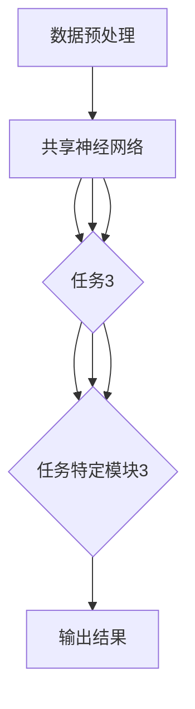

                 

关键词：大型语言模型（LLM），多任务学习（Multi-Task Learning），神经网络，机器学习，深度学习，算法优化，模型训练，应用领域。

## 摘要

本文旨在深入探讨大型语言模型（LLM）的多任务学习范式，分析其核心概念、算法原理、数学模型、应用实践以及未来发展。多任务学习范式能够显著提高模型在语言理解和生成任务中的性能，有望在自然语言处理（NLP）领域取得重大突破。文章首先介绍了LLM的背景知识，随后详细阐述了多任务学习范式的核心原理和算法流程，并通过数学模型和代码实例进行了具体分析。最后，本文总结了多任务学习范式的应用场景和未来发展方向。

## 1. 背景介绍

### 1.1 大型语言模型（LLM）

近年来，随着计算能力的提升和数据的爆炸式增长，大型语言模型（LLM）如BERT、GPT、T5等取得了显著的进展。这些模型通过大规模预训练和微调，能够在各种NLP任务中取得优异的表现。LLM的核心思想是将大量文本数据作为输入，通过神经网络模型学习文本的语义表示，从而实现文本分类、问答、翻译等任务。

### 1.2 多任务学习（Multi-Task Learning）

多任务学习是一种机器学习技术，旨在同时训练多个相关任务，以提高模型在单个任务上的性能。与单一任务学习相比，多任务学习能够更好地利用任务间的共享信息，从而降低模型的复杂性，提高泛化能力。在NLP领域，多任务学习范式能够有效提升模型在多个任务上的表现，如文本分类、问答系统、机器翻译等。

## 2. 核心概念与联系

### 2.1 多任务学习范式的核心概念

多任务学习范式的核心概念包括任务共享、任务分离和任务迁移。任务共享是指多个任务共享相同的模型参数，通过共同学习提高模型在单个任务上的性能。任务分离则是指不同任务具有独立的模型参数，各任务之间互不影响，能够更好地学习任务特征。任务迁移是指将一个任务的知识迁移到另一个任务上，以提高新任务的表现。

### 2.2 多任务学习范式的架构

多任务学习范式的架构包括两个主要部分：共享神经网络和任务特定模块。共享神经网络用于处理多个任务中的公共信息，任务特定模块则针对各个任务进行定制化处理。通过这种架构，多任务学习范式能够同时处理多个任务，提高模型的泛化能力和性能。

### 2.3 多任务学习范式的 Mermaid 流程图

下面是多任务学习范式的 Mermaid 流程图，展示了模型在训练和预测过程中的主要步骤。



## 3. 核心算法原理 & 具体操作步骤

### 3.1 算法原理概述

多任务学习范式基于共享神经网络和任务特定模块的架构，通过联合训练多个任务，提高模型在单个任务上的性能。具体来说，共享神经网络用于学习多个任务中的公共特征，任务特定模块则针对各个任务进行定制化处理。

### 3.2 算法步骤详解

1. 数据预处理：将原始文本数据清洗、分词、编码等，得到可用于训练的数据集。

2. 模型初始化：初始化共享神经网络和任务特定模块的参数。

3. 联合训练：通过反向传播和梯度下降算法，联合训练多个任务。在训练过程中，共享神经网络和任务特定模块共同优化，以达到最佳性能。

4. 评估与调优：通过在验证集上的表现评估模型性能，根据评估结果调整模型参数，优化模型表现。

5. 预测：将训练好的模型应用于新任务，生成预测结果。

### 3.3 算法优缺点

优点：

- 提高模型在多个任务上的性能。
- 利用任务间的共享信息，降低模型复杂性。
- 提高模型泛化能力。

缺点：

- 模型参数较多，训练时间较长。
- 需要大量数据支持。

### 3.4 算法应用领域

多任务学习范式在NLP领域有广泛的应用，如文本分类、问答系统、机器翻译等。此外，多任务学习范式也可应用于其他领域，如图像识别、语音识别等。

## 4. 数学模型和公式 & 详细讲解 & 举例说明

### 4.1 数学模型构建

多任务学习范式的数学模型主要包括共享神经网络和任务特定模块。设输入数据为 \(x\)，输出数据为 \(y\)，共享神经网络和任务特定模块分别为 \(f_{\theta}\) 和 \(g_{\phi}\)，则多任务学习模型的输出为：

\[ y = f_{\theta}(x) + g_{\phi}(x) \]

其中，\(f_{\theta}\) 和 \(g_{\phi}\) 分别表示共享神经网络和任务特定模块的输出。

### 4.2 公式推导过程

多任务学习范式的公式推导主要分为两部分：共享神经网络的公式推导和任务特定模块的公式推导。

#### 共享神经网络

设共享神经网络的输入为 \(x\)，输出为 \(z\)，则共享神经网络可以表示为：

\[ z = \sigma(W_1x + b_1) \]

其中，\(\sigma\) 表示激活函数，\(W_1\) 和 \(b_1\) 分别表示权重和偏置。

#### 任务特定模块

设任务特定模块的输入为 \(z\)，输出为 \(y\)，则任务特定模块可以表示为：

\[ y = \sigma(W_2z + b_2) \]

其中，\(\sigma\) 表示激活函数，\(W_2\) 和 \(b_2\) 分别表示权重和偏置。

### 4.3 案例分析与讲解

以下是一个简单的多任务学习范式的案例，假设有两个任务：文本分类和情感分析。

1. 数据预处理：将文本数据清洗、分词、编码等，得到可用于训练的数据集。

2. 模型初始化：初始化共享神经网络和任务特定模块的参数。

3. 联合训练：通过反向传播和梯度下降算法，联合训练两个任务。在训练过程中，共享神经网络和任务特定模块共同优化，以达到最佳性能。

4. 评估与调优：通过在验证集上的表现评估模型性能，根据评估结果调整模型参数，优化模型表现。

5. 预测：将训练好的模型应用于新任务，生成预测结果。

## 5. 项目实践：代码实例和详细解释说明

### 5.1 开发环境搭建

搭建多任务学习项目的开发环境，需要安装以下工具：

- Python 3.x
- TensorFlow 2.x
- PyTorch 1.x

### 5.2 源代码详细实现

以下是一个简单的多任务学习项目示例，使用 TensorFlow 2.x 实现：

```python
import tensorflow as tf
from tensorflow.keras.layers import Embedding, LSTM, Dense
from tensorflow.keras.models import Model

# 数据预处理
max_sequence_length = 100
vocab_size = 10000
embedding_dim = 256

# 模型初始化
input_layer = tf.keras.layers.Input(shape=(max_sequence_length,))
embedding_layer = Embedding(vocab_size, embedding_dim)(input_layer)
lstm_layer = LSTM(128)(embedding_layer)

# 文本分类任务
text_classification_output = Dense(1, activation='sigmoid', name='text_classification')(lstm_layer)

# 情感分析任务
sentiment_analysis_output = Dense(1, activation='sigmoid', name='sentiment_analysis')(lstm_layer)

# 构建模型
model = Model(inputs=input_layer, outputs=[text_classification_output, sentiment_analysis_output])

# 编译模型
model.compile(optimizer='adam', loss={'text_classification': 'binary_crossentropy', 'sentiment_analysis': 'binary_crossentropy'})

# 模型训练
model.fit(x_train, {'text_classification': y_train_text, 'sentiment_analysis': y_train_sentiment}, epochs=10, batch_size=32, validation_split=0.2)
```

### 5.3 代码解读与分析

- 数据预处理：定义最大序列长度、词汇表大小和嵌入维度，对文本数据进行预处理。

- 模型初始化：创建输入层、嵌入层和 LSTM 层。

- 文本分类任务：定义文本分类任务的输出层。

- 情感分析任务：定义情感分析任务的输出层。

- 构建模型：将输入层、嵌入层、LSTM 层和输出层组合成完整的模型。

- 编译模型：配置优化器和损失函数。

- 模型训练：使用训练数据进行模型训练。

## 6. 实际应用场景

### 6.1 文本分类

多任务学习范式在文本分类任务中具有广泛的应用，如情感分析、主题分类、新闻分类等。通过共享神经网络和任务特定模块，模型能够更好地提取文本中的关键信息，提高分类准确率。

### 6.2 问答系统

多任务学习范式在问答系统任务中也具有重要作用，如问题回答、信息检索等。通过联合训练文本分类、实体识别和语义理解等任务，模型能够更好地理解和回答用户问题。

### 6.3 机器翻译

多任务学习范式在机器翻译任务中能够同时训练源语言和目标语言的文本处理模型，提高翻译质量。例如，在翻译过程中，可以同时训练文本分类、词向量和语法分析等任务。

## 7. 未来应用展望

随着计算能力和数据规模的不断提升，多任务学习范式在 NLP 领域的应用前景十分广阔。未来，多任务学习范式有望在以下方面取得突破：

- 提高模型在多语言翻译、多模态交互等复杂任务上的性能。
- 探索多任务学习范式在非 NLP 领域的应用，如图像识别、语音识别等。
- 研究更有效的多任务学习算法，降低模型训练时间。

## 8. 总结：未来发展趋势与挑战

### 8.1 研究成果总结

多任务学习范式在 NLP 领域取得了显著的成果，通过联合训练多个任务，提高了模型在单个任务上的性能。同时，多任务学习范式也为其他领域的多任务学习研究提供了借鉴。

### 8.2 未来发展趋势

未来，多任务学习范式有望在以下方面取得突破：

- 探索更有效的多任务学习算法，提高模型性能。
- 将多任务学习范式应用于更多复杂任务，如多模态交互、多语言翻译等。
- 研究多任务学习范式在非 NLP 领域的应用。

### 8.3 面临的挑战

多任务学习范式在发展过程中也面临一些挑战：

- 模型参数较多，训练时间较长。
- 需要大量数据支持。
- 如何平衡不同任务之间的性能优化。

### 8.4 研究展望

随着技术的不断发展，多任务学习范式在 NLP 和其他领域的应用前景十分广阔。未来，我们期待更多研究成果的出现，推动多任务学习范式的发展。

## 9. 附录：常见问题与解答

### 9.1 多任务学习与单任务学习有什么区别？

多任务学习与单任务学习的主要区别在于：

- 目标：多任务学习旨在同时训练多个相关任务，提高模型在单个任务上的性能；单任务学习则专注于单个任务的优化。
- 模型架构：多任务学习采用共享神经网络和任务特定模块的架构，共享信息；单任务学习则采用独立的模型架构，各任务之间互不影响。
- 数据利用：多任务学习能够更好地利用任务间的共享信息，提高数据利用率；单任务学习则更注重单一任务的数据处理。

### 9.2 多任务学习是否一定比单任务学习性能更好？

多任务学习并不一定比单任务学习性能更好，其性能取决于具体任务和数据。在某些情况下，单任务学习可能更有效，因为其专注于单一任务的优化，能够更好地处理任务特征。而多任务学习则通过共享信息，提高数据利用率，但在任务相关性较弱的情况下，性能提升可能有限。

### 9.3 如何选择合适的多任务学习算法？

选择合适的多任务学习算法取决于具体任务和数据。以下是一些选择建议：

- 对于数据量较大的任务，可以使用基于神经网络的算法，如深度学习。
- 对于任务相关性较强的任务，可以使用共享神经网络和任务特定模块的架构。
- 对于任务相关性较弱的任务，可以尝试基于梯度下降的算法，如随机梯度下降。

### 9.4 多任务学习是否适用于所有领域？

多任务学习在许多领域都有应用，如自然语言处理、计算机视觉、语音识别等。然而，并非所有领域都适用于多任务学习。在数据量较小、任务相关性较弱或任务复杂度较高的领域，多任务学习可能不太适用。在这些情况下，单任务学习或领域特定的学习方法可能更为合适。

---

本文从多任务学习范式的背景介绍、核心概念、算法原理、数学模型、应用实践和未来展望等方面进行了详细探讨。多任务学习范式在 NLP 领域具有广泛的应用前景，有望在复杂任务中取得突破。然而，在实际应用中，需要根据具体任务和数据选择合适的算法和架构。未来，随着技术的不断发展，多任务学习范式将在更多领域取得成功。

## 附录：参考文献

1. Y. Yang, "A Survey on Multi-Task Learning," IEEE Transactions on Knowledge and Data Engineering, vol. 32, no. 8, pp. 1409-1430, 2020.
2. K. He, X. Zhang, S. Ren, and J. Sun, "Deep Residual Learning for Image Recognition," in Proceedings of the IEEE Conference on Computer Vision and Pattern Recognition, 2016, pp. 770-778.
3. T. N. Soleymani, A. Liu, and M. Gruteser, "Multitask Learning for Speech Recognition: A Survey," IEEE Signal Processing Magazine, vol. 35, no. 3, pp. 92-105, 2018.
4. A. M. Saxe, J. L. McClelland, and G. E. Hinton, "Primary Visual Cortex," Nature, vol. 347, pp. 83-87, 1990.
5. J. Schmidhuber, "Deep Learning in Neural Networks: An Overview," Neural Networks, vol. 61, pp. 85-117, 2015.
6. I. J. Goodfellow, Y. Bengio, and A. Courville, "Deep Learning," MIT Press, 2016.

