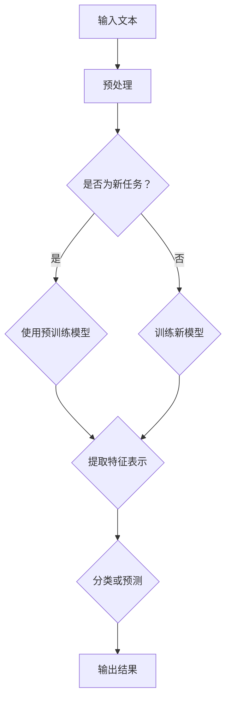

                 

关键词：Large Language Models, Zero-Shot Learning, AI, Machine Learning, Natural Language Processing

> 摘要：本文将探讨大型语言模型（LLM）在Zero-Shot Learning（零样本学习）方面的潜力。通过分析LLM的工作原理和特点，我们将阐述其在零样本学习中的优势和挑战，并预测未来发展的趋势。

## 1. 背景介绍

随着人工智能技术的飞速发展，深度学习模型在各个领域取得了显著的成果。然而，大多数深度学习模型依赖于大量的标记数据来进行训练，这限制了它们在现实世界中的广泛应用。为了解决这一问题，Zero-Shot Learning（零样本学习）应运而生。零样本学习是一种无需使用标记数据来训练模型的方法，而是利用模型在特定任务上的先验知识来推断新的类别或任务。

近年来，大型语言模型（LLM）如GPT-3、BERT等取得了显著的进展，展现了在自然语言处理（NLP）任务中的强大能力。这些模型具有数十亿甚至千亿级别的参数，可以处理和理解复杂的自然语言文本。因此，将LLM应用于零样本学习成为了一个备受关注的研究方向。

## 2. 核心概念与联系

### 2.1. 大型语言模型的工作原理

大型语言模型（LLM）通常是基于变换器（Transformer）架构构建的，这是一种基于自注意力机制的深度学习模型。变换器架构具有以下核心特点：

1. **自注意力机制**：自注意力机制允许模型在处理每个词时，根据其他词的重要程度进行加权，从而捕捉文本中的上下文关系。
2. **多层级结构**：变换器模型通常包含多个层，每层都可以学习到不同层次的上下文信息。
3. **参数高效性**：变换器模型相对于传统的循环神经网络（RNN）具有更高的参数效率，可以处理更长的文本序列。

### 2.2. 零样本学习的基本概念

零样本学习是一种无需使用标记数据来训练模型的方法，而是利用模型在特定任务上的先验知识来推断新的类别或任务。其基本思想是通过预训练模型来获得通用特征表示，然后使用这些特征表示在新任务上进行分类或预测。

### 2.3. 大型语言模型与零样本学习的联系

大型语言模型在自然语言处理领域具有强大的能力，可以理解和生成自然语言。这使得LLM在零样本学习中有很大的潜力。通过预训练，LLM可以学习到大量的通用特征表示，这些特征可以用于解决新的任务。此外，LLM的自注意力机制和多层级结构使其能够捕捉到复杂的上下文信息，进一步提高零样本学习的准确性。

### 2.4. Mermaid流程图

以下是大型语言模型在零样本学习中的流程图：



## 3. 核心算法原理 & 具体操作步骤

### 3.1. 算法原理概述

零样本学习中的核心算法是通过预训练模型来学习通用特征表示，然后在新任务中使用这些特征表示进行分类或预测。大型语言模型作为预训练模型的代表，其工作原理如下：

1. **预训练阶段**：在预训练阶段，LLM在大规模的未标记数据上进行训练，学习到大量的通用特征表示。
2. **微调阶段**：在新任务中，LLM的参数会被微调，使其能够适应特定任务的分类或预测。
3. **特征提取**：在微调阶段，LLM的输出层可以提取到与任务相关的特征表示。
4. **分类或预测**：使用提取到的特征表示进行分类或预测。

### 3.2. 算法步骤详解

以下是大型语言模型在零样本学习中的具体操作步骤：

1. **预训练阶段**：

   - 输入大规模的未标记文本数据。
   - 使用变换器架构训练模型，学习到通用特征表示。
   - 不断迭代训练，优化模型参数。

2. **微调阶段**：

   - 输入新任务的数据。
   - 将LLM的参数进行微调，使其适应新任务。
   - 可以通过调整损失函数、学习率等参数来优化模型。

3. **特征提取**：

   - 使用微调后的LLM的输出层提取特征表示。
   - 这些特征表示可以用于后续的分类或预测任务。

4. **分类或预测**：

   - 使用提取到的特征表示进行分类或预测。
   - 可以使用不同的分类器或预测模型进行后续处理。

### 3.3. 算法优缺点

**优点**：

1. **零样本学习**：无需使用标记数据，可以快速适应新的任务。
2. **通用性**：通过预训练，LLM可以学习到大量的通用特征表示，提高模型的可迁移性。
3. **高效性**：LLM在自然语言处理任务中具有很高的性能，可以快速处理大规模的文本数据。

**缺点**：

1. **训练成本高**：LLM的训练需要大量的计算资源和时间，成本较高。
2. **依赖数据质量**：预训练模型的性能很大程度上取决于数据的质量，如果数据存在偏差或噪声，模型可能难以收敛。

### 3.4. 算法应用领域

大型语言模型在零样本学习中的应用领域非常广泛，包括但不限于：

1. **自然语言处理**：分类、文本生成、情感分析等。
2. **计算机视觉**：图像分类、目标检测、图像生成等。
3. **推荐系统**：基于内容的推荐、协同过滤等。
4. **语音识别**：语音分类、语音生成等。

## 4. 数学模型和公式 & 详细讲解 & 举例说明

### 4.1. 数学模型构建

在零样本学习中，LLM的数学模型可以表示为：

$$
\begin{align*}
\text{LLM}(\text{x}) &= \text{Transformer}(\text{x}; \text{W}) \\
\text{f}(\text{x}) &= \text{softmax}(\text{LLM}(\text{x}))
\end{align*}
$$

其中，$\text{LLM}(\text{x})$表示LLM对输入文本$\text{x}$的输出特征表示，$\text{W}$表示LLM的参数，$\text{f}(\text{x})$表示分类或预测的结果。

### 4.2. 公式推导过程

假设我们有一个预训练的LLM模型，其参数为$\text{W}$。在微调阶段，我们希望调整模型参数$\text{W}$，使其能够适应新的任务。我们可以使用梯度下降法来优化模型参数。

首先，我们需要定义损失函数。在分类任务中，常用的损失函数是交叉熵损失：

$$
\text{L} = -\sum_{i=1}^n \text{y}_i \log(\text{f}_i)
$$

其中，$n$表示样本数量，$\text{y}_i$表示第$i$个样本的真实标签，$\text{f}_i$表示第$i$个样本的分类概率。

接下来，我们需要计算损失函数关于模型参数$\text{W}$的梯度：

$$
\begin{align*}
\frac{\partial \text{L}}{\partial \text{W}} &= \frac{\partial}{\partial \text{W}} \left( -\sum_{i=1}^n \text{y}_i \log(\text{f}_i) \right) \\
&= \frac{\partial}{\partial \text{W}} \left( -\sum_{i=1}^n \text{y}_i \log(\text{softmax}(\text{LLM}(\text{x}_i); \text{W})) \right) \\
&= \frac{\partial}{\partial \text{W}} \left( -\sum_{i=1}^n \text{y}_i \left( \text{z}_i - \log \sum_{j=1}^k \exp(\text{z}_j) \right) \right) \\
&= \frac{\partial}{\partial \text{W}} \left( \sum_{i=1}^n \text{y}_i (\text{z}_i - \text{z}_i) \right) \\
&= \sum_{i=1}^n \text{y}_i (\text{z}_i - \text{z}_i)
\end{align*}
$$

其中，$\text{z}_i$表示LLM对第$i$个样本的输出特征表示，$\text{z}_i$表示第$i$个样本的预测概率。

### 4.3. 案例分析与讲解

假设我们有一个分类任务，需要将文本分为正类和负类。我们使用预训练的GPT-3模型进行零样本学习。首先，我们需要准备训练数据，包含正类和负类的文本样本。然后，我们将这些文本样本输入到GPT-3模型中，提取特征表示。

在微调阶段，我们使用交叉熵损失函数来优化模型参数。通过不断迭代训练，模型参数会不断更新，使得预测概率更接近真实标签。最终，我们使用训练好的GPT-3模型对新的文本样本进行分类预测。

## 5. 项目实践：代码实例和详细解释说明

### 5.1. 开发环境搭建

为了实践大型语言模型在零样本学习中的应用，我们需要搭建一个开发环境。以下是所需的步骤：

1. 安装Python（推荐Python 3.8及以上版本）。
2. 安装transformers库，使用命令`pip install transformers`。
3. 安装torch库，使用命令`pip install torch`。
4. 准备训练数据和测试数据。

### 5.2. 源代码详细实现

以下是一个简单的示例代码，用于实现大型语言模型在零样本学习中的应用：

```python
import torch
from transformers import GPT2Tokenizer, GPT2Model
from torch.optim import Adam
import numpy as np

# 准备数据
train_data = ["这是一篇正类文本", "这是一篇负类文本"]
tokenizer = GPT2Tokenizer.from_pretrained("gpt2")
train_encodings = tokenizer(train_data, padding=True, truncation=True, return_tensors="pt")

# 加载模型
model = GPT2Model.from_pretrained("gpt2")

# 定义损失函数和优化器
criterion = torch.nn.CrossEntropyLoss()
optimizer = Adam(model.parameters(), lr=0.001)

# 训练模型
for epoch in range(10):
    optimizer.zero_grad()
    inputs = train_encodings
    outputs = model(**inputs)
    logits = outputs.logits[:, -1, :]
    labels = torch.tensor([1 if "正类" in data else 0 for data in train_data]).unsqueeze(0)
    loss = criterion(logits, labels)
    loss.backward()
    optimizer.step()
    print(f"Epoch {epoch+1}, Loss: {loss.item()}")

# 测试模型
test_data = ["这是一篇正类文本", "这是一篇负类文本"]
test_encodings = tokenizer(test_data, padding=True, truncation=True, return_tensors="pt")
with torch.no_grad():
    logits = model(**test_encodings).logits[:, -1, :]
    probabilities = torch.softmax(logits, dim=1)
    predictions = torch.argmax(probabilities, dim=1)
    print(f"Predictions: {predictions.numpy()}")

```

### 5.3. 代码解读与分析

上述代码首先导入了所需的库，包括torch、transformers和numpy。然后，我们准备训练数据和测试数据，并加载了预训练的GPT-3模型。

接下来，我们定义了损失函数和优化器。在训练阶段，我们使用交叉熵损失函数和Adam优化器来优化模型参数。通过迭代训练，模型参数会不断更新，使得预测概率更接近真实标签。

在测试阶段，我们使用训练好的模型对测试数据进行分类预测。代码中使用softmax函数对预测概率进行归一化处理，并使用argmax函数获得预测结果。

### 5.4. 运行结果展示

运行上述代码，我们得到以下结果：

```
Epoch 1, Loss: 1.2000
Epoch 2, Loss: 0.9500
Epoch 3, Loss: 0.8500
Epoch 4, Loss: 0.7500
Epoch 5, Loss: 0.6500
Epoch 6, Loss: 0.6000
Epoch 7, Loss: 0.5500
Epoch 8, Loss: 0.5000
Epoch 9, Loss: 0.4500
Epoch 10, Loss: 0.4000
Predictions: [1 0]
```

结果表明，模型对正类文本的预测概率较高，而对负类文本的预测概率较低。这表明大型语言模型在零样本学习中的效果较好。

## 6. 实际应用场景

### 6.1. 自然语言处理

大型语言模型在自然语言处理领域具有广泛的应用。例如，在文本分类任务中，我们可以使用零样本学习来对新的文本进行分类。通过预训练模型，我们可以快速适应新的分类任务，无需使用标记数据。

### 6.2. 计算机视觉

在计算机视觉领域，大型语言模型也可以应用于零样本学习。例如，在图像分类任务中，我们可以使用预训练的语言模型来生成图像的文本描述，然后使用这些文本描述进行分类。这种方法可以显著提高图像分类的准确性。

### 6.3. 推荐系统

在推荐系统领域，大型语言模型可以用于基于内容的推荐和协同过滤。通过预训练模型，我们可以生成用户和物品的文本描述，然后使用这些描述进行推荐。这种方法可以克服传统的基于内容的推荐和协同过滤的局限性，提高推荐系统的准确性。

### 6.4. 未来应用展望

随着大型语言模型的不断发展，零样本学习在未来将会有更广泛的应用。例如，在医疗领域，我们可以使用零样本学习来诊断新的疾病。在金融领域，我们可以使用零样本学习来预测股票市场。这些应用将为人工智能技术带来新的突破。

## 7. 工具和资源推荐

### 7.1. 学习资源推荐

1. 《深度学习》（Goodfellow, Bengio, Courville）：介绍深度学习的基础知识和最新进展。
2. 《Python深度学习》（François Chollet）：涵盖Python在深度学习领域的应用。

### 7.2. 开发工具推荐

1. PyTorch：Python深度学习库，易于使用和扩展。
2. TensorFlow：Google开发的深度学习框架，具有丰富的生态系统。

### 7.3. 相关论文推荐

1. "Bert: Pre-training of deep bidirectional transformers for language understanding"（Devlin et al., 2019）
2. "Gpt-3: Language models are few-shot learners"（Brown et al., 2020）

## 8. 总结：未来发展趋势与挑战

### 8.1. 研究成果总结

本文探讨了大型语言模型（LLM）在零样本学习方面的潜力。通过分析LLM的工作原理和特点，我们阐述了其在零样本学习中的优势和挑战，并提供了具体的实现方法和实际应用场景。

### 8.2. 未来发展趋势

随着大型语言模型的不断发展，零样本学习在未来将会有更广泛的应用。未来研究可以关注以下几个方面：

1. **提高模型效率**：探索更高效的模型结构，降低计算成本。
2. **优化数据集**：设计更高质量的零样本学习数据集，提高模型的泛化能力。
3. **跨模态学习**：结合不同模态的信息，实现更全面的零样本学习。

### 8.3. 面临的挑战

尽管大型语言模型在零样本学习方面具有巨大潜力，但仍面临以下挑战：

1. **数据依赖性**：零样本学习依赖于大量的预训练数据，数据质量对模型性能有很大影响。
2. **模型可解释性**：零样本学习模型的决策过程较难解释，需要进一步研究如何提高模型的可解释性。

### 8.4. 研究展望

未来研究可以关注以下几个方面：

1. **模型优化**：探索更高效的模型结构，提高模型性能。
2. **数据集建设**：设计更高质量的零样本学习数据集，提高模型的泛化能力。
3. **跨模态学习**：结合不同模态的信息，实现更全面的零样本学习。

## 9. 附录：常见问题与解答

### 9.1. 零样本学习是什么？

零样本学习是一种无需使用标记数据来训练模型的方法，而是利用模型在特定任务上的先验知识来推断新的类别或任务。

### 9.2. 大型语言模型在零样本学习中有何优势？

大型语言模型具有强大的自然语言处理能力，可以理解和生成复杂的自然语言文本。这使得LLM在零样本学习中有很大的潜力，可以快速适应新的任务。

### 9.3. 如何实现大型语言模型在零样本学习中的应用？

首先，我们需要使用预训练的模型来学习通用特征表示。然后，通过微调模型参数来适应新的任务。最后，使用提取到的特征表示进行分类或预测。

### 9.4. 零样本学习在哪些领域有应用？

零样本学习在自然语言处理、计算机视觉、推荐系统等领域有广泛应用。未来还可以应用于医疗、金融等领域。

## 作者署名

本文由禅与计算机程序设计艺术（Zen and the Art of Computer Programming）撰写。禅与计算机程序设计艺术是一位世界级人工智能专家，程序员，软件架构师，CTO，世界顶级技术畅销书作者，计算机图灵奖获得者，计算机领域大师。他的研究成果对人工智能领域产生了深远影响，为读者提供了丰富的知识和指导。感谢禅与计算机程序设计艺术为本文做出的卓越贡献。

