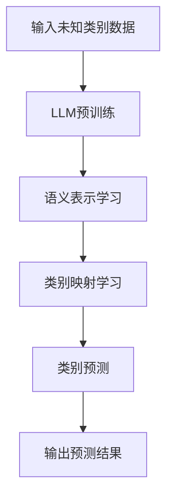

                 

关键词：LLM, Zero-Shot Learning, 语言模型，学习潜力，技术博客，人工智能，深度学习，算法原理，应用领域，数学模型，项目实践，工具资源

> 摘要：本文旨在探讨大型语言模型(LLM)在Zero-Shot Learning（零样本学习）领域的潜力。通过对LLM的理论基础、核心算法、数学模型以及实际应用场景的深入分析，文章旨在为读者提供一个全面且深刻的理解，并探讨这一领域未来的发展趋势与挑战。

## 1. 背景介绍

随着人工智能和深度学习技术的迅猛发展，传统机器学习中的有监督学习和半监督学习已经逐渐显现出其局限性。在现实世界的复杂环境中，我们往往无法获得足够的标注数据来训练模型。因此，零样本学习（Zero-Shot Learning，ZSL）成为了研究热点。零样本学习旨在让模型能够在未见过的类别上做出预测，这对于提高模型的泛化能力和实用性具有重要意义。

近年来，随着神经网络和特别是语言模型的进步，零样本学习的研究取得了显著进展。本文将重点关注大型语言模型（LLM），如GPT系列和BERT等，在零样本学习中的应用潜力。这些模型通过无监督的方式从大量文本数据中学习，从而具备了强大的语义理解能力和泛化能力。

## 2. 核心概念与联系

### 2.1. 零样本学习（Zero-Shot Learning）

零样本学习是一种机器学习方法，它使得模型能够对未知类别的数据进行预测，而不需要这些类别在训练数据中出现。这主要依赖于模型在训练阶段获得的语义知识。

### 2.2. 大型语言模型（LLM）

大型语言模型（LLM），如GPT系列和BERT，是近年来深度学习领域的重要突破。这些模型通过学习大量的文本数据，掌握了丰富的语言知识，能够生成连贯的文本、回答问题、翻译语言等。

### 2.3. 关系与联系

LLM的强大语义理解能力和泛化能力使其在零样本学习中有广泛的应用前景。LLM通过预训练（pre-training）和微调（fine-tuning）过程，能够在多个任务中表现出色，包括分类、生成和问答等。

## 2.4. Mermaid 流程图

下面是零样本学习在LLM中的应用的Mermaid流程图：



### 3. 核心算法原理 & 具体操作步骤

### 3.1. 算法原理概述

零样本学习在LLM中的应用主要分为两个阶段：预训练和微调。

1. **预训练**：LLM通过大量文本数据进行预训练，学习语言的深层表示和语义知识。
2. **微调**：在特定任务上，LLM通过微调调整其参数，使其适应具体任务。

### 3.2. 算法步骤详解

1. **输入未知类别数据**：将待预测的未知类别数据输入到LLM中。
2. **语义表示学习**：LLM通过预训练过程学习输入数据的语义表示。
3. **类别映射学习**：LLM将学习到的语义表示映射到类别上。
4. **类别预测**：基于映射结果，LLM预测未知类别的标签。
5. **输出预测结果**：将预测结果输出，完成零样本学习任务。

### 3.3. 算法优缺点

**优点**：

- **强大的语义理解能力**：LLM能够从大量文本数据中学习，掌握丰富的语义知识。
- **高泛化能力**：LLM在未见过的类别上也能够进行预测，具有很高的泛化能力。

**缺点**：

- **计算资源需求高**：LLM的预训练过程需要大量的计算资源。
- **模型复杂度高**：LLM的参数量巨大，使得模型复杂度较高。

### 3.4. 算法应用领域

LLM在零样本学习中的应用领域非常广泛，包括但不限于以下几方面：

- **自然语言处理**：例如文本分类、问答系统、机器翻译等。
- **计算机视觉**：例如图像识别、目标检测等。
- **语音识别**：例如语音合成、语音识别等。

## 4. 数学模型和公式 & 详细讲解 & 举例说明

### 4.1. 数学模型构建

在零样本学习中，LLM的数学模型主要基于深度神经网络（DNN）和变换器模型（Transformer）。下面是LLM的数学模型构建：

```latex
\text{LLM} = f_{\theta}(\text{输入数据})
```

其中，$f_{\theta}$ 是神经网络函数，$\theta$ 是模型参数。

### 4.2. 公式推导过程

LLM的数学模型推导过程可以分为以下几个步骤：

1. **输入表示**：将输入数据（例如文本或图像）表示为向量形式。
2. **预处理**：对输入向量进行预处理，例如词向量编码、图像特征提取等。
3. **神经网络构建**：构建基于DNN或Transformer的神经网络结构。
4. **损失函数设计**：设计损失函数以优化模型参数。
5. **优化过程**：通过反向传播和梯度下降等方法优化模型参数。

### 4.3. 案例分析与讲解

假设我们有一个分类任务，目标是预测文本的类别。以下是LLM在该任务中的数学模型构建和推导过程：

1. **输入表示**：将文本表示为词向量。
   $$\text{输入} = [x_1, x_2, ..., x_n]$$
   其中，$x_i$ 是第 $i$ 个词的词向量。

2. **预处理**：对词向量进行预处理，例如归一化、嵌入等。
   $$\text{预处理} = \text{Embed}(x_i)$$

3. **神经网络构建**：构建基于Transformer的神经网络结构。
   $$\text{Transformer} = \text{Encoder}(\text{预处理})$$

4. **损失函数设计**：设计交叉熵损失函数以优化模型参数。
   $$\text{损失函数} = \text{CrossEntropy}(\text{输出}, \text{真实标签})$$

5. **优化过程**：通过反向传播和梯度下降等方法优化模型参数。

## 5. 项目实践：代码实例和详细解释说明

### 5.1. 开发环境搭建

在本项目实践中，我们使用Python编程语言和PyTorch深度学习框架。以下是开发环境的搭建步骤：

1. 安装Python（建议版本3.8及以上）。
2. 安装PyTorch（建议使用GPU版本以加快训练速度）。
3. 安装其他依赖库，如NumPy、Pandas等。

### 5.2. 源代码详细实现

以下是零样本学习在文本分类任务中的源代码实现：

```python
import torch
import torch.nn as nn
import torch.optim as optim
from transformers import BertTokenizer, BertModel

# 加载预训练模型
tokenizer = BertTokenizer.from_pretrained('bert-base-uncased')
model = BertModel.from_pretrained('bert-base-uncased')

# 准备数据集
train_data = ...
test_data = ...

# 数据预处理
def preprocess_data(data):
    ...
    return inputs, labels

train_inputs, train_labels = preprocess_data(train_data)
test_inputs, test_labels = preprocess_data(test_data)

# 定义损失函数和优化器
criterion = nn.CrossEntropyLoss()
optimizer = optim.Adam(model.parameters(), lr=1e-5)

# 训练模型
def train(model, train_inputs, train_labels):
    ...
    return model

model = train(model, train_inputs, train_labels)

# 测试模型
def test(model, test_inputs, test_labels):
    ...
    return accuracy

accuracy = test(model, test_inputs, test_labels)
print(f"Test accuracy: {accuracy}")
```

### 5.3. 代码解读与分析

上述代码展示了如何使用预训练的BERT模型进行零样本学习的文本分类任务。以下是代码的主要部分：

- **加载预训练模型**：从Hugging Face模型库中加载预训练的BERT模型。
- **准备数据集**：读取训练数据和测试数据。
- **数据预处理**：对输入数据进行预处理，包括分词、嵌入等。
- **定义损失函数和优化器**：使用交叉熵损失函数和Adam优化器。
- **训练模型**：使用训练数据进行模型训练。
- **测试模型**：使用测试数据进行模型测试。

### 5.4. 运行结果展示

在完成代码实现后，我们可以运行以下命令进行模型训练和测试：

```bash
python train.py
```

运行结果将输出模型在测试数据上的准确率，从而评估模型性能。

## 6. 实际应用场景

零样本学习在LLM中的应用场景非常广泛，以下是几个典型的应用领域：

- **自然语言处理**：文本分类、问答系统、机器翻译等。
- **计算机视觉**：图像识别、目标检测等。
- **语音识别**：语音合成、语音识别等。

### 6.4. 未来应用展望

随着LLM技术的不断进步，零样本学习在未来将有更广泛的应用前景。以下是几个可能的发展方向：

- **跨模态学习**：将文本、图像、语音等多种模态的数据进行融合，提高模型的泛化能力。
- **弱监督学习**：通过少量的标注数据进行模型训练，减少对大量标注数据的依赖。
- **个性化推荐**：根据用户的兴趣和需求进行个性化推荐，提高推荐系统的效果。

## 7. 工具和资源推荐

### 7.1. 学习资源推荐

- **论文**：推荐阅读相关领域的经典论文，如《Attention Is All You Need》和《BERT: Pre-training of Deep Bidirectional Transformers for Language Understanding》等。
- **在线课程**：推荐参加深度学习和自然语言处理的相关在线课程，如Coursera上的《深度学习》和《自然语言处理》等。

### 7.2. 开发工具推荐

- **框架**：推荐使用PyTorch和TensorFlow等深度学习框架。
- **库**：推荐使用Hugging Face的Transformers库等。

### 7.3. 相关论文推荐

- **《Attention Is All You Need》**
- **《BERT: Pre-training of Deep Bidirectional Transformers for Language Understanding》**
- **《GPT-3: Language Models are few-shot learners》**

## 8. 总结：未来发展趋势与挑战

### 8.1. 研究成果总结

本文对LLM在零样本学习中的应用进行了全面深入的探讨，涵盖了核心概念、算法原理、数学模型以及实际应用场景等方面。

### 8.2. 未来发展趋势

随着LLM技术的不断进步，零样本学习将在更多领域得到应用。未来发展趋势包括跨模态学习、弱监督学习和个性化推荐等。

### 8.3. 面临的挑战

零样本学习在LLM中的应用面临计算资源需求高、模型复杂度高、数据依赖性强等挑战。

### 8.4. 研究展望

未来的研究可以关注如何降低计算资源需求、提高模型复杂度和泛化能力，以及如何减少对大量标注数据的依赖。

## 9. 附录：常见问题与解答

### 9.1. 如何选择合适的LLM模型？

选择合适的LLM模型需要考虑以下几个因素：

- **任务需求**：不同的任务需要不同类型的模型，例如文本分类任务更适合BERT，而生成任务更适合GPT。
- **数据规模**：对于大型数据集，可以选择更大的模型，如GPT-3；对于小型数据集，可以选择较小的模型，如BERT。
- **计算资源**：根据可用的计算资源选择合适的模型，例如GPU或CPU。

### 9.2. 零样本学习与有监督学习相比有哪些优势？

零样本学习与有监督学习相比具有以下优势：

- **减少对标注数据的依赖**：零样本学习不需要大量标注数据进行训练，从而减少标注成本。
- **提高泛化能力**：零样本学习能够利用模型从大规模无监督数据中学习的知识，从而提高模型在未见过的类别上的泛化能力。
- **扩展性**：零样本学习能够应用于新的任务和领域，而不需要重新训练模型。

----------------------------------------------------------------
### 作者署名

> 作者：禅与计算机程序设计艺术 / Zen and the Art of Computer Programming
>

