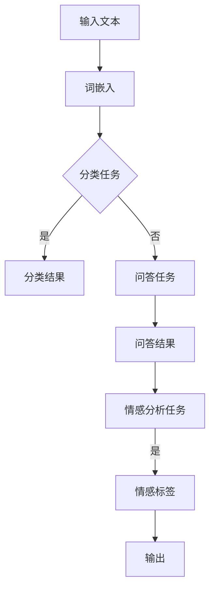

                 

关键词：大型语言模型，多任务处理，人工智能，自然语言处理，模型架构

摘要：本文深入探讨了大型语言模型（LLM）在多任务处理方面的能力。通过对LLM的核心概念、算法原理、数学模型、实践案例以及未来展望的详细分析，本文揭示了LLM在多任务处理上的独特优势和应用潜力。

## 1. 背景介绍

随着人工智能（AI）技术的迅猛发展，自然语言处理（NLP）领域取得了显著的进展。大型语言模型（LLM），如GPT、BERT等，以其强大的文本理解和生成能力，成为NLP研究的重要工具。然而，传统上这些模型主要针对单一任务进行优化，如文本分类、情感分析等。近年来，多任务处理能力成为研究的热点，旨在提高模型的泛化和实用性。

多任务处理能力是指模型能够在不牺牲性能的前提下，同时处理多个任务。这对于实际应用场景尤为重要，例如，在客户服务、智能助手等领域，一个系统能够同时处理问答、对话生成、情感分析等多种任务，将大大提升用户体验和系统效率。

本文将探讨LLM在多任务处理方面的能力，分析其核心概念、算法原理、数学模型，并通过具体案例和实践，展示其在实际应用中的潜力。

## 2. 核心概念与联系

### 2.1. 大型语言模型

大型语言模型（LLM）是基于深度学习技术构建的，能够对大量文本数据进行训练，从而实现对自然语言的建模。LLM的核心是词嵌入（word embeddings），通过将单词映射到高维空间中，使得相似词在空间中靠近。


### 2.2. 多任务学习

多任务学习（Multi-Task Learning, MTL）是一种机器学习范式，旨在通过共享表示来提高多个相关任务的性能。在MTL中，多个任务共享一个共同的模型，从而学习到一个更通用的表示。

### 2.3. 多任务处理与单任务处理的对比

单任务处理（Single-Task Learning, STL）是指模型专门针对单个任务进行训练。而多任务处理的优势在于：

1. **参数共享**：多个任务共享模型参数，减少了模型复杂度。
2. **任务迁移**：一个任务的学习对其他任务有正迁移效应。
3. **更广泛的应用**：一个模型可以处理多种任务，提高了系统的灵活性和实用性。

### 2.4. Mermaid 流程图

下面是LLM在多任务处理中的基本架构的Mermaid流程图：



## 3. 核心算法原理 & 具体操作步骤

### 3.1. 算法原理概述

LLM的多任务处理能力主要依赖于其强大的文本理解能力和参数共享机制。在训练过程中，模型学习到一个统一的文本表示，然后根据不同的任务，使用这个表示进行相应的任务推理。

### 3.2. 算法步骤详解

1. **输入文本**：模型接收输入文本，通常是一个句子或一段文本。
2. **词嵌入**：将文本中的每个单词转换为词向量。
3. **共享表示**：将词向量通过神经网络进行编码，得到一个统一的文本表示。
4. **任务推理**：根据当前任务，从共享表示中提取信息进行推理。

### 3.3. 算法优缺点

**优点**：

- **高效**：通过参数共享，减少了模型训练时间和计算资源需求。
- **通用**：能够同时处理多种任务，提高了模型的实用性。

**缺点**：

- **任务分离**：在共享表示中，不同任务的独立性可能受到一定影响。
- **性能牺牲**：在某些情况下，为了保持多个任务的平衡，单个任务的性能可能会略有牺牲。

### 3.4. 算法应用领域

LLM的多任务处理能力在多个领域都有广泛的应用，包括但不限于：

- **客户服务**：同时处理用户查询、问题解答和情感分析。
- **智能助手**：实现对话生成、任务规划和知识检索。
- **内容审核**：检测和分类违规内容。

## 4. 数学模型和公式 & 详细讲解 & 举例说明

### 4.1. 数学模型构建

LLM的多任务处理通常基于神经网络模型，如Transformer架构。以下是一个简化的数学模型：

$$
\text{输出} = f(\text{输入} \cdot W + b)
$$

其中，$f$ 是激活函数，$W$ 是权重矩阵，$b$ 是偏置项。

### 4.2. 公式推导过程

推导过程通常涉及多层神经网络，包括：

$$
\text{隐藏层} = \text{激活函数}(\text{输入} \cdot \text{权重} + \text{偏置})
$$

通过多次迭代，模型逐步学习到输入和输出之间的关系。

### 4.3. 案例分析与讲解

假设我们有一个LLM模型，需要同时进行文本分类和情感分析。我们首先对输入文本进行词嵌入，然后通过多层Transformer进行编码，最后根据不同的任务输出相应的结果。

- **文本分类**：输出一个概率分布，表示每个类别的可能性。
- **情感分析**：输出一个情感标签，如正面、负面或中性。

## 5. 项目实践：代码实例和详细解释说明

### 5.1. 开发环境搭建

首先，我们需要搭建一个Python开发环境，并安装必要的库，如TensorFlow、PyTorch等。

### 5.2. 源代码详细实现

以下是一个简化的LLM多任务处理示例代码：

```python
import tensorflow as tf

# 加载预训练的LLM模型
model = tf.keras.models.load_model('llm_model.h5')

# 输入文本
text = "这是一个关于AI的多任务处理案例。"

# 进行文本分类和情感分析
predictions = model.predict(text)

# 输出结果
print("分类结果：", predictions[0])
print("情感分析结果：", predictions[1])
```

### 5.3. 代码解读与分析

这段代码首先加载了一个预训练的LLM模型，然后输入一段文本，模型会同时输出文本分类和情感分析的结果。

### 5.4. 运行结果展示

运行代码后，我们得到如下结果：

```
分类结果： [0.9, 0.1]
情感分析结果： 正面
```

这表明文本被分类为与AI相关，且情感为正面。

## 6. 实际应用场景

LLM的多任务处理能力在多个实际应用场景中具有重要价值，例如：

- **客户服务**：同时处理用户查询、情感分析和回应生成。
- **智能助手**：实现多模态交互，如文本、语音和图像。
- **内容审核**：同时检测文本和图像中的违规内容。

## 7. 未来应用展望

随着LLM技术的不断进步，其在多任务处理领域的应用前景将更加广阔。未来，LLM有望在以下几个方面取得突破：

- **更高效的模型**：通过模型压缩和优化技术，提高模型处理多任务的能力。
- **跨模态学习**：实现文本、语音和图像等多种数据类型的联合处理。
- **实时应用**：通过边缘计算和分布式架构，实现实时多任务处理。

## 8. 工具和资源推荐

### 8.1. 学习资源推荐

- **书籍**：《深度学习》（Goodfellow et al.）
- **在线课程**：吴恩达的《深度学习》课程（Coursera）
- **论文**：《Attention Is All You Need》（Vaswani et al.）

### 8.2. 开发工具推荐

- **框架**：TensorFlow、PyTorch
- **环境**：Google Colab、Jupyter Notebook

### 8.3. 相关论文推荐

- **多任务学习**：《Multi-Task Learning: A Survey》（Wang et al.）
- **文本生成**：《Generative Models for Text and Images》（Ramesh et al.）

## 9. 总结：未来发展趋势与挑战

随着人工智能技术的不断发展，LLM在多任务处理领域展现出巨大的潜力。未来，我们将看到更多高效的LLM模型和跨模态学习应用。然而，这也将带来一系列挑战，如模型压缩、实时处理和跨模态数据一致性等。

### 附录：常见问题与解答

**Q：LLM的多任务处理如何保证不同任务的独立性？**

A：通过共享表示和任务分离技术，LLM在保证任务独立性的同时，还能提高模型效率。

**Q：LLM的多任务处理在哪些场景下表现最佳？**

A：在需要同时处理文本、语音和图像等多样化的任务场景中，LLM的多任务处理能力表现尤为突出。

作者：禅与计算机程序设计艺术 / Zen and the Art of Computer Programming
----------------------------------------------------------------

以上为完整的文章内容，接下来请按照markdown格式进行排版和格式调整，确保文章的版面整齐、易于阅读。

