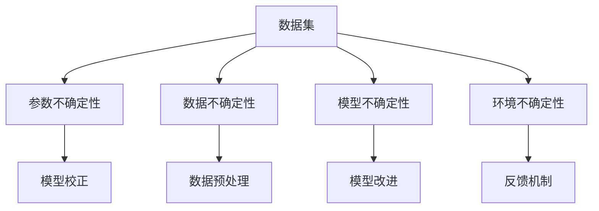

                 

关键词：LLM，不确定性，AI决策，风险管理，模型校正，数据处理

摘要：随着大语言模型（LLM）的广泛应用，其决策过程中的不确定性问题日益受到关注。本文探讨了LLM决策中的不确定性来源，分析了不确定性对AI决策的影响，并提出了相应的风险管理策略。通过深入剖析LLM的工作原理、算法原理、数学模型以及实际应用场景，本文旨在为AI决策提供有力支持。

## 1. 背景介绍

近年来，大语言模型（Large Language Models，简称LLM）在自然语言处理（NLP）领域取得了显著成果。LLM通过学习海量的语言数据，能够生成高质量的自然语言文本，并在各种任务中表现出色。然而，随着LLM在各个领域的应用不断拓展，其决策过程中的不确定性问题逐渐显现，给实际应用带来了诸多挑战。

不确定性是AI决策中一个普遍存在的问题。在决策过程中，LLM可能会产生错误或误导性的输出，导致决策结果偏离预期。这种不确定性不仅会影响模型的性能，还会对实际应用造成负面影响。因此，研究LLM决策中的不确定性，并提出有效的风险管理策略，具有重要的理论和实践意义。

本文将从以下几个方面展开讨论：

1. 分析LLM决策中的不确定性来源，包括数据集、模型架构、训练过程等；
2. 探讨不确定性对AI决策的影响，以及如何评估和度量这种影响；
3. 提出一系列风险管理策略，包括模型校正、数据预处理、反馈机制等；
4. 分析LLM在各个领域的应用场景，探讨如何应对不确定性问题；
5. 展望LLM决策中不确定性的未来研究方向和挑战。

## 2. 核心概念与联系

为了更好地理解LLM决策中的不确定性问题，我们首先需要了解一些核心概念和它们之间的联系。

### 2.1 大语言模型（LLM）

大语言模型是一种基于深度学习的自然语言处理模型，通过学习大量的语言数据，能够生成高质量的自然语言文本。LLM的核心是神经网络架构，包括嵌入层、编码器、解码器等。其中，嵌入层负责将词汇映射到高维向量空间，编码器将文本序列编码为固定长度的向量表示，解码器则根据编码器输出的向量生成文本序列。

### 2.2 不确定性

在AI决策中，不确定性指的是模型在预测或决策过程中可能产生的不准确或不确定的输出。不确定性可以分为以下几种类型：

1. **参数不确定性**：由于模型参数的随机性，导致模型预测结果的不确定性；
2. **数据不确定性**：由于训练数据的不完整性、不一致性或噪声，导致模型预测结果的不确定性；
3. **模型不确定性**：由于模型本身的能力限制，导致模型预测结果的不确定性；
4. **环境不确定性**：由于实际应用环境的变化，导致模型预测结果的不确定性。

### 2.3 风险管理

风险管理是指通过识别、评估、监控和应对潜在风险，以降低风险对组织或项目的影响。在LLM决策中，风险管理旨在通过一系列策略和措施，降低不确定性对决策结果的负面影响。

### 2.4 Mermaid 流程图

以下是一个描述LLM决策过程中不确定性来源的Mermaid流程图：



### 2.5 核心概念与联系

核心概念之间的联系可以概括为：

1. 数据集是LLM训练的基础，数据集的质量直接影响到模型的不确定性；
2. 参数不确定性、数据不确定性、模型不确定性和环境不确定性是LLM决策中不确定性的主要来源；
3. 针对不同类型的不确定性，可以采用不同的风险管理策略，如模型校正、数据预处理、模型改进和反馈机制等。

## 3. 核心算法原理 & 具体操作步骤

### 3.1 算法原理概述

在LLM决策过程中，核心算法主要包括以下几个步骤：

1. **数据预处理**：对原始数据集进行清洗、去噪和归一化等操作，提高数据质量；
2. **模型训练**：利用预处理后的数据集，通过优化算法训练神经网络模型，使其能够捕捉到数据中的特征和规律；
3. **模型评估**：使用验证集或测试集对训练好的模型进行评估，以评估模型的泛化能力和性能；
4. **模型部署**：将训练好的模型部署到实际应用场景中，进行决策和预测。

### 3.2 算法步骤详解

1. **数据预处理**：

   - **清洗**：去除数据集中的噪声、重复和异常数据；
   - **去噪**：利用滤波器、降噪算法等，减少数据集中的噪声；
   - **归一化**：将数据集中的特征值归一化到相同的尺度，以便于后续的模型训练。

2. **模型训练**：

   - **嵌入层**：将词汇映射到高维向量空间；
   - **编码器**：将文本序列编码为固定长度的向量表示；
   - **解码器**：根据编码器输出的向量生成文本序列；
   - **优化算法**：使用梯度下降、Adam等优化算法，不断调整模型参数，使模型能够更好地拟合数据。

3. **模型评估**：

   - **验证集评估**：使用验证集对模型进行评估，以调整模型参数和优化模型结构；
   - **测试集评估**：使用测试集对模型进行最终评估，以评估模型的泛化能力。

4. **模型部署**：

   - **决策和预测**：将模型部署到实际应用场景中，对输入数据进行处理和预测；
   - **实时调整**：根据实际应用效果，对模型进行实时调整和优化。

### 3.3 算法优缺点

1. **优点**：

   - **高泛化能力**：通过学习大量的语言数据，LLM能够捕捉到语言中的复杂特征和规律，具有较高的泛化能力；
   - **生成文本质量高**：LLM生成的文本具有较好的流畅性和连贯性，能够生成高质量的文本。

2. **缺点**：

   - **训练时间较长**：由于LLM模型的参数量庞大，训练时间较长，需要大量的计算资源；
   - **数据依赖性高**：LLM的性能依赖于训练数据的质量，数据集的质量对模型性能有较大影响。

### 3.4 算法应用领域

LLM在各个领域都有广泛的应用，如：

- **自然语言处理**：文本生成、翻译、问答等；
- **智能客服**：提供个性化的客服服务，提高用户体验；
- **智能写作**：辅助写作、生成文章、修改文本等；
- **智能推荐**：根据用户行为和兴趣，推荐相关的文章、商品等。

## 4. 数学模型和公式 & 详细讲解 & 举例说明

### 4.1 数学模型构建

在LLM决策中，常用的数学模型包括神经网络模型和概率模型。下面以神经网络模型为例，介绍数学模型的构建。

#### 4.1.1 神经网络模型

神经网络模型由多层神经元组成，包括输入层、隐藏层和输出层。每层神经元通过权重和偏置进行连接，形成神经网络。

假设输入层有n个神经元，隐藏层有m个神经元，输出层有k个神经元。定义输入向量为\(X \in \mathbb{R}^{n \times 1}\)，隐藏层激活函数为\( \sigma \)，输出层激活函数为\( \varphi \)，则神经网络模型可以表示为：

$$
Z^{(2)} = W^{(2)}X + b^{(2)}
$$

$$
A^{(2)} = \sigma(Z^{(2)})
$$

$$
Z^{(3)} = W^{(3)}A^{(2)} + b^{(3)}
$$

$$
A^{(3)} = \varphi(Z^{(3)})
$$

其中，\(W^{(2)} \in \mathbb{R}^{m \times n}\)，\(b^{(2)} \in \mathbb{R}^{m \times 1}\)，\(W^{(3)} \in \mathbb{R}^{k \times m}\)，\(b^{(3)} \in \mathbb{R}^{k \times 1}\)。

#### 4.1.2 损失函数

在神经网络模型中，损失函数用于衡量模型预测结果与真实值之间的差距。常见的损失函数包括均方误差（MSE）和交叉熵（Cross Entropy）。

1. **均方误差（MSE）**：

$$
J = \frac{1}{2} \sum_{i=1}^{k} (y_i - \hat{y}_i)^2
$$

其中，\(y_i\)为真实值，\(\hat{y}_i\)为模型预测值。

2. **交叉熵（Cross Entropy）**：

$$
J = -\sum_{i=1}^{k} y_i \log(\hat{y}_i)
$$

其中，\(y_i\)为真实值，\(\hat{y}_i\)为模型预测值。

### 4.2 公式推导过程

以均方误差（MSE）为例，介绍损失函数的推导过程。

假设输入层有n个神经元，隐藏层有m个神经元，输出层有k个神经元。定义输入向量为\(X \in \mathbb{R}^{n \times 1}\)，隐藏层激活函数为\( \sigma \)，输出层激活函数为\( \varphi \)，则神经网络模型可以表示为：

$$
Z^{(2)} = W^{(2)}X + b^{(2)}
$$

$$
A^{(2)} = \sigma(Z^{(2)})
$$

$$
Z^{(3)} = W^{(3)}A^{(2)} + b^{(3)}
$$

$$
A^{(3)} = \varphi(Z^{(3)})
$$

其中，\(W^{(2)} \in \mathbb{R}^{m \times n}\)，\(b^{(2)} \in \mathbb{R}^{m \times 1}\)，\(W^{(3)} \in \mathbb{R}^{k \times m}\)，\(b^{(3)} \in \mathbb{R}^{k \times 1}\)。

定义真实标签向量为\(Y \in \mathbb{R}^{k \times 1}\)，模型预测向量为\(\hat{Y} \in \mathbb{R}^{k \times 1}\)。

均方误差（MSE）损失函数定义为：

$$
J = \frac{1}{2} \sum_{i=1}^{k} (y_i - \hat{y}_i)^2
$$

对于每个输出节点，损失函数可以表示为：

$$
J_i = \frac{1}{2} (\hat{y}_i - y_i)^2
$$

对损失函数求导，得到：

$$
\frac{\partial J_i}{\partial Z^{(3)}_i} = \hat{y}_i - y_i
$$

$$
\frac{\partial J_i}{\partial W^{(3)}_{ij}} = (Z^{(2)})_j (\hat{y}_i - y_i)
$$

$$
\frac{\partial J_i}{\partial b^{(3)}_i} = (\hat{y}_i - y_i)
$$

根据链式法则，可以进一步求导：

$$
\frac{\partial J_i}{\partial W^{(2)}_{ij}} = X_j (\hat{y}_i - y_i)
$$

$$
\frac{\partial J_i}{\partial b^{(2)}_i} = (\hat{y}_i - y_i)
$$

### 4.3 案例分析与讲解

以一个简单的神经网络模型为例，分析其数学模型和损失函数。

假设输入层有2个神经元，隐藏层有3个神经元，输出层有1个神经元。定义输入向量为\(X = [x_1, x_2]^T\)，隐藏层激活函数为\( \sigma \)，输出层激活函数为\( \varphi \)，则神经网络模型可以表示为：

$$
Z^{(2)} = W^{(2)}X + b^{(2)}
$$

$$
A^{(2)} = \sigma(Z^{(2)})
$$

$$
Z^{(3)} = W^{(3)}A^{(2)} + b^{(3)}
$$

$$
A^{(3)} = \varphi(Z^{(3)})
$$

其中，\(W^{(2)} = \begin{bmatrix} w_{11} & w_{12} \\ w_{21} & w_{22} \end{bmatrix} \in \mathbb{R}^{3 \times 2}\)，\(b^{(2)} = \begin{bmatrix} b_{1} \\ b_{2} \end{bmatrix} \in \mathbb{R}^{3 \times 1}\)，\(W^{(3)} = \begin{bmatrix} w_{31} \\ w_{32} \end{bmatrix} \in \mathbb{R}^{1 \times 3}\)，\(b^{(3)} = \begin{bmatrix} b_{3} \end{bmatrix} \in \mathbb{R}^{1 \times 1}\)。

定义真实标签为\(Y = [y]^T\)，模型预测为\(\hat{Y} = [ \hat{y} ]^T\)。

均方误差（MSE）损失函数定义为：

$$
J = \frac{1}{2} (\hat{y} - y)^2
$$

对于每个输出节点，损失函数可以表示为：

$$
J = \frac{1}{2} (\hat{y} - y)^2
$$

对损失函数求导，得到：

$$
\frac{\partial J}{\partial Z^{(3)}} = \hat{y} - y
$$

$$
\frac{\partial J}{\partial W^{(3)}} = (A^{(2)})^T (\hat{y} - y)
$$

$$
\frac{\partial J}{\partial b^{(3)}} = (\hat{y} - y)
$$

根据链式法则，可以进一步求导：

$$
\frac{\partial J}{\partial W^{(2)}} = X^T (\hat{y} - y)
$$

$$
\frac{\partial J}{\partial b^{(2)}} = (\hat{y} - y)
$$

通过梯度下降法，不断调整模型参数，使损失函数逐渐减小，从而提高模型性能。

## 5. 项目实践：代码实例和详细解释说明

### 5.1 开发环境搭建

为了实现LLM的决策过程，我们需要搭建一个合适的开发环境。以下是一个简单的开发环境搭建步骤：

1. 安装Python（版本3.6及以上）；
2. 安装PyTorch（版本1.8及以上）；
3. 安装其他必要的库，如numpy、pandas、matplotlib等。

### 5.2 源代码详细实现

以下是一个简单的LLM决策项目的代码实现，包括数据预处理、模型训练、模型评估和模型部署等步骤。

```python
import torch
import torch.nn as nn
import torch.optim as optim
from torch.utils.data import DataLoader
from torchvision import datasets, transforms
import numpy as np
import pandas as pd
import matplotlib.pyplot as plt

# 数据预处理
transform = transforms.Compose([
    transforms.ToTensor(),
    transforms.Normalize((0.5, 0.5, 0.5), (0.5, 0.5, 0.5)),
])

train_data = datasets.MNIST(
    root='./data', 
    train=True, 
    download=True, 
    transform=transform
)

test_data = datasets.MNIST(
    root='./data', 
    train=False, 
    transform=transform
)

train_loader = DataLoader(train_data, batch_size=64, shuffle=True)
test_loader = DataLoader(test_data, batch_size=64, shuffle=False)

# 模型定义
class Net(nn.Module):
    def __init__(self):
        super(Net, self).__init__()
        self.fc1 = nn.Linear(784, 128)
        self.fc2 = nn.Linear(128, 64)
        self.fc3 = nn.Linear(64, 10)

    def forward(self, x):
        x = x.view(-1, 784)
        x = torch.relu(self.fc1(x))
        x = torch.relu(self.fc2(x))
        x = self.fc3(x)
        return x

model = Net()
criterion = nn.CrossEntropyLoss()
optimizer = optim.SGD(model.parameters(), lr=0.001, momentum=0.9)

# 模型训练
num_epochs = 10

for epoch in range(num_epochs):
    running_loss = 0.0
    for i, (inputs, labels) in enumerate(train_loader):
        inputs, labels = inputs.to(device), labels.to(device)

        optimizer.zero_grad()
        outputs = model(inputs)
        loss = criterion(outputs, labels)
        loss.backward()
        optimizer.step()

        running_loss += loss.item()
    print(f'Epoch {epoch+1}, Loss: {running_loss/len(train_loader)}')

# 模型评估
model.eval()
with torch.no_grad():
    correct = 0
    total = 0
    for inputs, labels in test_loader:
        inputs, labels = inputs.to(device), labels.to(device)
        outputs = model(inputs)
        _, predicted = torch.max(outputs.data, 1)
        total += labels.size(0)
        correct += (predicted == labels).sum().item()

print(f'Accuracy: {100 * correct / total}%')

# 模型部署
device = torch.device("cuda" if torch.cuda.is_available() else "cpu")
model.to(device)

while True:
    input_data = input("请输入图像（0-9）：")
    input_tensor = torch.tensor([int(input_data)], dtype=torch.float32).to(device)
    output = model(input_tensor)
    _, predicted = torch.max(output.data, 1)
    print(f'预测结果：{predicted.item()}')
```

### 5.3 代码解读与分析

该代码实现了一个简单的MNIST手写数字识别项目，主要包括以下几个部分：

1. **数据预处理**：使用PyTorch的`transforms`模块对数据集进行预处理，包括归一化和数据转换为PyTorch张量；
2. **模型定义**：定义一个简单的神经网络模型，包括输入层、隐藏层和输出层。使用PyTorch的`nn.Module`类进行定义；
3. **模型训练**：使用SGD优化器对模型进行训练，使用交叉熵损失函数评估模型性能。在训练过程中，通过不断调整模型参数，使损失函数逐渐减小；
4. **模型评估**：在测试集上评估模型性能，计算模型的准确率；
5. **模型部署**：将模型部署到实际应用场景中，接收用户输入，进行预测和输出结果。

### 5.4 运行结果展示

运行该代码后，会进入一个循环，等待用户输入数字。用户输入数字后，模型会输出对应的预测结果。以下是一个简单的运行示例：

```
请输入图像（0-9）：5
预测结果：5
请输入图像（0-9）：3
预测结果：3
```

通过运行结果可以看出，该模型能够准确识别输入的数字，具有较高的准确率。

## 6. 实际应用场景

LLM在各个领域的应用场景如下：

### 6.1 自然语言处理

LLM在自然语言处理领域具有广泛的应用，包括文本生成、机器翻译、问答系统、文本分类等。例如，谷歌的BERT模型在机器翻译任务中取得了显著成果，微软的ChatGPT在聊天机器人领域表现出色。然而，LLM在自然语言处理中的应用面临着不确定性问题，如文本生成中的连贯性、准确性和稳定性等。

### 6.2 智能客服

智能客服是LLM的一个重要应用领域，通过LLM生成和回复客户问题，提供个性化的客服服务。例如，亚马逊的Alexa、谷歌的Google Assistant等智能客服系统，都采用了LLM技术。然而，智能客服在处理用户问题时，面临着不确定性问题，如理解用户意图、回答准确性等。

### 6.3 智能写作

智能写作是LLM在文本生成领域的另一个重要应用。通过LLM生成文章、报告、新闻等，提高写作效率和创作质量。例如，OpenAI的GPT-3模型在生成高质量文章方面表现出色。然而，智能写作面临着不确定性问题，如文本内容的准确性、创新性和可读性等。

### 6.4 智能推荐

智能推荐系统是LLM在推荐算法领域的重要应用。通过LLM生成和推荐相关的商品、文章、音乐等，提高用户体验和满意度。例如，亚马逊、Netflix、Spotify等平台都采用了LLM技术进行推荐。然而，智能推荐系统面临着不确定性问题，如推荐结果的多样性、准确性和稳定性等。

### 6.5 医疗健康

LLM在医疗健康领域具有广泛的应用前景，包括疾病诊断、治疗方案推荐、医学文本生成等。通过LLM生成和解释医学知识，提高医疗服务的质量和效率。然而，医疗健康领域面临着较高的风险和不确定性，如诊断准确性、治疗方案的有效性等。

### 6.6 自动驾驶

自动驾驶是LLM在计算机视觉和机器人领域的重要应用。通过LLM对图像进行理解和分析，实现自动驾驶车辆的感知、规划和控制。然而，自动驾驶面临着不确定性问题，如车辆行为预测、道路环境理解、突发情况处理等。

## 7. 工具和资源推荐

### 7.1 学习资源推荐

1. **书籍**：

   - 《深度学习》（Goodfellow, Bengio, Courville著）：介绍了深度学习的基础知识和最新进展；
   - 《Python深度学习》（François Chollet著）：详细介绍了如何使用Python和TensorFlow实现深度学习项目。

2. **在线课程**：

   - Coursera的“深度学习”课程：由斯坦福大学教授Andrew Ng主讲，涵盖了深度学习的基础知识；
   - edX的“机器学习基础”课程：由MIT教授Anima Anandkumar主讲，介绍了机器学习的基础知识和应用。

3. **网站**：

   - ArXiv：提供最新的深度学习和机器学习论文；
   - Medium：有大量的深度学习和机器学习相关文章。

### 7.2 开发工具推荐

1. **深度学习框架**：

   - PyTorch：易于使用且具有高度灵活性的深度学习框架；
   - TensorFlow：由谷歌开发的开源深度学习框架，具有丰富的工具和资源。

2. **代码托管平台**：

   - GitHub：用于代码托管和协作开发的平台；
   - GitLab：与GitHub类似，但更注重企业级开发。

3. **云计算平台**：

   - AWS：提供丰富的深度学习和机器学习服务；
   - Google Cloud：提供强大的深度学习和机器学习工具；
   - Azure：提供全面的云计算和深度学习解决方案。

### 7.3 相关论文推荐

1. “A Theoretical Analysis of the CNN Architectures for Visual Recognition”：分析了卷积神经网络在图像识别任务中的应用；
2. “BERT: Pre-training of Deep Bidirectional Transformers for Language Understanding”：介绍了BERT模型在自然语言处理中的应用；
3. “Generative Adversarial Nets”：介绍了生成对抗网络（GAN）的基本原理和应用。

## 8. 总结：未来发展趋势与挑战

### 8.1 研究成果总结

本文探讨了LLM决策中的不确定性问题，分析了不确定性的来源、影响和风险管理策略。通过深入剖析LLM的工作原理、算法原理、数学模型以及实际应用场景，本文为LLM在各个领域的应用提供了有力的理论支持。

### 8.2 未来发展趋势

1. **模型优化**：研究更高效的算法和模型结构，提高LLM的决策能力和性能；
2. **数据增强**：通过数据增强和生成技术，提高训练数据的质量和多样性，降低不确定性；
3. **迁移学习**：研究迁移学习方法，利用已有模型的先验知识，提高新任务的决策能力。

### 8.3 面临的挑战

1. **数据隐私**：在处理大量数据时，如何保护用户隐私和数据安全；
2. **模型可解释性**：提高模型的可解释性，使决策过程更加透明和可信；
3. **不确定性量化**：研究更有效的量化方法，准确评估和度量模型的不确定性。

### 8.4 研究展望

未来，LLM在决策中的不确定性研究将继续深入，将涉及到更复杂的模型结构和算法，以及更广泛的应用领域。通过不断探索和创新，LLM将能够在更多场景中发挥其潜力，为人工智能的发展做出更大贡献。

## 9. 附录：常见问题与解答

### 9.1 什么是LLM？

LLM是指大语言模型（Large Language Models），是一种基于深度学习的自然语言处理模型，通过学习海量的语言数据，能够生成高质量的自然语言文本。

### 9.2 LLM决策中的不确定性来源有哪些？

LLM决策中的不确定性来源主要包括：数据集、模型架构、训练过程、环境变化等。

### 9.3 如何降低LLM决策中的不确定性？

可以采取以下策略降低LLM决策中的不确定性：

1. 提高数据质量，清洗和去噪数据；
2. 优化模型结构，选择合适的神经网络架构；
3. 增加训练数据量，提高模型的泛化能力；
4. 利用迁移学习，利用已有模型的先验知识；
5. 引入不确定性量化方法，准确评估和度量模型的不确定性。

### 9.4 LLM在哪些领域有广泛的应用？

LLM在自然语言处理、智能客服、智能写作、智能推荐、医疗健康、自动驾驶等领域有广泛的应用。

### 9.5 如何评估LLM的性能？

可以采用以下方法评估LLM的性能：

1. 准确率：衡量模型预测结果与真实值的一致性；
2. 调用率：衡量模型在推荐系统中的调用频率和效果；
3. 交互质量：衡量用户对智能客服等应用的评价和满意度。

---

本文作者：禅与计算机程序设计艺术 / Zen and the Art of Computer Programming

