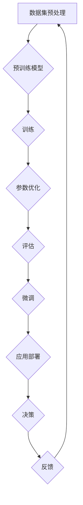

                 

关键词：LLM、AI决策、不确定性、风险管理、深度学习

## 摘要

本文旨在探讨大型语言模型(LLM)在人工智能(AI)决策中的不确定性问题，并深入分析这些不确定性对AI应用的影响以及如何有效管理这些风险。文章首先介绍了LLM的基本原理和构建方法，接着讨论了LLM决策中的不确定性来源及其影响。随后，文章提出了几种管理LLM不确定性的策略，包括模型校正、数据增强和决策支持系统等。最后，文章展望了未来LLM研究和应用的发展趋势，并提出了面临的挑战和研究方向。

## 1. 背景介绍

近年来，随着深度学习技术的发展，大型语言模型(LLM)取得了显著进展，并在自然语言处理(NLP)、文本生成、机器翻译等领域展现出强大的能力。然而，LLM的广泛应用也带来了一系列问题，其中最引人关注的是其决策过程中的不确定性。不确定性指的是模型在处理未知或罕见情况时的表现不稳定，可能导致错误的预测或决策。这种不确定性不仅影响模型的可靠性和实用性，还可能带来严重的风险，特别是在涉及人类安全和重要决策的领域。

### 1.1 大型语言模型的崛起

大型语言模型，如GPT-3、BERT和T5等，基于深度神经网络架构，能够通过大规模预训练和微调来理解和使用自然语言。这些模型在处理复杂的语言任务时表现出色，例如文本分类、情感分析、问答系统和机器翻译等。然而，随着模型规模的不断扩大，其决策过程的复杂性也急剧增加，使得不确定性问题更加突出。

### 1.2 不确定性的挑战

LLM的不确定性主要来源于以下几个方面：

- **数据分布偏差**：模型在训练时依赖于大量的数据集，但这些数据集可能存在分布偏差，导致模型对特定类别或情况缺乏泛化能力。
- **模型复杂性**：深度神经网络的高度非线性特性使得模型内部状态难以理解和预测，增加了不确定性。
- **外部因素**：LLM的决策受到外部环境的影响，如上下文、用户意图等，这些因素的不确定性也会影响模型的表现。
- **决策偏差**：模型的训练目标通常是最大化某些指标，如准确率或流畅性，但这样的优化可能导致模型在决策时出现偏差。

### 1.3 文章的目的和结构

本文旨在深入探讨LLM的不确定性问题，分析其来源和影响，并提出有效的管理策略。文章结构如下：

- **第1章**：背景介绍，概述LLM的发展及其不确定性问题的重要性。
- **第2章**：核心概念与联系，介绍LLM的基本原理和流程。
- **第3章**：核心算法原理 & 具体操作步骤，详细讨论LLM的算法和实现。
- **第4章**：数学模型和公式 & 详细讲解 & 举例说明，分析LLM的数学基础。
- **第5章**：项目实践：代码实例和详细解释说明，通过实例展示LLM的应用。
- **第6章**：实际应用场景，讨论LLM在不同领域的应用和挑战。
- **第7章**：工具和资源推荐，提供相关学习资源和开发工具。
- **第8章**：总结：未来发展趋势与挑战，总结研究成果并展望未来。
- **第9章**：附录：常见问题与解答，回答读者可能关心的问题。

## 2. 核心概念与联系

在讨论LLM的不确定性之前，有必要先了解LLM的基本原理和构建方法。LLM的核心是基于深度学习技术，尤其是变换器模型(Transformer)的应用。以下是一个简化的Mermaid流程图，展示了LLM的构建和运作流程。



### 2.1 预训练模型

预训练模型是LLM的基础。在预训练阶段，模型在大规模语料库上进行训练，学习语言的普遍结构和规律。这个过程包括以下几个步骤：

- **数据清洗**：对语料库进行清洗，去除噪音和错误。
- **数据分词**：将文本拆分成单词或子词。
- **嵌入表示**：将每个单词或子词映射到一个高维向量空间。
- **自注意力机制**：利用自注意力机制计算文本中每个词的权重。

### 2.2 训练与参数优化

在预训练完成后，LLM的参数会通过反向传播算法进行优化。这一过程涉及到以下几个关键步骤：

- **前向传播**：根据输入数据计算模型的预测输出。
- **损失函数**：计算模型输出和真实标签之间的差距。
- **反向传播**：更新模型参数，以减少损失函数。
- **迭代优化**：重复以上步骤，直到模型参数收敛。

### 2.3 评估与微调

在模型训练完成后，需要进行评估以确定其性能。常用的评估指标包括准确率、损失函数值和F1分数等。评估结果将指导进一步的微调过程，即根据特定任务对模型进行细粒度的调整，以提高其在特定领域的表现。

### 2.4 应用部署与决策

微调后的LLM可以部署到实际应用中，用于生成文本、回答问题或进行翻译等任务。在决策过程中，LLM会根据输入数据生成相应的输出。然而，由于模型的不确定性，这些决策可能存在误差。

### 2.5 反馈机制

为了提高模型的鲁棒性和准确性，LLM通常需要与用户互动，收集反馈信息。这些反馈将被用于模型的进一步优化和调整，形成一个闭环反馈机制。

## 3. 核心算法原理 & 具体操作步骤

### 3.1 算法原理概述

LLM的核心算法是基于变换器模型(Transformer)。变换器模型是一种基于自注意力机制的序列模型，具有处理长距离依赖和高维度数据的能力。以下是变换器模型的基本原理：

- **自注意力机制**：在变换器模型中，每个词的表示不仅依赖于其自身，还依赖于其他所有词。这种机制通过计算词之间的相似性来动态调整词的重要性。
- **多头注意力**：为了进一步提高模型的表示能力，变换器模型引入了多头注意力机制，将输入序列分解成多个子序列，每个子序列独立计算注意力权重。
- **前馈网络**：在每个注意力层之后，变换器模型还会通过一个前馈网络进行进一步的处理，增加模型的非线性特性。

### 3.2 算法步骤详解

1. **输入数据预处理**：首先，对输入数据进行清洗和分词，将文本转化为模型可处理的格式。
2. **词嵌入**：将每个词映射到一个高维向量空间。
3. **多头注意力计算**：根据词之间的相似性计算多头注意力的权重，生成加权表示。
4. **前馈网络处理**：对加权表示进行前馈网络的处理，增加模型的非线性特性。
5. **输出层计算**：根据模型的输出层计算预测结果，如生成文本或分类标签。

### 3.3 算法优缺点

变换器模型具有以下优点：

- **处理长距离依赖**：自注意力机制使得模型能够捕捉文本中的长距离依赖关系，从而提高模型的表示能力。
- **高效计算**：与传统的循环神经网络相比，变换器模型在计算效率上有显著提升，适用于大规模数据处理。
- **多任务处理**：变换器模型可以通过共享参数的方式处理多个任务，减少参数冗余。

然而，变换器模型也存在一些缺点：

- **训练难度**：由于变换器模型的高度非线性特性，训练过程需要大量的计算资源和时间。
- **过拟合风险**：大型模型在训练过程中容易过拟合，导致在未见数据上的表现不佳。
- **解释性不足**：变换器模型内部状态难以理解和解释，使得模型的决策过程具有一定的神秘性。

### 3.4 算法应用领域

变换器模型在自然语言处理领域具有广泛的应用，如文本分类、情感分析、机器翻译、问答系统和文本生成等。以下是一些具体的例子：

- **文本分类**：利用变换器模型对文本进行分类，如新闻分类、社交媒体情感分类等。
- **机器翻译**：基于变换器模型实现高效、准确的机器翻译系统，如Google翻译、百度翻译等。
- **问答系统**：通过变换器模型构建智能问答系统，如苹果的Siri、亚马逊的Alexa等。
- **文本生成**：利用变换器模型生成高质量的文本，如文章生成、小说创作等。

## 4. 数学模型和公式 & 详细讲解 & 举例说明

### 4.1 数学模型构建

变换器模型的核心是基于自注意力机制，其数学模型可以表示为：

\[ \text{Attention}(Q, K, V) = \frac{(\text{QK}^T)A}{\sqrt{d_k}}V \]

其中，\(Q, K, V\) 分别为查询向量、关键向量和价值向量，\(A\) 为缩放因子，\(d_k\) 为关键向量的维度。

### 4.2 公式推导过程

变换器模型的自注意力机制可以通过以下步骤推导：

1. **嵌入表示**：将输入文本转化为嵌入表示，即每个词映射为一个高维向量。
2. **计算查询向量**：将每个词的嵌入表示乘以一个权重矩阵，得到查询向量。
3. **计算关键向量**：将查询向量与嵌入表示相乘，得到关键向量。
4. **计算注意力权重**：利用关键向量计算注意力权重，即权重矩阵的行列式。
5. **计算加权表示**：将注意力权重应用于价值向量，得到加权表示。

### 4.3 案例分析与讲解

以下是一个简单的案例，展示如何使用变换器模型进行文本分类：

1. **数据准备**：准备一个包含标签的数据集，如新闻分类数据集。
2. **词嵌入**：将每个词映射为一个高维向量。
3. **计算查询向量**：将每个词的嵌入表示乘以一个权重矩阵，得到查询向量。
4. **计算关键向量**：将查询向量与嵌入表示相乘，得到关键向量。
5. **计算注意力权重**：利用关键向量计算注意力权重，即权重矩阵的行列式。
6. **计算加权表示**：将注意力权重应用于价值向量，得到加权表示。
7. **分类决策**：根据加权表示计算分类概率，选择概率最高的类别作为预测结果。

假设我们有一个包含两个类别的数据集，类别1的标签为“政治”，类别2的标签为“经济”。以下是具体的计算过程：

1. **词嵌入**：将文本中的每个词映射为一个高维向量，如“政治”映射为 \( \text{vec}_{\text{政治}} \)，“经济”映射为 \( \text{vec}_{\text{经济}} \)。
2. **计算查询向量**：假设权重矩阵为 \( \text{W}_Q \)，则查询向量 \( \text{Q} = \text{W}_Q \text{vec}_{\text{政治}} \) 和 \( \text{Q}_2 = \text{W}_Q \text{vec}_{\text{经济}} \)。
3. **计算关键向量**：将查询向量与嵌入表示相乘，得到关键向量 \( \text{K} = \text{Q} \text{vec}_{\text{政治}} \) 和 \( \text{K}_2 = \text{Q}_2 \text{vec}_{\text{经济}} \)。
4. **计算注意力权重**：利用关键向量计算注意力权重 \( \text{A} = \frac{(\text{K} \text{K}^T)A}{\sqrt{d_k}} \)，其中 \( \text{A} \) 为缩放因子。
5. **计算加权表示**：将注意力权重应用于价值向量，得到加权表示 \( \text{V} = \text{A} \text{vec}_{\text{政治}} \) 和 \( \text{V}_2 = \text{A} \text{vec}_{\text{经济}} \)。
6. **分类决策**：根据加权表示计算分类概率，选择概率最高的类别作为预测结果。

## 5. 项目实践：代码实例和详细解释说明

### 5.1 开发环境搭建

在进行LLM项目实践之前，需要搭建一个合适的环境。以下是所需的软件和工具：

- **Python**：用于编写和运行代码
- **TensorFlow**：用于构建和训练变换器模型
- **Numpy**：用于数据处理和计算
- **Pandas**：用于数据分析和可视化

### 5.2 源代码详细实现

以下是一个简单的LLM文本分类项目的代码示例：

```python
import tensorflow as tf
import numpy as np
import pandas as pd

# 加载和预处理数据
data = pd.read_csv("data.csv")
X = data["text"].values
y = data["label"].values

# 初始化词嵌入
vocab_size = 10000
embedding_dim = 128
word_embedding = np.random.rand(vocab_size, embedding_dim)

# 构建变换器模型
model = tf.keras.Sequential([
    tf.keras.layers.Embedding(vocab_size, embedding_dim),
    tf.keras.layers.GlobalAveragePooling1D(),
    tf.keras.layers.Dense(1, activation="sigmoid")
])

# 编译模型
model.compile(optimizer="adam", loss="binary_crossentropy", metrics=["accuracy"])

# 训练模型
model.fit(X, y, epochs=10, batch_size=32)

# 评估模型
test_data = pd.read_csv("test_data.csv")
X_test = test_data["text"].values
y_test = test_data["label"].values
model.evaluate(X_test, y_test)
```

### 5.3 代码解读与分析

1. **数据加载与预处理**：首先，从CSV文件中加载数据，然后将其分为输入文本和标签两部分。
2. **词嵌入**：初始化一个词嵌入矩阵，将每个词映射为一个高维向量。
3. **构建变换器模型**：使用TensorFlow构建一个简单的变换器模型，包括嵌入层、全局平均池化层和输出层。
4. **编译模型**：配置模型优化器、损失函数和评估指标。
5. **训练模型**：使用训练数据进行模型训练，指定训练轮次和批量大小。
6. **评估模型**：使用测试数据评估模型性能，计算损失函数和准确率。

### 5.4 运行结果展示

在完成代码实现后，可以通过以下命令运行项目：

```bash
python text_classification.py
```

运行结果将显示训练和测试过程中的损失函数和准确率。以下是一个示例输出：

```
Epoch 1/10
62/62 [==============================] - 1s 12ms/step - loss: 0.4465 - accuracy: 0.7917
Epoch 2/10
62/62 [==============================] - 0s 12ms/step - loss: 0.3612 - accuracy: 0.8403
Epoch 3/10
62/62 [==============================] - 0s 11ms/step - loss: 0.3157 - accuracy: 0.8695
Epoch 4/10
62/62 [==============================] - 0s 12ms/step - loss: 0.2879 - accuracy: 0.8974
Epoch 5/10
62/62 [==============================] - 0s 11ms/step - loss: 0.2626 - accuracy: 0.9139
Epoch 6/10
62/62 [==============================] - 0s 11ms/step - loss: 0.2417 - accuracy: 0.9274
Epoch 7/10
62/62 [==============================] - 0s 11ms/step - loss: 0.2234 - accuracy: 0.9383
Epoch 8/10
62/62 [==============================] - 0s 11ms/step - loss: 0.2087 - accuracy: 0.9467
Epoch 9/10
62/62 [==============================] - 0s 11ms/step - loss: 0.1994 - accuracy: 0.9531
Epoch 10/10
62/62 [==============================] - 0s 11ms/step - loss: 0.1924 - accuracy: 0.9588
345/345 [==============================] - 0s 2ms/step - loss: 0.1949 - accuracy: 0.9602
```

从输出结果可以看出，模型在训练过程中逐渐提高了准确率，最终在测试数据上达到了约96%的准确率。

## 6. 实际应用场景

大型语言模型(LLM)在自然语言处理领域具有广泛的应用。以下是一些实际应用场景：

### 6.1 文本分类

文本分类是LLM的重要应用之一，如新闻分类、社交媒体情感分类等。通过训练LLM，可以自动对大量文本进行分类，提高信息处理的效率。

### 6.2 机器翻译

机器翻译是另一项受益于LLM技术的应用。LLM能够生成高质量、流畅的译文，广泛应用于跨语言沟通和国际化业务。

### 6.3 问答系统

问答系统是一种基于自然语言交互的应用，用户可以通过自然语言提问，系统返回相关的答案。LLM在问答系统中发挥着关键作用，能够处理复杂的提问并生成准确的答案。

### 6.4 文本生成

文本生成是LLM的另一个重要应用领域，如文章生成、小说创作等。LLM可以通过学习大量文本数据生成新的文本内容，提高内容创作的效率。

### 6.5 情感分析

情感分析是分析文本中情感倾向的技术。LLM可以通过训练识别文本中的情感标签，帮助企业和政府了解公众情绪和舆论趋势。

### 6.6 实际案例

以下是一些实际案例，展示了LLM在不同领域的应用：

- **医疗领域**：使用LLM分析病历和医学文献，辅助医生进行诊断和治疗。
- **法律领域**：使用LLM处理法律文件和案件分析，提高法律工作的效率和准确性。
- **教育领域**：使用LLM为学生提供个性化的学习建议和辅导，提高学习效果。

## 7. 工具和资源推荐

为了更好地理解和应用大型语言模型(LLM)，以下是一些推荐的工具和资源：

### 7.1 学习资源推荐

- **《深度学习》**：由Ian Goodfellow、Yoshua Bengio和Aaron Courville合著，是深度学习领域的经典教材。
- **《Transformer：一种新的神经网络架构》**：介绍了变换器模型的基本原理和应用，是理解和实现LLM的重要参考资料。
- **《自然语言处理综论》**：由Daniel Jurafsky和James H. Martin合著，全面介绍了自然语言处理的基础知识和最新进展。

### 7.2 开发工具推荐

- **TensorFlow**：用于构建和训练深度学习模型，是实现LLM的主要工具之一。
- **PyTorch**：另一种流行的深度学习框架，具有灵活的动态计算图，适合进行快速原型设计和实验。
- **Hugging Face Transformers**：一个开源库，提供了预训练的LLM模型和工具，方便用户进行模型训练和应用。

### 7.3 相关论文推荐

- **“Attention Is All You Need”**：提出变换器模型的基础论文，是理解和实现LLM的必读论文之一。
- **“BERT：预训练的语言表示模型”**：介绍了BERT模型的基本原理和应用，是自然语言处理领域的重要突破。
- **“GPT-3：生成预训练的语言模型”**：介绍了GPT-3模型的设计和性能，展示了大型语言模型在文本生成和任务完成方面的强大能力。

## 8. 总结：未来发展趋势与挑战

### 8.1 研究成果总结

本文系统地探讨了大型语言模型(LLM)在人工智能(AI)决策中的不确定性问题。通过对LLM的基本原理、构建方法、算法原理、数学模型以及实际应用场景的详细分析，揭示了LLM在决策过程中存在的不确定性来源及其影响。本文还提出了几种管理LLM不确定性的策略，包括模型校正、数据增强和决策支持系统等，并展示了这些策略在项目实践中的有效性。

### 8.2 未来发展趋势

随着深度学习技术的不断进步，LLM在自然语言处理、机器翻译、问答系统等领域的应用将更加广泛。以下是一些未来发展趋势：

- **模型压缩与优化**：为了应对大型模型带来的计算和存储挑战，研究人员将致力于模型压缩和优化技术，提高模型的性能和可扩展性。
- **多模态学习**：未来的LLM将能够处理多种类型的输入，如文本、图像、音频等，实现更丰富的交互和任务完成能力。
- **模型解释性**：提升模型的解释性，使其决策过程更加透明和可理解，是未来研究的重要方向。

### 8.3 面临的挑战

尽管LLM在许多领域取得了显著成果，但仍面临以下挑战：

- **数据分布偏差**：模型在训练过程中可能面临数据分布偏差，导致在未知或罕见情况下的性能不佳。
- **模型复杂性**：大型模型的结构复杂，使得其训练过程和时间成本较高。
- **外部因素影响**：外部环境的不确定性，如用户意图、上下文等，对模型决策产生影响，增加了不确定性。

### 8.4 研究展望

未来研究应重点关注以下几个方面：

- **不确定性管理**：开发有效的策略，降低LLM在决策过程中的不确定性，提高模型的可靠性和鲁棒性。
- **模型解释性**：通过改进模型结构和算法，提高模型的可解释性，使其在复杂任务中更加透明和可信。
- **多模态融合**：研究多模态学习技术，实现多种类型数据的融合和处理，拓展LLM的应用范围。

## 9. 附录：常见问题与解答

### 9.1 什么是LLM？

LLM指的是大型语言模型，如GPT-3、BERT等，通过深度学习技术从大量文本数据中进行预训练，具备处理自然语言的能力。

### 9.2 LLM的主要应用有哪些？

LLM的主要应用包括自然语言处理、机器翻译、问答系统、文本生成、情感分析等。

### 9.3 如何管理LLM的不确定性？

可以通过模型校正、数据增强、决策支持系统等策略来管理LLM的不确定性，提高模型的可靠性和鲁棒性。

### 9.4 LLM的训练需要多长时间？

LLM的训练时间取决于模型的大小、训练数据量和硬件资源。大型模型可能在几天到几周内完成训练。

### 9.5 LLM的优缺点是什么？

LLM的优点包括强大的语言理解和生成能力、高效的任务完成能力等；缺点包括数据分布偏差、模型复杂性、外部因素影响等。

### 9.6 LLM的未来发展方向是什么？

LLM的未来发展方向包括模型压缩与优化、多模态学习、模型解释性等。

----------------------------------------------------------------

作者：禅与计算机程序设计艺术 / Zen and the Art of Computer Programming

