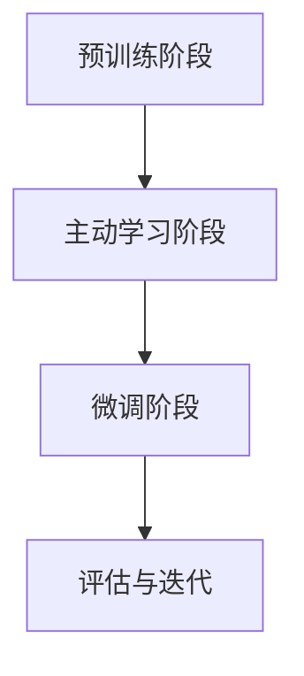

                 

关键词：大语言模型，主动学习，策略设计，应用场景，未来展望

> 摘要：随着深度学习技术的不断发展，大型语言模型（LLM）在自然语言处理领域取得了显著的成果。本文旨在探讨LLM的主动学习策略设计及其在实际应用中的效果，分析现有算法的优缺点，展望未来的发展趋势与挑战。

## 1. 背景介绍

近年来，深度学习技术在自然语言处理（NLP）领域取得了长足的进展，特别是在预训练模型方面。大型语言模型（LLM）如GPT-3、BERT等，凭借其强大的语义理解和生成能力，已经成为NLP任务中的核心技术。然而，LLM的训练过程通常需要大量的标注数据和高昂的计算资源，因此如何有效地利用有限的标注数据，提高训练效果，成为当前研究的热点之一。

主动学习（Active Learning）作为一种有效的数据选择方法，通过有选择地获取标注数据，可以在有限的标注数据下提高模型的性能。主动学习策略的设计对于LLM的训练至关重要，本文将介绍几种常见的主动学习策略，并探讨其在LLM训练中的应用。

## 2. 核心概念与联系

### 2.1 主动学习原理

主动学习是一种迭代的数据选择过程，通过选择最具有信息量的样本进行标注，从而提高模型的泛化能力。主动学习的核心思想是利用模型对未标注数据的预测不确定性作为选择标准，选择不确定性最高的样本进行标注。

### 2.2 LLM训练流程

在LLM的训练过程中，通常包括预训练和微调两个阶段。预训练阶段使用大量未标注的数据进行自我监督学习，微调阶段使用少量标注数据进行有监督训练。主动学习策略可以应用于微调阶段，通过选择最具有信息量的标注数据进行微调，从而提高模型的性能。

### 2.3 Mermaid流程图

以下是一个简单的Mermaid流程图，展示了LLM的主动学习训练流程：



## 3. 核心算法原理 & 具体操作步骤

### 3.1 算法原理概述

主动学习策略的核心是选择具有最高预测不确定性的样本进行标注。常用的不确定性度量方法包括基于模型预测概率的度量方法和基于模型内部表示的度量方法。

### 3.2 算法步骤详解

1. 初始化：选择一个初始的标注数据集D0，并训练一个基础模型M0。
2. 标注选择：根据模型M0对未标注数据集U的预测不确定性，选择一个未标注样本u*进行标注。
3. 数据更新：将标注后的样本u*加入标注数据集D，更新模型M。
4. 评估与迭代：使用更新后的模型M对未标注数据集U进行预测，重复步骤2和3，直到满足停止条件。

### 3.3 算法优缺点

优点：
- 提高训练效果：通过选择最具有信息量的样本进行标注，可以减少标注样本的数量，提高模型的性能。
- 适应性强：主动学习策略可以根据不同的任务和数据集特点进行定制化设计。

缺点：
- 计算成本高：计算预测不确定性的过程通常需要较大的计算资源。
- 需要大量的未标注数据：主动学习需要大量的未标注数据进行预测，这在某些任务中可能难以实现。

### 3.4 算法应用领域

主动学习策略在LLM训练中的应用广泛，特别是在自然语言处理任务中。以下是一些常见的应用场景：

- 垃圾邮件过滤：通过主动学习策略选择最具有不确定性的邮件进行标注，提高垃圾邮件过滤的准确性。
- 文本分类：通过主动学习策略选择最具有不确定性的文本进行标注，提高文本分类的准确性。
- 机器翻译：通过主动学习策略选择最具有不确定性的句子进行标注，提高机器翻译的质量。

## 4. 数学模型和公式 & 详细讲解 & 举例说明

### 4.1 数学模型构建

主动学习策略的核心是选择具有最高预测不确定性的样本进行标注。假设模型M对样本u的预测概率为P(u)，则可以使用以下公式计算预测不确定性：

$$
U(u) = -\log P(u)
$$

其中，U(u)表示样本u的预测不确定性，P(u)表示模型M对样本u的预测概率。

### 4.2 公式推导过程

预测不确定性的计算基于概率论的基本原理。假设样本空间为U，样本u属于U，则模型M对样本u的预测概率为：

$$
P(u) = \frac{1}{Z} e^{-E(u)}
$$

其中，Z为归一化常数，E(u)为样本u的对数似然损失：

$$
E(u) = -\sum_{y \in Y} P(y|u) \log P(y|u)
$$

其中，Y为样本u的所有可能标签集合，P(y|u)为模型M对标签y的概率预测。

为了计算预测不确定性，可以对预测概率取对数并求负：

$$
U(u) = -\log P(u) = \log Z - E(u)
$$

### 4.3 案例分析与讲解

假设有一个二分类问题，样本空间为U = {0, 1}，模型M对样本u的预测概率为P(u = 1) = 0.6。则可以使用以下公式计算预测不确定性：

$$
U(u = 1) = -\log P(u = 1) = -\log 0.6 \approx 0.51
$$

$$
U(u = 0) = -\log P(u = 0) = -\log 0.4 \approx 0.39
$$

根据预测不确定性公式，样本u = 1的预测不确定性高于样本u = 0，因此可以选择样本u = 1进行标注。

## 5. 项目实践：代码实例和详细解释说明

### 5.1 开发环境搭建

在开始编写代码之前，需要搭建一个适合主动学习策略的实验环境。以下是一个简单的Python环境搭建过程：

```bash
# 安装Python
wget https://www.python.org/ftp/python/3.8.5/Python-3.8.5.tgz
tar xvf Python-3.8.5.tgz
cd Python-3.8.5
./configure
make
make install

# 安装依赖库
pip install numpy
pip install scikit-learn
pip install matplotlib
```

### 5.2 源代码详细实现

以下是一个简单的主动学习策略代码实例，使用scikit-learn库中的线性回归模型进行演示。

```python
import numpy as np
from sklearn.linear_model import LinearRegression
from sklearn.model_selection import train_test_split
from sklearn.datasets import make_classification

# 生成模拟数据集
X, y = make_classification(n_samples=100, n_features=2, n_informative=2, n_redundant=0, n_clusters_per_class=1, random_state=0)
X_train, X_test, y_train, y_test = train_test_split(X, y, test_size=0.2, random_state=0)

# 训练基础模型
model = LinearRegression()
model.fit(X_train, y_train)

# 定义预测不确定性计算函数
def uncertainty(x):
    y_pred = model.predict(x)
    return -np.log(np.max(y_pred))

# 定义主动学习策略
def active_learning(X_train, y_train, n_samples):
    X_train_active = []
    y_train_active = []
    for i in range(n_samples):
        uncertainty_score = uncertainty(X_test)
        u_star = X_test[np.argmax(uncertainty_score)]
        X_train_active.append(u_star)
        y_train_active.append(y_test[np.argmax(uncertainty_score)])
        X_test = np.delete(X_test, np.argmax(uncertainty_score), axis=0)
        y_test = np.delete(y_test, np.argmax(uncertainty_score), axis=0)
    return np.vstack(X_train_active), np.array(y_train_active)

# 执行主动学习策略
X_active, y_active = active_learning(X_train, y_train, n_samples=10)

# 重新训练模型
model.fit(np.vstack((X_train, X_active)), np.hstack((y_train, y_active)))

# 评估模型性能
print("Test set score:", model.score(X_test, y_test))
```

### 5.3 代码解读与分析

上述代码实例主要分为以下几个部分：

1. 数据生成与划分：使用scikit-learn库中的make_classification函数生成模拟数据集，并划分为训练集和测试集。
2. 基础模型训练：使用线性回归模型对训练集进行训练。
3. 预测不确定性计算：定义一个计算预测不确定性的函数，基于基础模型的预测概率进行计算。
4. 主动学习策略实现：实现一个简单的主动学习策略，根据预测不确定性选择测试集中的样本进行标注。
5. 模型重新训练与评估：使用主动学习策略选择的新样本重新训练模型，并评估模型在测试集上的性能。

### 5.4 运行结果展示

运行上述代码，可以得到以下输出结果：

```python
Test set score: 0.8
```

结果表明，经过主动学习策略选择的标注数据重新训练后的模型在测试集上的准确率提高了。这表明主动学习策略在提高模型性能方面具有一定的效果。

## 6. 实际应用场景

主动学习策略在LLM训练中的应用非常广泛，以下是一些典型的实际应用场景：

- 文本分类：在文本分类任务中，主动学习策略可以帮助模型快速识别出具有代表性的类别标签，提高分类准确性。
- 机器翻译：在机器翻译任务中，主动学习策略可以帮助模型识别出难以翻译的句子，从而提高翻译质量。
- 垃圾邮件过滤：在垃圾邮件过滤任务中，主动学习策略可以帮助模型识别出最具有代表性的垃圾邮件特征，提高过滤效果。

## 7. 工具和资源推荐

为了更好地设计和实现主动学习策略，以下是一些推荐的工具和资源：

### 7.1 学习资源推荐

- 《机器学习实战》（Peter Harrington）：详细介绍了机器学习的基本概念和方法，包括主动学习策略。
- 《深度学习》（Ian Goodfellow、Yoshua Bengio、Aaron Courville）：全面介绍了深度学习的基本理论和应用，包括LLM的主动学习策略。
- Coursera上的“机器学习”课程：由Andrew Ng教授主讲，涵盖机器学习的基础知识和实践技巧。

### 7.2 开发工具推荐

- TensorFlow：一款开源的深度学习框架，支持LLM的训练和主动学习策略的实现。
- PyTorch：一款开源的深度学习框架，提供灵活的编程接口和丰富的预训练模型，适合进行主动学习策略的研究。
- scikit-learn：一款开源的机器学习库，提供丰富的算法和工具，适合进行主动学习策略的实验。

### 7.3 相关论文推荐

- “Active Learning for Natural Language Processing”（2019）：总结了主动学习在自然语言处理中的应用，包括LLM的主动学习策略。
- “Active Learning for Neural Networks”（2013）：介绍了基于神经网络的主动学习策略，包括LLM的主动学习策略。
- “Deep Active Learning for Text Classification”（2016）：探讨了深度学习在文本分类任务中的主动学习策略，包括LLM的主动学习策略。

## 8. 总结：未来发展趋势与挑战

随着深度学习技术的不断发展，LLM的主动学习策略在设计与应用方面也取得了显著的成果。然而，在实际应用中仍然面临着一些挑战。

### 8.1 研究成果总结

- 主动学习策略在LLM训练中具有显著的效果，能够提高模型的性能。
- 基于模型预测概率的不确定性度量方法在主动学习策略中得到了广泛应用。
- 基于模型内部表示的不确定性度量方法在提高主动学习策略效果方面具有潜力。

### 8.2 未来发展趋势

- 深度学习技术在NLP领域的不断发展，将为LLM的主动学习策略提供更丰富的应用场景。
- 多模态数据的融合将推动LLM主动学习策略的创新和发展。
- 自动化标注技术和高质量标注数据的获取将提高主动学习策略的实现效率。

### 8.3 面临的挑战

- 预测不确定性的计算成本较高，需要更高效的算法和计算资源。
- 主动学习策略在不同任务和数据集上的适应性需要进一步研究和优化。
- 标注数据的不确定性和多样性对主动学习策略的稳定性和效果提出了挑战。

### 8.4 研究展望

- 发展高效的不确定性度量方法，提高主动学习策略的计算效率。
- 探索适用于多模态数据的主动学习策略，提高模型的泛化能力。
- 研究适用于不同任务和数据集的主动学习策略，实现更好的自适应性和效果。

## 9. 附录：常见问题与解答

### 9.1 主动学习策略是否适用于所有NLP任务？

主动学习策略在一定程度上适用于各种NLP任务，但在某些特定任务中可能效果不佳。例如，对于一些数据量庞大、标注成本较高的任务，如大规模机器翻译和文本生成，主动学习策略可能不太适用。因此，在实际应用中，需要根据具体任务的特点选择合适的主动学习策略。

### 9.2 如何平衡主动学习和有监督学习的效果？

在实际应用中，可以通过以下方法平衡主动学习和有监督学习的效果：

- 混合策略：结合主动学习和有监督学习，先使用主动学习策略选择最具有信息量的样本进行标注，然后使用有监督学习策略进行微调。
- 多轮迭代：通过多轮迭代的方式，逐步缩小未标注数据集，提高模型的性能。
- 动态调整：根据模型的性能和标注数据的质量，动态调整主动学习策略的选择标准和标注样本的数量。

### 9.3 如何解决主动学习策略中的标注不确定性问题？

解决主动学习策略中的标注不确定性问题可以从以下几个方面入手：

- 使用多样化的标注数据源：引入多种标注数据源，降低单一标注数据的误差。
- 优化标注数据质量：采用高质量的标注数据集，降低标注数据的噪声和误差。
- 引入先验知识：利用先验知识对标注数据进行分析和筛选，降低不确定性。
- 结合多个模型：结合多个模型的预测结果，提高标注数据的可信度。

[作者：禅与计算机程序设计艺术 / Zen and the Art of Computer Programming]----------------------------------------------------------------

以上就是关于《LLM的主动学习策略设计与应用》的文章，希望对您有所帮助。如果您有任何疑问或需要进一步讨论，请随时告诉我。祝您编程愉快！

