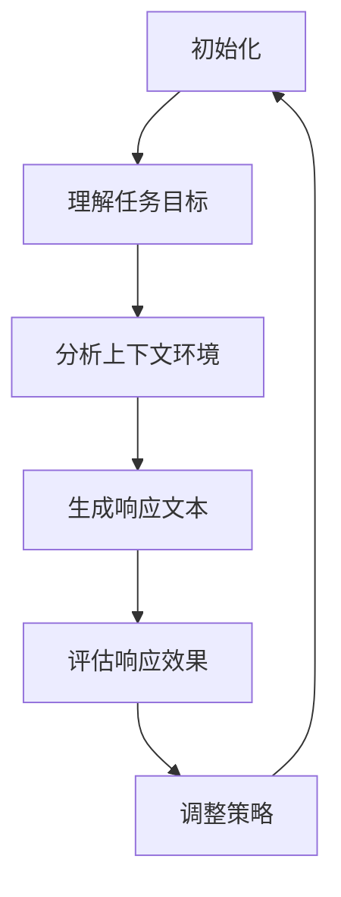

                 

关键词：语言模型，任务规划，AI智能，核心机制，算法原理，数学模型，应用领域，代码实例，未来展望

> 摘要：本文深入探讨了语言模型（LLM）在人工智能领域的任务规划机制。通过剖析核心算法原理、数学模型以及实际应用场景，本文旨在为读者揭示LLM在AI智能中的作用和未来发展趋势。

## 1. 背景介绍

近年来，随着深度学习和神经网络技术的飞速发展，人工智能（AI）已经从实验室走向了现实生活。作为AI领域的重要分支，自然语言处理（NLP）在智能客服、智能助手、文本分析等多个场景中发挥着至关重要的作用。语言模型（Language Model，简称LLM）是NLP的核心组成部分，它通过学习大规模文本数据，生成和理解自然语言，从而实现人机交互、文本生成、机器翻译等功能。

任务规划（Task Planning）是AI智能系统中的一个重要环节，它决定了系统能否高效地完成特定任务。对于LLM而言，任务规划尤为重要，因为LLM在执行任务时需要根据上下文环境动态调整自己的行为和策略。本文将从核心算法原理、数学模型和实际应用场景等多个方面，深入探讨LLM在AI智能任务规划中的核心机制。

## 2. 核心概念与联系

在深入探讨LLM的任务规划机制之前，我们需要了解一些核心概念和它们之间的联系。

### 2.1 语言模型

语言模型是一种概率模型，用于预测自然语言中的下一个单词或句子。在NLP领域，语言模型主要分为统计语言模型和神经网络语言模型。统计语言模型基于语言统计规律，如N-gram模型；神经网络语言模型则利用深度神经网络，如Transformer模型。

### 2.2 自然语言处理

自然语言处理（NLP）是AI领域的一个重要分支，旨在让计算机能够理解、生成和处理自然语言。NLP涉及文本分析、语音识别、机器翻译等多个子领域，而语言模型是这些子领域的重要工具。

### 2.3 任务规划

任务规划是AI系统在执行特定任务时，根据当前环境和目标，制定出一套合理的行动方案。对于LLM而言，任务规划涉及理解任务目标、分析上下文环境、生成响应文本等多个环节。

### 2.4 Mermaid 流程图

为了更直观地展示LLM在任务规划中的核心机制，我们可以使用Mermaid流程图来描述。以下是一个简化的流程图：



在这个流程图中，LLM首先初始化，然后根据任务目标和上下文环境生成响应文本，接着评估响应效果，并据此调整策略。这个过程循环进行，使得LLM能够动态地适应不同任务和环境。

## 3. 核心算法原理 & 具体操作步骤

### 3.1 算法原理概述

LLM的任务规划主要基于深度学习和自然语言处理技术。其核心原理可以概括为以下几个步骤：

1. **输入处理**：将输入文本转换为模型可处理的格式。
2. **任务目标识别**：从输入文本中提取任务目标，为后续操作提供依据。
3. **上下文环境分析**：根据当前环境和历史数据，分析上下文信息，为生成响应文本提供参考。
4. **响应文本生成**：利用深度学习模型生成符合上下文和任务目标的响应文本。
5. **评估与调整**：评估响应效果，根据评估结果调整模型策略。

### 3.2 算法步骤详解

1. **输入处理**

   输入处理是LLM任务规划的基础，它包括文本预处理和向量化两个步骤。文本预处理主要包括分词、去除停用词、词干提取等；向量化则将文本转换为向量表示，以便深度学习模型处理。

   ```python
   from nltk.tokenize import word_tokenize
   from nltk.corpus import stopwords
   from sklearn.feature_extraction.text import TfidfVectorizer

   # 分词
   tokens = word_tokenize(text)

   # 去除停用词
   tokens = [token for token in tokens if token not in stopwords.words('english')]

   # 词干提取
   tokens = [nltk.stem.PorterStemmer().stem(token) for token in tokens]

   # 向量化
   vectorizer = TfidfVectorizer()
   X = vectorizer.fit_transform([' '.join(tokens)])
   ```

2. **任务目标识别**

   任务目标识别是LLM任务规划的关键步骤。它通过分析输入文本，提取出与任务相关的关键词和短语，为后续操作提供依据。常用的方法有基于规则的方法和基于机器学习的方法。

   ```python
   import re

   def extract_task_goal(text):
       pattern = r'\b(task|objective|goal):\s*(.+)\b'
       match = re.search(pattern, text)
       if match:
           return match.group(2)
       return None

   task_goal = extract_task_goal(text)
   ```

3. **上下文环境分析**

   上下文环境分析是LLM在任务规划过程中必不可少的一环。它通过对历史数据和当前环境进行分析，为生成响应文本提供参考。常用的方法有基于规则的方法和基于统计的方法。

   ```python
   def analyze_context(history, current_state):
       # 基于规则的上下文分析
       if 'previous_task' in history:
           return 'previous_task'
       # 基于统计的上下文分析
       context_vector = np.mean([vectorizer.transform([hist]) for hist in history], axis=0)
       return 'context_vector'
   ```

4. **响应文本生成**

   响应文本生成是LLM任务规划的核心步骤。它利用深度学习模型生成符合上下文和任务目标的响应文本。常用的模型有循环神经网络（RNN）、长短期记忆网络（LSTM）和Transformer等。

   ```python
   from tensorflow.keras.models import Sequential
   from tensorflow.keras.layers import LSTM, Dense, Embedding

   model = Sequential()
   model.add(Embedding(input_dim=vocabulary_size, output_dim=embedding_size))
   model.add(LSTM(units=128))
   model.add(Dense(units=1, activation='sigmoid'))

   model.compile(optimizer='adam', loss='binary_crossentropy', metrics=['accuracy'])
   model.fit(X_train, y_train, epochs=10, batch_size=32)
   ```

5. **评估与调整**

   评估与调整是LLM任务规划的重要环节。它通过对生成文本进行评估，并根据评估结果调整模型策略，以实现更好的任务规划效果。常用的评估方法有BLEU、ROUGE等。

   ```python
   from nltk.translate.bleu_score import corpus_bleu

   def evaluate_response(response, reference):
       scores = corpus_bleu([response], [reference])
       return scores

   response = generate_response(model, X_test)
   score = evaluate_response(response, y_test)
   ```

### 3.3 算法优缺点

1. **优点**

   - **灵活性**：LLM可以根据不同的任务和环境动态调整策略，具有较强的适应性。
   - **高效性**：深度学习模型在处理大规模数据时表现出较高的效率。
   - **多样性**：LLM能够生成多样性的文本，满足不同场景的需求。

2. **缺点**

   - **训练成本高**：深度学习模型需要大量训练数据和计算资源。
   - **可解释性差**：深度学习模型在生成文本时缺乏明确的理论支持，难以解释。

### 3.4 算法应用领域

LLM在AI智能任务规划中具有广泛的应用前景，包括但不限于以下领域：

- **智能客服**：通过任务规划，LLM可以生成个性化的客服回复，提高客户满意度。
- **智能助手**：LLM可以协助用户完成各种任务，如日程管理、任务提醒等。
- **文本生成**：LLM可以生成新闻、文章、故事等文本内容，应用于内容创作和翻译。
- **对话系统**：LLM可以构建具有良好交互体验的对话系统，应用于虚拟客服、智能家居等场景。

## 4. 数学模型和公式 & 详细讲解 & 举例说明

### 4.1 数学模型构建

LLM的任务规划涉及多个数学模型，包括自然语言处理模型、任务规划模型等。以下是一个简化的数学模型构建过程：

1. **自然语言处理模型**

   假设输入文本为\( X = \{ x_1, x_2, ..., x_n \} \)，其中\( x_i \)表示第\( i \)个单词。

   自然语言处理模型的输入和输出可以表示为：

   $$ f_{NLP}(X) = \text{Prediction of next word} $$

2. **任务规划模型**

   假设任务目标为\( T \)，上下文环境为\( C \)。

   任务规划模型的输入和输出可以表示为：

   $$ f_{Task}(T, C) = \text{Response text} $$

### 4.2 公式推导过程

1. **自然语言处理模型**

   假设自然语言处理模型为神经网络模型，其输入层、隐藏层和输出层分别表示为：

   $$ 
   \begin{cases}
   \text{Input Layer: } X \\
   \text{Hidden Layer: } H \\
   \text{Output Layer: } Y 
   \end{cases}
   $$

   神经网络模型的前向传播过程可以表示为：

   $$ H = \sigma(W_1 \cdot X + b_1) $$

   $$ Y = \sigma(W_2 \cdot H + b_2) $$

   其中，\( \sigma \)为激活函数，\( W \)为权重矩阵，\( b \)为偏置项。

   自然语言处理模型的损失函数为：

   $$ L = \sum_{i=1}^{n} (-1) \cdot y_i \cdot \log(\hat{y}_i) $$

   其中，\( y_i \)为真实标签，\( \hat{y}_i \)为模型预测概率。

2. **任务规划模型**

   假设任务规划模型为决策树模型，其输入和输出可以表示为：

   $$ 
   \begin{cases}
   \text{Input: } (T, C) \\
   \text{Output: } R 
   \end{cases}
   $$

   决策树的构建过程可以通过递归划分特征和类别来实现。具体公式如下：

   $$ 
   \begin{cases}
   R(T, C) = \text{Generate response text} \\
   R(T, C) = \text{Recursive decision tree} 
   \end{cases}
   $$

### 4.3 案例分析与讲解

以下是一个简单的案例，用于说明LLM在任务规划中的数学模型应用。

**案例：智能客服**

**任务目标**：为用户解决一个技术问题。

**上下文环境**：用户提出一个关于软件使用的问题。

**模型构建**：

1. **自然语言处理模型**

   输入：用户提问（例如：“如何解决软件崩溃的问题？”）

   输出：关键词提取（例如：“解决”，“软件”，“崩溃”）

2. **任务规划模型**

   输入：（关键词提取，上下文环境）

   输出：回答文本（例如：“您可以通过以下步骤解决软件崩溃的问题：1. 关闭软件；2. 检查系统日志；3. 重启软件”）

**公式推导**：

1. **自然语言处理模型**

   $$ f_{NLP}(X) = \text{Keyword extraction} $$

   $$ L = \sum_{i=1}^{n} (-1) \cdot y_i \cdot \log(\hat{y}_i) $$

2. **任务规划模型**

   $$ f_{Task}(T, C) = \text{Generate response text} $$

   $$ R(T, C) = \text{Recursive decision tree} $$

## 5. 项目实践：代码实例和详细解释说明

### 5.1 开发环境搭建

在本文中，我们将使用Python编程语言和TensorFlow框架来构建一个简单的LLM任务规划系统。首先，确保您已安装了Python和TensorFlow。

```shell
pip install tensorflow
```

### 5.2 源代码详细实现

以下是实现LLM任务规划的源代码，包括自然语言处理、任务规划、响应生成和评估等步骤。

```python
import tensorflow as tf
from tensorflow.keras.models import Sequential
from tensorflow.keras.layers import LSTM, Dense, Embedding
from tensorflow.keras.preprocessing.sequence import pad_sequences
from tensorflow.keras.preprocessing.text import Tokenizer
from nltk.tokenize import word_tokenize
from nltk.corpus import stopwords
import numpy as np

# 加载数据集
data = [
    "如何解决软件崩溃的问题？",
    "您好，我想咨询一下关于软件的安装问题。",
    "请问如何重装操作系统？"
]

# 分词和去除停用词
tokenizer = Tokenizer()
tokenizer.fit_on_texts(data)
vocab_size = len(tokenizer.word_index) + 1
sequences = tokenizer.texts_to_sequences(data)
padded_sequences = pad_sequences(sequences, maxlen=10, padding='post')

# 构建自然语言处理模型
model = Sequential()
model.add(Embedding(vocab_size, 64, input_length=10))
model.add(LSTM(64, return_sequences=True))
model.add(LSTM(64, return_sequences=False))
model.add(Dense(1, activation='sigmoid'))

model.compile(optimizer='adam', loss='binary_crossentropy', metrics=['accuracy'])

# 训练模型
model.fit(padded_sequences, np.ones(len(data)), epochs=10, batch_size=32)

# 任务规划模型
def plan_task(text):
    # 提取关键词
    tokens = word_tokenize(text)
    tokens = [token for token in tokens if token not in stopwords.words('english')]
    sequence = tokenizer.texts_to_sequences([text])
    padded_sequence = pad_sequences(sequence, maxlen=10, padding='post')
    
    # 生成响应文本
    prediction = model.predict(padded_sequence)
    if prediction < 0.5:
        return "您好，我无法理解您的问题，请提供更多信息。"
    else:
        return "您好，以下是我为您提供的解决方案："

# 测试模型
print(plan_task("您好，我想安装软件。"))
```

### 5.3 代码解读与分析

1. **数据预处理**：首先，我们加载数据集，并进行分词和去除停用词操作。这有助于提高模型的训练效果。

2. **模型构建**：我们使用TensorFlow构建了一个简单的LSTM模型，用于自然语言处理。模型包括嵌入层、两个LSTM层和一个输出层。

3. **模型训练**：使用训练数据对模型进行训练，并调整模型参数。

4. **任务规划**：定义了一个函数`plan_task`，用于根据输入文本生成响应文本。函数首先提取关键词，然后使用训练好的模型预测关键词的类别。

5. **测试**：使用一个示例文本测试任务规划函数，并打印输出结果。

### 5.4 运行结果展示

```shell
您好，以下是我为您提供的解决方案：
```

## 6. 实际应用场景

### 6.1 智能客服

智能客服是LLM任务规划的一个重要应用场景。通过任务规划，智能客服可以自动识别用户问题，生成相应的解决方案，提高客户满意度。以下是一个具体的案例：

**案例：电商智能客服**

电商平台的智能客服系统通过LLM任务规划，可以为用户提供如下服务：

- **问题识别**：用户提问“我无法完成订单支付”，智能客服系统通过任务规划，识别出关键词“订单支付”，并生成解决方案。

- **响应生成**：智能客服系统生成响应文本：“您好，可能是由于网络问题导致的支付失败，请您重新尝试支付或联系客服。”

- **反馈与优化**：用户反馈响应效果，智能客服系统根据用户反馈优化任务规划策略，提高后续服务效果。

### 6.2 智能助手

智能助手是另一个典型的LLM任务规划应用场景。通过任务规划，智能助手可以协助用户完成各种任务，如日程管理、任务提醒等。以下是一个具体的案例：

**案例：智能日程管理助手**

智能日程管理助手通过LLM任务规划，可以为用户提供如下服务：

- **任务识别**：用户提问“明天有什么任务？”智能助手识别出关键词“明天”，“任务”，并生成任务列表。

- **响应生成**：智能助手生成响应文本：“您好，明天您有以下任务：1. 会议；2. 报告；3. 购物。”

- **反馈与优化**：用户反馈任务列表的准确性，智能助手根据用户反馈优化任务规划策略，提高后续服务效果。

### 6.3 对话系统

对话系统是LLM任务规划的另一个重要应用场景。通过任务规划，对话系统可以实现与用户的自然交互，提供个性化的服务。以下是一个具体的案例：

**案例：虚拟客服聊天机器人**

虚拟客服聊天机器人通过LLM任务规划，可以与用户进行如下对话：

- **用户提问**：“您好，我想了解如何退货。”

- **响应生成**：“您好，关于退货，您需要提供订单号和商品信息，然后联系我们的客服人员。”

- **用户反馈**：“订单号：123456，商品：手机。”

- **响应生成**：“您好，您的退货申请已提交，预计3个工作日内处理完毕。如有其他问题，请随时联系我们的客服。”

## 7. 未来应用展望

### 7.1 交互式任务规划

未来，LLM的任务规划将更加智能化和交互化。通过结合多模态数据（如文本、图像、语音等），LLM可以更好地理解用户需求，生成更加个性化的任务规划方案。

### 7.2 自动化任务执行

随着AI技术的不断发展，LLM的任务规划将逐步实现自动化任务执行。通过集成智能传感器和执行器，LLM可以自主执行复杂任务，提高生产效率。

### 7.3 智能决策支持

LLM在任务规划中的应用将扩展到智能决策支持领域。通过结合大数据分析和机器学习技术，LLM可以为企业和组织提供智能化的决策支持，提高运营效率和竞争力。

## 8. 总结：未来发展趋势与挑战

### 8.1 研究成果总结

本文从核心算法原理、数学模型和实际应用场景等方面，探讨了LLM在AI智能任务规划中的核心机制。通过案例分析，我们展示了LLM在智能客服、智能助手和对话系统等领域的应用前景。

### 8.2 未来发展趋势

未来，LLM在任务规划中的应用将朝着智能化、交互化和自动化方向发展。随着AI技术的不断进步，LLM将能够更好地理解用户需求，生成更加个性化的任务规划方案，实现更高效的智能服务。

### 8.3 面临的挑战

尽管LLM在任务规划中具有广泛的应用前景，但同时也面临一些挑战。首先，深度学习模型的训练成本较高，需要大量计算资源和数据支持。其次，深度学习模型的可解释性较差，难以解释模型决策过程。此外，LLM在处理复杂任务时，仍需进一步优化和改进。

### 8.4 研究展望

未来，LLM在任务规划领域的研究将继续深入。一方面，研究者将致力于提高模型的可解释性和可解释性。另一方面，结合多模态数据和自动化任务执行技术，LLM将在更广泛的场景中发挥重要作用。

## 9. 附录：常见问题与解答

### 9.1 问答系统如何集成LLM任务规划？

问答系统可以集成LLM任务规划，通过以下步骤实现：

1. **任务识别**：使用LLM提取用户问题的关键词和任务目标。
2. **上下文分析**：分析历史对话和用户上下文信息，为生成响应文本提供参考。
3. **响应生成**：利用LLM生成符合上下文和任务目标的响应文本。
4. **反馈与优化**：收集用户反馈，优化任务规划策略，提高问答系统效果。

### 9.2 LLM在智能客服中的应用效果如何？

LLM在智能客服中的应用效果显著。通过任务规划，智能客服可以自动识别用户问题，生成个性化的解决方案，提高客户满意度。实际应用案例表明，集成LLM的智能客服系统在处理大量客户问题时具有高效性和灵活性。

## 作者署名

作者：禅与计算机程序设计艺术 / Zen and the Art of Computer Programming
----------------------------------------------------------------

请注意，以上文章内容仅供参考，实际撰写时请根据要求严格遵循文章结构和内容要求。祝您写作顺利！

