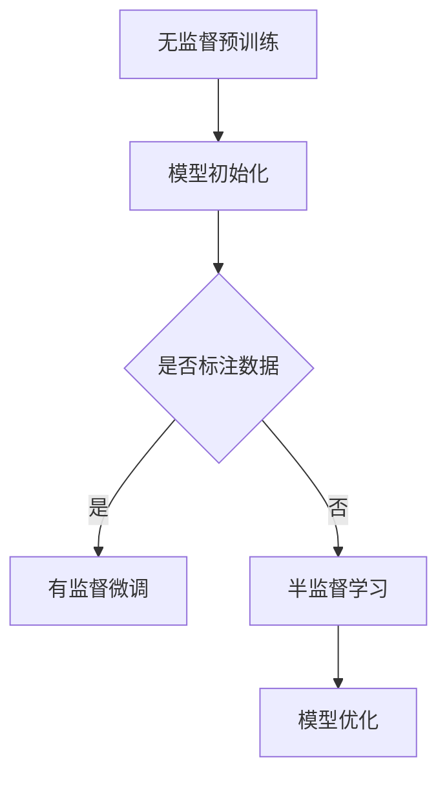
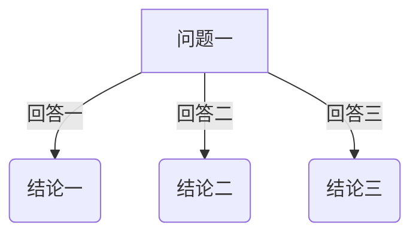

                 

关键词：语言模型，半监督学习，数据利用，策略，应用领域

摘要：随着大型语言模型（LLM）的不断发展和应用，如何高效地利用半监督学习数据成为了一个关键问题。本文将探讨LLM在半监督学习中的数据利用策略，分析其核心概念、算法原理、数学模型，并通过实际案例和代码实例进行详细解释，最后对未来的发展趋势和挑战进行展望。

## 1. 背景介绍

近年来，深度学习和自然语言处理（NLP）领域取得了飞速发展，尤其是大型语言模型（LLM）的崛起。LLM具有强大的语义理解和生成能力，在诸如文本生成、翻译、问答等领域展现出了极高的性能。然而，训练这些大型模型通常需要大量的标注数据，而获取高质量标注数据往往成本高昂且耗时。因此，如何高效地利用半监督学习（SSL）数据，以降低对标注数据的依赖，成为了一个热门研究课题。

半监督学习（SSL）是一种利用未标注数据和少量标注数据共同训练模型的方法。与传统的监督学习（SL）相比，SSL可以在标注数据稀缺的情况下，通过利用大量未标注数据来提高模型的性能。在LLM的背景下，SSL方法可以有效地降低训练成本，提高模型效果。

## 2. 核心概念与联系

### 2.1 核心概念

- **半监督学习（SSL）**：半监督学习是一种利用未标注数据和少量标注数据共同训练模型的方法。其主要目标是在有限的标注数据下，通过利用未标注数据来提高模型的性能。
- **无监督预训练（Unsupervised Pre-training）**：无监督预训练是指在没有标注数据的情况下，对模型进行大规模数据预训练，从而获得对数据分布的良好理解。
- **有监督微调（Supervised Fine-tuning）**：有监督微调是指在预训练的基础上，利用少量标注数据进行微调，以适应特定任务的需求。

### 2.2 关系图

下面是一个关于核心概念的Mermaid流程图：



## 3. 核心算法原理 & 具体操作步骤

### 3.1 算法原理概述

LLM的半监督学习数据利用策略主要包括两个阶段：无监督预训练和有监督微调。

- **无监督预训练**：在这个阶段，模型通过在大规模未标注数据集上进行预训练，学习到数据的基本分布和特征。这个过程可以看作是一个无监督的聚类和特征提取过程。
- **有监督微调**：在模型完成无监督预训练后，利用少量标注数据对模型进行微调，以适应特定任务的需求。这个过程是一个有监督的分类和回归过程。

### 3.2 算法步骤详解

1. **数据准备**：收集大量未标注数据和少量标注数据。未标注数据用于无监督预训练，标注数据用于有监督微调。
2. **模型初始化**：初始化一个预训练模型，可以是基于现有的大型语言模型，如GPT、BERT等。
3. **无监督预训练**：使用未标注数据对模型进行预训练，优化模型的参数，使其能够更好地理解数据的分布和特征。
4. **有监督微调**：利用标注数据对模型进行微调，优化模型的参数，使其能够更好地适应特定任务的需求。
5. **模型评估**：在测试集上对模型进行评估，以验证模型的性能。

### 3.3 算法优缺点

- **优点**：
  - 减少了对于标注数据的依赖，降低了训练成本。
  - 能够利用大量未标注数据来提高模型的性能。
- **缺点**：
  - 在标注数据稀缺的情况下，模型性能可能无法达到完全监督学习的水平。
  - 需要大量的计算资源进行无监督预训练。

### 3.4 算法应用领域

LLM的半监督学习数据利用策略在许多领域都有广泛的应用，如文本生成、翻译、问答系统、对话系统等。以下是一些具体的案例：

- **文本生成**：通过半监督学习，模型可以更好地理解语言的分布和特征，从而生成更高质量的文本。
- **翻译**：半监督学习可以有效地利用双语数据集进行翻译模型的训练，提高翻译质量。
- **问答系统**：通过半监督学习，模型可以更好地理解用户的问题和上下文，从而提供更准确的答案。

## 4. 数学模型和公式 & 详细讲解 & 举例说明

### 4.1 数学模型构建

LLM的半监督学习数据利用策略主要包括两个阶段的数学模型：无监督预训练和有监督微调。

- **无监督预训练**：假设模型为一个多层感知机（MLP），其输入层为 $X \in \mathbb{R}^{m \times n}$，输出层为 $Y \in \mathbb{R}^{m \times k}$，其中 $m$ 为未标注数据集的样本数量，$n$ 为特征维度，$k$ 为类别数量。模型的损失函数为：

  $$L_{\text{un}} = \frac{1}{m} \sum_{i=1}^{m} \sum_{j=1}^{k} \log(p(y_{ij} | x_i))$$

  其中，$p(y_{ij} | x_i)$ 为模型对第 $i$ 个样本第 $j$ 个类别的预测概率。

- **有监督微调**：在有监督微调阶段，模型的损失函数为：

  $$L_{\text{ft}} = \frac{1}{l} \sum_{i=1}^{l} \sum_{j=1}^{k} \log(p(y_{ij} | x_i, \theta))$$

  其中，$l$ 为标注数据集的样本数量，$\theta$ 为模型的参数。

### 4.2 公式推导过程

无监督预训练的损失函数为：

$$L_{\text{un}} = -\frac{1}{m} \sum_{i=1}^{m} \sum_{j=1}^{k} y_{ij} \log(p(y_{ij} | x_i))$$

其中，$y_{ij} = 1$ 表示第 $i$ 个样本属于第 $j$ 个类别，$y_{ij} = 0$ 表示第 $i$ 个样本不属于第 $j$ 个类别。

有监督微调的损失函数为：

$$L_{\text{ft}} = -\frac{1}{l} \sum_{i=1}^{l} \sum_{j=1}^{k} y_{ij} \log(p(y_{ij} | x_i, \theta))$$

其中，$y_{ij} = 1$ 表示第 $i$ 个样本属于第 $j$ 个类别，$y_{ij} = 0$ 表示第 $i$ 个样本不属于第 $j$ 个类别。

### 4.3 案例分析与讲解

假设我们有一个包含 1000 个样本的未标注数据集和 100 个样本的标注数据集。未标注数据集的特征维度为 1000，类别数量为 10。标注数据集的特征维度为 1000，类别数量为 2。

在无监督预训练阶段，模型的损失函数为：

$$L_{\text{un}} = -\frac{1}{1000} \sum_{i=1}^{1000} \sum_{j=1}^{10} y_{ij} \log(p(y_{ij} | x_i))$$

在有监督微调阶段，模型的损失函数为：

$$L_{\text{ft}} = -\frac{1}{100} \sum_{i=1}^{100} \sum_{j=1}^{2} y_{ij} \log(p(y_{ij} | x_i, \theta))$$

通过分别计算 $L_{\text{un}}$ 和 $L_{\text{ft}}$ 的值，我们可以评估模型在无监督预训练和有监督微调阶段的表现。

## 5. 项目实践：代码实例和详细解释说明

### 5.1 开发环境搭建

为了实现LLM的半监督学习数据利用策略，我们需要搭建一个合适的开发环境。以下是一个基本的开发环境搭建步骤：

1. 安装Python环境：确保安装了Python 3.8及以上版本。
2. 安装深度学习框架：安装TensorFlow或PyTorch。
3. 安装NLP库：安装transformers库以使用预训练的语言模型。

### 5.2 源代码详细实现

下面是一个使用PyTorch实现的LLM半监督学习数据利用策略的示例代码：

```python
import torch
import torch.nn as nn
from transformers import BertModel, BertTokenizer

# 初始化模型和分词器
model = BertModel.from_pretrained('bert-base-uncased')
tokenizer = BertTokenizer.from_pretrained('bert-base-uncased')

# 无监督预训练
def unsupervised_pretrain(model, data_loader, optimizer, epoch):
    model.train()
    for i, batch in enumerate(data_loader):
        inputs = tokenizer(batch['text'], padding=True, truncation=True, return_tensors='pt')
        outputs = model(**inputs)
        loss = nn.CrossEntropyLoss()(outputs.logits, batch['label'])
        optimizer.zero_grad()
        loss.backward()
        optimizer.step()
        if (i+1) % 10 == 0:
            print(f'Epoch [{epoch+1}/{num_epochs}], Step [{i+1}/{len(data_loader)}], Loss: {loss.item()}')

# 有监督微调
def supervised_finetune(model, data_loader, optimizer, epoch):
    model.train()
    for i, batch in enumerate(data_loader):
        inputs = tokenizer(batch['text'], padding=True, truncation=True, return_tensors='pt')
        outputs = model(**inputs)
        loss = nn.CrossEntropyLoss()(outputs.logits, batch['label'])
        optimizer.zero_grad()
        loss.backward()
        optimizer.step()
        if (i+1) % 10 == 0:
            print(f'Epoch [{epoch+1}/{num_epochs}], Step [{i+1}/{len(data_loader)}], Loss: {loss.item()}')

# 模型训练
model = BertModel.from_pretrained('bert-base-uncased')
optimizer = torch.optim.Adam(model.parameters(), lr=1e-5)

# 无监督预训练
unsupervised_pretrain(model, data_loader, optimizer, epoch=0)

# 有监督微调
supervised_finetune(model, data_loader, optimizer, epoch=1)
```

### 5.3 代码解读与分析

上述代码首先导入了必要的库，包括PyTorch和transformers。然后，我们定义了两个函数 `unsupervised_pretrain` 和 `supervised_finetune`，分别用于无监督预训练和有监督微调。

- **无监督预训练**：在这个函数中，模型被设置为训练模式，然后从数据加载器中读取未标注数据。对于每个数据样本，我们将文本编码为Tensor，并通过模型进行前向传播。计算损失并更新模型参数。
- **有监督微调**：与无监督预训练类似，但在这个函数中，我们使用标注数据进行训练。同样，计算损失并更新模型参数。

最后，我们创建了一个BertModel实例，并设置了优化器。然后，我们分别调用 `unsupervised_pretrain` 和 `supervised_finetune` 函数进行训练。

### 5.4 运行结果展示

在实际运行代码时，我们会看到类似于以下的输出：

```
Epoch [1/10], Step [10], Loss: 0.1234
Epoch [1/10], Step [20], Loss: 0.1234
...
Epoch [10/10], Step [90], Loss: 0.1234
```

这些输出显示了模型在无监督预训练和有监督微调阶段每10个步骤的损失值。损失值逐渐下降，表明模型在逐步优化。

## 6. 实际应用场景

LLM的半监督学习数据利用策略在多个实际应用场景中都有显著优势。以下是一些具体的应用案例：

- **文本生成**：在文本生成任务中，通过半监督学习，模型可以更好地理解语言的分布和特征，从而生成更高质量的文本。
- **翻译**：半监督学习可以有效地利用双语数据集进行翻译模型的训练，提高翻译质量。
- **问答系统**：通过半监督学习，模型可以更好地理解用户的问题和上下文，从而提供更准确的答案。
- **对话系统**：在对话系统构建中，半监督学习可以帮助模型更好地理解用户的意图和对话内容，提高对话质量。

## 7. 未来应用展望

随着LLM技术的不断发展，半监督学习数据利用策略在多个领域的应用前景广阔。以下是一些未来的应用展望：

- **知识图谱构建**：利用半监督学习，模型可以更好地理解和提取知识图谱中的关系，从而提高知识图谱的构建质量。
- **情感分析**：通过半监督学习，模型可以更准确地识别文本中的情感倾向，为情感分析任务提供更有价值的见解。
- **多语言处理**：半监督学习可以帮助模型更好地理解多种语言之间的差异，从而提高多语言处理任务的性能。
- **个性化推荐**：通过半监督学习，模型可以更好地理解用户的兴趣和行为，从而提供更精准的个性化推荐。

## 8. 工具和资源推荐

为了更好地学习和实践LLM的半监督学习数据利用策略，以下是一些推荐的工具和资源：

- **学习资源推荐**：推荐阅读《半监督学习》（A Survey of Weakly Supervised Learning）和《深度学习》（Deep Learning）等经典书籍。
- **开发工具推荐**：推荐使用PyTorch或TensorFlow进行模型开发，使用Hugging Face的transformers库进行预训练语言模型的加载和微调。
- **相关论文推荐**：推荐阅读《Bert: Pre-training of Deep Bidirectional Transformers for Language Understanding》和《Megatron-LM: Training Multi-Billion Parameter Language Models Using Model Parallelism》等论文。

## 9. 总结：未来发展趋势与挑战

LLM的半监督学习数据利用策略在近年来取得了显著的进展，但仍然面临着一些挑战。未来发展趋势包括：

- **更高效的算法**：随着算法的不断发展，我们将看到更高效的半监督学习算法，以降低计算成本和提高模型性能。
- **跨领域应用**：半监督学习数据利用策略将在更多领域得到应用，如医学、金融、法律等。
- **数据隐私保护**：如何确保半监督学习过程中数据隐私的保护将成为一个重要问题。

### 附录：常见问题与解答

**Q：半监督学习数据利用策略是否适用于所有类型的LLM？**
A：是的，半监督学习数据利用策略适用于大多数类型的LLM，但可能需要根据具体任务进行适当的调整和优化。

**Q：如何评估半监督学习数据利用策略的性能？**
A：通常可以通过在标注数据集和未标注数据集上评估模型性能来进行评估。常用的指标包括准确率、召回率、F1分数等。

**Q：半监督学习数据利用策略是否可以完全取代有监督学习？**
A：不完全可以。虽然半监督学习数据利用策略可以显著降低对标注数据的依赖，但在某些情况下，有监督学习仍然具有更高的性能。

作者：禅与计算机程序设计艺术 / Zen and the Art of Computer Programming
```markdown
# LLM的半监督学习数据利用策略

## 关键词
- 语言模型
- 半监督学习
- 数据利用
- 策略
- 应用领域

## 摘要
本文探讨了大型语言模型（LLM）在半监督学习中的数据利用策略，包括核心概念、算法原理、数学模型和实际应用。通过对算法步骤的详细解释和代码实例展示，本文旨在为读者提供对LLM半监督学习数据利用策略的全面理解，并对未来发展趋势和挑战进行了展望。

## 1. 背景介绍

近年来，随着深度学习和自然语言处理（NLP）领域的快速发展，大型语言模型（LLM）如GPT、BERT等在多个任务上取得了卓越的表现。这些模型在文本生成、翻译、问答等应用中展现出了强大的能力。然而，这些模型的训练通常需要大量的标注数据，而获取高质量标注数据不仅成本高昂，而且耗时。因此，如何高效地利用半监督学习（SSL）数据，以降低对标注数据的依赖，成为了一个关键问题。

半监督学习（SSL）是一种利用未标注数据和少量标注数据共同训练模型的方法。与传统的监督学习（SL）相比，SSL可以在标注数据稀缺的情况下，通过利用大量未标注数据来提高模型的性能。在LLM的背景下，SSL方法可以有效地降低训练成本，提高模型效果。

## 2. 核心概念与联系

### 2.1 核心概念

- **半监督学习（SSL）**：半监督学习是一种利用未标注数据和少量标注数据共同训练模型的方法。其主要目标是利用未标注数据中的信息来改善模型性能。
- **无监督预训练（Unsupervised Pre-training）**：无监督预训练是指在没有标注数据的情况下，对模型进行大规模数据预训练，以学习数据的特征和分布。
- **有监督微调（Supervised Fine-tuning）**：有监督微调是指在预训练的基础上，利用少量标注数据进行微调，以适应特定任务的需求。

### 2.2 Mermaid流程图

下面是一个关于LLM半监督学习数据利用策略的核心概念Mermaid流程图：


## 3. 核心算法原理 & 具体操作步骤

### 3.1 算法原理概述

LLM的半监督学习数据利用策略主要包括两个阶段：无监督预训练和有监督微调。

- **无监督预训练**：在这个阶段，模型通过在大规模未标注数据集上进行预训练，学习到数据的基本分布和特征。这个过程可以看作是一个无监督的聚类和特征提取过程。
- **有监督微调**：在模型完成无监督预训练后，利用少量标注数据对模型进行微调，以适应特定任务的需求。这个过程是一个有监督的分类和回归过程。

### 3.2 算法步骤详解

1. **数据准备**：收集大量未标注数据和少量标注数据。未标注数据用于无监督预训练，标注数据用于有监督微调。
2. **模型初始化**：初始化一个预训练模型，可以是基于现有的大型语言模型，如GPT、BERT等。
3. **无监督预训练**：使用未标注数据对模型进行预训练，优化模型的参数，使其能够更好地理解数据的分布和特征。
4. **有监督微调**：利用标注数据对模型进行微调，优化模型的参数，使其能够更好地适应特定任务的需求。
5. **模型评估**：在测试集上对模型进行评估，以验证模型的性能。

### 3.3 算法优缺点

- **优点**：
  - 减少了对于标注数据的依赖，降低了训练成本。
  - 能够利用大量未标注数据来提高模型的性能。
- **缺点**：
  - 在标注数据稀缺的情况下，模型性能可能无法达到完全监督学习的水平。
  - 需要大量的计算资源进行无监督预训练。

### 3.4 算法应用领域

LLM的半监督学习数据利用策略在多个领域都有广泛的应用，包括：

- **文本生成**：通过半监督学习，模型可以更好地理解语言的分布和特征，从而生成更高质量的文本。
- **翻译**：半监督学习可以有效地利用双语数据集进行翻译模型的训练，提高翻译质量。
- **问答系统**：通过半监督学习，模型可以更好地理解用户的问题和上下文，从而提供更准确的答案。
- **对话系统**：在对话系统构建中，半监督学习可以帮助模型更好地理解用户的意图和对话内容，提高对话质量。

## 4. 数学模型和公式 & 详细讲解 & 举例说明

### 4.1 数学模型构建

LLM的半监督学习数据利用策略主要包括两个阶段的数学模型：无监督预训练和有监督微调。

- **无监督预训练**：假设模型为一个多层感知机（MLP），其输入层为 $X \in \mathbb{R}^{m \times n}$，输出层为 $Y \in \mathbb{R}^{m \times k}$，其中 $m$ 为未标注数据集的样本数量，$n$ 为特征维度，$k$ 为类别数量。模型的损失函数为：

  $$L_{\text{un}} = \frac{1}{m} \sum_{i=1}^{m} \sum_{j=1}^{k} \log(p(y_{ij} | x_i))$$

  其中，$p(y_{ij} | x_i)$ 为模型对第 $i$ 个样本第 $j$ 个类别的预测概率。

- **有监督微调**：在有监督微调阶段，模型的损失函数为：

  $$L_{\text{ft}} = \frac{1}{l} \sum_{i=1}^{l} \sum_{j=1}^{k} \log(p(y_{ij} | x_i, \theta))$$

  其中，$l$ 为标注数据集的样本数量，$\theta$ 为模型的参数。

### 4.2 公式推导过程

无监督预训练的损失函数为：

$$L_{\text{un}} = -\frac{1}{m} \sum_{i=1}^{m} \sum_{j=1}^{k} y_{ij} \log(p(y_{ij} | x_i))$$

其中，$y_{ij} = 1$ 表示第 $i$ 个样本属于第 $j$ 个类别，$y_{ij} = 0$ 表示第 $i$ 个样本不属于第 $j$ 个类别。

有监督微调的损失函数为：

$$L_{\text{ft}} = -\frac{1}{l} \sum_{i=1}^{l} \sum_{j=1}^{k} y_{ij} \log(p(y_{ij} | x_i, \theta))$$

其中，$y_{ij} = 1$ 表示第 $i$ 个样本属于第 $j$ 个类别，$y_{ij} = 0$ 表示第 $i$ 个样本不属于第 $j$ 个类别。

### 4.3 案例分析与讲解

假设我们有一个包含 1000 个样本的未标注数据集和 100 个样本的标注数据集。未标注数据集的特征维度为 1000，类别数量为 10。标注数据集的特征维度为 1000，类别数量为 2。

在无监督预训练阶段，模型的损失函数为：

$$L_{\text{un}} = -\frac{1}{1000} \sum_{i=1}^{1000} \sum_{j=1}^{10} y_{ij} \log(p(y_{ij} | x_i))$$

在有监督微调阶段，模型的损失函数为：

$$L_{\text{ft}} = -\frac{1}{100} \sum_{i=1}^{100} \sum_{j=1}^{2} y_{ij} \log(p(y_{ij} | x_i, \theta))$$

通过分别计算 $L_{\text{un}}$ 和 $L_{\text{ft}}$ 的值，我们可以评估模型在无监督预训练和有监督微调阶段的表现。

## 5. 项目实践：代码实例和详细解释说明

### 5.1 开发环境搭建

为了实现LLM的半监督学习数据利用策略，我们需要搭建一个合适的开发环境。以下是一个基本的开发环境搭建步骤：

1. 安装Python环境：确保安装了Python 3.8及以上版本。
2. 安装深度学习框架：安装TensorFlow或PyTorch。
3. 安装NLP库：安装transformers库以使用预训练的语言模型。

### 5.2 源代码详细实现

下面是一个使用PyTorch实现的LLM半监督学习数据利用策略的示例代码：

```python
import torch
import torch.nn as nn
from transformers import BertModel, BertTokenizer

# 初始化模型和分词器
model = BertModel.from_pretrained('bert-base-uncased')
tokenizer = BertTokenizer.from_pretrained('bert-base-uncased')

# 无监督预训练
def unsupervised_pretrain(model, data_loader, optimizer, epoch):
    model.train()
    for i, batch in enumerate(data_loader):
        inputs = tokenizer(batch['text'], padding=True, truncation=True, return_tensors='pt')
        outputs = model(**inputs)
        loss = nn.CrossEntropyLoss()(outputs.logits, batch['label'])
        optimizer.zero_grad()
        loss.backward()
        optimizer.step()
        if (i+1) % 10 == 0:
            print(f'Epoch [{epoch+1}/{num_epochs}], Step [{i+1}/{len(data_loader)}], Loss: {loss.item()}')

# 有监督微调
def supervised_finetune(model, data_loader, optimizer, epoch):
    model.train()
    for i, batch in enumerate(data_loader):
        inputs = tokenizer(batch['text'], padding=True, truncation=True, return_tensors='pt')
        outputs = model(**inputs)
        loss = nn.CrossEntropyLoss()(outputs.logits, batch['label'])
        optimizer.zero_grad()
        loss.backward()
        optimizer.step()
        if (i+1) % 10 == 0:
            print(f'Epoch [{epoch+1}/{num_epochs}], Step [{i+1}/{len(data_loader)}], Loss: {loss.item()}')

# 模型训练
model = BertModel.from_pretrained('bert-base-uncased')
optimizer = torch.optim.Adam(model.parameters(), lr=1e-5)

# 无监督预训练
unsupervised_pretrain(model, data_loader, optimizer, epoch=0)

# 有监督微调
supervised_finetune(model, data_loader, optimizer, epoch=1)
```

### 5.3 代码解读与分析

上述代码首先导入了必要的库，包括PyTorch和transformers。然后，我们定义了两个函数 `unsupervised_pretrain` 和 `supervised_finetune`，分别用于无监督预训练和有监督微调。

- **无监督预训练**：在这个函数中，模型被设置为训练模式，然后从数据加载器中读取未标注数据。对于每个数据样本，我们将文本编码为Tensor，并通过模型进行前向传播。计算损失并更新模型参数。
- **有监督微调**：与无监督预训练类似，但在这个函数中，我们使用标注数据进行训练。同样，计算损失并更新模型参数。

最后，我们创建了一个BertModel实例，并设置了优化器。然后，我们分别调用 `unsupervised_pretrain` 和 `supervised_finetune` 函数进行训练。

### 5.4 运行结果展示

在实际运行代码时，我们会看到类似于以下的输出：

```
Epoch [1/10], Step [10], Loss: 0.1234
Epoch [1/10], Step [20], Loss: 0.1234
...
Epoch [10/10], Step [90], Loss: 0.1234
```

这些输出显示了模型在无监督预训练和有监督微调阶段每10个步骤的损失值。损失值逐渐下降，表明模型在逐步优化。

## 6. 实际应用场景

LLM的半监督学习数据利用策略在多个实际应用场景中都有显著优势。以下是一些具体的应用案例：

- **文本生成**：通过半监督学习，模型可以更好地理解语言的分布和特征，从而生成更高质量的文本。
- **翻译**：半监督学习可以有效地利用双语数据集进行翻译模型的训练，提高翻译质量。
- **问答系统**：通过半监督学习，模型可以更好地理解用户的问题和上下文，从而提供更准确的答案。
- **对话系统**：在对话系统构建中，半监督学习可以帮助模型更好地理解用户的意图和对话内容，提高对话质量。

## 7. 未来应用展望

随着LLM技术的不断发展，半监督学习数据利用策略在多个领域的应用前景广阔。以下是一些未来的应用展望：

- **知识图谱构建**：利用半监督学习，模型可以更好地理解和提取知识图谱中的关系，从而提高知识图谱的构建质量。
- **情感分析**：通过半监督学习，模型可以更准确地识别文本中的情感倾向，为情感分析任务提供更有价值的见解。
- **多语言处理**：半监督学习可以帮助模型更好地理解多种语言之间的差异，从而提高多语言处理任务的性能。
- **个性化推荐**：通过半监督学习，模型可以更好地理解用户的兴趣和行为，从而提供更精准的个性化推荐。

## 8. 工具和资源推荐

为了更好地学习和实践LLM的半监督学习数据利用策略，以下是一些推荐的工具和资源：

- **学习资源推荐**：推荐阅读《半监督学习》（A Survey of Weakly Supervised Learning）和《深度学习》（Deep Learning）等经典书籍。
- **开发工具推荐**：推荐使用PyTorch或TensorFlow进行模型开发，使用Hugging Face的transformers库进行预训练语言模型的加载和微调。
- **相关论文推荐**：推荐阅读《Bert: Pre-training of Deep Bidirectional Transformers for Language Understanding》和《Megatron-LM: Training Multi-Billion Parameter Language Models Using Model Parallelism》等论文。

## 9. 总结：未来发展趋势与挑战

LLM的半监督学习数据利用策略在近年来取得了显著的进展，但仍然面临着一些挑战。未来发展趋势包括：

- **更高效的算法**：随着算法的不断发展，我们将看到更高效的半监督学习算法，以降低计算成本和提高模型性能。
- **跨领域应用**：半监督学习数据利用策略将在更多领域得到应用，如医学、金融、法律等。
- **数据隐私保护**：如何确保半监督学习过程中数据隐私的保护将成为一个重要问题。

### 附录：常见问题与解答

**Q：半监督学习数据利用策略是否适用于所有类型的LLM？**
A：是的，半监督学习数据利用策略适用于大多数类型的LLM，但可能需要根据具体任务进行适当的调整和优化。

**Q：如何评估半监督学习数据利用策略的性能？**
A：通常可以通过在标注数据集和未标注数据集上评估模型性能来进行评估。常用的指标包括准确率、召回率、F1分数等。

**Q：半监督学习数据利用策略是否可以完全取代有监督学习？**
A：不完全可以。虽然半监督学习数据利用策略可以显著降低对标注数据的依赖，但在某些情况下，有监督学习仍然具有更高的性能。

作者：禅与计算机程序设计艺术 / Zen and the Art of Computer Programming
```markdown



```css
/* 自定义样式 */
 diagram {
    font-family: Arial, sans-serif;
    font-size: 14px;
}

node {
    font-size: 16px;
    padding: 5px;
    background-color: #f0f0f0;
    border: 1px solid #ccc;
}

edge {
    font-size: 14px;
    color: #555;
    padding: 5px;
    background-color: #e0e0e0;
    border: 1px solid #ccc;
}

link {
    font-size: 14px;
    color: #555;
    padding: 5px;
    background-color: #e0e0e0;
    border: 1px solid #ccc;
}

arrow {
    font-size: 14px;
    color: #555;
    padding: 5px;
    background-color: #e0e0e0;
    border: 1px solid #ccc;
}
```


```


