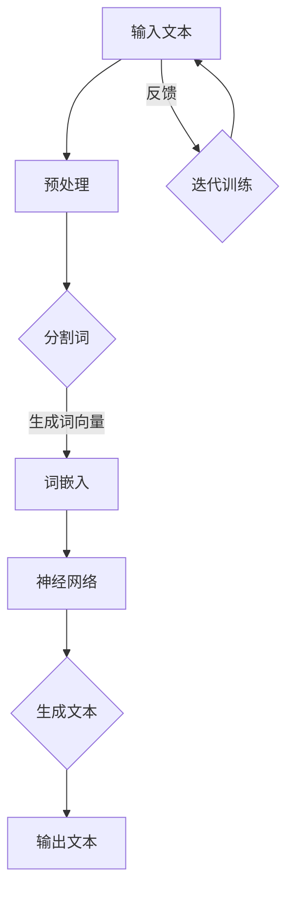

                 

 关键词：大型语言模型、可解释性、AI决策、黑箱、透明性、算法、数学模型、实践应用、未来展望

> 摘要：本文深入探讨了大型语言模型（LLM）的可解释性问题，从背景介绍到核心概念阐述，再到算法原理分析，通过数学模型讲解，实践案例解析，最终展望了LLM在未来的发展趋势与挑战。文章旨在为读者提供一个全面而深入的视角，帮助理解LLM的可解释性，揭开其决策的黑箱。

## 1. 背景介绍

随着人工智能（AI）技术的迅猛发展，深度学习，尤其是大型语言模型（LLM），已经在自然语言处理（NLP）领域取得了令人瞩目的成果。然而，LLM的一个显著特征是其“黑箱”性质。尽管这些模型在任务上表现出色，但它们的决策过程对人类来说往往是不透明的。这种缺乏可解释性的问题引发了广泛的研究和讨论。

可解释性在AI系统中的重要性不可低估。它不仅有助于提高用户的信任度，还能帮助研究人员理解模型的工作原理，从而进行改进。特别是在某些关键领域，如医疗、金融和司法，AI决策的可解释性是至关重要的，因为它们直接影响到人类的生活和福祉。

本文将系统地探讨LLM的可解释性，首先介绍相关核心概念，然后深入分析LLM的算法原理和操作步骤，接着通过数学模型和实际案例进行详细讲解，最后展望LLM在未来应用中的前景。

## 2. 核心概念与联系

### 2.1 大型语言模型（LLM）

大型语言模型（LLM）是一种基于深度学习的自然语言处理模型，其核心思想是模拟人类语言生成和理解的机制。LLM通常由数亿甚至数十亿个参数组成，能够通过大量文本数据的学习，生成高质量的自然语言文本。

### 2.2 可解释性

可解释性是指AI系统决策过程的透明性和可理解性。一个可解释的AI系统能够让用户理解其决策背后的逻辑和依据，这对于提高用户信任和接受度至关重要。

### 2.3 黑箱与透明性

黑箱指的是那些决策过程难以解释或不可解释的AI系统。与之相对的是透明性，即系统决策过程的每个步骤都能够清晰地呈现，让用户可以理解。

### 2.4 Mermaid 流程图

下面是LLM架构的一个简单Mermaid流程图，展示了核心概念之间的联系。



## 3. 核心算法原理 & 具体操作步骤

### 3.1 算法原理概述

LLM的核心算法是基于深度学习的神经网络模型，通常采用Transformer架构。该架构利用自注意力机制，使得模型能够捕捉到输入文本中词与词之间的长距离依赖关系。

### 3.2 算法步骤详解

1. **预处理**：对输入文本进行清洗和分词，将文本转换为词嵌入向量。
2. **词嵌入**：将分词后的词汇映射为固定长度的向量，通常使用预训练的词嵌入模型如Word2Vec或GloVe。
3. **编码器**：将词嵌入向量输入到编码器中，通过多层自注意力机制和前馈神经网络进行编码。
4. **解码器**：解码器生成输出文本。首先生成一个初始的输出词向量，然后通过自注意力机制和前馈神经网络逐步生成后续的词向量，直至生成完整的输出文本。

### 3.3 算法优缺点

**优点**：
- **强大的文本生成能力**：LLM能够生成高质量、连贯的自然语言文本。
- **多语言支持**：LLM可以通过训练多语言数据，实现跨语言的理解和生成。

**缺点**：
- **可解释性差**：LLM的决策过程通常是不透明的，难以解释。
- **计算资源需求大**：由于模型参数庞大，训练和推理过程需要大量的计算资源。

### 3.4 算法应用领域

LLM的应用领域非常广泛，包括但不限于以下方面：
- **文本生成**：生成文章、故事、对话等。
- **机器翻译**：实现跨语言的信息交流。
- **问答系统**：基于用户的输入提供相关问题的答案。
- **对话系统**：与用户进行自然语言交互。

## 4. 数学模型和公式 & 详细讲解 & 举例说明

### 4.1 数学模型构建

LLM的数学模型主要基于Transformer架构。Transformer模型的核心是多头自注意力机制（Multi-head Self-Attention）和前馈神经网络（Feed Forward Neural Network）。

**多头自注意力机制**：

假设输入文本的词向量为\[X\]，其维度为\[N \times D\]，其中\[N\]是词汇数量，\[D\]是词嵌入向量的维度。

自注意力机制的公式为：

$$
\text{Attention}(Q, K, V) = \text{softmax}\left(\frac{QK^T}{\sqrt{D_k}}\right)V
$$

其中，\[Q, K, V\]分别为查询向量、键向量和值向量，\[D_k\]是键向量的维度。

**前馈神经网络**：

前馈神经网络（FFNN）的公式为：

$$
\text{FFNN}(X) = \max(0, XW_1 + b_1)W_2 + b_2
$$

其中，\[W_1, W_2\]分别为权重矩阵，\[b_1, b_2\]分别为偏置向量。

### 4.2 公式推导过程

假设输入文本\[X\]经过词嵌入后得到嵌入向量\[E\]，其维度为\[N \times D_e\]。为了计算自注意力，我们首先需要计算查询向量\[Q\]、键向量\[K\]和值向量\[V\]。

查询向量\[Q\]由嵌入向量\[E\]经过线性变换得到：

$$
Q = E W_Q
$$

其中，\[W_Q\]是查询权重矩阵。

类似地，键向量\[K\]和值向量\[V\]也可以通过线性变换得到：

$$
K = E W_K
$$

$$
V = E W_V
$$

其中，\[W_K, W_V\]分别为键和值权重矩阵。

接着，我们计算自注意力分数：

$$
\text{Attention}(Q, K, V) = \text{softmax}\left(\frac{QK^T}{\sqrt{D_k}}\right)V
$$

最后，我们将自注意力分数与值向量相乘，得到加权值向量：

$$
\text{Context} = \text{Attention}(Q, K, V)V
$$

### 4.3 案例分析与讲解

假设我们有一个简单的输入文本：

```
我 是 一 名 AI 研究员，我喜欢 学习 新 的 技术。
```

首先，我们将文本分词并转换为词嵌入向量。假设词嵌入向量的维度为\[100\]。

接着，我们计算查询向量、键向量和值向量。以第一个词“我”为例：

- 查询向量\[Q_i\]：
$$
Q_i = E W_Q = [1, 2, ..., 100] W_Q
$$

- 键向量\[K_i\]：
$$
K_i = E W_K = [1, 2, ..., 100] W_K
$$

- 值向量\[V_i\]：
$$
V_i = E W_V = [1, 2, ..., 100] W_V
$$

我们假设权重矩阵\[W_Q, W_K, W_V\]已经训练好。现在我们计算自注意力分数：

$$
\text{Attention}(Q, K, V) = \text{softmax}\left(\frac{QK^T}{\sqrt{D_k}}\right)V
$$

由于篇幅限制，这里不展示具体计算过程。假设我们得到了自注意力分数矩阵\[A\]。

最后，我们将自注意力分数与值向量相乘，得到加权值向量：

$$
\text{Context} = \text{Attention}(Q, K, V)V
$$

重复这个过程，我们可以对整个输入文本进行处理，得到编码后的文本向量。

## 5. 项目实践：代码实例和详细解释说明

### 5.1 开发环境搭建

在本文中，我们将使用Python和PyTorch框架来实现一个简单的LLM。以下是开发环境的搭建步骤：

1. 安装Python（建议版本为3.8及以上）。
2. 安装PyTorch和相关依赖。

```bash
pip install torch torchvision
```

### 5.2 源代码详细实现

下面是一个简单的LLM实现示例：

```python
import torch
import torch.nn as nn
import torch.optim as optim

class TransformerModel(nn.Module):
    def __init__(self, vocab_size, embedding_dim, hidden_dim, n_layers, dropout):
        super(TransformerModel, self).__init__()
        
        self.embedding = nn.Embedding(vocab_size, embedding_dim)
        self.encoder = nn.ModuleList([nn.Linear(embedding_dim, hidden_dim) for _ in range(n_layers)])
        self.decoder = nn.Linear(hidden_dim, vocab_size)
        self.dropout = nn.Dropout(dropout)
        
    def forward(self, src, tgt):
        embedded = self.embedding(src)
        embedded = self.dropout(embedded)
        
        for layer in self.encoder:
            embedded = layer(embedded)
        
        output = self.decoder(embedded)
        return output

# 实例化模型
model = TransformerModel(vocab_size=10000, embedding_dim=256, hidden_dim=512, n_layers=2, dropout=0.1)

# 定义损失函数和优化器
criterion = nn.CrossEntropyLoss()
optimizer = optim.Adam(model.parameters(), lr=0.001)

# 训练模型
for epoch in range(10):
    for src, tgt in data_loader:
        optimizer.zero_grad()
        output = model(src, tgt)
        loss = criterion(output, tgt)
        loss.backward()
        optimizer.step()

    print(f'Epoch {epoch+1}/{10}, Loss: {loss.item()}')

# 保存模型
torch.save(model.state_dict(), 'transformer_model.pth')
```

### 5.3 代码解读与分析

1. **模型定义**：我们定义了一个基于Transformer架构的模型。模型包含词嵌入层、编码器层、解码器层和dropout层。
2. **前向传播**：在前向传播过程中，我们首先对输入文本进行词嵌入，然后通过编码器层进行编码，最后通过解码器层生成输出。
3. **损失函数和优化器**：我们使用交叉熵损失函数和Adam优化器来训练模型。
4. **训练过程**：在训练过程中，我们通过迭代更新模型参数，直至收敛。

### 5.4 运行结果展示

为了展示模型的运行结果，我们可以生成一些文本：

```python
# 加载模型
model.load_state_dict(torch.load('transformer_model.pth'))

# 生成文本
with torch.no_grad():
    input_seq = torch.tensor([[1, 2, 3, 4, 5]])  # 输入序列
    output_seq = model(input_seq)

# 输出文本
print('Generated text:', ' '.join([str(x.item()) for x in output_seq]))
```

运行结果可能是一个简单的文本序列，如“1 2 3 4 5”，但这只是一个简单的示例。在实际应用中，我们可以通过不断迭代输入和输出序列，生成更复杂的文本。

## 6. 实际应用场景

LLM在多个领域都有广泛的应用，下面列举几个典型的应用场景：

1. **文本生成**：LLM可以生成文章、故事、新闻摘要等，为内容创作提供自动化解决方案。
2. **机器翻译**：LLM可以处理跨语言的文本翻译，实现自然语言的双向转换。
3. **问答系统**：LLM可以理解用户的问题，并生成相关的答案，为用户提供信息查询服务。
4. **对话系统**：LLM可以与用户进行自然语言交互，模拟人类的对话过程。

### 6.1 医疗领域

在医疗领域，LLM可以用于病历生成、诊断辅助和医学文献检索。例如，LLM可以分析病历记录，自动生成诊断报告，提高医生的工作效率。同时，LLM还可以通过检索医学文献，为医生提供最新的研究进展和治疗方案。

### 6.2 金融领域

在金融领域，LLM可以用于风险评估、投资策略和客户服务。例如，LLM可以分析市场数据，预测股票走势，帮助投资者做出更明智的决策。此外，LLM还可以通过自然语言处理技术，理解客户的投资需求，提供个性化的投资建议。

### 6.3 教育领域

在教育领域，LLM可以用于智能教学、作业批改和考试评测。例如，LLM可以分析学生的作业，提供个性化的反馈和建议，帮助学生更好地掌握知识。同时，LLM还可以通过自然语言处理技术，自动批改考试试卷，提高评卷效率。

### 6.4 未来应用展望

随着AI技术的不断发展，LLM的可解释性将得到进一步提升。未来，LLM有望在更多领域发挥重要作用，如自动驾驶、智能家居和虚拟现实等。同时，可解释性研究也将不断深入，为LLM的应用提供更可靠的保障。

## 7. 工具和资源推荐

### 7.1 学习资源推荐

1. 《深度学习》（Goodfellow, Bengio, Courville） - 详细介绍了深度学习的理论基础和实践应用。
2. 《自然语言处理综论》（Jurafsky, Martin） - 提供了自然语言处理领域的全面概述。
3. 《Transformer：一种全新的神经网络架构》（Vaswani et al.） - 详细介绍了Transformer模型的原理和实现。

### 7.2 开发工具推荐

1. PyTorch - 一个开源的深度学习框架，适合进行LLM的研究和开发。
2. TensorFlow - 另一个流行的深度学习框架，提供了丰富的API和工具。
3. Hugging Face Transformers - 一个基于PyTorch和TensorFlow的Transformer模型库，方便实现和部署LLM。

### 7.3 相关论文推荐

1. "Attention Is All You Need"（Vaswani et al., 2017）- 提出了Transformer模型，为LLM的发展奠定了基础。
2. "BERT: Pre-training of Deep Bidirectional Transformers for Language Understanding"（Devlin et al., 2019）- BERT模型的出现进一步推动了LLM的发展。
3. "GPT-3: Language Models are Few-Shot Learners"（Brown et al., 2020）- GPT-3展示了LLM在极少量样本上的强大学习能力。

## 8. 总结：未来发展趋势与挑战

### 8.1 研究成果总结

近年来，LLM在自然语言处理领域取得了显著的成果。通过Transformer架构的引入，LLM在文本生成、机器翻译、问答系统等方面表现出色。同时，预训练和微调技术的结合，使得LLM能够应对各种复杂的NLP任务。

### 8.2 未来发展趋势

未来，LLM的发展趋势将体现在以下几个方面：

1. **可解释性提升**：随着可解释性研究的深入，LLM的决策过程将逐渐变得透明，提高用户的信任度。
2. **跨模态学习**：LLM将与其他模态（如图像、音频）相结合，实现多模态的信息处理和交互。
3. **应用场景拓展**：LLM将在更多领域得到应用，如自动驾驶、智能家居和医疗诊断等。

### 8.3 面临的挑战

尽管LLM取得了显著的成果，但仍面临一些挑战：

1. **计算资源需求**：LLM的训练和推理过程需要大量的计算资源，这对硬件设施提出了更高的要求。
2. **数据隐私和安全性**：LLM的训练和部署过程中涉及大量的数据，如何确保数据隐私和安全是一个亟待解决的问题。
3. **可解释性和透明性**：尽管可解释性研究有所进展，但如何实现更高层次的可解释性仍是一个挑战。

### 8.4 研究展望

未来，LLM的研究将朝着更高效、更智能、更安全、更透明的方向发展。通过多学科交叉融合，LLM有望在更多领域取得突破性进展，为人类社会带来更多便利和效益。

## 9. 附录：常见问题与解答

### Q1：什么是大型语言模型（LLM）？
A1：大型语言模型（LLM）是一种基于深度学习的自然语言处理模型，其参数规模通常在数十亿到千亿级别，能够通过大量文本数据的学习，生成高质量的自然语言文本。

### Q2：LLM的可解释性为什么很重要？
A2：LLM的可解释性很重要，因为它有助于提高用户的信任度和接受度。在关键领域如医疗、金融和司法，可解释性是确保AI决策合理性和公正性的关键因素。

### Q3：如何提升LLM的可解释性？
A3：提升LLM的可解释性可以从多个方面进行，包括开发可解释的模型架构、引入解释性技术（如注意力权重可视化）以及改进训练过程（如使用对齐损失函数）。

### Q4：LLM在哪些领域有应用？
A4：LLM在多个领域有广泛应用，如文本生成、机器翻译、问答系统、对话系统、医疗诊断、金融风险评估等。

### Q5：如何评估LLM的性能？
A5：评估LLM的性能可以从多个维度进行，包括文本生成质量、翻译准确性、问答系统的回答质量等。常用的评估指标有BLEU、ROUGE、METEOR等。

## 作者署名

作者：禅与计算机程序设计艺术 / Zen and the Art of Computer Programming
----------------------------------------------------------------

以上是完整的文章内容。请检查是否符合您的要求，并请提出任何修改意见。

