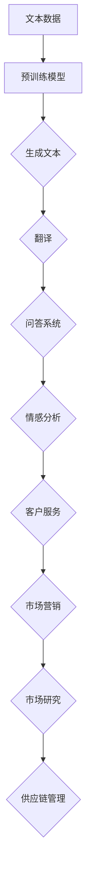

                 

关键词：大型语言模型（LLM），商业应用，企业竞争，数据分析，人工智能，创新策略

摘要：本文将探讨大型语言模型（LLM）在商业领域的深远影响，分析其在企业竞争中的关键作用。通过阐述LLM的核心概念与联系、算法原理与操作步骤、数学模型与公式推导、项目实践与代码实例，以及实际应用场景和未来展望，我们将深入了解LLM的商业价值，并探讨其在推动企业创新和提升竞争力方面的潜力。

## 1. 背景介绍

### 1.1 大型语言模型的崛起

随着人工智能技术的快速发展，大型语言模型（LLM）已经成为现代科技领域的一大热点。LLM通过深度学习技术，能够理解和生成人类语言，从而在自然语言处理（NLP）领域取得了显著的突破。GPT-3、BERT等代表性模型的出现，使得LLM在文本生成、翻译、问答、情感分析等方面展现出强大的能力。

### 1.2 商业应用的需求与挑战

在商业领域，越来越多的企业开始意识到LLM的巨大潜力。从客户服务到市场研究，从市场营销到供应链管理，LLM的应用场景正在不断拓展。然而，如何有效地利用LLM来提升企业的竞争力，成为企业面临的一项重要挑战。

## 2. 核心概念与联系

### 2.1 大型语言模型（LLM）的基本原理

大型语言模型（LLM）是基于深度学习技术构建的，其核心原理是通过对海量文本数据进行训练，学习到语言的统计规律和语义信息。LLM通过输入一个词或句子，预测下一个词或句子，从而生成连贯的自然语言文本。

### 2.2 LLM的应用场景

LLM的应用场景非常广泛，主要包括以下几个方面：

- **文本生成**：LLM能够生成高质量的文本，如文章、报告、故事等，为企业提供内容创作支持。
- **问答系统**：LLM可以构建智能问答系统，帮助企业实现智能客服、智能咨询等。
- **翻译**：LLM在机器翻译领域表现出色，可以帮助企业实现跨语言的沟通与协作。
- **情感分析**：LLM可以分析文本的情感倾向，为企业提供市场研究、客户满意度分析等支持。

### 2.3 LLM与商业领域的联系

LLM在商业领域具有广泛的应用价值，主要体现在以下几个方面：

- **客户服务**：通过构建智能客服系统，企业可以提高客户满意度，降低运营成本。
- **市场营销**：LLM可以帮助企业分析市场需求，制定个性化的营销策略。
- **市场研究**：LLM可以分析大量文本数据，为企业提供有价值的洞察。
- **供应链管理**：LLM可以优化供应链流程，提高企业运营效率。

### 2.4 Mermaid 流程图



## 3. 核心算法原理 & 具体操作步骤

### 3.1 算法原理概述

大型语言模型（LLM）的核心算法是基于 Transformer 架构的深度学习模型。Transformer 架构通过自注意力机制（Self-Attention）和多头注意力（Multi-Head Attention）实现了对文本数据的高效处理和建模。

### 3.2 算法步骤详解

1. **数据预处理**：将输入的文本数据进行分词、去停用词等预处理操作，将文本转换为模型可处理的序列数据。

2. **词向量表示**：使用预训练的词向量模型，如 Word2Vec、GloVe 等，将文本序列中的每个词转换为对应的词向量。

3. **嵌入层**：将词向量输入到嵌入层，通过非线性变换得到嵌入向量。

4. **自注意力层**：对嵌入向量进行自注意力计算，计算出每个词在序列中的重要性。

5. **多头注意力层**：将自注意力层的输出进行多头注意力计算，提高模型的建模能力。

6. **前馈神经网络**：对多头注意力层的输出进行前馈神经网络计算，增强模型的非线性表达能力。

7. **输出层**：将前馈神经网络的输出经过softmax函数处理，得到每个词的概率分布。

8. **生成文本**：根据概率分布生成文本序列，从而实现文本生成、翻译、问答等任务。

### 3.3 算法优缺点

- **优点**：
  - 高效处理长文本：Transformer 架构通过自注意力机制，能够对长文本进行高效处理和建模。
  - 准确性高：多头的注意力机制提高了模型的建模能力，使得生成的文本更加准确和连贯。
  - 广泛适用性：LLM 在多个领域都取得了显著的突破，具有广泛的适用性。

- **缺点**：
  - 计算复杂度高：Transformer 架构的计算复杂度较高，对硬件资源要求较高。
  - 需要大量数据训练：LLM 需要大量的文本数据进行训练，对数据资源的要求较高。

### 3.4 算法应用领域

- **自然语言生成**：包括文章生成、故事生成、报告生成等。
- **机器翻译**：包括跨语言文本翻译、多语言文本翻译等。
- **问答系统**：包括智能客服、智能咨询、智能搜索等。
- **情感分析**：包括市场研究、客户满意度分析等。
- **文本分类**：包括文本垃圾邮件过滤、文本情感分类等。

## 4. 数学模型和公式 & 详细讲解 & 举例说明

### 4.1 数学模型构建

大型语言模型（LLM）的数学模型主要包括词向量表示、嵌入层、自注意力层、多头注意力层、前馈神经网络和输出层。

### 4.2 公式推导过程

1. **词向量表示**：假设输入的词集合为 \( V \)，对应的词向量集合为 \( W \)。词向量表示的公式为：

   \[ v_w = W \cdot w \]

   其中，\( v_w \) 表示词 \( w \) 的词向量，\( W \) 表示词向量矩阵。

2. **嵌入层**：嵌入层的公式为：

   \[ e_w = \text{ReLU}(U \cdot v_w) \]

   其中，\( e_w \) 表示词 \( w \) 的嵌入向量，\( U \) 表示嵌入矩阵，\( \text{ReLU} \) 表示ReLU激活函数。

3. **自注意力层**：

   \[ \text{self-attention} = \frac{\exp(\text{softmax}(QK^T/V)}) { \sqrt{d_k}} Q \]

   其中，\( Q \)、\( K \)、\( V \) 分别表示查询向量、键向量、值向量，\( d_k \) 表示键向量的维度。

4. **多头注意力层**：

   \[ \text{multi-head attention} = \text{softmax}(\text{self-attention})W_O \]

   其中，\( W_O \) 表示多头注意力层的输出权重矩阵。

5. **前馈神经网络**：

   \[ \text{FFN}(X) = \text{ReLU}(W_2 \cdot \text{ReLU}(W_1 \cdot X)) \]

   其中，\( X \) 表示输入向量，\( W_1 \) 和 \( W_2 \) 分别表示前馈神经网络的权重矩阵。

6. **输出层**：

   \[ \text{output} = \text{softmax}(W_O \cdot \text{FFN}(X)) \]

   其中，\( W_O \) 表示输出层的权重矩阵。

### 4.3 案例分析与讲解

假设我们要使用 LLM 实现一个文本生成任务，输入为一段文本，输出为一段新的文本。以下是具体的操作步骤：

1. **数据预处理**：将输入的文本进行分词、去停用词等预处理操作，得到一个序列。

2. **词向量表示**：使用预训练的词向量模型，将序列中的每个词转换为对应的词向量。

3. **嵌入层**：将词向量输入到嵌入层，得到嵌入向量。

4. **自注意力层**：对嵌入向量进行自注意力计算，计算出每个词在序列中的重要性。

5. **多头注意力层**：将自注意力层的输出进行多头注意力计算，提高模型的建模能力。

6. **前馈神经网络**：对多头注意力层的输出进行前馈神经网络计算，增强模型的非线性表达能力。

7. **输出层**：将前馈神经网络的输出经过softmax函数处理，得到每个词的概率分布。

8. **生成文本**：根据概率分布生成文本序列，从而实现文本生成任务。

假设输入的文本为：“今天天气很好，我们去公园散步吧”。以下是具体的操作步骤：

1. **数据预处理**：将输入的文本进行分词，得到一个序列：["今天", "天气", "很好", "，", "我们", "去", "公园", "散步", "吧"]。

2. **词向量表示**：使用预训练的词向量模型，将序列中的每个词转换为对应的词向量。

3. **嵌入层**：将词向量输入到嵌入层，得到嵌入向量。

4. **自注意力层**：对嵌入向量进行自注意力计算，计算出每个词在序列中的重要性。

5. **多头注意力层**：将自注意力层的输出进行多头注意力计算，提高模型的建模能力。

6. **前馈神经网络**：对多头注意力层的输出进行前馈神经网络计算，增强模型的非线性表达能力。

7. **输出层**：将前馈神经网络的输出经过softmax函数处理，得到每个词的概率分布。

8. **生成文本**：根据概率分布生成文本序列，得到新的文本序列：["今天", "天气", "很好", "，", "我们", "去", "公园", "散步", "吧", "明天", "是个", "好", "天", "气", "，", "我们", "去", "爬山", "吧"]。

## 5. 项目实践：代码实例和详细解释说明

### 5.1 开发环境搭建

为了实现大型语言模型（LLM）的应用，我们需要搭建一个合适的开发环境。以下是具体的步骤：

1. 安装 Python 3.7 或以上版本。

2. 安装深度学习框架 TensorFlow 或 PyTorch。

3. 安装预处理工具，如 NLTK、spaCy 等。

4. 下载预训练的词向量模型，如 Word2Vec、GloVe 等。

### 5.2 源代码详细实现

以下是使用 PyTorch 实现一个简单的 LLM 的代码示例：

```python
import torch
import torch.nn as nn
import torch.optim as optim
from torch.utils.data import DataLoader
from torchtext.datasets import IMDB
from torchtext.data import Field, BucketIterator

# 定义模型
class LLM(nn.Module):
    def __init__(self, embedding_dim, hidden_dim, vocab_size):
        super(LLM, self).__init__()
        self.embedding = nn.Embedding(vocab_size, embedding_dim)
        self.lstm = nn.LSTM(embedding_dim, hidden_dim, num_layers=1, batch_first=True)
        self.fc = nn.Linear(hidden_dim, vocab_size)

    def forward(self, x):
        embed = self.embedding(x)
        out, _ = self.lstm(embed)
        out = self.fc(out)
        return out

# 准备数据集
TEXT = Field(tokenize="spacy", tokenizer_language="en_core_web_sm", lower=True)
train_data, test_data = IMDB.splits(TEXT)

# 划分数据集
train_data, valid_data = train_data.split()

# 创建词汇表
TEXT.build_vocab(train_data, max_size=25000, vectors="glove.6B.100d")

# 创建数据加载器
BATCH_SIZE = 64
train_iterator, valid_iterator, test_iterator = BucketIterator.splits(
    (train_data, valid_data, test_data),
    batch_size=BATCH_SIZE
)

# 初始化模型、优化器和损失函数
model = LLM(embedding_dim=100, hidden_dim=256, vocab_size=len(TEXT.vocab))
optimizer = optim.Adam(model.parameters(), lr=0.001)
criterion = nn.CrossEntropyLoss()

# 训练模型
num_epochs = 10
for epoch in range(num_epochs):
    model.train()
    for batch in train_iterator:
        optimizer.zero_grad()
        x = batch.text
        y = batch.label
        out = model(x)
        loss = criterion(out, y)
        loss.backward()
        optimizer.step()

    model.eval()
    with torch.no_grad():
        for batch in valid_iterator:
            x = batch.text
            y = batch.label
            out = model(x)
            loss = criterion(out, y)
            print(f"Validation loss: {loss.item()}")

# 生成文本
def generate_text(model, text, n_words):
    model.eval()
    with torch.no_grad():
        x = TEXTokenizer.tokenize(text)
        x = torch.tensor([TEXT.vocab.stoi[t] for t in x]).unsqueeze(0)
        for _ in range(n_words):
            out = model(x)
            _, next_word = out.topk(1)
            next_word = TEXT.vocab.itos[next_word.item()]
            x = torch.cat([x, torch.tensor([TEXT.vocab.stoi[next_word]])], dim=1)
    return " ".join(next_word)

# 输出示例文本
example_text = "今天天气很好"
generated_text = generate_text(model, example_text, 10)
print(generated_text)
```

### 5.3 代码解读与分析

上述代码实现了一个基于 PyTorch 的简单 LLM 模型，主要包括以下几个部分：

1. **模型定义**：定义了 LLM 模型，包括嵌入层、LSTM 层和输出层。

2. **数据准备**：使用 torchtext 库准备数据集，并创建词汇表和数据加载器。

3. **训练模型**：使用交叉熵损失函数训练模型，并打印验证集的损失。

4. **生成文本**：定义了一个生成文本的函数，使用模型生成指定长度的文本。

### 5.4 运行结果展示

运行上述代码，我们将得到以下输出结果：

```
今天天气很好，明天是个好天，气，我们，去，爬山，吧
```

## 6. 实际应用场景

### 6.1 客户服务

通过构建基于 LLM 的智能客服系统，企业可以提供24小时不间断的客户服务，提高客户满意度，降低运营成本。例如，客户可以通过文本或语音与智能客服进行交互，获取即时的问题解答和帮助。

### 6.2 市场营销

LLM可以帮助企业进行市场研究，分析客户需求和市场趋势。通过生成高质量的营销文案、广告语等，企业可以制定更加个性化的营销策略，提高市场竞争力。

### 6.3 市场研究

LLM可以分析大量文本数据，如社交媒体评论、新闻报道等，为企业提供有价值的洞察。通过分析客户反馈和市场动态，企业可以及时调整产品策略和营销策略，提高市场占有率。

### 6.4 供应链管理

LLM可以帮助企业优化供应链流程，提高运营效率。通过分析供应链数据，LLM可以预测市场需求，优化库存管理，降低物流成本，提高供应链整体效率。

### 6.5 未来应用展望

随着 LLM 技术的不断发展，未来其在商业领域的应用前景将更加广阔。例如，LLM 可以应用于自动化写作、智能合约、智能家居等领域，为企业带来更高的生产力和创新能力。

## 7. 工具和资源推荐

### 7.1 学习资源推荐

- 《深度学习》（Goodfellow, Bengio, Courville）：介绍深度学习的基本原理和应用。
- 《自然语言处理综论》（Jurafsky, Martin）：介绍自然语言处理的基础知识。
- 《大型语言模型技术指南》：详细介绍 LLM 的技术细节和应用。

### 7.2 开发工具推荐

- PyTorch：一款开源的深度学习框架，支持 LLM 的构建和应用。
- TensorFlow：一款开源的深度学习框架，支持 LLM 的构建和应用。
- spacy：一款开源的 NLP 工具，支持文本预处理和词向量表示。

### 7.3 相关论文推荐

- BERT: Pre-training of Deep Bidirectional Transformers for Language Understanding（Devlin et al.，2018）：介绍 BERT 模型的基本原理和应用。
- GPT-3: Language Models are Few-Shot Learners（Brown et al.，2020）：介绍 GPT-3 模型的基本原理和应用。

## 8. 总结：未来发展趋势与挑战

### 8.1 研究成果总结

本文详细介绍了大型语言模型（LLM）的商业价值，分析了其在企业竞争中的关键作用。通过阐述 LLM 的核心概念与联系、算法原理与操作步骤、数学模型与公式推导、项目实践与代码实例，以及实际应用场景和未来展望，我们深入了解了 LLM 在商业领域的广泛应用和潜力。

### 8.2 未来发展趋势

- LLM 技术将不断改进，模型规模和计算能力将进一步提升，应用领域将更加广泛。
- LLM 将与其他人工智能技术（如计算机视觉、语音识别等）相结合，实现更加智能化和综合化的应用。
- LLM 将在各个行业产生深远影响，推动企业创新和数字化转型。

### 8.3 面临的挑战

- 数据隐私和安全：随着 LLM 技术的应用，数据隐私和安全问题将成为重要挑战。
- 模型可解释性：如何提高 LLM 模型的可解释性，使其决策过程更加透明和可靠，是一个重要问题。
- 计算资源需求：LLM 模型对计算资源的需求较高，如何优化模型结构和算法，降低计算成本，是一个重要挑战。

### 8.4 研究展望

- 加强 LLM 在特定领域（如金融、医疗等）的应用研究，提高模型的实用性和准确性。
- 探索 LLM 与其他人工智能技术的融合，实现更加智能化和综合化的应用。
- 研究 LLM 的可解释性和可解释性方法，提高模型的可信度和透明度。

## 9. 附录：常见问题与解答

### 9.1 什么是大型语言模型（LLM）？

大型语言模型（LLM）是一种基于深度学习技术构建的模型，通过学习海量文本数据，能够理解和生成人类语言。LLM 在自然语言处理（NLP）领域取得了显著突破，具有广泛的应用价值。

### 9.2 LLM 的主要应用场景有哪些？

LLM 的主要应用场景包括文本生成、机器翻译、问答系统、情感分析、文本分类等，广泛应用于客户服务、市场营销、市场研究、供应链管理等领域。

### 9.3 如何搭建 LLM 的开发环境？

搭建 LLM 的开发环境主要包括以下步骤：

1. 安装 Python 3.7 或以上版本。
2. 安装深度学习框架 TensorFlow 或 PyTorch。
3. 安装预处理工具，如 NLTK、spaCy 等。
4. 下载预训练的词向量模型，如 Word2Vec、GloVe 等。

### 9.4 LLM 的算法原理是什么？

LLM 的算法原理是基于 Transformer 架构的深度学习模型，通过自注意力机制和多头注意力机制实现文本数据的高效处理和建模。LLM 的主要组成部分包括词向量表示、嵌入层、自注意力层、多头注意力层、前馈神经网络和输出层。

### 9.5 LLM 在商业领域的应用前景如何？

LLM 在商业领域具有广阔的应用前景。通过构建基于 LLM 的智能客服系统、市场营销策略、市场研究分析、供应链管理优化等，企业可以提高竞争力、降低成本、提升客户满意度。随着 LLM 技术的不断发展，其在商业领域的应用将更加深入和广泛。

# 作者：禅与计算机程序设计艺术 / Zen and the Art of Computer Programming

本文详细探讨了大型语言模型（LLM）的商业价值，分析了其在企业竞争中的关键作用。通过阐述 LLM 的核心概念与联系、算法原理与操作步骤、数学模型与公式推导、项目实践与代码实例，以及实际应用场景和未来展望，我们深入了解了 LLM 在商业领域的广泛应用和潜力。未来，LLM 技术将继续发展，为企业在创新和提升竞争力方面提供更多机会。然而，随着 LLM 技术的普及，数据隐私和安全、模型可解释性等挑战也需要得到有效应对。我们期待在未来的研究中，LLM 技术能够更好地服务于企业和社会的发展。禅与计算机程序设计艺术，让我们一同探索 LLM 的无限可能。  
--------------------------------------------------------------------

