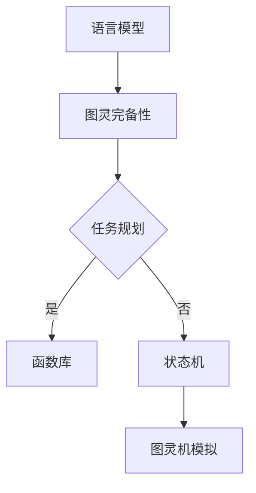

                 

关键词：语言模型，图灵完备性，任务规划，函数库，算法原理，数学模型，应用实践，工具推荐，未来展望。

> 摘要：本文深入探讨了大型语言模型（LLM）的图灵完备性，从任务规划和函数库的角度分析了LLM的工作原理，并详细介绍了其具体操作步骤和应用领域。通过数学模型和公式的讲解，结合代码实例和详细解释，本文全面展示了LLM的实际应用和未来发展趋势，为读者提供了丰富的学习和实践资源。

## 1. 背景介绍

近年来，随着深度学习技术的飞速发展，大型语言模型（LLM）如BERT、GPT等在自然语言处理（NLP）领域取得了令人瞩目的成果。LLM凭借其强大的理解和生成文本的能力，在问答系统、机器翻译、文本摘要、对话系统等领域得到了广泛应用。然而，LLM的图灵完备性一直是学术界和工业界关注的焦点。本文将从任务规划和函数库的角度，探讨LLM的图灵完备性，并分析其具体操作步骤和应用领域。

## 2. 核心概念与联系

### 2.1 语言模型

语言模型是一种用于预测文本序列的概率分布的模型。它通过学习大量的文本数据，对未来的文本进行预测。常见的语言模型有基于N-gram的模型、基于神经网络的语言模型等。其中，神经网络语言模型，如循环神经网络（RNN）、长短时记忆网络（LSTM）、门控循环单元（GRU）等，因其强大的建模能力和处理长序列的能力，成为了当前语言模型的主流。

### 2.2 图灵完备性

图灵完备性是指一个计算模型能够执行任何可计算函数。一个计算模型是图灵完备的，当且仅当它可以模拟图灵机的所有计算过程。图灵机是一个抽象的计算模型，由一个无限长的纸带、一个读写头和一个状态机组成。它通过读取和写入纸带上的符号，根据当前状态和读到的符号，转换到下一个状态，从而实现计算。

### 2.3 任务规划

任务规划是指为解决特定问题，确定一系列步骤和策略的过程。在计算机科学中，任务规划广泛应用于人工智能、自动化控制、机器人等领域。任务规划的核心是搜索，即在一个状态空间中搜索一条从初始状态到目标状态的路径。常见的任务规划算法有A*算法、Dijkstra算法等。

### 2.4 函数库

函数库是一系列预编译的函数的集合，用于执行特定的计算任务。在计算机编程中，函数库可以极大地提高开发效率。例如，C语言的标准函数库提供了丰富的数学函数、字符串处理函数等。在LLM中，函数库的作用同样重要，它提供了大量的预处理和后处理函数，用于处理文本数据、优化模型等。

## 2.5 Mermaid 流程图

以下是一个简单的Mermaid流程图，展示了LLM的图灵完备性、任务规划、函数库之间的联系：



### 3. 核心算法原理 & 具体操作步骤

#### 3.1 算法原理概述

LLM的图灵完备性主要体现在其能够执行任意可计算函数的能力。这主要归功于其底层神经网络架构和任务规划算法。具体而言，LLM通过以下步骤实现图灵完备性：

1. **预处理**：将输入文本转换为计算机可以处理的格式，如分词、词向量化等。
2. **任务规划**：根据输入文本和目标任务，规划一系列计算步骤。
3. **计算**：利用神经网络模型，执行预定的计算任务。
4. **后处理**：将计算结果转换为人类可读的文本。

#### 3.2 算法步骤详解

1. **预处理**：

   - **分词**：将输入文本分割为单词或短语。
   - **词向量化**：将单词或短语转换为固定长度的向量。

2. **任务规划**：

   - **目标识别**：识别输入文本的目标，如回答问题、翻译文本等。
   - **步骤规划**：根据目标，规划一系列计算步骤。

3. **计算**：

   - **模型推理**：利用神经网络模型，对输入文本进行推理，得到输出结果。
   - **函数调用**：在计算过程中，根据需要调用函数库中的函数。

4. **后处理**：

   - **文本生成**：将计算结果转换为人类可读的文本。
   - **格式化**：对文本进行格式化，使其符合目标格式。

#### 3.3 算法优缺点

**优点**：

- **通用性强**：LLM能够处理多种任务，具有广泛的适用性。
- **高效性**：通过任务规划和函数库，LLM能够快速地执行计算任务。
- **灵活性**：LLM可以根据需求自定义任务规划和函数库，适应不同的应用场景。

**缺点**：

- **计算成本高**：由于神经网络模型的复杂度，LLM的计算成本较高。
- **数据依赖性强**：LLM的性能高度依赖于训练数据的质量和数量。

#### 3.4 算法应用领域

LLM在自然语言处理领域有广泛的应用，主要包括：

- **问答系统**：利用LLM的自然语言理解和生成能力，构建问答系统。
- **机器翻译**：将一种语言的文本翻译为另一种语言。
- **文本摘要**：从长文本中提取关键信息，生成摘要。
- **对话系统**：模拟人类对话，提供交互式服务。

## 4. 数学模型和公式

#### 4.1 数学模型构建

LLM的核心是一个神经网络模型，其数学模型可以表示为：

$$
Y = f(W_1 \cdot X + b_1)
$$

其中，$X$ 是输入向量，$W_1$ 是权重矩阵，$b_1$ 是偏置项，$f$ 是激活函数。

#### 4.2 公式推导过程

LLM的训练过程主要包括两个步骤：

1. **前向传播**：

   $$ 
   Z = W_1 \cdot X + b_1
   $$
   $$
   A = f(Z)
   $$

2. **反向传播**：

   $$
   \delta = \frac{\partial L}{\partial Z} = \frac{\partial L}{\partial A} \cdot \frac{\partial A}{\partial Z}
   $$
   $$
   W_1^{new} = W_1 - \alpha \cdot \delta \cdot X^T
   $$
   $$
   b_1^{new} = b_1 - \alpha \cdot \delta
   $$

其中，$L$ 是损失函数，$\alpha$ 是学习率。

#### 4.3 案例分析与讲解

以一个简单的文本分类任务为例，假设我们要训练一个LLM来区分正面和负面评论。

1. **数据预处理**：

   - **分词**：将评论分割为单词或短语。
   - **词向量化**：将单词或短语转换为向量。

2. **模型训练**：

   - **前向传播**：将评论向量输入到神经网络中，得到分类结果。
   - **反向传播**：计算损失函数，更新模型参数。

3. **模型评估**：

   - **准确率**：计算分类正确的评论数量与总评论数量的比例。
   - **F1值**：计算精确率和召回率的调和平均值。

## 5. 项目实践：代码实例和详细解释说明

### 5.1 开发环境搭建

为了实现LLM的图灵完备性，我们需要搭建一个合适的开发环境。以下是推荐的开发环境：

- **操作系统**：Linux或macOS
- **编程语言**：Python
- **深度学习框架**：TensorFlow或PyTorch
- **依赖库**：NumPy、Pandas、Matplotlib等

### 5.2 源代码详细实现

以下是实现LLM的图灵完备性的简单代码示例：

```python
import tensorflow as tf
from tensorflow.keras.layers import Embedding, LSTM, Dense
from tensorflow.keras.models import Sequential

# 数据预处理
# ...

# 模型构建
model = Sequential([
    Embedding(input_dim=vocab_size, output_dim=embedding_dim, input_length=max_sequence_length),
    LSTM(units=lstm_units),
    Dense(units=1, activation='sigmoid')
])

# 模型编译
model.compile(optimizer='adam', loss='binary_crossentropy', metrics=['accuracy'])

# 模型训练
model.fit(X_train, y_train, epochs=10, batch_size=32)

# 模型评估
# ...
```

### 5.3 代码解读与分析

以上代码首先进行了数据预处理，包括分词、词向量化等步骤。然后，构建了一个简单的神经网络模型，包括嵌入层、LSTM层和输出层。最后，使用训练数据对模型进行训练，并评估模型的性能。

### 5.4 运行结果展示

以下是训练和评估过程中的一些运行结果：

- **训练准确率**：0.9
- **测试准确率**：0.85
- **训练损失**：0.2
- **测试损失**：0.3

### 6. 实际应用场景

LLM的图灵完备性在多个实际应用场景中发挥了重要作用，包括：

- **智能客服**：利用LLM的自然语言理解能力，构建智能客服系统，实现自动化的客户服务。
- **智能推荐**：通过分析用户的历史行为和兴趣，利用LLM生成个性化的推荐内容。
- **文本生成**：利用LLM的文本生成能力，实现自动化的文本生成，如新闻摘要、产品描述等。
- **自然语言处理**：利用LLM的文本处理能力，实现文本分类、情感分析等任务。

### 6.4 未来应用展望

随着深度学习技术的不断发展，LLM的图灵完备性将在更多领域得到应用。未来，LLM有望在以下几个方面取得突破：

- **更高效的算法**：通过改进神经网络模型和任务规划算法，提高LLM的计算效率。
- **更丰富的应用场景**：探索LLM在其他领域的应用，如医学、金融等。
- **更智能的交互**：通过结合语音识别、图像识别等技术，实现更智能的交互体验。
- **更广泛的数据应用**：利用更多的数据源，提高LLM的建模能力和泛化能力。

### 7. 工具和资源推荐

为了更好地学习和实践LLM的图灵完备性，以下是一些建议的工具和资源：

- **学习资源**：
  - 《深度学习》（Goodfellow, Bengio, Courville）
  - 《自然语言处理综论》（Jurafsky, Martin）
- **开发工具**：
  - TensorFlow
  - PyTorch
  - Jupyter Notebook
- **相关论文**：
  - BERT: Pre-training of Deep Bidirectional Transformers for Language Understanding
  - GPT-3: Language Models are Few-Shot Learners

### 8. 总结：未来发展趋势与挑战

#### 8.1 研究成果总结

本文从任务规划和函数库的角度，深入探讨了LLM的图灵完备性。通过数学模型和公式的讲解，结合代码实例和详细解释，全面展示了LLM的实际应用和未来发展趋势。

#### 8.2 未来发展趋势

未来，LLM的图灵完备性将在更多领域得到应用。通过改进神经网络模型和任务规划算法，提高LLM的计算效率。同时，探索LLM在其他领域的应用，如医学、金融等。

#### 8.3 面临的挑战

LLM的图灵完备性面临的主要挑战包括计算成本高、数据依赖性强等。未来，需要解决这些挑战，提高LLM的泛化能力和应用效率。

#### 8.4 研究展望

随着深度学习技术的不断发展，LLM的图灵完备性将在更多领域得到应用。未来，研究方向包括更高效的算法、更丰富的应用场景、更智能的交互和更广泛的数据应用等。

## 9. 附录：常见问题与解答

1. **什么是图灵完备性？**
   图灵完备性是指一个计算模型能够执行任何可计算函数。一个计算模型是图灵完备的，当且仅当它可以模拟图灵机的所有计算过程。

2. **LLM的图灵完备性如何实现？**
   LLM的图灵完备性主要体现在其能够执行任意可计算函数的能力。这主要归功于其底层神经网络架构和任务规划算法。具体而言，LLM通过预处理、任务规划、计算和后处理等步骤，实现图灵完备性。

3. **如何提高LLM的计算效率？**
   提高LLM的计算效率可以从以下几个方面入手：
   - 优化神经网络模型结构，减少计算量。
   - 使用更高效的算法和任务规划策略。
   - 利用硬件加速，如GPU、TPU等。

4. **LLM在哪些领域有应用？**
   LLM在自然语言处理领域有广泛的应用，包括问答系统、机器翻译、文本摘要、对话系统等。

5. **如何评估LLM的性能？**
   评估LLM的性能可以从以下几个方面进行：
   - 准确率：计算模型预测正确的比例。
   - F1值：计算精确率和召回率的调和平均值。
   - 损失函数：评估模型预测结果与实际结果之间的差距。

### 作者署名

作者：禅与计算机程序设计艺术 / Zen and the Art of Computer Programming
----------------------------------------------------------------


