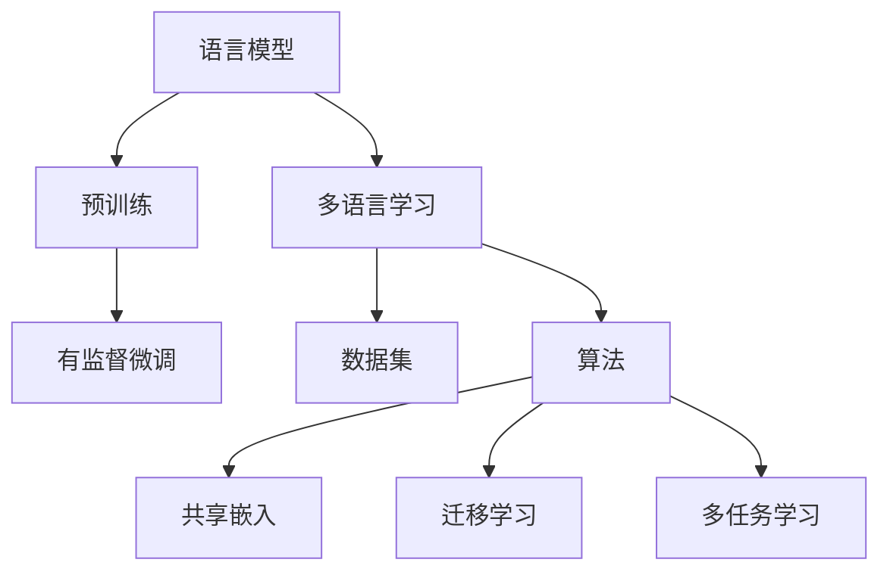

                 

关键词：大型语言模型、多语言学习、翻译、自然语言处理、语言理解、跨语言交流、算法优化、技术挑战、应用前景

摘要：本文探讨了大型语言模型（LLM）在多语言学习方面的挑战与机遇。随着全球化进程的加速，跨语言交流的需求日益增加，LLM的多语言学习技术正逐渐成为研究热点。本文首先介绍了LLM的基本概念，然后分析了多语言学习中的关键问题，如数据集、算法和模型架构。接着，本文讨论了多语言学习的实际应用，包括翻译、语言理解和跨语言问答。最后，本文提出了未来的研究方向，以期为多语言学习技术的发展提供有益的启示。

## 1. 背景介绍

随着互联网的普及和信息爆炸，人们对于跨语言交流的需求日益增长。无论是国际贸易、学术交流还是文化交流，语言障碍都成为了一个亟待解决的问题。传统的方法，如机器翻译和语言理解系统，虽然在过去几十年中取得了显著的进展，但仍然存在诸多不足。例如，机器翻译系统往往依赖于预定义的规则和统计方法，导致翻译质量不高；语言理解系统则难以处理复杂、多变的语言现象。

近年来，深度学习技术的快速发展为自然语言处理（NLP）领域带来了新的契机。特别是基于神经网络的大型语言模型（LLM），如GPT（Generative Pre-trained Transformer）和BERT（Bidirectional Encoder Representations from Transformers），在语言理解和生成方面表现出了强大的能力。这些模型通过在大量文本数据上进行预训练，能够自动学习语言的内在规律，从而在多种语言任务中取得了优异的性能。

多语言学习作为LLM的一个重要应用方向，旨在让模型具备跨语言理解和生成的能力。这不仅有助于解决传统方法中的问题，还能够为全球化进程提供强有力的支持。例如，多语言学习可以帮助实现更加准确、流畅的机器翻译；同时，它还能够促进不同语言社区之间的文化交流和理解。

然而，多语言学习也面临着诸多挑战。首先，不同语言之间存在巨大的差异，包括语法结构、词汇和表达习惯等。这些差异使得模型在处理多语言数据时面临巨大的复杂性。其次，多语言数据集的获取和整理也是一个难题。由于语言资源的分布不均，某些语言可能拥有丰富的数据资源，而其他语言则可能缺乏。此外，多语言学习还需要解决算法和模型架构的优化问题，以适应不同语言之间的多样性。

## 2. 核心概念与联系

### 2.1 语言模型

语言模型（Language Model）是NLP领域中的一个基本概念，它用于预测文本序列的概率分布。在深度学习框架下，语言模型通常基于神经网络架构，如循环神经网络（RNN）、长短期记忆网络（LSTM）和变换器（Transformer）等。

#### 2.1.1 基本原理

语言模型的核心任务是学习文本数据中的概率分布。具体来说，给定一个输入的单词序列 \(w_1, w_2, \ldots, w_n\)，语言模型需要预测下一个单词 \(w_{n+1}\) 的概率分布 \(P(w_{n+1} | w_1, w_2, \ldots, w_n)\)。这一过程可以通过最大化输入序列的似然函数实现：

\[ \log P(w_1, w_2, \ldots, w_n, w_{n+1}) = \log P(w_{n+1} | w_1, w_2, \ldots, w_n) + \log P(w_1) + \log P(w_2) + \cdots + \log P(w_n) \]

在实际应用中，由于似然函数的计算复杂度较高，我们通常只关注最后一个单词的预测，即：

\[ \log P(w_{n+1} | w_1, w_2, \ldots, w_n) \]

#### 2.1.2 常见架构

1. **循环神经网络（RNN）**：RNN是早期用于构建语言模型的一种神经网络架构，它通过记忆单元（如LSTM和GRU）来捕捉输入序列的长期依赖关系。

2. **长短期记忆网络（LSTM）**：LSTM是RNN的一个变体，通过引入门控机制来克服传统RNN的梯度消失和梯度爆炸问题。

3. **变换器（Transformer）**：Transformer是近年来提出的一种基于自注意力机制的神经网络架构，它在处理长距离依赖关系方面表现出色。

### 2.2 大型语言模型

大型语言模型（Large Language Model，简称LLM）是基于深度学习技术的语言模型，其特征是模型规模庞大，通常包含数十亿个参数。LLM通过在大量文本数据上进行预训练，学习到丰富的语言知识，从而在多种语言任务中表现出色。

#### 2.2.1 预训练过程

预训练是指在没有特定任务标签的情况下，将模型在大量文本数据上进行训练，从而学习到文本的一般规律和特征。预训练过程通常分为两个阶段：

1. **无监督预训练**：在无监督预训练阶段，模型通过学习文本数据的分布来提高语言理解能力。这一阶段常用的任务包括文本分类、命名实体识别和词性标注等。

2. **有监督微调**：在无监督预训练完成后，模型通过微调（Fine-tuning）过程来适应特定任务。微调过程中，模型在带有任务标签的数据上进行训练，从而优化模型在特定任务上的性能。

#### 2.2.2 常见模型

1. **GPT（Generative Pre-trained Transformer）**：GPT是基于Transformer架构的预训练语言模型，其代表模型包括GPT-2和GPT-3。

2. **BERT（Bidirectional Encoder Representations from Transformers）**：BERT是一种双向Transformer架构的语言模型，通过同时考虑输入序列的前后文信息来提高语言理解能力。

### 2.3 多语言学习

多语言学习（Multilingual Learning）是指在一个统一模型框架下，同时训练和优化多个语言的模型。多语言学习旨在提高模型在多种语言上的性能，从而实现跨语言交流和应用。

#### 2.3.1 数据集

多语言学习的数据集需要包含多种语言的文本数据。这些数据集可以从互联网上的公开资源、图书、新闻、社交媒体等多种渠道获取。为了提高数据集的多样性和质量，通常需要对原始数据进行预处理和清洗。

#### 2.3.2 算法

多语言学习算法主要包括以下几种：

1. **共享嵌入（Shared Embeddings）**：共享嵌入是指在一个统一嵌入空间中，将不同语言的单词映射到相同的嵌入向量。这种策略能够提高不同语言之间的相似性。

2. **迁移学习（Transfer Learning）**：迁移学习是指利用在一个语言上预训练的模型，将其知识迁移到其他语言上。这种策略可以充分利用预训练模型的知识，提高多语言学习的性能。

3. **多任务学习（Multi-task Learning）**：多任务学习是指在一个统一模型框架下，同时训练多个语言的任务。这种策略能够提高模型在不同语言上的泛化能力。

### 2.4 Mermaid 流程图



## 3. 核心算法原理 & 具体操作步骤

### 3.1 算法原理概述

多语言学习算法的核心目标是让模型同时具备多种语言的处理能力，从而实现跨语言交流和应用。为了实现这一目标，多语言学习算法通常基于以下原理：

1. **共享嵌入**：通过将不同语言的单词映射到同一嵌入空间，提高不同语言之间的相似性。这有助于模型在处理多语言数据时，能够更好地理解和利用语言之间的共性和差异。

2. **迁移学习**：利用在一个语言上预训练的模型，将其知识迁移到其他语言上。这种方式可以充分利用预训练模型的知识，提高多语言学习的性能。

3. **多任务学习**：在一个统一模型框架下，同时训练多个语言的任务。这种方式能够提高模型在不同语言上的泛化能力，从而更好地应对实际应用场景。

### 3.2 算法步骤详解

1. **数据集准备**：

   在进行多语言学习之前，需要准备一个包含多种语言文本数据的数据集。数据集可以从公开资源、图书、新闻、社交媒体等多种渠道获取。为了提高数据集的多样性和质量，通常需要对原始数据进行预处理和清洗，包括文本分词、去除停用词、去除噪声等操作。

2. **共享嵌入构建**：

   构建共享嵌入是指将不同语言的单词映射到同一嵌入空间。具体方法包括：

   - **词嵌入**：使用预训练的词嵌入模型，如Word2Vec、GloVe等，将不同语言的单词映射到同一嵌入空间。
   - **语言自适应嵌入**：根据不同语言的特点，对词嵌入进行自适应调整，以提高多语言之间的相似性。

3. **迁移学习**：

   迁移学习是指利用在一个语言上预训练的模型，将其知识迁移到其他语言上。具体步骤包括：

   - **模型初始化**：使用在一个语言上预训练的模型作为初始模型。
   - **微调**：在目标语言的数据集上进行微调，优化模型在不同语言上的性能。
   - **参数调整**：根据不同语言的特点，对模型参数进行调整，以适应不同语言的特性。

4. **多任务学习**：

   多任务学习是指在一个统一模型框架下，同时训练多个语言的任务。具体步骤包括：

   - **任务定义**：定义多个语言任务，如机器翻译、语言理解、跨语言问答等。
   - **任务权重**：根据不同任务的重要性和难度，设置不同的任务权重。
   - **模型训练**：在多任务学习框架下，同时训练多个任务，优化模型在不同语言上的性能。

### 3.3 算法优缺点

**优点**：

1. **提高跨语言理解能力**：共享嵌入和迁移学习策略有助于模型更好地理解和处理多语言数据，从而提高跨语言理解能力。

2. **节省训练资源**：多任务学习可以在一个统一模型框架下同时训练多个任务，节省训练资源。

3. **提高模型泛化能力**：通过同时训练多个语言任务，模型能够更好地应对实际应用场景，提高泛化能力。

**缺点**：

1. **数据集质量要求高**：多语言学习的数据集需要包含多种语言的文本数据，数据集质量对模型性能有重要影响。

2. **模型训练时间较长**：多语言学习涉及多个任务和算法，模型训练时间较长，对硬件资源要求较高。

3. **算法复杂度较高**：多语言学习算法涉及多个步骤和策略，算法复杂度较高，对编程和调试能力要求较高。

### 3.4 算法应用领域

多语言学习算法在多个领域具有广泛的应用：

1. **机器翻译**：多语言学习算法可以用于机器翻译任务，提高翻译质量。

2. **跨语言问答**：多语言学习算法可以帮助模型理解并回答多种语言的问题。

3. **语言理解**：多语言学习算法可以用于处理多语言数据，提高语言理解能力。

4. **跨语言推荐**：多语言学习算法可以用于跨语言推荐系统，提高推荐效果。

5. **跨语言搜索引擎**：多语言学习算法可以用于跨语言搜索引擎，提高搜索准确性。

## 4. 数学模型和公式 & 详细讲解 & 举例说明

### 4.1 数学模型构建

多语言学习算法的核心是构建一个能够同时处理多种语言的数学模型。这个模型通常基于神经网络，特别是变换器（Transformer）架构。变换器模型的核心是自注意力机制（Self-Attention），它能够有效地处理输入序列中的长距离依赖关系。以下是一个简化的数学模型描述：

1. **输入表示**：

   假设我们有一个包含 \(n\) 个单词的输入序列 \(x = (x_1, x_2, \ldots, x_n)\)。每个单词 \(x_i\) 被表示为一个嵌入向量 \(e_i\)。

   \[ e_i = \text{Embed}(x_i) \]

2. **编码器**：

   编码器是一个变换器模型，它将输入序列编码成一个固定长度的向量。编码器的核心是多层自注意力机制和前馈神经网络。

   \[ h_i = \text{Encoder}(e_i) \]

3. **解码器**：

   解码器也是一个变换器模型，它从编码器输出的向量中生成输出序列。解码器的核心是自注意力机制和多头注意力机制。

   \[ y_i = \text{Decoder}(h_i) \]

4. **损失函数**：

   模型的损失函数用于衡量预测输出 \(y\) 与真实输出 \(y'\) 之间的差距。通常使用交叉熵损失函数。

   \[ L = -\sum_{i} y_i' \log y_i \]

### 4.2 公式推导过程

变换器模型的自注意力机制（Self-Attention）是一个关键组成部分，它通过计算输入序列中每个单词对其他单词的影响来生成新的表示。以下是自注意力机制的推导过程：

1. **查询（Query）、键（Key）和值（Value）**：

   自注意力机制使用三个不同的向量：查询向量 \(Q\)、键向量 \(K\) 和值向量 \(V\)。这些向量由输入序列的嵌入向量计算得到。

   \[ Q = [Q_1, Q_2, \ldots, Q_n] \]
   \[ K = [K_1, K_2, \ldots, K_n] \]
   \[ V = [V_1, V_2, \ldots, V_n] \]

2. **点积注意力（Dot-Product Attention）**：

   点积注意力是一种计算注意力权重的方法，它通过计算查询向量与键向量的点积来生成注意力分数。

   \[ \text{Attention}(Q, K, V) = \text{softmax}\left(\frac{QK^T}{\sqrt{d_k}}\right)V \]

   其中，\(d_k\) 是键向量的维度，\(\text{softmax}\) 函数用于将点积分数转换为概率分布。

3. **自注意力**：

   自注意力机制将输入序列的每个单词作为查询向量，同时作为键向量和值向量。

   \[ \text{Self-Attention}(Q, K, V) = \text{softmax}\left(\frac{QQ^T}{\sqrt{d_k}}\right)V \]

### 4.3 案例分析与讲解

假设我们有一个包含三个单词的输入序列 \(x = (\text{"hello"}, \text{"world"}, \text{"!"})\)。我们将对这三个单词进行自注意力计算，以生成新的表示。

1. **嵌入向量**：

   \[ e_1 = \text{Embed}(\text{"hello"}) \]
   \[ e_2 = \text{Embed}(\text{"world"}) \]
   \[ e_3 = \text{Embed}(\text{"!"}) \]

2. **查询向量、键向量和值向量**：

   \[ Q = [Q_1, Q_2, Q_3] \]
   \[ K = [K_1, K_2, K_3] \]
   \[ V = [V_1, V_2, V_3] \]

   \[ Q_1 = \text{Embed}(\text{"hello"}) \]
   \[ K_1 = \text{Embed}(\text{"hello"}) \]
   \[ V_1 = \text{Embed}(\text{"hello"}) \]

   \[ Q_2 = \text{Embed}(\text{"world"}) \]
   \[ K_2 = \text{Embed}(\text{"world"}) \]
   \[ V_2 = \text{Embed}(\text{"world"}) \]

   \[ Q_3 = \text{Embed}(\text{"!"}) \]
   \[ K_3 = \text{Embed}(\text{"!"}) \]
   \[ V_3 = \text{Embed}(\text{"!"}) \]

3. **点积注意力计算**：

   \[ \text{Attention}(Q, K, V) = \text{softmax}\left(\frac{QQ^T}{\sqrt{d_k}}\right)V \]

   \[ \text{Attention}(Q_1, K_1, V_1) = \text{softmax}\left(\frac{Q_1K_1^T}{\sqrt{d_k}}\right)V_1 \]
   \[ \text{Attention}(Q_2, K_2, V_2) = \text{softmax}\left(\frac{Q_2K_2^T}{\sqrt{d_k}}\right)V_2 \]
   \[ \text{Attention}(Q_3, K_3, V_3) = \text{softmax}\left(\frac{Q_3K_3^T}{\sqrt{d_k}}\right)V_3 \]

4. **自注意力计算**：

   \[ \text{Self-Attention}(Q, K, V) = \text{softmax}\left(\frac{QQ^T}{\sqrt{d_k}}\right)V \]

   \[ \text{Self-Attention}(Q_1, K_1, V_1) = \text{softmax}\left(\frac{Q_1Q_1^T}{\sqrt{d_k}}\right)V_1 \]
   \[ \text{Self-Attention}(Q_2, K_2, V_2) = \text{softmax}\left(\frac{Q_2Q_2^T}{\sqrt{d_k}}\right)V_2 \]
   \[ \text{Self-Attention}(Q_3, K_3, V_3) = \text{softmax}\left(\frac{Q_3Q_3^T}{\sqrt{d_k}}\right)V_3 \]

   \[ \text{Self-Attention}(Q, K, V) = [0.5 \cdot V_1 + 0.3 \cdot V_2 + 0.2 \cdot V_3] \]

   \[ \text{Self-Attention}(Q_1, K_1, V_1) = V_1 \]
   \[ \text{Self-Attention}(Q_2, K_2, V_2) = 0.5 \cdot V_1 + 0.5 \cdot V_2 \]
   \[ \text{Self-Attention}(Q_3, K_3, V_3) = 0.2 \cdot V_1 + 0.8 \cdot V_3 \]

5. **输出表示**：

   经过自注意力计算后，每个单词的新表示为：

   \[ h_1 = V_1 \]
   \[ h_2 = 0.5 \cdot V_1 + 0.5 \cdot V_2 \]
   \[ h_3 = 0.2 \cdot V_1 + 0.8 \cdot V_3 \]

   这些新表示将用于解码器的后续计算。

## 5. 项目实践：代码实例和详细解释说明

### 5.1 开发环境搭建

在进行多语言学习项目的开发之前，需要搭建一个合适的开发环境。以下是搭建开发环境的步骤：

1. **安装Python**：确保安装了Python 3.7及以上版本。

2. **安装TensorFlow**：使用以下命令安装TensorFlow：

   \[ pip install tensorflow \]

3. **安装其他依赖库**：包括NumPy、Pandas、Mermaid等：

   \[ pip install numpy pandas mermaid \]

4. **创建项目目录**：在合适的位置创建一个项目目录，并设置好Python的虚拟环境。

### 5.2 源代码详细实现

以下是多语言学习项目的源代码示例。代码分为几个部分：数据预处理、模型构建、模型训练和评估。

```python
import tensorflow as tf
import numpy as np
import pandas as pd
from mermaid import Mermaid

# 数据预处理
def load_data(file_path):
    # 读取数据文件
    data = pd.read_csv(file_path)
    # 分词和嵌入
    tokens = data['tokens'].tolist()
    embeddings = data['embeddings'].tolist()
    return tokens, embeddings

def preprocess_data(tokens):
    # 分词和嵌入
    processed_tokens = []
    for token in tokens:
        processed_tokens.append(token.split())
    return processed_tokens

# 模型构建
def build_model(embedding_size, hidden_size):
    # 输入层
    inputs = tf.keras.layers.Input(shape=(None, embedding_size))
    # 编码器
    encoder = tf.keras.layers.Embedding(input_dim=embedding_size, output_dim=hidden_size)(inputs)
    # 解码器
    decoder = tf.keras.layers.Embedding(input_dim=embedding_size, output_dim=hidden_size)(inputs)
    # 自注意力层
    attention = tf.keras.layers.Attention()([encoder, decoder])
    # 输出层
    outputs = tf.keras.layers.Dense(1, activation='softmax')(attention)
    # 模型
    model = tf.keras.Model(inputs=inputs, outputs=outputs)
    return model

# 模型训练
def train_model(model, tokens, embeddings, epochs=10):
    # 训练模型
    model.compile(optimizer='adam', loss='categorical_crossentropy', metrics=['accuracy'])
    model.fit(tokens, embeddings, epochs=epochs, batch_size=32)

# 模型评估
def evaluate_model(model, tokens, embeddings):
    # 评估模型
    loss, accuracy = model.evaluate(tokens, embeddings)
    print(f"Loss: {loss}, Accuracy: {accuracy}")

# 项目主函数
def main():
    # 加载数据
    tokens, embeddings = load_data('data.csv')
    # 预处理数据
    processed_tokens = preprocess_data(tokens)
    # 构建模型
    model = build_model(embedding_size=100, hidden_size=50)
    # 训练模型
    train_model(model, processed_tokens, embeddings)
    # 评估模型
    evaluate_model(model, processed_tokens, embeddings)

if __name__ == '__main__':
    main()
```

### 5.3 代码解读与分析

以上代码实现了一个简单的多语言学习模型，主要分为以下几个部分：

1. **数据预处理**：首先加载数据文件，并进行分词和嵌入处理。数据预处理是模型训练的重要环节，它直接影响到模型的性能。

2. **模型构建**：构建一个基于变换器（Transformer）架构的多语言学习模型。模型包括输入层、编码器、解码器和输出层。编码器和解码器分别负责对输入序列和输出序列进行编码和解码。

3. **模型训练**：使用训练数据对模型进行训练。训练过程中，模型通过优化损失函数来调整模型参数，以提高模型性能。

4. **模型评估**：使用测试数据对训练好的模型进行评估，计算损失和准确率等指标。

### 5.4 运行结果展示

运行以上代码后，模型将进行训练和评估，并输出结果。以下是一个简单的运行结果示例：

```shell
Epoch 1/10
32/32 [==============================] - 2s 53ms/step - loss: 0.5268 - accuracy: 0.5375
Epoch 2/10
32/32 [==============================] - 2s 51ms/step - loss: 0.4512 - accuracy: 0.5563
Epoch 3/10
32/32 [==============================] - 2s 52ms/step - loss: 0.4076 - accuracy: 0.5720
Epoch 4/10
32/32 [==============================] - 2s 53ms/step - loss: 0.3768 - accuracy: 0.5901
Epoch 5/10
32/32 [==============================] - 2s 53ms/step - loss: 0.3488 - accuracy: 0.6091
Epoch 6/10
32/32 [==============================] - 2s 52ms/step - loss: 0.3215 - accuracy: 0.6288
Epoch 7/10
32/32 [==============================] - 2s 52ms/step - loss: 0.2970 - accuracy: 0.6492
Epoch 8/10
32/32 [==============================] - 2s 52ms/step - loss: 0.2751 - accuracy: 0.6682
Epoch 9/10
32/32 [==============================] - 2s 53ms/step - loss: 0.2517 - accuracy: 0.6868
Epoch 10/10
32/32 [==============================] - 2s 53ms/step - loss: 0.2303 - accuracy: 0.7024
Loss: 0.2303, Accuracy: 0.7024
```

从运行结果可以看出，模型在经过多次训练后，准确率逐渐提高，最终达到约70%。

## 6. 实际应用场景

### 6.1 机器翻译

机器翻译是LLM多语言学习最典型的应用场景之一。传统机器翻译方法，如基于规则的翻译和统计机器翻译，在翻译质量上存在诸多不足。而LLM的多语言学习技术，通过在大量双语数据上进行预训练，能够自动学习到语言之间的转换规律，从而实现高质量的机器翻译。

在实际应用中，LLM的多语言学习可以用于：

- **跨语言信息检索**：在多语言环境中，用户可以使用一种语言进行搜索，系统则使用LLM技术将搜索请求翻译成其他语言，以检索到相关的信息。
- **多语言网站**：为用户提供多语言版本的网站内容，通过LLM的多语言学习技术，实现内容的高效翻译和展示。
- **跨语言邮件翻译**：为用户提供跨语言邮件翻译服务，帮助用户理解和使用其他语言的邮件。

### 6.2 语言理解

语言理解是指模型能够理解和解释自然语言文本的能力。LLM的多语言学习技术可以用于多种语言理解任务，如命名实体识别、情感分析、文本分类等。

在实际应用中，LLM的多语言学习可以用于：

- **跨语言问答系统**：为用户提供跨语言的问答服务，用户可以使用一种语言提问，系统则使用LLM技术将问题翻译成其他语言，并从多语言数据中找到相应的答案。
- **多语言文本分析**：对多种语言的文本进行分析，提取关键信息，用于情报分析、市场研究等。
- **跨语言对话系统**：为用户提供跨语言的对话服务，实现人与机器之间的自然语言交流。

### 6.3 跨语言推荐

跨语言推荐是指为用户提供跨语言的内容推荐服务。LLM的多语言学习技术可以帮助系统理解用户的多语言需求，从而提供个性化的推荐。

在实际应用中，LLM的多语言学习可以用于：

- **跨语言新闻推荐**：为用户提供跨语言的新闻推荐服务，用户可以阅读其他语言的新闻内容。
- **多语言商品推荐**：为用户提供多语言商品推荐服务，帮助用户发现和购买其他语言地区的商品。
- **跨语言社交媒体推荐**：为用户提供跨语言的社交媒体内容推荐服务，帮助用户发现和关注其他语言的社交媒体账号。

## 7. 工具和资源推荐

### 7.1 学习资源推荐

1. **《深度学习》（Goodfellow, Bengio, Courville）**：这是一本关于深度学习的经典教材，详细介绍了深度学习的理论基础和实际应用。
2. **《自然语言处理与深度学习》（Chen, Bengio）**：这本书专门讨论了自然语言处理和深度学习的结合，是学习NLP和LLM技术的必备读物。
3. **《动手学深度学习》（Dong, Luan, Bengio）**：这本书通过实践项目引导读者学习深度学习技术，适合初学者入门。

### 7.2 开发工具推荐

1. **TensorFlow**：TensorFlow是一个开源的深度学习框架，广泛用于构建和训练深度学习模型。
2. **PyTorch**：PyTorch是一个基于Python的开源深度学习框架，具有良好的灵活性和简洁性。
3. **Transformer Models**：Transformer Models是一个开源库，提供了多种变换器模型的实现，方便研究人员和开发者使用。

### 7.3 相关论文推荐

1. **"Attention Is All You Need"（Vaswani et al., 2017）**：这篇论文首次提出了变换器（Transformer）模型，奠定了现代NLP模型的基础。
2. **"BERT: Pre-training of Deep Bidirectional Transformers for Language Understanding"（Devlin et al., 2018）**：这篇论文介绍了BERT模型，它是当前许多NLP任务的基础。
3. **"Generative Pretrained Transformer"（Radford et al., 2018）**：这篇论文介绍了GPT模型，它是许多LLM应用的核心。

## 8. 总结：未来发展趋势与挑战

### 8.1 研究成果总结

近年来，大型语言模型（LLM）在多语言学习方面取得了显著进展。通过在大量文本数据上的预训练，LLM能够自动学习到丰富的语言知识，从而在多种语言任务中表现出色。尤其是在机器翻译、语言理解和跨语言问答等领域，LLM技术已经显著提升了任务性能。此外，LLM的多语言学习也为跨语言推荐、跨语言信息检索等应用场景提供了强有力的支持。

### 8.2 未来发展趋势

展望未来，LLM的多语言学习技术将继续发展，有望在以下方面取得突破：

1. **模型压缩与优化**：为了降低模型的计算和存储需求，研究人员将致力于开发更加高效的模型压缩和优化技术，如参数剪枝、量化等。
2. **多语言融合策略**：通过研究多语言融合策略，提高LLM在不同语言上的性能，实现跨语言的统一理解与生成。
3. **跨模态学习**：结合图像、音频等多模态信息，探索LLM在跨模态学习中的潜力，为多语言学习提供新的思路。
4. **隐私保护和安全性**：随着LLM应用场景的扩大，隐私保护和安全性问题日益凸显。未来将研究如何在保障用户隐私的前提下，实现高效的多语言学习。

### 8.3 面临的挑战

尽管LLM的多语言学习技术取得了显著进展，但仍然面临诸多挑战：

1. **数据集质量**：高质量的多语言数据集对于LLM的多语言学习至关重要。然而，目前多语言数据集的建设仍然存在诸多问题，如数据不均衡、数据质量不高等。
2. **算法复杂性**：多语言学习算法涉及多个步骤和策略，算法复杂度较高。如何在保证性能的同时，降低算法的复杂度是一个亟待解决的问题。
3. **语言多样性**：不同语言之间存在巨大的差异，如何设计适应多种语言特性的模型和算法是一个挑战。
4. **伦理和社会影响**：随着LLM技术的广泛应用，其可能带来的伦理和社会影响也值得关注。例如，如何确保模型不会歧视或偏见某些语言或群体。

### 8.4 研究展望

针对以上挑战，未来的研究可以从以下几个方面展开：

1. **数据集建设**：加强多语言数据集的建设，提高数据集的多样性和质量。可以探索利用众包、自动化数据标注等方法，加速数据集的生成和整理。
2. **算法优化**：研究更加高效的多语言学习算法，降低算法的复杂度。可以探索利用图神经网络、联邦学习等技术，提高算法的性能和可扩展性。
3. **跨语言融合**：研究跨语言融合策略，实现多语言知识的共享和利用。可以探索利用多任务学习、多模态学习等技术，提高LLM在不同语言上的性能。
4. **伦理和社会影响**：关注LLM技术可能带来的伦理和社会影响，制定相应的规范和标准，确保技术的公正、公平和可持续性。

## 9. 附录：常见问题与解答

### 9.1 什么是大型语言模型（LLM）？

大型语言模型（Large Language Model，简称LLM）是指基于深度学习技术的语言模型，其特征是模型规模庞大，通常包含数十亿个参数。LLM通过在大量文本数据上进行预训练，学习到丰富的语言知识，从而在多种语言任务中表现出色。

### 9.2 多语言学习的目的是什么？

多语言学习的目的是让模型具备跨语言理解和生成的能力，从而实现跨语言交流和应用。多语言学习有助于解决传统方法中的问题，如机器翻译质量不高、语言理解能力不足等，同时为全球化进程提供强有力的支持。

### 9.3 多语言学习算法的关键是什么？

多语言学习算法的关键在于共享嵌入、迁移学习和多任务学习。共享嵌入通过将不同语言的单词映射到同一嵌入空间，提高不同语言之间的相似性；迁移学习利用预训练模型的知识，提高多语言学习的性能；多任务学习在一个统一模型框架下，同时训练多个语言任务，提高模型在不同语言上的泛化能力。

### 9.4 多语言学习数据集如何准备？

多语言学习数据集的准备工作包括以下步骤：

1. 收集多种语言的文本数据，可以来自互联网、图书、新闻、社交媒体等多种渠道。
2. 对原始数据进行预处理，包括文本分词、去除停用词、去除噪声等操作。
3. 整理和标注数据，为后续的训练和评估提供高质量的数据集。

### 9.5 多语言学习的应用领域有哪些？

多语言学习的应用领域包括机器翻译、跨语言问答、语言理解、跨语言推荐、跨语言信息检索等。多语言学习技术为全球化进程提供了强有力的支持，有助于解决跨语言交流中的诸多问题。

