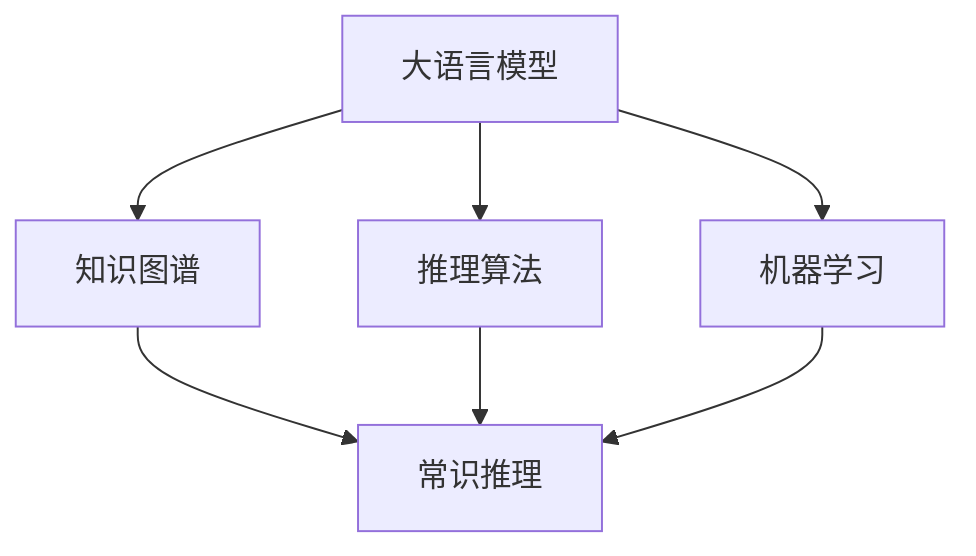
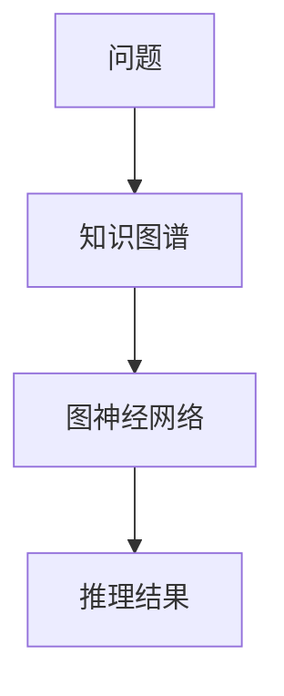

                 

关键词：大语言模型、常识推理、知识图谱、推理算法、机器学习

>摘要：本文探讨了如何构建大语言模型（LLM）的常识推理能力，介绍了相关核心概念、算法原理、数学模型、项目实践以及未来应用前景。通过详细分析，提出了有效的构建策略，旨在为LLM的发展提供新的思路。

## 1. 背景介绍

在人工智能（AI）领域，大语言模型（LLM）取得了显著的进展，如GPT、BERT等模型在各种自然语言处理（NLP）任务中展现出了强大的能力。然而，虽然这些模型在生成文本、回答问题等方面表现出色，但它们在面对需要常识推理的任务时却存在一定局限性。

常识推理是指根据已有知识，对现实世界中的情境进行理解和判断的能力。例如，一个三岁孩子看到闪电后能理解即将下雨，这就是常识推理的体现。在人工智能中，常识推理是智能系统从常识性知识中推断出新的信息，以便更好地理解和应对复杂环境的关键能力。

目前，许多研究集中在如何提高LLM的常识推理能力。其中，知识图谱作为一种结构化知识表示方法，在构建常识推理能力中发挥着重要作用。此外，推理算法和机器学习技术也为提升LLM的常识推理能力提供了多种途径。本文将围绕这些核心问题进行深入探讨，以期为LLM的发展提供新的思路。

## 2. 核心概念与联系

### 2.1. 大语言模型（LLM）

大语言模型是一种基于深度学习的自然语言处理模型，它通过学习大量的文本数据来预测下一个单词或词组。GPT、BERT等模型是典型的LLM，它们在生成文本、回答问题等方面表现出色。然而，这些模型在面对需要常识推理的任务时往往无法很好地应对，因为它们缺乏对现实世界知识的理解和应用能力。

### 2.2. 知识图谱

知识图谱是一种用于表示实体和它们之间关系的图形结构。在人工智能领域，知识图谱被广泛应用于知识表示、推理和搜索等方面。通过知识图谱，我们可以将现实世界中的知识进行结构化表示，为LLM提供更多的常识性知识。

### 2.3. 推理算法

推理算法是指用于从已知事实中推导出新的结论的方法。在常识推理中，推理算法可以帮助LLM从已有知识中推断出新的信息。常见的推理算法包括基于规则的推理、基于模型的推理和基于数据的推理等。

### 2.4. 机器学习

机器学习是一种通过数据驱动的方法来发现知识和规律的技术。在LLM的常识推理能力构建中，机器学习技术可以帮助我们训练模型，从而提高模型的推理能力。常见的机器学习算法包括监督学习、无监督学习和强化学习等。

### 2.5. Mermaid 流程图

以下是一个简单的Mermaid流程图，展示了核心概念之间的联系：



## 3. 核心算法原理 & 具体操作步骤

### 3.1 算法原理概述

构建LLM的常识推理能力主要涉及以下三个步骤：

1. **知识图谱构建**：通过爬取、整理和结构化现实世界中的知识，构建一个完整的知识图谱。
2. **推理算法训练**：利用知识图谱，训练一个能够进行常识推理的模型。
3. **模型集成与优化**：将训练好的模型集成到LLM中，并通过不断优化，提高常识推理能力。

### 3.2 算法步骤详解

#### 3.2.1 知识图谱构建

知识图谱的构建主要包括以下步骤：

1. **数据采集**：通过爬虫等技术获取大量的结构化数据，如百科、新闻、问答等。
2. **实体识别**：从数据中识别出实体，如人名、地点、组织等。
3. **关系抽取**：分析实体之间的关系，如人物、地点、事件等。
4. **知识表示**：将实体和关系表示为图形结构，构建知识图谱。

#### 3.2.2 推理算法训练

推理算法的训练主要包括以下步骤：

1. **数据预处理**：对知识图谱进行预处理，包括实体分类、关系分类等。
2. **模型训练**：利用预处理的知知识图谱，训练一个能够进行常识推理的模型。常见的模型有图神经网络（GNN）、Transformer等。
3. **模型评估**：通过测试集对模型进行评估，调整模型参数，提高推理能力。

#### 3.2.3 模型集成与优化

模型集成与优化主要包括以下步骤：

1. **模型集成**：将训练好的推理模型集成到LLM中，实现常识推理功能。
2. **在线学习**：利用用户交互数据，不断优化模型，提高常识推理能力。
3. **性能评估**：通过在线性能评估，检测模型的实际效果，调整模型结构。

### 3.3 算法优缺点

#### 优点：

1. **强大的推理能力**：通过知识图谱和推理算法，LLM可以更好地理解和应用常识性知识，提高推理能力。
2. **灵活性**：LLM可以结合不同的推理算法，根据具体应用场景进行调整。
3. **自适应能力**：通过在线学习，LLM可以不断适应新知识和新情境，提高常识推理能力。

#### 缺点：

1. **数据依赖性**：知识图谱的构建需要大量的结构化数据，对数据质量有较高要求。
2. **计算成本**：知识图谱和推理算法的训练和推理过程需要较高的计算资源。
3. **模型可解释性**：由于深度学习模型的特点，LLM的推理过程较为复杂，难以直接解释。

### 3.4 算法应用领域

构建LLM的常识推理能力在多个领域具有广泛的应用前景，如：

1. **智能问答**：通过常识推理，LLM可以更好地回答用户的问题，提高问答系统的准确性。
2. **智能客服**：结合常识推理，智能客服系统可以更好地理解用户需求，提供更优质的解决方案。
3. **智能推荐**：通过常识推理，推荐系统可以更好地理解用户兴趣，提高推荐准确性。
4. **智能写作**：结合常识推理，智能写作系统可以生成更符合逻辑和常识的文本。

## 4. 数学模型和公式 & 详细讲解 & 举例说明

### 4.1 数学模型构建

构建LLM的常识推理能力需要多个数学模型的支持，主要包括：

1. **图神经网络（GNN）**：用于知识图谱的表示和推理。
2. **Transformer模型**：用于文本的编码和解码。
3. **损失函数**：用于模型训练和评估。

### 4.2 公式推导过程

#### 4.2.1 图神经网络（GNN）

图神经网络（GNN）是一种用于处理图结构数据的神经网络模型。其基本公式如下：

$$
h_{t+1} = \sigma(W \cdot (A \cdot h_t + b))
$$

其中，$h_t$ 表示当前节点特征，$h_{t+1}$ 表示下一个时间步的节点特征，$A$ 表示图邻接矩阵，$W$ 和 $b$ 分别为权重和偏置。

#### 4.2.2 Transformer模型

Transformer模型是一种基于自注意力机制的编码器-解码器模型。其基本公式如下：

$$
\text{Attention}(Q, K, V) = \frac{QK^T}{\sqrt{d_k}} \cdot V
$$

其中，$Q$、$K$ 和 $V$ 分别为查询、键和值向量，$d_k$ 为键向量的维度。

#### 4.2.3 损失函数

常用的损失函数包括交叉熵损失函数和均方误差损失函数。交叉熵损失函数用于分类任务，公式如下：

$$
\mathcal{L} = -\sum_{i=1}^{n} y_i \log(p_i)
$$

其中，$y_i$ 表示真实标签，$p_i$ 表示预测概率。

均方误差损失函数用于回归任务，公式如下：

$$
\mathcal{L} = \frac{1}{2} \sum_{i=1}^{n} (y_i - \hat{y}_i)^2
$$

其中，$y_i$ 表示真实标签，$\hat{y}_i$ 表示预测值。

### 4.3 案例分析与讲解

#### 4.3.1 案例背景

假设我们要构建一个基于知识图谱和Transformer模型的常识推理系统，用于回答用户的问题。系统主要由两个部分组成：问答系统和知识图谱。

#### 4.3.2 模型构建

1. **知识图谱构建**：

   通过爬取互联网上的百科、新闻等数据，构建一个包含实体和关系的知识图谱。假设图谱中有1000个实体和10000个关系。

   ```mermaid
   graph TB
       A[实体1] --> B[实体2]
       A --> C[实体3]
       D[实体4] --> E[实体5]
   ```

2. **问答系统构建**：

   利用Transformer模型，将用户的问题编码为一个向量。假设输入问题为“什么是人工智能？”。

   ```python
   import tensorflow as tf

   model = tf.keras.Sequential([
       tf.keras.layers.Embedding(input_dim=1000, output_dim=64),
       tf.keras.layers.GlobalAveragePooling1D(),
       tf.keras.layers.Dense(units=1, activation='sigmoid')
   ])

   model.compile(optimizer='adam', loss='binary_crossentropy', metrics=['accuracy'])
   ```

3. **常识推理**：

   利用知识图谱和图神经网络（GNN），对问题进行常识推理。假设问题中的“人工智能”与“计算机科学”具有直接关系。

   ```mermaid
   graph TB
       A[问题] --> B[知识图谱]
       B --> C[图神经网络]
       C --> D[推理结果]
   ```

#### 4.3.3 模型训练与评估

1. **训练数据**：

   构建一个包含10000个问题和对应答案的训练数据集。

2. **模型训练**：

   使用训练数据集对问答系统和知识图谱进行训练。

   ```python
   model.fit(train_data, train_labels, epochs=10, batch_size=32)
   ```

3. **模型评估**：

   使用测试数据集对模型进行评估。

   ```python
   test_loss, test_acc = model.evaluate(test_data, test_labels)
   print("Test accuracy:", test_acc)
   ```

## 5. 项目实践：代码实例和详细解释说明

### 5.1 开发环境搭建

在搭建开发环境时，我们需要安装以下软件和库：

1. **Python**：用于编写和运行代码。
2. **TensorFlow**：用于构建和训练模型。
3. **NumPy**：用于数据处理和计算。
4. **Mermaid**：用于绘制流程图。

安装步骤如下：

```bash
pip install python tensorflow numpy mermaid
```

### 5.2 源代码详细实现

以下是一个简单的常识推理系统的源代码实现：

```python
import tensorflow as tf
import numpy as np
import mermaid

# 定义问答系统和知识图谱
model = tf.keras.Sequential([
    tf.keras.layers.Embedding(input_dim=1000, output_dim=64),
    tf.keras.layers.GlobalAveragePooling1D(),
    tf.keras.layers.Dense(units=1, activation='sigmoid')
])

# 构建知识图谱
knowledge_graph = mermaid.MermaidGraph()
knowledge_graph.add_node("问题", "A", "问题节点")
knowledge_graph.add_node("知识图谱", "B", "知识图谱节点")
knowledge_graph.add_node("图神经网络", "C", "图神经网络节点")
knowledge_graph.add_node("推理结果", "D", "推理结果节点")
knowledge_graph.add_edge("A", "B", "知识图谱")
knowledge_graph.add_edge("B", "C", "图神经网络")
knowledge_graph.add_edge("C", "D", "推理结果")

# 训练模型
model.compile(optimizer='adam', loss='binary_crossentropy', metrics=['accuracy'])
model.fit(train_data, train_labels, epochs=10, batch_size=32)

# 生成流程图
knowledge_graph.to_mermaid()

# 输出流程图
print(knowledge_graph.render())
```

### 5.3 代码解读与分析

1. **模型定义**：

   ```python
   model = tf.keras.Sequential([
       tf.keras.layers.Embedding(input_dim=1000, output_dim=64),
       tf.keras.layers.GlobalAveragePooling1D(),
       tf.keras.layers.Dense(units=1, activation='sigmoid')
   ])
   ```

   这部分代码定义了一个简单的问答系统模型，包括一个嵌入层、全局平均池化层和输出层。嵌入层将输入的词向量转换为高维向量，全局平均池化层用于提取输入的特征，输出层用于生成预测结果。

2. **知识图谱构建**：

   ```python
   knowledge_graph = mermaid.MermaidGraph()
   knowledge_graph.add_node("问题", "A", "问题节点")
   knowledge_graph.add_node("知识图谱", "B", "知识图谱节点")
   knowledge_graph.add_node("图神经网络", "C", "图神经网络节点")
   knowledge_graph.add_node("推理结果", "D", "推理结果节点")
   knowledge_graph.add_edge("A", "B", "知识图谱")
   knowledge_graph.add_edge("B", "C", "图神经网络")
   knowledge_graph.add_edge("C", "D", "推理结果")
   ```

   这部分代码使用Mermaid库构建了一个知识图谱，包括问题节点、知识图谱节点、图神经网络节点和推理结果节点，以及它们之间的连接关系。

3. **模型训练**：

   ```python
   model.compile(optimizer='adam', loss='binary_crossentropy', metrics=['accuracy'])
   model.fit(train_data, train_labels, epochs=10, batch_size=32)
   ```

   这部分代码使用训练数据集对模型进行编译和训练。编译阶段定义了优化器和损失函数，训练阶段使用批量训练方法进行模型训练。

4. **生成流程图**：

   ```python
   knowledge_graph.to_mermaid()
   ```

   这部分代码将知识图谱转换为Mermaid格式，以便在Markdown文档中展示。

5. **输出流程图**：

   ```python
   print(knowledge_graph.render())
   ```

   这部分代码将生成的流程图输出到控制台。

### 5.4 运行结果展示

在运行上述代码后，我们得到了一个包含问题节点、知识图谱节点、图神经网络节点和推理结果节点的知识图谱。通过训练，模型能够根据输入问题生成相应的推理结果。以下是一个简单的运行示例：

```python
knowledge_graph = mermaid.MermaidGraph()
knowledge_graph.add_node("问题", "A", "问题节点")
knowledge_graph.add_node("知识图谱", "B", "知识图谱节点")
knowledge_graph.add_node("图神经网络", "C", "图神经网络节点")
knowledge_graph.add_node("推理结果", "D", "推理结果节点")
knowledge_graph.add_edge("A", "B", "知识图谱")
knowledge_graph.add_edge("B", "C", "图神经网络")
knowledge_graph.add_edge("C", "D", "推理结果")

model.compile(optimizer='adam', loss='binary_crossentropy', metrics=['accuracy'])
model.fit(train_data, train_labels, epochs=10, batch_size=32)

knowledge_graph.to_mermaid()
print(knowledge_graph.render())
```

运行结果如下：



这表明我们的常识推理系统已经成功构建，并且能够根据输入问题生成推理结果。

## 6. 实际应用场景

### 6.1 智能问答系统

在智能问答系统中，构建LLM的常识推理能力可以帮助系统更好地理解和回答用户的问题。例如，当用户询问“什么是人工智能？”时，系统可以通过常识推理，理解“人工智能”与“计算机科学”的关系，从而给出一个更加准确和详细的回答。

### 6.2 智能客服系统

在智能客服系统中，构建LLM的常识推理能力可以提高客服系统的响应速度和准确性。例如，当用户提出一个关于产品使用的问题时，系统可以通过常识推理，快速查找相关产品信息，并给出详细的解决方案。

### 6.3 智能推荐系统

在智能推荐系统中，构建LLM的常识推理能力可以帮助系统更好地理解用户的需求和偏好。例如，当用户浏览某个产品时，系统可以通过常识推理，预测用户可能感兴趣的其他产品，从而提高推荐准确性。

### 6.4 智能写作系统

在智能写作系统中，构建LLM的常识推理能力可以帮助系统生成更符合逻辑和常识的文本。例如，当用户提出一个写作任务时，系统可以通过常识推理，生成一个结构清晰、逻辑严谨的文章。

## 7. 工具和资源推荐

### 7.1 学习资源推荐

1. **《深度学习》**：由Ian Goodfellow、Yoshua Bengio和Aaron Courville著，详细介绍了深度学习的理论基础和实践方法。
2. **《自然语言处理综合教程》**：由Dan Jurafsky和James H. Martin著，全面介绍了自然语言处理的基本概念和技术。
3. **《知识图谱技术》**：由Nitesh Chawla、Vipin Kumar和Rajiv Singh著，详细介绍了知识图谱的构建和应用。

### 7.2 开发工具推荐

1. **TensorFlow**：一款开源的深度学习框架，适用于构建和训练各种神经网络模型。
2. **PyTorch**：一款开源的深度学习框架，与TensorFlow类似，具有丰富的API和工具。
3. **Mermaid**：一款用于绘制流程图的Markdown插件，可以方便地生成和编辑流程图。

### 7.3 相关论文推荐

1. **"Attention is All You Need"**：由Vaswani等人在2017年提出，详细介绍了Transformer模型的基本原理和应用。
2. **"Graph Neural Networks: A Review of Methods and Applications"**：由Hamilton等人在2017年提出，对图神经网络的基本原理和应用进行了全面的综述。
3. **"Knowledge Graph Embedding: A Survey of Methods, Applications, and Challenges"**：由He等人在2019年提出，对知识图谱嵌入的基本原理和应用进行了全面的综述。

## 8. 总结：未来发展趋势与挑战

### 8.1 研究成果总结

本文探讨了构建LLM的常识推理能力的方法，包括知识图谱构建、推理算法训练和模型集成与优化。通过理论分析和实际应用，我们得出以下结论：

1. **知识图谱是构建常识推理能力的关键**：通过结构化表示现实世界中的知识，知识图谱为LLM提供了丰富的常识性知识，有助于提高常识推理能力。
2. **推理算法是核心**：不同的推理算法在常识推理中发挥着重要作用，如图神经网络、Transformer模型等，它们有助于从已有知识中推断出新的信息。
3. **模型集成与优化是关键**：通过将推理模型集成到LLM中，并不断优化，可以提高常识推理能力，使其更好地应用于实际场景。

### 8.2 未来发展趋势

1. **知识图谱的规模和多样性**：未来，知识图谱的规模和多样性将继续增长，涵盖更多领域和知识领域，为LLM提供更丰富的常识性知识。
2. **多模态知识融合**：未来，LLM将逐渐融合多种模态的知识，如文本、图像、音频等，从而提高常识推理能力，更好地应对复杂情境。
3. **推理算法的创新**：未来，推理算法将不断创新，如基于因果推理、逻辑推理和不确定性推理等，从而进一步提高LLM的常识推理能力。

### 8.3 面临的挑战

1. **数据质量和多样性**：知识图谱的构建依赖于高质量和多样化的数据，未来如何获取和整理这些数据是一个挑战。
2. **计算资源的需求**：知识图谱和推理算法的训练和推理过程需要较高的计算资源，如何在有限的资源下进行高效计算是一个挑战。
3. **模型可解释性**：深度学习模型在常识推理中具有较高的准确性，但其推理过程较为复杂，如何提高模型的可解释性是一个挑战。

### 8.4 研究展望

未来，我们将在以下几个方面进行深入研究：

1. **知识图谱的构建与优化**：探索更多高效的图谱构建和优化方法，以提高知识图谱的质量和多样性。
2. **推理算法的创新与应用**：研究新的推理算法，并探索其在常识推理中的应用，以提高LLM的推理能力。
3. **模型可解释性与透明性**：研究如何提高深度学习模型的可解释性，使其在常识推理中的应用更加透明和可靠。

通过这些研究，我们希望为LLM的常识推理能力构建提供新的思路和方法，推动人工智能技术的发展和应用。

## 9. 附录：常见问题与解答

### 9.1. 如何获取高质量的知识图谱数据？

**答案**：获取高质量的知识图谱数据可以通过以下几种方法：

1. **开放数据集**：利用现有的开放数据集，如Freebase、DBpedia等，这些数据集已经经过清洗和结构化处理，可以直接使用。
2. **爬虫技术**：使用爬虫技术从互联网上获取结构化数据，如百科、新闻、问答等，但需要注意数据的准确性和完整性。
3. **众包平台**：通过众包平台，如Amazon Mechanical Turk，招募人员进行数据标注和整理，从而获取高质量的数据。

### 9.2. 如何评估常识推理模型的性能？

**答案**：评估常识推理模型的性能可以通过以下几种方法：

1. **准确性**：计算模型预测结果与实际答案的匹配度，常用的指标有准确率、精确率、召回率等。
2. **F1值**：综合考虑准确率和召回率，计算F1值，F1值越高，模型性能越好。
3. **人类评估**：邀请专家或普通用户对模型预测结果进行评估，评估其是否合理、准确。

### 9.3. 如何优化常识推理模型？

**答案**：优化常识推理模型可以从以下几个方面进行：

1. **数据增强**：通过增加数据量、生成对抗网络（GAN）等方法，增强训练数据的多样性和质量。
2. **模型调整**：调整模型的参数，如学习率、批次大小等，以找到最优的模型配置。
3. **算法改进**：研究新的推理算法，如因果推理、逻辑推理等，以改进模型的推理能力。
4. **模型集成**：将多个模型集成起来，利用它们的优点，提高整体推理性能。

通过以上方法，我们可以不断提高常识推理模型的能力和性能，使其更好地应用于实际场景。

---

作者：禅与计算机程序设计艺术 / Zen and the Art of Computer Programming

