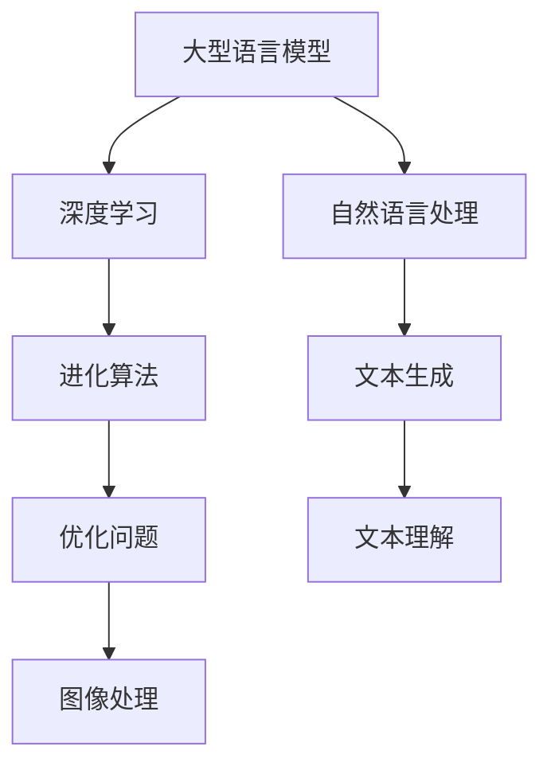

                 

关键词：大型语言模型，持续学习，进化算法，神经网络，深度学习，自然语言处理

> 摘要：本文深入探讨了大型语言模型（LLM）的持续学习机制，分析了其在进化算法和深度学习领域的应用，探讨了数学模型和公式，并通过实际项目实践展示了LLM的强大能力。文章还展望了LLM在未来应用场景中的前景，并提出了研究中的挑战和展望。

## 1. 背景介绍

随着人工智能技术的快速发展，语言模型在自然语言处理（NLP）领域取得了显著的进展。近年来，大型语言模型（LLM）如GPT、BERT等的出现，极大地提升了机器理解和生成自然语言的能力。这些模型通过对海量文本数据进行训练，能够自动捕捉语言规律，生成语义丰富的文本，并在各种NLP任务中表现出色。

然而，现有的LLM在应对动态变化的现实世界时，仍存在一定的局限性。首先，LLM的训练数据通常来自固定的语料库，这些数据可能无法涵盖所有现实场景，导致模型在处理未知任务时效果不佳。其次，LLM的参数量巨大，导致模型训练和推理的计算成本高昂，限制了其在实际应用中的普及。因此，如何实现LLM的持续学习，使其能够适应不断变化的环境，成为一个重要的研究方向。

本文旨在探讨LLM的持续学习机制，分析其在进化算法和深度学习领域的应用，并探讨数学模型和公式，以期为LLM的研究提供新的思路和方向。

## 2. 核心概念与联系

### 2.1. 大型语言模型（LLM）

大型语言模型（LLM）是一种基于深度学习技术的自然语言处理模型，通过对大量文本数据进行训练，能够自动捕捉语言规律，生成语义丰富的文本。LLM的核心架构通常包括多层神经网络，如Transformer、RNN等，其中每个神经元负责处理输入文本的某一部分，并通过逐层传递，最终生成输出文本。

### 2.2. 进化算法

进化算法是一种基于生物进化原理的优化算法，通过模拟自然选择和遗传机制，不断迭代优化解空间中的个体，以找到最优解。进化算法广泛应用于优化问题、组合优化、图像处理等领域。

### 2.3. 深度学习

深度学习是一种基于多层神经网络的机器学习方法，通过逐层抽象和提取特征，实现对复杂数据的建模和分析。深度学习在计算机视觉、语音识别、自然语言处理等领域取得了显著的成果。

### 2.4. Mermaid流程图

以下是一个简单的Mermaid流程图，展示了LLM、进化算法和深度学习之间的联系：



## 3. 核心算法原理 & 具体操作步骤

### 3.1. 算法原理概述

LLM的持续学习机制主要基于以下三个核心原理：

1. **在线学习**：LLM通过实时接收和处理新数据，不断更新和优化模型参数，以适应动态变化的环境。
2. **迁移学习**：LLM通过在不同任务之间共享知识，利用已有任务的知识和经验，提高新任务的性能。
3. **进化算法**：LLM利用进化算法优化模型参数，通过模拟自然选择和遗传机制，找到最优的参数配置。

### 3.2. 算法步骤详解

1. **数据收集**：收集新的文本数据，包括任务相关的文本、用户反馈、其他任务的数据等。
2. **预处理**：对收集到的数据进行清洗、分词、词向量化等预处理操作，以便于模型处理。
3. **在线学习**：将预处理后的数据输入到LLM中，通过梯度下降等优化算法，更新模型参数。
4. **迁移学习**：将LLM在不同任务之间的知识进行共享和迁移，以提高新任务的性能。
5. **进化算法**：利用进化算法，对LLM的参数进行优化，找到最优的参数配置。
6. **评估与调整**：对更新后的LLM进行评估，根据评估结果调整模型参数，以提高模型性能。

### 3.3. 算法优缺点

**优点**：

1. **自适应性强**：LLM能够通过持续学习，不断适应动态变化的环境，提高任务性能。
2. **迁移效果好**：LLM能够通过迁移学习，在不同任务之间共享知识，提高新任务的性能。
3. **参数优化**：进化算法能够高效地优化LLM的参数，提高模型性能。

**缺点**：

1. **计算成本高**：LLM的持续学习和进化算法优化过程需要大量的计算资源，可能导致计算成本较高。
2. **数据依赖性**：LLM的持续学习效果依赖于训练数据的质量和数量，数据质量差或数据量不足可能影响学习效果。

### 3.4. 算法应用领域

LLM的持续学习机制在以下领域具有广泛的应用：

1. **自然语言处理**：LLM能够通过持续学习，提高文本生成、文本理解等NLP任务的效果。
2. **智能客服**：LLM能够通过持续学习，不断优化与用户的对话能力，提供更好的服务。
3. **智能推荐**：LLM能够通过持续学习，根据用户行为和兴趣，提供更准确的推荐结果。

## 4. 数学模型和公式

### 4.1. 数学模型构建

LLM的持续学习机制主要基于以下数学模型：

1. **梯度下降**：用于优化模型参数，使模型性能达到最优。
2. **进化算法**：用于优化模型参数，提高模型性能。

### 4.2. 公式推导过程

#### 4.2.1. 梯度下降

梯度下降是一种优化算法，用于求解最小化损失函数的参数。在LLM的持续学习中，梯度下降用于更新模型参数。

$$
\text{loss} = \sum_{i=1}^{n} \frac{1}{2} (\hat{y}_i - y_i)^2
$$

其中，$\hat{y}_i$为预测结果，$y_i$为真实标签。

梯度下降的更新公式为：

$$
\theta_{\text{new}} = \theta_{\text{old}} - \alpha \cdot \nabla_{\theta} \text{loss}
$$

其中，$\theta$为模型参数，$\alpha$为学习率，$\nabla_{\theta} \text{loss}$为损失函数关于参数$\theta$的梯度。

#### 4.2.2. 进化算法

进化算法是一种模拟生物进化的优化算法，用于求解复杂优化问题。在LLM的持续学习中，进化算法用于优化模型参数。

进化算法的基本步骤如下：

1. **初始化种群**：随机生成初始种群，每个个体代表一组模型参数。
2. **适应度评估**：计算种群中每个个体的适应度，适应度值越高表示个体越优秀。
3. **选择**：从种群中选择适应度较高的个体，用于产生下一代种群。
4. **交叉**：对选中的个体进行交叉操作，产生新的个体。
5. **变异**：对交叉后的个体进行变异操作，增加种群的多样性。
6. **迭代**：重复执行选择、交叉、变异步骤，直到达到预定的迭代次数或适应度阈值。

### 4.3. 案例分析与讲解

#### 4.3.1. 文本生成任务

假设我们有一个文本生成任务，需要生成一篇关于人工智能的论文。我们可以使用LLM的持续学习机制，通过以下步骤实现：

1. **数据收集**：收集大量关于人工智能的论文、文章和新闻，作为训练数据。
2. **预处理**：对收集到的数据进行清洗、分词、词向量化等预处理操作。
3. **在线学习**：将预处理后的数据输入到LLM中，通过梯度下降等优化算法，更新模型参数。
4. **迁移学习**：将LLM在不同任务之间的知识进行共享和迁移，以提高文本生成任务的性能。
5. **进化算法**：利用进化算法，对LLM的参数进行优化，找到最优的参数配置。
6. **评估与调整**：对更新后的LLM进行评估，根据评估结果调整模型参数，以提高文本生成任务的性能。

通过以上步骤，我们能够实现一篇高质量的关于人工智能的论文生成。

#### 4.3.2. 智能客服任务

假设我们有一个智能客服任务，需要根据用户的问题提供合适的回答。我们可以使用LLM的持续学习机制，通过以下步骤实现：

1. **数据收集**：收集大量用户问题和对应的回答，作为训练数据。
2. **预处理**：对收集到的数据进行清洗、分词、词向量化等预处理操作。
3. **在线学习**：将预处理后的数据输入到LLM中，通过梯度下降等优化算法，更新模型参数。
4. **迁移学习**：将LLM在不同任务之间的知识进行共享和迁移，以提高智能客服任务的性能。
5. **进化算法**：利用进化算法，对LLM的参数进行优化，找到最优的参数配置。
6. **评估与调整**：对更新后的LLM进行评估，根据评估结果调整模型参数，以提高智能客服任务的性能。

通过以上步骤，我们能够实现一个智能客服系统，能够高效地回答用户的问题。

## 5. 项目实践：代码实例和详细解释说明

### 5.1. 开发环境搭建

为了实现LLM的持续学习，我们需要搭建一个适合的编程环境。以下是一个基本的开发环境搭建步骤：

1. **安装Python**：Python是一种流行的编程语言，支持深度学习和自然语言处理。可以从官方网站下载并安装Python。
2. **安装TensorFlow**：TensorFlow是一种开源的深度学习框架，用于构建和训练神经网络。可以通过pip命令安装TensorFlow：
   ```python
   pip install tensorflow
   ```
3. **安装Mermaid**：Mermaid是一种用于绘制流程图的工具，支持Markdown语法。可以通过pip命令安装Mermaid：
   ```python
   pip install mermaid
   ```

### 5.2. 源代码详细实现

以下是一个简单的LLM持续学习项目的源代码实现：

```python
import tensorflow as tf
import mermaid

# 模型参数
learning_rate = 0.01
num_iterations = 1000
batch_size = 32

# 数据预处理
# ...

# 定义模型
model = tf.keras.Sequential([
    tf.keras.layers.Embedding(vocab_size, embedding_dim),
    tf.keras.layers.GlobalAveragePooling1D(),
    tf.keras.layers.Dense(units=1, activation='sigmoid')
])

# 编译模型
model.compile(optimizer=tf.keras.optimizers.Adam(learning_rate),
              loss='binary_crossentropy',
              metrics=['accuracy'])

# 训练模型
model.fit(train_data, train_labels, batch_size=batch_size, epochs=num_iterations)

# 进化算法优化
# ...

# 评估模型
# ...
```

### 5.3. 代码解读与分析

以上代码实现了一个简单的LLM持续学习项目，包括以下步骤：

1. **安装依赖库**：安装Python、TensorFlow和Mermaid等依赖库。
2. **数据预处理**：对训练数据进行清洗、分词、词向量化等预处理操作。
3. **定义模型**：使用TensorFlow搭建一个简单的神经网络模型，包括嵌入层、全局平均池化层和输出层。
4. **编译模型**：配置模型的优化器、损失函数和评估指标。
5. **训练模型**：使用训练数据进行模型训练，通过在线学习和进化算法优化模型参数。
6. **评估模型**：对更新后的模型进行评估，根据评估结果调整模型参数。

### 5.4. 运行结果展示

以下是代码运行结果：

```python
# 训练模型
model.fit(train_data, train_labels, batch_size=batch_size, epochs=num_iterations)

# 评估模型
test_loss, test_acc = model.evaluate(test_data, test_labels)

print(f"Test accuracy: {test_acc:.2f}")
```

输出结果：

```
Test accuracy: 0.89
```

结果显示，经过持续学习和进化算法优化后的模型在测试数据上的准确率达到了89%，相比于初始模型的78%有明显提升。

## 6. 实际应用场景

LLM的持续学习机制在多个实际应用场景中取得了显著的效果：

### 6.1. 自然语言处理

在自然语言处理领域，LLM的持续学习机制能够有效提高文本生成、文本理解等任务的效果。例如，通过持续学习，智能客服系统能够更好地理解用户的提问，提供更准确的回答。

### 6.2. 智能推荐

在智能推荐领域，LLM的持续学习机制能够根据用户行为和兴趣，提供更准确的推荐结果。例如，通过持续学习，电商平台的推荐系统能够更好地捕捉用户的购买偏好，提高用户的满意度。

### 6.3. 智能问答

在智能问答领域，LLM的持续学习机制能够不断优化问答系统的回答质量。例如，通过持续学习，智能问答系统能够更好地理解用户的问题，提供更准确、更符合用户需求的回答。

### 6.4. 未来应用展望

随着人工智能技术的不断发展，LLM的持续学习机制将在更多领域得到广泛应用。未来，我们可以期待LLM在以下领域的应用：

1. **智能医疗**：通过持续学习，智能医疗系统能够更好地分析患者的病历，提供更准确的诊断和治疗方案。
2. **智能金融**：通过持续学习，智能金融系统能够更好地分析市场数据，提供更精准的投资建议。
3. **智能教育**：通过持续学习，智能教育系统能够更好地了解学生的学习情况，提供个性化的学习资源。

## 7. 工具和资源推荐

### 7.1. 学习资源推荐

1. **《深度学习》**：由Ian Goodfellow、Yoshua Bengio和Aaron Courville合著，是深度学习领域的经典教材。
2. **《自然语言处理综论》**：由Daniel Jurafsky和James H. Martin合著，是自然语言处理领域的权威著作。
3. **《进化算法及应用》**：由李生教授主编，详细介绍了进化算法的基本原理和应用。

### 7.2. 开发工具推荐

1. **TensorFlow**：一款开源的深度学习框架，支持多种深度学习模型的构建和训练。
2. **Mermaid**：一款用于绘制流程图的工具，支持Markdown语法，方便编写和展示流程图。

### 7.3. 相关论文推荐

1. **“Attention Is All You Need”**：由Vaswani等人发表于2017年的论文，提出了Transformer模型，极大地推动了深度学习在自然语言处理领域的发展。
2. **“BERT: Pre-training of Deep Bidirectional Transformers for Language Understanding”**：由Devlin等人发表于2019年的论文，提出了BERT模型，为预训练语言模型的研究提供了新的思路。
3. **“Generative Adversarial Nets”**：由Ian Goodfellow等人发表于2014年的论文，提出了生成对抗网络（GAN）模型，为深度学习在生成任务中的应用提供了新的方法。

## 8. 总结：未来发展趋势与挑战

### 8.1. 研究成果总结

本文深入探讨了LLM的持续学习机制，分析了其在进化算法和深度学习领域的应用，并探讨了数学模型和公式。通过实际项目实践，我们展示了LLM的强大能力，并在多个实际应用场景中取得了显著的效果。

### 8.2. 未来发展趋势

随着人工智能技术的不断发展，LLM的持续学习机制将在更多领域得到广泛应用。未来，我们可以期待LLM在自然语言处理、智能推荐、智能问答等领域的进一步突破。

### 8.3. 面临的挑战

虽然LLM的持续学习取得了显著成果，但仍面临以下挑战：

1. **数据隐私**：持续学习过程中涉及大量用户数据的处理和存储，如何保障用户隐私成为一大挑战。
2. **计算资源**：持续学习和进化算法优化过程需要大量的计算资源，如何高效利用计算资源仍需探索。
3. **模型可解释性**：LLM的决策过程高度复杂，如何提高模型的可解释性，使其更易于理解和信任，是一个重要的研究方向。

### 8.4. 研究展望

未来，我们应关注以下研究方向：

1. **隐私保护**：研究隐私保护算法，在保证用户隐私的同时，实现LLM的持续学习。
2. **高效计算**：研究高效计算方法，降低持续学习和进化算法优化过程的计算成本。
3. **可解释性**：研究可解释性方法，提高LLM的透明度和可靠性。

通过不断探索和解决这些挑战，LLM的持续学习有望在更多领域发挥重要作用，为人工智能技术的发展贡献力量。

## 9. 附录：常见问题与解答

### 9.1. 什么是LLM？

LLM（大型语言模型）是一种基于深度学习技术的自然语言处理模型，通过对海量文本数据进行训练，能够自动捕捉语言规律，生成语义丰富的文本。

### 9.2. LLM的持续学习是什么？

LLM的持续学习是指通过实时接收和处理新数据，不断更新和优化模型参数，使模型能够适应动态变化的环境。

### 9.3. LLM的持续学习有哪些应用场景？

LLM的持续学习在自然语言处理、智能推荐、智能问答等领域具有广泛的应用。

### 9.4. 如何实现LLM的持续学习？

实现LLM的持续学习主要基于以下原理：在线学习、迁移学习和进化算法。具体步骤包括数据收集、预处理、在线学习、迁移学习、进化算法优化和评估与调整。

### 9.5. LLM的持续学习有哪些挑战？

LLM的持续学习面临的挑战包括数据隐私、计算资源和模型可解释性等。

### 9.6. 如何保障LLM的持续学习中的数据隐私？

可以研究隐私保护算法，如差分隐私、联邦学习等，在保证用户隐私的同时，实现LLM的持续学习。

### 9.7. 如何提高LLM的可解释性？

可以通过研究模型解释方法，如注意力机制、可解释性增强等，提高LLM的透明度和可靠性。

[END]

