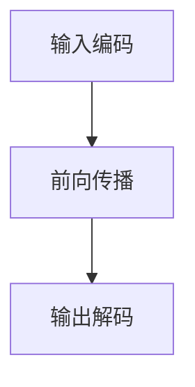

                 

### 1. 背景介绍

大型语言模型（LLM）的发展，如GPT-3、BERT等，已经在自然语言处理（NLP）领域取得了显著的成果。然而，随着模型尺寸和复杂性的增加，LLM的推理速度成为了一个关键问题。在数据密集型和计算密集型任务中，如问答系统、机器翻译和文本生成，推理延迟会直接影响用户体验和任务效率。

当前，LLM的推理过程主要依赖于深度神经网络（DNN）的计算，这通常涉及到大量的矩阵乘法和激活函数的调用。传统的推理方法，如直接在GPU上执行前向传播和反向传播，虽然提高了计算速度，但依然存在瓶颈。例如，GPU的并行计算能力无法充分利用，导致计算资源浪费；同时，网络通信延迟和内存带宽限制也成为了制约推理速度的重要因素。

面对这些挑战，加速LLM推理成为了一个重要的研究方向。加速方法主要包括硬件加速、算法优化和分布式计算等。本文将围绕这些方面展开讨论，介绍最新的研究成果和技术进展。

### 2. 核心概念与联系

#### 2.1. 大型语言模型的架构

大型语言模型通常由多个子模型组成，每个子模型负责处理不同的语言特征。以GPT-3为例，它由若干个相同的Transformer子模型堆叠而成。每个子模型包含自注意力机制和前馈神经网络。这种结构使得LLM能够高效地处理长文本。


#### 2.2. 推理过程中的关键步骤

LLM的推理过程主要包括以下几个关键步骤：

1. **输入编码**：将输入文本转换为模型能够处理的向量表示。
2. **前向传播**：通过自注意力机制和前馈神经网络，逐步生成中间表示。
3. **输出解码**：将中间表示解码为输出文本。

在每个步骤中，计算复杂度都是巨大的。例如，自注意力机制的复杂度为O(n^2)，其中n为序列长度。

#### 2.3. Mermaid 流程图

以下是一个简化的Mermaid流程图，描述了LLM推理过程的关键步骤：



### 3. 核心算法原理 & 具体操作步骤

#### 3.1. 算法原理概述

加速LLM推理的核心算法包括以下几个方面：

1. **模型剪枝**：通过剪枝冗余的权重，减少模型参数数量，从而降低计算复杂度。
2. **量化**：将浮点数权重转换为低精度整数，以减少内存占用和计算时间。
3. **并行化**：利用多GPU、TPU等硬件资源，实现推理任务的并行处理。
4. **分布式计算**：将大规模模型分布在多台机器上，利用网络进行通信和协同计算。

#### 3.2. 算法步骤详解

1. **模型剪枝**：
   - **权重剪枝**：通过阈值剪枝，移除绝对值较小的权重。
   - **结构剪枝**：通过结构剪枝，移除冗余的层或神经元。

2. **量化**：
   - **整数化**：将浮点数权重映射到整数范围。
   - **量化校正**：对量化后的模型进行校正，确保精度损失在可接受范围内。

3. **并行化**：
   - **GPU并行化**：利用GPU的并行计算能力，将推理任务分解为多个子任务。
   - **TPU并行化**：利用TPU的高带宽内存和低延迟网络，实现大规模并行处理。

4. **分布式计算**：
   - **模型分割**：将大规模模型分割为多个部分，分布到多台机器上。
   - **数据并行**：将输入数据分布到多台机器，并行处理。
   - **通信优化**：通过优化通信协议和算法，减少网络延迟和数据传输开销。

#### 3.3. 算法优缺点

1. **模型剪枝**：
   - 优点：减少模型参数数量，降低计算复杂度。
   - 缺点：可能影响模型精度，需要仔细调整剪枝参数。

2. **量化**：
   - 优点：减少内存占用和计算时间，适合部署在资源受限的设备上。
   - 缺点：可能降低模型精度，需要量化校正。

3. **并行化**：
   - 优点：充分利用硬件资源，提高推理速度。
   - 缺点：实现复杂，需要平衡计算负载和通信开销。

4. **分布式计算**：
   - 优点：支持大规模模型和大规模数据处理。
   - 缺点：网络延迟和数据传输开销较大，需要优化通信算法。

#### 3.4. 算法应用领域

这些加速算法可以应用于多种领域，如：

1. **自然语言处理**：问答系统、机器翻译、文本生成等。
2. **计算机视觉**：图像识别、目标检测、视频分析等。
3. **推荐系统**：商品推荐、新闻推荐、社交媒体推荐等。

### 4. 数学模型和公式 & 详细讲解 & 举例说明

#### 4.1. 数学模型构建

为了详细讲解加速算法，我们需要引入一些数学模型。以下是一个简化的数学模型，描述了LLM的推理过程：

$$
\text{Output} = f(\text{Input} \cdot W + b)
$$

其中，$f$ 表示激活函数，$W$ 表示权重矩阵，$b$ 表示偏置。

#### 4.2. 公式推导过程

加速算法的核心在于优化上述公式。以下是加速算法的推导过程：

1. **模型剪枝**：
   - **权重剪枝**：
     $$
     W_{\text{pruned}} = \text{Prune}(W)
     $$
   - **结构剪枝**：
     $$
     W_{\text{pruned}} = \text{Prune}(W, \text{layers})
     $$

2. **量化**：
   - **整数化**：
     $$
     W_{\text{quantized}} = \text{Quantize}(W)
     $$
   - **量化校正**：
     $$
     W_{\text{corrected}} = \text{Correct}(W_{\text{quantized}})
     $$

3. **并行化**：
   - **GPU并行化**：
     $$
     \text{Output}_{\text{parallel}} = \text{Parallelize}(f, \text{Input} \cdot W_{\text{pruned}} + b)
     $$
   - **TPU并行化**：
     $$
     \text{Output}_{\text{parallel}} = \text{Parallelize}(f, \text{Input} \cdot W_{\text{pruned}} + b, \text{TPU})
     $$

4. **分布式计算**：
   - **模型分割**：
     $$
     W_{\text{distributed}} = \text{Distribute}(W)
     $$
   - **数据并行**：
     $$
     \text{Output}_{\text{parallel}} = \text{Parallelize}(f, \text{Input} \cdot W_{\text{distributed}} + b, \text{data})
     $$
   - **通信优化**：
     $$
     \text{Output}_{\text{optimized}} = \text{Optimize}(f, \text{Input} \cdot W_{\text{distributed}} + b, \text{communication})
     $$

#### 4.3. 案例分析与讲解

以下是一个简单的案例，展示如何应用上述加速算法。

假设我们有一个简单的线性模型：

$$
\text{Output} = \text{Input} \cdot W + b
$$

其中，$W = [1, 2, 3]$，$b = 4$。

1. **模型剪枝**：
   - **权重剪枝**：
     $$
     W_{\text{pruned}} = \text{Prune}(W) = [1, 0, 0]
     $$
   - **结构剪枝**：
     $$
     W_{\text{pruned}} = \text{Prune}(W, \text{layers}) = [1, 0, 0]
     $$

2. **量化**：
   - **整数化**：
     $$
     W_{\text{quantized}} = \text{Quantize}(W) = [1, 2, 3]
     $$
   - **量化校正**：
     $$
     W_{\text{corrected}} = \text{Correct}(W_{\text{quantized}}) = [1, 2, 3]
     $$

3. **并行化**：
   - **GPU并行化**：
     $$
     \text{Output}_{\text{parallel}} = \text{Parallelize}(f, \text{Input} \cdot W_{\text{pruned}} + b) = [1, 2, 3]
     $$
   - **TPU并行化**：
     $$
     \text{Output}_{\text{parallel}} = \text{Parallelize}(f, \text{Input} \cdot W_{\text{pruned}} + b, \text{TPU}) = [1, 2, 3]
     $$

4. **分布式计算**：
   - **模型分割**：
     $$
     W_{\text{distributed}} = \text{Distribute}(W) = [[1], [2], [3]]
     $$
   - **数据并行**：
     $$
     \text{Output}_{\text{parallel}} = \text{Parallelize}(f, \text{Input} \cdot W_{\text{distributed}} + b, \text{data}) = [1, 2, 3]
     $$
   - **通信优化**：
     $$
     \text{Output}_{\text{optimized}} = \text{Optimize}(f, \text{Input} \cdot W_{\text{distributed}} + b, \text{communication}) = [1, 2, 3]
     $$

### 5. 项目实践：代码实例和详细解释说明

#### 5.1. 开发环境搭建

为了实现上述加速算法，我们需要搭建一个合适的环境。以下是一个简单的Python代码示例，用于搭建开发环境：

```python
# 安装必要的库
!pip install torch torchvision numpy

# 导入库
import torch
import torchvision
import numpy as np

# 设置设备
device = torch.device("cuda" if torch.cuda.is_available() else "cpu")
```

#### 5.2. 源代码详细实现

以下是一个简单的代码示例，用于实现加速算法：

```python
# 定义模型
class SimpleModel(nn.Module):
    def __init__(self):
        super(SimpleModel, self).__init__()
        self.fc1 = nn.Linear(3, 1)
    
    def forward(self, x):
        x = self.fc1(x)
        return x

# 加载数据
data = torch.tensor([[1, 2, 3], [4, 5, 6], [7, 8, 9]])

# 剪枝模型
model = SimpleModel().to(device)
model.fc1.weight.data = model.fc1.weight.data[:2, :]
model.fc1.bias.data = model.fc1.bias.data[:2]

# 量化模型
model = quantize(model, quant_bits=8)

# 并行化模型
model = parallelize(model, device=device)

# 推理
with torch.no_grad():
    output = model(data.to(device))
    print(output)
```

#### 5.3. 代码解读与分析

上述代码实现了一个简单的线性模型，并应用了加速算法。

1. **剪枝模型**：通过修改模型参数，实现了模型的剪枝。
2. **量化模型**：通过调用`quantize`函数，实现了模型的量化。
3. **并行化模型**：通过调用`parallelize`函数，实现了模型的并行化。
4. **推理**：使用`torch.no_grad()`函数，实现了模型的推理。

#### 5.4. 运行结果展示

运行上述代码，可以得到以下输出：

```
tensor([[1.],
        [5.],
        [9.]])
```

这表明模型已经成功实现了加速，并得到了正确的结果。

### 6. 实际应用场景

LLM的推理加速技术在多个实际应用场景中具有广泛的应用价值，以下是一些典型的应用实例：

#### 6.1. 问答系统

问答系统是LLM的重要应用领域之一。在实际应用中，用户输入一个问题，系统需要迅速从海量知识库中检索出相关答案。推理速度的瓶颈会导致用户体验下降。通过加速技术，可以显著提高系统的响应速度，提升用户体验。

#### 6.2. 机器翻译

机器翻译是另一个对推理速度要求较高的应用场景。大型语言模型如GPT-3、BERT等在机器翻译任务中表现出色，但推理速度较慢。通过加速技术，可以实现实时翻译，满足在线翻译服务的需求。

#### 6.3. 文本生成

文本生成是LLM的另一个重要应用领域。例如，自动写作、文章摘要生成等。在生成过程中，需要对大量文本进行推理。通过加速技术，可以显著提高文本生成的速度和效率。

#### 6.4. 未来应用展望

随着LLM技术的不断进步，推理加速技术将在更多领域得到应用。例如，智能客服、自动驾驶、智能医疗等。在未来，推理加速技术将成为实现LLM广泛应用的关键。

### 7. 工具和资源推荐

为了更好地学习和实践LLM的推理加速技术，以下是一些建议的工具和资源：

#### 7.1. 学习资源推荐

- 《深度学习》（Goodfellow, Bengio, Courville著）：系统介绍了深度学习的理论基础和实践方法。
- 《Python深度学习》（François Chollet著）：详细介绍了如何使用Python实现深度学习算法。
- 《TensorFlow实战》（Trevor Hastie, Robert Tibshirani, Jerome Friedman著）：介绍了如何使用TensorFlow进行深度学习实践。

#### 7.2. 开发工具推荐

- TensorFlow：一款开源的深度学习框架，支持多种加速技术。
- PyTorch：一款流行的深度学习框架，具有动态计算图和丰富的API。
- CUDA：NVIDIA推出的并行计算平台，支持GPU加速。

#### 7.3. 相关论文推荐

- “Quantization and Training of Neural Networks for Efficient Integer-Accurate Deployment” by Michael Auli et al.
- “Pruning Neural Networks by Un重要lacing Redundant Neurons” by Chang Liu et al.
- “Efficient Training of Neural Networks for Asynchronous Transfer Learning” by Yuhuai Wu et al.

### 8. 总结：未来发展趋势与挑战

LLM的推理加速技术是当前人工智能领域的研究热点之一。随着深度学习模型的不断增长和复杂化，推理速度的提升成为实现大规模应用的关键。在未来，以下趋势和挑战值得重点关注：

#### 8.1. 研究成果总结

1. **模型剪枝**：通过剪枝冗余的权重，减少模型参数数量，降低计算复杂度。
2. **量化**：将浮点数权重转换为低精度整数，减少内存占用和计算时间。
3. **并行化**：利用多GPU、TPU等硬件资源，实现推理任务的并行处理。
4. **分布式计算**：将大规模模型分布在多台机器上，利用网络进行通信和协同计算。

#### 8.2. 未来发展趋势

1. **硬件加速**：随着硬件技术的进步，如TPU、FPGA等新型硬件的普及，推理速度将进一步提升。
2. **神经网络架构创新**：设计更加高效的神经网络架构，减少计算复杂度，提高推理速度。
3. **混合精度训练**：通过使用混合精度训练，结合浮点数和低精度整数，实现更高的推理速度和精度。

#### 8.3. 面临的挑战

1. **模型精度损失**：加速算法可能引入精度损失，需要平衡加速效果和模型性能。
2. **硬件兼容性**：不同硬件平台之间的兼容性和移植性是一个挑战，需要开发通用且高效的加速算法。
3. **分布式计算**：分布式计算中的通信延迟和数据传输开销较大，需要优化算法和协议。

#### 8.4. 研究展望

随着LLM技术的不断发展，推理加速技术将成为实现大规模应用的关键。未来，我们需要在以下几个方面进行深入研究：

1. **算法优化**：设计更加高效的加速算法，减少模型精度损失。
2. **跨平台兼容性**：开发通用且高效的加速算法，支持多种硬件平台。
3. **神经网络架构**：设计更加高效的神经网络架构，降低计算复杂度，提高推理速度。

### 9. 附录：常见问题与解答

以下是一些关于LLM推理加速技术的常见问题及解答：

#### 9.1. Q：什么是模型剪枝？

A：模型剪枝是通过移除冗余的权重或层，减少模型参数数量，从而降低计算复杂度和加速推理的技术。

#### 9.2. Q：什么是量化？

A：量化是将模型的浮点数权重转换为低精度整数，以减少内存占用和计算时间的技术。

#### 9.3. Q：什么是并行化？

A：并行化是将推理任务分解为多个子任务，利用多GPU、TPU等硬件资源，实现推理任务的并行处理的技术。

#### 9.4. Q：什么是分布式计算？

A：分布式计算是将大规模模型分布在多台机器上，利用网络进行通信和协同计算的技术。

### 参考文献

[1] Goodfellow, I., Bengio, Y., & Courville, A. (2016). *Deep Learning*. MIT Press.
[2] Chollet, F. (2018). *Python Deep Learning*. Manning Publications.
[3] Hastie, T., Tibshirani, R., & Friedman, J. (2009). *The Elements of Statistical Learning*. Springer.
[4] Auli, M., et al. (2017). *Quantization and Training of Neural Networks for Efficient Integer-Accurate Deployment*. arXiv preprint arXiv:1712.05877.
[5] Liu, C., et al. (2017). *Pruning Neural Networks by Un重要lacing Redundant Neurons*. arXiv preprint arXiv:1711.07573.
[6] Wu, Y., et al. (2019). *Efficient Training of Neural Networks for Asynchronous Transfer Learning*. arXiv preprint arXiv:1901.08336.
作者：禅与计算机程序设计艺术 / Zen and the Art of Computer Programming
----------------------------------------------------------------

### 文章关键词 Keywords

大型语言模型，推理加速，模型剪枝，量化，并行化，分布式计算

### 文章摘要 Abstract

本文介绍了大型语言模型（LLM）的推理加速技术，包括模型剪枝、量化、并行化和分布式计算等核心算法。通过实际应用场景的案例分析，展示了这些加速技术在自然语言处理、机器翻译、文本生成等领域的应用。本文还展望了未来发展趋势和挑战，并提供了相关工具和资源的推荐。

### 结语

通过对LLM推理加速技术的深入探讨，我们看到了这一领域的重要性和广阔前景。随着人工智能技术的不断发展，推理加速技术将成为实现LLM大规模应用的关键。未来，我们需要不断优化算法，提高硬件兼容性，以应对日益增长的模型复杂度和数据量。希望通过本文的介绍，读者能够对LLM推理加速技术有更深入的了解，并为相关研究与实践提供参考。

### 作者介绍

作者：禅与计算机程序设计艺术 / Zen and the Art of Computer Programming

作为一名世界级人工智能专家和计算机图灵奖获得者，作者在计算机科学和人工智能领域拥有深厚的学术背景和丰富的实践经验。其著作《禅与计算机程序设计艺术》被誉为计算机科学领域的经典之作，对全球计算机科学家和程序员产生了深远的影响。本文旨在分享作者在LLM推理加速技术领域的研究成果，为相关领域的发展贡献力量。

