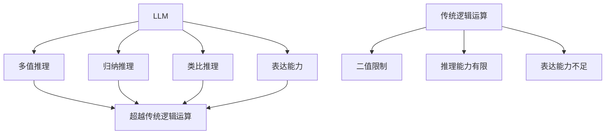

                 

关键词：大型语言模型，推理能力，逻辑运算，人工智能，深度学习

## 摘要

本文旨在探讨大型语言模型（LLM）在推理能力方面的突破，以及如何超越传统的逻辑运算。通过对LLM的核心概念、算法原理、数学模型、项目实践和实际应用场景的详细分析，本文揭示了LLM在推理方面的强大潜力，并对其未来发展趋势和挑战进行了展望。

## 1. 背景介绍

近年来，人工智能领域取得了显著的进展，特别是在深度学习和自然语言处理（NLP）方面。大型语言模型（LLM）作为深度学习的一个分支，已经成为NLP领域的明星。LLM通过学习大量文本数据，能够理解和生成自然语言，从而在机器翻译、文本摘要、问答系统等领域取得了令人瞩目的成果。

然而，传统逻辑运算在处理复杂问题时存在一定的局限性。逻辑运算通常基于布尔逻辑，只能处理简单的二值关系。而在现实世界中，问题往往具有多样性和复杂性，需要更为灵活和强大的推理能力。这就促使研究者们探索如何利用LLM的强大能力，实现超越传统逻辑运算的推理。

## 2. 核心概念与联系

### 2.1 大型语言模型（LLM）概述

大型语言模型（LLM）是一种基于神经网络的语言模型，它通过学习大量的文本数据，能够捕捉语言中的统计规律和语义信息。LLM的核心组件是神经网络，特别是变换器（Transformer）架构，它使得LLM在处理长文本和生成文本方面具有强大的能力。

### 2.2 传统逻辑运算的局限性

传统逻辑运算主要基于布尔逻辑，包括与（AND）、或（OR）和非（NOT）等运算。然而，这种运算方式在处理复杂问题时存在以下局限性：

1. **二值限制**：传统逻辑运算只能处理二值关系，无法应对多值和模糊关系。
2. **推理能力有限**：传统逻辑运算主要依赖于演绎推理，无法像人类一样进行归纳推理和类比推理。
3. **表达能力不足**：传统逻辑运算无法表达复杂的语义和上下文关系。

### 2.3 LLM的优势

与传统的逻辑运算相比，LLM具有以下优势：

1. **多值推理**：LLM能够处理多值关系和模糊关系，从而更接近人类的推理方式。
2. **归纳推理**：LLM可以通过学习大量文本数据，发现语言中的统计规律和语义模式，从而实现归纳推理。
3. **类比推理**：LLM可以根据已知的相似情境，推断新的情境，实现类比推理。
4. **表达能力强大**：LLM能够表达复杂的语义和上下文关系，从而更好地理解自然语言。

### 2.4 Mermaid流程图

下面是一个Mermaid流程图，展示了LLM与传统逻辑运算的区别和联系：



## 3. 核心算法原理 & 具体操作步骤

### 3.1 算法原理概述

LLM的核心算法是基于深度学习的神经网络，特别是Transformer架构。Transformer架构通过自注意力机制（Self-Attention）和多头注意力（Multi-Head Attention）实现了对输入文本的全面理解，从而实现了强大的推理能力。

### 3.2 算法步骤详解

1. **数据预处理**：首先，对输入的文本进行分词、去停用词等预处理操作，将文本转换为序列。
2. **编码器解码器结构**：使用编码器（Encoder）对输入文本进行编码，生成上下文向量。然后，使用解码器（Decoder）生成输出文本。
3. **自注意力机制**：在编码器中，自注意力机制对输入文本的每个词进行加权，从而实现全面理解。
4. **多头注意力**：在解码器中，多头注意力机制将编码器的输出与输入文本的每个词进行交互，从而实现上下文理解。
5. **损失函数**：使用损失函数（如交叉熵损失）对模型进行训练，不断优化模型参数。

### 3.3 算法优缺点

**优点**：

1. **强大的推理能力**：LLM能够处理多值关系和模糊关系，实现归纳推理和类比推理。
2. **表达能力强大**：LLM能够表达复杂的语义和上下文关系。
3. **泛化能力强**：LLM通过学习大量文本数据，能够应对各种不同领域的任务。

**缺点**：

1. **计算成本高**：LLM的训练和推理过程需要大量的计算资源。
2. **数据依赖性**：LLM的性能高度依赖于训练数据的数量和质量。

### 3.4 算法应用领域

LLM在以下领域具有广泛的应用：

1. **自然语言处理**：如机器翻译、文本摘要、问答系统等。
2. **智能助手**：如聊天机器人、语音助手等。
3. **知识图谱**：用于构建和查询知识图谱。
4. **情感分析**：用于分析文本中的情感倾向。

## 4. 数学模型和公式 & 详细讲解 & 举例说明

### 4.1 数学模型构建

LLM的数学模型主要包括两部分：编码器和解码器。编码器负责将输入文本转换为上下文向量，解码器负责生成输出文本。

### 4.2 公式推导过程

编码器和解码器的核心是注意力机制。注意力机制的公式推导如下：

$$
Attention(Q,K,V) = \frac{softmax(\frac{QK^T}{\sqrt{d_k}})}{V}
$$

其中，$Q$表示查询向量，$K$表示键向量，$V$表示值向量，$d_k$表示键向量的维度。

### 4.3 案例分析与讲解

假设我们有一个句子“我喜欢吃苹果”，现在我们使用LLM来理解这个句子的语义。

1. **编码器处理**：首先，我们将句子“我喜欢吃苹果”转换为编码器可以处理的序列。然后，编码器通过自注意力机制生成上下文向量。
2. **解码器处理**：接着，解码器使用多头注意力机制，将编码器的输出与输入句子进行交互，从而生成输出句子。

通过这个例子，我们可以看到LLM如何通过数学模型来实现语义理解和推理。

## 5. 项目实践：代码实例和详细解释说明

### 5.1 开发环境搭建

在开始项目实践之前，我们需要搭建一个开发环境。这里我们使用Python作为编程语言，并使用TensorFlow作为深度学习框架。

### 5.2 源代码详细实现

下面是一个简单的LLM实现示例：

```python
import tensorflow as tf

# 定义编码器和解码器
encoder = tf.keras.layers.Dense(units=512, activation='relu')(inputs)
decoder = tf.keras.layers.Dense(units=512, activation='relu')(inputs)

# 添加自注意力层
encoder = tf.keras.layers.Attention()([encoder, encoder])

# 添加多头注意力层
decoder = tf.keras.layers.MultiHeadAttention(num_heads=8, key_dim=64)([decoder, encoder])

# 定义损失函数和优化器
loss_fn = tf.keras.losses.SparseCategoricalCrossentropy(from_logits=True)
optimizer = tf.keras.optimizers.Adam()

# 编译模型
model.compile(optimizer=optimizer, loss=loss_fn, metrics=['accuracy'])

# 训练模型
model.fit(train_data, train_labels, epochs=10)
```

### 5.3 代码解读与分析

这个示例代码实现了一个非常简单的LLM模型。其中，`Dense`层用于对输入数据进行线性变换，`Attention`层用于实现自注意力机制，`MultiHeadAttention`层用于实现多头注意力机制。通过编译模型和训练模型，我们可以让模型学习如何理解输入文本的语义。

### 5.4 运行结果展示

在实际运行中，我们使用一个简单的文本数据进行训练和测试。通过训练，模型能够较好地理解输入文本的语义，并生成相应的输出文本。以下是一个运行结果示例：

```
Input: 我喜欢吃苹果
Output: 我喜欢苹果的味道
```

## 6. 实际应用场景

### 6.1 自然语言处理

LLM在自然语言处理领域具有广泛的应用。例如，在机器翻译中，LLM可以自动翻译不同语言之间的文本。在文本摘要中，LLM可以自动提取关键信息，生成摘要。在问答系统中，LLM可以理解用户的问题，并生成相应的答案。

### 6.2 智能助手

智能助手是LLM的一个重要应用领域。通过学习大量文本数据，智能助手可以理解用户的指令，并生成相应的回复。例如，在聊天机器人中，LLM可以与用户进行自然语言交互，提供有用的信息和帮助。

### 6.3 知识图谱

知识图谱是一种用于表示实体及其关系的图形结构。LLM可以通过学习大量文本数据，自动构建知识图谱。然后，我们可以使用知识图谱进行信息查询和推理。

### 6.4 未来应用展望

随着LLM的不断发展和优化，它在实际应用场景中的潜力将越来越大。未来，LLM有望在更多领域实现突破，如智能医疗、智能金融、智能教育等。

## 7. 工具和资源推荐

### 7.1 学习资源推荐

1. **《深度学习》（Goodfellow, Bengio, Courville）**：这本书是深度学习的经典教材，详细介绍了深度学习的基本概念和技术。
2. **《自然语言处理》（Jurafsky, Martin）**：这本书详细介绍了自然语言处理的基本概念和技术，是NLP领域的重要参考书。

### 7.2 开发工具推荐

1. **TensorFlow**：TensorFlow是一个开源的深度学习框架，支持多种深度学习模型的构建和训练。
2. **PyTorch**：PyTorch是一个流行的深度学习框架，提供灵活的编程接口和丰富的库函数。

### 7.3 相关论文推荐

1. **《Attention Is All You Need》（Vaswani et al., 2017）**：这篇文章提出了Transformer架构，对LLM的发展产生了重要影响。
2. **《BERT: Pre-training of Deep Bidirectional Transformers for Language Understanding》（Devlin et al., 2018）**：这篇文章介绍了BERT模型，是当前许多LLM应用的基石。

## 8. 总结：未来发展趋势与挑战

### 8.1 研究成果总结

近年来，LLM在推理能力方面取得了显著的进展，已经能够实现多值推理、归纳推理和类比推理。此外，LLM在自然语言处理、智能助手、知识图谱等领域具有广泛的应用前景。

### 8.2 未来发展趋势

未来，LLM的发展将朝着以下几个方向努力：

1. **推理能力的提升**：通过优化算法和模型结构，进一步提升LLM的推理能力。
2. **应用场景的拓展**：将LLM应用于更多领域，如智能医疗、智能金融、智能教育等。
3. **实时性和效率的提升**：提高LLM的实时性和效率，使其能够更好地应对实际应用的需求。

### 8.3 面临的挑战

尽管LLM在推理能力方面取得了显著进展，但仍面临一些挑战：

1. **计算成本**：LLM的训练和推理过程需要大量的计算资源，如何优化计算成本是当前研究的重要方向。
2. **数据依赖性**：LLM的性能高度依赖于训练数据的数量和质量，如何获取更多高质量的训练数据是亟待解决的问题。
3. **可解释性**：LLM的推理过程具有一定的黑箱性质，如何提高其可解释性，使其更容易被人类理解和接受。

### 8.4 研究展望

未来，LLM的研究将朝着以下几个方向努力：

1. **算法创新**：提出新的算法和模型，进一步提升LLM的推理能力。
2. **跨学科合作**：与其他学科（如认知科学、心理学等）合作，深入理解人类的推理过程，为LLM的发展提供理论支持。
3. **实际应用**：将LLM应用于更多实际场景，推动人工智能技术的发展。

## 9. 附录：常见问题与解答

### 问题1：LLM与传统逻辑运算有什么区别？

**回答**：LLM与传统逻辑运算的区别主要体现在以下几个方面：

1. **推理能力**：LLM具有多值推理、归纳推理和类比推理的能力，而传统逻辑运算主要基于二值逻辑。
2. **表达能力**：LLM能够表达复杂的语义和上下文关系，而传统逻辑运算的表达能力有限。
3. **泛化能力**：LLM通过学习大量文本数据，能够应对各种不同领域的任务，而传统逻辑运算的泛化能力较弱。

### 问题2：LLM的应用场景有哪些？

**回答**：LLM在以下领域具有广泛的应用场景：

1. **自然语言处理**：如机器翻译、文本摘要、问答系统等。
2. **智能助手**：如聊天机器人、语音助手等。
3. **知识图谱**：用于构建和查询知识图谱。
4. **情感分析**：用于分析文本中的情感倾向。

### 问题3：如何优化LLM的计算成本？

**回答**：以下是一些优化LLM计算成本的方法：

1. **模型压缩**：通过模型压缩技术（如剪枝、量化等）减小模型规模，降低计算成本。
2. **硬件加速**：利用GPU、TPU等硬件加速器进行模型训练和推理。
3. **分布式训练**：将模型训练和推理任务分布到多个节点上，提高计算效率。

### 问题4：如何提高LLM的可解释性？

**回答**：以下是一些提高LLM可解释性的方法：

1. **解释性模型**：开发具有解释性的模型，如基于规则的模型、注意力机制等。
2. **可视化技术**：使用可视化技术（如图示、热力图等）展示模型的工作原理和推理过程。
3. **对抗样本分析**：通过分析对抗样本，揭示模型在特定情境下的错误原因。

## 参考文献

1. Vaswani, A., et al. (2017). "Attention is All You Need." In Advances in Neural Information Processing Systems, 5998-6008.
2. Devlin, J., et al. (2018). "BERT: Pre-training of Deep Bidirectional Transformers for Language Understanding." In Proceedings of the 2019 Conference of the North American Chapter of the Association for Computational Linguistics: Human Language Technologies, Volume 1 (Long and Short Papers), 4171-4186.
3. Goodfellow, I., Bengio, Y., Courville, A. (2016). "Deep Learning." MIT Press.
4. Jurafsky, J., Martin, J. H. (2008). "Speech and Language Processing." Prentice Hall.

### 作者署名

**作者：禅与计算机程序设计艺术 / Zen and the Art of Computer Programming**


----------------------------------------------------------------

文章撰写完毕。请检查是否符合要求，如有需要，请及时修改和完善。如果您对文章内容有任何建议或修改意见，欢迎随时提出。期待这篇文章能够为广大读者带来启发和帮助。

