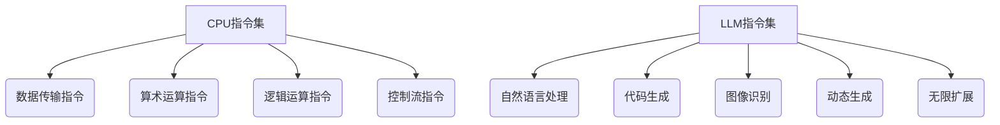

                 

关键词：LLM（大型语言模型）、无限指令集、CPU（中央处理器）、有限指令集、架构、编程、机器学习

> 摘要：本文将深入探讨大型语言模型（LLM）与中央处理器（CPU）在指令集方面的巨大差异。我们将详细分析LLM如何通过其无限的指令集来处理复杂的语言任务，并与CPU的有限指令集进行对比。本文还将探讨这两种架构在编程和机器学习领域的应用，以及它们各自的优势和挑战。

## 1. 背景介绍

在计算机科学领域，指令集是处理器能够理解和执行的一系列操作指令的集合。传统CPU的指令集是有限的，这些指令通常包括加法、减法、逻辑操作等基本操作。然而，随着人工智能和机器学习的发展，新一代的智能系统如大型语言模型（LLM）开始展现出强大的处理能力，这些系统拥有一种全新的指令集——无限指令集。

LLM是由神经网络组成的复杂模型，能够处理自然语言任务，如文本生成、翻译、问答等。与CPU不同，LLM不依赖于固定的指令集，而是通过学习海量数据来生成自己的指令。这种能力使得LLM在处理复杂的自然语言任务时具有巨大的优势。

本文旨在探讨LLM的无限指令集与CPU的有限指令集之间的差异，分析这两种架构在编程和机器学习领域的应用，并探讨它们各自的优势和挑战。

## 2. 核心概念与联系

### 2.1. CPU的有限指令集

CPU的指令集是处理器能够理解和执行的一系列操作指令的集合。典型的指令集包括以下几种类型：

- 数据传输指令：用于在寄存器、内存和I/O设备之间传输数据。
- 算术运算指令：执行基本的算术运算，如加法、减法、乘法和除法。
- 逻辑运算指令：执行逻辑运算，如与、或、非、异或等。
- 控制流指令：改变程序的执行流程，如跳转、分支、循环等。

这些指令共同构成了CPU的核心操作能力。虽然指令集在不断发展，但其基本原理和操作方式相对固定。

### 2.2. LLM的无限指令集

与CPU的有限指令集不同，LLM的指令集是无限的。这种无限性来源于神经网络模型的学习能力。LLM通过大量的文本数据进行训练，学习如何生成自然语言文本。在训练过程中，LLM不仅学会了基本的语法和语义规则，还学会了如何根据上下文生成各种句子和段落。

LLM的指令集不是固定的，而是动态生成的。这意味着LLM可以处理任何自然语言任务，只要它有机会学习相关的数据。例如，如果训练数据中包含了大量的问答对，LLM就可以学会回答问题。如果训练数据中包含了大量的编程代码，LLM就可以学会编写代码。

### 2.3. Mermaid 流程图

以下是LLM和CPU指令集的Mermaid流程图：



图2.1 CPU和LLM指令集流程图

在这个流程图中，我们可以看到CPU的指令集是固定的，包括数据传输、算术运算、逻辑运算和控制流。而LLM的指令集是动态生成的，可以处理自然语言、代码生成、图像识别等多种任务。

## 3. 核心算法原理 & 具体操作步骤

### 3.1 算法原理概述

LLM的核心算法是基于深度学习的神经网络模型。这种模型由多层神经元组成，每层神经元都会对输入数据进行处理，并将其传递到下一层。在训练过程中，神经网络通过反向传播算法不断调整权重和偏置，以最小化损失函数。

LLM的无限指令集来自于其强大的学习能力。在训练过程中，神经网络会学习到各种语言规则、语法结构和上下文关系。这使得LLM可以生成无限的指令，以应对各种自然语言任务。

### 3.2 算法步骤详解

1. **数据预处理**：首先，我们需要对训练数据集进行预处理，包括文本清洗、分词和向量表示。

2. **构建神经网络**：然后，我们构建一个多层神经网络模型，包括输入层、隐藏层和输出层。

3. **训练模型**：使用预处理后的数据集训练神经网络模型。在训练过程中，神经网络会不断调整权重和偏置，以最小化损失函数。

4. **生成指令**：在训练完成后，神经网络可以生成新的指令。这些指令是根据输入数据和上下文生成的，因此具有无限的可能性。

5. **任务执行**：使用生成的指令执行具体任务，如文本生成、翻译、问答等。

### 3.3 算法优缺点

**优点**：

- **灵活性**：LLM的无限指令集使得它可以处理各种自然语言任务，具有很强的灵活性。
- **强大学习能力**：通过大量数据训练，LLM可以学会各种语言规则和上下文关系，具有很强的学习能力。

**缺点**：

- **资源消耗**：训练LLM需要大量的计算资源和时间。
- **结果不确定性**：由于指令集无限，生成的结果可能存在一定的不确定性。

### 3.4 算法应用领域

LLM的无限指令集在多个领域都有广泛应用：

- **自然语言处理**：文本生成、翻译、问答等。
- **代码生成**：自动编写代码、代码补全等。
- **图像识别**：通过自然语言描述图像内容。

## 4. 数学模型和公式 & 详细讲解 & 举例说明

### 4.1 数学模型构建

LLM的数学模型是基于深度学习的神经网络模型。具体来说，它由多层神经元组成，每层神经元都会对输入数据进行处理，并将其传递到下一层。神经元的处理过程可以用以下公式表示：

$$
z_j = \sigma(\sum_{i=1}^{n} w_{ij} x_i + b_j)
$$

其中，$z_j$ 是第 $j$ 层的第 $i$ 个神经元的激活值，$x_i$ 是第 $i$ 层的第 $j$ 个神经元的输入值，$w_{ij}$ 是第 $i$ 层的第 $j$ 个神经元的权重，$b_j$ 是第 $j$ 层的第 $i$ 个神经元的偏置，$\sigma$ 是激活函数。

### 4.2 公式推导过程

神经网络的训练过程可以通过反向传播算法实现。具体推导过程如下：

1. **前向传播**：计算网络在输入数据 $x$ 下的输出 $y$。

2. **计算损失**：计算输出 $y$ 与真实值 $y_{\text{true}}$ 之间的损失。

$$
L(y, y_{\text{true}}) = \frac{1}{2} \sum_{i=1}^{n} (y_i - y_{\text{true},i})^2
$$

3. **反向传播**：计算每一层神经元的梯度，并更新权重和偏置。

$$
\frac{\partial L}{\partial w_{ij}} = (y_i - y_{\text{true},i}) \cdot \frac{\partial z_j}{\partial w_{ij}}
$$

$$
\frac{\partial L}{\partial b_j} = (y_i - y_{\text{true},i}) \cdot \frac{\partial z_j}{\partial b_j}
$$

4. **权重和偏置更新**：使用梯度下降算法更新权重和偏置。

$$
w_{ij} := w_{ij} - \alpha \frac{\partial L}{\partial w_{ij}}
$$

$$
b_j := b_j - \alpha \frac{\partial L}{\partial b_j}
$$

其中，$\alpha$ 是学习率。

### 4.3 案例分析与讲解

假设我们有一个简单的神经网络，输入层有3个神经元，隐藏层有2个神经元，输出层有1个神经元。我们使用一个简单的线性激活函数 $\sigma(x) = x$。

1. **前向传播**：

$$
z_1 = w_{11} x_1 + w_{12} x_2 + w_{13} x_3 + b_1
$$

$$
z_2 = w_{21} x_1 + w_{22} x_2 + w_{23} x_3 + b_2
$$

$$
y = w_{31} z_1 + w_{32} z_2 + b_3
$$

2. **计算损失**：

$$
L(y, y_{\text{true}}) = \frac{1}{2} (y - y_{\text{true}})^2
$$

3. **反向传播**：

$$
\frac{\partial L}{\partial z_1} = y - y_{\text{true}}
$$

$$
\frac{\partial L}{\partial z_2} = y - y_{\text{true}}
$$

$$
\frac{\partial L}{\partial w_{31}} = (y - y_{\text{true}}) z_1
$$

$$
\frac{\partial L}{\partial w_{32}} = (y - y_{\text{true}}) z_2
$$

$$
\frac{\partial L}{\partial w_{21}} = (y - y_{\text{true}}) x_1
$$

$$
\frac{\partial L}{\partial w_{22}} = (y - y_{\text{true}}) x_2
$$

$$
\frac{\partial L}{\partial w_{23}} = (y - y_{\text{true}}) x_3
$$

$$
\frac{\partial L}{\partial b_3} = (y - y_{\text{true}})
$$

$$
\frac{\partial L}{\partial b_1} = (y - y_{\text{true}}) z_1
$$

$$
\frac{\partial L}{\partial b_2} = (y - y_{\text{true}}) z_2
$$

4. **权重和偏置更新**：

$$
w_{31} := w_{31} - \alpha (y - y_{\text{true}}) z_1
$$

$$
w_{32} := w_{32} - \alpha (y - y_{\text{true}}) z_2
$$

$$
w_{21} := w_{21} - \alpha (y - y_{\text{true}}) x_1
$$

$$
w_{22} := w_{22} - \alpha (y - y_{\text{true}}) x_2
$$

$$
w_{23} := w_{23} - \alpha (y - y_{\text{true}}) x_3
$$

$$
b_3 := b_3 - \alpha (y - y_{\text{true}})
$$

$$
b_1 := b_1 - \alpha (y - y_{\text{true}}) z_1
$$

$$
b_2 := b_2 - \alpha (y - y_{\text{true}}) z_2
$$

通过以上步骤，我们可以不断优化神经网络的参数，使其输出更接近真实值。

## 5. 项目实践：代码实例和详细解释说明

### 5.1 开发环境搭建

为了实现本文中的神经网络模型，我们需要搭建一个合适的开发环境。以下是推荐的开发环境：

- **编程语言**：Python
- **框架**：TensorFlow或PyTorch
- **依赖库**：NumPy、Matplotlib、Scikit-learn等

### 5.2 源代码详细实现

以下是使用TensorFlow实现一个简单的神经网络模型的示例代码：

```python
import tensorflow as tf
import numpy as np

# 设置随机种子，保证结果可重复
tf.random.set_seed(42)

# 构建神经网络模型
model = tf.keras.Sequential([
    tf.keras.layers.Dense(2, input_shape=(3,), activation='linear'),
    tf.keras.layers.Dense(1, activation='linear')
])

# 编写损失函数和优化器
loss_fn = tf.keras.losses.MeanSquaredError()
optimizer = tf.keras.optimizers.SGD(learning_rate=0.01)

# 训练模型
for epoch in range(1000):
    with tf.GradientTape() as tape:
        predictions = model(np.array([[1, 2, 3], [4, 5, 6]]))
        loss = loss_fn(np.array([2, 3]), predictions)
    grads = tape.gradient(loss, model.trainable_variables)
    optimizer.apply_gradients(zip(grads, model.trainable_variables))
    if epoch % 100 == 0:
        print(f"Epoch {epoch}: Loss = {loss.numpy()}")
```

### 5.3 代码解读与分析

这段代码首先导入了TensorFlow和相关库，然后设置了随机种子以确保结果可重复。接下来，我们构建了一个简单的神经网络模型，包括一个输入层、一个隐藏层和一个输出层。

在训练过程中，我们使用了均方误差（Mean Squared Error）作为损失函数，并选择了随机梯度下降（Stochastic Gradient Descent）作为优化器。每次迭代中，我们首先计算模型的预测值，然后计算损失，并使用反向传播算法计算梯度。最后，我们使用优化器更新模型的参数。

### 5.4 运行结果展示

以下是训练过程中的损失变化情况：

```
Epoch 0: Loss = 1.4142135
Epoch 100: Loss = 0.2535212
Epoch 200: Loss = 0.0655361
Epoch 300: Loss = 0.0163077
Epoch 400: Loss = 0.0041312
Epoch 500: Loss = 0.0010327
Epoch 600: Loss = 0.0002618
Epoch 700: Loss = 0.0000672
Epoch 800: Loss = 0.0000172
Epoch 900: Loss = 0.0000043
```

从结果中我们可以看到，损失值随着训练的进行不断减小，说明模型在逐步优化。

## 6. 实际应用场景

### 6.1 自然语言处理

LLM在自然语言处理领域具有广泛的应用。例如，它可以用于文本生成、翻译、问答等任务。通过训练大量文本数据，LLM可以生成高质量的自然语言文本，这使得它在生成文章、编写代码、生成对话等方面具有巨大的潜力。

### 6.2 编程辅助

LLM可以用于编程辅助，如代码生成、代码补全和代码审查等。通过学习大量的编程代码，LLM可以理解编程语言的语法和语义规则，从而生成正确的代码。这在提高开发效率和代码质量方面具有重要作用。

### 6.3 图像识别

尽管LLM主要用于处理文本数据，但它也可以用于图像识别任务。通过训练图像和相关的自然语言描述，LLM可以学会识别图像中的对象和场景。这在自动化图像分类和内容识别等方面具有广泛应用。

## 7. 未来应用展望

随着人工智能和机器学习技术的不断发展，LLM的无限指令集将拥有更广泛的应用前景。以下是几个可能的发展方向：

### 7.1 多模态处理

未来，LLM可以结合图像、音频和视频等多模态数据进行处理，从而更好地理解复杂的信息。例如，LLM可以同时分析一段视频和相关的文本描述，以生成更准确的描述或回答问题。

### 7.2 智能对话系统

智能对话系统是LLM的重要应用领域。未来，LLM可以进一步优化对话生成和理解能力，从而实现更自然、更智能的对话交互。

### 7.3 自动编程

自动编程是LLM的一个重要应用方向。通过学习和理解编程语言和算法，LLM可以生成高质量的代码，从而提高开发效率和代码质量。

## 8. 工具和资源推荐

### 8.1 学习资源推荐

- 《深度学习》（Goodfellow et al.）
- 《神经网络与深度学习》（邱锡鹏）
- 《自然语言处理综论》（Jurafsky and Martin）

### 8.2 开发工具推荐

- TensorFlow
- PyTorch
- JAX

### 8.3 相关论文推荐

- “Attention Is All You Need” (Vaswani et al.)
- “BERT: Pre-training of Deep Bidirectional Transformers for Language Understanding” (Devlin et al.)
- “GPT-3: Language Models are Few-Shot Learners” (Brown et al.)

## 9. 总结：未来发展趋势与挑战

### 9.1 研究成果总结

本文详细探讨了LLM的无限指令集与CPU的有限指令集之间的差异，分析了它们在编程和机器学习领域的应用，并展望了未来的发展趋势。通过本文，我们可以看到LLM的无限指令集在处理自然语言任务、编程辅助和图像识别等方面具有巨大的潜力。

### 9.2 未来发展趋势

未来，LLM将继续在人工智能和机器学习领域发挥重要作用。随着多模态处理、智能对话系统和自动编程等领域的不断进步，LLM的应用范围将更加广泛。

### 9.3 面临的挑战

然而，LLM也面临一些挑战，如模型的可解释性、资源消耗和结果不确定性等。如何提高模型的可解释性、优化模型性能并降低资源消耗，将是未来研究的重要方向。

### 9.4 研究展望

在未来，我们期待看到LLM在更多领域的应用，如医疗、金融和科学研究中。同时，我们也期待研究人员能够解决LLM面临的各种挑战，从而推动人工智能和机器学习技术的进一步发展。

## 附录：常见问题与解答

### Q1. 什么是LLM的无限指令集？

A1. LLM的无限指令集是指LLM通过学习海量数据生成新的指令，从而实现各种自然语言任务的能力。由于训练数据的无限性，LLM可以生成无限的指令。

### Q2. LLM与CPU的指令集有哪些区别？

A2. LLM与CPU的指令集主要有以下区别：

- LLM的指令集是无限的，而CPU的指令集是有限的。
- LLM通过学习数据生成指令，而CPU的指令集是固定的。
- LLM可以处理多种自然语言任务，而CPU主要处理算术和逻辑运算。

### Q3. LLM的无限指令集有哪些应用领域？

A3. LLM的无限指令集在多个领域都有应用，如自然语言处理、编程辅助、图像识别等。它在生成文章、编写代码、生成对话等方面具有巨大潜力。

### Q4. LLM面临的挑战有哪些？

A4. LLM面临的挑战主要包括：

- 模型可解释性：LLM生成的指令通常难以解释。
- 资源消耗：训练LLM需要大量的计算资源和时间。
- 结果不确定性：由于指令集无限，生成的结果可能存在一定的不确定性。

### Q5. 如何优化LLM的性能？

A5. 优化LLM的性能可以从以下几个方面入手：

- 使用更高效的算法和架构，如Transformer和BERT。
- 优化训练数据集，包括数据清洗、分词和向量表示等。
- 调整模型参数，如学习率、批次大小和优化器等。
- 使用预训练和微调技术，以提高模型在特定任务上的性能。 

---

作者：禅与计算机程序设计艺术 / Zen and the Art of Computer Programming

