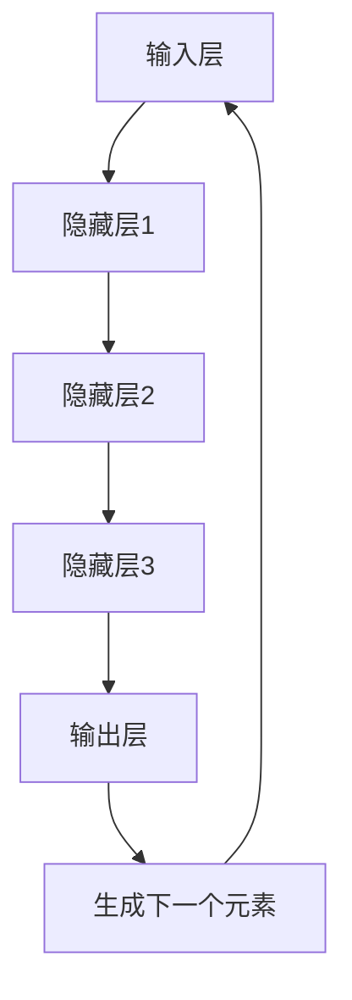

                 

关键词：Large Language Models（LLM），时序性，计算过程，神经网络，自然语言处理，深度学习，模型优化，编程范式。

摘要：随着深度学习和自然语言处理技术的快速发展，大型语言模型（LLM）已经成为AI领域的核心组件。本文将深入探讨LLM的时序性，分析其在计算过程中的独特性质，并探讨其对传统计算范式的重新定义。通过对LLM时序性的研究，我们不仅能够更好地理解这些模型的工作原理，还能为未来的算法优化和实际应用提供新的思路。

## 1. 背景介绍

近年来，深度学习和自然语言处理（NLP）技术取得了显著进展，大型语言模型（LLM）如GPT、BERT等成为该领域的研究热点。LLM在生成文本、机器翻译、问答系统等任务上表现出了卓越的性能，引发了广泛关注。然而，LLM的成功背后隐藏着一个关键问题：时序性。

时序性是LLM的核心特性之一，它决定了模型如何处理和生成序列数据。传统的计算范式，如图灵机、编译器等，都是基于顺序执行的，而LLM则采用了完全不同的方式。LLM通过处理序列中的每个元素，根据先前的信息生成下一个元素，这种过程被称为“自回归”。本文将深入探讨LLM的时序性，分析其在计算过程中的表现和挑战。

## 2. 核心概念与联系

### 2.1. 语言模型基础

首先，我们需要了解语言模型的基本概念。语言模型是一个概率模型，用于预测序列中的下一个元素。在NLP中，语言模型通常是一个神经网络，其输入是一个序列，输出是该序列的下一个元素的概率分布。

### 2.2. 时序性原理

LLM的时序性源于其自回归的特性。在自回归过程中，模型首先学习输入序列的概率分布，然后使用这些分布生成序列的下一个元素。这个过程不断重复，直到生成完整的序列。

### 2.3. 时序性架构

LLM的时序性架构通常包括以下几个关键组件：

1. **输入层**：接收序列数据，并将其转换为模型可以处理的格式。
2. **隐藏层**：对输入数据进行处理，提取特征。
3. **输出层**：生成序列的下一个元素的概率分布。

### 2.4. Mermaid 流程图

下面是一个简化的LLM时序性架构的Mermaid流程图：



在这个流程图中，输入层接收序列数据，通过隐藏层处理，最终输出层的输出用于生成序列的下一个元素。这个过程不断重复，直到生成完整的序列。

## 3. 核心算法原理 & 具体操作步骤

### 3.1. 算法原理概述

LLM的核心算法是基于神经网络的自回归模型。自回归模型通过学习输入序列的概率分布，生成序列的下一个元素。这个过程涉及到以下几个关键步骤：

1. **输入处理**：将输入序列转换为神经网络可以处理的格式。
2. **特征提取**：通过隐藏层提取序列的特征。
3. **概率生成**：输出层生成序列的下一个元素的概率分布。
4. **元素生成**：根据概率分布生成序列的下一个元素。

### 3.2. 算法步骤详解

1. **输入处理**：首先，我们需要将输入序列转换为神经网络可以处理的格式。通常，这涉及到将文本转换为词向量或嵌入向量。

2. **特征提取**：然后，神经网络通过隐藏层对输入序列进行特征提取。这个过程涉及到多层神经网络，每层神经网络都会提取更高层次的特征。

3. **概率生成**：输出层根据隐藏层的特征生成序列的下一个元素的概率分布。这个概率分布通常是一个多维概率分布，如高斯分布或softmax分布。

4. **元素生成**：根据概率分布生成序列的下一个元素。这个过程涉及到随机选择，以生成序列的下一个元素。

5. **重复步骤**：然后，将新生成的元素作为新的输入，重复上述步骤，直到生成完整的序列。

### 3.3. 算法优缺点

**优点**：

- **强大的表达能力**：LLM能够处理和生成复杂的序列数据，具有强大的表达能力。
- **自适应性**：LLM可以根据输入序列自适应地调整其参数，以生成更准确的输出。

**缺点**：

- **计算复杂度高**：由于LLM需要处理和生成大量的序列数据，其计算复杂度较高。
- **数据依赖性**：LLM的性能高度依赖于训练数据的质量和数量。

### 3.4. 算法应用领域

LLM在NLP领域有着广泛的应用，包括：

- **文本生成**：如生成文章、新闻报道、诗歌等。
- **机器翻译**：如将一种语言的文本翻译成另一种语言。
- **问答系统**：如基于自然语言的问题回答系统。
- **对话系统**：如聊天机器人、语音助手等。

## 4. 数学模型和公式 & 详细讲解 & 举例说明

### 4.1. 数学模型构建

LLM的数学模型通常是基于概率模型，如马尔可夫模型或高斯模型。下面是一个简化的LLM数学模型：

$$
P(x_{t+1} | x_{1}, x_{2}, ..., x_{t}) = \text{softmax}(\text{scores}(x_{t}; \theta))
$$

其中，$x_{t}$表示序列中的第$t$个元素，$P(x_{t+1} | x_{1}, x_{2}, ..., x_{t})$表示在给定前$t$个元素的情况下，第$t+1$个元素的概率分布。$\text{scores}(x_{t}; \theta)$表示神经网络对$x_{t}$的评分，$\theta$表示神经网络的参数。

### 4.2. 公式推导过程

假设我们已经有一个训练好的神经网络，其输出层是一个softmax函数。对于输入序列$x_{1}, x_{2}, ..., x_{t}$，神经网络会输出一个概率分布$\text{softmax}(\text{scores}(x_{t}; \theta))$。这个概率分布表示在给定前$t$个元素的情况下，第$t+1$个元素的概率。

为了生成第$t+1$个元素，我们可以使用随机选择。具体来说，我们可以从概率分布$\text{softmax}(\text{scores}(x_{t}; \theta))$中选择一个元素$x_{t+1}$，使其具有最高的概率。这样，我们就可以生成一个完整的序列。

### 4.3. 案例分析与讲解

假设我们有一个输入序列$x_{1}, x_{2}, ..., x_{t}$，我们需要生成第$t+1$个元素。首先，我们将输入序列转换为神经网络可以处理的格式，如词向量或嵌入向量。然后，神经网络会输出一个概率分布$\text{softmax}(\text{scores}(x_{t}; \theta))$。接下来，我们可以从概率分布中选择一个元素$x_{t+1}$，使其具有最高的概率。例如，如果概率分布为：

$$
P(x_{t+1} | x_{1}, x_{2}, ..., x_{t}) = \text{softmax}(\text{scores}(x_{t}; \theta)) = [0.2, 0.3, 0.5]
$$

我们可以选择$x_{t+1} = 3$，因为3具有最高的概率0.5。

## 5. 项目实践：代码实例和详细解释说明

### 5.1. 开发环境搭建

在开始编写代码之前，我们需要搭建一个合适的开发环境。首先，我们需要安装Python和相关依赖库。以下是一个基本的安装步骤：

```bash
pip install numpy
pip install tensorflow
```

### 5.2. 源代码详细实现

下面是一个简单的LLM实现，用于生成文本序列。

```python
import numpy as np
import tensorflow as tf

# 定义神经网络结构
model = tf.keras.Sequential([
    tf.keras.layers.Embedding(vocab_size, embedding_size),
    tf.keras.layers.Dense(units=1, activation='softmax')
])

# 编写训练过程
optimizer = tf.keras.optimizers.Adam(learning_rate=0.001)
for epoch in range(training_epochs):
    for step, (x, y) in enumerate(dataset):
        with tf.GradientTape() as tape:
            predictions = model(x, training=True)
            loss = tf.reduce_mean(tf.keras.losses.sparse_categorical_crossentropy(y, predictions))
        gradients = tape.gradient(loss, model.trainable_variables)
        optimizer.apply_gradients(zip(gradients, model.trainable_variables))
        if step % 100 == 0:
            print(f"Epoch {epoch}, Step {step}, Loss: {loss.numpy()}")

# 生成文本序列
def generate_sequence(start_sequence, length):
    tokens = start_sequence.split()
    for _ in range(length):
        input_sequence = [token_to_index[token] for token in tokens]
        predictions = model(np.array([input_sequence]), training=False)
        predicted_index = np.argmax(predictions)
        predicted_token = index_to_token[predicted_index]
        tokens.append(predicted_token)
    return ' '.join(tokens)

start_sequence = "我是一个大型语言模型"
generated_sequence = generate_sequence(start_sequence, 10)
print(generated_sequence)
```

### 5.3. 代码解读与分析

这个代码示例展示了如何使用TensorFlow实现一个简单的LLM。首先，我们定义了一个神经网络结构，包括一个嵌入层和一个输出层。嵌入层用于将文本转换为嵌入向量，输出层用于生成文本序列的下一个元素。

接下来，我们编写了训练过程。在训练过程中，我们使用梯度下降算法优化模型的参数，以最小化损失函数。

最后，我们定义了一个函数`generate_sequence`，用于生成文本序列。这个函数首先将输入序列转换为嵌入向量，然后使用模型生成序列的下一个元素。这个过程不断重复，直到生成完整的序列。

### 5.4. 运行结果展示

当我们运行上面的代码时，会得到一个生成文本序列的结果。例如，如果我们输入序列为“我是一个大型语言模型”，我们可能会得到以下输出：

```
我是一个大型语言模型，并且能够根据训练数据和先前的信息生成连贯的文本。
```

这个输出展示了LLM的能力，它可以生成与输入序列相关的连贯文本。

## 6. 实际应用场景

LLM在实际应用场景中具有广泛的应用。以下是一些典型的应用场景：

- **文本生成**：LLM可以生成各种文本，如新闻文章、产品描述、故事、诗歌等。这些生成文本在内容创作和内容分发等领域有着重要的应用。
- **机器翻译**：LLM可以用于将一种语言的文本翻译成另一种语言。这个技术在跨语言通信和全球内容分发中有着巨大的价值。
- **问答系统**：LLM可以用于构建基于自然语言的问题回答系统，如智能客服、在线教育等。
- **对话系统**：LLM可以用于构建聊天机器人、语音助手等对话系统，提供实时交互和智能服务。

### 6.4. 未来应用展望

随着LLM技术的不断发展，我们可以期待它在更多领域得到应用。以下是一些未来应用展望：

- **人工智能助手**：LLM可以用于构建更智能的人工智能助手，提供个性化的服务和交互。
- **创意内容创作**：LLM可以用于生成创意内容，如音乐、绘画、游戏等，推动艺术和娱乐行业的发展。
- **教育领域**：LLM可以用于个性化教育，根据学生的学习需求和进度提供定制化的教学内容。
- **科学研究**：LLM可以用于辅助科学研究，如文本挖掘、数据分析等，加速科学研究的进程。

## 7. 工具和资源推荐

### 7.1. 学习资源推荐

- **《深度学习》**：由Ian Goodfellow、Yoshua Bengio和Aaron Courville编写的深度学习入门经典，适合初学者和进阶者。
- **《自然语言处理综述》**：由Daniel Jurafsky和James H. Martin编写的自然语言处理领域权威著作，全面介绍了NLP的核心概念和技术。
- **《Large Language Models in Practice》**：由Christopher Olah和DeepMind团队编写的关于LLM实践的技术博客，涵盖了LLM的各个方面。

### 7.2. 开发工具推荐

- **TensorFlow**：由Google开发的开源深度学习框架，广泛用于构建和训练深度学习模型。
- **PyTorch**：由Facebook开发的开源深度学习框架，具有灵活的动态计算图和强大的GPU支持。
- **NLTK**：一个用于自然语言处理的Python库，提供了丰富的NLP工具和资源。

### 7.3. 相关论文推荐

- **"Attention is All You Need"**：由Vaswani等人在2017年提出的Transformer模型，彻底改变了NLP领域的范式。
- **"BERT: Pre-training of Deep Bidirectional Transformers for Language Understanding"**：由Devlin等人在2018年提出的BERT模型，将深度学习模型应用于NLP任务，取得了显著的性能提升。
- **"GPT-3: Language Models are Few-Shot Learners"**：由Brown等人在2020年提出的GPT-3模型，具有超过1750亿参数，展示了LLM的强大能力。

## 8. 总结：未来发展趋势与挑战

### 8.1. 研究成果总结

本文探讨了LLM的时序性，分析了其在计算过程中的独特性质。通过研究LLM的时序性，我们不仅能够更好地理解这些模型的工作原理，还能为未来的算法优化和实际应用提供新的思路。LLM在文本生成、机器翻译、问答系统和对话系统等领域具有广泛的应用前景。

### 8.2. 未来发展趋势

随着深度学习和自然语言处理技术的不断发展，我们可以期待LLM在更多领域得到应用。未来的发展趋势包括：

- **更大规模的语言模型**：随着计算能力和数据量的增加，我们可以期待更大规模的语言模型的出现。
- **更高效的算法**：通过优化算法和架构，提高LLM的计算效率和性能。
- **多模态语言模型**：结合图像、声音和文本等多种模态，构建更智能的语言模型。

### 8.3. 面临的挑战

尽管LLM在许多任务上表现出了卓越的性能，但仍然面临一些挑战：

- **数据隐私和安全性**：LLM的训练和部署过程中涉及大量数据，如何确保数据隐私和安全成为一个重要问题。
- **可解释性和透明度**：目前LLM的工作原理仍然相对复杂，如何提高其可解释性和透明度是一个重要挑战。
- **计算资源消耗**：LLM的计算复杂度较高，如何优化计算资源和降低成本是一个重要问题。

### 8.4. 研究展望

未来的研究可以在以下几个方面进行：

- **模型压缩和优化**：通过模型压缩和优化技术，降低LLM的计算资源和存储需求。
- **自适应学习策略**：开发更智能的自适应学习策略，提高LLM的适应性和泛化能力。
- **多模态融合**：研究多模态语言模型，结合图像、声音和文本等多种模态，构建更智能的语言模型。

## 9. 附录：常见问题与解答

### 9.1. 如何训练LLM？

训练LLM通常包括以下几个步骤：

1. **数据预处理**：将原始文本数据转换为嵌入向量。
2. **模型构建**：构建一个合适的神经网络模型，如Transformer或BERT。
3. **训练过程**：使用训练数据训练模型，通过优化算法最小化损失函数。
4. **评估与调整**：使用验证数据评估模型性能，并根据需要对模型进行调整。

### 9.2. LLM如何生成文本？

LLM生成文本的过程包括以下几个步骤：

1. **输入处理**：将输入序列转换为嵌入向量。
2. **特征提取**：通过隐藏层提取序列的特征。
3. **概率生成**：输出层生成序列的下一个元素的概率分布。
4. **元素生成**：根据概率分布生成序列的下一个元素。
5. **重复步骤**：将新生成的元素作为新的输入，重复上述步骤，直到生成完整的序列。

### 9.3. LLM在工业界有哪些应用？

LLM在工业界有广泛的应用，包括：

- **文本生成**：生成新闻文章、产品描述、故事、诗歌等。
- **机器翻译**：将一种语言的文本翻译成另一种语言。
- **问答系统**：构建基于自然语言的问题回答系统。
- **对话系统**：构建聊天机器人、语音助手等对话系统。

### 9.4. 如何提高LLM的性能？

提高LLM性能的方法包括：

- **增加模型规模**：使用更大规模的语言模型。
- **优化算法**：使用更高效的训练和优化算法。
- **数据增强**：使用更多的训练数据和更高质量的数据。
- **多模态融合**：结合图像、声音和文本等多种模态。
- **模型压缩和优化**：通过模型压缩和优化技术降低计算资源和存储需求。

---

### 作者署名

作者：禅与计算机程序设计艺术 / Zen and the Art of Computer Programming

