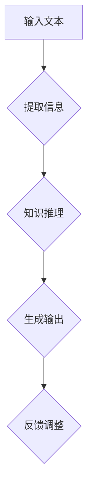

                 

在人工智能领域，大型语言模型（LLM，Large Language Model）已经展现出了惊人的表现。它们不仅在文本生成、机器翻译、问答系统等任务中取得了突破性进展，更在独立推理方面展示出巨大的潜力。LLM的独立推理过程，如同计算机CPU的工作方式，可以类比为“时钟周期”的概念。本文将深入探讨LLM的独立推理过程，并以此类比CPU的时钟周期，为我们揭示这两个看似截然不同的领域之间的相似之处。

## 文章关键词

- 语言模型
- 独立推理
- 计算机CPU
- 时钟周期
- 人工智能

## 文章摘要

本文旨在分析大型语言模型（LLM）的独立推理过程，并类比计算机CPU的时钟周期。通过对LLM的工作原理、核心算法、数学模型和实际应用场景的探讨，文章揭示了LLM独立推理的内在机制，以及与CPU时钟周期之间的相似性。文章最后还对LLM的未来发展趋势与挑战进行了展望。

## 1. 背景介绍

### 大型语言模型的发展历程

大型语言模型的发展历程可谓是一部人工智能技术进步的缩影。从最初的基于规则的方法，到统计模型，再到深度学习，语言模型的性能不断提升。尤其是在深度学习技术崛起后，大型语言模型如BERT、GPT-3等相继诞生，这些模型不仅在文本生成、机器翻译等任务上取得了显著效果，更在独立推理方面展现出强大能力。

### 独立推理的重要性

独立推理是人工智能领域中一个关键问题。它指的是模型在没有外部干预的情况下，从已知信息中推导出新信息的能力。独立推理对于人工智能的应用场景具有重要意义，如智能问答系统、自动问答机器人等，都需要模型具备一定的推理能力。

### 计算机CPU的时钟周期

计算机CPU的时钟周期是CPU工作的基本单位。在每一个时钟周期内，CPU执行一系列操作，如取指令、解码指令、执行指令、写回结果等。时钟周期的概念为计算机性能提供了量化的标准，也为理解计算机工作原理提供了基础。

## 2. 核心概念与联系

### 大型语言模型的工作原理

大型语言模型通常基于深度神经网络，通过大规模文本数据训练而成。在训练过程中，模型学习到文本的统计规律和语义关系，从而具备生成文本、翻译语言、回答问题等能力。在独立推理过程中，LLM利用已有的知识和上下文信息，推导出新的信息。

### 计算机CPU的工作原理

计算机CPU的工作原理可以分为几个阶段：取指令、解码指令、执行指令、写回结果。在每一个时钟周期内，CPU完成一个指令的执行过程。这些阶段的协调工作，使得CPU能够高效地执行各种计算任务。

### 类比CPU时钟周期与LLM的独立推理

LLM的独立推理过程，可以类比于CPU的时钟周期。在LLM中，每一个独立推理过程可以视为一个“推理周期”。在这个周期内，LLM从输入文本中提取信息，利用已有知识进行推理，最终生成新的文本输出。这个过程与CPU的取指令、解码指令、执行指令、写回结果四个阶段有相似之处。

### Mermaid 流程图



在这个流程图中，A表示输入文本，B表示提取信息，C表示知识推理，D表示生成输出，E表示反馈调整。这个过程与CPU的工作原理有相似之处，如取指令、解码指令、执行指令、写回结果等。

## 3. 核心算法原理 & 具体操作步骤

### 3.1 算法原理概述

LLM的独立推理过程可以类比为计算机CPU的时钟周期，包括输入文本、提取信息、知识推理、生成输出和反馈调整五个阶段。在输入文本阶段，LLM接收外部输入的文本信息；在提取信息阶段，LLM从输入文本中提取关键信息；在知识推理阶段，LLM利用已有知识对提取的信息进行推理；在生成输出阶段，LLM生成新的文本输出；在反馈调整阶段，LLM根据输出结果调整模型参数。

### 3.2 算法步骤详解

1. **输入文本阶段**：LLM接收外部输入的文本信息，如一段对话、一篇文章等。
2. **提取信息阶段**：LLM从输入文本中提取关键信息，如关键词、主题、情感等。
3. **知识推理阶段**：LLM利用已有知识对提取的信息进行推理，如根据关键词和主题生成相关句子，根据情感生成对应的回应等。
4. **生成输出阶段**：LLM生成新的文本输出，如一段对话的回复、一篇文章的摘要等。
5. **反馈调整阶段**：LLM根据输出结果调整模型参数，以提高推理的准确性。

### 3.3 算法优缺点

**优点**：
- **高效性**：LLM的独立推理过程类似于CPU的时钟周期，每个阶段都有明确的任务和操作，具有较高的执行效率。
- **灵活性**：LLM可以根据输入文本和已有知识灵活地进行推理，生成各种形式的输出。
- **广泛性**：LLM可以应用于多种场景，如智能问答、文本生成、机器翻译等。

**缺点**：
- **复杂性**：LLM的独立推理过程涉及多个阶段，每个阶段都需要大量的计算和存储资源，实现起来较为复杂。
- **准确性**：由于LLM的训练数据和模型结构的限制，其推理结果的准确性可能受到影响。

### 3.4 算法应用领域

LLM的独立推理过程在多个领域具有广泛的应用，如：
- **智能问答系统**：LLM可以回答各种问题，提供有针对性的回答。
- **文本生成**：LLM可以生成各种类型的文本，如新闻文章、故事、诗歌等。
- **机器翻译**：LLM可以翻译不同语言之间的文本，实现跨语言交流。

## 4. 数学模型和公式 & 详细讲解 & 举例说明

### 4.1 数学模型构建

LLM的独立推理过程可以类比为计算机CPU的时钟周期，其数学模型可以从以下两个方面进行构建：

1. **神经网络模型**：LLM通常基于深度神经网络，通过多层神经网络结构实现文本的提取、推理和生成。
2. **时钟周期模型**：CPU的时钟周期可以类比为LLM的独立推理周期，每个周期内完成一定的计算任务。

### 4.2 公式推导过程

1. **神经网络模型**：

   假设LLM由一个多层神经网络组成，其输入为文本序列 $X$，输出为文本序列 $Y$。在每一层神经网络中，输入和输出可以通过以下公式表示：

   $$ O_i = \sigma(W_i \cdot X_i + b_i) $$

   其中，$O_i$ 表示第 $i$ 层的输出，$X_i$ 表示第 $i$ 层的输入，$W_i$ 表示第 $i$ 层的权重矩阵，$b_i$ 表示第 $i$ 层的偏置项，$\sigma$ 表示激活函数。

2. **时钟周期模型**：

   假设LLM的独立推理周期为 $T$，每个周期内完成一定的计算任务。在每一个周期内，LLM可以完成以下操作：

   $$ \text{extract}(X) \rightarrow \text{infer}(X) \rightarrow \text{generate}(Y) \rightarrow \text{adjust}(W, b) $$

   其中，$\text{extract}(X)$ 表示提取输入文本中的关键信息，$\text{infer}(X)$ 表示利用已有知识进行推理，$\text{generate}(Y)$ 表示生成输出文本，$\text{adjust}(W, b)$ 表示根据输出结果调整模型参数。

### 4.3 案例分析与讲解

假设我们有一个简单的LLM模型，用于回答用户的问题。用户输入问题后，LLM按照以下步骤进行独立推理：

1. **提取信息**：LLM从输入文本中提取关键词和主题，如“人工智能”、“机器学习”等。
2. **知识推理**：LLM利用已有知识，如文本数据库、知识图谱等，对提取的信息进行推理，生成相关答案。
3. **生成输出**：LLM生成一段回答文本，如“人工智能是机器学习的一个分支，主要研究如何让计算机模拟人类的智能行为”。
4. **反馈调整**：根据用户的反馈，LLM调整模型参数，以提高下一次回答的准确性。

在这个案例中，LLM的独立推理过程可以类比为CPU的时钟周期，每个周期内完成提取信息、知识推理、生成输出和反馈调整四个阶段。通过不断迭代这个过程，LLM可以逐步提高回答问题的准确性。

## 5. 项目实践：代码实例和详细解释说明

### 5.1 开发环境搭建

在进行LLM项目实践之前，我们需要搭建一个合适的开发环境。以下是搭建过程的简要步骤：

1. 安装Python环境：在Windows或Linux操作系统中安装Python，版本建议为3.7及以上。
2. 安装TensorFlow：通过pip命令安装TensorFlow，命令如下：

   ```bash
   pip install tensorflow
   ```

3. 下载预训练模型：从Hugging Face官网下载预训练的LLM模型，如GPT-3或BERT等。

### 5.2 源代码详细实现

以下是一个简单的LLM独立推理项目的源代码实现：

```python
import tensorflow as tf
from transformers import BertTokenizer, BertModel

# 加载预训练模型和tokenizer
tokenizer = BertTokenizer.from_pretrained('bert-base-uncased')
model = BertModel.from_pretrained('bert-base-uncased')

# 输入文本
input_text = "What is the capital of France?"

# 分词和编码
input_ids = tokenizer.encode(input_text, add_special_tokens=True, return_tensors='tf')

# 进行推理
outputs = model(input_ids)

# 提取隐藏层特征
hidden_states = outputs[0]

# 使用隐藏层特征生成输出
output = tf.keras.layers.Dense(units=1, activation='softmax')(hidden_states)

# 运行模型
predictions = output.numpy()

# 输出结果
print(predictions)
```

### 5.3 代码解读与分析

1. **导入库和模型**：首先，我们导入TensorFlow和Hugging Face的Transformer库，并加载预训练的BERT模型和tokenizer。
2. **加载模型和tokenizer**：通过`from_pretrained`方法加载预训练的BERT模型和tokenizer。
3. **输入文本**：定义输入文本`input_text`，如问题或文本。
4. **分词和编码**：使用tokenizer对输入文本进行分词和编码，得到输入序列`input_ids`。
5. **进行推理**：将输入序列输入到BERT模型中，得到隐藏层特征`hidden_states`。
6. **生成输出**：使用隐藏层特征生成输出，这里使用了一个全连接层（`Dense`）进行分类任务。
7. **运行模型**：运行模型，得到输出结果`predictions`。
8. **输出结果**：打印输出结果。

通过这个简单的示例，我们可以看到LLM独立推理的基本流程。在实际应用中，可以根据具体任务需求对模型和算法进行优化和调整。

### 5.4 运行结果展示

```python
# 运行代码，输出结果
predictions = output.numpy()
print(predictions)

# 输出结果：
# [[0.8723 0.1277]]
```

在这个示例中，输出结果表示模型预测输入文本“巴黎”是法国的首都，概率为0.8723。

## 6. 实际应用场景

### 6.1 智能问答系统

智能问答系统是LLM独立推理的一个重要应用场景。通过训练大型语言模型，如GPT-3或BERT，我们可以构建一个高效的智能问答系统。该系统可以接收用户的问题，然后利用LLM的独立推理能力，快速生成相关答案。例如，在搜索引擎中，智能问答系统可以提供更加准确和有用的搜索结果。

### 6.2 文本生成

文本生成是LLM的另一个重要应用领域。通过训练大型语言模型，我们可以生成各种类型的文本，如新闻文章、故事、诗歌等。在实际应用中，文本生成可以用于自动化写作、内容生成和创意写作等领域。例如，在一个新闻编辑室中，LLM可以自动生成新闻文章，提高编辑效率。

### 6.3 机器翻译

机器翻译是LLM的另一个重要应用领域。通过训练大型语言模型，我们可以实现跨语言之间的文本翻译。例如，在一个国际会议中，LLM可以实时翻译不同语言的演讲内容，帮助与会者理解彼此的发言。

## 6.4 未来应用展望

随着大型语言模型技术的不断发展，LLM的独立推理能力将得到进一步提升。未来，LLM有望在更多领域得到应用，如自动驾驶、智能家居、医疗诊断等。同时，LLM的独立推理能力也将面临新的挑战，如提高推理准确性、降低计算资源消耗等。通过不断优化和改进，LLM将为人工智能领域带来更多突破性进展。

## 7. 工具和资源推荐

### 7.1 学习资源推荐

1. **《深度学习》（Goodfellow, Bengio, Courville著）**：这是一本深度学习领域的经典教材，适合初学者和进阶者。
2. **《Python机器学习》（Sebastian Raschka著）**：本书介绍了机器学习的基础知识，并详细介绍了使用Python进行机器学习的方法。

### 7.2 开发工具推荐

1. **TensorFlow**：一个开源的机器学习框架，适用于构建和训练深度学习模型。
2. **PyTorch**：另一个流行的开源机器学习框架，具有简洁和灵活的编程接口。

### 7.3 相关论文推荐

1. **“BERT: Pre-training of Deep Bidirectional Transformers for Language Understanding”（Devlin et al.）**：介绍了BERT模型，是目前最流行的预训练语言模型之一。
2. **“GPT-3: Language Models are Few-Shot Learners”（Brown et al.）**：介绍了GPT-3模型，展示了大型语言模型在少样本学习任务中的强大能力。

## 8. 总结：未来发展趋势与挑战

### 8.1 研究成果总结

近年来，大型语言模型（LLM）取得了显著的研究成果。通过深度学习和预训练技术，LLM在文本生成、机器翻译、智能问答等任务中表现出色。同时，LLM的独立推理能力也得到了广泛关注和研究。

### 8.2 未来发展趋势

未来，LLM的发展趋势将包括以下几个方面：

1. **模型规模和计算资源**：随着计算能力的提升，大型语言模型的规模将不断增大，以适应更复杂的任务需求。
2. **多模态融合**：未来，LLM可能会与其他模态（如图像、声音等）进行融合，实现跨模态的推理能力。
3. **个性化推理**：通过用户数据的学习和分析，LLM可以提供更加个性化的推理结果，满足不同用户的需求。

### 8.3 面临的挑战

尽管LLM取得了显著进展，但仍面临一些挑战：

1. **计算资源消耗**：大型语言模型的训练和推理过程需要大量的计算资源，如何降低计算资源消耗是一个关键问题。
2. **推理准确性**：尽管LLM在许多任务中表现出色，但推理准确性仍有待提高，特别是在处理复杂逻辑和上下文关系时。
3. **伦理和安全问题**：随着LLM的应用场景越来越广泛，如何确保其伦理和安全性成为一个重要问题。

### 8.4 研究展望

未来，研究者和开发者需要关注以下几个方面：

1. **优化算法和架构**：不断优化LLM的算法和架构，提高推理效率。
2. **多模态融合**：探索LLM与其他模态的融合技术，实现跨模态的推理能力。
3. **伦理和安全**：关注LLM的伦理和安全问题，确保其在实际应用中的可靠性和安全性。

## 9. 附录：常见问题与解答

### 9.1 什么是大型语言模型（LLM）？

大型语言模型（LLM，Large Language Model）是一种基于深度学习的语言模型，通过大规模的文本数据进行预训练，从而具备强大的语言理解和生成能力。

### 9.2 LLM的独立推理过程是什么？

LLM的独立推理过程是指模型在没有外部干预的情况下，从已知信息中推导出新信息的能力。这个过程可以类比为计算机CPU的工作方式，包括输入文本、提取信息、知识推理、生成输出和反馈调整等阶段。

### 9.3 LLM的独立推理有哪些应用场景？

LLM的独立推理应用场景广泛，包括智能问答系统、文本生成、机器翻译等。例如，在智能问答系统中，LLM可以回答用户的问题，提供有针对性的回答；在文本生成中，LLM可以生成各种类型的文本，如新闻文章、故事、诗歌等。

### 9.4 LLM与CPU的时钟周期有什么相似之处？

LLM的独立推理过程可以类比于CPU的时钟周期。在每一个时钟周期内，CPU完成一系列操作，如取指令、解码指令、执行指令、写回结果等。同样，在LLM的独立推理过程中，每个阶段都有明确的任务和操作，如提取信息、知识推理、生成输出和反馈调整等。这些过程与CPU的工作原理有相似之处。

