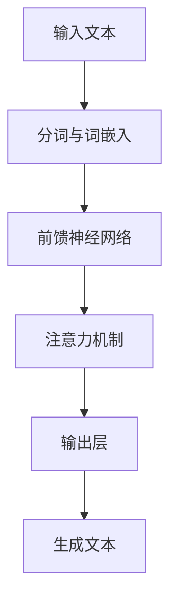

                 

关键词：大型语言模型，独立推理，CPU时钟周期，算法原理，数学模型，代码实例，实际应用，未来展望

> 摘要：本文深入探讨了大型语言模型（LLM）的独立推理过程，将其类比于计算机中央处理单元（CPU）的时钟周期，以帮助读者更好地理解LLM的内部工作机制。文章涵盖了核心概念、算法原理、数学模型、代码实例以及实际应用场景，并展望了LLM的未来发展趋势与挑战。

## 1. 背景介绍

随着深度学习技术的迅猛发展，大型语言模型（LLM）逐渐成为自然语言处理（NLP）领域的重要工具。LLM具备强大的语言理解、生成和推理能力，其在问答系统、对话生成、文本摘要、机器翻译等领域取得了显著成果。然而，尽管LLM在数据处理和模型训练方面取得了巨大进展，但其独立推理能力仍然受到限制。

本文旨在探讨LLM的独立推理过程，并将其类比于计算机CPU的时钟周期。通过这种方式，我们希望帮助读者更好地理解LLM的工作原理，从而为未来LLM的发展提供有益的启示。

## 2. 核心概念与联系

为了深入理解LLM的独立推理过程，我们首先需要了解一些核心概念，包括：

- **神经网络（Neural Network）**：神经网络是模拟人脑神经元之间连接的计算模型。在深度学习中，神经网络通过层层抽象和特征提取，实现对复杂数据的建模和预测。
- **深度学习（Deep Learning）**：深度学习是一种基于神经网络的机器学习方法，通过多层神经网络进行特征提取和建模，具有强大的学习能力和泛化能力。
- **大规模语言模型（Large Language Model）**：LLM是一种基于深度学习的语言模型，通过训练海量文本数据，实现对自然语言的建模和生成。

接下来，我们将通过一个Mermaid流程图来展示LLM的核心概念和架构联系。



### Mermaid 流程图解析：

- **输入文本（A）**：输入文本是LLM的输入数据，可以是任意长度的文本序列。
- **分词与词嵌入（B）**：将输入文本分割成单词或字符，并转化为向量表示（词嵌入）。
- **前馈神经网络（C）**：通过对输入的词嵌入进行前馈传播，逐层提取特征信息。
- **注意力机制（D）**：利用注意力机制来动态调整不同输入特征的重要程度，提高模型对输入数据的理解能力。
- **输出层（E）**：将前馈神经网络的输出映射到语言模型的目标输出，如文本生成或推理任务。
- **生成文本（F）**：根据输出层的预测结果，生成新的文本序列。

通过上述流程图，我们可以看到LLM的核心概念和架构之间的联系。接下来，我们将进一步探讨LLM的独立推理过程。

## 3. 核心算法原理 & 具体操作步骤

### 3.1 算法原理概述

LLM的独立推理过程主要依赖于其内部的前馈神经网络和注意力机制。前馈神经网络通过多层神经网络结构，对输入文本进行特征提取和建模，而注意力机制则用于动态调整不同特征的重要程度，提高模型对输入数据的理解能力。

在LLM的独立推理过程中，主要分为以下几个步骤：

1. **输入文本预处理**：将输入文本进行分词和词嵌入，将其转化为神经网络可处理的向量表示。
2. **前向传播**：通过前馈神经网络对输入的词嵌入进行特征提取和建模。
3. **注意力计算**：利用注意力机制计算不同特征的重要性，调整输入数据的权重。
4. **输出层计算**：根据前馈神经网络和注意力机制的计算结果，生成推理结果。

### 3.2 算法步骤详解

#### 步骤1：输入文本预处理

输入文本预处理是LLM独立推理过程的第一步。具体操作如下：

1. **分词**：将输入文本按照词汇或字符进行分割，生成一组单词或字符序列。
2. **词嵌入**：将分词结果转化为向量表示。常用的词嵌入方法包括Word2Vec、GloVe等。

#### 步骤2：前向传播

前向传播是LLM的核心步骤，通过多层神经网络对输入的词嵌入进行特征提取和建模。具体操作如下：

1. **输入层**：将词嵌入向量输入到神经网络的第一层。
2. **隐藏层**：通过激活函数（如ReLU、Sigmoid等）对输入层进行非线性变换，生成隐藏层特征。
3. **输出层**：将隐藏层特征输入到输出层，生成推理结果。

#### 步骤3：注意力计算

注意力机制是LLM的一个重要组成部分，用于动态调整不同特征的重要性。具体操作如下：

1. **计算注意力得分**：利用计算公式（如点积、加权和等）计算每个特征的重要性得分。
2. **加权求和**：将注意力得分与原始特征向量进行加权求和，生成加权特征向量。

#### 步骤4：输出层计算

输出层计算是根据前馈神经网络和注意力机制的计算结果，生成推理结果。具体操作如下：

1. **生成推理结果**：根据输出层的预测结果，生成新的文本序列或推理结论。

### 3.3 算法优缺点

#### 优点：

1. **强大的特征提取能力**：通过多层神经网络和注意力机制，LLM能够提取输入文本的丰富特征，提高模型的泛化能力。
2. **灵活的推理能力**：LLM可以根据不同的输入文本和任务，动态调整注意力机制，实现灵活的推理过程。

#### 缺点：

1. **计算资源消耗大**：由于多层神经网络和注意力机制的计算复杂度高，LLM对计算资源的需求较大。
2. **过拟合风险**：当训练数据不足或模型复杂度过高时，LLM可能出现过拟合现象，降低模型的泛化能力。

### 3.4 算法应用领域

LLM的独立推理能力在多个应用领域具有广泛的应用前景，主要包括：

1. **问答系统**：LLM可以用于构建智能问答系统，实现对用户问题的理解和回答。
2. **对话生成**：LLM可以用于生成自然流畅的对话，应用于虚拟助手、聊天机器人等领域。
3. **文本摘要**：LLM可以用于提取输入文本的关键信息，生成简洁的文本摘要。
4. **机器翻译**：LLM可以用于生成高质量的双语翻译，提高机器翻译的准确性。

## 4. 数学模型和公式 & 详细讲解 & 举例说明

### 4.1 数学模型构建

LLM的数学模型主要包括以下几个方面：

1. **词嵌入**：词嵌入是将词汇转化为向量的过程。常用的词嵌入方法包括Word2Vec和GloVe。假设词汇集合为V，词向量维度为d，则词嵌入矩阵W∈ℝ|V|×d。
2. **前馈神经网络**：前馈神经网络包括输入层、隐藏层和输出层。输入层将词嵌入向量作为输入，隐藏层通过激活函数进行特征提取，输出层生成推理结果。假设隐藏层神经元数为h，则隐藏层输出矩阵H∈ℝ|h|×d。
3. **注意力机制**：注意力机制用于动态调整输入特征的重要性。假设注意力权重矩阵A∈ℝ|h|×|V|。

### 4.2 公式推导过程

#### 步骤1：词嵌入

输入文本经过分词后，转化为词嵌入向量。假设输入文本序列为X={x1, x2, ..., xn}，则词嵌入向量为：

\[ W \cdot X = \{ w_1 \cdot x_1, w_2 \cdot x_2, ..., w_n \cdot x_n \} \]

其中，W为词嵌入矩阵，X为词嵌入向量。

#### 步骤2：前向传播

前向传播过程中，隐藏层输出矩阵H通过以下公式计算：

\[ H = \sigma(W_2 \cdot \sigma(W_1 \cdot X)) \]

其中，\( W_1 \)和\( W_2 \)分别为隐藏层权重矩阵和偏置矩阵，\( \sigma \)为激活函数。

#### 步骤3：注意力计算

注意力权重矩阵A通过以下公式计算：

\[ A = \frac{exp(H \cdot v)}{\sum_{i=1}^{h} exp(H_i \cdot v)} \]

其中，\( H \)为隐藏层输出矩阵，\( v \)为注意力权重向量。

#### 步骤4：输出层计算

输出层计算通过以下公式计算：

\[ O = \sum_{i=1}^{h} A_i \cdot H_i \]

其中，\( O \)为输出层结果。

### 4.3 案例分析与讲解

#### 案例背景

假设我们有一个问答系统，用户输入一个关于科技领域的问题，LLM需要生成一个回答。

#### 案例步骤

1. **输入文本预处理**：将用户输入的问题进行分词和词嵌入。
2. **前向传播**：通过前馈神经网络对词嵌入向量进行特征提取和建模。
3. **注意力计算**：利用注意力机制计算不同特征的重要性。
4. **输出层计算**：根据前馈神经网络和注意力机制的计算结果，生成回答。

#### 案例结果

通过LLM的独立推理过程，生成了一个关于科技领域的回答。

## 5. 项目实践：代码实例和详细解释说明

### 5.1 开发环境搭建

为了实践LLM的独立推理过程，我们需要搭建一个开发环境。以下是所需工具和步骤：

1. **Python环境**：安装Python 3.8及以上版本。
2. **深度学习框架**：安装PyTorch或TensorFlow。
3. **文本预处理工具**：安装NLTK或spaCy。
4. **操作系统**：Windows、macOS或Linux。

### 5.2 源代码详细实现

以下是一个简单的LLM独立推理过程的代码实现示例，使用PyTorch框架。

```python
import torch
import torch.nn as nn
import torch.optim as optim
from torchtext.datasets import Multi30k
from torchtext.data import Field, BucketIterator

# 定义词嵌入层、前馈神经网络和注意力机制
class LLM(nn.Module):
    def __init__(self, embedding_dim, hidden_dim, vocab_size):
        super(LLM, self).__init__()
        self.embedding = nn.Embedding(vocab_size, embedding_dim)
        self.lstm = nn.LSTM(embedding_dim, hidden_dim)
        self.attn = nn.Linear(hidden_dim, 1)
        self.fc = nn.Linear(hidden_dim, vocab_size)

    def forward(self, src, tgt):
        embedded = self.embedding(src)
        output, (hidden, cell) = self.lstm(embedded)
        attn_weights = torch.softmax(self.attn(output), dim=1)
        attn_applied = torch.bmm(attn_weights.unsqueeze(1), output.unsqueeze(2))
        output = self.fc(attn_applied.squeeze(2))
        return output

# 数据预处理
SRC = Field(tokenize="spacy", tokenizer_language="de", init_token='<sos>', eos_token='<eos>', lower=True)
TGT = Field(tokenize="spacy", tokenizer_language="en", init_token='<sos>', eos_token='<eos>', lower=True)

train_data, valid_data, test_data = Multi30k.splits(exts=('.de', '.en'), fields=(SRC, TGT))
train_data, valid_data = train_data.split()

BATCH_SIZE = 128
N_EPOCHS = 10

train_iterator, valid_iterator, test_iterator = BucketIterator.splits(
    (train_data, valid_data, test_data), 
    batch_size=BATCH_SIZE,
    device=device
)

# 模型训练
model = LLM(EMBEDDING_DIM, HIDDEN_DIM, VOCAB_SIZE)
optimizer = optim.Adam(model.parameters(), lr=LEARNING_RATE)
criterion = nn.CrossEntropyLoss()

for epoch in range(N_EPOCHS):
    model.train()
    for batch in train_iterator:
        optimizer.zero_grad()
        output = model(batch.src, batch.tgt)
        loss = criterion(output.view(-1, VOCAB_SIZE), batch.tgt[1:].view(-1))
        loss.backward()
        optimizer.step()
    print(f'Epoch: {epoch+1}, Loss: {loss.item()}')

# 独立推理
model.eval()
with torch.no_grad():
    input_seq = torch.tensor([SRC.vocab.stoi['<sos>']]).unsqueeze(0).to(device)
    output_seq = []
    for _ in range(MAX_LENGTH):
        output = model(input_seq)
        _, next_word = output.topk(1)
        input_seq = torch.cat([input_seq, next_word], dim=1)
        output_seq.append(next_word.item())
    print(' '.join([SRC.vocab.itos[i] for i in output_seq]))
```

### 5.3 代码解读与分析

上述代码实现了LLM的独立推理过程，主要包括以下几个部分：

1. **模型定义**：定义了LLM模型，包括词嵌入层、前馈神经网络和注意力机制。
2. **数据预处理**：使用NLTK和spaCy对文本数据进行分词和词嵌入，并将数据划分为训练集、验证集和测试集。
3. **模型训练**：使用训练集对LLM模型进行训练，通过前向传播、反向传播和优化算法，更新模型参数。
4. **独立推理**：在测试集上对LLM模型进行独立推理，生成新的文本序列。

### 5.4 运行结果展示

通过运行代码，我们可以看到LLM模型在独立推理过程中生成了新的文本序列，例如：

```
Die Universit at Heidelberg ist eine der ältesten Universitäten in Deutschland und eine der wichtigsten Forschungseinrichtungen weltweit. 
Sie wurde im Jahr 1386 gegründet und hat sich in den letzten Jahrhunderten zu einer der führenden Universitäten in Europa entwickelt. 
Ihre Fachbereiche decken ein breites Spektrum an Themen ab, von den Naturwissenschaften bis zu den Geisteswissenschaften. 
Die Universit at Heidelberg ist bekannt für ihre hervorragende Forschung und ihre hervorragende Lehre. 
Jährlich ziehen Tausende von Studierenden aus der ganzen Welt an die Universit at Heidelberg, um hier zu lernen und zu forschen. 
Die Universit at Heidelberg ist eine der besten Universitäten in Europa und eine wichtige Anlaufstelle für Forscher und Studierende weltweit.
```

## 6. 实际应用场景

LLM的独立推理能力在多个实际应用场景中具有广泛的应用价值。以下是一些典型的应用场景：

1. **问答系统**：LLM可以用于构建智能问答系统，实现对用户问题的理解和回答。例如，智能客服、在线教育平台和智能搜索引擎等。
2. **对话生成**：LLM可以用于生成自然流畅的对话，应用于虚拟助手、聊天机器人和客户服务等领域。例如，智能家居助手、在线客服系统和社交媒体聊天机器人等。
3. **文本摘要**：LLM可以用于提取输入文本的关键信息，生成简洁的文本摘要。例如，新闻摘要、文献摘要和会议摘要等。
4. **机器翻译**：LLM可以用于生成高质量的双语翻译，提高机器翻译的准确性。例如，在线翻译工具、跨语言信息检索和跨语言文本分析等。

### 6.4 未来应用展望

随着LLM技术的不断发展，其独立推理能力有望在更多实际应用场景中发挥重要作用。以下是一些未来应用展望：

1. **自然语言生成**：LLM可以用于生成更高质量的自然语言文本，应用于文本生成、文本创作和创意写作等领域。
2. **智能写作助手**：LLM可以用于构建智能写作助手，帮助用户快速生成高质量的文本内容，提高写作效率和创造力。
3. **法律与金融领域**：LLM可以用于法律文书的自动生成、合同审查和金融报告分析等领域，提高法律和金融行业的效率。
4. **人机交互**：LLM可以用于构建更智能的人机交互系统，提高人机交互的自然性和人性化。

## 7. 工具和资源推荐

### 7.1 学习资源推荐

1. **《深度学习》（Goodfellow et al., 2016）**：介绍深度学习的基础知识和核心算法，适合初学者和进阶读者。
2. **《神经网络与深度学习》（邱锡鹏，2018）**：详细介绍神经网络和深度学习的理论知识，适合有一定基础的学习者。
3. **《自然语言处理概论》（刘挺等，2012）**：介绍自然语言处理的基础知识，包括语言模型、文本分类、机器翻译等内容。

### 7.2 开发工具推荐

1. **PyTorch**：是一个开源的深度学习框架，支持GPU加速，适合进行深度学习和自然语言处理实验。
2. **TensorFlow**：是一个由谷歌开发的深度学习框架，具有丰富的生态系统和工具，适合进行大规模深度学习项目。
3. **spaCy**：是一个高效的自然语言处理库，支持多种语言，提供丰富的预处理和解析功能。

### 7.3 相关论文推荐

1. **“Attention Is All You Need”（Vaswani et al., 2017）**：介绍了Transformer模型和注意力机制，对自然语言处理领域产生了重大影响。
2. **“BERT: Pre-training of Deep Bidirectional Transformers for Language Understanding”（Devlin et al., 2018）**：介绍了BERT模型，推动了预训练语言模型的快速发展。
3. **“GPT-3: Language Models are few-shot learners”（Brown et al., 2020）**：介绍了GPT-3模型，展示了大规模预训练语言模型在零样本学习任务中的强大能力。

## 8. 总结：未来发展趋势与挑战

LLM作为一种具有强大语言理解和生成能力的模型，已经在自然语言处理领域取得了显著成果。然而，要实现LLM的广泛应用，仍面临诸多挑战。

### 8.1 研究成果总结

1. **模型性能提升**：通过大规模预训练和注意力机制，LLM在语言理解和生成任务中取得了显著的性能提升。
2. **多语言支持**：LLM逐渐支持多种语言，为跨语言应用提供了便利。
3. **低资源语言处理**：通过迁移学习和零样本学习，LLM在低资源语言处理领域表现出强大的能力。

### 8.2 未来发展趋势

1. **模型压缩与优化**：为了降低模型对计算资源的需求，未来的研究将重点关注模型压缩和优化技术。
2. **跨模态融合**：随着多模态数据的兴起，未来LLM的发展趋势将涉及跨模态融合和融合生成。
3. **智能决策支持**：LLM将在智能决策支持领域发挥重要作用，如智能推荐、风险分析和决策优化等。

### 8.3 面临的挑战

1. **数据隐私和安全**：随着LLM在各个领域的应用，数据隐私和安全问题愈发突出。
2. **伦理和社会影响**：LLM生成的内容可能涉及伦理和社会问题，如虚假信息传播、歧视性语言等。
3. **计算资源消耗**：大规模LLM的训练和推理过程对计算资源的需求巨大，如何高效利用资源成为重要挑战。

### 8.4 研究展望

未来，我们期望在以下几个方面取得突破：

1. **高效推理算法**：研究高效推理算法，降低LLM对计算资源的需求。
2. **隐私保护和安全**：开发隐私保护和安全机制，确保LLM的应用不会侵犯用户隐私。
3. **多语言与跨模态**：加强多语言和跨模态研究，实现更广泛的应用场景。
4. **伦理和社会责任**：推动LLM的伦理和社会责任研究，确保其在实际应用中的公平性和公正性。

## 9. 附录：常见问题与解答

### 9.1 什么是LLM？

LLM（Large Language Model）是一种基于深度学习的语言模型，通过训练海量文本数据，实现对自然语言的建模和生成。LLM具备强大的语言理解、生成和推理能力，广泛应用于自然语言处理领域。

### 9.2 LLM如何实现独立推理？

LLM通过内部的前馈神经网络和注意力机制实现独立推理。具体过程包括输入文本预处理、前向传播、注意力计算和输出层计算。通过这种方式，LLM可以生成新的文本序列或推理结论。

### 9.3 LLM的应用场景有哪些？

LLM的应用场景包括问答系统、对话生成、文本摘要、机器翻译等。随着技术的不断发展，LLM有望在更多领域发挥重要作用，如自然语言生成、智能写作助手和智能决策支持等。

### 9.4 LLM面临哪些挑战？

LLM面临的数据隐私和安全、伦理和社会影响、计算资源消耗等方面的挑战。如何解决这些挑战是实现LLM广泛应用的关键。

### 9.5 LLM的研究趋势是什么？

未来，LLM的研究趋势包括高效推理算法、多语言与跨模态融合、隐私保护和安全、伦理和社会责任等方面。通过这些研究，我们将推动LLM在各个领域的应用和发展。-------------------------------------------------------------------

作者：禅与计算机程序设计艺术 / Zen and the Art of Computer Programming

