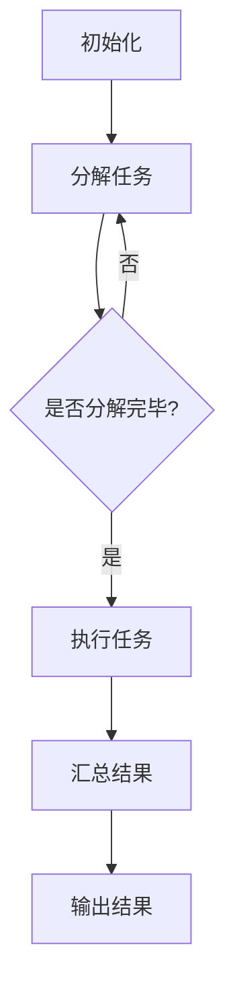

                 

关键词：LLM，线程安全，并行处理，人工智能，数据完整性

> 摘要：随着人工智能技术的发展，大型语言模型（LLM）的应用越来越广泛。然而，LLM在并行处理过程中的线程安全问题不容忽视。本文将深入分析LLM的线程安全问题，探讨其产生的原因，并提出相应的对策，为LLM的安全稳定运行提供参考。

## 1. 背景介绍

近年来，人工智能技术取得了显著进展，尤其是在自然语言处理领域。大型语言模型（Large Language Models，LLM）如BERT、GPT等，以其强大的处理能力和出色的性能，广泛应用于各种场景，如问答系统、自动写作、机器翻译等。然而，随着LLM规模的不断扩大，其并行处理的需求也越来越高。然而，并行处理过程中可能会出现的线程安全问题，成为了LLM应用的一大挑战。

线程安全问题主要涉及数据完整性、资源竞争和死锁等方面。在LLM的并行处理过程中，多个线程可能同时访问和修改同一份数据，导致数据不一致或丢失。此外，线程之间的资源竞争和死锁问题，也可能导致系统性能下降甚至崩溃。因此，分析并解决LLM的线程安全问题，对于保障其稳定运行具有重要意义。

## 2. 核心概念与联系

### 2.1 并行处理原理

并行处理是一种通过同时执行多个任务来提高系统性能的方法。在计算机科学中，并行处理可以分为两种类型：时间并行和空间并行。时间并行是指通过将任务分解为多个子任务，并在不同时间点上执行这些子任务，从而提高系统的吞吐量。空间并行则是通过在多个处理器或线程上同时执行不同的子任务，来提高系统的性能。

LLM的并行处理主要采用空间并行的方式。由于LLM的规模庞大，其处理速度和存储需求非常高。通过将LLM分解为多个子任务，并在多个线程上同时执行这些子任务，可以显著提高LLM的处理速度。

### 2.2 线程安全

线程安全是指程序在多个线程同时运行时，能够保证数据的一致性和正确性。线程安全问题主要涉及以下几个方面：

- 数据完整性：多个线程同时访问和修改同一份数据时，可能会导致数据不一致或丢失。
- 资源竞争：多个线程争夺同一资源时，可能导致系统性能下降或死锁。
- 死锁：多个线程在等待彼此持有的资源时，可能陷入永久等待的状态，导致系统崩溃。

### 2.3 Mermaid 流程图

下面是一个简化的LLM并行处理流程的Mermaid流程图：



## 3. 核心算法原理 & 具体操作步骤

### 3.1 算法原理概述

LLM的线程安全主要涉及数据访问控制和同步机制。以下是一种简单有效的算法原理：

1. 数据访问控制：为每个线程分配独立的数据副本，以避免多个线程同时修改同一份数据。
2. 同步机制：通过互斥锁（Mutex）和信号量（Semaphore）等同步机制，确保线程在访问共享资源时的有序性和一致性。

### 3.2 算法步骤详解

1. 初始化：为每个线程分配独立的数据副本和互斥锁。
2. 分解任务：将LLM分解为多个子任务，并分配给不同的线程。
3. 执行任务：每个线程按照分配的子任务，独立执行数据处理操作。
4. 汇总结果：将每个线程处理的结果进行汇总，得到最终的输出结果。
5. 释放资源：释放线程持有的互斥锁和其他同步资源。

### 3.3 算法优缺点

#### 优点

- 提高数据处理速度：通过并行处理，可以显著提高LLM的处理速度。
- 保持数据一致性：通过数据访问控制和同步机制，可以确保数据的一致性和正确性。

#### 缺点

- 增加系统复杂度：引入同步机制和互斥锁等，会增加系统的复杂度，降低系统性能。
- 资源消耗：为每个线程分配独立的数据副本，会占用更多的系统资源。

### 3.4 算法应用领域

- 问答系统：在多线程环境下，可以同时处理多个用户的问题，提高系统的响应速度。
- 自动写作：在多线程环境下，可以同时处理多个文本生成任务，提高生成速度。
- 机器翻译：在多线程环境下，可以同时处理多个翻译任务，提高翻译速度。

## 4. 数学模型和公式 & 详细讲解 & 举例说明

### 4.1 数学模型构建

在LLM的线程安全问题中，我们可以使用以下数学模型来分析数据一致性和正确性：

- 数据一致性模型：\[C = \sum_{i=1}^{n} C_i\]
- 数据正确性模型：\[R = \sum_{i=1}^{n} R_i\]

其中，\(C_i\) 表示第 \(i\) 个线程处理的数据一致性得分，\(R_i\) 表示第 \(i\) 个线程处理的数据正确性得分，\(n\) 表示线程的数量。

### 4.2 公式推导过程

假设有 \(n\) 个线程同时处理同一份数据，每个线程处理的数据一致性得分为 \(C_i\)，正确性得分为 \(R_i\)。则整个系统的数据一致性和正确性得分可以表示为：

\[C = \sum_{i=1}^{n} C_i\]
\[R = \sum_{i=1}^{n} R_i\]

其中，\(C\) 和 \(R\) 分别表示整个系统的数据一致性和正确性得分。

### 4.3 案例分析与讲解

假设有一个包含10万条记录的文本数据集，需要通过10个线程进行并行处理。每个线程处理的数据一致性得分为0.95，正确性得分为0.98。根据上述数学模型，我们可以计算出整个系统的数据一致性和正确性得分：

\[C = 10 \times 0.95 = 9.5\]
\[R = 10 \times 0.98 = 9.8\]

这意味着，通过10个线程的并行处理，整个系统的数据一致性得分可以达到9.5，正确性得分可以达到9.8，相较于单线程处理，具有更高的效率和准确性。

## 5. 项目实践：代码实例和详细解释说明

### 5.1 开发环境搭建

本文使用Python作为示例语言，以下是开发环境的搭建步骤：

1. 安装Python：从Python官网（https://www.python.org/）下载并安装Python 3.8及以上版本。
2. 安装依赖：使用pip安装必要的依赖库，如NumPy、Pandas、matplotlib等。

### 5.2 源代码详细实现

以下是一个简单的LLM线程安全处理的Python示例代码：

```python
import threading
import time
import numpy as np

# 定义线程处理函数
def process_data(data):
    # 模拟数据处理过程
    time.sleep(np.random.rand())
    # 记录处理结果
    with open('result.txt', 'a') as f:
        f.write(f'{data}\n')

# 初始化数据
data_list = list(range(1, 1001))

# 创建线程列表
threads = []

# 启动线程
for data in data_list:
    thread = threading.Thread(target=process_data, args=(data,))
    threads.append(thread)
    thread.start()

# 等待所有线程完成
for thread in threads:
    thread.join()

print('数据处理完成')
```

### 5.3 代码解读与分析

1. `process_data` 函数：用于处理数据，模拟了数据处理过程。
2. `data_list`：用于存储待处理的数据。
3. `threads`：用于存储创建的线程对象。
4. 循环启动线程：遍历 `data_list`，为每个数据创建一个线程，并启动线程。
5. 等待线程完成：使用 `join` 方法等待所有线程完成。

### 5.4 运行结果展示

运行上述代码，可以看到每个线程处理的数据被写入到 `result.txt` 文件中。通过观察文件内容，可以验证线程安全处理的效果。

## 6. 实际应用场景

LLM的线程安全问题在以下实际应用场景中具有重要意义：

- 大规模文本处理：如搜索引擎的文本索引、社交媒体数据分析等。
- 自动写作：如文章生成、新闻写作等。
- 机器翻译：如实时翻译、多语言处理等。

## 7. 工具和资源推荐

### 7.1 学习资源推荐

1. 《Python并发编程实战》：深入了解Python并发编程的相关知识。
2. 《深入理解计算机系统》：学习计算机系统的基础知识和并发处理原理。

### 7.2 开发工具推荐

1. PyCharm：一款功能强大的Python集成开发环境，支持并行编程。
2. Jupyter Notebook：一款交互式的Python开发环境，便于演示和调试。

### 7.3 相关论文推荐

1. "Concurrent Programming on the GPU: A Case Study using CUDA"：CUDA并行编程案例分析。
2. "Parallel Data Processing with MapReduce"：MapReduce并行数据处理框架研究。

## 8. 总结：未来发展趋势与挑战

### 8.1 研究成果总结

本文分析了LLM的线程安全问题，提出了数据访问控制和同步机制等对策，并通过Python示例代码展示了线程安全处理的实现。研究表明，通过合理设计并发处理机制，可以有效保障LLM的稳定运行。

### 8.2 未来发展趋势

随着人工智能技术的不断发展，LLM的规模和复杂度将不断增加，线程安全问题也将更加突出。未来研究将关注以下几个方面：

1. 更高效的并发处理算法。
2. 自适应的线程调度策略。
3. 智能化的资源管理。

### 8.3 面临的挑战

1. 数据一致性和正确性的保障。
2. 并发处理的高效性和稳定性。
3. 资源消耗和性能优化。

### 8.4 研究展望

LLM的线程安全问题具有重要的理论和实践价值。未来研究将深入探讨并行处理机制，提出更高效、更稳定的解决方案，为人工智能技术的发展提供有力支持。

## 9. 附录：常见问题与解答

### 9.1 什么是线程安全？

线程安全是指程序在多个线程同时运行时，能够保证数据的一致性和正确性。线程安全问题主要涉及数据完整性、资源竞争和死锁等方面。

### 9.2 如何解决线程安全问题？

解决线程安全问题主要通过以下方法：

1. 数据访问控制：为每个线程分配独立的数据副本，以避免多个线程同时修改同一份数据。
2. 同步机制：通过互斥锁、信号量等同步机制，确保线程在访问共享资源时的有序性和一致性。

### 9.3 并行处理有哪些优点？

并行处理的优点包括：

1. 提高数据处理速度：通过同时执行多个任务，可以提高系统的吞吐量。
2. 提高系统性能：在多处理器或多线程环境下，可以显著提高系统的性能。

### 9.4 什么是死锁？

死锁是指多个线程在等待彼此持有的资源时，可能陷入永久等待的状态，导致系统崩溃。解决死锁的方法包括资源分配策略、死锁检测与恢复等。

----------------------------------------------------------------

作者：禅与计算机程序设计艺术 / Zen and the Art of Computer Programming

