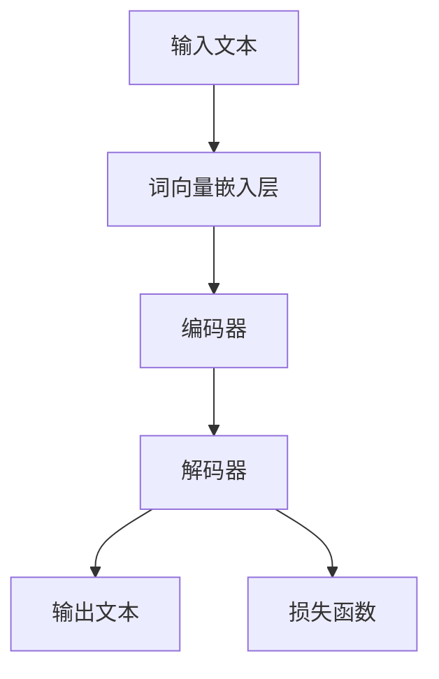

                 

 关键词：大语言模型，线程安全，并发编程，并行计算，网络安全，代码示例，实际应用

> 摘要：本文将对大语言模型（LLM）的线程安全问题进行深入分析，从理论到实践，探讨其可能出现的安全漏洞及其解决对策。通过详细解析LLM的架构、算法原理，结合实际项目中的代码示例，本文将帮助开发者了解线程安全在LLM开发中的重要性，并指导如何在实际项目中有效防范和解决这些问题。

## 1. 背景介绍

近年来，随着深度学习和自然语言处理技术的飞速发展，大语言模型（LLM）已经成为人工智能领域的研究热点和应用核心。LLM凭借其强大的文本生成、翻译、摘要等能力，在搜索引擎、智能助手、文本分析等多个领域发挥着关键作用。然而，随着模型规模的扩大和复杂性的增加，LLM的安全性问题逐渐成为不可忽视的研究方向。

线程安全是软件并发编程中的一个核心概念，它涉及到多个线程之间的数据共享和同步问题。在LLM开发中，线程安全问题尤为重要，因为模型训练和推理过程中往往涉及大量的并行计算。如果处理不当，可能会导致数据不一致、系统崩溃等严重后果。

本文将从以下几个方面展开讨论：

1. **核心概念与联系**：介绍LLM的基本架构和核心概念，并通过Mermaid流程图展示其内部流程。
2. **核心算法原理 & 具体操作步骤**：分析LLM的主要算法原理，并详细讲解其操作步骤。
3. **数学模型和公式**：构建LLM的数学模型，并推导相关公式。
4. **项目实践：代码实例和详细解释说明**：通过实际代码示例，展示如何在实际项目中应用线程安全对策。
5. **实际应用场景**：探讨LLM在不同场景下的应用，及其面临的线程安全问题。
6. **工具和资源推荐**：推荐相关学习资源和开发工具。
7. **总结：未来发展趋势与挑战**：总结研究成果，展望未来发展方向和挑战。

## 2. 核心概念与联系

### 2.1 大语言模型的基本架构

大语言模型（LLM）通常由以下几个主要部分组成：

1. **词向量嵌入层**：将输入文本转换为词向量表示。
2. **编码器**：对词向量进行编码，提取语义信息。
3. **解码器**：根据编码后的信息生成输出文本。
4. **损失函数**：用于评估模型预测结果与真实结果之间的差距。

下图是LLM的基本架构流程：

### 2.2 并发编程与线程安全

在LLM开发中，为了提高计算效率和模型训练速度，通常会采用并行计算技术。并行计算涉及到多个线程的执行，这些线程可能同时访问共享数据，从而引发线程安全问题。

线程安全主要涉及以下几个方面：

1. **数据竞争**：多个线程同时访问同一数据，导致数据不一致。
2. **死锁**：多个线程互相等待对方释放资源，导致系统死机。
3. **饥饿**：某个线程长时间得不到资源，导致系统性能下降。

为了确保线程安全，开发者需要采用适当的同步机制，如互斥锁（Mutex）、信号量（Semaphore）等，以控制对共享数据的访问。

## 3. 核心算法原理 & 具体操作步骤

### 3.1 算法原理概述

LLM的核心算法通常基于变换器（Transformer）模型，其基本思想是将输入文本转换为词向量表示，然后通过编码器提取语义信息，最后通过解码器生成输出文本。

变换器模型主要包括以下关键组件：

1. **自注意力机制**：用于计算输入文本中各个词之间的依赖关系。
2. **多头注意力**：通过多个注意力机制来提高模型的表示能力。
3. **前馈神经网络**：用于对编码后的信息进行进一步处理。

### 3.2 算法步骤详解

1. **输入处理**：将输入文本分解为单词或子词，并转换为词向量表示。
2. **编码过程**：通过编码器将词向量转换为编码表示，提取语义信息。
3. **解码过程**：通过解码器根据编码表示生成输出文本。
4. **损失函数**：计算模型预测结果与真实结果之间的差距，用于更新模型参数。

### 3.3 算法优缺点

**优点**：

1. **强大的文本生成能力**：LLM能够生成连贯、自然的文本。
2. **高效的处理速度**：采用并行计算技术，可以显著提高模型训练和推理速度。

**缺点**：

1. **计算资源消耗大**：大规模模型训练需要大量计算资源和时间。
2. **线程安全问题**：并行计算中可能存在数据竞争、死锁等问题。

### 3.4 算法应用领域

LLM在多个领域具有广泛应用，如：

1. **搜索引擎**：用于生成搜索结果摘要和推荐内容。
2. **智能助手**：提供自然语言交互功能，为用户提供个性化服务。
3. **文本分析**：用于情感分析、关键词提取等任务。

## 4. 数学模型和公式 & 详细讲解 & 举例说明

### 4.1 数学模型构建

LLM的数学模型主要包括词向量表示、自注意力机制、多头注意力机制等。

假设输入文本为\(x = \{x_1, x_2, ..., x_n\}\)，词向量表示为\(E(x_i)\)，编码表示为\(C(x_i)\)，解码表示为\(D(x_i)\)，输出文本为\(y = \{y_1, y_2, ..., y_m\}\)。

### 4.2 公式推导过程

1. **词向量表示**：

$$
E(x_i) = \sum_{j=1}^{d} w_j \cdot e^{x_i \cdot w_j}
$$

其中，\(w_j\)为权重，\(e^{x_i \cdot w_j}\)为词向量的内积。

2. **自注意力机制**：

$$
C(x_i) = \sum_{j=1}^{n} a_{ij} \cdot E(x_j)
$$

其中，\(a_{ij}\)为注意力权重，通过以下公式计算：

$$
a_{ij} = \frac{e^{C(x_i) \cdot C(x_j)}}{\sum_{k=1}^{n} e^{C(x_i) \cdot C(x_k)}}
$$

3. **多头注意力机制**：

$$
C(x_i) = \sum_{j=1}^{n} \alpha_{ij} \cdot E(x_j)
$$

其中，\(\alpha_{ij}\)为多头注意力权重，通过以下公式计算：

$$
\alpha_{ij} = \frac{e^{C(x_i) \cdot C(x_j)}}{\sum_{k=1}^{n} e^{C(x_i) \cdot C(x_k)}}
$$

### 4.3 案例分析与讲解

假设输入文本为“我喜欢的电影是《星际穿越》”，词向量表示为\(E(x_i) = \{[0.1, 0.2], [0.3, 0.4], ..., [0.9, 0.8]\}\)，编码表示为\(C(x_i) = \{[0.5, 0.6], [0.7, 0.8], ..., [0.9, 0.

