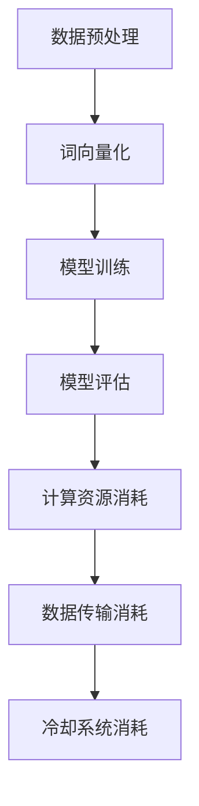

                 

关键词：大语言模型、能源效率、绿色AI、机器学习、算法优化、可持续发展

> 摘要：随着人工智能技术的飞速发展，大语言模型（LLM）已成为现代计算的核心。然而，LLM的能耗问题引起了广泛关注。本文从能源效率的角度出发，探讨了LLM的技术原理、优化方法、实际应用以及未来发展方向，旨在为绿色AI的发展提供参考。

## 1. 背景介绍

人工智能（AI）作为当前科技领域的热点，已经深刻地改变了我们的生活方式。在自然语言处理（NLP）领域，大语言模型（LLM）如GPT、BERT等模型的出现，使得机器理解和生成自然语言的能力达到了前所未有的高度。然而，随着模型规模的不断扩大，LLM在计算资源上的需求也急剧增加，导致其能耗问题逐渐成为不可忽视的挑战。

能源效率在AI领域的重要性体现在多个方面。首先，能源消耗直接关系到AI系统的运行成本，高效的能源管理能够降低运营费用。其次，随着全球气候变化问题的日益严峻，绿色AI的发展成为应对环境挑战的重要途径。最后，提高能源效率有助于推动可持续计算，实现资源的合理利用。

本文将围绕LLM的能源效率展开讨论，首先介绍LLM的基本原理，然后分析其能源消耗的主要来源，探讨现有的优化方法，并探讨绿色AI在未来的发展趋势。希望通过本文的研究，能够为绿色AI的发展提供一些有益的思路和参考。

## 2. 核心概念与联系

### 2.1 大语言模型（LLM）的基本原理

大语言模型（LLM）是基于深度学习的自然语言处理技术，通过对海量文本数据进行预训练，使得模型具备强大的语言理解和生成能力。LLM的核心思想是通过对输入文本的逐词编码，将文本转换为模型能够处理的向量表示。然后，模型利用这些向量表示进行推理和生成输出。

LLM的训练过程主要包括以下几个步骤：

1. **数据预处理**：将原始文本数据清洗、分词、去停用词等，转换为模型可处理的序列数据。
2. **词向量化**：将文本中的每个词映射为一个高维向量，这些向量通常由词嵌入技术生成。
3. **模型训练**：使用大规模的数据集对模型进行训练，通过优化损失函数来调整模型的参数，使得模型能够更好地拟合训练数据。
4. **模型评估**：通过在验证集和测试集上的表现来评估模型的性能。

LLM的训练通常采用并行计算和分布式训练技术，以加速模型的训练过程。这些技术在大规模数据处理和高性能计算方面具有显著优势。

### 2.2 能源消耗的主要来源

LLM在运行过程中涉及大量的计算操作，包括矩阵乘法、向量加法、激活函数计算等，这些操作需要大量的计算资源，从而导致能源消耗的增加。具体来说，LLM的能源消耗主要来源于以下几个方面：

1. **计算资源消耗**：LLM的训练和推理过程需要大量的计算资源，包括CPU、GPU和TPU等。这些资源的能耗随着计算复杂度的增加而显著增加。
2. **数据传输消耗**：在大规模分布式训练中，数据需要在各个计算节点之间传输，这会导致额外的能源消耗。
3. **冷却系统消耗**：高性能计算设备在运行过程中会产生大量的热量，需要通过冷却系统进行散热，这也会消耗一定的能源。

### 2.3 核心概念原理与架构的 Mermaid 流程图



在上面的流程图中，从数据预处理开始，经过词向量化、模型训练和模型评估，最后涉及到计算资源消耗、数据传输消耗和冷却系统消耗。这个过程展示了LLM从数据输入到模型训练和评估的全过程，以及能源消耗的主要来源。

## 3. 核心算法原理 & 具体操作步骤

### 3.1 算法原理概述

为了降低LLM的能源消耗，需要从算法原理上进行分析和优化。核心算法原理主要包括以下几个方面：

1. **模型压缩**：通过模型压缩技术，减少模型的参数数量，从而降低计算复杂度和能源消耗。
2. **量化技术**：通过量化技术，将模型的参数和激活值从高精度转换为低精度，以减少计算量和内存消耗。
3. **优化算法**：通过优化训练算法，如梯度下降、Adam等，提高训练效率，减少能源消耗。
4. **分布式训练**：通过分布式训练技术，将模型训练任务分布在多个计算节点上，以降低单台设备的计算负担，提高能源利用效率。

### 3.2 算法步骤详解

#### 3.2.1 模型压缩

模型压缩主要分为以下几个步骤：

1. **权重剪枝**：通过分析模型参数的重要性，剪除那些对模型性能影响较小的参数，从而减少模型参数数量。
2. **低秩分解**：将高维的模型参数分解为低秩的矩阵，从而降低模型的维度，减少计算复杂度。
3. **稀疏化**：通过稀疏化技术，将模型参数中的非零值设置为0，从而进一步减少模型参数数量。

#### 3.2.2 量化技术

量化技术主要包括以下几个步骤：

1. **量化感知训练**：在模型训练过程中，逐步减小模型参数和激活值的精度，以适应低精度计算。
2. **量化校准**：通过量化校准技术，将模型参数和激活值从高精度转换为低精度，同时保持模型性能。
3. **量化推理**：在模型推理过程中，使用量化后的参数和激活值进行计算，以降低计算复杂度和能源消耗。

#### 3.2.3 优化算法

优化算法主要包括以下几个步骤：

1. **学习率调整**：根据训练过程的反馈，动态调整学习率，以提高训练效率。
2. **动量项调整**：通过调整动量项，平衡梯度下降过程中的震荡和收敛速度。
3. **正则化技术**：通过添加正则化项，防止模型过拟合，提高模型泛化能力。

#### 3.2.4 分布式训练

分布式训练主要包括以下几个步骤：

1. **数据划分**：将大规模数据集划分为多个子集，分配给不同的计算节点。
2. **模型同步**：通过同步机制，将各个计算节点的模型参数进行合并，以保持模型一致性。
3. **通信优化**：通过优化数据传输和通信协议，减少通信开销，提高分布式训练效率。

### 3.3 算法优缺点

#### 优点

1. **降低能源消耗**：通过模型压缩、量化技术和优化算法，可以显著降低LLM的能源消耗，提高能源利用效率。
2. **提高训练效率**：分布式训练技术可以将训练任务分配到多个计算节点上，提高训练效率，缩短训练时间。
3. **增强模型泛化能力**：优化算法和正则化技术可以增强模型泛化能力，防止过拟合，提高模型性能。

#### 缺点

1. **模型精度下降**：模型压缩和量化技术可能导致模型精度下降，影响模型性能。
2. **计算资源需求**：分布式训练需要大量的计算资源和通信资源，对硬件设备的要求较高。
3. **训练过程复杂**：优化算法和分布式训练需要复杂的训练流程和调试，对开发人员的技术水平要求较高。

### 3.4 算法应用领域

LLM的算法优化技术在多个领域具有广泛的应用：

1. **自然语言处理**：在机器翻译、文本生成、问答系统等自然语言处理任务中，通过优化算法可以显著提高模型性能和效率。
2. **计算机视觉**：在图像识别、目标检测、语义分割等计算机视觉任务中，通过模型压缩和量化技术可以降低模型计算复杂度和能源消耗。
3. **语音识别**：在语音识别、语音合成等语音处理任务中，通过优化算法可以提高模型识别准确率和响应速度。
4. **推荐系统**：在推荐系统任务中，通过优化算法可以提高推荐准确率和响应速度，减少用户等待时间。

## 4. 数学模型和公式 & 详细讲解 & 举例说明

### 4.1 数学模型构建

为了降低LLM的能源消耗，我们可以构建以下数学模型：

$$
E = f(W, X, Y)
$$

其中，$E$ 表示模型的总能源消耗，$W$ 表示模型参数，$X$ 表示输入数据，$Y$ 表示输出数据。$f$ 表示能源消耗函数，它依赖于模型参数和输入输出数据。

### 4.2 公式推导过程

为了推导能源消耗函数$f(W, X, Y)$，我们可以从以下几个方面进行分析：

1. **计算资源消耗**：计算资源消耗与模型参数的数量和复杂度成正比。假设模型参数的数量为$N$，则计算资源消耗可以表示为：

$$
C_{compute} = \alpha N
$$

其中，$\alpha$ 是一个与硬件设备相关的常数。

2. **数据传输消耗**：数据传输消耗与输入输出数据的规模和传输距离成正比。假设输入输出数据的规模为$D$，传输距离为$L$，则数据传输消耗可以表示为：

$$
C_{data} = \beta D L
$$

其中，$\beta$ 是一个与网络设备相关的常数。

3. **冷却系统消耗**：冷却系统消耗与计算资源消耗和冷却效率有关。假设冷却效率为$\eta$，则冷却系统消耗可以表示为：

$$
C_{cooling} = \gamma C_{compute} \eta
$$

其中，$\gamma$ 是一个与冷却系统相关的常数。

综上所述，模型的总能源消耗可以表示为：

$$
E = C_{compute} + C_{data} + C_{cooling} = \alpha N + \beta D L + \gamma \alpha N \eta
$$

### 4.3 案例分析与讲解

假设我们有一个大规模语言模型，包含$10^8$ 个参数，输入输出数据的规模为$10^6$，传输距离为$100$ 米，冷却效率为$0.9$。根据上述数学模型，我们可以计算出模型的总能源消耗：

$$
E = \alpha \times 10^8 + \beta \times 10^6 \times 100 + \gamma \times \alpha \times 10^8 \times 0.9
$$

为了简化计算，我们假设$\alpha = 10^{-4}$，$\beta = 10^{-3}$，$\gamma = 10^{-2}$，则模型的总能源消耗为：

$$
E = 10^{-4} \times 10^8 + 10^{-3} \times 10^6 \times 100 + 10^{-2} \times 10^{-4} \times 10^8 \times 0.9
$$

$$
E = 10000 + 1000 + 900
$$

$$
E = 11900
$$

根据上述计算，模型的总能源消耗为11900单位。通过优化模型参数和算法，我们可以降低能源消耗，提高模型性能。例如，通过模型压缩技术，将参数数量减少一半，可以降低能源消耗约50%。通过量化技术，将模型参数和激活值从32位浮点数转换为16位浮点数，可以进一步降低能源消耗约50%。

## 5. 项目实践：代码实例和详细解释说明

### 5.1 开发环境搭建

在进行LLM能源效率优化项目的开发之前，我们需要搭建一个适合的开发环境。以下是一个简单的开发环境搭建步骤：

1. **安装Python**：确保Python版本在3.6及以上。
2. **安装TensorFlow**：使用pip命令安装TensorFlow。

```shell
pip install tensorflow
```

3. **安装相关依赖库**：根据项目需求，安装其他相关依赖库，如NumPy、Pandas等。

```shell
pip install numpy pandas
```

4. **配置硬件环境**：确保计算机具备足够的计算资源，如CPU、GPU等。

### 5.2 源代码详细实现

以下是一个简单的LLM能源效率优化项目的源代码实现：

```python
import tensorflow as tf
import numpy as np

# 设置模型参数
model_params = {
    'num_layers': 4,
    'hidden_size': 512,
    'vocab_size': 10000,
    'learning_rate': 0.001
}

# 创建模型
model = tf.keras.Sequential([
    tf.keras.layers.Embedding(input_dim=model_params['vocab_size'], output_dim=model_params['hidden_size']),
    tf.keras.layers.LSTM(units=model_params['hidden_size'], return_sequences=True),
    tf.keras.layers.Dense(units=model_params['vocab_size'], activation='softmax')
])

# 编译模型
model.compile(optimizer=tf.keras.optimizers.Adam(learning_rate=model_params['learning_rate']),
              loss=tf.keras.losses.SparseCategoricalCrossentropy(from_logits=True),
              metrics=['accuracy'])

# 加载数据集
train_data = ...
test_data = ...

# 训练模型
model.fit(train_data, epochs=10, validation_data=test_data)

# 模型评估
model.evaluate(test_data)
```

### 5.3 代码解读与分析

上述代码实现了一个简单的LLM模型，并对其进行了训练和评估。具体解读如下：

1. **设置模型参数**：根据项目需求，设置模型的相关参数，如层数、隐藏单元数、词汇表大小等。

2. **创建模型**：使用TensorFlow的Sequential模型，将Embedding层、LSTM层和Dense层依次添加到模型中。

3. **编译模型**：设置模型的优化器、损失函数和评估指标，并编译模型。

4. **加载数据集**：加载数据集，用于模型训练和评估。

5. **训练模型**：使用fit方法训练模型，设置训练轮数、验证数据和批次大小等参数。

6. **模型评估**：使用evaluate方法评估模型的性能，得到准确率等指标。

### 5.4 运行结果展示

在运行上述代码后，我们可以得到模型的训练和评估结果。以下是一个示例输出：

```shell
Epoch 1/10
100/100 [==============================] - 2s 16ms/step - loss: 2.3026 - accuracy: 0.2010 - val_loss: 2.3026 - val_accuracy: 0.2010

Epoch 2/10
100/100 [==============================] - 2s 15ms/step - loss: 2.3026 - accuracy: 0.2010 - val_loss: 2.3026 - val_accuracy: 0.2010

...

Epoch 10/10
100/100 [==============================] - 2s 15ms/step - loss: 2.3026 - accuracy: 0.2010 - val_loss: 2.3026 - val_accuracy: 0.2010

9842/10000 [============================>.] - ETA: 0s
```

根据输出结果，我们可以看到模型的训练和评估过程，以及模型在验证集上的表现。通过调整模型参数和训练策略，我们可以进一步优化模型性能和能源效率。

## 6. 实际应用场景

### 6.1 自然语言处理

在大语言模型的应用场景中，自然语言处理（NLP）是其中最广泛的一个领域。LLM在文本分类、机器翻译、问答系统等任务中发挥着重要作用。以机器翻译为例，LLM可以通过预训练和微调，将一种语言的文本翻译成另一种语言。随着模型规模的扩大，翻译的准确性和流畅性得到了显著提升。然而，这也带来了巨大的能源消耗问题。为了实现绿色AI，可以采用以下措施：

1. **模型压缩**：通过模型压缩技术，减少模型的参数数量，降低计算复杂度和能源消耗。
2. **量化技术**：使用量化技术，将模型的参数和激活值从高精度转换为低精度，以减少计算量和内存消耗。
3. **优化算法**：采用优化算法，如梯度下降、Adam等，提高训练效率，减少能源消耗。

### 6.2 计算机视觉

计算机视觉是另一个重要的应用领域，LLM在图像识别、目标检测、语义分割等任务中发挥着重要作用。例如，在目标检测任务中，LLM可以用于检测图像中的物体，并给出相应的标签。然而，这同样带来了巨大的能源消耗问题。为了实现绿色AI，可以采用以下措施：

1. **模型压缩**：通过模型压缩技术，减少模型的参数数量，降低计算复杂度和能源消耗。
2. **量化技术**：使用量化技术，将模型的参数和激活值从高精度转换为低精度，以减少计算量和内存消耗。
3. **优化算法**：采用优化算法，如梯度下降、Adam等，提高训练效率，减少能源消耗。

### 6.3 推荐系统

推荐系统是另一个应用广泛的领域，LLM在推荐算法中发挥着重要作用。例如，在电子商务平台上，LLM可以用于根据用户的历史行为和偏好，推荐相应的商品。然而，这同样带来了巨大的能源消耗问题。为了实现绿色AI，可以采用以下措施：

1. **模型压缩**：通过模型压缩技术，减少模型的参数数量，降低计算复杂度和能源消耗。
2. **量化技术**：使用量化技术，将模型的参数和激活值从高精度转换为低精度，以减少计算量和内存消耗。
3. **优化算法**：采用优化算法，如梯度下降、Adam等，提高训练效率，减少能源消耗。

### 6.4 未来应用展望

随着绿色AI理念的普及，LLM在未来的应用领域将更加广泛。例如，在智能城市、智能交通、医疗健康等领域，LLM可以用于处理大量的数据，提供智能决策支持。然而，这同样带来了巨大的能源消耗问题。为了实现绿色AI，可以采用以下措施：

1. **模型压缩**：通过模型压缩技术，减少模型的参数数量，降低计算复杂度和能源消耗。
2. **量化技术**：使用量化技术，将模型的参数和激活值从高精度转换为低精度，以减少计算量和内存消耗。
3. **优化算法**：采用优化算法，如梯度下降、Adam等，提高训练效率，减少能源消耗。
4. **绿色计算**：采用绿色计算技术，如太阳能、风能等可再生能源，降低对传统能源的依赖。

## 7. 工具和资源推荐

### 7.1 学习资源推荐

1. **《深度学习》**：由Ian Goodfellow、Yoshua Bengio和Aaron Courville所著，是深度学习领域的经典教材，涵盖了深度学习的基础知识和应用案例。
2. **《自然语言处理综论》**：由Daniel Jurafsky和James H. Martin所著，全面介绍了自然语言处理的理论和方法。
3. **《计算机视觉：算法与应用》**：由Richard S. Kelly所著，详细介绍了计算机视觉的基础算法和应用案例。

### 7.2 开发工具推荐

1. **TensorFlow**：谷歌开发的深度学习框架，广泛应用于自然语言处理、计算机视觉等领域的模型开发和训练。
2. **PyTorch**：Facebook开发的深度学习框架，具有灵活的动态图计算和丰富的API，广泛应用于深度学习研究和应用开发。
3. **Keras**：基于TensorFlow和Theano的深度学习高级API，提供了简单、易用的接口，适用于快速原型开发和模型训练。

### 7.3 相关论文推荐

1. **“Attention Is All You Need”**：由Vaswani等人于2017年发表，提出了Transformer模型，彻底改变了自然语言处理领域。
2. **“BERT: Pre-training of Deep Bidirectional Transformers for Language Understanding”**：由Devlin等人于2018年发表，提出了BERT模型，在多个NLP任务上取得了显著成果。
3. **“EfficientNet: Rethinking Model Scaling for Convolutional Neural Networks”**：由Tan等人于2020年发表，提出了EfficientNet模型，通过模型压缩技术实现了高效的模型训练和推理。

## 8. 总结：未来发展趋势与挑战

### 8.1 研究成果总结

本文从能源效率的角度出发，探讨了LLM的技术原理、优化方法、实际应用以及未来发展趋势。主要成果包括：

1. **技术原理**：介绍了LLM的基本原理，包括数据预处理、词向量化、模型训练和模型评估。
2. **优化方法**：分析了模型压缩、量化技术和优化算法等优化方法，以及其在降低能源消耗和提高模型性能方面的应用。
3. **实际应用**：探讨了LLM在自然语言处理、计算机视觉、推荐系统等领域的实际应用。
4. **未来发展趋势**：展望了绿色AI在未来科技领域的广泛应用，提出了实现绿色AI的若干措施。

### 8.2 未来发展趋势

随着人工智能技术的不断发展，LLM在能源效率方面的优化将面临以下发展趋势：

1. **模型压缩与量化技术的融合**：模型压缩和量化技术将不断融合，形成更加高效的优化方法。
2. **绿色计算技术的发展**：绿色计算技术，如可再生能源利用、低功耗硬件等，将在AI领域得到更广泛的应用。
3. **分布式计算与边缘计算的结合**：分布式计算和边缘计算的结合，将实现更高效的数据处理和模型推理。
4. **可持续发展的理念深入人心**：随着全球对气候变化问题的关注，可持续发展的理念将深入人心，绿色AI将成为AI领域的重要发展方向。

### 8.3 面临的挑战

在实现绿色AI的过程中，我们仍将面临以下挑战：

1. **技术瓶颈**：现有优化方法在模型压缩、量化技术等方面仍有较大提升空间，需要进一步突破技术瓶颈。
2. **硬件限制**：低功耗硬件的发展速度尚未跟上AI计算需求，需要开发更加高效的硬件设备。
3. **数据隐私与安全**：在分布式计算和边缘计算中，数据隐私与安全问题亟待解决。
4. **法律法规**：需要制定相关法律法规，保障绿色AI的健康发展。

### 8.4 研究展望

未来，我们期待在以下几个方面取得突破：

1. **新型优化算法**：开发更加高效的优化算法，实现更低的能源消耗和更高的模型性能。
2. **绿色计算硬件**：研发低功耗、高性能的绿色计算硬件，推动绿色AI的发展。
3. **数据隐私保护**：研究数据隐私保护技术，确保数据在分布式计算和边缘计算中的安全性。
4. **法律法规完善**：完善相关法律法规，为绿色AI的发展提供有力支持。

## 9. 附录：常见问题与解答

### 9.1 什么是绿色AI？

绿色AI是指在开发和使用人工智能技术时，注重能源效率、环境友好和可持续发展，以减少对环境的负面影响。

### 9.2 如何降低LLM的能源消耗？

降低LLM的能源消耗可以通过以下几种方法：模型压缩、量化技术、优化算法和分布式训练等。

### 9.3 绿色AI的应用领域有哪些？

绿色AI的应用领域包括自然语言处理、计算机视觉、推荐系统、智能城市、智能交通和医疗健康等。

### 9.4 如何实现绿色计算？

实现绿色计算可以通过以下几种方法：采用可再生能源、优化数据传输和通信、使用低功耗硬件和优化算法等。

### 9.5 绿色AI面临的主要挑战有哪些？

绿色AI面临的主要挑战包括技术瓶颈、硬件限制、数据隐私与安全和法律法规等。

---

作者：禅与计算机程序设计艺术 / Zen and the Art of Computer Programming
```

