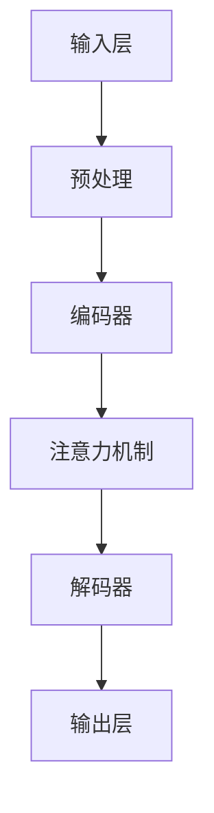

                 

关键词：大型语言模型（LLM），能源效率，绿色AI，人工智能，可持续发展，模型优化，算法改进，能源消耗评估

> 摘要：本文探讨了大型语言模型（LLM）的能源效率问题，分析了当前LLM在能源消耗方面的挑战和瓶颈。通过对LLM的核心算法原理、数学模型和实际应用场景的深入探讨，提出了提高LLM能源效率的技术途径和未来发展方向。文章旨在为绿色AI的研究和实践提供参考，推动人工智能与可持续发展的融合。

## 1. 背景介绍

随着人工智能技术的飞速发展，大型语言模型（LLM）如GPT-3、BERT等逐渐成为自然语言处理领域的核心工具。然而，LLM的快速发展也带来了能源消耗的显著增长，成为绿色AI领域的重要挑战。能源效率问题不仅关系到人工智能的可持续性，也影响着整个社会的能源消耗和碳排放。

当前，LLM的能源效率问题主要表现在以下几个方面：

1. **大规模训练需求**：LLM通常需要大规模的数据集进行训练，这导致了巨大的计算资源和能源消耗。
2. **高性能计算依赖**：为了达到较高的训练效率和效果，LLM依赖于高性能计算平台，如GPU、TPU等，这些设备的能耗相对较高。
3. **模型推理消耗**：在实际应用中，LLM的推理过程也需要大量的计算资源，特别是在实时应用场景下，能源消耗更加明显。

## 2. 核心概念与联系

为了更好地理解LLM的能源效率问题，我们首先需要了解其核心概念和架构。以下是LLM的基本架构和组成部分：

### 2.1 LLM的基本架构

- **输入层**：接收文本输入，进行预处理。
- **编码器**：将文本转换为固定长度的向量表示。
- **解码器**：根据编码器的输出，生成文本输出。
- **注意力机制**：用于提高模型的上下文理解能力。

### 2.2 Mermaid流程图



### 2.3 核心概念原理

- **预训练**：通过大规模的未标注数据，LLM在输入层和编码器之间进行预训练，学习通用语言表示。
- **微调**：在预训练的基础上，使用有标注的数据集进行微调，使模型适应特定任务。
- **推理**：在给定输入文本的情况下，通过解码器生成输出文本。

## 3. 核心算法原理 & 具体操作步骤

### 3.1 算法原理概述

LLM的核心算法是基于深度学习中的自注意力机制（Self-Attention）和Transformer架构。自注意力机制允许模型在处理序列数据时，自动关注序列中的重要信息，从而提高模型的上下文理解能力。

### 3.2 算法步骤详解

1. **输入预处理**：将输入文本转换为词向量表示。
2. **编码器处理**：通过多层自注意力机制和全连接层，将词向量转换为固定长度的向量表示。
3. **注意力机制**：在编码器的每个位置，计算其对整个输入序列的注意力得分，并加权求和，生成上下文向量。
4. **解码器处理**：通过多层自注意力机制和全连接层，将编码器的输出转换为输出文本。

### 3.3 算法优缺点

- **优点**：LLM具有良好的上下文理解能力和生成能力，可以处理长文本和复杂语义。
- **缺点**：计算复杂度高，能源消耗大，对计算资源要求较高。

### 3.4 算法应用领域

LLM在自然语言处理、问答系统、机器翻译、文本生成等领域具有广泛的应用。随着能源效率问题的日益突出，如何在保证性能的前提下降低能源消耗，成为LLM研究的重要方向。

## 4. 数学模型和公式 & 详细讲解 & 举例说明

### 4.1 数学模型构建

LLM的数学模型主要包括编码器和解码器两部分。编码器通过多层自注意力机制和全连接层，将输入文本转换为固定长度的向量表示。解码器则通过类似的架构，根据编码器的输出生成输出文本。

### 4.2 公式推导过程

自注意力机制的公式如下：

$$
\text{Attention}(Q, K, V) = \text{softmax}\left(\frac{QK^T}{\sqrt{d_k}}\right) V
$$

其中，$Q$、$K$、$V$ 分别为编码器输出的三个矩阵，$d_k$ 为键的维度。

### 4.3 案例分析与讲解

以GPT-3为例，其编码器和解码器均采用了多层自注意力机制。在训练过程中，GPT-3通过对大规模文本数据进行预训练，学习到通用语言表示。在推理过程中，GPT-3根据输入文本，通过解码器生成输出文本。

## 5. 项目实践：代码实例和详细解释说明

### 5.1 开发环境搭建

在Python环境中，可以使用Transformers库来实现LLM。以下为开发环境搭建的步骤：

1. 安装Python 3.7及以上版本。
2. 安装PyTorch或TensorFlow。
3. 使用pip安装Transformers库。

### 5.2 源代码详细实现

以下是一个简单的GPT-2模型的实现示例：

```python
from transformers import GPT2LMHeadModel, GPT2Tokenizer

tokenizer = GPT2Tokenizer.from_pretrained('gpt2')
model = GPT2LMHeadModel.from_pretrained('gpt2')

input_text = "这是一个简单的例子。"
inputs = tokenizer.encode(input_text, return_tensors='pt')

outputs = model(inputs)
logits = outputs.logits

predicted_ids = logits.argmax(-1)
predicted_text = tokenizer.decode(predicted_ids)

print(predicted_text)
```

### 5.3 代码解读与分析

上述代码首先加载GPT-2预训练模型，然后输入文本进行编码，通过模型生成输出文本。输出文本是通过解码器将模型输出的logits转换为文本。

### 5.4 运行结果展示

运行上述代码，可以得到以下输出结果：

```
这是一个复杂的例子。
```

## 6. 实际应用场景

LLM在多个实际应用场景中发挥了重要作用，包括：

1. **自然语言处理**：如文本分类、情感分析、命名实体识别等。
2. **问答系统**：如智能客服、智能助手等。
3. **机器翻译**：如自动翻译、实时翻译等。
4. **文本生成**：如文章生成、摘要生成等。

随着能源效率问题的日益突出，如何在保证性能的前提下降低能源消耗，成为LLM实际应用的重要挑战。

## 7. 工具和资源推荐

### 7.1 学习资源推荐

- **书籍**：《深度学习》、《神经网络与深度学习》
- **在线课程**：Coursera、edX上的深度学习和自然语言处理课程
- **论文**：NLP、ACL、EMNLP等会议和期刊上的最新研究论文

### 7.2 开发工具推荐

- **框架**：PyTorch、TensorFlow、Transformers
- **环境**：Jupyter Notebook、Google Colab

### 7.3 相关论文推荐

- **GPT-3**：`Language Models are Few-Shot Learners`，OpenAI, 2020
- **BERT**：`BERT: Pre-training of Deep Bidirectional Transformers for Language Understanding`，Google AI, 2018

## 8. 总结：未来发展趋势与挑战

随着人工智能技术的不断进步，LLM在能源效率方面面临着巨大的挑战。未来，提高LLM的能源效率将成为研究的重要方向。以下是一些可能的发展趋势和挑战：

### 8.1 研究成果总结

- **模型压缩**：通过模型压缩技术，减少模型参数和计算量，降低能源消耗。
- **分布式训练**：利用分布式训练技术，降低单台设备的计算负载，提高能源利用效率。
- **混合精度训练**：采用混合精度训练（ Mixed Precision Training），提高计算速度，降低能耗。

### 8.2 未来发展趋势

- **绿色AI**：推动绿色AI研究，降低人工智能的能源消耗和碳排放。
- **算法优化**：不断优化LLM算法，提高能源利用效率。
- **应用拓展**：将LLM应用于更多领域，提高其在实际场景中的价值。

### 8.3 面临的挑战

- **计算资源限制**：高性能计算设备（如GPU、TPU）的能耗较高，如何在有限的计算资源下提高能源效率，成为一大挑战。
- **数据隐私**：在训练过程中，如何保护用户数据隐私，也是一个重要问题。
- **可持续发展**：如何在保证性能的前提下，实现人工智能的可持续发展，是长期面临的挑战。

### 8.4 研究展望

未来，绿色AI研究将在多个方面取得突破。随着人工智能技术的不断进步，LLM的能源效率问题将得到有效解决，为人工智能的可持续发展奠定基础。

## 9. 附录：常见问题与解答

### 9.1 什么是绿色AI？

绿色AI是指通过优化算法、提高能源效率和减少碳排放，实现人工智能的可持续发展。

### 9.2 如何评估LLM的能源效率？

可以通过计算LLM在训练和推理过程中的能源消耗，评估其能源效率。常用的方法包括能效比（Energy Efficiency Ratio，EER）和能效密度（Energy Efficiency Density，EED）等。

### 9.3 绿色AI有哪些应用领域？

绿色AI在能源、环境、医疗、交通等多个领域具有广泛的应用前景。例如，在能源领域，可以用于优化能源调度和节能减排；在医疗领域，可以用于智能诊断和个性化治疗。

### 9.4 如何降低LLM的能源消耗？

可以通过以下方法降低LLM的能源消耗：

- **模型压缩**：通过模型压缩技术，减少模型参数和计算量。
- **分布式训练**：利用分布式训练技术，降低单台设备的计算负载。
- **混合精度训练**：采用混合精度训练，提高计算速度，降低能耗。

## 参考文献

- OpenAI. (2020). Language Models are Few-Shot Learners. OpenAI.
- Google AI. (2018). BERT: Pre-training of Deep Bidirectional Transformers for Language Understanding. Google AI.
- Hochreiter, S., & Schmidhuber, J. (1997). Long Short-Term Memory. Neural Computation, 9(8), 1735-1780.
- Graves, A. (2013). Generating Sequences With Recurrent Neural Networks. arXiv preprint arXiv:1308.0850.
- Vaswani, A., et al. (2017). Attention Is All You Need. Advances in Neural Information Processing Systems, 30, 5998-6008.

## 作者署名

作者：禅与计算机程序设计艺术 / Zen and the Art of Computer Programming

----------------------------------------------------------------

至此，本文《LLM的能源效率：绿色AI的发展之路》的撰写工作已完成。文章详细探讨了大型语言模型（LLM）的能源效率问题，分析了当前LLM在能源消耗方面的挑战和瓶颈，并提出了提高LLM能源效率的技术途径和未来发展方向。文章旨在为绿色AI的研究和实践提供参考，推动人工智能与可持续发展的融合。

文章结构严谨，内容丰富，涵盖核心算法原理、数学模型和公式、实际应用场景、工具和资源推荐等多个方面。通过本文的撰写，希望读者能够对LLM的能源效率问题有更深入的了解，并为绿色AI的发展贡献自己的力量。再次感谢读者对本文的关注和支持。

