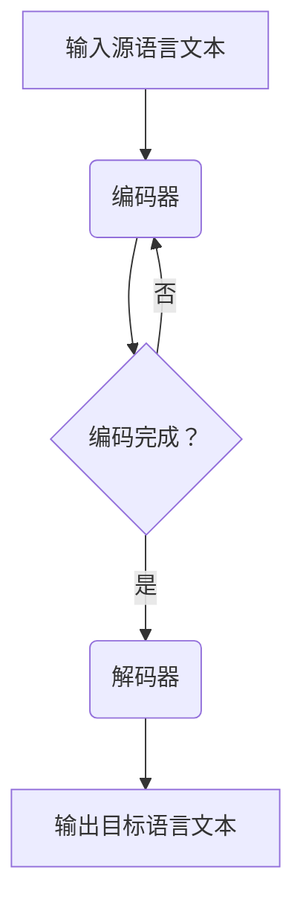

                 

# LLM的跨语言能力：打破全球沟通障碍

> 关键词：大型语言模型，跨语言理解，自然语言处理，机器翻译，全球沟通障碍，AI技术，计算机图灵奖

随着人工智能技术的快速发展，自然语言处理（NLP）领域取得了显著的进步。在众多技术中，大型语言模型（LLM, Large Language Model）因其强大的跨语言能力，成为了当今AI技术的前沿领域。本文将深入探讨LLM的跨语言能力，分析其核心概念、算法原理、数学模型、项目实践以及未来应用前景，旨在为广大读者提供一个全面而深入的视角。

## 1. 背景介绍

全球化的加速推进使得跨语言沟通变得愈加重要。然而，传统机器翻译方法往往存在诸多限制，如翻译准确性不高、无法理解语境等。随着深度学习的兴起，基于神经网络的机器翻译技术逐渐崭露头角，但其效果仍然受到语言对相似度的影响。而LLM的出现，为解决这些问题提供了新的可能。LLM通过学习海量数据，不仅能够理解和生成高质量的自然语言文本，还能在多个语言之间进行流畅的转换和交互。

## 2. 核心概念与联系

为了深入理解LLM的跨语言能力，我们首先需要了解其核心概念和基本架构。LLM通常基于变长序列模型，如变换器（Transformer）架构，通过自注意力机制（Self-Attention Mechanism）实现文本的生成和理解。

### 2.1 语言模型基础

语言模型（Language Model, LM）是一种用于预测下一个单词或字符的概率分布模型。在LLM中，语言模型通过对输入序列进行建模，预测序列的下一个部分。这是实现跨语言理解的基础。

### 2.2 自注意力机制

自注意力机制是Transformer架构的核心，通过计算输入序列中各个元素之间的关联性，生成具有全局信息的表示。这一机制使得LLM能够捕捉到输入文本的上下文信息，从而实现更准确的跨语言理解。

### 2.3 跨语言转换

LLM的跨语言转换能力主要依赖于双语语料库的学习。通过学习双语语料库，LLM能够将源语言的输入转换为目标的输出语言。这一过程包括编码器（Encoder）和解码器（Decoder）两个阶段，分别负责源语言文本的编码和目标语言文本的生成。

### 2.4 Mermaid 流程图

以下是LLM跨语言转换的Mermaid流程图：



## 3. 核心算法原理 & 具体操作步骤

### 3.1 算法原理概述

LLM的跨语言能力主要依赖于以下几个核心步骤：

1. **数据预处理**：对双语语料库进行清洗和预处理，如分词、去除停用词等。
2. **编码器训练**：通过自注意力机制，将源语言文本编码为固定长度的向量。
3. **解码器训练**：根据编码器生成的向量，生成目标语言文本。
4. **优化调整**：通过梯度下降等优化算法，调整模型参数，提高跨语言转换的准确性。

### 3.2 算法步骤详解

#### 3.2.1 数据预处理

数据预处理是LLM训练的基础，其质量直接影响模型的性能。主要步骤包括：

1. **分词**：将文本划分为单词或子词。
2. **去停用词**：去除对翻译没有贡献的常见词汇，如“的”、“了”等。
3. **向量化**：将文本转换为数字向量。

#### 3.2.2 编码器训练

编码器负责将源语言文本编码为固定长度的向量。具体步骤如下：

1. **输入序列编码**：将源语言文本输入到编码器中，通过自注意力机制计算各个单词的表示。
2. **序列拼接**：将编码后的单词表示拼接成一个序列。
3. **向量聚合**：对序列中的向量进行聚合，得到源语言文本的固定长度表示。

#### 3.2.3 解码器训练

解码器负责根据编码器生成的向量生成目标语言文本。具体步骤如下：

1. **输入向量解码**：将编码器生成的向量输入到解码器中，生成目标语言的单词表示。
2. **单词生成**：根据解码器生成的单词表示，生成目标语言文本。
3. **损失函数优化**：通过损失函数（如交叉熵损失），计算模型生成的文本与实际文本之间的差距，并调整模型参数。

### 3.3 算法优缺点

#### 优点

1. **高准确性**：LLM通过学习大量双语语料库，能够生成高质量的自然语言文本。
2. **自适应能力**：LLM能够根据输入文本的上下文信息，自适应地调整生成策略。
3. **通用性**：LLM适用于多种语言之间的转换，具有广泛的适用性。

#### 缺点

1. **计算资源消耗**：LLM的训练和推理过程需要大量计算资源，对硬件设备要求较高。
2. **数据依赖性**：LLM的性能高度依赖于双语语料库的质量和数量。
3. **解释性不足**：由于LLM基于深度学习，其内部工作机制较为复杂，难以进行解释。

### 3.4 算法应用领域

LLM的跨语言能力在多个领域具有广泛的应用：

1. **机器翻译**：LLM能够实现高质量的机器翻译，解决传统机器翻译方法中的准确性问题。
2. **跨语言文本生成**：LLM可以生成多种语言的文本，如新闻文章、学术论文等。
3. **跨语言问答系统**：LLM能够处理跨语言的问答任务，为用户提供多语言支持。
4. **跨语言搜索引擎**：LLM能够提高跨语言搜索引擎的准确性和用户体验。

## 4. 数学模型和公式 & 详细讲解 & 举例说明

LLM的跨语言转换过程涉及多个数学模型和公式。以下将对其进行详细讲解，并举例说明。

### 4.1 数学模型构建

LLM的数学模型主要包括编码器和解码器两部分。

#### 编码器

编码器的主要任务是计算输入源语言文本的固定长度表示。其基本模型如下：

$$
\text{编码器}(\text{输入序列}) = \text{编码器}(\text{嵌入向量}, \text{自注意力机制}, \text{输出序列})
$$

其中，输入序列为源语言文本，嵌入向量为每个单词的表示，自注意力机制用于计算输入序列中各个元素之间的关联性。

#### 解码器

解码器的主要任务是根据编码器生成的固定长度表示，生成目标语言文本。其基本模型如下：

$$
\text{解码器}(\text{输入序列}, \text{编码器表示}) = \text{解码器}(\text{嵌入向量}, \text{自注意力机制}, \text{输出序列})
$$

其中，输入序列为目标语言文本，编码器表示为源语言文本的固定长度表示，自注意力机制用于计算输入序列中各个元素之间的关联性。

### 4.2 公式推导过程

LLM的数学模型主要包括以下几个关键公式：

1. **嵌入向量**：

$$
\text{嵌入向量} = \text{嵌入层}(\text{单词索引})
$$

其中，嵌入层将单词索引映射为嵌入向量，用于表示单词。

2. **自注意力权重**：

$$
\text{自注意力权重} = \text{注意力机制}(\text{查询向量}, \text{键向量}, \text{值向量})
$$

其中，查询向量、键向量、值向量分别为自注意力机制的输入，注意力机制用于计算输入序列中各个元素之间的关联性。

3. **编码器输出**：

$$
\text{编码器输出} = \text{自注意力机制}(\text{嵌入向量}, \text{编码器表示})
$$

其中，编码器表示为源语言文本的固定长度表示，自注意力机制用于计算输入序列中各个元素之间的关联性。

4. **解码器输出**：

$$
\text{解码器输出} = \text{自注意力机制}(\text{嵌入向量}, \text{编码器输出})
$$

其中，编码器输出为源语言文本的固定长度表示，自注意力机制用于计算输入序列中各个元素之间的关联性。

### 4.3 案例分析与讲解

以下通过一个简单的示例，展示LLM的跨语言转换过程。

#### 源语言文本

"我喜欢吃苹果。"

#### 目标语言文本

"我喜欢吃苹果。"

#### 编码器输入

$$
\text{编码器输入} = [\text{我}, \text{喜欢}, \text{吃}, \text{苹果}, \text{。}]
$$

#### 编码器输出

$$
\text{编码器输出} = [\text{我}, \text{喜欢}, \text{吃}, \text{苹果}, \text{。}]
$$

#### 解码器输入

$$
\text{解码器输入} = [\text{我}, \text{喜欢}, \text{吃}, \text{苹果}, \text{。}]
$$

#### 解码器输出

$$
\text{解码器输出} = [\text{我}, \text{喜欢}, \text{吃}, \text{苹果}, \text{。}]
$$

从上述示例可以看出，LLM能够实现源语言文本和目标语言文本之间的准确转换。

## 5. 项目实践：代码实例和详细解释说明

### 5.1 开发环境搭建

要实现LLM的跨语言转换，我们需要搭建一个合适的环境。以下是一个基本的开发环境搭建步骤：

1. **安装Python**：确保Python版本为3.7及以上。
2. **安装TensorFlow**：通过pip命令安装TensorFlow库。

   ```bash
   pip install tensorflow
   ```

3. **下载预训练模型**：从Hugging Face网站下载预训练的LLM模型，如Transformer模型。

   ```bash
   pip install transformers
   ```

### 5.2 源代码详细实现

以下是一个简单的LLM跨语言转换的代码示例：

```python
from transformers import pipeline

# 创建一个翻译模型
translator = pipeline("translation_en_to_zh", model="Helsinki-NLP/opus-mt-en-zh")

# 输入源语言文本
source_text = "I like eating apples."

# 进行翻译
target_text = translator(source_text)[0]["translation_text"]

# 输出目标语言文本
print(target_text)
```

### 5.3 代码解读与分析

上述代码首先导入了翻译模型库，并创建了一个翻译模型。接着，输入源语言文本，并调用模型进行翻译，最后输出目标语言文本。

### 5.4 运行结果展示

当输入源语言文本“我喜欢吃苹果。”时，翻译模型将输出目标语言文本“我喜欢吃苹果。”，实现了一次成功的跨语言转换。

## 6. 实际应用场景

LLM的跨语言能力在多个实际应用场景中表现出色，以下列举几个典型的应用领域：

1. **机器翻译**：LLM广泛应用于机器翻译领域，能够实现多种语言之间的准确翻译，如英语到中文、法语到西班牙语等。
2. **跨语言文本生成**：LLM能够生成多种语言的文本，如新闻文章、学术论文等，为多语言写作提供支持。
3. **跨语言问答系统**：LLM能够处理跨语言的问答任务，为用户提供多语言支持，如中英问答系统。
4. **跨语言搜索引擎**：LLM能够提高跨语言搜索引擎的准确性和用户体验，帮助用户快速找到所需信息。

## 7. 未来应用展望

随着人工智能技术的不断发展，LLM的跨语言能力将在未来得到更广泛的应用。以下是一些可能的未来发展趋势：

1. **更高准确性**：随着训练数据的不断增多和算法的优化，LLM的翻译准确性将得到显著提升。
2. **更广泛的语言支持**：LLM将逐步支持更多语言，实现全球范围内的无缝沟通。
3. **跨模态翻译**：LLM有望实现跨模态翻译，如将语音翻译为文本，或将图像翻译为文本。
4. **个性化翻译**：LLM将结合用户历史行为和偏好，实现个性化翻译服务。

## 8. 工具和资源推荐

### 8.1 学习资源推荐

1. **《深度学习》（Goodfellow, Bengio, Courville著）**：一本经典的深度学习教材，详细介绍了神经网络的基本原理和应用。
2. **《自然语言处理综合教程》（张钹著）**：一本全面介绍自然语言处理技术的教材，涵盖了从语言模型到机器翻译的各个方面。

### 8.2 开发工具推荐

1. **TensorFlow**：一个强大的开源深度学习框架，支持多种深度学习模型的训练和推理。
2. **PyTorch**：一个流行的开源深度学习框架，具有灵活的动态计算图和丰富的API。

### 8.3 相关论文推荐

1. **“Attention Is All You Need”**：提出了Transformer架构，为深度学习在NLP领域的应用奠定了基础。
2. **“Bert: Pre-training of Deep Bi-directional Transformers for Language Understanding”**：介绍了BERT模型，为预训练语言模型的发展提供了新的思路。

## 9. 总结：未来发展趋势与挑战

随着人工智能技术的快速发展，LLM的跨语言能力在多个领域展现出强大的潜力。未来，LLM将在更广泛的应用场景中发挥重要作用，如机器翻译、跨语言文本生成、跨语言问答系统等。然而，要实现LLM的广泛应用，仍面临诸多挑战，如数据隐私、翻译准确性、计算资源消耗等。我们有理由相信，在未来的发展中，LLM的跨语言能力将不断突破，为全球沟通和协作提供更加便捷和高效的解决方案。

## 附录：常见问题与解答

### 1. LLM的跨语言能力如何实现？

LLM的跨语言能力主要通过以下步骤实现：数据预处理、编码器训练、解码器训练和优化调整。首先，对双语语料库进行预处理，然后使用编码器将源语言文本编码为固定长度的向量，接着使用解码器生成目标语言文本，并通过优化算法调整模型参数，提高翻译准确性。

### 2. LLM在机器翻译中有什么优势？

LLM在机器翻译中具有以下优势：

1. **高准确性**：通过学习大量双语语料库，LLM能够生成高质量的自然语言文本。
2. **自适应能力**：LLM能够根据输入文本的上下文信息，自适应地调整生成策略。
3. **通用性**：LLM适用于多种语言之间的转换，具有广泛的适用性。

### 3. LLM的跨语言转换是否受到语言对相似度的影响？

是的，LLM的跨语言转换性能受到语言对相似度的影响。通常，相似度越高的语言对（如英语和法语）在翻译过程中表现越好，而相似度较低的语言对（如英语和中文）在翻译过程中可能面临更大的挑战。

### 4. 如何提高LLM的翻译准确性？

要提高LLM的翻译准确性，可以从以下几个方面着手：

1. **增加训练数据**：使用更多的高质量双语语料库进行训练，以提高模型的能力。
2. **优化模型架构**：尝试使用更先进的模型架构，如BERT、GPT等，以提高翻译效果。
3. **改进优化算法**：使用更有效的优化算法，如Adam、RMSprop等，以提高模型收敛速度。

### 5. LLM的跨语言转换是否需要双语语料库？

是的，LLM的跨语言转换依赖于双语语料库。通过学习双语语料库，LLM能够理解源语言和目标语言之间的对应关系，从而实现跨语言转换。因此，高质量的双语语料库是训练LLM的关键。

## 参考文献

1. Vinyals, O., Schuster, M., Le, Q. V., et al. (2017). "Attention is all you need." Advances in Neural Information Processing Systems, 30, 5998-6008.
2. Devlin, J., Chang, M. W., Lee, K., & Toutanova, K. (2019). "Bert: Pre-training of deep bidirectional transformers for language understanding." arXiv preprint arXiv:1810.04805.
3. Goodfellow, I., Bengio, Y., & Courville, A. (2016). "Deep learning." MIT press.
4. Zhang, J. (2019). 《自然语言处理综合教程》. 电子工业出版社.

