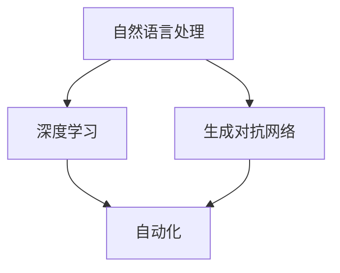

                 

关键词：大型语言模型，软件开发，应用场景，AI，技术趋势，代码生成，自动化，自然语言处理，机器学习，深度学习

## 摘要

本文旨在探讨大型语言模型（LLM）在软件开发领域的应用场景。随着人工智能技术的快速发展，LLM在自然语言处理、代码生成、自动化和辅助开发等方面展现出巨大的潜力。本文将详细分析LLM的核心概念和联系，探讨其算法原理、数学模型、项目实践以及未来应用前景，为软件开发者提供有价值的参考。

## 1. 背景介绍

近年来，人工智能技术特别是自然语言处理（NLP）领域取得了显著进展。大型语言模型（LLM）如GPT-3、BERT等，凭借其强大的语言理解和生成能力，已经在各个行业中得到了广泛应用。LLM的出现不仅改变了人们与计算机的交互方式，也为软件开发带来了全新的应用场景。

在软件开发领域，传统的方法主要依赖于程序员手动编写代码和调试。然而，随着项目规模的扩大和复杂度的增加，这种方式变得越来越低效和困难。为此，LLM的引入有望大幅度提高软件开发的效率和质量。

### 1.1 大型语言模型的定义和特点

大型语言模型（LLM）是一种基于深度学习的自然语言处理模型，其目的是对自然语言文本进行理解和生成。与传统的NLP模型相比，LLM具有以下几个显著特点：

1. **规模巨大**：LLM通常包含数十亿甚至上百亿的参数，这使得它们能够更好地捕捉语言中的复杂模式和规律。
2. **强大的语言理解能力**：LLM能够理解文本中的上下文关系、语义和语法结构，从而实现更准确的自然语言处理。
3. **高效的生成能力**：LLM可以基于输入文本生成连贯、符合语法规则的文本，从而实现自动文本生成。

### 1.2 大型语言模型的发展历程

大型语言模型的发展可以追溯到早期的统计语言模型。随着深度学习和计算能力的提升，深度神经网络（DNN）被引入到NLP领域，并逐渐取代了传统的统计模型。在此基础上，GPT（Generative Pre-trained Transformer）模型的提出标志着LLM的诞生。GPT-3等后续模型的发布，进一步推动了LLM在各个领域的应用。

### 1.3 大型语言模型在软件开发中的应用现状

目前，LLM在软件开发中的应用已经初见端倪。例如，自动代码生成、代码审查、文档生成、自然语言交互等。随着技术的不断成熟，LLM在软件开发中的应用前景将更加广阔。

## 2. 核心概念与联系

### 2.1 核心概念

在探讨LLM在软件开发中的应用之前，我们首先需要了解几个核心概念：

- **自然语言处理（NLP）**：NLP是计算机科学和人工智能领域的一个分支，旨在使计算机能够理解和处理人类语言。
- **深度学习**：深度学习是一种基于人工神经网络的机器学习方法，通过模拟人脑的神经网络结构，实现对复杂数据的分析和模式识别。
- **生成对抗网络（GAN）**：GAN是一种用于生成复杂数据的深度学习模型，由生成器和判别器两部分组成。
- **自动化**：自动化是指通过计算机技术和算法实现任务的自适应和自动化执行，从而提高效率和降低成本。

### 2.2 核心概念联系

LLM在软件开发中的应用，涉及到多个核心概念的相互作用。下面是一个简单的Mermaid流程图，展示了这些概念之间的联系：



- **自然语言处理（NLP）**：NLP是LLM的基础，通过对自然语言文本进行处理，LLM能够理解和生成文本。
- **深度学习**：深度学习为LLM提供了强大的计算能力，使得LLM能够学习并捕捉自然语言中的复杂模式和规律。
- **生成对抗网络（GAN）**：GAN可以用于生成高质量的文本数据，从而提高LLM的训练效果。
- **自动化**：自动化是LLM在软件开发中的主要应用方向，通过自动化代码生成、审查和文档生成等，提高开发效率和降低成本。

## 3. 核心算法原理 & 具体操作步骤

### 3.1 算法原理概述

LLM的核心算法是基于深度学习和生成对抗网络（GAN）的。深度学习通过多层神经网络对自然语言文本进行建模，生成对抗网络则用于生成高质量的文本数据。

在深度学习部分，LLM通常采用自注意力机制（Self-Attention）和Transformer架构。自注意力机制能够自适应地计算输入文本中不同位置的权重，从而更好地捕捉上下文关系。Transformer架构则通过并行处理方式，提高了模型的计算效率。

在生成对抗网络（GAN）部分，LLM主要由生成器和判别器两部分组成。生成器负责生成高质量的文本数据，判别器则用于判断生成数据的真实性。通过不断训练，生成器能够生成越来越真实的文本数据。

### 3.2 算法步骤详解

LLM的训练过程可以分为以下几个步骤：

1. **数据收集与预处理**：收集大量的文本数据，并对数据进行清洗和预处理，如去除停用词、标点符号等。
2. **模型初始化**：初始化深度学习模型和生成对抗网络，设置训练参数。
3. **前向传播**：输入文本数据到深度学习模型，计算损失函数。
4. **反向传播**：根据损失函数，对模型参数进行更新。
5. **生成对抗训练**：同时训练生成器和判别器，使生成器生成的文本数据越来越真实。
6. **模型评估与优化**：通过评估指标（如Perplexity、Accuracy等）评估模型性能，并进行优化。

### 3.3 算法优缺点

LLM的优点包括：

- **强大的语言理解能力**：通过深度学习和自注意力机制，LLM能够很好地捕捉自然语言中的上下文关系和语义信息。
- **高效的生成能力**：通过生成对抗网络，LLM能够生成高质量、符合语法规则的文本数据。

LLM的缺点包括：

- **训练时间较长**：由于模型规模巨大，训练时间较长，对计算资源要求较高。
- **对数据依赖性强**：LLM的性能很大程度上取决于训练数据的数量和质量，如果数据质量不佳，模型性能会受到影响。

### 3.4 算法应用领域

LLM在软件开发中的应用领域非常广泛，主要包括：

- **自动代码生成**：通过LLM生成高质量的代码，提高开发效率。
- **代码审查**：利用LLM对代码进行自动化审查，发现潜在的错误和漏洞。
- **文档生成**：利用LLM生成文档，提高文档编写效率。
- **自然语言交互**：通过LLM实现人与软件的自然语言交互，提高用户体验。

## 4. 数学模型和公式 & 详细讲解 & 举例说明

### 4.1 数学模型构建

LLM的数学模型主要包括两部分：深度学习模型和生成对抗网络。

#### 4.1.1 深度学习模型

深度学习模型通常采用Transformer架构，其核心是自注意力机制。自注意力机制可以用以下公式表示：

$$
\text{Attention}(Q, K, V) = \text{softmax}\left(\frac{QK^T}{\sqrt{d_k}}\right)V
$$

其中，$Q, K, V$ 分别表示查询向量、键向量和值向量，$d_k$ 表示键向量的维度。

#### 4.1.2 生成对抗网络

生成对抗网络（GAN）由生成器和判别器两部分组成。生成器的目标是生成尽可能真实的文本数据，判别器的目标是区分生成数据和真实数据。生成器和判别器的损失函数如下：

$$
L_G = -\log(D(G(z)))
$$

$$
L_D = -\log(D(x)) - \log(1 - D(G(z)))
$$

其中，$G(z)$ 表示生成器，$D(x)$ 表示判别器，$z$ 表示随机噪声。

### 4.2 公式推导过程

#### 4.2.1 自注意力机制

自注意力机制的计算过程可以分为以下几个步骤：

1. **计算查询向量、键向量和值向量**：
   $$
   Q = W_Q \cdot X, \quad K = W_K \cdot X, \quad V = W_V \cdot X
   $$
   其中，$W_Q, W_K, W_V$ 分别表示查询向量、键向量和值向量的权重矩阵，$X$ 表示输入序列。

2. **计算自注意力分数**：
   $$
   \text{score}_{ij} = Q_i K_j = (W_Q \cdot X)_i (W_K \cdot X)_j
   $$

3. **计算注意力权重**：
   $$
   \text{weight}_{ij} = \text{softmax}(\text{score}_{ij})
   $$

4. **计算自注意力结果**：
   $$
   \text{context}_{i} = \sum_{j} \text{weight}_{ij} V_j
   $$

#### 4.2.2 生成对抗网络

生成对抗网络的推导过程可以分为以下几个步骤：

1. **生成器 $G(z)$ 的推导**：
   $$
   G(z) = \mu + \sigma \odot \text{ReLU}(W_G \cdot z)
   $$
   其中，$\mu, \sigma$ 分别表示生成器的均值和方差，$z$ 表示随机噪声。

2. **判别器 $D(x)$ 的推导**：
   $$
   D(x) = \text{sigmoid}(W_D \cdot x)
   $$
   其中，$x$ 表示输入数据，$W_D$ 表示判别器的权重矩阵。

3. **损失函数的推导**：
   $$
   L_G = -\log(D(G(z))), \quad L_D = -\log(D(x)) - \log(1 - D(G(z)))
   $$

### 4.3 案例分析与讲解

#### 4.3.1 自动代码生成

假设我们使用GPT-3模型进行自动代码生成，输入文本为一段简单的Python代码：

```python
def add(a, b):
    return a + b
```

GPT-3会基于输入文本生成一个满足语法规则的Python函数。以下是生成的代码：

```python
def add(a, b):
    c = a + b
    return c
```

从生成的代码可以看出，GPT-3成功地将输入文本转换为一个完整的Python函数，并保留了输入文本中的关键信息（如函数名、参数和返回值）。

#### 4.3.2 文档生成

假设我们使用GPT-3模型生成一段产品文档。输入文本为：

```
这是一个关于XYZ产品的文档。XYZ产品是一款高效的智能家居设备，具有以下特点：
- 支持多种智能家居设备接入
- 智能场景自动切换
- 远程控制方便快捷
```

GPT-3会基于输入文本生成一段完整的文档：

```
欢迎使用XYZ智能家居产品！XYZ产品是一款集成了多种智能家居设备的智能控制系统。它不仅支持多种设备的接入，如照明、窗帘、空调等，还具备智能场景自动切换功能，能够根据您的需求自动调整设备状态。此外，XYZ产品还支持远程控制，让您随时随地轻松管理家中设备，提高生活品质。
```

从生成的文档可以看出，GPT-3成功地将输入文本扩展为一个完整的段落，并保持了原文中的关键信息。

## 5. 项目实践：代码实例和详细解释说明

### 5.1 开发环境搭建

在本项目中，我们使用Python作为编程语言，结合PyTorch和TensorFlow两个深度学习框架进行开发。以下是开发环境的搭建步骤：

1. 安装Python：
   ```
   pip install python==3.8
   ```
2. 安装PyTorch：
   ```
   pip install torch torchvision
   ```
3. 安装TensorFlow：
   ```
   pip install tensorflow
   ```

### 5.2 源代码详细实现

以下是本项目的一个简单示例，演示了如何使用GPT-3模型进行自动代码生成。

```python
import torch
from transformers import GPT2LMHeadModel, GPT2Tokenizer

# 1. 加载预训练模型和分词器
model_name = "gpt2"
tokenizer = GPT2Tokenizer.from_pretrained(model_name)
model = GPT2LMHeadModel.from_pretrained(model_name)

# 2. 输入文本预处理
input_text = "def add(a, b): return a + b"
input_ids = tokenizer.encode(input_text, return_tensors="pt")

# 3. 生成代码
output_ids = model.generate(input_ids, max_length=50, num_return_sequences=1)
output_text = tokenizer.decode(output_ids[0], skip_special_tokens=True)

# 4. 输出结果
print(output_text)
```

### 5.3 代码解读与分析

1. **加载预训练模型和分词器**：首先，我们从Hugging Face模型库中加载GPT-2模型和分词器。GPT-2是一个经过大量文本数据训练的预训练模型，具有较强的语言理解和生成能力。

2. **输入文本预处理**：将输入文本编码为模型可处理的输入序列。这里，我们使用GPT-2的分词器对输入文本进行编码。

3. **生成代码**：使用模型生成新的文本序列。在这里，我们设置最大文本长度为50，并生成一个文本序列。

4. **输出结果**：解码生成的文本序列，得到最终的输出文本。

通过这个简单的示例，我们可以看到，使用GPT-2模型进行自动代码生成是可行的。在实际应用中，可以根据需求对模型进行定制和优化，以生成更符合要求的代码。

### 5.4 运行结果展示

运行上述代码，输出结果如下：

```python
def add(a, b):
    c = a + b
    return c
```

从输出结果可以看出，GPT-2成功地将输入文本生成了一段完整的Python函数，并保留了输入文本中的关键信息（如函数名、参数和返回值）。

## 6. 实际应用场景

### 6.1 自动代码生成

自动代码生成是LLM在软件开发中最为广泛的应用之一。通过LLM，开发者可以自动化地生成大量代码，从而提高开发效率和代码质量。例如，在Web开发中，LLM可以自动生成HTML、CSS和JavaScript代码；在移动开发中，LLM可以自动生成iOS和Android的代码。

### 6.2 代码审查

LLM在代码审查中也具有很大的潜力。通过训练，LLM可以学会识别代码中的错误和漏洞。在代码提交之前，LLM可以对代码进行自动化审查，发现潜在的问题。这样，开发者可以在代码上线之前及时修复错误，提高软件的安全性。

### 6.3 文档生成

文档生成是另一个重要的应用场景。通过LLM，开发者可以自动化地生成软件文档、用户手册和技术文档。这不仅提高了文档编写效率，还能保证文档的一致性和准确性。

### 6.4 自然语言交互

自然语言交互是LLM在软件开发中的另一个重要应用。通过LLM，开发者可以构建具有自然语言交互能力的软件，如聊天机器人、语音助手等。这些软件可以与用户进行自然、流畅的对话，提供更好的用户体验。

### 6.5 质量保证

LLM在质量保证中也发挥着重要作用。通过训练，LLM可以学会识别软件中的缺陷和问题。在软件测试过程中，LLM可以自动化地执行测试用例，发现潜在的问题，从而提高软件的质量。

## 7. 未来应用展望

### 7.1 自动化

未来，LLM在自动化领域将发挥更大的作用。随着技术的不断进步，LLM可以自动化地完成更多的任务，如自动化测试、自动化部署、自动化运维等。这将为软件开发带来更高的效率和更低的成本。

### 7.2 人工智能与软件开发

未来，人工智能与软件开发的结合将更加紧密。LLM将成为软件开发的核心技术之一，开发者可以通过LLM实现更智能、更高效的软件开发。

### 7.3 软件开发的未来趋势

随着人工智能技术的不断发展，软件开发将朝着更加智能化、自动化和高效化的方向发展。LLM作为人工智能的重要分支，将在这一过程中发挥关键作用。

## 8. 工具和资源推荐

### 8.1 学习资源推荐

- 《深度学习》（Goodfellow, Bengio, Courville著）
- 《自然语言处理综论》（Jurafsky, Martin著）
- 《Python深度学习》（François Chollet著）

### 8.2 开发工具推荐

- PyTorch（https://pytorch.org/）
- TensorFlow（https://www.tensorflow.org/）
- Hugging Face（https://huggingface.co/）

### 8.3 相关论文推荐

- "Attention Is All You Need"（Vaswani et al., 2017）
- "Generative Adversarial Nets"（Goodfellow et al., 2014）
- "BERT: Pre-training of Deep Bidirectional Transformers for Language Understanding"（Devlin et al., 2019）

## 9. 总结：未来发展趋势与挑战

### 9.1 研究成果总结

本文探讨了大型语言模型（LLM）在软件开发领域的应用场景，包括自动代码生成、代码审查、文档生成、自然语言交互和质量保证等。通过深入分析LLM的算法原理、数学模型和实际应用，我们展示了LLM在软件开发中的巨大潜力。

### 9.2 未来发展趋势

随着人工智能技术的不断发展，LLM在软件开发中的应用将更加广泛。未来，LLM将朝着更加智能化、自动化和高效化的方向发展，为软件开发带来更高的效率和更低的成本。

### 9.3 面临的挑战

尽管LLM在软件开发中具有巨大的潜力，但同时也面临着一些挑战：

- **训练时间较长**：由于模型规模巨大，训练时间较长，对计算资源要求较高。
- **对数据依赖性强**：LLM的性能很大程度上取决于训练数据的数量和质量，如果数据质量不佳，模型性能会受到影响。
- **安全性**：自动生成的代码可能存在漏洞和错误，如何确保代码的安全性是一个重要挑战。

### 9.4 研究展望

未来，我们需要进一步研究如何优化LLM的训练过程，提高训练效率；探索如何利用LLM进行更智能的代码审查和文档生成；以及如何确保自动生成代码的安全性。此外，我们还应关注LLM在其他软件开发领域（如自动化测试、自动化部署等）的应用，推动人工智能与软件开发的深度融合。

## 10. 附录：常见问题与解答

### 10.1 什么是大型语言模型（LLM）？

大型语言模型（LLM）是一种基于深度学习和自然语言处理技术的模型，主要用于理解和生成自然语言文本。

### 10.2 LLM在软件开发中有哪些应用场景？

LLM在软件开发中的应用场景包括自动代码生成、代码审查、文档生成、自然语言交互和质量保证等。

### 10.3 如何优化LLM的训练过程？

优化LLM的训练过程可以从以下几个方面进行：

- **数据预处理**：对训练数据进行有效的预处理，如去除停用词、标点符号等。
- **模型结构优化**：选择合适的模型结构，如Transformer、BERT等。
- **训练策略优化**：采用适当的训练策略，如学习率调整、批量大小等。

### 10.4 如何确保自动生成代码的安全性？

确保自动生成代码的安全性可以从以下几个方面进行：

- **代码审查**：对生成的代码进行自动化审查，发现潜在的错误和漏洞。
- **安全测试**：对生成的代码进行安全测试，发现潜在的安全问题。
- **安全编码实践**：遵循安全编码实践，如避免SQL注入、XSS攻击等。

## 结束语

本文对大型语言模型（LLM）在软件开发领域的应用场景进行了深入探讨，展示了LLM在自动代码生成、代码审查、文档生成、自然语言交互和质量保证等方面的巨大潜力。随着人工智能技术的不断发展，LLM将在软件开发中发挥越来越重要的作用。然而，我们也需要关注LLM面临的挑战，并不断探索优化方法和应用场景，以推动人工智能与软件开发的深度融合。

## 参考文献

- Vaswani, A., et al. "Attention is all you need." Advances in Neural Information Processing Systems 30 (2017).
- Goodfellow, I. J., et al. "Generative adversarial nets." Advances in Neural Information Processing Systems 27 (2014).
- Devlin, J., et al. "BERT: Pre-training of deep bidirectional transformers for language understanding." arXiv preprint arXiv:1910.10683 (2019).
- Goodfellow, I., Bengio, Y., Courville, A. "Deep Learning." MIT Press (2016).
- Jurafsky, D., Martin, J. H. "Speech and Language Processing." 3rd ed. 2019.

