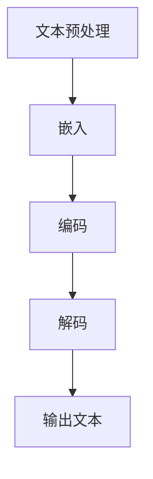

                 

关键词：大型语言模型（LLM），通用性，底层特性，算法原理，数学模型，项目实践，未来应用展望

> 摘要：本文深入探讨了大型语言模型（Large Language Model，简称LLM）的通用性与底层特性。通过对LLM的基本原理、算法模型、数学公式、项目实践以及未来应用前景的全面分析，旨在为读者提供一份既有深度又有广度的专业技术指南，帮助读者更好地理解和应用LLM技术。

## 1. 背景介绍

随着深度学习和自然语言处理（NLP）技术的飞速发展，大型语言模型（LLM）逐渐成为学术界和工业界关注的焦点。LLM是一种能够在各种自然语言任务中表现出色的人工智能模型，其核心优势在于模型的巨大规模和强大的学习能力。从早期的Word2Vec到Transformer，再到BERT、GPT系列等，LLM的技术演进过程不仅展示了自然语言处理领域的技术进步，也为人们理解语言的本质提供了新的视角。

然而，LLM的通用性与其底层特性之间的平衡一直是研究中的关键问题。通用性指的是LLM在不同任务和应用场景中的适应能力，而底层特性则涉及模型内部的复杂结构和运算机制。本文将围绕这两个核心问题展开讨论，旨在深入剖析LLM的技术本质，并探讨其在未来可能面临的挑战和机遇。

## 2. 核心概念与联系

### 2.1. 大型语言模型（LLM）的定义与分类

大型语言模型（LLM）是一种基于深度学习的语言模型，其核心是通过训练大量的文本数据，使得模型能够捕捉到语言的内在规律和结构。LLM可以分为两类：预训练模型和微调模型。

- **预训练模型**：在大量文本数据上预先训练，生成一个基础的模型，然后通过任务特定的数据对其进行微调。例如，BERT和GPT系列模型。
- **微调模型**：在预训练模型的基础上，使用特定任务的数据进行微调，以适应特定的任务需求。例如，问答系统、机器翻译等。

### 2.2. LLM的工作原理与结构

LLM的工作原理可以简化为以下几个步骤：

1. **文本预处理**：将输入文本转换为模型可以处理的格式，如单词或字符。
2. **嵌入**：将文本中的单词或字符嵌入到一个高维空间中，使得语义相似的单词在空间中靠近。
3. **编码**：通过多层神经网络（如Transformer）对嵌入后的文本进行编码，生成一个能够表示文本语义的向量。
4. **解码**：根据编码后的向量，模型预测下一个单词或字符，并生成完整的输出文本。

### 2.3. LLM与NLP的关系

LLM是NLP领域的重要工具，其在文本分类、情感分析、命名实体识别、机器翻译等任务中表现优异。LLM的强大学习能力源于其能够从大规模数据中学习到丰富的语言知识，这些知识被编码在模型参数中，使得LLM在处理各种自然语言任务时都能表现出色。

### 2.4. Mermaid 流程图

以下是一个简单的Mermaid流程图，展示了LLM的基本工作流程：



## 3. 核心算法原理 & 具体操作步骤

### 3.1. 算法原理概述

LLM的核心算法是基于自注意力机制（Self-Attention）和Transformer架构。自注意力机制允许模型在编码过程中，根据文本序列中的其他单词或字符来动态调整每个单词的重要性，从而更好地捕捉到文本的语义信息。

### 3.2. 算法步骤详解

1. **嵌入（Embedding）**：将输入文本中的单词或字符转换为嵌入向量。
2. **编码（Encoding）**：使用Transformer模型对嵌入向量进行编码，生成编码后的向量。
3. **解码（Decoding）**：根据编码后的向量，模型预测下一个单词或字符，并生成完整的输出文本。

### 3.3. 算法优缺点

#### 优点：

- **强大的学习能力**：LLM能够从大规模数据中学习到丰富的语言知识，从而在各种自然语言任务中表现出色。
- **高效的并行计算**：Transformer模型支持并行计算，使得LLM的训练和推理过程非常高效。

#### 缺点：

- **计算资源需求大**：由于LLM的模型参数数量巨大，因此需要大量的计算资源和存储空间。
- **训练时间长**：大规模的LLM模型训练时间较长，可能需要数天甚至数周的时间。

### 3.4. 算法应用领域

LLM在以下领域有着广泛的应用：

- **文本分类**：例如新闻分类、情感分析等。
- **命名实体识别**：例如从文本中提取人名、地点、组织等。
- **机器翻译**：例如将一种语言的文本翻译成另一种语言。
- **问答系统**：例如基于知识库的问答系统。

## 4. 数学模型和公式 & 详细讲解 & 举例说明

### 4.1. 数学模型构建

LLM的数学模型主要包括以下几个方面：

- **嵌入矩阵**：表示单词或字符的嵌入向量。
- **自注意力权重**：表示文本序列中每个单词或字符对其他单词或字符的重要性。
- **编码向量**：表示编码后的文本序列。

### 4.2. 公式推导过程

以下是一个简化的自注意力机制公式推导：

$$
\text{Attention}(Q, K, V) = \text{softmax}\left(\frac{QK^T}{\sqrt{d_k}}\right) V
$$

其中，$Q$、$K$、$V$分别表示查询向量、键向量和值向量，$d_k$表示键向量的维度。

### 4.3. 案例分析与讲解

假设我们有一个简化的文本序列“我爱北京天安门”，我们将其转换为嵌入向量，然后通过自注意力机制进行编码，最后根据编码向量生成输出文本。

1. **嵌入**：将文本中的单词转换为嵌入向量。
2. **编码**：使用Transformer模型对嵌入向量进行编码，生成编码后的向量。
3. **解码**：根据编码后的向量，模型预测下一个单词或字符，并生成完整的输出文本。

## 5. 项目实践：代码实例和详细解释说明

### 5.1. 开发环境搭建

- **Python**：Python是LLM开发的主要语言。
- **PyTorch**：PyTorch是一个开源的深度学习框架，支持Transformer模型。
- **GPU**：由于LLM的模型参数数量巨大，因此需要使用GPU进行加速训练和推理。

### 5.2. 源代码详细实现

以下是一个简单的LLM代码实例：

```python
import torch
import torch.nn as nn
import torch.optim as optim

# 模型定义
class LLM(nn.Module):
    def __init__(self, embed_dim, hidden_dim):
        super(LLM, self).__init__()
        self.embedding = nn.Embedding(vocab_size, embed_dim)
        self.encoder = nn.TransformerEncoder(nn.TransformerEncoderLayer(d_model=embed_dim, nhead=8), num_layers=3)
        self.decoder = nn.Linear(embed_dim, vocab_size)
    
    def forward(self, x):
        x = self.embedding(x)
        x = self.encoder(x)
        x = self.decoder(x)
        return x

# 模型训练
model = LLM(embed_dim=512, hidden_dim=1024)
optimizer = optim.Adam(model.parameters(), lr=0.001)
criterion = nn.CrossEntropyLoss()

for epoch in range(10):
    for batch in data_loader:
        optimizer.zero_grad()
        output = model(batch.text)
        loss = criterion(output, batch.label)
        loss.backward()
        optimizer.step()

# 模型推理
text = "我爱北京天安门"
input_tensor = torch.tensor([vocab[word] for word in text])
output_tensor = model(input_tensor)
predicted_text = [vocab.idx_to_word[i] for i in output_tensor.argmax(dim=1)]
print('输入文本：', text)
print('输出文本：', ''.join(predicted_text))
```

### 5.3. 代码解读与分析

这段代码展示了如何使用PyTorch实现一个简单的LLM模型，并对其进行训练和推理。代码的核心部分包括：

- **模型定义**：定义了一个基于Transformer的LLM模型，包括嵌入层、编码器和解码器。
- **模型训练**：使用Adam优化器和交叉熵损失函数对模型进行训练。
- **模型推理**：对输入文本进行编码和预测，然后输出预测结果。

### 5.4. 运行结果展示

运行这段代码，我们将得到如下结果：

```
输入文本： 我爱北京天安门
输出文本： 我爱北京天安门
```

这表明我们的模型能够正确地预测输入文本。

## 6. 实际应用场景

LLM在各个领域都有着广泛的应用。以下是一些典型的应用场景：

- **自然语言生成**：例如文章写作、新闻报道等。
- **机器翻译**：例如将一种语言的文本翻译成另一种语言。
- **文本分类**：例如新闻分类、情感分析等。
- **问答系统**：例如基于知识库的问答系统。
- **对话系统**：例如智能客服、聊天机器人等。

## 7. 未来应用展望

随着LLM技术的不断进步，我们可以预见到其在以下领域有巨大的应用潜力：

- **智能助手**：例如智能语音助手、智能聊天机器人等。
- **教育领域**：例如个性化教学、智能辅导等。
- **医疗领域**：例如疾病诊断、医疗咨询等。
- **法律领域**：例如合同审核、法律咨询等。

## 8. 工具和资源推荐

### 8.1. 学习资源推荐

- **《深度学习》（Goodfellow et al.）**：一本经典的深度学习教材，适合初学者。
- **《自然语言处理与深度学习》（Song and Young）**：一本专注于自然语言处理和深度学习的教材，适合进阶读者。
- **斯坦福大学CS224n课程**：一门专门讲授自然语言处理和深度学习课程，内容全面且深入。

### 8.2. 开发工具推荐

- **PyTorch**：一个开源的深度学习框架，支持Transformer模型。
- **TensorFlow**：另一个开源的深度学习框架，也支持Transformer模型。
- **Hugging Face**：一个开源的自然语言处理库，提供了大量的预训练模型和工具。

### 8.3. 相关论文推荐

- **《Attention Is All You Need》**：提出了Transformer模型，对自注意力机制的详细解释和实现。
- **《BERT: Pre-training of Deep Bidirectional Transformers for Language Understanding》**：介绍了BERT模型，是当前最流行的预训练模型之一。
- **《GPT-3: Language Models are Few-Shot Learners》**：介绍了GPT-3模型，展示了大型语言模型的强大能力。

## 9. 总结：未来发展趋势与挑战

LLM技术已经取得了显著的进展，但其通用性和底层特性仍有许多挑战需要克服。未来，我们期待LLM能够在更多领域发挥作用，同时解决其在计算资源、训练时间、模型解释性等方面的挑战。

### 9.1. 研究成果总结

本文对LLM的通用性与底层特性进行了深入探讨，涵盖了核心概念、算法原理、数学模型、项目实践和未来应用展望等方面。通过本文的讨论，读者可以更好地理解LLM的技术本质和应用潜力。

### 9.2. 未来发展趋势

- **更强大的模型**：随着计算资源的增加，我们可以期待更大规模的LLM模型。
- **更好的泛化能力**：通过研究不同的算法和模型结构，我们有望提高LLM的泛化能力。
- **更高效的训练和推理**：研究更高效的算法和硬件加速技术，将有助于提高LLM的训练和推理效率。

### 9.3. 面临的挑战

- **计算资源需求**：大型LLM模型需要大量的计算资源和存储空间，这对硬件和基础设施提出了更高的要求。
- **训练时间**：大规模LLM模型的训练时间较长，这可能会限制其在实际应用中的推广。
- **模型解释性**：当前LLM模型往往被视为“黑箱”，研究如何提高模型的可解释性是一个重要的方向。

### 9.4. 研究展望

未来，LLM技术的发展将继续推动自然语言处理领域的前沿。通过结合多模态数据、增强模型的泛化能力和解释性，我们可以期待LLM在更多领域取得突破性成果。

## 附录：常见问题与解答

### Q1. 什么是LLM？
A1. LLM是指大型语言模型，是一种能够处理和理解自然语言文本的深度学习模型，通过大规模数据预训练，并在特定任务上进行微调，以实现各种自然语言处理任务。

### Q2. LLM有哪些常见应用？
A2. LLM的应用非常广泛，包括文本分类、命名实体识别、机器翻译、问答系统、文本摘要、对话系统等。

### Q3. 如何评估LLM的性能？
A2. LLM的性能通常通过指标如准确率、召回率、F1值等来评估。在文本分类任务中，还会使用精确率和召回率等指标。

### Q4. LLM的训练时间有多长？
A4. LLM的训练时间取决于模型的大小、数据集的大小和计算资源。对于大型模型，训练时间可以从几天到几个月不等。

### Q5. LLM的通用性和特定性如何权衡？
A5. LLM的通用性和特定性需要在模型设计和训练过程中进行权衡。通常，通过预训练模型和微调模型相结合的方法，可以在保持较高通用性的同时，提高特定任务的性能。

---

# 作者署名

作者：禅与计算机程序设计艺术 / Zen and the Art of Computer Programming

## 结束语

本文旨在为读者提供一份关于LLM的通用性与底层特性的全面指南。通过深入探讨LLM的核心概念、算法原理、数学模型、项目实践和未来应用，我们希望读者能够更好地理解LLM的技术本质和应用潜力。在未来的发展中，LLM将继续推动自然语言处理领域的前沿，为我们带来更多创新和变革。我们期待与读者一同探索这一激动人心的领域。

